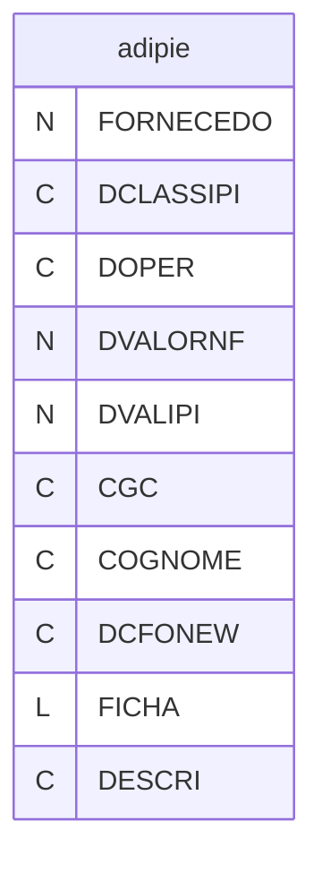
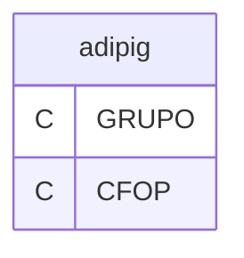
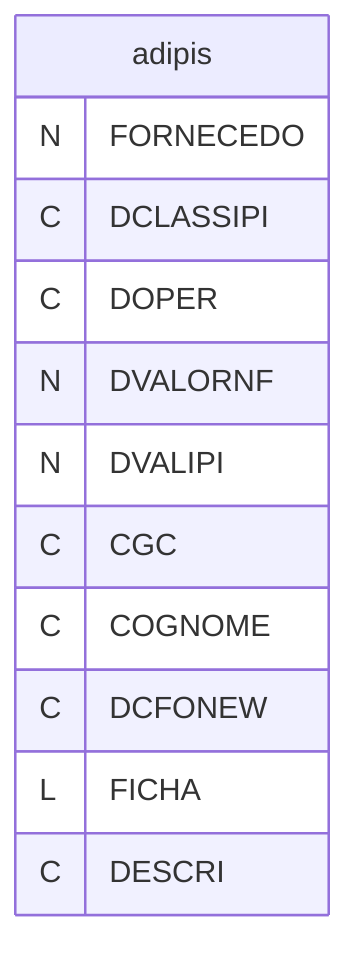
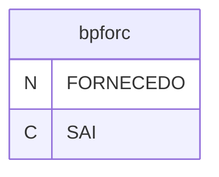
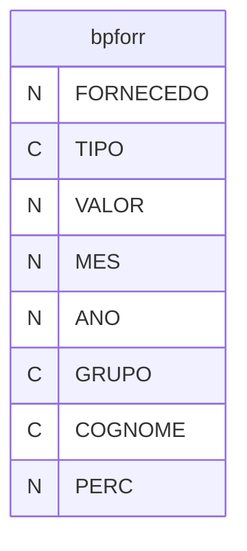
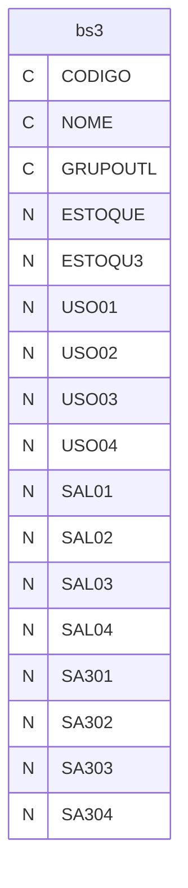

# Dicionario de Estruturas de Dados do Projeto
> Varredura automatica realizada em: 09/09/2026

## Tabela DBF: `adipie`
> **Origem:** `adipie` (Driver: DBFCDX)

| Campo | Tipo | Tam | Dec |
| :--- | :--- | :--- | :--- |
| FORNECEDO | N | 8 | 0 |
| DCLASSIPI | C | 14 | 0 |
| DOPER | C | 3 | 0 |
| DVALORNF | N | 18 | 2 |
| DVALIPI | N | 18 | 2 |
| CGC | C | 18 | 0 |
| COGNOME | C | 20 | 0 |
| DCFONEW | C | 4 | 0 |
| FICHA | L | 1 | 0 |
| DESCRI | C | 60 | 0 |

**Indices vinculados:**
- Tag: `ADIPIE-1` Expressao: `STR(FORNECEDO,8)+DOPER+DCLASSIPI`
- Tag: `ADIPIE-2` Expressao: `STR(FORNECEDO,8)+DCFONEW+DCLASSIPI`
- Tag: `ADIPIE-3` Expressao: `DCFONEW`

---
## Tabela DBF: `adipig`
> **Origem:** `adipig` (Driver: DBFCDX)

| Campo | Tipo | Tam | Dec |
| :--- | :--- | :--- | :--- |
| GRUPO | C | 5 | 0 |
| CFOP | C | 4 | 0 |

**Indices vinculados:**
- Tag: `ADIPIG` Expressao: `GRUPO+CFOP`
- Tag: `ADIPIG-2` Expressao: `CFOP`

---
## Tabela DBF: `adipis`
> **Origem:** `adipis` (Driver: DBFCDX)

| Campo | Tipo | Tam | Dec |
| :--- | :--- | :--- | :--- |
| FORNECEDO | N | 8 | 0 |
| DCLASSIPI | C | 14 | 0 |
| DOPER | C | 3 | 0 |
| DVALORNF | N | 18 | 2 |
| DVALIPI | N | 18 | 2 |
| CGC | C | 18 | 0 |
| COGNOME | C | 20 | 0 |
| DCFONEW | C | 4 | 0 |
| FICHA | L | 1 | 0 |
| DESCRI | C | 60 | 0 |

**Indices vinculados:**
- Tag: `ADIPIS-1` Expressao: `STR(FORNECEDO,8)+DOPER+DCLASSIPI`
- Tag: `ADIPIS-2` Expressao: `STR(FORNECEDO,8)+DCFONEW+DCLASSIPI`
- Tag: `ADIPIS-3` Expressao: `DCFONEW`

---
## Tabela DBF: `bpforc`
> **Origem:** `bpforc` (Driver: DBFCDX)

| Campo | Tipo | Tam | Dec |
| :--- | :--- | :--- | :--- |
| FORNECEDO | N | 8 | 0 |
| SAI | C | 1 | 0 |

**Indices vinculados:**
- Tag: `BPFORC` Expressao: `FORNECEDO`

---
## Tabela DBF: `bpforr`
> **Origem:** `bpforr` (Driver: DBFCDX)

| Campo | Tipo | Tam | Dec |
| :--- | :--- | :--- | :--- |
| FORNECEDO | N | 8 | 0 |
| TIPO | C | 1 | 0 |
| VALOR | N | 18 | 2 |
| MES | N | 2 | 0 |
| ANO | N | 4 | 0 |
| GRUPO | C | 4 | 0 |
| COGNOME | C | 15 | 0 |
| PERC | N | 15 | 6 |

**Indices vinculados:**
- Tag: `BPFORR` Expressao: `STR(ANO,4)+STR(MES,2)+STR(FORNECEDO,8)`

---
## Tabela DBF: `bs3`
> **Origem:** `bs3` (Driver: DBFCDX)

| Campo | Tipo | Tam | Dec |
| :--- | :--- | :--- | :--- |
| CODIGO | C | 12 | 0 |
| NOME | C | 30 | 0 |
| GRUPOUTL | C | 3 | 0 |
| ESTOQUE | N | 10 | 0 |
| ESTOQU3 | N | 10 | 0 |
| USO01 | N | 10 | 0 |
| USO02 | N | 10 | 0 |
| USO03 | N | 10 | 0 |
| USO04 | N | 10 | 0 |
| SAL01 | N | 10 | 0 |
| SAL02 | N | 10 | 0 |
| SAL03 | N | 10 | 0 |
| SAL04 | N | 10 | 0 |
| SA301 | N | 10 | 0 |
| SA302 | N | 10 | 0 |
| SA303 | N | 10 | 0 |
| SA304 | N | 10 | 0 |

**Indices vinculados:**
- Tag: `BS3-1` Expressao: `CODIGO`

---
