# Dicionario de Estruturas de Dados do Projeto
> Varredura automatica realizada em: 09/09/2026

## Tabela DBF: `aut`
> **Origem:** `aut` (Driver: DBFCDX)

| Campo     | Tipo | Tam | Dec |
| :-------- | :--- | :-- | :-- |
| AUT       | N    | 8   | 0   |
| USADA     | L    | 1   | 0   |
| USER      | N    | 8   | 0   |
| MOTIVO    | C    | 150 | 0   |
| MOTIV2    | C    | 150 | 0   |
| CARTA     | C    | 1   | 0   |
| DATA      | D    | 8   | 0   |
| DATABX    | D    | 8   | 0   |
| CRM       | N    | 8   | 0   |
| DATACR    | D    | 8   | 0   |
| FISOBS01  | C    | 80  | 0   |
| FISOBS02  | C    | 80  | 0   |
| FISOBS03  | C    | 80  | 0   |
| LIBPOR    | C    | 15  | 0   |
| LIBFISCAL | C    | 1   | 0   |

**Indices vinculados:**
- Tag: `AUT` Expressao: `AUT`

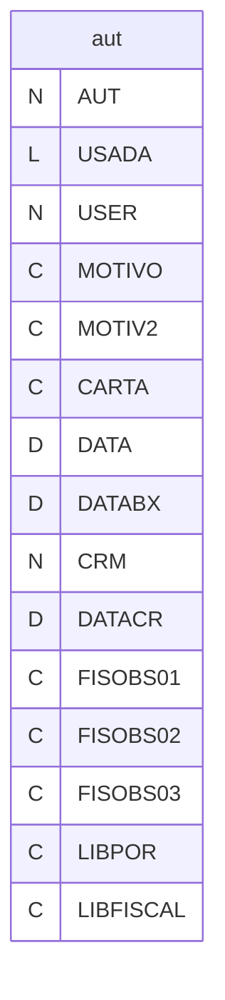

---
## Tabela DBF: `crgec`
> **Origem:** `crgec` (Driver: DBFCDX)

| Campo     | Tipo | Tam | Dec |
| :-------- | :--- | :-- | :-- |
| CRGEX     | N    | 8   | 0   |
| DATA      | D    | 8   | 0   |
| FORNECEDO | N    | 8   | 0   |
| COGNOME   | C    | 20  | 0   |
| NOTA      | C    | 50  | 0   |
| PESONF    | N    | 6   | 0   |
| PESOEC    | N    | 6   | 0   |
| PESOLQ    | N    | 6   | 0   |
| PERCEX    | N    | 8   | 3   |

**Indices vinculados:**
- Tag: `CRGEX` Expressao: `CRGEX`


---
## Tabela DBF: `crgex`
> **Origem:** `crgex` (Driver: DBFCDX)

| Campo | Tipo | Tam | Dec |
| :--- | :--- | :--- | :--- |
| CRGEX | N | 8 | 0 |
| DATA | D | 8 | 0 |
| FORNECEDO | N | 8 | 0 |
| COGNOME | C | 20 | 0 |
| NOTA | C | 50 | 0 |
| PESONF | N | 6 | 0 |
| PESOEC | N | 6 | 0 |
| PESOLQ | N | 6 | 0 |
| PERCEX | N | 8 | 3 |

**Indices vinculados:**
- Tag: `CRGEX` Expressao: `CRGEX`

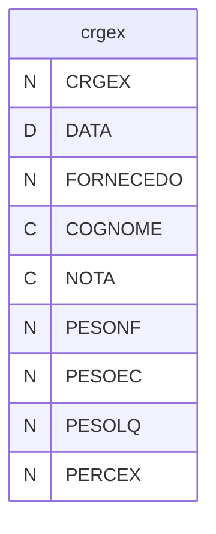

---
## Tabela DBF: `crm`
> **Origem:** `crm` (Driver: DBFCDX)

| Campo | Tipo | Tam | Dec |
| :--- | :--- | :--- | :--- |
| CRM | N | 8 | 0 |
| TIPCAD | C | 1 | 0 |
| CLIFOR | N | 8 | 0 |
| COGNOME | C | 15 | 0 |
| DATA | D | 8 | 0 |
| TIPOE | C | 1 | 0 |
| DESCRI | C | 40 | 0 |
| PEDIDO | C | 20 | 0 |
| NRNOTA | N | 8 | 0 |
| NRNOTB | N | 8 | 0 |
| QTDE | N | 12 | 3 |
| QTDEA | N | 12 | 3 |
| QTDEB | N | 12 | 3 |
| NIVEL | C | 10 | 0 |
| INSP | C | 1 | 0 |
| LAUDO | C | 1 | 0 |
| TECNICO | N | 8 | 0 |
| OBS | C | 100 | 0 |
| CBUSCA | C | 24 | 0 |
| NOMEF | C | 40 | 0 |
| UNID | C | 4 | 0 |
| RIST | N | 8 | 0 |
| RIRM | N | 8 | 0 |
| APLICACAO | C | 30 | 0 |
| PRODUTO | C | 24 | 0 |
| VALOR | N | 12 | 2 |
| GRAVOU | C | 1 | 0 |
| GRAVOUY | C | 1 | 0 |
| PROGRAMA | N | 8 | 2 |
| GRAVAUP | C | 1 | 0 |
| PRPED | N | 5 | 0 |
| PRITE | N | 2 | 0 |
| PRCLI | N | 8 | 0 |
| PEPED | N | 8 | 0 |
| PEITE | N | 3 | 0 |
| CERT | C | 40 | 0 |
| PEREQ | N | 8 | 0 |
| AUT | N | 8 | 0 |
| USERNM | C | 10 | 0 |
| USERDT | D | 8 | 0 |
| USERHT | C | 8 | 0 |
| NRDATA | D | 8 | 0 |
| RASTRO | C | 12 | 0 |
| PRECO | N | 15 | 6 |
| PRECOPR | N | 15 | 6 |
| PRECONF | N | 15 | 6 |
| CLOTECRT | C | 1 | 0 |
| PRECOOK | C | 1 | 0 |
| QTDEPED | N | 12 | 3 |
| PESONFA | N | 9 | 3 |
| PESONFB | N | 9 | 3 |
| PEDCLI | C | 1 | 0 |
| ENTREGA | D | 8 | 0 |
| ENTREG2 | D | 8 | 0 |
| TRIANGULAR | C | 1 | 0 |

**Indices vinculados:**
- Tag: `CRM` Expressao: `CRM`
- Tag: `CRM-2` Expressao: `DATA`
- Tag: `CRM-3` Expressao: `RASTRO`
- Tag: `CRM-4` Expressao: `STR(NRNOTA,8)+STR(CLIFOR,8)`
- Tag: `CRM-5` Expressao: `STR(NRNOTB,8)+STR(CLIFOR,8)`

```mermaid
erDiagram
    crm {
        N CRM
        C TIPCAD
        N CLIFOR
        C COGNOME
        D DATA
        C TIPOE
        C DESCRI
        C PEDIDO
        N NRNOTA
        N NRNOTB
        N QTDE
        N QTDEA
        N QTDEB
        C NIVEL
        C INSP
        C LAUDO
        N TECNICO
        C OBS
        C CBUSCA
        C NOMEF
        C UNID
        N RIST
        N RIRM
        C APLICACAO
        C PRODUTO
        N VALOR
        C GRAVOU
        C GRAVOUY
        N PROGRAMA
        C GRAVAUP
        N PRPED
        N PRITE
        N PRCLI
        N PEPED
        N PEITE
        C CERT
        N PEREQ
        N AUT
        C USERNM
        D USERDT
        C USERHT
        D NRDATA
        C RASTRO
        N PRECO
        N PRECOPR
        N PRECONF
        C CLOTECRT
        C PRECOOK
        N QTDEPED
        N PESONFA
        N PESONFB
        C PEDCLI
        D ENTREGA
        D ENTREG2
        C TRIANGULAR
    }
```

---
## Tabela DBF: `crm3l`
> **Origem:** `crm3l` (Driver: DBFCDX)

| Campo | Tipo | Tam | Dec |
| :--- | :--- | :--- | :--- |
| CODIGO | C | 24 | 0 |
| NVEZES | N | 2 | 0 |
| RACF | N | 8 | 0 |
| DESC01 | C | 90 | 0 |
| DESC02 | C | 90 | 0 |
| DESC03 | C | 90 | 0 |
| DESC04 | C | 90 | 0 |
| DESC05 | C | 90 | 0 |

**Indices vinculados:**
- Tag: `CRM3L` Expressao: `CODIGO`

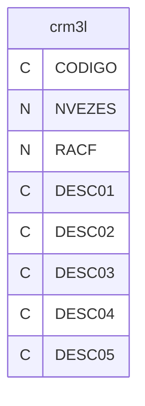

---
## Tabela DBF: `crma`
> **Origem:** `crma` (Driver: DBFCDX)

| Campo | Tipo | Tam | Dec |
| :--- | :--- | :--- | :--- |
| NUMERO | N | 8 | 0 |
| DATA | D | 8 | 0 |
| TIPOENT | C | 1 | 0 |
| CODIGO | C | 24 | 0 |
| FORNECEDO | N | 8 | 0 |
| COGFOR | C | 15 | 0 |
| NF | N | 8 | 0 |
| PRODUTO | C | 24 | 0 |
| CLIENTE | N | 8 | 0 |
| COGCLI | C | 12 | 0 |
| RASTROA | C | 12 | 0 |
| RASTROOK | C | 12 | 0 |
| DATAOK | D | 8 | 0 |
| MOTIVO | C | 3 | 0 |
| CRM | N | 8 | 0 |

**Indices vinculados:**
- Tag: `CRMA-1` Expressao: `NUMERO`
- Tag: `CRMA-2` Expressao: `RASTROA`

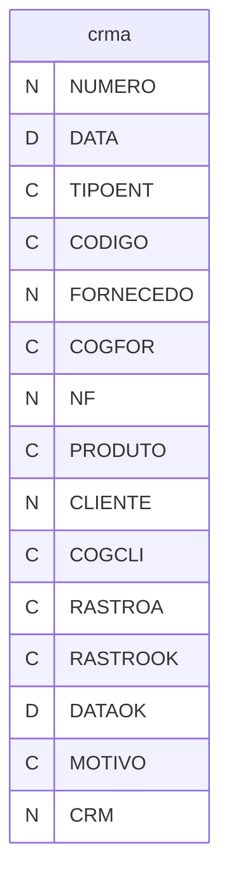

---
## Tabela DBF: `crmar`
> **Origem:** `crmar` (Driver: DBFCDX)

| Campo | Tipo | Tam | Dec |
| :--- | :--- | :--- | :--- |
| TIPOENT | C | 1 | 0 |
| CODIGO | C | 24 | 0 |
| UNIDADE | C | 2 | 0 |
| NOME | C | 100 | 0 |
| NRNOTA | N | 8 | 0 |
| DATA | D | 8 | 0 |
| QTDE | N | 6 | 0 |
| TIPOCLI | C | 1 | 0 |
| FORNECEDO | N | 5 | 0 |
| COGNOME | C | 12 | 0 |
| CRM | N | 8 | 0 |
| AR | N | 8 | 0 |
| ITEM | N | 2 | 0 |
| RIRM | N | 8 | 0 |
| RIST | N | 8 | 0 |
| CODFORN | C | 18 | 0 |
| EMPRESA | C | 2 | 0 |
| CODIGOINT | C | 24 | 0 |
| MC | N | 8 | 0 |

**Indices vinculados:**
- Tag: `CRMAR-1` Expressao: `EMPRESA+STR(AR,8)+STR(ITEM,2)`
- Tag: `CRMAR-2` Expressao: `STR(NRNOTA,8)+STR(FORNECEDO,8)+CODIGO`
- Tag: `CRMAR-3` Expressao: `CODIGOINT`

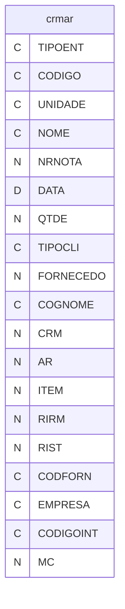

---
## Tabela DBF: `crmcesp`
> **Origem:** `crmcesp` (Driver: DBFCDX)

| Campo | Tipo | Tam | Dec |
| :--- | :--- | :--- | :--- |
| NUMERO | N | 8 | 0 |
| NOME | C | 100 | 0 |
| TIPOENT | C | 1 | 0 |
| CODIGO | C | 24 | 0 |

**Indices vinculados:**
- Tag: `CRMCESP` Expressao: `NUMERO`
- Tag: `CRMCESP2` Expressao: `NOME`
- Tag: `CRMCESP3` Expressao: `CODIGO`

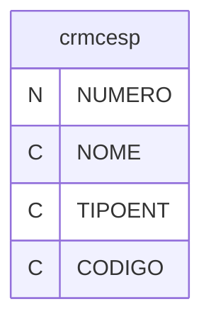

---
## Tabela DBF: `crmdev`
> **Origem:** `crmdev` (Driver: DBFCDX)

| Campo | Tipo | Tam | Dec |
| :--- | :--- | :--- | :--- |
| CRM | N | 8 | 0 |
| TIPCAD | C | 1 | 0 |
| CLIFOR | N | 8 | 0 |
| COGNOME | C | 15 | 0 |
| DATA | D | 8 | 0 |
| TIPOE | C | 1 | 0 |
| DESCRI | C | 40 | 0 |
| PEDIDO | C | 20 | 0 |
| NRNOTA | N | 8 | 0 |
| NRNOTB | N | 8 | 0 |
| QTDE | N | 12 | 3 |
| QTDEA | N | 12 | 3 |
| QTDEB | N | 12 | 3 |
| NIVEL | C | 10 | 0 |
| INSP | C | 1 | 0 |
| LAUDO | C | 1 | 0 |
| TECNICO | N | 8 | 0 |
| OBS | C | 100 | 0 |
| CBUSCA | C | 24 | 0 |
| NOMEF | C | 40 | 0 |
| UNID | C | 4 | 0 |
| RIST | N | 8 | 0 |
| RIRM | N | 8 | 0 |
| APLICACAO | C | 30 | 0 |
| PRODUTO | C | 24 | 0 |
| VALOR | N | 12 | 2 |
| GRAVOU | C | 1 | 0 |
| GRAVOUY | C | 1 | 0 |
| PROGRAMA | N | 8 | 2 |
| GRAVAUP | C | 1 | 0 |
| PRPED | N | 5 | 0 |
| PRITE | N | 2 | 0 |
| PRCLI | N | 8 | 0 |
| PEPED | N | 8 | 0 |
| PEITE | N | 3 | 0 |
| CERT | C | 40 | 0 |
| PEREQ | N | 8 | 0 |
| AUT | N | 8 | 0 |
| USERNM | C | 10 | 0 |
| USERDT | D | 8 | 0 |
| USERHT | C | 8 | 0 |
| NRDATA | D | 8 | 0 |
| RASTRO | C | 12 | 0 |
| PRECO | N | 15 | 6 |
| PRECOPR | N | 15 | 6 |
| PRECONF | N | 15 | 6 |
| CLOTECRT | C | 1 | 0 |
| PRECOOK | C | 1 | 0 |
| QTDEPED | N | 12 | 3 |
| PESONFA | N | 9 | 3 |
| PESONFB | N | 9 | 3 |
| PEDCLI | C | 1 | 0 |
| ENTREGA | D | 8 | 0 |
| ENTREG2 | D | 8 | 0 |
| TRIANGULAR | C | 1 | 0 |

**Indices vinculados:**
- Tag: `CRM` Expressao: `CRM`
- Tag: `CRM-2` Expressao: `DATA`
- Tag: `CRM-3` Expressao: `RASTRO`
- Tag: `CRM-4` Expressao: `STR(NRNOTA,8)+STR(CLIFOR,8)`
- Tag: `CRM-5` Expressao: `STR(NRNOTB,8)+STR(CLIFOR,8)`

```mermaid
erDiagram
    crmdev {
        N CRM
        C TIPCAD
        N CLIFOR
        C COGNOME
        D DATA
        C TIPOE
        C DESCRI
        C PEDIDO
        N NRNOTA
        N NRNOTB
        N QTDE
        N QTDEA
        N QTDEB
        C NIVEL
        C INSP
        C LAUDO
        N TECNICO
        C OBS
        C CBUSCA
        C NOMEF
        C UNID
        N RIST
        N RIRM
        C APLICACAO
        C PRODUTO
        N VALOR
        C GRAVOU
        C GRAVOUY
        N PROGRAMA
        C GRAVAUP
        N PRPED
        N PRITE
        N PRCLI
        N PEPED
        N PEITE
        C CERT
        N PEREQ
        N AUT
        C USERNM
        D USERDT
        C USERHT
        D NRDATA
        C RASTRO
        N PRECO
        N PRECOPR
        N PRECONF
        C CLOTECRT
        C PRECOOK
        N QTDEPED
        N PESONFA
        N PESONFB
        C PEDCLI
        D ENTREGA
        D ENTREG2
        C TRIANGULAR
    }
```

---
## Tabela DBF: `crme01`
> **Origem:** `crme01` (Driver: DBFCDX)

| Campo | Tipo | Tam | Dec |
| :--- | :--- | :--- | :--- |
| RASTRO | C | 10 | 0 |
| DATA | D | 8 | 0 |

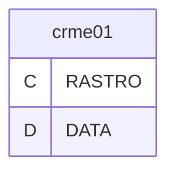

---
## Tabela DBF: `crme02`
> **Origem:** `crme02` (Driver: DBFCDX)

| Campo | Tipo | Tam | Dec |
| :--- | :--- | :--- | :--- |
| RASTRO | C | 12 | 0 |
| DATA | D | 8 | 0 |
| NOME | C | 30 | 0 |
| NOM2 | C | 35 | 0 |
| NOM3 | C | 35 | 0 |
| APLICACAO | C | 50 | 0 |
| FORNECEDOR | N | 8 | 0 |
| RESPO | C | 40 | 0 |
| NRNOTA | N | 8 | 0 |
| NRNOTB | N | 8 | 0 |
| PESONFA | N | 9 | 3 |
| PESONFB | N | 9 | 3 |
| QTDEA | N | 12 | 3 |
| QTDEB | N | 12 | 3 |
| POS | C | 11 | 0 |
| CODIGO | C | 24 | 0 |
| CERT | C | 50 | 0 |

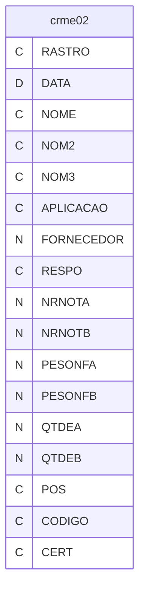

---
## Tabela DBF: `crme03`
> **Origem:** `crme03` (Driver: DBFCDX)

| Campo | Tipo | Tam | Dec |
| :--- | :--- | :--- | :--- |
| ESPE | C | 80 | 0 |
| USUARIO | C | 10 | 0 |
| SETOR | C | 30 | 0 |
| DATA | D | 8 | 0 |
| CODIGO | C | 24 | 0 |
| NOME | C | 40 | 0 |
| NCLI | N | 8 | 0 |
| CLIENTE | C | 30 | 0 |
| RASTRO | C | 12 | 0 |
| QTAMO | N | 12 | 0 |
| REFNUM | N | 8 | 0 |
| CERT | C | 50 | 0 |

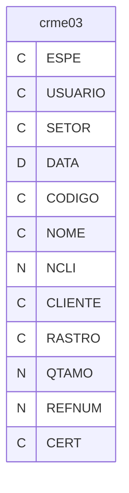

---
## Tabela DBF: `crmebx`
> **Origem:** `crmebx` (Driver: DBFCDX)

| Campo | Tipo | Tam | Dec |
| :--- | :--- | :--- | :--- |
| CODIGO | C | 24 | 0 |
| UNIDADE | C | 2 | 0 |
| NOME | C | 30 | 0 |
| NRNOTAINI | N | 8 | 0 |
| DIGCTR | C | 1 | 0 |
| SERIE | C | 3 | 0 |
| DATAFAT | D | 8 | 0 |
| OSINI | N | 8 | 2 |
| VALORINI | N | 10 | 2 |
| TOTKGINI | N | 9 | 2 |
| NRNOTASAI | N | 8 | 0 |
| TOTKGANT | N | 9 | 2 |
| TOTKGSAI | N | 9 | 2 |
| TOTKGEST | N | 9 | 2 |
| TIPOCLI | C | 1 | 0 |
| CLIENTE | N | 5 | 0 |
| COGNOME | C | 12 | 0 |
| DATASAI | D | 8 | 0 |
| CRM | N | 8 | 0 |
| PESOREF | N | 12 | 5 |
| CLASSIPI | C | 14 | 0 |
| PRECO | N | 10 | 2 |
| TIPOENT | C | 1 | 0 |
| OBS | C | 30 | 0 |
| RASTRO | C | 12 | 0 |
| DIFSALDO | N | 9 | 2 |
| LOCAL | C | 7 | 0 |
| QTDEEMB | N | 2 | 0 |

**Indices vinculados:**
- Tag: `CRMEBX-1` Expressao: `CODIGO+STR(NRNOTAINI,8)+DIGCTR`
- Tag: `CRMEBX-2` Expressao: `STR(NRNOTAINI,8)+CODIGO`
- Tag: `CRMEBX-3` Expressao: `NRNOTAINI`
- Tag: `CRREBX-4` Expressao: `CLIENTE`
- Tag: `CRMEBX-5` Expressao: `OSINI`

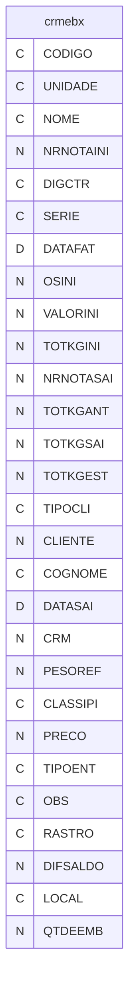

---
## Tabela DBF: `crmens`
> **Origem:** `crmens` (Driver: DBFCDX)

| Campo | Tipo | Tam | Dec |
| :--- | :--- | :--- | :--- |
| CODIGO | C | 10 | 0 |
| NOME | C | 40 | 0 |
| VALOR | N | 12 | 8 |

**Indices vinculados:**
- Tag: `CRMENS` Expressao: `CODIGO`

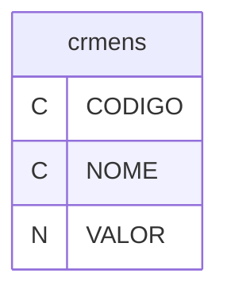

---
## Tabela DBF: `crmest`
> **Origem:** `crmest` (Driver: DBFCDX)

| Campo | Tipo | Tam | Dec |
| :--- | :--- | :--- | :--- |
| CODIGO | C | 24 | 0 |
| UNIDADE | C | 2 | 0 |
| NOME | C | 30 | 0 |
| NRNOTAINI | N | 8 | 0 |
| DIGCTR | C | 1 | 0 |
| SERIE | C | 3 | 0 |
| DATAFAT | D | 8 | 0 |
| OSINI | N | 8 | 2 |
| VALORINI | N | 10 | 2 |
| TOTKGINI | N | 9 | 2 |
| NRNOTASAI | N | 8 | 0 |
| TOTKGANT | N | 9 | 2 |
| TOTKGSAI | N | 9 | 2 |
| TOTKGEST | N | 9 | 2 |
| TIPOCLI | C | 1 | 0 |
| CLIENTE | N | 5 | 0 |
| COGNOME | C | 12 | 0 |
| DATASAI | D | 8 | 0 |
| CRM | N | 8 | 0 |
| PESOREF | N | 12 | 5 |
| CLASSIPI | C | 14 | 0 |
| PRECO | N | 10 | 2 |
| TIPOENT | C | 1 | 0 |
| OBS | C | 30 | 0 |
| RASTRO | C | 12 | 0 |
| DIFSALDO | N | 9 | 2 |
| LOCAL | C | 7 | 0 |
| QTDEEMB | N | 2 | 0 |

**Indices vinculados:**
- Tag: `CRMEST-1` Expressao: `CODIGO+STR(NRNOTAINI,8)+DIGCTR`
- Tag: `CRMEST-2` Expressao: `STR(NRNOTAINI,8)+CODIGO`
- Tag: `CRMEST-3` Expressao: `NRNOTAINI`
- Tag: `CRMEST-4` Expressao: `CLIENTE`
- Tag: `CRMEST-5` Expressao: `OSINI`

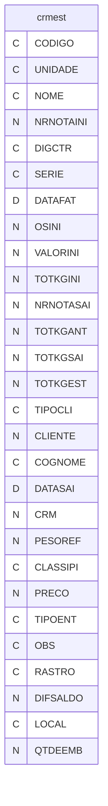

---
## Tabela DBF: `crmfn`
> **Origem:** `crmfn` (Driver: DBFCDX)

| Campo | Tipo | Tam | Dec |
| :--- | :--- | :--- | :--- |
| NUMERO | N | 8 | 0 |
| DATA | D | 8 | 0 |
| RASTRO | C | 12 | 0 |
| FORNECEDO | N | 8 | 0 |
| COGNOME | C | 12 | 0 |
| CODIGO | C | 24 | 0 |
| CLIENTE | N | 8 | 0 |
| PESOUNI | N | 7 | 3 |
| CODMR01 | C | 10 | 0 |
| NOMMR01 | C | 30 | 0 |
| PCEMB | N | 7 | 0 |
| PCEMBQ | N | 7 | 0 |
| QTDEKG | N | 9 | 3 |
| QTDEPC | N | 9 | 0 |

**Indices vinculados:**
- Tag: `CRMFN` Expressao: `NUMERO`
- Tag: `CRMFN-2` Expressao: `DATA`
- Tag: `CRMFN-3` Expressao: `RASTRO`

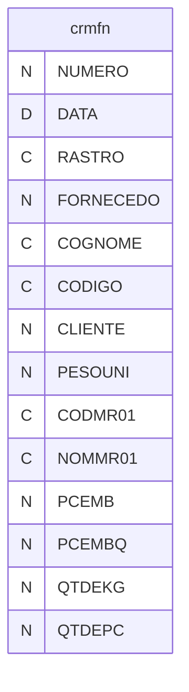

---
## Tabela DBF: `crmgp12`
> **Origem:** `crmgp12` (Driver: DBFCDX)

| Campo | Tipo | Tam | Dec |
| :--- | :--- | :--- | :--- |
| CODIGO | C | 24 | 0 |

**Indices vinculados:**
- Tag: `CRMGP12` Expressao: `CODIGO`

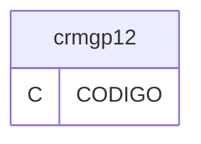

---
## Tabela DBF: `crml`
> **Origem:** `crml` (Driver: DBFCDX)

| Campo | Tipo | Tam | Dec |
| :--- | :--- | :--- | :--- |
| CLIFOR | N | 8 | 0 |
| CODIGO | C | 24 | 0 |
| LOTE | N | 3 | 0 |

**Indices vinculados:**
- Tag: `CRML` Expressao: `STR(CLIFOR,8)+CODIGO`

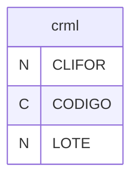

---
## Tabela DBF: `crmmot`
> **Origem:** `crmmot` (Driver: DBFCDX)

| Campo | Tipo | Tam | Dec |
| :--- | :--- | :--- | :--- |
| CODIGO | C | 2 | 0 |
| DIZER | C | 50 | 0 |

**Indices vinculados:**
- Tag: `CRMMOT` Expressao: `CODIGO`

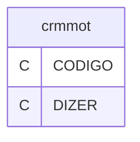

---
## Tabela DBF: `crmnf`
> **Origem:** `crmnf` (Driver: DBFCDX)

| Campo | Tipo | Tam | Dec |
| :--- | :--- | :--- | :--- |
| FORNECEDO | N | 8 | 0 |
| NRNOTA | N | 8 | 0 |
| DATA | D | 8 | 0 |

**Indices vinculados:**
- Tag: `CRMNF` Expressao: `FORNECEDO`

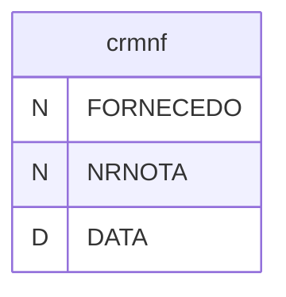

---
## Tabela DBF: `crmr`
> **Origem:** `crmr` (Driver: DBFCDX)

| Campo | Tipo | Tam | Dec |
| :--- | :--- | :--- | :--- |
| RASTRO | C | 10 | 0 |
| RASTRON | N | 8 | 0 |
| RASTROA | N | 4 | 0 |
| CRM | N | 8 | 0 |
| RIRM | N | 8 | 0 |
| RIST | N | 8 | 0 |
| DATAF | D | 8 | 0 |
| OBS | C | 100 | 0 |
| DATA | D | 8 | 0 |
| PRODUTO | C | 50 | 0 |

**Indices vinculados:**
- Tag: `CRMR` Expressao: `RASTRON`

```mermaid
erDiagram
    crmr {
        C RASTRO
        N RASTRON
        N RASTROA
        N CRM
        N RIRM
        N RIST
        D DATAF
        C OBS
        D DATA
        C PRODUTO
    }
```

---
## Tabela DBF: `crmss`
> **Origem:** `crmss` (Driver: DBFCDX)

| Campo | Tipo | Tam | Dec |
| :--- | :--- | :--- | :--- |
| NUMERO | N | 8 | 0 |
| CODIGO | C | 24 | 0 |
| CODIGOINT | C | 24 | 0 |
| NORMA | C | 14 | 0 |
| APLICACAO | C | 30 | 0 |
| FORNECEDO | N | 8 | 0 |
| FORNOME | C | 40 | 0 |
| ESPE | C | 60 | 0 |
| RASTRO | C | 12 | 0 |
| DATA | D | 8 | 0 |
| RIST | N | 8 | 0 |
| AR | N | 8 | 0 |
| ITEM | N | 3 | 0 |
| DATAENV | D | 8 | 0 |
| HORAENV | C | 5 | 0 |

**Indices vinculados:**
- Tag: `CRMSS-1` Expressao: `NUMERO`
- Tag: `CRMSS-2` Expressao: `RASTRO`
- Tag: `CRMSS-3` Expressao: `CODIGO`

```mermaid
erDiagram
    crmss {
        N NUMERO
        C CODIGO
        C CODIGOINT
        C NORMA
        C APLICACAO
        N FORNECEDO
        C FORNOME
        C ESPE
        C RASTRO
        D DATA
        N RIST
        N AR
        N ITEM
        D DATAENV
        C HORAENV
    }
```

---
## Tabela DBF: `mp01i`
> **Origem:** `mp01i` (Driver: DBFCDX)

| Campo | Tipo | Tam | Dec |
| :--- | :--- | :--- | :--- |
| CODIGO | C | 12 | 0 |
| ITEM | N | 3 | 0 |
| ESPE | C | 60 | 0 |
| ENCO | C | 60 | 0 |
| VALPAD | N | 8 | 2 |
| VALMAX | N | 8 | 2 |
| VALMIN | N | 8 | 2 |
| TOLMAX | N | 8 | 2 |
| TOLMIN | N | 8 | 2 |
| UNIDADE | C | 3 | 0 |
| TIPA | C | 3 | 0 |
| UNIDREF | C | 4 | 0 |
| QTDEREF | N | 8 | 2 |

**Indices vinculados:**
- Tag: `MP01I-1` Expressao: `CODIGO+STR(ITEM,3)`

```mermaid
erDiagram
    mp01i {
        C CODIGO
        N ITEM
        C ESPE
        C ENCO
        N VALPAD
        N VALMAX
        N VALMIN
        N TOLMAX
        N TOLMIN
        C UNIDADE
        C TIPA
        C UNIDREF
        N QTDEREF
    }
```

---
## Tabela DBF: `mp01r`
> **Origem:** `mp01r` (Driver: DBFCDX)

| Campo | Tipo | Tam | Dec |
| :--- | :--- | :--- | :--- |
| CODIGO | C | 12 | 0 |
| ITEM | N | 3 | 0 |
| ESPE | C | 60 | 0 |
| ENCO | C | 60 | 0 |
| VALPAD | N | 8 | 2 |
| VALMAX | N | 8 | 2 |
| VALMIN | N | 8 | 2 |
| TOLMAX | N | 8 | 2 |
| TOLMIN | N | 8 | 2 |
| UNIDADE | C | 3 | 0 |
| TIPA | C | 3 | 0 |
| UNIDREF | C | 4 | 0 |
| QTDEREF | N | 8 | 2 |
| CHECADO | C | 1 | 0 |

**Indices vinculados:**
- Tag: `MP01R-1` Expressao: `CODIGO+STR(ITEM,3)`

```mermaid
erDiagram
    mp01r {
        C CODIGO
        N ITEM
        C ESPE
        C ENCO
        N VALPAD
        N VALMAX
        N VALMIN
        N TOLMAX
        N TOLMIN
        C UNIDADE
        C TIPA
        C UNIDREF
        N QTDEREF
        C CHECADO
    }
```

---
## Tabela DBF: `mp02i`
> **Origem:** `mp02i` (Driver: DBFCDX)

| Campo | Tipo | Tam | Dec |
| :--- | :--- | :--- | :--- |
| CODIGO | C | 12 | 0 |
| ITEM | N | 3 | 0 |
| ESPE | C | 60 | 0 |
| ENCO | C | 60 | 0 |
| VALPAD | N | 8 | 2 |
| VALMAX | N | 8 | 2 |
| VALMIN | N | 8 | 2 |
| TOLMAX | N | 8 | 2 |
| TOLMIN | N | 8 | 2 |
| UNIDADE | C | 3 | 0 |
| TIPA | C | 3 | 0 |
| UNIDREF | C | 4 | 0 |
| QTDEREF | N | 8 | 2 |

**Indices vinculados:**
- Tag: `MP02I-1` Expressao: `CODIGO+STR(ITEM,3)`

```mermaid
erDiagram
    mp02i {
        C CODIGO
        N ITEM
        C ESPE
        C ENCO
        N VALPAD
        N VALMAX
        N VALMIN
        N TOLMAX
        N TOLMIN
        C UNIDADE
        C TIPA
        C UNIDREF
        N QTDEREF
    }
```

---
## Tabela DBF: `mp02r`
> **Origem:** `mp02r` (Driver: DBFCDX)

| Campo | Tipo | Tam | Dec |
| :--- | :--- | :--- | :--- |
| CODIGO | C | 12 | 0 |
| ITEM | N | 3 | 0 |
| ESPE | C | 60 | 0 |
| ENCO | C | 60 | 0 |
| VALPAD | N | 8 | 2 |
| VALMAX | N | 8 | 2 |
| VALMIN | N | 8 | 2 |
| TOLMAX | N | 8 | 2 |
| TOLMIN | N | 8 | 2 |
| UNIDADE | C | 3 | 0 |
| TIPA | C | 3 | 0 |
| UNIDREF | C | 4 | 0 |
| QTDEREF | N | 8 | 2 |
| CHECADO | C | 1 | 0 |

**Indices vinculados:**
- Tag: `MP02R-1` Expressao: `CODIGO+STR(ITEM,3)`

```mermaid
erDiagram
    mp02r {
        C CODIGO
        N ITEM
        C ESPE
        C ENCO
        N VALPAD
        N VALMAX
        N VALMIN
        N TOLMAX
        N TOLMIN
        C UNIDADE
        C TIPA
        C UNIDREF
        N QTDEREF
        C CHECADO
    }
```

---
## Tabela DBF: `mp03i`
> **Origem:** `mp03i` (Driver: DBFCDX)

| Campo | Tipo | Tam | Dec |
| :--- | :--- | :--- | :--- |
| CODIGO | C | 24 | 0 |
| ITEM | N | 3 | 0 |
| ESPE | C | 60 | 0 |
| ENCO | C | 60 | 0 |
| VALPAD | N | 8 | 2 |
| VALMAX | N | 8 | 2 |
| VALMIN | N | 8 | 2 |
| TOLMAX | N | 8 | 2 |
| TOLMIN | N | 8 | 2 |
| UNIDADE | C | 3 | 0 |
| TIPA | C | 3 | 0 |
| UNIDREF | C | 4 | 0 |
| QTDEREF | N | 8 | 2 |

**Indices vinculados:**
- Tag: `MP03I-1` Expressao: `CODIGO+STR(ITEM,3)`

```mermaid
erDiagram
    mp03i {
        C CODIGO
        N ITEM
        C ESPE
        C ENCO
        N VALPAD
        N VALMAX
        N VALMIN
        N TOLMAX
        N TOLMIN
        C UNIDADE
        C TIPA
        C UNIDREF
        N QTDEREF
    }
```

---
## Tabela DBF: `mp03r`
> **Origem:** `mp03r` (Driver: DBFCDX)

| Campo | Tipo | Tam | Dec |
| :--- | :--- | :--- | :--- |
| CODIGO | C | 24 | 0 |
| ITEM | N | 3 | 0 |
| ESPE | C | 60 | 0 |
| ENCO | C | 60 | 0 |
| VALPAD | N | 8 | 2 |
| VALMAX | N | 8 | 2 |
| VALMIN | N | 8 | 2 |
| TOLMAX | N | 8 | 2 |
| TOLMIN | N | 8 | 2 |
| UNIDADE | C | 3 | 0 |
| TIPA | C | 3 | 0 |
| UNIDREF | C | 4 | 0 |
| QTDEREF | N | 8 | 2 |
| CHECADO | C | 1 | 0 |

**Indices vinculados:**
- Tag: `MP03R-1` Expressao: `CODIGO+STR(ITEM,3)`

```mermaid
erDiagram
    mp03r {
        C CODIGO
        N ITEM
        C ESPE
        C ENCO
        N VALPAD
        N VALMAX
        N VALMIN
        N TOLMAX
        N TOLMIN
        C UNIDADE
        C TIPA
        C UNIDREF
        N QTDEREF
        C CHECADO
    }
```

---
## Tabela DBF: `mq01i`
> **Origem:** `mq01i` (Driver: DBFCDX)

| Campo | Tipo | Tam | Dec |
| :--- | :--- | :--- | :--- |
| CODIGO | C | 10 | 0 |
| ITEM | N | 3 | 0 |
| ESPE | C | 60 | 0 |
| ENCO | C | 60 | 0 |
| VALPAD | N | 8 | 2 |
| VALMAX | N | 8 | 2 |
| VALMIN | N | 8 | 2 |
| TOLMAX | N | 8 | 2 |
| TOLMIN | N | 8 | 2 |
| UNIDADE | C | 3 | 0 |
| TIPA | C | 3 | 0 |
| UNIDREF | C | 4 | 0 |
| QTDEREF | N | 8 | 2 |

**Indices vinculados:**
- Tag: `MQ01I-1` Expressao: `CODIGO+STR(ITEM,3)`

```mermaid
erDiagram
    mq01i {
        C CODIGO
        N ITEM
        C ESPE
        C ENCO
        N VALPAD
        N VALMAX
        N VALMIN
        N TOLMAX
        N TOLMIN
        C UNIDADE
        C TIPA
        C UNIDREF
        N QTDEREF
    }
```

---
## Tabela DBF: `mq01r`
> **Origem:** `mq01r` (Driver: DBFCDX)

| Campo | Tipo | Tam | Dec |
| :--- | :--- | :--- | :--- |
| CODIGO | C | 10 | 0 |
| ITEM | N | 3 | 0 |
| ESPE | C | 60 | 0 |
| ENCO | C | 60 | 0 |
| VALPAD | N | 8 | 2 |
| VALMAX | N | 8 | 2 |
| VALMIN | N | 8 | 2 |
| TOLMAX | N | 8 | 2 |
| TOLMIN | N | 8 | 2 |
| UNIDADE | C | 3 | 0 |
| TIPA | C | 3 | 0 |
| UNIDREF | C | 4 | 0 |
| QTDEREF | N | 8 | 2 |
| CHECADO | C | 1 | 0 |

**Indices vinculados:**
- Tag: `MQ01R-1` Expressao: `CODIGO+STR(ITEM,3)`

```mermaid
erDiagram
    mq01r {
        C CODIGO
        N ITEM
        C ESPE
        C ENCO
        N VALPAD
        N VALMAX
        N VALMIN
        N TOLMAX
        N TOLMIN
        C UNIDADE
        C TIPA
        C UNIDREF
        N QTDEREF
        C CHECADO
    }
```

---
## Tabela DBF: `mr01i`
> **Origem:** `mr01i` (Driver: DBFCDX)

| Campo | Tipo | Tam | Dec |
| :--- | :--- | :--- | :--- |
| CODIGO | C | 10 | 0 |
| ITEM | N | 3 | 0 |
| ESPE | C | 60 | 0 |
| ENCO | C | 60 | 0 |
| VALPAD | N | 8 | 2 |
| VALMAX | N | 8 | 2 |
| VALMIN | N | 8 | 2 |
| TOLMAX | N | 8 | 2 |
| TOLMIN | N | 8 | 2 |
| UNIDADE | C | 3 | 0 |
| TIPA | C | 3 | 0 |
| UNIDREF | C | 4 | 0 |
| QTDEREF | N | 8 | 2 |

**Indices vinculados:**
- Tag: `MR01I-1` Expressao: `CODIGO+STR(ITEM,3)`

```mermaid
erDiagram
    mr01i {
        C CODIGO
        N ITEM
        C ESPE
        C ENCO
        N VALPAD
        N VALMAX
        N VALMIN
        N TOLMAX
        N TOLMIN
        C UNIDADE
        C TIPA
        C UNIDREF
        N QTDEREF
    }
```

---
## Tabela DBF: `mr01r`
> **Origem:** `mr01r` (Driver: DBFCDX)

| Campo | Tipo | Tam | Dec |
| :--- | :--- | :--- | :--- |
| CODIGO | C | 10 | 0 |
| ITEM | N | 3 | 0 |
| ESPE | C | 60 | 0 |
| ENCO | C | 60 | 0 |
| VALPAD | N | 8 | 2 |
| VALMAX | N | 8 | 2 |
| VALMIN | N | 8 | 2 |
| TOLMAX | N | 8 | 2 |
| TOLMIN | N | 8 | 2 |
| UNIDADE | C | 3 | 0 |
| TIPA | C | 3 | 0 |
| UNIDREF | C | 4 | 0 |
| QTDEREF | N | 8 | 2 |
| CHECADO | C | 1 | 0 |

**Indices vinculados:**
- Tag: `MR01R-1` Expressao: `CODIGO+STR(ITEM,3)`

```mermaid
erDiagram
    mr01r {
        C CODIGO
        N ITEM
        C ESPE
        C ENCO
        N VALPAD
        N VALMAX
        N VALMIN
        N TOLMAX
        N TOLMIN
        C UNIDADE
        C TIPA
        C UNIDREF
        N QTDEREF
        C CHECADO
    }
```

---
## Tabela DBF: `ms01i`
> **Origem:** `ms01i` (Driver: DBFCDX)

| Campo | Tipo | Tam | Dec |
| :--- | :--- | :--- | :--- |
| CODIGO | C | 24 | 0 |
| ITEM | N | 3 | 0 |
| ESPE | C | 60 | 0 |
| ENCO | C | 60 | 0 |
| VALPAD | N | 8 | 2 |
| VALMAX | N | 8 | 2 |
| VALMIN | N | 8 | 2 |
| TOLMAX | N | 8 | 2 |
| TOLMIN | N | 8 | 2 |
| UNIDADE | C | 3 | 0 |
| TIPA | C | 3 | 0 |
| UNIDREF | C | 4 | 0 |
| QTDEREF | N | 8 | 2 |

**Indices vinculados:**
- Tag: `MS01I-1` Expressao: `CODIGO+STR(ITEM,3)`

```mermaid
erDiagram
    ms01i {
        C CODIGO
        N ITEM
        C ESPE
        C ENCO
        N VALPAD
        N VALMAX
        N VALMIN
        N TOLMAX
        N TOLMIN
        C UNIDADE
        C TIPA
        C UNIDREF
        N QTDEREF
    }
```

---
## Tabela DBF: `ms01r`
> **Origem:** `ms01r` (Driver: DBFCDX)

| Campo | Tipo | Tam | Dec |
| :--- | :--- | :--- | :--- |
| CODIGO | C | 24 | 0 |
| ITEM | N | 3 | 0 |
| ESPE | C | 60 | 0 |
| ENCO | C | 60 | 0 |
| VALPAD | N | 8 | 2 |
| VALMAX | N | 8 | 2 |
| VALMIN | N | 8 | 2 |
| TOLMAX | N | 8 | 2 |
| TOLMIN | N | 8 | 2 |
| UNIDADE | C | 3 | 0 |
| TIPA | C | 3 | 0 |
| UNIDREF | C | 4 | 0 |
| QTDEREF | N | 8 | 2 |
| CHECADO | C | 1 | 0 |

**Indices vinculados:**
- Tag: `MS01R-1` Expressao: `CODIGO+STR(ITEM,3)`

```mermaid
erDiagram
    ms01r {
        C CODIGO
        N ITEM
        C ESPE
        C ENCO
        N VALPAD
        N VALMAX
        N VALMIN
        N TOLMAX
        N TOLMIN
        C UNIDADE
        C TIPA
        C UNIDREF
        N QTDEREF
        C CHECADO
    }
```

---
## Tabela DBF: `mt01i`
> **Origem:** `mt01i` (Driver: DBFCDX)

| Campo | Tipo | Tam | Dec |
| :--- | :--- | :--- | :--- |
| CODIGO | C | 10 | 0 |
| ITEM | N | 3 | 0 |
| ESPE | C | 60 | 0 |
| ENCO | C | 60 | 0 |
| VALPAD | N | 8 | 2 |
| VALMAX | N | 8 | 2 |
| VALMIN | N | 8 | 2 |
| TOLMAX | N | 8 | 2 |
| TOLMIN | N | 8 | 2 |
| UNIDADE | C | 3 | 0 |
| TIPA | C | 3 | 0 |
| UNIDREF | C | 4 | 0 |
| QTDEREF | N | 8 | 2 |

**Indices vinculados:**
- Tag: `MT01I-1` Expressao: `CODIGO+STR(ITEM,3)`

```mermaid
erDiagram
    mt01i {
        C CODIGO
        N ITEM
        C ESPE
        C ENCO
        N VALPAD
        N VALMAX
        N VALMIN
        N TOLMAX
        N TOLMIN
        C UNIDADE
        C TIPA
        C UNIDREF
        N QTDEREF
    }
```

---
## Tabela DBF: `mt01r`
> **Origem:** `mt01r` (Driver: DBFCDX)

| Campo | Tipo | Tam | Dec |
| :--- | :--- | :--- | :--- |
| CODIGO | C | 10 | 0 |
| ITEM | N | 3 | 0 |
| ESPE | C | 60 | 0 |
| ENCO | C | 60 | 0 |
| VALPAD | N | 8 | 2 |
| VALMAX | N | 8 | 2 |
| VALMIN | N | 8 | 2 |
| TOLMAX | N | 8 | 2 |
| TOLMIN | N | 8 | 2 |
| UNIDADE | C | 3 | 0 |
| TIPA | C | 3 | 0 |
| UNIDREF | C | 4 | 0 |
| QTDEREF | N | 8 | 2 |
| CHECADO | C | 1 | 0 |

**Indices vinculados:**
- Tag: `MT01R-1` Expressao: `CODIGO+STR(ITEM,3)`

```mermaid
erDiagram
    mt01r {
        C CODIGO
        N ITEM
        C ESPE
        C ENCO
        N VALPAD
        N VALMAX
        N VALMIN
        N TOLMAX
        N TOLMIN
        C UNIDADE
        C TIPA
        C UNIDREF
        N QTDEREF
        C CHECADO
    }
```

---
## Tabela DBF: `mu01i`
> **Origem:** `mu01i` (Driver: DBFCDX)

| Campo | Tipo | Tam | Dec |
| :--- | :--- | :--- | :--- |
| CODIGO | C | 10 | 0 |
| ITEM | N | 3 | 0 |
| ESPE | C | 60 | 0 |
| ENCO | C | 60 | 0 |
| VALPAD | N | 8 | 2 |
| VALMAX | N | 8 | 2 |
| VALMIN | N | 8 | 2 |
| TOLMAX | N | 8 | 2 |
| TOLMIN | N | 8 | 2 |
| UNIDADE | C | 3 | 0 |
| TIPA | C | 3 | 0 |
| UNIDREF | C | 4 | 0 |
| QTDEREF | N | 8 | 2 |

**Indices vinculados:**
- Tag: `MU01I-1` Expressao: `CODIGO+STR(ITEM,3)`

```mermaid
erDiagram
    mu01i {
        C CODIGO
        N ITEM
        C ESPE
        C ENCO
        N VALPAD
        N VALMAX
        N VALMIN
        N TOLMAX
        N TOLMIN
        C UNIDADE
        C TIPA
        C UNIDREF
        N QTDEREF
    }
```

---
## Tabela DBF: `mu01r`
> **Origem:** `mu01r` (Driver: DBFCDX)

| Campo | Tipo | Tam | Dec |
| :--- | :--- | :--- | :--- |
| CODIGO | C | 10 | 0 |
| ITEM | N | 3 | 0 |
| ESPE | C | 60 | 0 |
| ENCO | C | 60 | 0 |
| VALPAD | N | 8 | 2 |
| VALMAX | N | 8 | 2 |
| VALMIN | N | 8 | 2 |
| TOLMAX | N | 8 | 2 |
| TOLMIN | N | 8 | 2 |
| UNIDADE | C | 3 | 0 |
| TIPA | C | 3 | 0 |
| UNIDREF | C | 4 | 0 |
| QTDEREF | N | 8 | 2 |
| CHECADO | C | 1 | 0 |

**Indices vinculados:**
- Tag: `MU01R-1` Expressao: `CODIGO+STR(ITEM,3)`

```mermaid
erDiagram
    mu01r {
        C CODIGO
        N ITEM
        C ESPE
        C ENCO
        N VALPAD
        N VALMAX
        N VALMIN
        N TOLMAX
        N TOLMIN
        C UNIDADE
        C TIPA
        C UNIDREF
        N QTDEREF
        C CHECADO
    }
```

---
## Tabela DBF: `rirm`
> **Origem:** `rirm` (Driver: DBFCDX)

| Campo | Tipo | Tam | Dec |
| :--- | :--- | :--- | :--- |
| RIRM | N | 8 | 0 |
| CLASSI | C | 1 | 0 |
| RASTRO | C | 12 | 0 |
| DESENHO | C | 24 | 0 |
| DESCR | C | 40 | 0 |
| INSTRU | C | 40 | 0 |
| NFORN | N | 8 | 0 |
| FORNE | C | 40 | 0 |
| PEDIDO | C | 8 | 0 |
| NRNOTA | N | 8 | 0 |
| NRNOTB | N | 8 | 0 |
| DATANF | D | 8 | 0 |
| QTDE | N | 12 | 3 |
| CERT | C | 40 | 0 |
| LAUDOF | C | 1 | 0 |
| DATAL | D | 8 | 0 |
| OBS01 | C | 80 | 0 |
| OBS02 | C | 80 | 0 |
| OBS03 | C | 80 | 0 |
| OBS04 | C | 80 | 0 |
| UNID | C | 4 | 0 |
| TIPOENT | C | 1 | 0 |
| APLICACAO | C | 30 | 0 |
| AREA | C | 2 | 0 |
| CARGO | C | 40 | 0 |
| RESPO | C | 40 | 0 |
| CLOTECRT | C | 1 | 0 |
| CRM | N | 8 | 0 |
| DATA | D | 8 | 0 |
| LLAUDO | L | 1 | 0 |
| CONTIG | L | 1 | 0 |
| QTAMO | N | 4 | 0 |
| INSP | C | 1 | 0 |

**Indices vinculados:**
- Tag: `RIRM` Expressao: `RIRM`
- Tag: `RIRM-2` Expressao: `RASTRO`
- Tag: `RIRM-3` Expressao: `DESENHO`
- Tag: `RIRM-4` Expressao: `NRNOTA`
- Tag: `RIRM-5` Expressao: `DATA`

```mermaid
erDiagram
    rirm {
        N RIRM
        C CLASSI
        C RASTRO
        C DESENHO
        C DESCR
        C INSTRU
        N NFORN
        C FORNE
        C PEDIDO
        N NRNOTA
        N NRNOTB
        D DATANF
        N QTDE
        C CERT
        C LAUDOF
        D DATAL
        C OBS01
        C OBS02
        C OBS03
        C OBS04
        C UNID
        C TIPOENT
        C APLICACAO
        C AREA
        C CARGO
        C RESPO
        C CLOTECRT
        N CRM
        D DATA
        L LLAUDO
        L CONTIG
        N QTAMO
        C INSP
    }
```

---
## Tabela DBF: `rirmi`
> **Origem:** `rirmi` (Driver: DBFCDX)

| Campo | Tipo | Tam | Dec |
| :--- | :--- | :--- | :--- |
| RIRM | N | 8 | 0 |
| ITEM | N | 3 | 0 |
| TIPA | C | 3 | 0 |
| QTITEM | N | 4 | 0 |
| ESPE | C | 60 | 0 |
| ENCO | C | 40 | 0 |
| LAUDO | C | 1 | 0 |
| UNIITEM | C | 4 | 0 |
| PULAAPU | C | 1 | 0 |

**Indices vinculados:**
- Tag: `RIRMI` Expressao: `RIRM`

```mermaid
erDiagram
    rirmi {
        N RIRM
        N ITEM
        C TIPA
        N QTITEM
        C ESPE
        C ENCO
        C LAUDO
        C UNIITEM
        C PULAAPU
    }
```

---
## Tabela DBF: `rist`
> **Origem:** `rist` (Driver: DBFCDX)

| Campo | Tipo | Tam | Dec |
| :--- | :--- | :--- | :--- |
| RIST | N | 8 | 0 |
| RASTRO | C | 12 | 0 |
| TIPO | C | 1 | 0 |
| NFORN | N | 8 | 0 |
| FORNE | C | 30 | 0 |
| CLASSI | C | 1 | 0 |
| NF | N | 8 | 0 |
| NFB | N | 8 | 0 |
| DATANF | D | 8 | 0 |
| CERT | C | 40 | 0 |
| CODIGO | C | 24 | 0 |
| DENO | C | 40 | 0 |
| NCLI | N | 8 | 0 |
| CLIENTE | C | 30 | 0 |
| OS | C | 8 | 0 |
| INSP | C | 1 | 0 |
| NIVEL | C | 5 | 0 |
| QTAMO | N | 5 | 0 |
| CORPO | C | 1 | 0 |
| LAUDOF | C | 1 | 0 |
| DATAL | D | 8 | 0 |
| OBS01 | C | 60 | 0 |
| OBS02 | C | 60 | 0 |
| DATA | D | 8 | 0 |
| UNID | C | 4 | 0 |
| APLICACAO | C | 25 | 0 |
| AREA | C | 2 | 0 |
| CARGO | C | 25 | 0 |
| RESPO | C | 40 | 0 |
| CLOTECRT | C | 1 | 0 |
| CRM | N | 8 | 0 |
| LLAUDO | L | 1 | 0 |
| QTDE | N | 10 | 3 |
| CONTIG | L | 1 | 0 |

**Indices vinculados:**
- Tag: `RIST` Expressao: `RIST`
- Tag: `RIST-2` Expressao: `RASTRO`
- Tag: `RIST-3` Expressao: `CODIGO`
- Tag: `RIST-4` Expressao: `NF`
- Tag: `RIST-5` Expressao: `DATA`

```mermaid
erDiagram
    rist {
        N RIST
        C RASTRO
        C TIPO
        N NFORN
        C FORNE
        C CLASSI
        N NF
        N NFB
        D DATANF
        C CERT
        C CODIGO
        C DENO
        N NCLI
        C CLIENTE
        C OS
        C INSP
        C NIVEL
        N QTAMO
        C CORPO
        C LAUDOF
        D DATAL
        C OBS01
        C OBS02
        D DATA
        C UNID
        C APLICACAO
        C AREA
        C CARGO
        C RESPO
        C CLOTECRT
        N CRM
        L LLAUDO
        N QTDE
        L CONTIG
    }
```

---
## Tabela DBF: `risti`
> **Origem:** `risti` (Driver: DBFCDX)

| Campo | Tipo | Tam | Dec |
| :--- | :--- | :--- | :--- |
| RIST | N | 8 | 0 |
| ITEM | N | 3 | 0 |
| ESPE | C | 60 | 0 |
| ENCO | C | 45 | 0 |
| LAUDO | C | 1 | 0 |
| TIPA | C | 3 | 0 |
| DATAENV | D | 8 | 0 |
| HORAENV | C | 5 | 0 |
| DATALAU | D | 8 | 0 |
| PULAAPU | C | 1 | 0 |

**Indices vinculados:**
- Tag: `RIST` Expressao: `RIST`

```mermaid
erDiagram
    risti {
        N RIST
        N ITEM
        C ESPE
        C ENCO
        C LAUDO
        C TIPA
        D DATAENV
        C HORAENV
        D DATALAU
        C PULAAPU
    }
```

---
