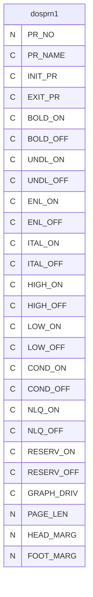
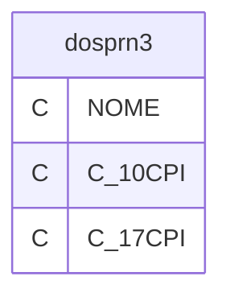

# Dicionario de Estruturas de Dados do Projeto
> Varredura automatica realizada em: 09/09/2026

## Tabela DBF: `dosprn1`
> **Origem:** `dosprn1` (Driver: DBFCDX)

| Campo | Tipo | Tam | Dec |
| :--- | :--- | :--- | :--- |
| PR_NO | N | 3 | 0 |
| PR_NAME | C | 50 | 0 |
| INIT_PR | C | 50 | 0 |
| EXIT_PR | C | 40 | 0 |
| BOLD_ON | C | 40 | 0 |
| BOLD_OFF | C | 40 | 0 |
| UNDL_ON | C | 40 | 0 |
| UNDL_OFF | C | 40 | 0 |
| ENL_ON | C | 40 | 0 |
| ENL_OFF | C | 40 | 0 |
| ITAL_ON | C | 40 | 0 |
| ITAL_OFF | C | 40 | 0 |
| HIGH_ON | C | 40 | 0 |
| HIGH_OFF | C | 40 | 0 |
| LOW_ON | C | 40 | 0 |
| LOW_OFF | C | 40 | 0 |
| COND_ON | C | 40 | 0 |
| COND_OFF | C | 40 | 0 |
| NLQ_ON | C | 40 | 0 |
| NLQ_OFF | C | 40 | 0 |
| RESERV_ON | C | 40 | 0 |
| RESERV_OFF | C | 40 | 0 |
| GRAPH_DRIV | C | 20 | 0 |
| PAGE_LEN | N | 3 | 0 |
| HEAD_MARG | N | 2 | 0 |
| FOOT_MARG | N | 2 | 0 |

**Indices vinculados:**
- Tag: `DOSPRN` Expressao: `PR_NAME`

---
## Tabela DBF: `dosprn2`
> **Origem:** `dosprn2` (Driver: DBFCDX)

| Campo | Tipo | Tam | Dec |
| :--- | :--- | :--- | :--- |
| EMPRESA | C | 15 | 0 |
| IMPRESS | C | 14 | 0 |
| EMULA | C | 14 | 0 |
| INICIALIZA | C | 14 | 0 |
| C10PP | C | 14 | 0 |
| C12PP | C | 14 | 0 |
| CONDON | C | 14 | 0 |
| CONDOFF | C | 14 | 0 |
| SPCPRON | C | 14 | 0 |
| SPCPROFF | C | 14 | 0 |
| SETCHAR | C | 14 | 0 |
| MSTFNT | C | 14 | 0 |
| PRTSTYL | C | 14 | 0 |
| DRAFT | C | 14 | 0 |
| CARTA | C | 14 | 0 |
| L6PP | C | 14 | 0 |
| L8PP | C | 14 | 0 |
| L12PP | C | 14 | 0 |
| SPCLINE | C | 14 | 0 |
| SPCLINEA | C | 14 | 0 |
| NEGRON | C | 14 | 0 |
| NEGROFF | C | 14 | 0 |
| DWIDEON | C | 14 | 0 |
| DWIDEOFF | C | 14 | 0 |
| DHEIGON | C | 14 | 0 |
| DHEIGOFF | C | 14 | 0 |
| ENFATON | C | 14 | 0 |
| ENFATOFF | C | 14 | 0 |
| BOLDON | C | 14 | 0 |
| BOLDOFF | C | 14 | 0 |
| SUBSCRON | C | 14 | 0 |
| SUBSCROFF | C | 14 | 0 |
| ITALON | C | 14 | 0 |
| ITALOFF | C | 14 | 0 |
| SUPSCRON | C | 14 | 0 |
| SUPSCROFF | C | 14 | 0 |
| SUB1SCRON | C | 14 | 0 |
| SUB1SCROFF | C | 14 | 0 |
| SKPON | C | 14 | 0 |
| SKPOFF | C | 14 | 0 |
| UNIPRT | C | 14 | 0 |
| BIPRT | C | 14 | 0 |
| SVCURSOR | C | 14 | 0 |
| RTCURSOR | C | 14 | 0 |
| PGTAM | C | 14 | 0 |
| PGLIN | C | 14 | 0 |
| TABSTOP | C | 14 | 0 |
| MARGTOP | C | 14 | 0 |
| MARGBOTT | C | 14 | 0 |
| MARGLEFT | C | 14 | 0 |
| MARGRIGHT | C | 14 | 0 |
| MVABSVLOC | C | 14 | 0 |
| MVRELVLOC | C | 14 | 0 |
| MVABSHLOC | C | 14 | 0 |
| MVRELHLOC | C | 14 | 0 |
| INTCHSPHMI | C | 14 | 0 |
| C11PP | C | 14 | 0 |
| C13PP | C | 14 | 0 |
| C14PP | C | 14 | 0 |
| C16PP | C | 14 | 0 |
| C20PP | C | 14 | 0 |
| EXPAND01 | C | 14 | 0 |
| EXPAND02 | C | 14 | 0 |
| EXPAND03 | C | 14 | 0 |
| EXPAND04 | C | 14 | 0 |

**Indices vinculados:**
- Tag: `DOSPRN2` Expressao: `EMPRESA+IMPRESS`

```mermaid
erDiagram
    dosprn2 {
        C EMPRESA
        C IMPRESS
        C EMULA
        C INICIALIZA
        C C10PP
        C C12PP
        C CONDON
        C CONDOFF
        C SPCPRON
        C SPCPROFF
        C SETCHAR
        C MSTFNT
        C PRTSTYL
        C DRAFT
        C CARTA
        C L6PP
        C L8PP
        C L12PP
        C SPCLINE
        C SPCLINEA
        C NEGRON
        C NEGROFF
        C DWIDEON
        C DWIDEOFF
        C DHEIGON
        C DHEIGOFF
        C ENFATON
        C ENFATOFF
        C BOLDON
        C BOLDOFF
        C SUBSCRON
        C SUBSCROFF
        C ITALON
        C ITALOFF
        C SUPSCRON
        C SUPSCROFF
        C SUB1SCRON
        C SUB1SCROFF
        C SKPON
        C SKPOFF
        C UNIPRT
        C BIPRT
        C SVCURSOR
        C RTCURSOR
        C PGTAM
        C PGLIN
        C TABSTOP
        C MARGTOP
        C MARGBOTT
        C MARGLEFT
        C MARGRIGHT
        C MVABSVLOC
        C MVRELVLOC
        C MVABSHLOC
        C MVRELHLOC
        C INTCHSPHMI
        C C11PP
        C C13PP
        C C14PP
        C C16PP
        C C20PP
        C EXPAND01
        C EXPAND02
        C EXPAND03
        C EXPAND04
    }
```

---
## Tabela DBF: `dosprn3`
> **Origem:** `dosprn3` (Driver: DBFCDX)

| Campo | Tipo | Tam | Dec |
| :--- | :--- | :--- | :--- |
| NOME | C | 22 | 0 |
| C_10CPI | C | 20 | 0 |
| C_17CPI | C | 20 | 0 |

**Indices vinculados:**
- Tag: `NOME` Expressao: `NOME`

---
