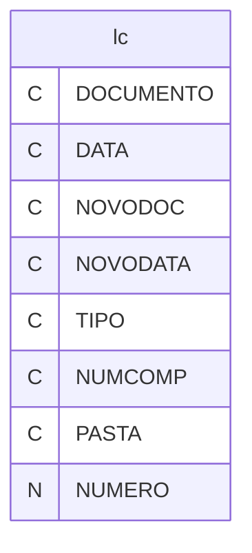
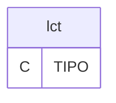

# Dicionario de Estruturas de Dados do Projeto
> Varredura automatica realizada em: 09/09/2026

## Tabela DBF: `lc`
> **Origem:** `lc` (Driver: DBFCDX)

| Campo | Tipo | Tam | Dec |
| :--- | :--- | :--- | :--- |
| DOCUMENTO | C | 20 | 0 |
| DATA | C | 10 | 0 |
| NOVODOC | C | 40 | 0 |
| NOVODATA | C | 10 | 0 |
| TIPO | C | 20 | 0 |
| NUMCOMP | C | 10 | 0 |
| PASTA | C | 10 | 0 |
| NUMERO | N | 10 | 0 |

**Indices vinculados:**
- Tag: `DOCUMENTO` Expressao: `DOCUMENTO`
- Tag: `NOVODOC` Expressao: `NOVODOC`
- Tag: `TIPONUMERO` Expressao: `TIPO+STR(NUMERO,20)`

---
## Tabela DBF: `lct`
> **Origem:** `lct` (Driver: DBFCDX)

| Campo | Tipo | Tam | Dec |
| :--- | :--- | :--- | :--- |
| TIPO | C | 20 | 0 |

**Indices vinculados:**
- Tag: `TIPO` Expressao: `TIPO`

---
