# Dicionario de Estruturas de Dados do Projeto
> Varredura automatica realizada em: 09/09/2026

## Tabela DBF: `cs`
> **Origem:** `cs` (Driver: DBFCDX)

| Campo | Tipo | Tam | Dec |
| :--- | :--- | :--- | :--- |
| CS | N | 8 | 0 |
| DATA | D | 8 | 0 |
| TIPO | C | 1 | 0 |
| FERRAM | C | 24 | 0 |
| NOME | C | 40 | 0 |
| TECNICO | N | 8 | 0 |
| TECNOME | C | 40 | 0 |
| QTDEBASE | N | 12 | 0 |
| QTDESALDO | N | 12 | 0 |
| QTDEPED | N | 12 | 0 |
| QTDEURG | N | 12 | 0 |
| DATASALDO | D | 8 | 0 |
| DATAPED | D | 8 | 0 |
| DATAURG | D | 8 | 0 |
| QTDETOT | N | 12 | 0 |
| HRBAS | N | 9 | 2 |
| HRTOT | N | 9 | 2 |
| HRPRE | N | 9 | 2 |
| HRURG | N | 9 | 2 |
| HRSAL | N | 9 | 2 |
| DATHPED | D | 8 | 0 |
| DATHURG | D | 8 | 0 |
| DATHSAL | D | 8 | 0 |
| LANCADA | L | 1 | 0 |
| LANCDAT | D | 8 | 0 |
| LANCUSR | N | 8 | 0 |

**Indices vinculados:**
- Tag: `CS` Expressao: `CS`

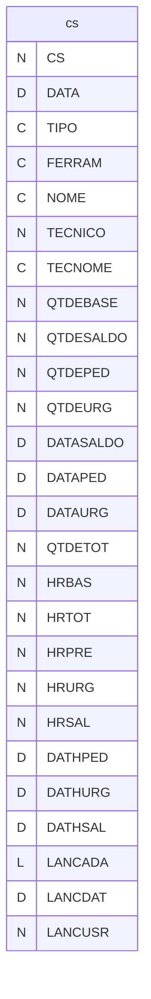

---
## Tabela DBF: `fapu`
> **Origem:** `fapu` (Driver: DBFCDX)

| Campo | Tipo | Tam | Dec |
| :--- | :--- | :--- | :--- |
| SEQ | N | 3 | 0 |
| DINI | D | 8 | 0 |
| DFIM | D | 8 | 0 |
| APURADO | L | 1 | 0 |
| PCPLIB | L | 1 | 0 |
| PCPNUM | N | 8 | 0 |
| PCPDAT | D | 8 | 0 |

**Indices vinculados:**
- Tag: `FAPU` Expressao: `SEQ`

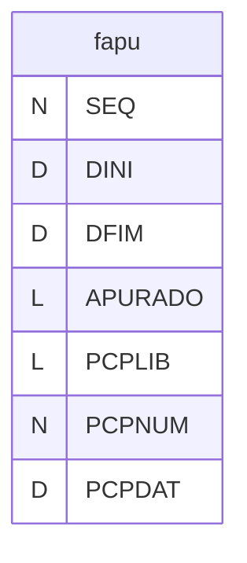

---
## Tabela DBF: `fapubai`
> **Origem:** `fapubai` (Driver: DBFCDX)

| Campo | Tipo | Tam | Dec |
| :--- | :--- | :--- | :--- |
| SEQ | N | 3 | 0 |
| FERRAM | C | 24 | 0 |
| QTDE | N | 12 | 0 |
| HORAS | N | 9 | 2 |

**Indices vinculados:**
- Tag: `FAPUBAI` Expressao: `STR(SEQ,3)+FERRAM`

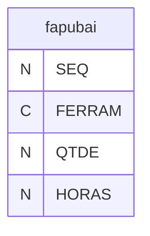

---
## Tabela DBF: `fapufer`
> **Origem:** `fapufer` (Driver: DBFCDX)

| Campo | Tipo | Tam | Dec |
| :--- | :--- | :--- | :--- |
| SEQ | N | 3 | 0 |
| FERRAM | C | 24 | 0 |
| QTDE | N | 12 | 0 |
| HORAS | N | 9 | 2 |

**Indices vinculados:**
- Tag: `FAPUFER` Expressao: `STR(SEQ,3)+FERRAM`
- Tag: `FAPUFER2` Expressao: `FERRAM`

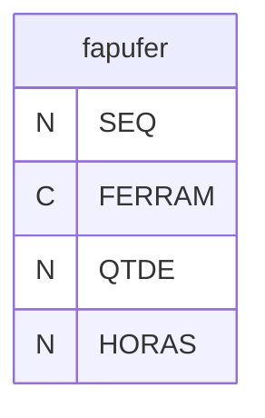

---
## Tabela DBF: `fapui`
> **Origem:** `fapui` (Driver: DBFCDX)

| Campo | Tipo | Tam | Dec |
| :--- | :--- | :--- | :--- |
| SEQ | N | 3 | 0 |
| FERRAM | C | 24 | 0 |
| QTDE | N | 12 | 0 |
| HORAS | N | 9 | 2 |

**Indices vinculados:**
- Tag: `FAPUI` Expressao: `SEQ`

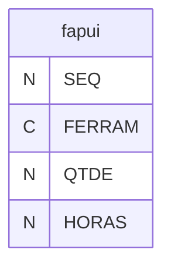

---
## Tabela DBF: `fapumaq`
> **Origem:** `fapumaq` (Driver: DBFCDX)

| Campo | Tipo | Tam | Dec |
| :--- | :--- | :--- | :--- |
| SEQ | N | 3 | 0 |
| FERRAM | C | 4 | 0 |
| QTDE | N | 12 | 0 |
| HORAS | N | 9 | 2 |

**Indices vinculados:**
- Tag: `FAPUMAQ` Expressao: `STR(SEQ,3)+FERRAM`
- Tag: `FAPUMAQ2` Expressao: `FERRAM`

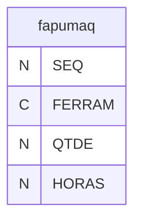

---
## Tabela DBF: `fe02`
> **Origem:** `fe02` (Driver: DBFCDX)

| Campo | Tipo | Tam | Dec |
| :--- | :--- | :--- | :--- |
| TIPO | C | 24 | 0 |
| CODIGO | C | 20 | 0 |
| ANO | N | 4 | 0 |
| MES | N | 2 | 0 |
| USO | N | 16 | 5 |

**Indices vinculados:**
- Tag: `FE02-1` Expressao: `TIPO+CODIGO+STR(ANO,4)+STR(MES,2)`

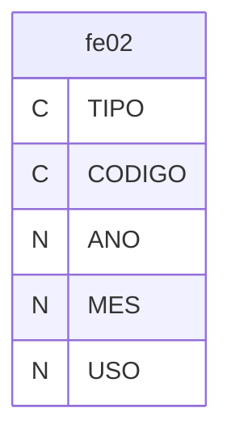

---
## Tabela DBF: `fe99`
> **Origem:** `fe99` (Driver: DBFCDX)

| Campo | Tipo | Tam | Dec |
| :--- | :--- | :--- | :--- |
| ARQUIVO | C | 8 | 0 |
| DOCUMENTO | C | 40 | 0 |
| OPERACAO | C | 1 | 0 |
| USUARIO | C | 5 | 0 |
| QTDE | N | 12 | 3 |
| OLDQTDE | N | 12 | 3 |
| NUMERO | N | 8 | 0 |
| DATA | D | 8 | 0 |
| CODIGO | C | 24 | 0 |
| RASTRO | C | 6 | 0 |
| ESTQXXX | N | 12 | 3 |
| ESTQYYY | N | 12 | 3 |

**Indices vinculados:**
- Tag: `FE99-1` Expressao: `ARQUIVO+DOCUMENTO`
- Tag: `FE99-2` Expressao: `CODIGO+DTOS(DATA)`

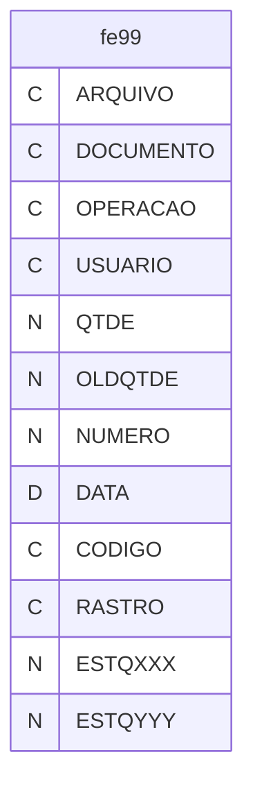

---
## Tabela DBF: `fergi`
> **Origem:** `fergi` (Driver: DBFCDX)

| Campo | Tipo | Tam | Dec |
| :--- | :--- | :--- | :--- |
| FERRAM | C | 24 | 0 |
| CODIGO | C | 20 | 0 |
| NOME | C | 40 | 0 |
| DESENHO | C | 40 | 0 |
| SAIMIN | N | 12 | 3 |
| ESTQMIN | N | 12 | 3 |
| ESTQENT | N | 12 | 3 |
| ESTQSAI | N | 12 | 3 |
| ESTQINI | N | 12 | 3 |
| ESTQSAL | N | 12 | 3 |
| DIASENT | N | 3 | 0 |
| DIASEST | N | 3 | 0 |
| DATABALAN | D | 8 | 0 |
| DATMIN | D | 8 | 0 |
| MINDI | N | 12 | 3 |
| MININD | N | 12 | 3 |
| CAUTO | N | 12 | 3 |
| CCM | N | 15 | 6 |
| NOM2 | C | 1 | 0 |
| UNIDADE | C | 2 | 0 |

**Indices vinculados:**
- Tag: `FERGI` Expressao: `FERRAM`
- Tag: `FERGI-2` Expressao: `FERRAM+CODIGO`

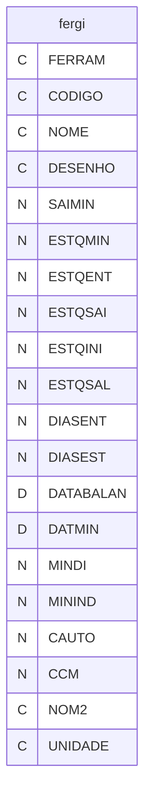

---
## Tabela DBF: `fergrp`
> **Origem:** `fergrp` (Driver: DBFCDX)

| Campo | Tipo | Tam | Dec |
| :--- | :--- | :--- | :--- |
| GRUPO | C | 24 | 0 |

**Indices vinculados:**
- Tag: `FERGRP` Expressao: `GRUPO`

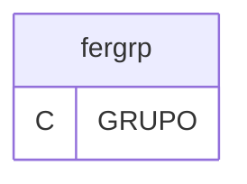

---
## Tabela DBF: `ferhg`
> **Origem:** `ferhg` (Driver: DBFCDX)

| Campo | Tipo | Tam | Dec |
| :--- | :--- | :--- | :--- |
| OS | N | 8 | 0 |
| CODFERR | C | 24 | 0 |
| CODME01 | C | 4 | 0 |
| DATA | D | 8 | 0 |
| SEQ | N | 3 | 0 |
| SSQ | N | 3 | 0 |
| TIPSER | C | 1 | 0 |
| SERVICO | C | 255 | 0 |

**Indices vinculados:**
- Tag: `OS` Expressao: `OS`
- Tag: `CODFERR` Expressao: `CODFERR`

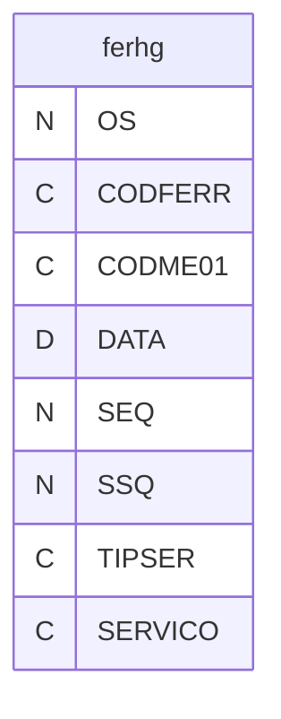

---
## Tabela DBF: `ferhgi`
> **Origem:** `ferhgi` (Driver: DBFCDX)

| Campo | Tipo | Tam | Dec |
| :--- | :--- | :--- | :--- |
| OS | N | 10 | 0 |
| DATA | D | 8 | 0 |
| HINI | N | 5 | 2 |
| HFIM | N | 5 | 2 |
| HGAS | N | 5 | 2 |
| OBS | C | 255 | 0 |

**Indices vinculados:**
- Tag: `OS` Expressao: `OS`

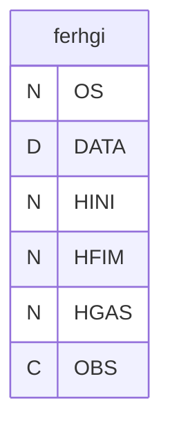

---
## Tabela DBF: `fernf`
> **Origem:** `fernf` (Driver: DBFCDX)

| Campo | Tipo | Tam | Dec |
| :--- | :--- | :--- | :--- |
| FERRAM | C | 24 | 0 |
| TIPO | C | 2 | 0 |
| NRNOTA | N | 8 | 0 |
| DTNOTA | D | 8 | 0 |
| VLNOTA | N | 12 | 2 |
| TIPCAD | C | 1 | 0 |
| CLIFOR | N | 8 | 0 |
| CLICOG | C | 12 | 0 |
| OBS | C | 70 | 0 |

**Indices vinculados:**
- Tag: `FERNF` Expressao: `FERRAM+STR(NRNOTA,8)`
- Tag: `FERNF-2` Expressao: `FERRAM`

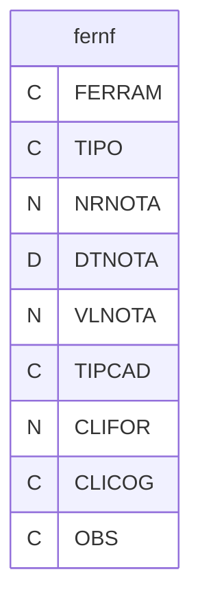

---
## Tabela DBF: `feros`
> **Origem:** `feros` (Driver: DBFCDX)

| Campo | Tipo | Tam | Dec |
| :--- | :--- | :--- | :--- |
| FEROS | N | 8 | 0 |
| REVISAO | C | 1 | 0 |
| CHAVE | C | 9 | 0 |
| CLIENTE | N | 8 | 0 |
| COGCLI | C | 12 | 0 |
| FERRAM | C | 24 | 0 |
| NOME | C | 40 | 0 |
| DATAOS | D | 8 | 0 |
| DATAPE | D | 8 | 0 |
| DATANF | D | 8 | 0 |
| DATAPRZ | D | 8 | 0 |
| NRNOTA | N | 8 | 0 |
| VALORMER | N | 10 | 2 |
| VALORICM | N | 10 | 2 |
| VALORIPI | N | 10 | 2 |
| VALORTOT | N | 10 | 2 |
| BASEICM | N | 10 | 2 |
| BASEIPI | N | 10 | 2 |
| ICM | N | 5 | 2 |
| IPI | N | 5 | 2 |
| CONSUMO | C | 1 | 0 |
| SOMANF | C | 1 | 0 |
| QTDE | N | 2 | 0 |
| PRECO | N | 10 | 2 |
| OBS | C | 240 | 0 |
| CODIPI | C | 2 | 0 |
| CLASSIPI | C | 10 | 0 |
| PEDIDOCLI | C | 20 | 0 |
| ANTIGO | N | 8 | 0 |
| PPAPPREV | D | 8 | 0 |
| PPAPDATA | D | 8 | 0 |
| GP11PREV | D | 8 | 0 |
| GP11DATA | D | 8 | 0 |
| ADTODATA | D | 8 | 0 |
| ADTOVALOR | N | 12 | 2 |
| OBS2 | C | 254 | 0 |
| TIPO | C | 1 | 0 |
| NFPGVCTO | D | 8 | 0 |

**Indices vinculados:**
- Tag: `FEROS-1` Expressao: `CHAVE`
- Tag: `FEROS-2` Expressao: `FERRAM`
- Tag: `FEROS-3` Expressao: `STR(CLIENTE,8)+FERRAM`
- Tag: `FEROS-4` Expressao: `PEDIDOCLI`

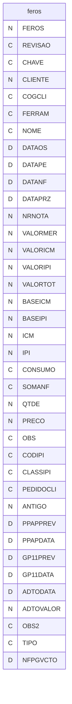

---
## Tabela DBF: `ferram`
> **Origem:** `ferram` (Driver: DBFCDX)

| Campo | Tipo | Tam | Dec |
| :--- | :--- | :--- | :--- |
| FERRAM | C | 24 | 0 |
| GRUPO | C | 24 | 0 |
| NUMERO | N | 8 | 0 |
| NOME | C | 40 | 0 |
| CLIENTE | N | 8 | 0 |
| COGCLI | C | 12 | 0 |
| SITUACAO | C | 1 | 0 |
| OBS | C | 50 | 0 |
| DATAATV | D | 8 | 0 |
| DATADES | D | 8 | 0 |
| DATADEV | D | 8 | 0 |
| DATAOUT | D | 8 | 0 |
| CLASSE | C | 1 | 0 |
| QTDEBASE | N | 9 | 0 |
| QTDESALDO | N | 8 | 0 |
| QTDEPED | N | 8 | 0 |
| QTDEURG | N | 8 | 0 |
| DATASALDO | D | 8 | 0 |
| DATAPED | D | 8 | 0 |
| DATAURG | D | 8 | 0 |
| TIPOFER | C | 1 | 0 |
| QTDETOT | N | 10 | 0 |
| HRBAS | N | 9 | 2 |
| HRTOT | N | 10 | 2 |
| HRPRE | N | 7 | 2 |
| HRURG | N | 7 | 2 |
| HRSAL | N | 9 | 2 |
| DATHPED | D | 8 | 0 |
| DATHURG | D | 8 | 0 |
| DATHSAL | D | 8 | 0 |
| PREVER | C | 1 | 0 |
| VDBAS | N | 7 | 0 |
| VDPRE | N | 9 | 0 |
| VDURG | N | 9 | 0 |
| VDDPRE | D | 8 | 0 |
| VDDURG | D | 8 | 0 |
| VDHBAS | N | 9 | 2 |
| VDHPRE | N | 10 | 2 |
| VDHURG | N | 10 | 2 |
| VDHDPRE | D | 8 | 0 |
| VDHDURG | D | 8 | 0 |
| PROPRIA | C | 1 | 0 |
| NAEMPRESA | C | 1 | 0 |
| VISUALNUM | N | 8 | 0 |
| VISUALNOM | C | 40 | 0 |
| VISUALOBS | C | 50 | 0 |
| MEDA | N | 7 | 3 |
| MEDB | N | 7 | 3 |
| MEDC | N | 7 | 3 |
| MEDD | N | 7 | 3 |
| MEDH | N | 7 | 3 |
| PESO | N | 7 | 3 |
| CONTABIL | C | 8 | 0 |
| CODMP01 | C | 12 | 0 |
| PECA | C | 24 | 0 |
| SEQ | N | 3 | 0 |
| SSQ | N | 3 | 0 |
| OPERN | C | 40 | 0 |
| PECAN | C | 40 | 0 |
| PRENSA | C | 4 | 0 |
| PRENSAN | C | 40 | 0 |
| ALTURA | C | 30 | 0 |
| ALMOFADA | C | 20 | 0 |
| PINOS | C | 30 | 0 |
| MATCOD | C | 24 | 0 |
| MATNOM | C | 100 | 0 |
| LARG | C | 30 | 0 |
| ESPMAT | C | 30 | 0 |
| PASSOFER | C | 25 | 0 |
| PECAROL | C | 5 | 0 |
| PRATILE | C | 5 | 0 |
| USADEMI | C | 1 | 0 |
| USADISP | C | 1 | 0 |
| OBST01 | C | 40 | 0 |
| DATAT | D | 8 | 0 |
| ESQTIP | C | 1 | 0 |
| ESQL01 | C | 8 | 0 |
| ESQL02 | C | 8 | 0 |
| ESQL03 | C | 8 | 0 |
| ESQL04 | C | 8 | 0 |
| ESQL05 | C | 8 | 0 |
| ESQL06 | C | 8 | 0 |
| ESQL07 | C | 8 | 0 |
| ESQL08 | C | 8 | 0 |
| MEDIARO | N | 5 | 0 |
| PF | N | 8 | 0 |

**Indices vinculados:**
- Tag: `FERRAM` Expressao: `FERRAM`
- Tag: `FERRAM2` Expressao: `GRUPO`
- Tag: `FERRAM3` Expressao: `NUMERO`

```mermaid
erDiagram
    ferram {
        C FERRAM
        C GRUPO
        N NUMERO
        C NOME
        N CLIENTE
        C COGCLI
        C SITUACAO
        C OBS
        D DATAATV
        D DATADES
        D DATADEV
        D DATAOUT
        C CLASSE
        N QTDEBASE
        N QTDESALDO
        N QTDEPED
        N QTDEURG
        D DATASALDO
        D DATAPED
        D DATAURG
        C TIPOFER
        N QTDETOT
        N HRBAS
        N HRTOT
        N HRPRE
        N HRURG
        N HRSAL
        D DATHPED
        D DATHURG
        D DATHSAL
        C PREVER
        N VDBAS
        N VDPRE
        N VDURG
        D VDDPRE
        D VDDURG
        N VDHBAS
        N VDHPRE
        N VDHURG
        D VDHDPRE
        D VDHDURG
        C PROPRIA
        C NAEMPRESA
        N VISUALNUM
        C VISUALNOM
        C VISUALOBS
        N MEDA
        N MEDB
        N MEDC
        N MEDD
        N MEDH
        N PESO
        C CONTABIL
        C CODMP01
        C PECA
        N SEQ
        N SSQ
        C OPERN
        C PECAN
        C PRENSA
        C PRENSAN
        C ALTURA
        C ALMOFADA
        C PINOS
        C MATCOD
        C MATNOM
        C LARG
        C ESPMAT
        C PASSOFER
        C PECAROL
        C PRATILE
        C USADEMI
        C USADISP
        C OBST01
        D DATAT
        C ESQTIP
        C ESQL01
        C ESQL02
        C ESQL03
        C ESQL04
        C ESQL05
        C ESQL06
        C ESQL07
        C ESQL08
        N MEDIARO
        N PF
    }
```

---
## Tabela DBF: `ferrami`
> **Origem:** `ferrami` (Driver: DBFCDX)

| Campo | Tipo | Tam | Dec |
| :--- | :--- | :--- | :--- |
| FERRAM | C | 24 | 0 |
| ITEM | N | 3 | 0 |
| LIN01 | C | 80 | 0 |

**Indices vinculados:**
- Tag: `FERRAMI` Expressao: `FERRAM`

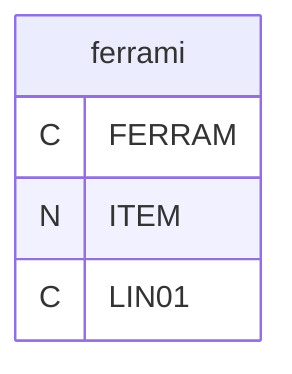

---
## Tabela DBF: `lvf`
> **Origem:** `lvf` (Driver: DBFCDX)

| Campo | Tipo | Tam | Dec |
| :--- | :--- | :--- | :--- |
| LVF | N | 8 | 0 |
| FERRAM | C | 24 | 0 |
| AREA | C | 2 | 0 |
| DESCRI | C | 40 | 0 |
| ACESSOR | C | 50 | 0 |
| NOME | C | 40 | 0 |
| CLIENTE | N | 8 | 0 |
| CLINOME | C | 50 | 0 |
| DATA | D | 8 | 0 |
| TECNICO | N | 8 | 0 |
| TECNOME | C | 40 | 0 |
| OBS01 | C | 60 | 0 |
| OBS02 | C | 60 | 0 |
| OBS03 | C | 60 | 0 |
| OBS04 | C | 60 | 0 |
| OBS05 | C | 60 | 0 |
| RO | N | 8 | 0 |

**Indices vinculados:**
- Tag: `LVF` Expressao: `LVF`

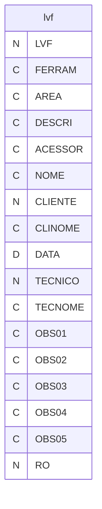

---
## Tabela DBF: `lvfi`
> **Origem:** `lvfi` (Driver: DBFCDX)

| Campo | Tipo | Tam | Dec |
| :--- | :--- | :--- | :--- |
| LVF | N | 8 | 0 |
| ITEM | N | 2 | 0 |
| DESCRI | C | 50 | 0 |
| OPER01 | C | 1 | 0 |
| OPER02 | C | 1 | 0 |

**Indices vinculados:**
- Tag: `LVFI` Expressao: `LVF`

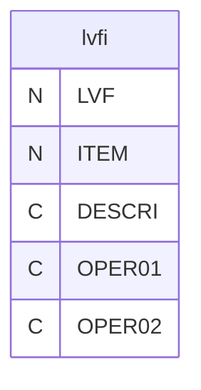

---
## Tabela DBF: `lvfp`
> **Origem:** `lvfp` (Driver: DBFCDX)

| Campo | Tipo | Tam | Dec |
| :--- | :--- | :--- | :--- |
| ITEM | N | 2 | 0 |
| DESCRI | C | 60 | 0 |
| GRUPO | C | 1 | 0 |

**Indices vinculados:**
- Tag: `LVFP` Expressao: `ITEM`

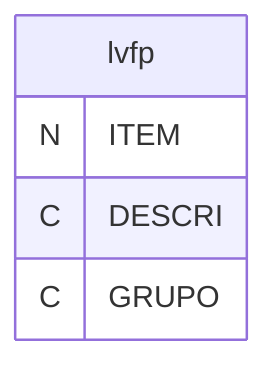

---
## Tabela DBF: `lvm`
> **Origem:** `lvm` (Driver: DBFCDX)

| Campo | Tipo | Tam | Dec |
| :--- | :--- | :--- | :--- |
| LVM | N | 8 | 0 |
| NUMERO | C | 24 | 0 |
| NOME | C | 40 | 0 |
| DATA | D | 8 | 0 |
| SETOR | C | 10 | 0 |
| ACESSOR | C | 20 | 0 |
| CONTABIL | C | 8 | 0 |
| FABRICANTE | C | 20 | 0 |
| MODELO | C | 20 | 0 |
| TECNICO | N | 8 | 0 |
| TECNOME | C | 40 | 0 |
| OBS01 | C | 60 | 0 |
| OBS02 | C | 60 | 0 |
| OBS03 | C | 60 | 0 |
| OBS04 | C | 60 | 0 |
| OBS05 | C | 60 | 0 |
| RO | N | 8 | 0 |
| HORAS | N | 6 | 2 |

**Indices vinculados:**
- Tag: `LVM` Expressao: `LVM`

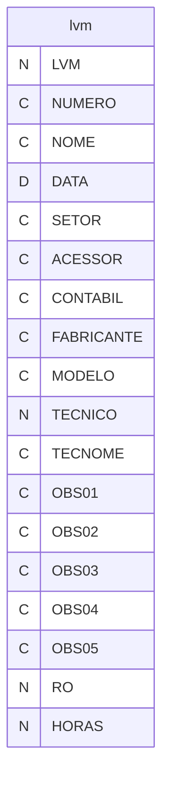

---
## Tabela DBF: `lvmi`
> **Origem:** `lvmi` (Driver: DBFCDX)

| Campo | Tipo | Tam | Dec |
| :--- | :--- | :--- | :--- |
| LVM | N | 8 | 0 |
| ITEM | N | 2 | 0 |
| DESCRI | C | 150 | 0 |
| OPER01 | C | 1 | 0 |
| OPER02 | C | 1 | 0 |
| OPER03 | C | 1 | 0 |

**Indices vinculados:**
- Tag: `LVMI` Expressao: `LVM`

```mermaid
erDiagram
    lvmi {
        N LVM
        N ITEM
        C DESCRI
        C OPER01
        C OPER02
        C OPER03
    }
```

---
## Tabela DBF: `lvmp`
> **Origem:** `lvmp` (Driver: DBFCDX)

| Campo | Tipo | Tam | Dec |
| :--- | :--- | :--- | :--- |
| ITEM | N | 2 | 0 |
| DESCRI | C | 200 | 0 |
| GRUPO | C | 3 | 0 |

**Indices vinculados:**
- Tag: `LVMP` Expressao: `STR(ITEM,2)+GRUPO`

```mermaid
erDiagram
    lvmp {
        N ITEM
        C DESCRI
        C GRUPO
    }
```

---
## Tabela DBF: `mapu`
> **Origem:** `mapu` (Driver: DBFCDX)

| Campo | Tipo | Tam | Dec |
| :--- | :--- | :--- | :--- |
| SEQ | N | 3 | 0 |
| DINI | D | 8 | 0 |
| DFIM | D | 8 | 0 |
| APURADO | L | 1 | 0 |
| PCPLIB | L | 1 | 0 |
| PCPNUM | N | 8 | 0 |
| PCPDAT | D | 8 | 0 |

**Indices vinculados:**
- Tag: `MAPU` Expressao: `SEQ`

```mermaid
erDiagram
    mapu {
        N SEQ
        D DINI
        D DFIM
        L APURADO
        L PCPLIB
        N PCPNUM
        D PCPDAT
    }
```

---
## Tabela DBF: `mapubai`
> **Origem:** `mapubai` (Driver: DBFCDX)

| Campo | Tipo | Tam | Dec |
| :--- | :--- | :--- | :--- |
| SEQ | N | 3 | 0 |
| FERRAM | C | 4 | 0 |
| QTDE | N | 12 | 0 |
| HORAS | N | 9 | 2 |

**Indices vinculados:**
- Tag: `MAPUBAI` Expressao: `STR(SEQ,3)+FERRAM`

```mermaid
erDiagram
    mapubai {
        N SEQ
        C FERRAM
        N QTDE
        N HORAS
    }
```

---
## Tabela DBF: `mapui`
> **Origem:** `mapui` (Driver: DBFCDX)

| Campo | Tipo | Tam | Dec |
| :--- | :--- | :--- | :--- |
| SEQ | N | 3 | 0 |
| FERRAM | C | 4 | 0 |
| QTDE | N | 12 | 0 |
| HORAS | N | 9 | 2 |

**Indices vinculados:**
- Tag: `MUPUI` Expressao: `SEQ`

```mermaid
erDiagram
    mapui {
        N SEQ
        C FERRAM
        N QTDE
        N HORAS
    }
```

---
## Tabela DBF: `me01cr`
> **Origem:** `me01cr` (Driver: DBFCDX)

| Campo | Tipo | Tam | Dec |
| :--- | :--- | :--- | :--- |
| CODIGO | C | 4 | 0 |
| NOME | C | 40 | 0 |
| PROGRAMA | D | 8 | 0 |
| EFETUADA | D | 8 | 0 |
| LVM | N | 8 | 0 |
| ANO | N | 4 | 0 |
| CANO | C | 4 | 0 |

**Indices vinculados:**
- Tag: `ME01CR` Expressao: `CODIGO+DTOS(PROGRAMA)`

```mermaid
erDiagram
    me01cr {
        C CODIGO
        C NOME
        D PROGRAMA
        D EFETUADA
        N LVM
        N ANO
        C CANO
    }
```

---
## Tabela DBF: `rl`
> **Origem:** `rl` (Driver: DBFCDX)

| Campo | Tipo | Tam | Dec |
| :--- | :--- | :--- | :--- |
| RL | N | 8 | 0 |
| DATA | D | 8 | 0 |

**Indices vinculados:**
- Tag: `RL` Expressao: `RL`

```mermaid
erDiagram
    rl {
        N RL
        D DATA
    }
```

---
## Tabela DBF: `rli`
> **Origem:** `rli` (Driver: DBFCDX)

| Campo | Tipo | Tam | Dec |
| :--- | :--- | :--- | :--- |
| RL | N | 8 | 0 |
| CODME01 | C | 5 | 0 |
| LUB01 | C | 1 | 0 |
| LUB02 | C | 1 | 0 |
| LUB03 | C | 1 | 0 |
| LUB04 | C | 1 | 0 |
| LUB05 | C | 1 | 0 |

**Indices vinculados:**
- Tag: `RL` Expressao: `RL`

```mermaid
erDiagram
    rli {
        N RL
        C CODME01
        C LUB01
        C LUB02
        C LUB03
        C LUB04
        C LUB05
    }
```

---
## Tabela DBF: `ro`
> **Origem:** `ro` (Driver: DBFCDX)

| Campo | Tipo | Tam | Dec |
| :--- | :--- | :--- | :--- |
| RO | N | 8 | 0 |
| AREA | C | 2 | 0 |
| DESCRI | C | 20 | 0 |
| FERRAM | C | 24 | 0 |
| NOME | C | 40 | 0 |
| DATA | D | 8 | 0 |
| TECNICO | N | 8 | 0 |
| TECNOME | C | 40 | 0 |
| HORA | N | 5 | 2 |
| TIPO | C | 1 | 0 |
| TIPORO | C | 1 | 0 |
| DEFEITO | C | 80 | 0 |
| DEFEIT2 | C | 40 | 0 |
| DEFEIT3 | C | 40 | 0 |
| SOLUCAO | C | 200 | 0 |
| SOLUCA2 | C | 80 | 0 |
| SOLUCA3 | C | 80 | 0 |
| SOLUCA4 | C | 80 | 0 |
| SM | N | 8 | 0 |
| QTDESALDO | N | 8 | 0 |
| QTDEPED | N | 8 | 0 |
| QTDEURG | N | 8 | 0 |
| DATASALDO | D | 8 | 0 |
| DATAPED | D | 8 | 0 |
| DATAURG | D | 8 | 0 |
| CLIENTE | N | 8 | 0 |
| CLINOME | C | 50 | 0 |
| CONCLUIDA | L | 1 | 0 |
| QTDETOT | N | 10 | 0 |
| HRBAS | N | 10 | 2 |
| HRTOT | N | 9 | 2 |
| HRPRE | N | 7 | 2 |
| HRURG | N | 7 | 2 |
| HRSAL | N | 9 | 2 |
| DATHPED | D | 8 | 0 |
| DATHURG | D | 8 | 0 |
| DATHSAL | D | 8 | 0 |
| REQNUM | N | 8 | 0 |
| REQNOME | C | 40 | 0 |
| ZERO | N | 1 | 0 |
| DATAPAR | D | 8 | 0 |
| HORAPAR | N | 5 | 2 |
| HORAINI | N | 5 | 2 |
| HORAFIM | N | 5 | 2 |
| DATAINI | D | 8 | 0 |
| DATAFIM | D | 8 | 0 |
| HORAPINI | N | 5 | 2 |
| DIASANT | N | 5 | 0 |
| DIASPAI | N | 5 | 0 |
| DIASAVO | N | 5 | 0 |

**Indices vinculados:**
- Tag: `RO` Expressao: `RO`
- Tag: `RO-2` Expressao: `SM`
- Tag: `RO-3` Expressao: `TIPO+FERRAM+DTOS(DATA)`
- Tag: `RO-4` Expressao: `TIPO+FERRAM+DTOS(DATAINI)`
- Tag: `RO-5` Expressao: `TIPO+FERRAM+DTOS(DATAFIM)`

```mermaid
erDiagram
    ro {
        N RO
        C AREA
        C DESCRI
        C FERRAM
        C NOME
        D DATA
        N TECNICO
        C TECNOME
        N HORA
        C TIPO
        C TIPORO
        C DEFEITO
        C DEFEIT2
        C DEFEIT3
        C SOLUCAO
        C SOLUCA2
        C SOLUCA3
        C SOLUCA4
        N SM
        N QTDESALDO
        N QTDEPED
        N QTDEURG
        D DATASALDO
        D DATAPED
        D DATAURG
        N CLIENTE
        C CLINOME
        L CONCLUIDA
        N QTDETOT
        N HRBAS
        N HRTOT
        N HRPRE
        N HRURG
        N HRSAL
        D DATHPED
        D DATHURG
        D DATHSAL
        N REQNUM
        C REQNOME
        N ZERO
        D DATAPAR
        N HORAPAR
        N HORAINI
        N HORAFIM
        D DATAINI
        D DATAFIM
        N HORAPINI
        N DIASANT
        N DIASPAI
        N DIASAVO
    }
```

---
## Tabela DBF: `roapud`
> **Origem:** `roapud` (Driver: DBFCDX)

| Campo | Tipo | Tam | Dec |
| :--- | :--- | :--- | :--- |
| DIAINI | D | 8 | 0 |
| DIAFIM | D | 8 | 0 |

```mermaid
erDiagram
    roapud {
        D DIAINI
        D DIAFIM
    }
```

---
## Tabela DBF: `roi`
> **Origem:** `roi` (Driver: DBFCDX)

| Campo | Tipo | Tam | Dec |
| :--- | :--- | :--- | :--- |
| RO | N | 8 | 0 |
| CODIGO | C | 20 | 0 |
| QTDE | N | 8 | 0 |

**Indices vinculados:**
- Tag: `ROI` Expressao: `RO`

```mermaid
erDiagram
    roi {
        N RO
        C CODIGO
        N QTDE
    }
```

---
## Tabela DBF: `sm`
> **Origem:** `sm` (Driver: DBFCDX)

| Campo | Tipo | Tam | Dec |
| :--- | :--- | :--- | :--- |
| SM | N | 8 | 0 |
| DATA | D | 8 | 0 |
| TIPO | C | 1 | 0 |
| CODIGO | C | 24 | 0 |
| NOME | C | 40 | 0 |
| CLIENTE | N | 8 | 0 |
| CLINOME | C | 50 | 0 |
| DEF01 | C | 80 | 0 |
| DEF02 | C | 30 | 0 |
| DATAPP | D | 8 | 0 |
| PRIOR | C | 1 | 0 |
| RO | N | 8 | 0 |
| CONCLUIDA | L | 1 | 0 |
| REQNUM | N | 8 | 0 |
| REQNOME | C | 40 | 0 |
| HORAPINI | N | 5 | 2 |
| DATAPAR | D | 8 | 0 |

**Indices vinculados:**
- Tag: `SM` Expressao: `SM`

```mermaid
erDiagram
    sm {
        N SM
        D DATA
        C TIPO
        C CODIGO
        C NOME
        N CLIENTE
        C CLINOME
        C DEF01
        C DEF02
        D DATAPP
        C PRIOR
        N RO
        L CONCLUIDA
        N REQNUM
        C REQNOME
        N HORAPINI
        D DATAPAR
    }
```

---
