# Dicionario de Estruturas de Dados do Projeto
> Varredura automatica realizada em: 09/09/2026

## Tabela DBF: `anp`
> **Origem:** `anp` (Driver: DBFCDX)

| Campo | Tipo | Tam | Dec |
| :--- | :--- | :--- | :--- |
| CODIGO | C | 30 | 0 |
| DESCRICAO | C | 254 | 0 |
| DT_INI | D | 8 | 0 |
| DT_FIN | D | 8 | 0 |

**Indices vinculados:**
- Tag: `CODIGO` Expressao: `CODIGO`

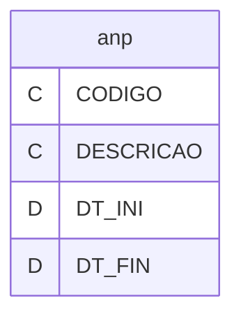

---
## Tabela DBF: `cartaobandeira`
> **Origem:** `cartaobandeira` (Driver: DBFCDX)

| Campo | Tipo | Tam | Dec |
| :--- | :--- | :--- | :--- |
| CODIGO | C | 2 | 0 |
| NOME | C | 20 | 0 |
| DT_INI | D | 8 | 0 |
| DT_FIN | D | 8 | 0 |

**Indices vinculados:**
- Tag: `CODIGO` Expressao: `CODIGO`

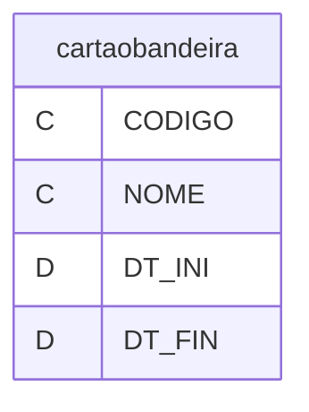

---
## Tabela DBF: `cest`
> **Origem:** `cest` (Driver: DBFCDX)

| Campo | Tipo | Tam | Dec |
| :--- | :--- | :--- | :--- |
| CODIGO | C | 7 | 0 |
| NCM | C | 8 | 0 |
| DESCRICAO | C | 255 | 0 |
| SEGMENTO | C | 2 | 0 |

**Indices vinculados:**
- Tag: `CODIGO` Expressao: `CODIGO`

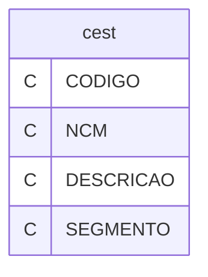

---
## Tabela DBF: `cest_ncm`
> **Origem:** `cest_ncm` (Driver: DBFCDX)

| Campo | Tipo | Tam | Dec |
| :--- | :--- | :--- | :--- |
| CEST_ID | C | 7 | 0 |
| NCM_ID | C | 8 | 0 |
| TAMANHO | C | 1 | 0 |
| FAIXA_I | C | 8 | 0 |
| FAIXA_F | C | 8 | 0 |
| CEST_SEGME | C | 2 | 0 |

**Indices vinculados:**
- Tag: `CEST_NCM01` Expressao: `CEST_ID`
- Tag: `CEST_NCM02` Expressao: `NCM_ID`
- Tag: `CEST_NCM03` Expressao: `CEST_SEGME`
- Tag: `CEST_NCM04` Expressao: `CEST_SEGME+NCM_ID`

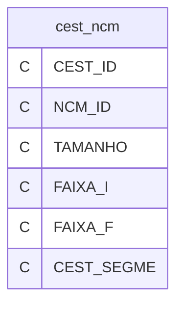

---
## Tabela DBF: `cest_segmento`
> **Origem:** `cest_segmento` (Driver: DBFCDX)

| Campo | Tipo | Tam | Dec |
| :--- | :--- | :--- | :--- |
| ID | C | 2 | 0 |
| ANEXO | C | 10 | 0 |
| DESCRICAO | C | 120 | 0 |

**Indices vinculados:**
- Tag: `SEGMENTO01` Expressao: `ID`
- Tag: `SEGMENTO02` Expressao: `DESCRICAO`

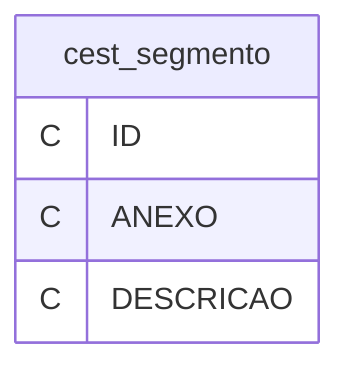

---
## Tabela DBF: `cl_enq_ipi`
> **Origem:** `cl_enq_ipi` (Driver: DBFCDX)

| Campo | Tipo | Tam | Dec |
| :--- | :--- | :--- | :--- |
| CODIGO | C | 30 | 0 |
| DESCRICAO | C | 254 | 0 |
| DT_INI | D | 8 | 0 |
| DT_FIN | D | 8 | 0 |

**Indices vinculados:**
- Tag: `CODIGO` Expressao: `CODIGO`

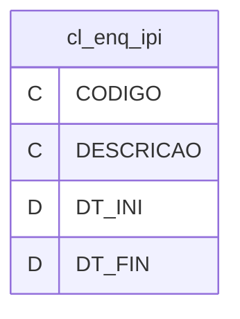

---
## Tabela DBF: `cst_cofins`
> **Origem:** `cst_cofins` (Driver: DBFCDX)

| Campo | Tipo | Tam | Dec |
| :--- | :--- | :--- | :--- |
| CODIGO | C | 2 | 0 |
| NOME | C | 150 | 0 |
| DT_INI | D | 8 | 0 |
| DT_FIN | D | 8 | 0 |

**Indices vinculados:**
- Tag: `CODIGO` Expressao: `CODIGO`
- Tag: `NOME` Expressao: `NOME`

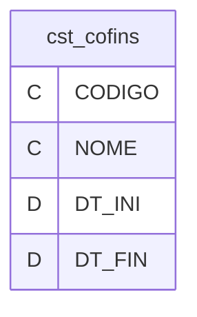

---
## Tabela DBF: `cst_icm`
> **Origem:** `cst_icm` (Driver: DBFCDX)

| Campo | Tipo | Tam | Dec |
| :--- | :--- | :--- | :--- |
| CODIGO | C | 3 | 0 |
| NOME | C | 150 | 0 |
| DT_INI | D | 8 | 0 |
| DT_FIN | D | 8 | 0 |

**Indices vinculados:**
- Tag: `CODIGO` Expressao: `CODIGO`
- Tag: `NOME` Expressao: `NOME`

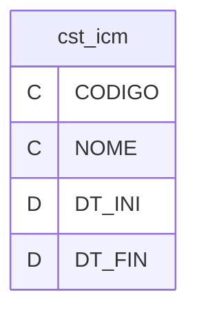

---
## Tabela DBF: `cst_icms`
> **Origem:** `cst_icms` (Driver: DBFCDX)

| Campo | Tipo | Tam | Dec |
| :--- | :--- | :--- | :--- |
| CODIGO | C | 30 | 0 |
| NOME | C | 254 | 0 |
| DT_INI | D | 8 | 0 |
| DT_FIN | D | 8 | 0 |

**Indices vinculados:**
- Tag: `CODIGO` Expressao: `CODIGO`

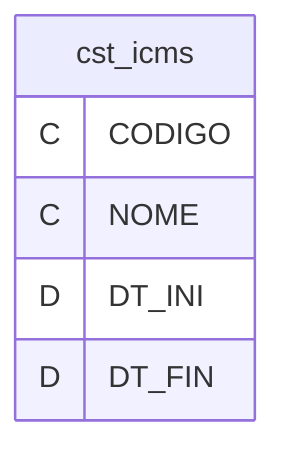

---
## Tabela DBF: `cst_ipi`
> **Origem:** `cst_ipi` (Driver: DBFCDX)

| Campo | Tipo | Tam | Dec |
| :--- | :--- | :--- | :--- |
| CODIGO | C | 2 | 0 |
| NOME | C | 150 | 0 |
| DT_INI | D | 8 | 0 |
| DT_FIN | D | 8 | 0 |

**Indices vinculados:**
- Tag: `CODIGO` Expressao: `CODIGO`
- Tag: `NOME` Expressao: `NOME`

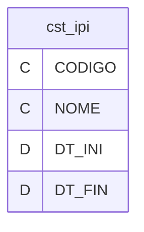

---
## Tabela DBF: `cst_pis`
> **Origem:** `cst_pis` (Driver: DBFCDX)

| Campo | Tipo | Tam | Dec |
| :--- | :--- | :--- | :--- |
| CODIGO | C | 2 | 0 |
| NOME | C | 150 | 0 |
| DT_INI | D | 8 | 0 |
| DT_FIN | D | 8 | 0 |

**Indices vinculados:**
- Tag: `CODIGO` Expressao: `CODIGO`
- Tag: `NOME` Expressao: `NOME`

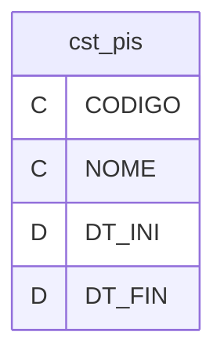

---
## Tabela DBF: `ctecret`
> **Origem:** `ctecret` (Driver: DBFCDX)

| Campo | Tipo | Tam | Dec |
| :--- | :--- | :--- | :--- |
| CODIGO | C | 3 | 0 |
| DESCRICAO | C | 120 | 0 |

**Indices vinculados:**
- Tag: `NFECRET` Expressao: `CODIGO`

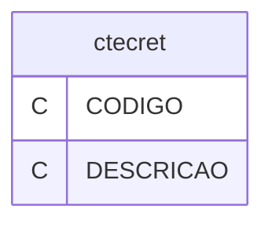

---
## Tabela DBF: `efdtprod`
> **Origem:** `efdtprod` (Driver: DBFCDX)

| Campo | Tipo | Tam | Dec |
| :--- | :--- | :--- | :--- |
| CODIGO | C | 2 | 0 |
| NOME | C | 30 | 0 |

**Indices vinculados:**
- Tag: `EFDPROD` Expressao: `CODIGO`

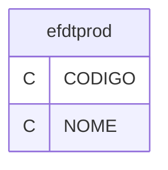

---
## Tabela DBF: `fi_cai`
> **Origem:** `fi_cai` (Driver: DBFCDX)

| Campo | Tipo | Tam | Dec |
| :--- | :--- | :--- | :--- |
| SEQ | N | 8 | 0 |
| DATA | D | 8 | 0 |
| DESCR | C | 30 | 0 |
| CREDITO | N | 12 | 2 |
| DEBITO | N | 12 | 2 |
| SALDO | N | 15 | 2 |
| CONTA | C | 11 | 0 |

**Indices vinculados:**
- Tag: `FI_CAI` Expressao: `SEQ`

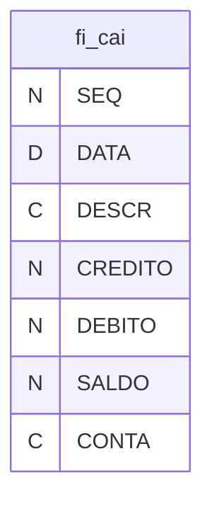

---
## Tabela DBF: `fi_cdipam`
> **Origem:** `fi_cdipam` (Driver: DBFCDX)

| Campo | Tipo | Tam | Dec |
| :--- | :--- | :--- | :--- |
| CODIGO | C | 8 | 0 |
| NOME | C | 35 | 0 |
| UF | C | 2 | 0 |
| UFIBGE | C | 2 | 0 |
| DIPAM | C | 4 | 0 |

**Indices vinculados:**
- Tag: `FI_CDIPAM` Expressao: `CODIGO`
- Tag: `FI_CDIPAM2` Expressao: `UF+NOME`

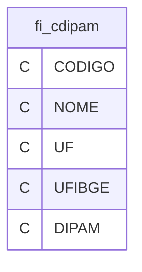

---
## Tabela DBF: `fi_ciap`
> **Origem:** `fi_ciap` (Driver: DBFCDX)

| Campo | Tipo | Tam | Dec |
| :--- | :--- | :--- | :--- |
| CIAP | N | 8 | 0 |
| ATIVO | C | 10 | 0 |
| NOME | C | 40 | 0 |
| FORNECEDO | N | 8 | 0 |
| FORNOME | C | 40 | 0 |
| NRNOTA | N | 8 | 0 |
| NRITEM | N | 2 | 0 |
| LRE | C | 3 | 0 |
| LREF | C | 3 | 0 |
| NRENTREGA | D | 8 | 0 |
| VALORICM | N | 10 | 2 |
| NRSAIDA | N | 8 | 0 |
| MODSAIDA | C | 3 | 0 |
| DTSAIDA | D | 8 | 0 |
| DTINICIO | D | 8 | 0 |
| OBSNF | C | 20 | 0 |

**Indices vinculados:**
- Tag: `FI_CIAP` Expressao: `CIAP`

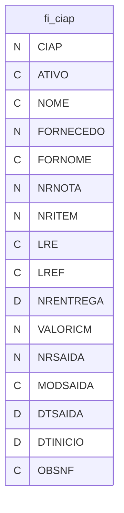

---
## Tabela DBF: `fi_ciapi`
> **Origem:** `fi_ciapi` (Driver: DBFCDX)

| Campo | Tipo | Tam | Dec |
| :--- | :--- | :--- | :--- |
| CIAP | N | 8 | 0 |
| ITEM | N | 2 | 0 |
| MES | N | 2 | 0 |
| ANO | N | 4 | 0 |
| VALOR | N | 8 | 2 |
| SOMAR | C | 1 | 0 |

**Indices vinculados:**
- Tag: `FI_CIAPI` Expressao: `STR(CIAP,8)+STR(ITEM,2)`
- Tag: `FI_CIAP2` Expressao: `CIAP`

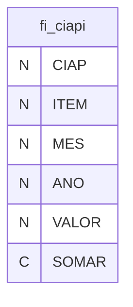

---
## Tabela DBF: `fi_con`
> **Origem:** `fi_con` (Driver: DBFCDX)

| Campo | Tipo | Tam | Dec |
| :--- | :--- | :--- | :--- |
| CODSER | C | 5 | 0 |
| DESSER | C | 60 | 0 |
| TIPSER | C | 1 | 0 |

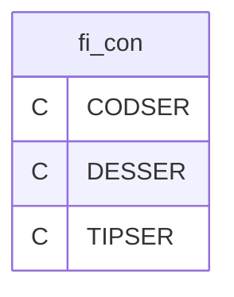

---
## Tabela DBF: `fi_dipam`
> **Origem:** `fi_dipam` (Driver: DBFCDX)

| Campo | Tipo | Tam | Dec |
| :--- | :--- | :--- | :--- |
| DIPAM | C | 2 | 0 |
| NOME | C | 100 | 0 |

**Indices vinculados:**
- Tag: `FI_DIPAM` Expressao: `DIPAM`

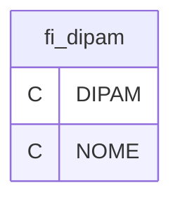

---
## Tabela DBF: `fi_esp`
> **Origem:** `fi_esp` (Driver: DBFCDX)

| Campo | Tipo | Tam | Dec |
| :--- | :--- | :--- | :--- |
| CODSER | C | 7 | 0 |
| DESSER | C | 60 | 0 |
| TIPSER | C | 1 | 0 |
| EXPCONT | C | 1 | 0 |

**Indices vinculados:**
- Tag: `FI_ESP` Expressao: `CODSER`

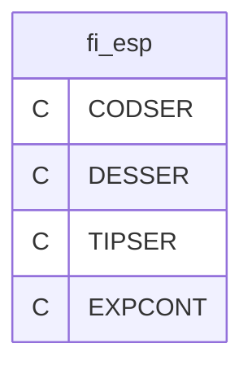

---
## Tabela DBF: `fi_inv`
> **Origem:** `fi_inv` (Driver: DBFCDX)

| Campo | Tipo | Tam | Dec |
| :--- | :--- | :--- | :--- |
| NUMERO | N | 8 | 0 |
| CODIPI | C | 2 | 0 |
| CLASSIFI | C | 14 | 0 |
| NOME | C | 40 | 0 |
| QTDDE | N | 10 | 2 |
| UNIDADE | C | 2 | 0 |
| VALORUNI | N | 10 | 2 |
| VALORPAR | N | 10 | 2 |
| OBS | C | 15 | 0 |

**Indices vinculados:**
- Tag: `FI_INV01` Expressao: `NUMERO`

```mermaid
erDiagram
    fi_inv {
        N NUMERO
        C CODIPI
        C CLASSIFI
        C NOME
        N QTDDE
        C UNIDADE
        N VALORUNI
        N VALORPAR
        C OBS
    }
```

---
## Tabela DBF: `fi_mens`
> **Origem:** `fi_mens` (Driver: DBFCDX)

| Campo | Tipo | Tam | Dec |
| :--- | :--- | :--- | :--- |
| CODIGO | N | 4 | 0 |
| OCORR | C | 254 | 0 |
| FLEGAL | C | 100 | 0 |
| OPERACAO | C | 1 | 0 |

**Indices vinculados:**
- Tag: `FI_MENS` Expressao: `CODIGO`

```mermaid
erDiagram
    fi_mens {
        N CODIGO
        C OCORR
        C FLEGAL
        C OPERACAO
    }
```

---
## Tabela DBF: `fi_mes`
> **Origem:** `fi_mes` (Driver: DBFCDX)

| Campo | Tipo | Tam | Dec |
| :--- | :--- | :--- | :--- |
| NUMERO | N | 5 | 0 |
| MES | N | 2 | 0 |
| ANO | N | 4 | 0 |
| FIFECE | D | 8 | 0 |
| FIFECS | D | 8 | 0 |
| FIFECICM | D | 8 | 0 |
| FIFECIPI | D | 8 | 0 |
| FIFECISS | D | 8 | 0 |
| FIFECISE | D | 8 | 0 |
| FILIVE | N | 3 | 0 |
| FILIVS | N | 3 | 0 |
| FILIVICM | N | 3 | 0 |
| FILIVIPI | N | 3 | 0 |
| FILIVISS | N | 3 | 0 |
| FILIVISE | N | 3 | 0 |
| FIPAGE | N | 3 | 0 |
| FIPAGS | N | 3 | 0 |
| FIPAGICM | N | 3 | 0 |
| FIPAGIPI | N | 3 | 0 |
| FIPAGISS | N | 3 | 0 |
| FIPAGISE | N | 3 | 0 |
| FIPAXICM | N | 3 | 0 |
| FIPAXIPI | N | 3 | 0 |
| FILIME | N | 3 | 0 |
| FILIMS | N | 3 | 0 |
| FILIMICM | N | 3 | 0 |
| FILIMIPI | N | 3 | 0 |
| FILIMISS | N | 3 | 0 |
| FILIMISE | N | 3 | 0 |
| FISEQE | N | 5 | 0 |
| FISEQS | N | 5 | 0 |
| FISEQISS | N | 5 | 0 |
| FISEQISE | N | 5 | 0 |
| FILANE | D | 8 | 0 |
| FILANS | D | 8 | 0 |
| FILANISS | D | 8 | 0 |
| FILANISE | D | 8 | 0 |
| FILAICM | D | 8 | 0 |
| FILAIPI | D | 8 | 0 |
| FILAISS | D | 8 | 0 |
| FILAISE | D | 8 | 0 |
| FISALICM | N | 18 | 2 |
| FISALIPI | N | 18 | 2 |
| FISALISS | N | 18 | 2 |
| FISALISE | N | 18 | 2 |
| FILIFE | N | 3 | 0 |
| FILIFS | N | 3 | 0 |
| FILIFICM | N | 3 | 0 |
| FILIFIPI | N | 3 | 0 |
| FILIFISS | N | 3 | 0 |
| FILIFISE | N | 3 | 0 |

**Indices vinculados:**
- Tag: `FI_MES` Expressao: `STR(NUMERO,5)+STRZERO(ANO,4)+STRZERO(MES,2)`

```mermaid
erDiagram
    fi_mes {
        N NUMERO
        N MES
        N ANO
        D FIFECE
        D FIFECS
        D FIFECICM
        D FIFECIPI
        D FIFECISS
        D FIFECISE
        N FILIVE
        N FILIVS
        N FILIVICM
        N FILIVIPI
        N FILIVISS
        N FILIVISE
        N FIPAGE
        N FIPAGS
        N FIPAGICM
        N FIPAGIPI
        N FIPAGISS
        N FIPAGISE
        N FIPAXICM
        N FIPAXIPI
        N FILIME
        N FILIMS
        N FILIMICM
        N FILIMIPI
        N FILIMISS
        N FILIMISE
        N FISEQE
        N FISEQS
        N FISEQISS
        N FISEQISE
        D FILANE
        D FILANS
        D FILANISS
        D FILANISE
        D FILAICM
        D FILAIPI
        D FILAISS
        D FILAISE
        N FISALICM
        N FISALIPI
        N FISALISS
        N FISALISE
        N FILIFE
        N FILIFS
        N FILIFICM
        N FILIFIPI
        N FILIFISS
        N FILIFISE
    }
```

---
## Tabela DBF: `fi_nbm`
> **Origem:** `fi_nbm` (Driver: DBFCDX)

| Campo | Tipo | Tam | Dec |
| :--- | :--- | :--- | :--- |
| NUMERONBM | C | 8 | 0 |
| DESCRI | C | 100 | 0 |
| IPI_NBM | N | 5 | 2 |
| ICMS_NBM | N | 5 | 2 |
| TIPO | C | 1 | 0 |
| CODNBM | C | 10 | 0 |
| TRIBUTAR | C | 1 | 0 |
| ALIQNAC | N | 5 | 2 |
| ALIQIMP | N | 5 | 2 |
| EX | N | 5 | 2 |
| ALIQEST | N | 5 | 2 |
| ALIQMUN | N | 5 | 2 |
| DATAIMP | D | 8 | 0 |

**Indices vinculados:**
- Tag: `FI_NBM` Expressao: `NUMERONBM`
- Tag: `FI_NBM-2` Expressao: `CODNBM`

```mermaid
erDiagram
    fi_nbm {
        C NUMERONBM
        C DESCRI
        N IPI_NBM
        N ICMS_NBM
        C TIPO
        C CODNBM
        C TRIBUTAR
        N ALIQNAC
        N ALIQIMP
        N EX
        N ALIQEST
        N ALIQMUN
        D DATAIMP
    }
```

---
## Tabela DBF: `fi_nbmcnv`
> **Origem:** `fi_nbmcnv` (Driver: DBFCDX)

| Campo | Tipo | Tam | Dec |
| :--- | :--- | :--- | :--- |
| NUMERONBM | C | 8 | 0 |
| CODNBM | C | 10 | 0 |
| NOMENBM | C | 55 | 0 |

**Indices vinculados:**
- Tag: `FI_NBM` Expressao: `NUMERONBM`
- Tag: `FI_NBM-2` Expressao: `CODNBM`

```mermaid
erDiagram
    fi_nbmcnv {
        C NUMERONBM
        C CODNBM
        C NOMENBM
    }
```

---
## Tabela DBF: `fi_nbms`
> **Origem:** `fi_nbms` (Driver: DBFCDX)

| Campo | Tipo | Tam | Dec |
| :--- | :--- | :--- | :--- |
| NUMERONBM | C | 9 | 0 |
| DESCRI | C | 100 | 0 |
| IPI_NBM | N | 5 | 2 |
| ICMS_NBM | N | 5 | 2 |
| TIPO | C | 1 | 0 |
| CODNBM | C | 10 | 0 |
| TRIBUTAR | C | 1 | 0 |
| ALIQNAC | N | 5 | 2 |
| ALIQIMP | N | 5 | 2 |
| EX | N | 5 | 2 |
| ALIQEST | N | 5 | 2 |
| ALIQMUN | N | 5 | 2 |
| DATAIMP | D | 8 | 0 |

**Indices vinculados:**
- Tag: `FI_NBM` Expressao: `NUMERONBM`
- Tag: `FI_NBM-2` Expressao: `CODNBM`

```mermaid
erDiagram
    fi_nbms {
        C NUMERONBM
        C DESCRI
        N IPI_NBM
        N ICMS_NBM
        C TIPO
        C CODNBM
        C TRIBUTAR
        N ALIQNAC
        N ALIQIMP
        N EX
        N ALIQEST
        N ALIQMUN
        D DATAIMP
    }
```

---
## Tabela DBF: `fi_oco`
> **Origem:** `fi_oco` (Driver: DBFCDX)

| Campo | Tipo | Tam | Dec |
| :--- | :--- | :--- | :--- |
| ANO | N | 4 | 0 |
| MES | N | 2 | 0 |
| TIPO | C | 1 | 0 |
| ITEM | N | 2 | 0 |
| DESCRICAO | C | 50 | 0 |
| VALICM | N | 12 | 2 |
| VALIPI | N | 12 | 2 |

**Indices vinculados:**
- Tag: `FI_OCO` Expressao: `STR(ANO,4)+STR(MES,2)+TIPO+STR(ITEM,2)`

```mermaid
erDiagram
    fi_oco {
        N ANO
        N MES
        C TIPO
        N ITEM
        C DESCRICAO
        N VALICM
        N VALIPI
    }
```

---
## Tabela DBF: `fi_ser`
> **Origem:** `fi_ser` (Driver: DBFCDX)

| Campo | Tipo | Tam | Dec |
| :--- | :--- | :--- | :--- |
| CODSER | C | 5 | 0 |
| DESSER | C | 60 | 0 |
| TIPSER | C | 1 | 0 |
| EXPCONT | C | 1 | 0 |

**Indices vinculados:**
- Tag: `FI_SER01` Expressao: `CODSER`

```mermaid
erDiagram
    fi_ser {
        C CODSER
        C DESSER
        C TIPSER
        C EXPCONT
    }
```

---
## Tabela DBF: `fi_temp1`
> **Origem:** `fi_temp1` (Driver: DBFCDX)

| Campo | Tipo | Tam | Dec |
| :--- | :--- | :--- | :--- |
| CFO | C | 3 | 0 |
| CFONEW | C | 4 | 0 |
| SUBCFO | C | 1 | 0 |
| ICM | N | 5 | 2 |
| IPI | N | 5 | 2 |
| CONTABIL | N | 18 | 2 |
| ICMBAS | N | 18 | 2 |
| ICMVAL | N | 18 | 2 |
| ICMISE | N | 18 | 2 |
| ICMOUT | N | 18 | 2 |
| OBSICM | N | 18 | 2 |
| IPIBAS | N | 18 | 2 |
| IPIVAL | N | 18 | 2 |
| IPIISE | N | 18 | 2 |
| IPIOUT | N | 18 | 2 |
| OBSIPI | N | 18 | 2 |

**Indices vinculados:**
- Tag: `FI_TEM11` Expressao: `CFO+SUBCFO+STR(ICM,5,2)`
- Tag: `FI_TEM12` Expressao: `CFONEW+STR(ICM,5,2)`
- Tag: `FI_TEM13` Expressao: `CFO+SUBCFO+STR(IPI,5,2)`
- Tag: `FI_TEM14` Expressao: `CFONEW+STR(IPI,5,2)`

```mermaid
erDiagram
    fi_temp1 {
        C CFO
        C CFONEW
        C SUBCFO
        N ICM
        N IPI
        N CONTABIL
        N ICMBAS
        N ICMVAL
        N ICMISE
        N ICMOUT
        N OBSICM
        N IPIBAS
        N IPIVAL
        N IPIISE
        N IPIOUT
        N OBSIPI
    }
```

---
## Tabela DBF: `ibs`
> **Origem:** `ibs` (Driver: DBFCDX)

| Campo | Tipo | Tam | Dec |
| :--- | :--- | :--- | :--- |
| IBS | C | 3 | 0 |
| DESCRIBS | C | 55 | 0 |
| CLASTRIB | C | 6 | 0 |
| NOMECLAST1 | C | 250 | 0 |
| NOMECLAST2 | C | 250 | 0 |
| DESCRTRIB1 | C | 250 | 0 |
| DESCRTRIB2 | C | 250 | 0 |
| DESCRLC01 | C | 250 | 0 |
| DESCRLC02 | C | 250 | 0 |
| LC | C | 20 | 0 |
| TIPOALIQ | C | 100 | 0 |
| PREDIBS | C | 100 | 0 |
| PREDCBS | C | 100 | 0 |
| INDREDBC | C | 100 | 0 |
| INDGTRREG | C | 100 | 0 |
| INDCREDP | C | 100 | 0 |
| INDMONO | C | 100 | 0 |
| INDMORETEN | C | 100 | 0 |
| INDMONORET | C | 100 | 0 |
| INDMONODIF | C | 100 | 0 |
| CREDPARA | C | 100 | 0 |
| DINIVIG | C | 100 | 0 |
| DFIMVIG | C | 100 | 0 |
| ULTATUALIZ | C | 100 | 0 |

**Indices vinculados:**
- Tag: `IBS` Expressao: `IBS`

```mermaid
erDiagram
    ibs {
        C IBS
        C DESCRIBS
        C CLASTRIB
        C NOMECLAST1
        C NOMECLAST2
        C DESCRTRIB1
        C DESCRTRIB2
        C DESCRLC01
        C DESCRLC02
        C LC
        C TIPOALIQ
        C PREDIBS
        C PREDCBS
        C INDREDBC
        C INDGTRREG
        C INDCREDP
        C INDMONO
        C INDMORETEN
        C INDMONORET
        C INDMONODIF
        C CREDPARA
        C DINIVIG
        C DFIMVIG
        C ULTATUALIZ
    }
```

---
## Tabela DBF: `indicador_presenca`
> **Origem:** `indicador_presenca` (Driver: DBFCDX)

| Campo | Tipo | Tam | Dec |
| :--- | :--- | :--- | :--- |
| CODIGO | C | 1 | 0 |
| DESCRICAO | C | 50 | 0 |

**Indices vinculados:**
- Tag: `CODIGO` Expressao: `CODIGO`

```mermaid
erDiagram
    indicador_presenca {
        C CODIGO
        C DESCRICAO
    }
```

---
## Tabela DBF: `md03`
> **Origem:** `md03` (Driver: DBFCDX)

| Campo | Tipo | Tam | Dec |
| :--- | :--- | :--- | :--- |
| CODIGO | C | 2 | 0 |
| CLASSIFIC | C | 14 | 0 |
| DESCRICAO | C | 50 | 0 |
| ALIQUOTA | N | 2 | 0 |
| ALIQUOTAR | N | 5 | 2 |
| ALIQUOTAI | N | 5 | 2 |
| DSTA | C | 1 | 0 |

```mermaid
erDiagram
    md03 {
        C CODIGO
        C CLASSIFIC
        C DESCRICAO
        N ALIQUOTA
        N ALIQUOTAR
        N ALIQUOTAI
        C DSTA
    }
```

---
## Tabela DBF: `md04`
> **Origem:** `md04` (Driver: DBFCDX)

| Campo | Tipo | Tam | Dec |
| :--- | :--- | :--- | :--- |
| CFONEW | C | 4 | 0 |
| DESCRICAO | C | 150 | 0 |
| CFO | C | 3 | 0 |
| NOMENOTA | C | 25 | 0 |
| TIPO | C | 1 | 0 |
| DIPAM | C | 2 | 0 |
| FIN | C | 1 | 0 |
| PIS | C | 1 | 0 |
| REMESSA | C | 1 | 0 |
| DIPIPI | C | 1 | 0 |
| DIPICM | C | 1 | 0 |
| CODICM | C | 3 | 0 |
| EXPCONT | C | 1 | 0 |
| CONTACRE | C | 11 | 0 |
| CONTADEB | C | 11 | 0 |
| CONTAS | C | 1 | 0 |
| APURA | C | 1 | 0 |
| ZERAIPI | C | 1 | 0 |
| FICHA | C | 1 | 0 |
| FATURA | C | 1 | 0 |
| IRENDA | C | 1 | 0 |
| ST | C | 1 | 0 |
| STFRETE | C | 1 | 0 |
| BENEF | C | 1 | 0 |
| ICMS | C | 1 | 0 |
| IPI | C | 1 | 0 |
| ISS | C | 1 | 0 |
| DEVOLUCAO | C | 1 | 0 |
| SERVPROD | C | 1 | 0 |
| ESTOQUE | C | 1 | 0 |
| TIPO2 | C | 1 | 0 |
| NFE | C | 1 | 0 |
| COMUNICA | C | 1 | 0 |
| TRANSP | C | 1 | 0 |

**Indices vinculados:**
- Tag: `MD04-1` Expressao: `CFO+CFONEW`
- Tag: `MD04-2` Expressao: `CFONEW`
- Tag: `MD04-3` Expressao: `CFO`

```mermaid
erDiagram
    md04 {
        C CFONEW
        C DESCRICAO
        C CFO
        C NOMENOTA
        C TIPO
        C DIPAM
        C FIN
        C PIS
        C REMESSA
        C DIPIPI
        C DIPICM
        C CODICM
        C EXPCONT
        C CONTACRE
        C CONTADEB
        C CONTAS
        C APURA
        C ZERAIPI
        C FICHA
        C FATURA
        C IRENDA
        C ST
        C STFRETE
        C BENEF
        C ICMS
        C IPI
        C ISS
        C DEVOLUCAO
        C SERVPROD
        C ESTOQUE
        C TIPO2
        C NFE
        C COMUNICA
        C TRANSP
    }
```

---
## Tabela DBF: `md05x`
> **Origem:** `md05x` (Driver: DBFCDX)

| Campo | Tipo | Tam | Dec |
| :--- | :--- | :--- | :--- |
| UFICMS | C | 2 | 0 |
| UFDEST | C | 2 | 0 |
| NOMEEXT | C | 20 | 0 |
| ALIQUOTA | N | 5 | 2 |
| ALIQUOTAR | N | 5 | 2 |
| ZONAFRANCA | C | 1 | 0 |

**Indices vinculados:**
- Tag: `MD05X-1` Expressao: `UFICMS`
- Tag: `MD05X-2` Expressao: `NOMEEXT`
- Tag: `MD05X-3` Expressao: `UFICMS+UFDEST`

```mermaid
erDiagram
    md05x {
        C UFICMS
        C UFDEST
        C NOMEEXT
        N ALIQUOTA
        N ALIQUOTAR
        C ZONAFRANCA
    }
```

---
## Tabela DBF: `modais_frete`
> **Origem:** `modais_frete` (Driver: DBFCDX)

| Campo | Tipo | Tam | Dec |
| :--- | :--- | :--- | :--- |
| CODIGO | C | 1 | 0 |
| DESCRICAO | C | 30 | 0 |

**Indices vinculados:**
- Tag: `CODIGO` Expressao: `CODIGO`

```mermaid
erDiagram
    modais_frete {
        C CODIGO
        C DESCRICAO
    }
```

---
## Tabela DBF: `modalidade_frete`
> **Origem:** `modalidade_frete` (Driver: DBFCDX)

| Campo | Tipo | Tam | Dec |
| :--- | :--- | :--- | :--- |
| CODIGO | C | 1 | 0 |
| DESCRICAO | C | 55 | 0 |

**Indices vinculados:**
- Tag: `CODIGO` Expressao: `CODIGO`

```mermaid
erDiagram
    modalidade_frete {
        C CODIGO
        C DESCRICAO
    }
```

---
## Tabela DBF: `modalidade_frete_anp`
> **Origem:** `modalidade_frete_anp` (Driver: DBFCDX)

| Campo | Tipo | Tam | Dec |
| :--- | :--- | :--- | :--- |
| CODIGO | C | 2 | 0 |
| DESCRICAO | C | 50 | 0 |

**Indices vinculados:**
- Tag: `CODIGO` Expressao: `CODIGO`

```mermaid
erDiagram
    modalidade_frete_anp {
        C CODIGO
        C DESCRICAO
    }
```

---
## Tabela DBF: `modelo_cobranca`
> **Origem:** `modelo_cobranca` (Driver: DBFCDX)

| Campo | Tipo | Tam | Dec |
| :--- | :--- | :--- | :--- |
| CODIGO | C | 1 | 0 |
| DESCRICAO | C | 50 | 0 |

**Indices vinculados:**
- Tag: `CODIGO` Expressao: `CODIGO`

```mermaid
erDiagram
    modelo_cobranca {
        C CODIGO
        C DESCRICAO
    }
```

---
## Tabela DBF: `modelo_cobranca_cst`
> **Origem:** `modelo_cobranca_cst` (Driver: DBFCDX)

| Campo | Tipo | Tam | Dec |
| :--- | :--- | :--- | :--- |
| CODIGO | C | 1 | 0 |
| DESCRICAO | C | 50 | 0 |

**Indices vinculados:**
- Tag: `CODIGO` Expressao: `CODIGO`

```mermaid
erDiagram
    modelo_cobranca_cst {
        C CODIGO
        C DESCRICAO
    }
```

---
## Tabela DBF: `moeda`
> **Origem:** `moeda` (Driver: DBFCDX)

| Campo | Tipo | Tam | Dec |
| :--- | :--- | :--- | :--- |
| CODIGO | N | 4 | 0 |
| NOME | C | 17 | 0 |
| DATA_INI | D | 8 | 0 |
| DATA_FIM | D | 8 | 0 |
| PAIS | C | 60 | 0 |
| SIMBOLO | C | 3 | 0 |
| BACEN | N | 4 | 0 |
| TIPO | C | 1 | 0 |
| MOEDA | C | 60 | 0 |
| NUMINT | N | 4 | 0 |
| NUMDEC | N | 2 | 0 |

**Indices vinculados:**
- Tag: `MOEDA` Expressao: `CODIGO`
- Tag: `SIMBOLO` Expressao: `SIMBOLO`
- Tag: `PAIS` Expressao: `PAIS`
- Tag: `NOME` Expressao: `NOME`

```mermaid
erDiagram
    moeda {
        N CODIGO
        C NOME
        D DATA_INI
        D DATA_FIM
        C PAIS
        C SIMBOLO
        N BACEN
        C TIPO
        C MOEDA
        N NUMINT
        N NUMDEC
    }
```

---
## Tabela DBF: `nbs`
> **Origem:** `nbs` (Driver: DBFCDX)

| Campo | Tipo | Tam | Dec |
| :--- | :--- | :--- | :--- |
| NBS | C | 12 | 0 |
| DESC_NBS | C | 999 | 0 |
| ITEM | C | 5 | 0 |
| DESC_ITEM | C | 300 | 0 |
| ONEROSA | C | 1 | 0 |
| EXTERIOR | C | 1 | 0 |
| INDOP | C | 6 | 0 |
| LOCAL_INC | C | 300 | 0 |
| CLASSTRIB | C | 6 | 0 |
| DESC_CLAS | C | 999 | 0 |

**Indices vinculados:**
- Tag: `NBS` Expressao: `NBS`

```mermaid
erDiagram
    nbs {
        C NBS
        C DESC_NBS
        C ITEM
        C DESC_ITEM
        C ONEROSA
        C EXTERIOR
        C INDOP
        C LOCAL_INC
        C CLASSTRIB
        C DESC_CLAS
    }
```

---
## Tabela DBF: `ncmuf`
> **Origem:** `ncmuf` (Driver: DBFCDX)

| Campo | Tipo | Tam | Dec |
| :--- | :--- | :--- | :--- |
| COD_NBM | C | 12 | 0 |
| COD_NCM | C | 10 | 0 |
| AC | N | 6 | 2 |
| AL | N | 6 | 2 |
| AM | N | 6 | 2 |
| AP | N | 6 | 2 |
| BA | N | 6 | 2 |
| CE | N | 6 | 2 |
| DF | N | 6 | 2 |
| ES | N | 6 | 2 |
| GO | N | 6 | 2 |
| MA | N | 6 | 2 |
| MT | N | 6 | 2 |
| MS | N | 6 | 2 |
| MG | N | 6 | 2 |
| PA | N | 6 | 2 |
| PB | N | 6 | 2 |
| PR | N | 6 | 2 |
| PE | N | 6 | 2 |
| PI | N | 6 | 2 |
| RN | N | 6 | 2 |
| RS | N | 6 | 2 |
| RJ | N | 6 | 2 |
| RO | N | 6 | 2 |
| RR | N | 6 | 2 |
| SC | N | 6 | 2 |
| SP | N | 6 | 2 |
| SE | N | 6 | 2 |
| TO | N | 6 | 2 |

```mermaid
erDiagram
    ncmuf {
        C COD_NBM
        C COD_NCM
        N AC
        N AL
        N AM
        N AP
        N BA
        N CE
        N DF
        N ES
        N GO
        N MA
        N MT
        N MS
        N MG
        N PA
        N PB
        N PR
        N PE
        N PI
        N RN
        N RS
        N RJ
        N RO
        N RR
        N SC
        N SP
        N SE
        N TO
    }
```

---
## Tabela DBF: `nfecorrecao`
> **Origem:** `nfecorrecao` (Driver: DBFCDX)

| Campo | Tipo | Tam | Dec |
| :--- | :--- | :--- | :--- |
| CODIGO | C | 2 | 0 |
| DESCRICAO | C | 30 | 0 |

**Indices vinculados:**
- Tag: `NFECRET` Expressao: `CODIGO`

```mermaid
erDiagram
    nfecorrecao {
        C CODIGO
        C DESCRICAO
    }
```

---
## Tabela DBF: `nfecret`
> **Origem:** `nfecret` (Driver: DBFCDX)

| Campo | Tipo | Tam | Dec |
| :--- | :--- | :--- | :--- |
| CODIGO | C | 3 | 0 |
| DESCRICAO | C | 120 | 0 |

**Indices vinculados:**
- Tag: `NFECRET` Expressao: `CODIGO`

```mermaid
erDiagram
    nfecret {
        C CODIGO
        C DESCRICAO
    }
```

---
## Tabela DBF: `qualif_assinante`
> **Origem:** `qualif_assinante` (Driver: DBFCDX)

| Campo | Tipo | Tam | Dec |
| :--- | :--- | :--- | :--- |
| CODIGO | C | 3 | 0 |
| DESCRICAO | C | 70 | 0 |
| DT_INI | D | 8 | 0 |
| DT_FIN | D | 8 | 0 |

**Indices vinculados:**
- Tag: `CODIGO` Expressao: `CODIGO`

```mermaid
erDiagram
    qualif_assinante {
        C CODIGO
        C DESCRICAO
        D DT_INI
        D DT_FIN
    }
```

---
## Tabela DBF: `sintdoc`
> **Origem:** `sintdoc` (Driver: DBFCDX)

| Campo | Tipo | Tam | Dec |
| :--- | :--- | :--- | :--- |
| CODIGO | C | 2 | 0 |
| NOME | C | 70 | 0 |
| DT_INI | D | 8 | 0 |
| DT_FIN | D | 8 | 0 |

**Indices vinculados:**
- Tag: `CODIGO` Expressao: `CODIGO`
- Tag: `NOME` Expressao: `NOME`
- Tag: `SINTDOC` Expressao: `CODIGO`
- Tag: `SINTDOC2` Expressao: `NOME`

```mermaid
erDiagram
    sintdoc {
        C CODIGO
        C NOME
        D DT_INI
        D DT_FIN
    }
```

---
## Tabela DBF: `sintsitu`
> **Origem:** `sintsitu` (Driver: DBFCDX)

| Campo | Tipo | Tam | Dec |
| :--- | :--- | :--- | :--- |
| CODIGO | C | 1 | 0 |
| NOME | C | 20 | 0 |

**Indices vinculados:**
- Tag: `SINTSITU` Expressao: `CODIGO`
- Tag: `SINTSIT2` Expressao: `NOME`

```mermaid
erDiagram
    sintsitu {
        C CODIGO
        C NOME
    }
```

---
## Tabela DBF: `tabenqipi`
> **Origem:** `tabenqipi` (Driver: DBFCDX)

| Campo | Tipo | Tam | Dec |
| :--- | :--- | :--- | :--- |
| CODIGO | C | 3 | 0 |
| GRUPOCST | C | 10 | 0 |
| DESCR1 | C | 254 | 0 |
| DESCR2 | C | 180 | 0 |
| DESCRICAO | C | 255 | 0 |

**Indices vinculados:**
- Tag: `ENQIPI01` Expressao: `CODIGO`
- Tag: `ENQIPI02` Expressao: `GRUPOCST`
- Tag: `ENQIPI03` Expressao: `upper( left( DESCR1, 240 ) )`

```mermaid
erDiagram
    tabenqipi {
        C CODIGO
        C GRUPOCST
        C DESCR1
        C DESCR2
        C DESCRICAO
    }
```

---
## Tabela DBF: `tipo_pagamento`
> **Origem:** `tipo_pagamento` (Driver: DBFCDX)

| Campo | Tipo | Tam | Dec |
| :--- | :--- | :--- | :--- |
| CODIGO | C | 2 | 0 |
| DESCRICAO | C | 60 | 0 |

**Indices vinculados:**
- Tag: `CODIGO` Expressao: `CODIGO`

```mermaid
erDiagram
    tipo_pagamento {
        C CODIGO
        C DESCRICAO
    }
```

---
## Tabela DBF: `unidade_medida_comercial`
> **Origem:** `unidade_medida_comercial` (Driver: DBFCDX)

| Campo | Tipo | Tam | Dec |
| :--- | :--- | :--- | :--- |
| UNIDADE | C | 7 | 0 |
| UNIDDES | C | 25 | 0 |
| UNIDDEC | C | 1 | 0 |

**Indices vinculados:**
- Tag: `CODIGO` Expressao: `UNIDADE`

```mermaid
erDiagram
    unidade_medida_comercial {
        C UNIDADE
        C UNIDDES
        C UNIDDEC
    }
```

---
