# Dicionario de Estruturas de Dados do Projeto
> Varredura automatica realizada em: 09/09/2026

## Tabela DBF: `aci_cep`
> **Origem:** `aci_cep` (Driver: DBFCDX)

| Campo | Tipo | Tam | Dec |
| :--- | :--- | :--- | :--- |
| CEP | C | 8 | 0 |

**Indices vinculados:**
- Tag: `CEP` Expressao: `CEP`

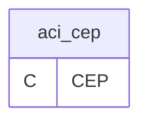

---
## Tabela DBF: `agenda`
> **Origem:** `agenda` (Driver: DBFCDX)

| Campo | Tipo | Tam | Dec |
| :--- | :--- | :--- | :--- |
| CDDATA | D | 8 | 0 |
| OBS1 | C | 60 | 0 |
| OBS2 | C | 60 | 0 |
| OBS3 | C | 60 | 0 |
| OBS4 | C | 60 | 0 |
| OBS5 | C | 60 | 0 |
| OBS6 | C | 60 | 0 |
| OBS7 | C | 60 | 0 |
| OBS8 | C | 60 | 0 |

**Indices vinculados:**
- Tag: `AGENDA` Expressao: `CDDATA`

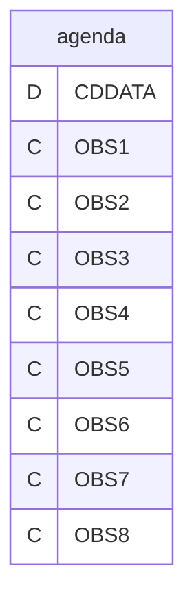

---
## Tabela DBF: `agupel`
> **Origem:** `agupel` (Driver: DBFCDX)

| Campo | Tipo | Tam | Dec |
| :--- | :--- | :--- | :--- |
| TIP | C | 1 | 0 |
| DEPTO | N | 3 | 0 |
| SETOR | N | 3 | 0 |
| SECAO | N | 3 | 0 |
| NOMEC | C | 15 | 0 |
| TOT01 | N | 12 | 2 |
| PES01 | N | 6 | 2 |
| TOT02 | N | 12 | 2 |
| PES02 | N | 6 | 2 |
| TOT03 | N | 12 | 2 |
| PES03 | N | 6 | 2 |
| QUA01 | N | 7 | 2 |
| QUA02 | N | 10 | 2 |
| PES04 | N | 6 | 2 |
| QUA03 | N | 4 | 0 |
| PES05 | N | 7 | 2 |
| QUA04 | N | 2 | 0 |
| QUA05 | N | 2 | 0 |
| TOT04 | N | 6 | 2 |
| PES06 | N | 6 | 2 |
| TOT05 | N | 12 | 2 |
| TOT06 | N | 12 | 2 |
| TOT07 | N | 12 | 2 |
| TOT08 | N | 12 | 2 |

**Indices vinculados:**
- Tag: `AGUPEL` Expressao: `TIP+STR(DEPTO,3)+STR(SETOR,3)+STR(SECAO,3)`

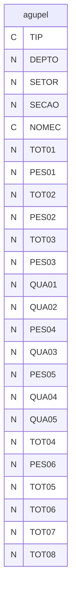

---
## Tabela DBF: `ajuger`
> **Origem:** `ajuger` (Driver: DBFCDX)

| Campo | Tipo | Tam | Dec |
| :--- | :--- | :--- | :--- |
| DEPTO | N | 4 | 0 |
| SETOR | N | 3 | 0 |
| SECAO | N | 3 | 0 |
| NOME | C | 15 | 0 |
| CONTROLE | N | 10 | 0 |
| SALARIO | N | 18 | 2 |
| QT1 | N | 9 | 2 |
| VL1 | N | 18 | 2 |
| QT2 | N | 9 | 2 |
| VL2 | N | 18 | 2 |
| QT3 | N | 9 | 2 |
| VL3 | N | 18 | 2 |
| QT4 | N | 9 | 2 |
| VL4 | N | 18 | 2 |
| QT5 | N | 9 | 2 |
| VL5 | N | 18 | 2 |
| ADM | N | 4 | 0 |
| DEM | N | 4 | 0 |
| TURN | N | 18 | 2 |
| ATI | N | 4 | 0 |

**Indices vinculados:**
- Tag: `AJUGER` Expressao: `CONTROLE`

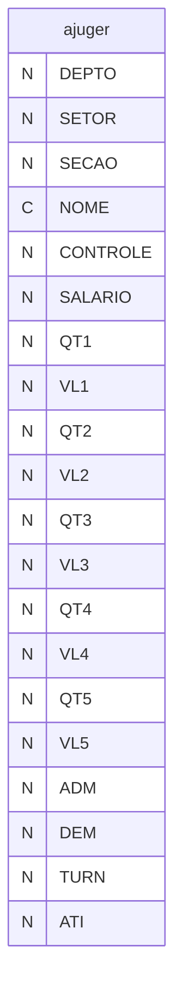

---
## Tabela DBF: `apudepto`
> **Origem:** `apudepto` (Driver: DBFCDX)

| Campo | Tipo | Tam | Dec |
| :--- | :--- | :--- | :--- |
| DEPTO | N | 4 | 0 |
| SECAO | N | 3 | 0 |
| SETOR | N | 3 | 0 |
| CONTA | N | 3 | 0 |
| HORAS | N | 9 | 2 |
| VALOR | N | 18 | 2 |
| CONTROLE | N | 18 | 0 |

**Indices vinculados:**
- Tag: `APUDEPTO` Expressao: `CONTROLE`

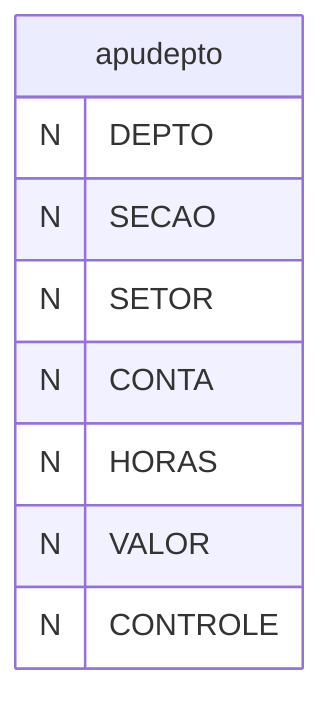

---
## Tabela DBF: `assmed`
> **Origem:** `assmed` (Driver: DBFCDX)

| Campo | Tipo | Tam | Dec |
| :--- | :--- | :--- | :--- |
| MES | N | 2 | 0 |
| ANO | N | 4 | 0 |
| MESEXT | C | 10 | 0 |
| DESCT | N | 10 | 2 |
| DESCTB | N | 10 | 2 |
| DESCTC | N | 10 | 2 |
| DESCTD | N | 10 | 2 |
| DESCTE | N | 10 | 2 |

**Indices vinculados:**
- Tag: `ASSMED` Expressao: `STR(ANO,4)+STR(MES,2)`

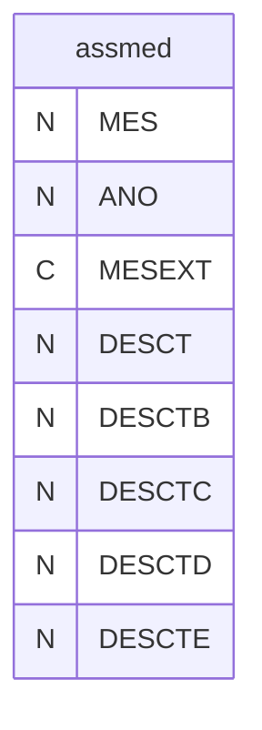

---
## Tabela DBF: `assodo`
> **Origem:** `assodo` (Driver: DBFCDX)

| Campo | Tipo | Tam | Dec |
| :--- | :--- | :--- | :--- |
| MES | N | 2 | 0 |
| ANO | N | 4 | 0 |
| MESEXT | C | 10 | 0 |
| DESCT | N | 10 | 2 |
| DESCTB | N | 10 | 2 |
| DESCTC | N | 10 | 2 |
| DESCTD | N | 10 | 2 |
| DESCTE | N | 10 | 2 |

**Indices vinculados:**
- Tag: `ASSODO` Expressao: `STR(ANO,4)+STR(MES,2)`

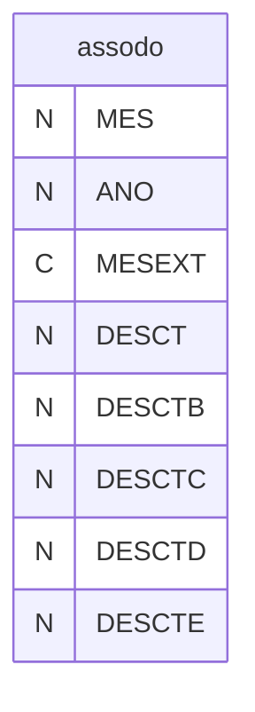

---
## Tabela DBF: `bcofgts`
> **Origem:** `bcofgts` (Driver: DBFCDX)

| Campo | Tipo | Tam | Dec |
| :--- | :--- | :--- | :--- |
| EMP | N | 5 | 0 |
| NUMERO | C | 3 | 0 |
| NOME | C | 30 | 0 |
| AGENCIA | C | 4 | 0 |
| DIVAGENCI | C | 1 | 0 |
| AGENCTA | C | 9 | 0 |
| NOMEAGENC | C | 30 | 0 |
| CIDADE | C | 40 | 0 |
| UF | C | 2 | 0 |
| CODEMP | C | 4 | 0 |
| SEQUENCIA | C | 7 | 0 |
| UNIDADE | C | 15 | 0 |
| UNIGR | C | 5 | 0 |
| CONTA | C | 15 | 0 |
| CODEMPDV | C | 1 | 0 |
| SEQUENDV | C | 1 | 0 |
| TIPOEMP | C | 1 | 0 |
| ENDERECO | C | 30 | 0 |
| NUMEROEMP | C | 6 | 0 |
| COMPLEMEN | C | 15 | 0 |
| TRUNCAR | C | 1 | 0 |
| TRUNCA2 | C | 1 | 0 |

**Indices vinculados:**
- Tag: `EMP` Expressao: `EMP`

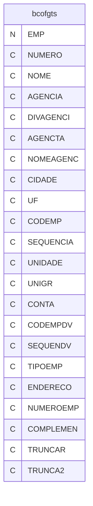

---
## Tabela DBF: `caged`
> **Origem:** `caged` (Driver: DBFCDX)

| Campo | Tipo | Tam | Dec |
| :--- | :--- | :--- | :--- |
| CODIGO | C | 2 | 0 |
| DESCRICAO | C | 50 | 0 |
| TIPO | C | 1 | 0 |

**Indices vinculados:**
- Tag: `CAGED` Expressao: `CODIGO`

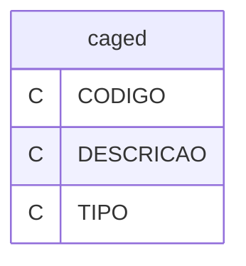

---
## Tabela DBF: `cartorio`
> **Origem:** `cartorio` (Driver: DBFCDX)

| Campo | Tipo | Tam | Dec |
| :--- | :--- | :--- | :--- |
| CODIGO | C | 6 | 0 |
| IBGE | C | 7 | 0 |
| NOME | C | 240 | 0 |

**Indices vinculados:**
- Tag: `CODIGO` Expressao: `CODIGO`

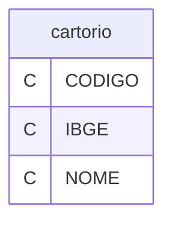

---
## Tabela DBF: `cbocnv`
> **Origem:** `cbocnv` (Driver: DBFCDX)

| Campo | Tipo | Tam | Dec |
| :--- | :--- | :--- | :--- |
| CBOOLD | C | 5 | 0 |
| CBONEW | C | 6 | 0 |

**Indices vinculados:**
- Tag: `CBOCNV` Expressao: `CBOOLD`
- Tag: `CBOCNV2` Expressao: `CBONEW`

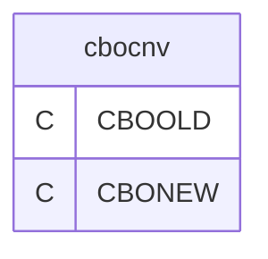

---
## Tabela DBF: `cccor`
> **Origem:** `cccor` (Driver: DBFCDX)

| Campo | Tipo | Tam | Dec |
| :--- | :--- | :--- | :--- |
| CODIGO | N | 4 | 0 |
| DESCR | C | 35 | 0 |
| CO_HIS | N | 3 | 0 |
| CO_HISN | C | 70 | 0 |
| CO_COD | C | 13 | 0 |
| CO_CODD | C | 13 | 0 |
| CO_CODR | N | 6 | 0 |
| CO_CODRD | N | 6 | 0 |
| CO_CODN | C | 40 | 0 |
| NUMEMP | N | 5 | 0 |

**Indices vinculados:**
- Tag: `CCCOR` Expressao: `STR(CODIGO,4)+STR(NUMEMP,5)`

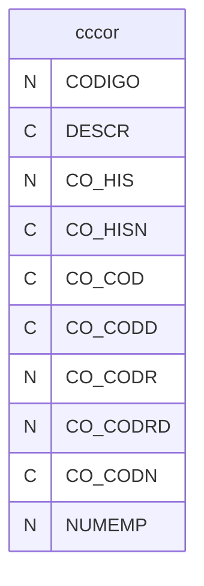

---
## Tabela DBF: `ccesp`
> **Origem:** `ccesp` (Driver: DBFCDX)

| Campo | Tipo | Tam | Dec |
| :--- | :--- | :--- | :--- |
| CODIGO | N | 4 | 0 |
| DESCR | C | 35 | 0 |
| CO_HIS | N | 3 | 0 |
| CO_HISN | C | 70 | 0 |
| CO_COD | C | 13 | 0 |
| CO_CODD | C | 13 | 0 |
| CO_CODR | N | 6 | 0 |
| CO_CODRD | N | 6 | 0 |
| CO_CODN | C | 40 | 0 |
| NUMEMP | N | 5 | 0 |
| TIPO | C | 1 | 0 |
| ARQUIVO | C | 8 | 0 |
| CAMPO | C | 10 | 0 |

**Indices vinculados:**
- Tag: `CCESP` Expressao: `STR(CODIGO,4)+STR(NUMEMP,5)`

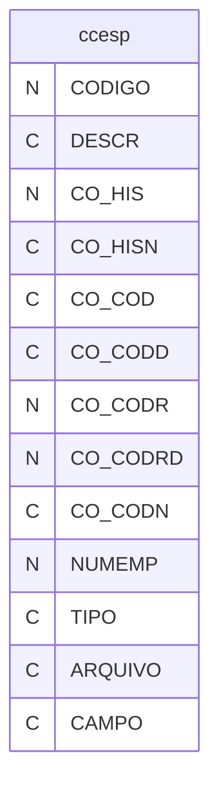

---
## Tabela DBF: `cid`
> **Origem:** `cid` (Driver: DBFCDX)

| Campo | Tipo | Tam | Dec |
| :--- | :--- | :--- | :--- |
| CODIGO | C | 4 | 0 |
| CAT | C | 1 | 0 |
| NOME | C | 50 | 0 |

**Indices vinculados:**
- Tag: `CODIGO` Expressao: `CODIGO`
- Tag: `CID-2` Expressao: `NOME`

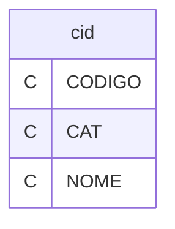

---
## Tabela DBF: `cidgrupo`
> **Origem:** `cidgrupo` (Driver: DBFCDX)

| Campo | Tipo | Tam | Dec |
| :--- | :--- | :--- | :--- |
| CODIGO | C | 10 | 0 |
| NOME | C | 100 | 0 |

**Indices vinculados:**
- Tag: `CODIGO` Expressao: `CODIGO`

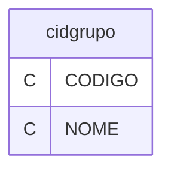

---
## Tabela DBF: `cnaecnv`
> **Origem:** `cnaecnv` (Driver: DBFCDX)

| Campo | Tipo | Tam | Dec |
| :--- | :--- | :--- | :--- |
| CNAE2 | C | 7 | 0 |
| DESCR2 | C | 150 | 0 |
| CNAE1 | C | 7 | 0 |
| DESCR1 | C | 150 | 0 |
| SEQ | C | 1 | 0 |

**Indices vinculados:**
- Tag: `CNAE2` Expressao: `CNAE2`
- Tag: `CNAE1` Expressao: `CNAE1`

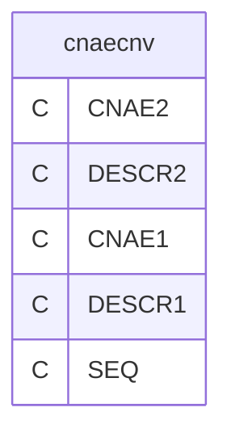

---
## Tabela DBF: `codfgts`
> **Origem:** `codfgts` (Driver: DBFCDX)

| Campo | Tipo | Tam | Dec |
| :--- | :--- | :--- | :--- |
| CODIGO | C | 3 | 0 |
| NOME | C | 254 | 0 |
| ICTOMADOR | C | 1 | 0 |
| ICRECFGTS | C | 1 | 0 |
| ICRECINSS | C | 1 | 0 |
| ICEXCLFGTS | C | 1 | 0 |
| ICPARCFGTS | C | 1 | 0 |
| ICCODPGTO | C | 1 | 0 |
| ICCAFVI | C | 1 | 0 |
| ICCAFOE | C | 1 | 0 |
| ICCAPRVI | C | 1 | 0 |
| ICCAPROE | C | 1 | 0 |
| ICCAEDVI | C | 1 | 0 |
| ICINSS13 | C | 1 | 0 |
| ICCOMPENSA | C | 1 | 0 |
| ICSALFAMI | C | 1 | 0 |
| ICOUTINFO | C | 1 | 0 |
| ICOUTINFOP | C | 1 | 0 |
| ICPRDRULPF | C | 1 | 0 |
| ICPRDRULPJ | C | 1 | 0 |
| ICRCVNDDES | C | 1 | 0 |
| ICDD13SGES | C | 1 | 0 |
| ICDDSGES | C | 1 | 0 |
| ICCENTRAL | C | 1 | 0 |
| ICSIMPLES | C | 1 | 0 |
| ICVRRETEN | C | 1 | 0 |
| ICFATTOM | C | 1 | 0 |
| ICCOPTRAB | C | 1 | 0 |
| REG00 | C | 1 | 0 |
| REG01 | C | 1 | 0 |
| REG10 | C | 1 | 0 |
| REG11 | C | 1 | 0 |
| REG12 | C | 1 | 0 |
| REG13 | C | 1 | 0 |
| REG14 | C | 1 | 0 |
| REG20 | C | 1 | 0 |
| REG30 | C | 1 | 0 |
| REG31 | C | 1 | 0 |
| REG32 | C | 1 | 0 |
| REG70 | C | 1 | 0 |
| REG80 | C | 1 | 0 |
| REG90 | C | 1 | 0 |
| ICMODOPER | C | 1 | 0 |
| CORCLPEADM | C | 3 | 0 |

**Indices vinculados:**
- Tag: `CODFGTS` Expressao: `CODIGO`

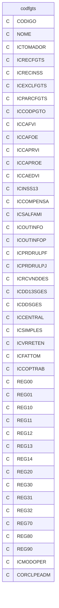

---
## Tabela DBF: `codirrf`
> **Origem:** `codirrf` (Driver: DBFCDX)

| Campo | Tipo | Tam | Dec |
| :--- | :--- | :--- | :--- |
| CODIGO | C | 4 | 0 |
| NOME | C | 100 | 0 |
| VALPESSOA | C | 1 | 0 |

**Indices vinculados:**
- Tag: `CODIRRF` Expressao: `CODIGO`

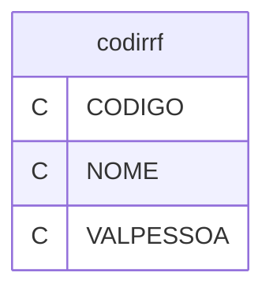

---
## Tabela DBF: `configu`
> **Origem:** `configu` (Driver: DBFCDX)

| Campo | Tipo | Tam | Dec |
| :--- | :--- | :--- | :--- |
| TEMP | N | 3 | 0 |
| IMPRE | C | 1 | 0 |
| DRIVE | C | 1 | 0 |
| MONITOR | C | 1 | 0 |
| CURSOR | N | 1 | 0 |
| VER | C | 100 | 0 |
| VOL | C | 100 | 0 |
| DULT | C | 8 | 0 |
| DRV | C | 1 | 0 |
| DIR | C | 40 | 0 |
| NDIR | C | 5 | 0 |
| NDOS | C | 5 | 0 |
| NTOT | C | 5 | 0 |
| NDRV | C | 5 | 0 |
| NEMP | C | 5 | 0 |
| NSET | C | 10 | 0 |
| DFIM | C | 8 | 0 |
| RAIZ01 | N | 12 | 6 |
| RAIZ02 | N | 12 | 6 |
| RAIZ03 | N | 12 | 6 |
| RAIZ04 | N | 12 | 6 |
| RAIZ05 | N | 12 | 6 |
| RAIZ06 | N | 12 | 6 |
| RAIZ07 | N | 12 | 6 |
| RAIZ08 | N | 12 | 6 |
| RAIZ09 | N | 12 | 6 |
| RAIZ10 | N | 12 | 6 |
| RAIZ11 | N | 12 | 6 |
| RAIZ12 | N | 12 | 6 |
| URVABR | N | 12 | 2 |
| URVMAI | N | 12 | 2 |
| URVJUN | N | 12 | 2 |
| URVMAR | N | 12 | 2 |
| FFFE01 | N | 12 | 6 |
| FFFE02 | N | 12 | 6 |
| FFFE03 | N | 12 | 6 |
| FFFE04 | N | 12 | 6 |
| FFFE05 | N | 12 | 6 |
| FFFE06 | N | 12 | 6 |
| FFFE07 | N | 12 | 6 |
| FFFE08 | N | 12 | 6 |
| FFFE09 | N | 12 | 6 |
| FFFE10 | N | 12 | 6 |
| FFFE11 | N | 12 | 6 |
| FFFE12 | N | 12 | 6 |
| MOEDA01 | C | 20 | 0 |
| MOEDA02 | C | 20 | 0 |
| MOEDA03 | C | 20 | 0 |
| MOEDA04 | C | 20 | 0 |
| MOEDA05 | C | 20 | 0 |
| MOEDA06 | C | 20 | 0 |
| DIRF01 | N | 12 | 6 |
| DIRF02 | N | 12 | 6 |
| DIRF03 | N | 12 | 6 |
| DIRF04 | N | 12 | 6 |
| DIRF05 | N | 12 | 6 |
| DIRF06 | N | 12 | 6 |
| DIRF07 | N | 12 | 6 |
| DIRF08 | N | 12 | 6 |
| DIRF09 | N | 12 | 6 |
| DIRF10 | N | 12 | 6 |
| DIRF11 | N | 12 | 6 |
| DIRF12 | N | 12 | 6 |
| DIRE | C | 60 | 0 |
| DIRC | C | 60 | 0 |
| DIRP | C | 60 | 0 |
| DIRI | C | 60 | 0 |
| DIRA | C | 60 | 0 |
| DIRB | C | 60 | 0 |

```mermaid
erDiagram
    configu {
        N TEMP
        C IMPRE
        C DRIVE
        C MONITOR
        N CURSOR
        C VER
        C VOL
        C DULT
        C DRV
        C DIR
        C NDIR
        C NDOS
        C NTOT
        C NDRV
        C NEMP
        C NSET
        C DFIM
        N RAIZ01
        N RAIZ02
        N RAIZ03
        N RAIZ04
        N RAIZ05
        N RAIZ06
        N RAIZ07
        N RAIZ08
        N RAIZ09
        N RAIZ10
        N RAIZ11
        N RAIZ12
        N URVABR
        N URVMAI
        N URVJUN
        N URVMAR
        N FFFE01
        N FFFE02
        N FFFE03
        N FFFE04
        N FFFE05
        N FFFE06
        N FFFE07
        N FFFE08
        N FFFE09
        N FFFE10
        N FFFE11
        N FFFE12
        C MOEDA01
        C MOEDA02
        C MOEDA03
        C MOEDA04
        C MOEDA05
        C MOEDA06
        N DIRF01
        N DIRF02
        N DIRF03
        N DIRF04
        N DIRF05
        N DIRF06
        N DIRF07
        N DIRF08
        N DIRF09
        N DIRF10
        N DIRF11
        N DIRF12
        C DIRE
        C DIRC
        C DIRP
        C DIRI
        C DIRA
        C DIRB
    }
```

---
## Tabela DBF: `confinss`
> **Origem:** `confinss` (Driver: DBFCDX)

| Campo | Tipo | Tam | Dec |
| :--- | :--- | :--- | :--- |
| FPAS | N | 3 | 0 |
| DESCRICAO | C | 50 | 0 |
| EMPREGADO | C | 3 | 0 |
| EMPRESA | N | 5 | 2 |
| ACIDENTE | N | 5 | 2 |
| E0001 | N | 5 | 2 |
| E0002 | N | 5 | 2 |
| E0004 | N | 5 | 2 |
| E0008 | N | 5 | 2 |
| E0016 | N | 5 | 2 |
| E0032 | N | 5 | 2 |
| E0064 | N | 5 | 2 |
| E0128 | N | 5 | 2 |
| E0256 | N | 5 | 2 |
| E0512 | N | 5 | 2 |
| E1024 | N | 5 | 2 |
| E2048 | N | 5 | 2 |
| E4096 | N | 5 | 2 |
| TOTAL | N | 5 | 2 |
| TERCEIRO | N | 4 | 0 |
| DESCRICAO | C | 50 | 0 |
| PEMP | N | 5 | 2 |
| PAUT | N | 5 | 2 |
| CODGUIA | C | 4 | 0 |
| CODPAG | C | 4 | 0 |
| PASSAT | C | 1 | 0 |
| INDCOOP | C | 6 | 0 |
| CLASSTRIB | C | 2 | 0 |
| CODTERC | N | 4 | 0 |
| ALIQTERC | N | 4 | 2 |

**Indices vinculados:**
- Tag: `CONFINSS` Expressao: `FPAS`

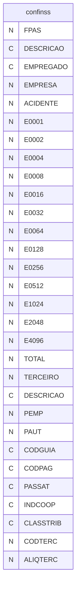

---
## Tabela DBF: `contas`
> **Origem:** `contas` (Driver: DBFCDX)

| Campo | Tipo | Tam | Dec |
| :--- | :--- | :--- | :--- |
| CODIGO | N | 4 | 0 |
| FATOR | N | 8 | 5 |
| TRIBUTIRR | N | 1 | 0 |
| TRIBUTINPS | N | 1 | 0 |
| GUIA_IAPAS | N | 1 | 0 |
| TRIB_FGTS | N | 1 | 0 |
| SAL_13 | N | 1 | 0 |
| RAIZ | N | 1 | 0 |
| DEMISSAO | N | 1 | 0 |
| DESCR | C | 35 | 0 |
| TIPO | N | 1 | 0 |
| VALOR | N | 10 | 2 |
| NIVEL_13 | N | 1 | 0 |
| NIVEL_DEM | N | 1 | 0 |
| IRENDIMEN | N | 1 | 0 |
| NRENDIMEN | N | 3 | 0 |
| FERIAS | N | 1 | 0 |
| NIVEL_FERI | N | 1 | 0 |
| RES | N | 2 | 0 |
| POSREC | N | 2 | 0 |
| PRFER | N | 1 | 0 |
| PRFCO | N | 1 | 0 |
| PRRES | N | 1 | 0 |
| TRFER | N | 1 | 0 |
| TRRES | N | 1 | 0 |
| RESG | N | 1 | 0 |
| SELFFE | C | 1 | 0 |
| SELECAO | N | 1 | 0 |
| GRAT | N | 1 | 0 |
| TR13S1 | N | 1 | 0 |
| TR13S2 | N | 1 | 0 |
| TR13SC | N | 1 | 0 |
| TRFCO | N | 1 | 0 |
| IRRF13 | N | 1 | 0 |
| INSS13 | N | 1 | 0 |
| FGTS13 | N | 1 | 0 |
| CO_COD | C | 13 | 0 |
| CO_CODN | C | 40 | 0 |
| CO_CODR | N | 6 | 0 |
| CO_HIS | N | 3 | 0 |
| CO_HISN | C | 70 | 0 |
| CO_CODD | C | 13 | 0 |
| CO_CODRD | N | 6 | 0 |
| FAT01 | N | 18 | 6 |
| FAT02 | N | 18 | 6 |
| FAT03 | N | 18 | 6 |
| FAT04 | N | 18 | 6 |
| FAT05 | N | 18 | 6 |
| FAT06 | N | 18 | 6 |
| FAT07 | N | 18 | 6 |
| FAT08 | N | 18 | 6 |
| FAT09 | N | 18 | 6 |
| FAT10 | N | 18 | 6 |
| FAT11 | N | 18 | 6 |
| FAT12 | N | 18 | 6 |
| ACEITE | C | 1 | 0 |
| LISCON | C | 1 | 0 |
| BASERED | N | 7 | 2 |
| BASEREDI | N | 7 | 2 |
| BASERIR | N | 7 | 2 |
| IPER | N | 7 | 2 |
| NATRUBR | N | 4 | 0 |
| TPRUBR | N | 1 | 0 |
| CODINCCP | N | 2 | 0 |
| CODINCIRRF | N | 2 | 0 |
| CODINCFGTS | N | 2 | 0 |
| CODINCSIND | N | 2 | 0 |
| REPDSR | C | 1 | 0 |
| REP13 | C | 1 | 0 |
| REPFERIAS | C | 1 | 0 |
| REPAVISO | C | 1 | 0 |
| FATORRUBR | N | 4 | 0 |

**Indices vinculados:**
- Tag: `CONTAS` Expressao: `CODIGO`

```mermaid
erDiagram
    contas {
        N CODIGO
        N FATOR
        N TRIBUTIRR
        N TRIBUTINPS
        N GUIA_IAPAS
        N TRIB_FGTS
        N SAL_13
        N RAIZ
        N DEMISSAO
        C DESCR
        N TIPO
        N VALOR
        N NIVEL_13
        N NIVEL_DEM
        N IRENDIMEN
        N NRENDIMEN
        N FERIAS
        N NIVEL_FERI
        N RES
        N POSREC
        N PRFER
        N PRFCO
        N PRRES
        N TRFER
        N TRRES
        N RESG
        C SELFFE
        N SELECAO
        N GRAT
        N TR13S1
        N TR13S2
        N TR13SC
        N TRFCO
        N IRRF13
        N INSS13
        N FGTS13
        C CO_COD
        C CO_CODN
        N CO_CODR
        N CO_HIS
        C CO_HISN
        C CO_CODD
        N CO_CODRD
        N FAT01
        N FAT02
        N FAT03
        N FAT04
        N FAT05
        N FAT06
        N FAT07
        N FAT08
        N FAT09
        N FAT10
        N FAT11
        N FAT12
        C ACEITE
        C LISCON
        N BASERED
        N BASEREDI
        N BASERIR
        N IPER
        N NATRUBR
        N TPRUBR
        N CODINCCP
        N CODINCIRRF
        N CODINCFGTS
        N CODINCSIND
        C REPDSR
        C REP13
        C REPFERIAS
        C REPAVISO
        N FATORRUBR
    }
```

---
## Tabela DBF: `ctarpa`
> **Origem:** `ctarpa` (Driver: DBFCDX)

| Campo | Tipo | Tam | Dec |
| :--- | :--- | :--- | :--- |
| CODIGO | N | 4 | 0 |
| FATOR | N | 8 | 5 |
| TRIBUTIRR | N | 1 | 0 |
| TRIBUTINPS | N | 1 | 0 |
| GUIA_IAPAS | N | 1 | 0 |
| TRIB_FGTS | N | 1 | 0 |
| SAL_13 | N | 1 | 0 |
| RAIZ | N | 1 | 0 |
| DEMISSAO | N | 1 | 0 |
| DESCR | C | 35 | 0 |
| TIPO | N | 1 | 0 |
| VALOR | N | 10 | 2 |
| NIVEL_13 | N | 1 | 0 |
| NIVEL_DEM | N | 1 | 0 |
| IRENDIMEN | N | 1 | 0 |
| NRENDIMEN | N | 3 | 0 |
| FERIAS | N | 1 | 0 |
| NIVEL_FERI | N | 1 | 0 |
| RES | N | 2 | 0 |
| PRFER | N | 1 | 0 |
| PRFCO | N | 1 | 0 |
| PRRES | N | 1 | 0 |
| TRFER | N | 1 | 0 |
| TRRES | N | 1 | 0 |
| RESG | N | 1 | 0 |
| SELFFE | C | 1 | 0 |
| SELECAO | N | 1 | 0 |
| GRAT | N | 1 | 0 |
| TR13S1 | N | 1 | 0 |
| TR13S2 | N | 1 | 0 |
| TR13SC | N | 1 | 0 |
| TRFCO | N | 1 | 0 |
| IRRF13 | N | 1 | 0 |
| INSS13 | N | 1 | 0 |
| FGTS13 | N | 1 | 0 |
| CO_COD | C | 13 | 0 |
| CO_CODN | C | 40 | 0 |
| CO_CODR | N | 6 | 0 |
| CO_HIS | N | 3 | 0 |
| CO_HISN | C | 70 | 0 |
| CO_CODD | C | 13 | 0 |
| CO_CODRD | N | 6 | 0 |
| FAT01 | N | 18 | 6 |
| FAT02 | N | 18 | 6 |
| FAT03 | N | 18 | 6 |
| FAT04 | N | 18 | 6 |
| FAT05 | N | 18 | 6 |
| FAT06 | N | 18 | 6 |
| FAT07 | N | 18 | 6 |
| FAT08 | N | 18 | 6 |
| FAT09 | N | 18 | 6 |
| FAT10 | N | 18 | 6 |
| FAT11 | N | 18 | 6 |
| FAT12 | N | 18 | 6 |
| ACEITE | C | 1 | 0 |
| BASERED | N | 7 | 2 |
| BASEREDI | N | 7 | 2 |
| BASERIR | N | 7 | 2 |
| IPER | N | 7 | 2 |
| NATRUBR | N | 4 | 0 |
| TPRUBR | N | 1 | 0 |
| CODINCCP | N | 2 | 0 |
| CODINCIRRF | N | 2 | 0 |
| CODINCFGTS | N | 2 | 0 |
| CODINCSIND | N | 2 | 0 |
| REPDSR | C | 1 | 0 |
| REP13 | C | 1 | 0 |
| REPFERIAS | C | 1 | 0 |
| REPAVISO | C | 1 | 0 |
| FATORRUBR | N | 4 | 0 |

**Indices vinculados:**
- Tag: `CTARPA` Expressao: `CODIGO`

```mermaid
erDiagram
    ctarpa {
        N CODIGO
        N FATOR
        N TRIBUTIRR
        N TRIBUTINPS
        N GUIA_IAPAS
        N TRIB_FGTS
        N SAL_13
        N RAIZ
        N DEMISSAO
        C DESCR
        N TIPO
        N VALOR
        N NIVEL_13
        N NIVEL_DEM
        N IRENDIMEN
        N NRENDIMEN
        N FERIAS
        N NIVEL_FERI
        N RES
        N PRFER
        N PRFCO
        N PRRES
        N TRFER
        N TRRES
        N RESG
        C SELFFE
        N SELECAO
        N GRAT
        N TR13S1
        N TR13S2
        N TR13SC
        N TRFCO
        N IRRF13
        N INSS13
        N FGTS13
        C CO_COD
        C CO_CODN
        N CO_CODR
        N CO_HIS
        C CO_HISN
        C CO_CODD
        N CO_CODRD
        N FAT01
        N FAT02
        N FAT03
        N FAT04
        N FAT05
        N FAT06
        N FAT07
        N FAT08
        N FAT09
        N FAT10
        N FAT11
        N FAT12
        C ACEITE
        N BASERED
        N BASEREDI
        N BASERIR
        N IPER
        N NATRUBR
        N TPRUBR
        N CODINCCP
        N CODINCIRRF
        N CODINCFGTS
        N CODINCSIND
        C REPDSR
        C REP13
        C REPFERIAS
        C REPAVISO
        N FATORRUBR
    }
```

---
## Tabela DBF: `depto`
> **Origem:** `depto` (Driver: DBFCDX)

| Campo | Tipo | Tam | Dec |
| :--- | :--- | :--- | :--- |
| DEPTO | N | 4 | 0 |
| SECAO | N | 3 | 0 |
| SETOR | N | 3 | 0 |
| NOME | C | 40 | 0 |
| CONTROLE | N | 10 | 0 |
| CONTROL2 | N | 10 | 0 |
| CONTROL3 | N | 10 | 0 |
| NOMER | C | 25 | 0 |
| NOMEC | C | 15 | 0 |
| FPAS | C | 3 | 0 |
| CODSAT | C | 7 | 0 |
| TOTLAB | N | 12 | 2 |
| TOTAUT | N | 12 | 2 |
| TXSEG | N | 5 | 2 |
| TXEMP | N | 5 | 2 |
| TXTER | N | 5 | 2 |
| TOTBAS | N | 12 | 2 |
| TOTREC | N | 12 | 2 |
| TOTDED | N | 12 | 2 |
| TOTFUN | N | 8 | 0 |
| TOTADI | N | 12 | 2 |
| CCUSTO | N | 6 | 0 |
| UNIFUN | C | 10 | 0 |
| MODIRETA | C | 1 | 0 |

**Indices vinculados:**
- Tag: `DEPTO` Expressao: `CONTROLE`
- Tag: `DEPTO-2` Expressao: `DEPTO`
- Tag: `DEPTO-3` Expressao: `CCUSTO`

```mermaid
erDiagram
    depto {
        N DEPTO
        N SECAO
        N SETOR
        C NOME
        N CONTROLE
        N CONTROL2
        N CONTROL3
        C NOMER
        C NOMEC
        C FPAS
        C CODSAT
        N TOTLAB
        N TOTAUT
        N TXSEG
        N TXEMP
        N TXTER
        N TOTBAS
        N TOTREC
        N TOTDED
        N TOTFUN
        N TOTADI
        N CCUSTO
        C UNIFUN
        C MODIRETA
    }
```

---
## Tabela DBF: `diskrel1`
> **Origem:** `diskrel1` (Driver: DBFCDX)

| Campo | Tipo | Tam | Dec |
| :--- | :--- | :--- | :--- |
| NOME | C | 6 | 0 |
| SEQ | N | 5 | 0 |
| LIN | N | 2 | 0 |
| COL | N | 3 | 0 |
| DIZ | C | 90 | 0 |

**Indices vinculados:**
- Tag: `DISKREL1` Expressao: `NOME+STR(SEQ)`

```mermaid
erDiagram
    diskrel1 {
        C NOME
        N SEQ
        N LIN
        N COL
        C DIZ
    }
```

---
## Tabela DBF: `diskrela`
> **Origem:** `diskrela` (Driver: DBFCDX)

| Campo | Tipo | Tam | Dec |
| :--- | :--- | :--- | :--- |
| CODIGO | C | 12 | 0 |
| DESCRICAO | C | 32 | 0 |
| TIPO | C | 2 | 0 |
| REP | N | 2 | 0 |
| ARQUIVO | C | 50 | 0 |
| ARQUIVOQ | C | 50 | 0 |
| FILTRO | C | 70 | 0 |
| FILTROQ | C | 70 | 0 |
| SETUP | C | 70 | 0 |
| MEMORIA1 | C | 6 | 0 |
| MEMORIA2 | C | 6 | 0 |
| MEMORIA3 | C | 6 | 0 |
| LISTA | C | 6 | 0 |
| LISTAC | C | 6 | 0 |
| LISTAR | C | 6 | 0 |
| LISTAQ | C | 6 | 0 |
| LCAB | N | 2 | 0 |
| LCOT | N | 2 | 0 |
| LROD | N | 2 | 0 |
| LQUE | N | 2 | 0 |
| ASSOCIA1 | C | 6 | 0 |
| ASSOCIA2 | C | 6 | 0 |
| ASSOCIA3 | C | 6 | 0 |
| VARIAVEL1 | C | 6 | 0 |
| VARIAVEL2 | C | 6 | 0 |
| VARIAVEL3 | C | 6 | 0 |
| TOTAIS1 | C | 6 | 0 |
| TOTAIS2 | C | 6 | 0 |
| TOTAIS3 | C | 6 | 0 |
| GRUPO | C | 6 | 0 |
| GRAVAREM | C | 12 | 0 |

**Indices vinculados:**
- Tag: `DISKRELA` Expressao: `CODIGO`

```mermaid
erDiagram
    diskrela {
        C CODIGO
        C DESCRICAO
        C TIPO
        N REP
        C ARQUIVO
        C ARQUIVOQ
        C FILTRO
        C FILTROQ
        C SETUP
        C MEMORIA1
        C MEMORIA2
        C MEMORIA3
        C LISTA
        C LISTAC
        C LISTAR
        C LISTAQ
        N LCAB
        N LCOT
        N LROD
        N LQUE
        C ASSOCIA1
        C ASSOCIA2
        C ASSOCIA3
        C VARIAVEL1
        C VARIAVEL2
        C VARIAVEL3
        C TOTAIS1
        C TOTAIS2
        C TOTAIS3
        C GRUPO
        C GRAVAREM
    }
```

---
## Tabela DBF: `diskrelm`
> **Origem:** `diskrelm` (Driver: DBFCDX)

| Campo | Tipo | Tam | Dec |
| :--- | :--- | :--- | :--- |
| NOME | C | 6 | 0 |
| M01 | C | 70 | 0 |
| M02 | C | 70 | 0 |
| M03 | C | 70 | 0 |
| M04 | C | 70 | 0 |
| M05 | C | 70 | 0 |
| M06 | C | 70 | 0 |
| M07 | C | 70 | 0 |
| M08 | C | 70 | 0 |
| M09 | C | 70 | 0 |
| M10 | C | 70 | 0 |

**Indices vinculados:**
- Tag: `DISKRELM` Expressao: `NOME`

```mermaid
erDiagram
    diskrelm {
        C NOME
        C M01
        C M02
        C M03
        C M04
        C M05
        C M06
        C M07
        C M08
        C M09
        C M10
    }
```

---
## Tabela DBF: `diskrels`
> **Origem:** `diskrels` (Driver: DBFCDX)

| Campo | Tipo | Tam | Dec |
| :--- | :--- | :--- | :--- |
| NOME | C | 6 | 0 |
| M01 | C | 65 | 0 |
| M02 | C | 65 | 0 |
| M03 | C | 65 | 0 |
| M04 | C | 65 | 0 |
| M05 | C | 65 | 0 |
| M06 | C | 65 | 0 |
| M07 | C | 65 | 0 |
| M08 | C | 65 | 0 |
| M09 | C | 65 | 0 |
| M10 | C | 65 | 0 |
| V01 | N | 4 | 0 |
| V02 | N | 4 | 0 |
| V03 | N | 4 | 0 |
| V04 | N | 4 | 0 |
| V05 | N | 4 | 0 |
| V06 | N | 4 | 0 |
| V07 | N | 4 | 0 |
| V08 | N | 4 | 0 |
| V09 | N | 4 | 0 |
| V10 | N | 4 | 0 |

**Indices vinculados:**
- Tag: `DISKRELS` Expressao: `NOME`

```mermaid
erDiagram
    diskrels {
        C NOME
        C M01
        C M02
        C M03
        C M04
        C M05
        C M06
        C M07
        C M08
        C M09
        C M10
        N V01
        N V02
        N V03
        N V04
        N V05
        N V06
        N V07
        N V08
        N V09
        N V10
    }
```

---
## Tabela DBF: `escalpad`
> **Origem:** `escalpad` (Driver: DBFCDX)

| Campo | Tipo | Tam | Dec |
| :--- | :--- | :--- | :--- |
| SEQ | N | 2 | 0 |
| GRUPO | C | 2 | 0 |
| DATA | D | 8 | 0 |
| CODREV | C | 2 | 0 |
| ENTREV | N | 6 | 2 |
| ALIREV | N | 6 | 2 |
| ALSREV | N | 6 | 2 |
| SAIREV | N | 6 | 2 |
| VIRADA | C | 1 | 0 |
| FOLGASN | C | 1 | 0 |
| CODADC | C | 2 | 0 |
| BCOSN | C | 1 | 0 |
| HORARIO | N | 8 | 0 |

**Indices vinculados:**
- Tag: `ESCALPAD` Expressao: `GRUPO+STR(SEQ,2)`

```mermaid
erDiagram
    escalpad {
        N SEQ
        C GRUPO
        D DATA
        C CODREV
        N ENTREV
        N ALIREV
        N ALSREV
        N SAIREV
        C VIRADA
        C FOLGASN
        C CODADC
        C BCOSN
        N HORARIO
    }
```

---
## Tabela DBF: `etiq1`
> **Origem:** `etiq1` (Driver: DBFCDX)

| Campo | Tipo | Tam | Dec |
| :--- | :--- | :--- | :--- |
| CODIGO | C | 8 | 0 |
| DESCRICAO | C | 30 | 0 |
| SELECAO | C | 1 | 0 |
| TEXTO | M | 10 | 0 |

**Indices vinculados:**
- Tag: `ETIQ1` Expressao: `CODIGO`

```mermaid
erDiagram
    etiq1 {
        C CODIGO
        C DESCRICAO
        C SELECAO
        M TEXTO
    }
```

---
## Tabela DBF: `etiq2`
> **Origem:** `etiq2` (Driver: DBFCDX)

| Campo | Tipo | Tam | Dec |
| :--- | :--- | :--- | :--- |
| ALTURA | N | 3 | 0 |
| LARGURA | N | 3 | 0 |
| COLUNAS | N | 3 | 0 |

```mermaid
erDiagram
    etiq2 {
        N ALTURA
        N LARGURA
        N COLUNAS
    }
```

---
## Tabela DBF: `etiq3`
> **Origem:** `etiq3` (Driver: DBFCDX)

| Campo | Tipo | Tam | Dec |
| :--- | :--- | :--- | :--- |
| CODIGO | C | 12 | 0 |
| DESCRICAO | C | 32 | 0 |
| ARQUIVO | C | 25 | 0 |
| CHAVE | C | 8 | 0 |
| CAMPO | C | 8 | 0 |
| ARQUIVO2 | C | 25 | 0 |
| CHAVE2 | C | 8 | 0 |
| LINHA1 | C | 80 | 0 |
| LINHA2 | C | 80 | 0 |
| LINHA3 | C | 80 | 0 |
| LINHA4 | C | 80 | 0 |
| LINHA5 | C | 80 | 0 |
| LINHA6 | C | 80 | 0 |
| LINHA7 | C | 80 | 0 |
| LINHA8 | C | 80 | 0 |
| S1 | N | 2 | 0 |
| S2 | N | 2 | 0 |
| S3 | N | 2 | 0 |
| S4 | N | 2 | 0 |
| S5 | N | 2 | 0 |
| S6 | N | 2 | 0 |
| S7 | N | 2 | 0 |
| S8 | N | 2 | 0 |
| FILTRO | C | 70 | 0 |
| SETUP | C | 70 | 0 |

**Indices vinculados:**
- Tag: `ETIQ3` Expressao: `CODIGO`

```mermaid
erDiagram
    etiq3 {
        C CODIGO
        C DESCRICAO
        C ARQUIVO
        C CHAVE
        C CAMPO
        C ARQUIVO2
        C CHAVE2
        C LINHA1
        C LINHA2
        C LINHA3
        C LINHA4
        C LINHA5
        C LINHA6
        C LINHA7
        C LINHA8
        N S1
        N S2
        N S3
        N S4
        N S5
        N S6
        N S7
        N S8
        C FILTRO
        C SETUP
    }
```

---
## Tabela DBF: `firma`
> **Origem:** `firma` (Driver: DBFCDX)

| Campo | Tipo | Tam | Dec |
| :--- | :--- | :--- | :--- |
| NRCLIEN | N | 4 | 0 |
| COGNOME | C | 14 | 0 |
| RAZAO | C | 40 | 0 |
| ENDERECO | C | 32 | 0 |
| BAIRRO | C | 15 | 0 |
| CIDADE | C | 15 | 0 |
| CEP | C | 9 | 0 |
| ESTADO | C | 2 | 0 |
| TELEFONE | C | 9 | 0 |
| FAX | C | 9 | 0 |
| CGC | C | 18 | 0 |
| CGCANT | C | 18 | 0 |
| INSC | C | 15 | 0 |
| ATIVIDADE | C | 7 | 0 |
| NAT_ESTAB | C | 4 | 0 |
| NR_SOCIOS | N | 2 | 0 |
| NR_FAMILIA | N | 2 | 0 |
| SENHA | C | 5 | 0 |
| HORASMES | N | 6 | 2 |
| SALJAN | N | 10 | 2 |
| SALFEV | N | 10 | 2 |
| SALMAR | N | 10 | 2 |
| SALABR | N | 10 | 2 |
| SALMAI | N | 10 | 2 |
| SALJUN | N | 10 | 2 |
| SALJUL | N | 10 | 2 |
| SALAGO | N | 10 | 2 |
| SALSET | N | 10 | 2 |
| SALOUT | N | 10 | 2 |
| SALNOV | N | 10 | 2 |
| SALDEZ | N | 10 | 2 |
| ARREDONDA | N | 12 | 2 |
| FPAS | C | 3 | 0 |
| ACID | C | 7 | 0 |
| CEI | C | 12 | 0 |
| PAGAR | C | 1 | 0 |
| PESSOA | C | 1 | 0 |
| PRODU | C | 1 | 0 |
| ALTINS | C | 1 | 0 |
| TIPINS | C | 1 | 0 |
| ALTEND | C | 1 | 0 |
| RAISNEG | C | 1 | 0 |
| PAG01 | C | 2 | 0 |
| PAG02 | C | 2 | 0 |
| PAG03 | C | 2 | 0 |
| PAG04 | C | 1 | 0 |
| PAG05 | C | 1 | 0 |
| SALNOR | N | 8 | 3 |
| ATIDES | C | 15 | 0 |
| CNAEIBGE | N | 5 | 0 |
| CATFGTS | C | 2 | 0 |
| CODIBGE | C | 7 | 0 |
| DBASE | N | 2 | 0 |
| RESPONSAV | C | 40 | 0 |
| DDD | C | 4 | 0 |
| RAMAL | C | 5 | 0 |
| CPFRESP | C | 14 | 0 |
| CONCAGED | C | 7 | 0 |
| EMAIL | C | 60 | 0 |
| SIMPLES | C | 1 | 0 |
| INIANO | C | 1 | 0 |
| PAT | C | 1 | 0 |
| MICRO | C | 1 | 0 |
| PORTE | C | 1 | 0 |
| IMGCON | C | 8 | 0 |
| CODEMPMIG | C | 2 | 0 |
| CODMANA5 | N | 2 | 0 |
| CRTPONTO | C | 1 | 0 |
| DNRESP | D | 8 | 0 |
| CTRALMOCO | C | 1 | 0 |

**Indices vinculados:**
- Tag: `FIRMA` Expressao: `NRCLIEN`

```mermaid
erDiagram
    firma {
        N NRCLIEN
        C COGNOME
        C RAZAO
        C ENDERECO
        C BAIRRO
        C CIDADE
        C CEP
        C ESTADO
        C TELEFONE
        C FAX
        C CGC
        C CGCANT
        C INSC
        C ATIVIDADE
        C NAT_ESTAB
        N NR_SOCIOS
        N NR_FAMILIA
        C SENHA
        N HORASMES
        N SALJAN
        N SALFEV
        N SALMAR
        N SALABR
        N SALMAI
        N SALJUN
        N SALJUL
        N SALAGO
        N SALSET
        N SALOUT
        N SALNOV
        N SALDEZ
        N ARREDONDA
        C FPAS
        C ACID
        C CEI
        C PAGAR
        C PESSOA
        C PRODU
        C ALTINS
        C TIPINS
        C ALTEND
        C RAISNEG
        C PAG01
        C PAG02
        C PAG03
        C PAG04
        C PAG05
        N SALNOR
        C ATIDES
        N CNAEIBGE
        C CATFGTS
        C CODIBGE
        N DBASE
        C RESPONSAV
        C DDD
        C RAMAL
        C CPFRESP
        C CONCAGED
        C EMAIL
        C SIMPLES
        C INIANO
        C PAT
        C MICRO
        C PORTE
        C IMGCON
        C CODEMPMIG
        N CODMANA5
        C CRTPONTO
        D DNRESP
        C CTRALMOCO
    }
```

---
## Tabela DBF: `folget`
> **Origem:** `folget` (Driver: DBFCDX)

| Campo | Tipo | Tam | Dec |
| :--- | :--- | :--- | :--- |
| CODIGO | C | 6 | 0 |
| SEQ | N | 3 | 0 |
| TIP | C | 1 | 0 |
| LININI | N | 2 | 0 |
| COLINI | N | 2 | 0 |
| LINFIM | N | 2 | 0 |
| COLFIM | N | 2 | 0 |
| CAMPO | C | 11 | 0 |
| ESTILO | C | 25 | 0 |
| CONDICAO | C | 200 | 0 |
| PRECOND | C | 78 | 0 |
| MENSAGEM | C | 40 | 0 |

**Indices vinculados:**
- Tag: `FOLGET` Expressao: `CODIGO+STR(SEQ)`

```mermaid
erDiagram
    folget {
        C CODIGO
        N SEQ
        C TIP
        N LININI
        N COLINI
        N LINFIM
        N COLFIM
        C CAMPO
        C ESTILO
        C CONDICAO
        C PRECOND
        C MENSAGEM
    }
```

---
## Tabela DBF: `folhaman`
> **Origem:** `folhaman` (Driver: DBFCDX)

| Campo | Tipo | Tam | Dec |
| :--- | :--- | :--- | :--- |
| DESCRICAO | C | 76 | 0 |
| ARQUIVO | C | 12 | 0 |

**Indices vinculados:**
- Tag: `FOLHAMAN` Expressao: `ARQUIVO`

```mermaid
erDiagram
    folhaman {
        C DESCRICAO
        C ARQUIVO
    }
```

---
## Tabela DBF: `folhantx`
> **Origem:** `folhantx` (Driver: DBFCDX)

| Campo | Tipo | Tam | Dec |
| :--- | :--- | :--- | :--- |
| DESCRICAO | C | 78 | 0 |
| DBF | C | 20 | 0 |
| NTX | C | 20 | 0 |
| SEQ | N | 3 | 0 |
| TAG | C | 20 | 0 |
| CAMPO | C | 56 | 0 |
| PAD | C | 1 | 0 |

**Indices vinculados:**
- Tag: `FOLHANTX` Expressao: `DBF+NTX+STR(SEQ,3)`

```mermaid
erDiagram
    folhantx {
        C DESCRICAO
        C DBF
        C NTX
        N SEQ
        C TAG
        C CAMPO
        C PAD
    }
```

---
## Tabela DBF: `folisntx`
> **Origem:** `folisntx` (Driver: DBFCDX)

| Campo | Tipo | Tam | Dec |
| :--- | :--- | :--- | :--- |
| DESCRICAO | C | 78 | 0 |
| DBF | C | 8 | 0 |
| NTX | C | 8 | 0 |
| SEQ | N | 3 | 0 |
| TAG | C | 20 | 0 |
| CAMPO | C | 56 | 0 |
| PAD | C | 1 | 0 |

**Indices vinculados:**
- Tag: `FOLISNTX` Expressao: `DBF+NTX+STR(SEQ,3)`

```mermaid
erDiagram
    folisntx {
        C DESCRICAO
        C DBF
        C NTX
        N SEQ
        C TAG
        C CAMPO
        C PAD
    }
```

---
## Tabela DBF: `folopt`
> **Origem:** `folopt` (Driver: DBFCDX)

| Campo | Tipo | Tam | Dec |
| :--- | :--- | :--- | :--- |
| ITEMENU | C | 1 | 0 |
| POSICAO | N | 2 | 0 |
| LINHA | N | 2 | 0 |
| COLUNA | N | 2 | 0 |
| DESCP | C | 30 | 0 |
| TECLA | N | 3 | 0 |
| DESCM | C | 75 | 0 |
| EXECUTAR | C | 200 | 0 |

**Indices vinculados:**
- Tag: `FOLOPT` Expressao: `ITEMENU+STR(POSICAO,2)`

```mermaid
erDiagram
    folopt {
        C ITEMENU
        N POSICAO
        N LINHA
        N COLUNA
        C DESCP
        N TECLA
        C DESCM
        C EXECUTAR
    }
```

---
## Tabela DBF: `folrel`
> **Origem:** `folrel` (Driver: DBFCDX)

| Campo | Tipo | Tam | Dec |
| :--- | :--- | :--- | :--- |
| DBF | C | 8 | 0 |
| CAMPO | C | 10 | 0 |
| DADO | C | 40 | 0 |
| DESCRICAO | M | 10 | 0 |
| ARQUIVO | C | 12 | 0 |

**Indices vinculados:**
- Tag: `FOLREL` Expressao: `DBF+CAMPO`

```mermaid
erDiagram
    folrel {
        C DBF
        C CAMPO
        C DADO
        M DESCRICAO
        C ARQUIVO
    }
```

---
## Tabela DBF: `foltel`
> **Origem:** `foltel` (Driver: DBFCDX)

| Campo | Tipo | Tam | Dec |
| :--- | :--- | :--- | :--- |
| CODIGO | C | 6 | 0 |
| SEQ | N | 3 | 0 |
| TIP | C | 1 | 0 |
| LININI | N | 2 | 0 |
| COLINI | N | 2 | 0 |
| LINFIM | N | 2 | 0 |
| COLFIM | N | 2 | 0 |
| DIZER | C | 80 | 0 |
| ESTILO | C | 20 | 0 |

**Indices vinculados:**
- Tag: `FOLTEL` Expressao: `CODIGO+STR(SEQ)`

```mermaid
erDiagram
    foltel {
        C CODIGO
        N SEQ
        C TIP
        N LININI
        N COLINI
        N LINFIM
        N COLFIM
        C DIZER
        C ESTILO
    }
```

---
## Tabela DBF: `foptoalm`
> **Origem:** `foptoalm` (Driver: DBFCDX)

| Campo | Tipo | Tam | Dec |
| :--- | :--- | :--- | :--- |
| MES | N | 2 | 0 |
| ANO | N | 4 | 0 |
| MESEXT | C | 10 | 0 |
| DESCT | N | 10 | 2 |
| DESCTB | N | 10 | 2 |
| DESCTC | N | 10 | 2 |
| DESCTD | N | 10 | 2 |
| DESCTE | N | 10 | 2 |

**Indices vinculados:**
- Tag: `FOPTOALM` Expressao: `STR(ANO,4)+STR(MES,2)`

```mermaid
erDiagram
    foptoalm {
        N MES
        N ANO
        C MESEXT
        N DESCT
        N DESCTB
        N DESCTC
        N DESCTD
        N DESCTE
    }
```

---
## Tabela DBF: `foptobco`
> **Origem:** `foptobco` (Driver: DBFCDX)

| Campo | Tipo | Tam | Dec |
| :--- | :--- | :--- | :--- |
| BCO01 | C | 100 | 0 |
| BCO02 | C | 100 | 0 |
| BCO03 | C | 100 | 0 |
| BCO04 | C | 100 | 0 |
| BCO05 | C | 100 | 0 |
| BCO06 | C | 100 | 0 |
| BCO07 | C | 100 | 0 |
| BCO08 | C | 100 | 0 |
| BCO09 | C | 100 | 0 |
| BCO10 | C | 100 | 0 |
| BCO11 | C | 100 | 0 |
| BCO12 | C | 100 | 0 |
| BCO13 | C | 100 | 0 |
| BCO14 | C | 100 | 0 |
| BCO15 | C | 100 | 0 |
| BCO16 | C | 100 | 0 |
| BCO17 | C | 100 | 0 |
| BCO18 | C | 100 | 0 |
| BCO19 | C | 100 | 0 |
| BCO20 | C | 100 | 0 |
| BCO21 | C | 100 | 0 |
| BCO22 | C | 100 | 0 |
| BCO23 | C | 100 | 0 |
| BCO24 | C | 100 | 0 |
| BCOHR | C | 100 | 0 |
| BCOTT | C | 100 | 0 |
| EMPRESA | N | 8 | 0 |

**Indices vinculados:**
- Tag: `FOPTOBCO` Expressao: `EMPRESA`

```mermaid
erDiagram
    foptobco {
        C BCO01
        C BCO02
        C BCO03
        C BCO04
        C BCO05
        C BCO06
        C BCO07
        C BCO08
        C BCO09
        C BCO10
        C BCO11
        C BCO12
        C BCO13
        C BCO14
        C BCO15
        C BCO16
        C BCO17
        C BCO18
        C BCO19
        C BCO20
        C BCO21
        C BCO22
        C BCO23
        C BCO24
        C BCOHR
        C BCOTT
        N EMPRESA
    }
```

---
## Tabela DBF: `foptocom`
> **Origem:** `foptocom` (Driver: DBFCDX)

| Campo | Tipo | Tam | Dec |
| :--- | :--- | :--- | :--- |
| MES | N | 2 | 0 |
| ANO | N | 4 | 0 |
| MESEXT | C | 10 | 0 |
| DATAINI | D | 8 | 0 |
| DATAFIM | D | 8 | 0 |
| EMPRESA | N | 8 | 0 |
| FECHADO | C | 1 | 0 |

**Indices vinculados:**
- Tag: `FOPTOCOM` Expressao: `STR(ANO,4)+STR(MES,2)+STR(EMPRESA,8)`

```mermaid
erDiagram
    foptocom {
        N MES
        N ANO
        C MESEXT
        D DATAINI
        D DATAFIM
        N EMPRESA
        C FECHADO
    }
```

---
## Tabela DBF: `foptocon`
> **Origem:** `foptocon` (Driver: DBFCDX)

| Campo | Tipo | Tam | Dec |
| :--- | :--- | :--- | :--- |
| EMPRESA | N | 8 | 0 |
| TR01 | C | 1 | 0 |
| CX01 | C | 70 | 0 |
| OP01 | C | 100 | 0 |
| TR02 | C | 1 | 0 |
| OP02 | C | 100 | 0 |
| CX02 | C | 70 | 0 |
| TR03 | C | 1 | 0 |
| OP03 | C | 100 | 0 |
| CX03 | C | 70 | 0 |
| TR04 | C | 1 | 0 |
| CX04 | C | 70 | 0 |
| OP04 | C | 100 | 0 |
| TR05 | C | 1 | 0 |
| OP05 | C | 100 | 0 |
| CX05 | C | 70 | 0 |
| TR06 | C | 1 | 0 |
| CX06 | C | 70 | 0 |
| OP06 | C | 100 | 0 |
| TR07 | C | 1 | 0 |
| CX07 | C | 70 | 0 |
| OP07 | C | 100 | 0 |
| TR08 | C | 1 | 0 |
| CX08 | C | 70 | 0 |
| OP08 | C | 100 | 0 |
| TR09 | C | 1 | 0 |
| CX09 | C | 70 | 0 |
| OP09 | C | 100 | 0 |
| TR10 | C | 1 | 0 |
| CX10 | C | 70 | 0 |
| OP10 | C | 100 | 0 |
| TR11 | C | 1 | 0 |
| CX11 | C | 70 | 0 |
| OP11 | C | 100 | 0 |
| TR12 | C | 1 | 0 |
| CX12 | C | 70 | 0 |
| OP12 | C | 100 | 0 |
| TR13 | C | 1 | 0 |
| CX13 | C | 70 | 0 |
| OP13 | C | 100 | 0 |
| TR14 | C | 1 | 0 |
| CX14 | C | 70 | 0 |
| OP14 | C | 100 | 0 |
| TR15 | C | 1 | 0 |
| CX15 | C | 70 | 0 |
| OP15 | C | 100 | 0 |
| TR16 | C | 1 | 0 |
| CX16 | C | 70 | 0 |
| OP16 | C | 100 | 0 |
| TR17 | C | 1 | 0 |
| CX17 | C | 70 | 0 |
| OP17 | C | 100 | 0 |
| TR18 | C | 1 | 0 |
| CX18 | C | 70 | 0 |
| OP18 | C | 100 | 0 |
| TR19 | C | 1 | 0 |
| CX19 | C | 70 | 0 |
| OP19 | C | 100 | 0 |
| TR20 | C | 1 | 0 |
| CX20 | C | 70 | 0 |
| OP20 | C | 100 | 0 |
| TR21 | C | 1 | 0 |
| CX21 | C | 70 | 0 |
| OP21 | C | 100 | 0 |
| TR22 | C | 1 | 0 |
| CX22 | C | 70 | 0 |
| OP22 | C | 100 | 0 |
| TR23 | C | 1 | 0 |
| CX23 | C | 70 | 0 |
| OP23 | C | 100 | 0 |
| TR24 | C | 1 | 0 |
| CX24 | C | 70 | 0 |
| OP24 | C | 100 | 0 |
| VI01 | C | 70 | 0 |
| VI02 | C | 70 | 0 |
| VI03 | C | 70 | 0 |
| VI04 | C | 70 | 0 |
| VI05 | C | 70 | 0 |
| VI06 | C | 70 | 0 |
| VI07 | C | 70 | 0 |
| VI08 | C | 70 | 0 |
| VI09 | C | 70 | 0 |
| VI10 | C | 70 | 0 |
| VI11 | C | 70 | 0 |
| VI12 | C | 70 | 0 |
| VI13 | C | 70 | 0 |
| VI14 | C | 70 | 0 |
| VI15 | C | 70 | 0 |
| VI16 | C | 70 | 0 |
| VI17 | C | 70 | 0 |
| VI18 | C | 70 | 0 |
| VI19 | C | 70 | 0 |
| VI20 | C | 70 | 0 |
| VI21 | C | 70 | 0 |
| VI22 | C | 70 | 0 |
| VI23 | C | 70 | 0 |
| VI24 | C | 70 | 0 |
| FS01 | C | 140 | 0 |
| FS02 | C | 140 | 0 |
| FS03 | C | 140 | 0 |
| FS04 | C | 140 | 0 |
| FS05 | C | 140 | 0 |
| FS06 | C | 140 | 0 |
| FS07 | C | 140 | 0 |
| FS08 | C | 140 | 0 |
| FS09 | C | 140 | 0 |
| FS10 | C | 140 | 0 |
| FS11 | C | 140 | 0 |
| FS12 | C | 140 | 0 |
| FS13 | C | 140 | 0 |
| FS14 | C | 140 | 0 |
| FS15 | C | 140 | 0 |
| FS16 | C | 140 | 0 |
| FS17 | C | 140 | 0 |
| FS18 | C | 140 | 0 |
| FS19 | C | 140 | 0 |
| FS20 | C | 140 | 0 |
| FS21 | C | 140 | 0 |
| FS22 | C | 140 | 0 |
| FS23 | C | 140 | 0 |
| FS24 | C | 140 | 0 |
| TOL01 | N | 5 | 2 |
| TOL02 | N | 5 | 2 |
| TOL03 | N | 5 | 2 |
| TOL04 | N | 5 | 2 |
| TOL05 | N | 5 | 2 |
| TOL06 | N | 5 | 2 |
| TOL07 | N | 5 | 2 |
| TOL08 | N | 5 | 2 |
| TOL09 | N | 5 | 2 |
| TOL10 | N | 5 | 2 |
| EXPORTA | C | 100 | 0 |
| CAMINEX | C | 40 | 0 |
| CAMINER | C | 40 | 0 |
| CONTAREF | N | 3 | 0 |

**Indices vinculados:**
- Tag: `FOPTOCON` Expressao: `EMPRESA`

```mermaid
erDiagram
    foptocon {
        N EMPRESA
        C TR01
        C CX01
        C OP01
        C TR02
        C OP02
        C CX02
        C TR03
        C OP03
        C CX03
        C TR04
        C CX04
        C OP04
        C TR05
        C OP05
        C CX05
        C TR06
        C CX06
        C OP06
        C TR07
        C CX07
        C OP07
        C TR08
        C CX08
        C OP08
        C TR09
        C CX09
        C OP09
        C TR10
        C CX10
        C OP10
        C TR11
        C CX11
        C OP11
        C TR12
        C CX12
        C OP12
        C TR13
        C CX13
        C OP13
        C TR14
        C CX14
        C OP14
        C TR15
        C CX15
        C OP15
        C TR16
        C CX16
        C OP16
        C TR17
        C CX17
        C OP17
        C TR18
        C CX18
        C OP18
        C TR19
        C CX19
        C OP19
        C TR20
        C CX20
        C OP20
        C TR21
        C CX21
        C OP21
        C TR22
        C CX22
        C OP22
        C TR23
        C CX23
        C OP23
        C TR24
        C CX24
        C OP24
        C VI01
        C VI02
        C VI03
        C VI04
        C VI05
        C VI06
        C VI07
        C VI08
        C VI09
        C VI10
        C VI11
        C VI12
        C VI13
        C VI14
        C VI15
        C VI16
        C VI17
        C VI18
        C VI19
        C VI20
        C VI21
        C VI22
        C VI23
        C VI24
        C FS01
        C FS02
        C FS03
        C FS04
        C FS05
        C FS06
        C FS07
        C FS08
        C FS09
        C FS10
        C FS11
        C FS12
        C FS13
        C FS14
        C FS15
        C FS16
        C FS17
        C FS18
        C FS19
        C FS20
        C FS21
        C FS22
        C FS23
        C FS24
        N TOL01
        N TOL02
        N TOL03
        N TOL04
        N TOL05
        N TOL06
        N TOL07
        N TOL08
        N TOL09
        N TOL10
        C EXPORTA
        C CAMINEX
        C CAMINER
        N CONTAREF
    }
```

---
## Tabela DBF: `foptoeqp`
> **Origem:** `foptoeqp` (Driver: DBFCDX)

| Campo | Tipo | Tam | Dec |
| :--- | :--- | :--- | :--- |
| NUMERO | N | 8 | 0 |
| NOME | C | 30 | 0 |
| TIPO | C | 1 | 0 |
| REP | C | 17 | 0 |
| LOCALINST | C | 50 | 0 |
| ATIVO | C | 1 | 0 |
| GRUPOREL | N | 8 | 0 |
| GERAAFD | C | 1 | 0 |

**Indices vinculados:**
- Tag: `FOPTOEQP` Expressao: `NUMERO`
- Tag: `FOPTOEQP2` Expressao: `REP`

```mermaid
erDiagram
    foptoeqp {
        N NUMERO
        C NOME
        C TIPO
        C REP
        C LOCALINST
        C ATIVO
        N GRUPOREL
        C GERAAFD
    }
```

---
## Tabela DBF: `foptohor`
> **Origem:** `foptohor` (Driver: DBFCDX)

| Campo | Tipo | Tam | Dec |
| :--- | :--- | :--- | :--- |
| NUMERO | N | 8 | 0 |
| CODIGO | C | 2 | 0 |
| NOME | C | 30 | 0 |
| ENT | N | 6 | 2 |
| ALMI | N | 6 | 2 |
| ALMF | N | 6 | 2 |
| SAI | N | 6 | 2 |
| VIRADA | C | 1 | 0 |
| FOLGASN | C | 1 | 0 |

**Indices vinculados:**
- Tag: `FOPTOHOR` Expressao: `NUMERO`
- Tag: `FOPTOHOR2` Expressao: `CODIGO`

```mermaid
erDiagram
    foptohor {
        N NUMERO
        C CODIGO
        C NOME
        N ENT
        N ALMI
        N ALMF
        N SAI
        C VIRADA
        C FOLGASN
    }
```

---
## Tabela DBF: `foptohre`
> **Origem:** `foptohre` (Driver: DBFCDX)

| Campo | Tipo | Tam | Dec |
| :--- | :--- | :--- | :--- |
| CODIGO | C | 2 | 0 |
| NOME | C | 40 | 0 |
| HENT | N | 5 | 2 |
| HSAI | N | 5 | 2 |
| HALS | N | 5 | 2 |
| HALE | N | 5 | 2 |
| HENT01 | N | 5 | 2 |
| HALS01 | N | 5 | 2 |
| HALE01 | N | 5 | 2 |
| HSAI01 | N | 5 | 2 |
| HENT02 | N | 5 | 2 |
| HALS02 | N | 5 | 2 |
| HALE02 | N | 5 | 2 |
| HSAI02 | N | 5 | 2 |
| HENT03 | N | 5 | 2 |
| HALS03 | N | 5 | 2 |
| HALE03 | N | 5 | 2 |
| HSAI03 | N | 5 | 2 |
| HENT04 | N | 5 | 2 |
| HALS04 | N | 5 | 2 |
| HALE04 | N | 5 | 2 |
| HSAI04 | N | 5 | 2 |
| HENT05 | N | 5 | 2 |
| HALS05 | N | 5 | 2 |
| HALE05 | N | 5 | 2 |
| HSAI05 | N | 5 | 2 |
| HENT06 | N | 5 | 2 |
| HALS06 | N | 5 | 2 |
| HALE06 | N | 5 | 2 |
| HSAI06 | N | 5 | 2 |
| HENT07 | N | 5 | 2 |
| HALS07 | N | 5 | 2 |
| HALE07 | N | 5 | 2 |
| HSAI07 | N | 5 | 2 |
| HFOL00 | C | 1 | 0 |
| HFOL01 | C | 1 | 0 |
| HFOL02 | C | 1 | 0 |
| HFOL03 | C | 1 | 0 |
| HFOL04 | C | 1 | 0 |
| HFOL05 | C | 1 | 0 |
| HFOL06 | C | 1 | 0 |
| HFOL07 | C | 1 | 0 |
| CHOR | C | 2 | 0 |
| CHOR01 | C | 2 | 0 |
| CHOR02 | C | 2 | 0 |
| CHOR03 | C | 2 | 0 |
| CHOR04 | C | 2 | 0 |
| CHOR05 | C | 2 | 0 |
| CHOR06 | C | 2 | 0 |
| CHOR07 | C | 2 | 0 |
| HOR | N | 8 | 0 |
| HOR01 | N | 8 | 0 |
| HOR02 | N | 8 | 0 |
| HOR03 | N | 8 | 0 |
| HOR04 | N | 8 | 0 |
| HOR05 | N | 8 | 0 |
| HOR06 | N | 8 | 0 |
| HOR07 | N | 8 | 0 |

**Indices vinculados:**
- Tag: `FOPTOHRE` Expressao: `CODIGO`

```mermaid
erDiagram
    foptohre {
        C CODIGO
        C NOME
        N HENT
        N HSAI
        N HALS
        N HALE
        N HENT01
        N HALS01
        N HALE01
        N HSAI01
        N HENT02
        N HALS02
        N HALE02
        N HSAI02
        N HENT03
        N HALS03
        N HALE03
        N HSAI03
        N HENT04
        N HALS04
        N HALE04
        N HSAI04
        N HENT05
        N HALS05
        N HALE05
        N HSAI05
        N HENT06
        N HALS06
        N HALE06
        N HSAI06
        N HENT07
        N HALS07
        N HALE07
        N HSAI07
        C HFOL00
        C HFOL01
        C HFOL02
        C HFOL03
        C HFOL04
        C HFOL05
        C HFOL06
        C HFOL07
        C CHOR
        C CHOR01
        C CHOR02
        C CHOR03
        C CHOR04
        C CHOR05
        C CHOR06
        C CHOR07
        N HOR
        N HOR01
        N HOR02
        N HOR03
        N HOR04
        N HOR05
        N HOR06
        N HOR07
    }
```

---
## Tabela DBF: `foptomot`
> **Origem:** `foptomot` (Driver: DBFCDX)

| Campo | Tipo | Tam | Dec |
| :--- | :--- | :--- | :--- |
| NUMERO | N | 8 | 0 |
| NOME | C | 60 | 0 |

**Indices vinculados:**
- Tag: `FOPTOMOT` Expressao: `NUMERO`

```mermaid
erDiagram
    foptomot {
        N NUMERO
        C NOME
    }
```

---
## Tabela DBF: `foptontx`
> **Origem:** `foptontx` (Driver: DBFCDX)

| Campo | Tipo | Tam | Dec |
| :--- | :--- | :--- | :--- |
| DESCRICAO | C | 78 | 0 |
| DBF | C | 8 | 0 |
| NTX | C | 8 | 0 |
| SEQ | N | 3 | 0 |
| TAG | C | 20 | 0 |
| CAMPO | C | 56 | 0 |
| PAD | C | 1 | 0 |

**Indices vinculados:**
- Tag: `FOPTONTX` Expressao: `DBF+NTX+STR(SEQ,3)`

```mermaid
erDiagram
    foptontx {
        C DESCRICAO
        C DBF
        C NTX
        N SEQ
        C TAG
        C CAMPO
        C PAD
    }
```

---
## Tabela DBF: `foptopis`
> **Origem:** `foptopis` (Driver: DBFCDX)

| Campo | Tipo | Tam | Dec |
| :--- | :--- | :--- | :--- |
| NUMERO | N | 8 | 0 |
| PIS | C | 12 | 0 |

**Indices vinculados:**
- Tag: `FOPTOPIS` Expressao: `NUMERO`

```mermaid
erDiagram
    foptopis {
        N NUMERO
        C PIS
    }
```

---
## Tabela DBF: `foptopro`
> **Origem:** `foptopro` (Driver: DBFCDX)

| Campo | Tipo | Tam | Dec |
| :--- | :--- | :--- | :--- |
| ORIGEM | N | 8 | 0 |
| DESTINO | N | 8 | 0 |
| DATA | D | 8 | 0 |
| NOME | C | 60 | 0 |
| MOTIVO | N | 8 | 0 |

**Indices vinculados:**
- Tag: `FOPTOPRO` Expressao: `STR(ORIGEM,8)+DTOS(DATA)`

```mermaid
erDiagram
    foptopro {
        N ORIGEM
        N DESTINO
        D DATA
        C NOME
        N MOTIVO
    }
```

---
## Tabela DBF: `foptorel`
> **Origem:** `foptorel` (Driver: DBFCDX)

| Campo | Tipo | Tam | Dec |
| :--- | :--- | :--- | :--- |
| NUMERO | N | 8 | 0 |
| NOME | C | 30 | 0 |
| DESTINO | C | 1 | 0 |
| CAMINHO | C | 200 | 0 |
| ARQUIVO | C | 30 | 0 |
| ARQDEST | C | 8 | 0 |
| PROCESSO | C | 1 | 0 |
| ANOREL | C | 1 | 0 |
| HORADEC | C | 1 | 0 |
| MODELO | N | 8 | 0 |

**Indices vinculados:**
- Tag: `FOPTOREL` Expressao: `NUMERO`

```mermaid
erDiagram
    foptorel {
        N NUMERO
        C NOME
        C DESTINO
        C CAMINHO
        C ARQUIVO
        C ARQDEST
        C PROCESSO
        C ANOREL
        C HORADEC
        N MODELO
    }
```

---
## Tabela DBF: `foptoval`
> **Origem:** `foptoval` (Driver: DBFCDX)

| Campo | Tipo | Tam | Dec |
| :--- | :--- | :--- | :--- |
| EMPRESA | N | 8 | 0 |
| FVAL01 | C | 70 | 0 |
| FVAL02 | C | 70 | 0 |
| FVAL03 | C | 70 | 0 |
| FVAL04 | C | 70 | 0 |
| FVAL05 | C | 70 | 0 |
| FVAL06 | C | 70 | 0 |
| FVAL07 | C | 70 | 0 |
| FVAL08 | C | 70 | 0 |
| FVAL09 | C | 70 | 0 |
| FVAL10 | C | 70 | 0 |
| FVAL11 | C | 70 | 0 |
| FVAL12 | C | 70 | 0 |
| FVAL13 | C | 70 | 0 |
| FVAL14 | C | 70 | 0 |
| FVAL15 | C | 70 | 0 |
| FVAL16 | C | 70 | 0 |
| FVAL17 | C | 70 | 0 |
| FVAL18 | C | 70 | 0 |
| FVAL19 | C | 70 | 0 |
| FVAL20 | C | 70 | 0 |
| FVAL21 | C | 70 | 0 |
| FVAL22 | C | 70 | 0 |
| FVAL23 | C | 70 | 0 |
| FVAL24 | C | 70 | 0 |
| FFIN01 | C | 70 | 0 |
| FFIN02 | C | 70 | 0 |
| FFIN03 | C | 70 | 0 |
| FFIN04 | C | 70 | 0 |
| FFIN05 | C | 70 | 0 |
| FFIN06 | C | 70 | 0 |
| FFIN07 | C | 70 | 0 |
| FFIN08 | C | 70 | 0 |
| FFIN09 | C | 70 | 0 |
| FFIN10 | C | 70 | 0 |
| FFIN11 | C | 70 | 0 |
| FFIN12 | C | 70 | 0 |
| FFIN13 | C | 70 | 0 |
| FFIN14 | C | 70 | 0 |
| FFIN15 | C | 70 | 0 |
| FFIN16 | C | 70 | 0 |
| FFIN17 | C | 70 | 0 |
| FFIN18 | C | 70 | 0 |
| FFIN19 | C | 70 | 0 |
| FFIN20 | C | 70 | 0 |
| FFIN21 | C | 70 | 0 |
| FFIN22 | C | 70 | 0 |
| FFIN23 | C | 70 | 0 |
| FFIN24 | C | 70 | 0 |

**Indices vinculados:**
- Tag: `FOPTOVAL` Expressao: `EMPRESA`

```mermaid
erDiagram
    foptoval {
        N EMPRESA
        C FVAL01
        C FVAL02
        C FVAL03
        C FVAL04
        C FVAL05
        C FVAL06
        C FVAL07
        C FVAL08
        C FVAL09
        C FVAL10
        C FVAL11
        C FVAL12
        C FVAL13
        C FVAL14
        C FVAL15
        C FVAL16
        C FVAL17
        C FVAL18
        C FVAL19
        C FVAL20
        C FVAL21
        C FVAL22
        C FVAL23
        C FVAL24
        C FFIN01
        C FFIN02
        C FFIN03
        C FFIN04
        C FFIN05
        C FFIN06
        C FFIN07
        C FFIN08
        C FFIN09
        C FFIN10
        C FFIN11
        C FFIN12
        C FFIN13
        C FFIN14
        C FFIN15
        C FFIN16
        C FFIN17
        C FFIN18
        C FFIN19
        C FFIN20
        C FFIN21
        C FFIN22
        C FFIN23
        C FFIN24
    }
```

---
## Tabela DBF: `forfentx`
> **Origem:** `forfentx` (Driver: DBFCDX)

| Campo | Tipo | Tam | Dec |
| :--- | :--- | :--- | :--- |
| DESCRICAO | C | 78 | 0 |
| DBF | C | 8 | 0 |
| NTX | C | 8 | 0 |
| SEQ | N | 3 | 0 |
| TAG | C | 20 | 0 |
| CAMPO | C | 56 | 0 |
| PAD | C | 1 | 0 |

**Indices vinculados:**
- Tag: `FORFENTX` Expressao: `DBF+NTX+STR(SEQ,3)`

```mermaid
erDiagram
    forfentx {
        C DESCRICAO
        C DBF
        C NTX
        N SEQ
        C TAG
        C CAMPO
        C PAD
    }
```

---
## Tabela DBF: `fosalmin`
> **Origem:** `fosalmin` (Driver: DBFCDX)

| Campo | Tipo | Tam | Dec |
| :--- | :--- | :--- | :--- |
| ANO | N | 4 | 0 |
| MOEDA | C | 2 | 0 |
| VALOR | N | 8 | 2 |
| ATOLEGAL | C | 20 | 0 |
| PERCENTUAL | N | 6 | 2 |
| MES | N | 2 | 0 |
| VIGENCIA | D | 8 | 0 |

**Indices vinculados:**
- Tag: `FOSALMIN` Expressao: `STR(ANO,4)+STR(MES,2)`

```mermaid
erDiagram
    fosalmin {
        N ANO
        C MOEDA
        N VALOR
        C ATOLEGAL
        N PERCENTUAL
        N MES
        D VIGENCIA
    }
```

---
## Tabela DBF: `fo_apu`
> **Origem:** `fo_apu` (Driver: DBFCDX)

| Campo | Tipo | Tam | Dec |
| :--- | :--- | :--- | :--- |
| CONTA | N | 3 | 0 |
| NOME | C | 35 | 0 |
| HORAS | N | 9 | 2 |
| COL | N | 3 | 0 |
| VALOR | N | 18 | 2 |

**Indices vinculados:**
- Tag: `FO_APU` Expressao: `CONTA`

```mermaid
erDiagram
    fo_apu {
        N CONTA
        C NOME
        N HORAS
        N COL
        N VALOR
    }
```

---
## Tabela DBF: `fo_cbo`
> **Origem:** `fo_cbo` (Driver: DBFCDX)

| Campo | Tipo | Tam | Dec |
| :--- | :--- | :--- | :--- |
| CODIGO | C | 5 | 0 |
| NOME | C | 200 | 0 |
| CODGPBASEC | C | 3 | 0 |
| TPSITUACAO | C | 2 | 0 |

**Indices vinculados:**
- Tag: `FO_CBO` Expressao: `CODIGO`

```mermaid
erDiagram
    fo_cbo {
        C CODIGO
        C NOME
        C CODGPBASEC
        C TPSITUACAO
    }
```

---
## Tabela DBF: `fo_cbod`
> **Origem:** `fo_cbod` (Driver: DBFCDX)

| Campo | Tipo | Tam | Dec |
| :--- | :--- | :--- | :--- |
| CODIGO | C | 6 | 0 |
| NOME | C | 70 | 0 |

**Indices vinculados:**
- Tag: `FO_CBOD` Expressao: `CODIGO`

```mermaid
erDiagram
    fo_cbod {
        C CODIGO
        C NOME
    }
```

---
## Tabela DBF: `fo_cbog`
> **Origem:** `fo_cbog` (Driver: DBFCDX)

| Campo | Tipo | Tam | Dec |
| :--- | :--- | :--- | :--- |
| CODIGO | C | 6 | 0 |
| NOME | C | 150 | 0 |

**Indices vinculados:**
- Tag: `FO_CBON` Expressao: `CODIGO`

```mermaid
erDiagram
    fo_cbog {
        C CODIGO
        C NOME
    }
```

---
## Tabela DBF: `fo_cbon`
> **Origem:** `fo_cbon` (Driver: DBFCDX)

| Campo | Tipo | Tam | Dec |
| :--- | :--- | :--- | :--- |
| CODIGO | C | 6 | 0 |
| NOME | C | 150 | 0 |
| CRITICAA | L | 1 | 0 |
| CRITICAC | L | 1 | 0 |
| CODINTOCUP | N | 5 | 0 |
| SGLOCUP | C | 3 | 0 |
| CODGH | C | 2 | 0 |
| CODGPBASEC | C | 4 | 0 |
| CIS | C | 5 | 0 |
| DESATIVADO | L | 1 | 0 |
| VERSAOCBO | C | 7 | 0 |
| CAGEDESCO | N | 2 | 0 |

**Indices vinculados:**
- Tag: `FO_CBON` Expressao: `CODIGO`

```mermaid
erDiagram
    fo_cbon {
        C CODIGO
        C NOME
        L CRITICAA
        L CRITICAC
        N CODINTOCUP
        C SGLOCUP
        C CODGH
        C CODGPBASEC
        C CIS
        L DESATIVADO
        C VERSAOCBO
        N CAGEDESCO
    }
```

---
## Tabela DBF: `fo_cnae`
> **Origem:** `fo_cnae` (Driver: DBFCDX)

| Campo | Tipo | Tam | Dec |
| :--- | :--- | :--- | :--- |
| T_CNAE | C | 7 | 0 |
| DESCRICAO | C | 100 | 0 |
| A_IBGE | C | 4 | 0 |
| TAXA | N | 3 | 0 |
| SEQ | C | 1 | 0 |

**Indices vinculados:**
- Tag: `FO_CNAE` Expressao: `T_CNAE`

```mermaid
erDiagram
    fo_cnae {
        C T_CNAE
        C DESCRICAO
        C A_IBGE
        N TAXA
        C SEQ
    }
```

---
## Tabela DBF: `fo_cnae2`
> **Origem:** `fo_cnae2` (Driver: DBFCDX)

| Campo | Tipo | Tam | Dec |
| :--- | :--- | :--- | :--- |
| CODIGO | C | 7 | 0 |
| DESCRICAO | C | 100 | 0 |
| CODIGOPAI | C | 7 | 0 |
| ALIQ_ATV | N | 6 | 2 |
| NCM_ATV | C | 8 | 0 |

**Indices vinculados:**
- Tag: `FO_CNAE2` Expressao: `CODIGO`

```mermaid
erDiagram
    fo_cnae2 {
        C CODIGO
        C DESCRICAO
        C CODIGOPAI
        N ALIQ_ATV
        C NCM_ATV
    }
```

---
## Tabela DBF: `fo_csat`
> **Origem:** `fo_csat` (Driver: DBFCDX)

| Campo | Tipo | Tam | Dec |
| :--- | :--- | :--- | :--- |
| CODIGO | N | 7 | 0 |
| DESCRICAO | C | 70 | 0 |
| GRAU | N | 1 | 0 |
| TAXA | N | 5 | 2 |

**Indices vinculados:**
- Tag: `FO_CSAT` Expressao: `CODIGO`

```mermaid
erDiagram
    fo_csat {
        N CODIGO
        C DESCRICAO
        N GRAU
        N TAXA
    }
```

---
## Tabela DBF: `fo_fai`
> **Origem:** `fo_fai` (Driver: DBFCDX)

| Campo | Tipo | Tam | Dec |
| :--- | :--- | :--- | :--- |
| FAIXA | C | 2 | 0 |
| DESCRICAO | C | 50 | 0 |
| VALOR | N | 12 | 2 |
| INDICE | N | 8 | 3 |

**Indices vinculados:**
- Tag: `FO_FAI` Expressao: `FAIXA`

```mermaid
erDiagram
    fo_fai {
        C FAIXA
        C DESCRICAO
        N VALOR
        N INDICE
    }
```

---
## Tabela DBF: `fo_plent`
> **Origem:** `fo_plent` (Driver: DBFCDX)

| Campo | Tipo | Tam | Dec |
| :--- | :--- | :--- | :--- |
| NOME | C | 6 | 0 |
| C01 | N | 3 | 0 |
| C02 | N | 3 | 0 |
| C03 | N | 3 | 0 |
| C04 | N | 3 | 0 |
| C05 | N | 3 | 0 |
| C06 | N | 3 | 0 |
| C07 | N | 3 | 0 |
| C08 | N | 3 | 0 |
| C09 | N | 3 | 0 |
| C10 | N | 3 | 0 |
| C11 | N | 3 | 0 |
| C12 | N | 3 | 0 |
| C13 | N | 3 | 0 |
| C14 | N | 3 | 0 |
| C15 | N | 3 | 0 |
| C16 | N | 3 | 0 |
| C17 | N | 3 | 0 |
| C18 | N | 3 | 0 |

**Indices vinculados:**
- Tag: `FO_PLENT` Expressao: `NOME`

```mermaid
erDiagram
    fo_plent {
        C NOME
        N C01
        N C02
        N C03
        N C04
        N C05
        N C06
        N C07
        N C08
        N C09
        N C10
        N C11
        N C12
        N C13
        N C14
        N C15
        N C16
        N C17
        N C18
    }
```

---
## Tabela DBF: `fo_rcau`
> **Origem:** `fo_rcau` (Driver: DBFCDX)

| Campo | Tipo | Tam | Dec |
| :--- | :--- | :--- | :--- |
| ID | N | 8 | 0 |
| CODIGO | C | 10 | 0 |
| RAIS | C | 2 | 0 |
| CAGED | C | 2 | 0 |
| CODGRE | C | 2 | 0 |
| NOME | C | 100 | 0 |
| DESCRIMP | C | 40 | 0 |
| SALSAL | L | 1 | 0 |
| ADIINS | L | 1 | 0 |
| ADIPER | L | 1 | 0 |
| DSRVAR | L | 1 | 0 |
| FERPRO | L | 1 | 0 |
| FERPROM | L | 1 | 0 |
| FERVEN | L | 1 | 0 |
| FERVENM | L | 1 | 0 |
| AVPIND | L | 1 | 0 |
| AVPINDM | L | 1 | 0 |
| DECTER | L | 1 | 0 |
| DECTERM | L | 1 | 0 |
| SALFAM | L | 1 | 0 |
| SALFAS | L | 1 | 0 |
| FGTA22 | L | 1 | 0 |
| FGTA09 | L | 1 | 0 |
| INDENI | L | 1 | 0 |
| MEDADI | L | 1 | 0 |
| DECIND | L | 1 | 0 |
| DECINDM | L | 1 | 0 |
| FERIND | L | 1 | 0 |
| FERINDM | L | 1 | 0 |
| ADCSAL | C | 1 | 0 |

**Indices vinculados:**
- Tag: `FO_RCAU` Expressao: `CODIGO`
- Tag: `FO_RCAU2` Expressao: `RAIS`

```mermaid
erDiagram
    fo_rcau {
        N ID
        C CODIGO
        C RAIS
        C CAGED
        C CODGRE
        C NOME
        C DESCRIMP
        L SALSAL
        L ADIINS
        L ADIPER
        L DSRVAR
        L FERPRO
        L FERPROM
        L FERVEN
        L FERVENM
        L AVPIND
        L AVPINDM
        L DECTER
        L DECTERM
        L SALFAM
        L SALFAS
        L FGTA22
        L FGTA09
        L INDENI
        L MEDADI
        L DECIND
        L DECINDM
        L FERIND
        L FERINDM
        C ADCSAL
    }
```

---
## Tabela DBF: `fo_tab`
> **Origem:** `fo_tab` (Driver: DBFCDX)

| Campo | Tipo | Tam | Dec |
| :--- | :--- | :--- | :--- |
| TABELA | C | 4 | 0 |
| CODIGO | C | 5 | 0 |
| CODIG2 | C | 5 | 0 |
| VALOR | N | 12 | 5 |
| DESCRI | C | 70 | 0 |
| DESCR2 | C | 70 | 0 |

**Indices vinculados:**
- Tag: `FO_TAB` Expressao: `TABELA+CODIGO`

```mermaid
erDiagram
    fo_tab {
        C TABELA
        C CODIGO
        C CODIG2
        N VALOR
        C DESCRI
        C DESCR2
    }
```

---
## Tabela DBF: `funcac`
> **Origem:** `funcac` (Driver: DBFCDX)

| Campo | Tipo | Tam | Dec |
| :--- | :--- | :--- | :--- |
| CODIGO | N | 4 | 0 |
| CURSO | C | 10 | 0 |
| DESCUR | C | 60 | 0 |

**Indices vinculados:**
- Tag: `FUNCAC` Expressao: `STR(CODIGO,4)+CURSO`

```mermaid
erDiagram
    funcac {
        N CODIGO
        C CURSO
        C DESCUR
    }
```

---
## Tabela DBF: `funcao`
> **Origem:** `funcao` (Driver: DBFCDX)

| Campo | Tipo | Tam | Dec |
| :--- | :--- | :--- | :--- |
| CODIGO | N | 5 | 0 |
| NOME | C | 40 | 0 |
| VALOR | N | 11 | 2 |
| CBO | C | 5 | 0 |
| FNOME | C | 17 | 0 |
| FAIXA | C | 2 | 0 |
| AREA | C | 2 | 0 |
| CODMP02 | C | 10 | 0 |
| DES01 | C | 70 | 0 |
| DES02 | C | 70 | 0 |
| DES03 | C | 70 | 0 |
| DES04 | C | 70 | 0 |
| DES05 | C | 70 | 0 |
| DES06 | C | 70 | 0 |
| DES07 | C | 70 | 0 |
| DES08 | C | 70 | 0 |
| DES09 | C | 70 | 0 |
| DES10 | C | 70 | 0 |
| REQ01 | C | 70 | 0 |
| REQ02 | C | 70 | 0 |
| REQ03 | C | 70 | 0 |
| REQ04 | C | 70 | 0 |
| REQ05 | C | 70 | 0 |
| REQ06 | C | 70 | 0 |
| REQ07 | C | 70 | 0 |
| REQ08 | C | 70 | 0 |
| REQ09 | C | 70 | 0 |
| REQ10 | C | 70 | 0 |
| RED01 | C | 70 | 0 |
| RED02 | C | 70 | 0 |
| RED03 | C | 70 | 0 |
| RED04 | C | 70 | 0 |
| RED05 | C | 70 | 0 |
| RED06 | C | 70 | 0 |
| RED07 | C | 70 | 0 |
| RED08 | C | 70 | 0 |
| RED09 | C | 70 | 0 |
| RED10 | C | 70 | 0 |
| CBONEW | C | 6 | 0 |
| REQCNH | C | 1 | 0 |
| REQOC | C | 1 | 0 |
| OCEMIS | C | 6 | 0 |
| TEMLX | C | 1 | 0 |

**Indices vinculados:**
- Tag: `FUNCAO-1` Expressao: `CODIGO`
- Tag: `FUNCAO-2` Expressao: `NOME`

```mermaid
erDiagram
    funcao {
        N CODIGO
        C NOME
        N VALOR
        C CBO
        C FNOME
        C FAIXA
        C AREA
        C CODMP02
        C DES01
        C DES02
        C DES03
        C DES04
        C DES05
        C DES06
        C DES07
        C DES08
        C DES09
        C DES10
        C REQ01
        C REQ02
        C REQ03
        C REQ04
        C REQ05
        C REQ06
        C REQ07
        C REQ08
        C REQ09
        C REQ10
        C RED01
        C RED02
        C RED03
        C RED04
        C RED05
        C RED06
        C RED07
        C RED08
        C RED09
        C RED10
        C CBONEW
        C REQCNH
        C REQOC
        C OCEMIS
        C TEMLX
    }
```

---
## Tabela DBF: `ginssd`
> **Origem:** `ginssd` (Driver: DBFCDX)

| Campo | Tipo | Tam | Dec |
| :--- | :--- | :--- | :--- |
| NUMEMP | N | 5 | 0 |
| VALREC | N | 12 | 2 |
| VALEMP | N | 12 | 2 |
| VALTER | N | 12 | 2 |
| VALDED | N | 12 | 2 |
| VALLIQ | N | 12 | 2 |
| MES | N | 2 | 0 |
| ANO | N | 4 | 0 |
| DEPTO | N | 4 | 0 |
| SETOR | N | 3 | 0 |
| SECAO | N | 3 | 0 |
| CONTROLE | C | 18 | 0 |

**Indices vinculados:**
- Tag: `GINSSD` Expressao: `CONTROLE`

```mermaid
erDiagram
    ginssd {
        N NUMEMP
        N VALREC
        N VALEMP
        N VALTER
        N VALDED
        N VALLIQ
        N MES
        N ANO
        N DEPTO
        N SETOR
        N SECAO
        C CONTROLE
    }
```

---
## Tabela DBF: `ginsse`
> **Origem:** `ginsse` (Driver: DBFCDX)

| Campo | Tipo | Tam | Dec |
| :--- | :--- | :--- | :--- |
| NUMEMP | N | 5 | 0 |
| VALREC | N | 12 | 2 |
| VALEMP | N | 12 | 2 |
| VALEMA | N | 12 | 2 |
| VALTER | N | 12 | 2 |
| VALDED | N | 12 | 2 |
| VALLIQ | N | 12 | 2 |
| VALACI | N | 12 | 2 |
| VALCRE | N | 12 | 2 |
| VALCOM | N | 12 | 2 |
| VALUSO | N | 12 | 2 |
| SUB01 | N | 12 | 2 |
| SUB02 | N | 12 | 2 |
| SUB03 | N | 12 | 2 |
| SUB04 | N | 12 | 2 |
| PGEMPSEG | N | 12 | 2 |
| PGACD | N | 12 | 2 |
| PGTER | N | 12 | 2 |
| PGTOT | N | 12 | 2 |
| MES | N | 2 | 0 |
| ANO | N | 4 | 0 |
| PAGA | C | 1 | 0 |

**Indices vinculados:**
- Tag: `GINSSE` Expressao: `STRZERO(NUMEMP,5)+STRZERO(ANO,4)+STRZERO(MES,2)`

```mermaid
erDiagram
    ginsse {
        N NUMEMP
        N VALREC
        N VALEMP
        N VALEMA
        N VALTER
        N VALDED
        N VALLIQ
        N VALACI
        N VALCRE
        N VALCOM
        N VALUSO
        N SUB01
        N SUB02
        N SUB03
        N SUB04
        N PGEMPSEG
        N PGACD
        N PGTER
        N PGTOT
        N MES
        N ANO
        C PAGA
    }
```

---
## Tabela DBF: `horpad`
> **Origem:** `horpad` (Driver: DBFCDX)

| Campo | Tipo | Tam | Dec |
| :--- | :--- | :--- | :--- |
| NUMERO | N | 5 | 0 |
| NOME | C | 60 | 0 |
| D1 | C | 60 | 0 |
| D2 | C | 60 | 0 |
| D3 | C | 60 | 0 |
| D4 | C | 60 | 0 |
| D5 | C | 60 | 0 |
| D6 | C | 60 | 0 |
| D7 | C | 60 | 0 |

**Indices vinculados:**
- Tag: `HORPAD` Expressao: `NOME`

```mermaid
erDiagram
    horpad {
        N NUMERO
        C NOME
        C D1
        C D2
        C D3
        C D4
        C D5
        C D6
        C D7
    }
```

---
## Tabela DBF: `medagdp`
> **Origem:** `medagdp` (Driver: DBFCDX)

| Campo | Tipo | Tam | Dec |
| :--- | :--- | :--- | :--- |
| CODIGO | C | 9 | 0 |
| NOME | C | 135 | 0 |

```mermaid
erDiagram
    medagdp {
        C CODIGO
        C NOME
    }
```

---
## Tabela DBF: `medicgrp`
> **Origem:** `medicgrp` (Driver: DBFCDX)

| Campo | Tipo | Tam | Dec |
| :--- | :--- | :--- | :--- |
| CODIGO | C | 2 | 0 |
| NOME | C | 40 | 0 |

**Indices vinculados:**
- Tag: `CODIGO` Expressao: `CODIGO`

```mermaid
erDiagram
    medicgrp {
        C CODIGO
        C NOME
    }
```

---
## Tabela DBF: `medmaq`
> **Origem:** `medmaq` (Driver: DBFCDX)

| Campo | Tipo | Tam | Dec |
| :--- | :--- | :--- | :--- |
| CODIGO | C | 2 | 0 |
| NOME | C | 37 | 0 |

**Indices vinculados:**
- Tag: `MEDMAQ` Expressao: `CODIGO`

```mermaid
erDiagram
    medmaq {
        C CODIGO
        C NOME
    }
```

---
## Tabela DBF: `medmmb`
> **Origem:** `medmmb` (Driver: DBFCDX)

| Campo | Tipo | Tam | Dec |
| :--- | :--- | :--- | :--- |
| CODIGO | C | 1 | 0 |
| NOME | C | 6 | 0 |

**Indices vinculados:**
- Tag: `MEDMMB` Expressao: `CODIGO`

```mermaid
erDiagram
    medmmb {
        C CODIGO
        C NOME
    }
```

---
## Tabela DBF: `medrisoc`
> **Origem:** `medrisoc` (Driver: DBFCDX)

| Campo | Tipo | Tam | Dec |
| :--- | :--- | :--- | :--- |
| CODIGO | C | 6 | 0 |
| NOME | C | 43 | 0 |

**Indices vinculados:**
- Tag: `MEDRISOC` Expressao: `codigo`

```mermaid
erDiagram
    medrisoc {
        C CODIGO
        C NOME
    }
```

---
## Tabela DBF: `meshol`
> **Origem:** `meshol` (Driver: DBFCDX)

| Campo | Tipo | Tam | Dec |
| :--- | :--- | :--- | :--- |
| NOME | C | 6 | 0 |
| MES1 | C | 40 | 0 |
| MES2 | C | 40 | 0 |
| MES3 | C | 40 | 0 |

**Indices vinculados:**
- Tag: `MESHOL` Expressao: `NOME`

```mermaid
erDiagram
    meshol {
        C NOME
        C MES1
        C MES2
        C MES3
    }
```

---
## Tabela DBF: `muser`
> **Origem:** `muser` (Driver: DBFCDX)

| Campo | Tipo | Tam | Dec |
| :--- | :--- | :--- | :--- |
| USUARIO | C | 10 | 0 |
| SENHA | C | 8 | 0 |
| VALIDADE | C | 8 | 0 |
| VALDATA | D | 8 | 0 |
| EQUIVALE | C | 10 | 0 |
| ESTADO | C | 1 | 0 |
| ARQFON | C | 8 | 0 |
| SETOR | C | 10 | 0 |
| WRPTNO | N | 8 | 0 |
| FOLHANO | N | 8 | 0 |
| DATATRO | D | 8 | 0 |
| USUARIOW | C | 20 | 0 |
| SENHAW | C | 20 | 0 |
| POSTEL01 | N | 3 | 0 |
| POSTEL02 | N | 3 | 0 |
| POSTEL03 | N | 3 | 0 |
| POSTEL04 | N | 3 | 0 |
| POSTEL05 | N | 3 | 0 |
| POSTEL06 | N | 3 | 0 |
| POSTEL07 | N | 3 | 0 |
| POSTEL08 | N | 3 | 0 |
| POSTEL09 | N | 3 | 0 |
| POSTEL10 | N | 3 | 0 |
| POSTEL11 | N | 3 | 0 |
| POSTEL12 | N | 3 | 0 |
| POSTEL13 | N | 3 | 0 |
| POSTEL14 | N | 3 | 0 |
| POSTEL15 | N | 3 | 0 |
| POSTEL16 | N | 3 | 0 |
| POSTEL17 | N | 3 | 0 |
| POSTEL18 | N | 3 | 0 |
| CHAVEH | C | 64 | 0 |
| CHAVEWC | C | 64 | 0 |
| CHAVEWW | C | 64 | 0 |
| CHAVEWS | C | 64 | 0 |

**Indices vinculados:**
- Tag: `MUSER` Expressao: `USUARIO`

```mermaid
erDiagram
    muser {
        C USUARIO
        C SENHA
        C VALIDADE
        D VALDATA
        C EQUIVALE
        C ESTADO
        C ARQFON
        C SETOR
        N WRPTNO
        N FOLHANO
        D DATATRO
        C USUARIOW
        C SENHAW
        N POSTEL01
        N POSTEL02
        N POSTEL03
        N POSTEL04
        N POSTEL05
        N POSTEL06
        N POSTEL07
        N POSTEL08
        N POSTEL09
        N POSTEL10
        N POSTEL11
        N POSTEL12
        N POSTEL13
        N POSTEL14
        N POSTEL15
        N POSTEL16
        N POSTEL17
        N POSTEL18
        C CHAVEH
        C CHAVEWC
        C CHAVEWW
        C CHAVEWS
    }
```

---
## Tabela DBF: `muserm`
> **Origem:** `muserm` (Driver: DBFCDX)

| Campo | Tipo | Tam | Dec |
| :--- | :--- | :--- | :--- |
| CONTROLE | C | 13 | 0 |

**Indices vinculados:**
- Tag: `MUSERM` Expressao: `CONTROLE`

```mermaid
erDiagram
    muserm {
        C CONTROLE
    }
```

---
## Tabela DBF: `nomesexo`
> **Origem:** `nomesexo` (Driver: DBFCDX)

| Campo | Tipo | Tam | Dec |
| :--- | :--- | :--- | :--- |
| NAME | C | 14 | 0 |
| CLASSIFICA | C | 1 | 0 |

**Indices vinculados:**
- Tag: `NOME` Expressao: `NAME`

```mermaid
erDiagram
    nomesexo {
        C NAME
        C CLASSIFICA
    }
```

---
## Tabela DBF: `nota`
> **Origem:** `nota` (Driver: DBFCDX)

| Campo | Tipo | Tam | Dec |
| :--- | :--- | :--- | :--- |
| NOME | C | 10 | 0 |
| OBS1 | C | 60 | 0 |
| OBS2 | C | 60 | 0 |
| OBS3 | C | 60 | 0 |
| OBS4 | C | 60 | 0 |
| OBS5 | C | 60 | 0 |
| OBS6 | C | 60 | 0 |
| OBS7 | C | 60 | 0 |
| OBS8 | C | 60 | 0 |

**Indices vinculados:**
- Tag: `NOTA` Expressao: `NOME`

```mermaid
erDiagram
    nota {
        C NOME
        C OBS1
        C OBS2
        C OBS3
        C OBS4
        C OBS5
        C OBS6
        C OBS7
        C OBS8
    }
```

---
## Tabela DBF: `orgemiss`
> **Origem:** `orgemiss` (Driver: DBFCDX)

| Campo | Tipo | Tam | Dec |
| :--- | :--- | :--- | :--- |
| CODIGO | C | 10 | 0 |
| NOME | C | 85 | 0 |
| CAIXA | N | 2 | 0 |

**Indices vinculados:**
- Tag: `CODIGO` Expressao: `CODIGO`

```mermaid
erDiagram
    orgemiss {
        C CODIGO
        C NOME
        N CAIXA
    }
```

---
## Tabela DBF: `pisindev`
> **Origem:** `pisindev` (Driver: DBFCDX)

| Campo | Tipo | Tam | Dec |
| :--- | :--- | :--- | :--- |
| CODIGO | C | 11 | 0 |
| NOME | C | 15 | 0 |

**Indices vinculados:**
- Tag: `PISINDEV` Expressao: `CODIGO`

```mermaid
erDiagram
    pisindev {
        C CODIGO
        C NOME
    }
```

---
## Tabela DBF: `ptohoref`
> **Origem:** `ptohoref` (Driver: DBFCDX)

| Campo | Tipo | Tam | Dec |
| :--- | :--- | :--- | :--- |
| RELOGIO | C | 5 | 0 |
| HORINI | N | 5 | 2 |
| HORFIM | N | 5 | 2 |
| TIPO | N | 4 | 0 |

**Indices vinculados:**
- Tag: `PTOHOREF` Expressao: `RELOGIO+str(horini,5,2)`

```mermaid
erDiagram
    ptohoref {
        C RELOGIO
        N HORINI
        N HORFIM
        N TIPO
    }
```

---
## Tabela DBF: `raisnatj`
> **Origem:** `raisnatj` (Driver: DBFCDX)

| Campo | Tipo | Tam | Dec |
| :--- | :--- | :--- | :--- |
| CODIGO | C | 4 | 0 |
| NOME | C | 80 | 0 |
| NATGRU | C | 50 | 0 |

**Indices vinculados:**
- Tag: `RAISNATJ` Expressao: `CODIGO`

```mermaid
erDiagram
    raisnatj {
        C CODIGO
        C NOME
        C NATGRU
    }
```

---
## Tabela DBF: `raistadm`
> **Origem:** `raistadm` (Driver: DBFCDX)

| Campo | Tipo | Tam | Dec |
| :--- | :--- | :--- | :--- |
| CODIGO | C | 2 | 0 |
| NOME | C | 150 | 0 |

**Indices vinculados:**
- Tag: `RAISTADM` Expressao: `CODIGO`

```mermaid
erDiagram
    raistadm {
        C CODIGO
        C NOME
    }
```

---
## Tabela DBF: `rbtemp`
> **Origem:** `rbtemp` (Driver: DBFCDX)

| Campo | Tipo | Tam | Dec |
| :--- | :--- | :--- | :--- |
| NUMERO | N | 8 | 0 |
| DATA | D | 8 | 0 |
| HORA | N | 5 | 2 |
| DIA | N | 2 | 0 |

**Indices vinculados:**
- Tag: `RBTEMP` Expressao: `STR(NUMERO,8)+DTOS(DATA)+STR(HORA,5,2)`

```mermaid
erDiagram
    rbtemp {
        N NUMERO
        D DATA
        N HORA
        N DIA
    }
```

---
## Tabela DBF: `recucopy`
> **Origem:** `recucopy` (Driver: DBFCDX)

| Campo | Tipo | Tam | Dec |
| :--- | :--- | :--- | :--- |
| NOME | C | 6 | 0 |
| DIRETORIO | C | 35 | 0 |
| ARQ01 | C | 12 | 0 |
| ARQ02 | C | 12 | 0 |
| ARQ03 | C | 12 | 0 |
| ARQ04 | C | 12 | 0 |
| ARQ05 | C | 12 | 0 |
| ARQ06 | C | 12 | 0 |
| ARQ07 | C | 12 | 0 |
| ARQ08 | C | 12 | 0 |
| ARQ09 | C | 12 | 0 |
| ARQ10 | C | 12 | 0 |
| ARQ11 | C | 12 | 0 |
| ARQ12 | C | 12 | 0 |
| ARQ13 | C | 12 | 0 |
| ARQ14 | C | 12 | 0 |
| ARQ15 | C | 12 | 0 |
| ARQ16 | C | 12 | 0 |
| ARQ17 | C | 12 | 0 |
| ARQ18 | C | 12 | 0 |
| ARQ19 | C | 12 | 0 |
| ARQ20 | C | 12 | 0 |
| ARQ21 | C | 12 | 0 |
| ARQ22 | C | 12 | 0 |
| ARQ23 | C | 12 | 0 |
| ARQ24 | C | 12 | 0 |
| ARQ25 | C | 12 | 0 |
| ARQ26 | C | 12 | 0 |
| ARQ27 | C | 12 | 0 |
| ARQ28 | C | 12 | 0 |
| ARQ29 | C | 12 | 0 |
| ARQ30 | C | 12 | 0 |
| ARQ31 | C | 12 | 0 |
| ARQ32 | C | 12 | 0 |
| ARQ33 | C | 12 | 0 |
| ARQ34 | C | 12 | 0 |
| ARQ35 | C | 12 | 0 |
| ARQ36 | C | 12 | 0 |
| ARQ37 | C | 12 | 0 |
| ARQ38 | C | 12 | 0 |
| ARQ39 | C | 12 | 0 |
| ARQ40 | C | 12 | 0 |

**Indices vinculados:**
- Tag: `RECUCOPY` Expressao: `NOME`

```mermaid
erDiagram
    recucopy {
        C NOME
        C DIRETORIO
        C ARQ01
        C ARQ02
        C ARQ03
        C ARQ04
        C ARQ05
        C ARQ06
        C ARQ07
        C ARQ08
        C ARQ09
        C ARQ10
        C ARQ11
        C ARQ12
        C ARQ13
        C ARQ14
        C ARQ15
        C ARQ16
        C ARQ17
        C ARQ18
        C ARQ19
        C ARQ20
        C ARQ21
        C ARQ22
        C ARQ23
        C ARQ24
        C ARQ25
        C ARQ26
        C ARQ27
        C ARQ28
        C ARQ29
        C ARQ30
        C ARQ31
        C ARQ32
        C ARQ33
        C ARQ34
        C ARQ35
        C ARQ36
        C ARQ37
        C ARQ38
        C ARQ39
        C ARQ40
    }
```

---
## Tabela DBF: `recuedit`
> **Origem:** `recuedit` (Driver: DBFCDX)

| Campo | Tipo | Tam | Dec |
| :--- | :--- | :--- | :--- |
| DESCRICAO | C | 76 | 0 |
| ARQUIVO | C | 12 | 0 |
| SETUP | C | 76 | 0 |
| MARSUP | N | 2 | 0 |
| MARINF | N | 2 | 0 |
| MARDIR | N | 2 | 0 |
| MARESQ | N | 2 | 0 |
| MARCOL | N | 3 | 0 |
| MARLIN | N | 2 | 0 |

**Indices vinculados:**
- Tag: `RECUEDIT` Expressao: `ARQUIVO`

```mermaid
erDiagram
    recuedit {
        C DESCRICAO
        C ARQUIVO
        C SETUP
        N MARSUP
        N MARINF
        N MARDIR
        N MARESQ
        N MARCOL
        N MARLIN
    }
```

---
## Tabela DBF: `recurntx`
> **Origem:** `recurntx` (Driver: DBFCDX)

| Campo | Tipo | Tam | Dec |
| :--- | :--- | :--- | :--- |
| DESCRICAO | C | 78 | 0 |
| DBF | C | 8 | 0 |
| NTX | C | 8 | 0 |
| SEQ | N | 3 | 0 |
| TAG | C | 20 | 0 |
| CAMPO | C | 56 | 0 |
| PAD | C | 1 | 0 |

**Indices vinculados:**
- Tag: `RECURNTX` Expressao: `DBF+NTX+STR(SEQ,3)`

```mermaid
erDiagram
    recurntx {
        C DESCRICAO
        C DBF
        C NTX
        N SEQ
        C TAG
        C CAMPO
        C PAD
    }
```

---
## Tabela DBF: `rel2`
> **Origem:** `rel2` (Driver: DBFCDX)

| Campo | Tipo | Tam | Dec |
| :--- | :--- | :--- | :--- |
| CODIGO | C | 8 | 0 |
| A | N | 3 | 0 |
| B | N | 3 | 0 |
| C | N | 3 | 0 |
| D | N | 3 | 0 |
| E | N | 3 | 0 |
| F | N | 3 | 0 |
| G | N | 3 | 0 |
| H | N | 3 | 0 |
| I | N | 3 | 0 |
| J | N | 3 | 0 |
| K | N | 3 | 0 |
| L | N | 3 | 0 |
| M | N | 3 | 0 |
| N | N | 3 | 0 |
| O | N | 3 | 0 |
| P | N | 3 | 0 |
| Q | N | 3 | 0 |
| R | N | 3 | 0 |
| S | N | 3 | 0 |
| T | N | 3 | 0 |
| U | N | 3 | 0 |
| V | N | 3 | 0 |
| W | N | 3 | 0 |
| X | N | 3 | 0 |
| Y | N | 3 | 0 |
| Z | N | 3 | 0 |
| AA | N | 3 | 0 |
| AB | N | 3 | 0 |
| AC | N | 3 | 0 |
| AD | N | 3 | 0 |
| AE | N | 3 | 0 |
| AF | N | 3 | 0 |

**Indices vinculados:**
- Tag: `REL2` Expressao: `CODIGO`

```mermaid
erDiagram
    rel2 {
        C CODIGO
        N A
        N B
        N C
        N D
        N E
        N F
        N G
        N H
        N I
        N J
        N K
        N L
        N M
        N N
        N O
        N P
        N Q
        N R
        N S
        N T
        N U
        N V
        N W
        N X
        N Y
        N Z
        N AA
        N AB
        N AC
        N AD
        N AE
        N AF
    }
```

---
## Tabela DBF: `relconta`
> **Origem:** `relconta` (Driver: DBFCDX)

| Campo | Tipo | Tam | Dec |
| :--- | :--- | :--- | :--- |
| CODIGO | C | 8 | 0 |
| C1 | N | 3 | 0 |
| C2 | N | 3 | 0 |
| C3 | N | 3 | 0 |
| C4 | N | 3 | 0 |
| C5 | N | 3 | 0 |
| C6 | N | 3 | 0 |
| C7 | N | 3 | 0 |
| C8 | N | 3 | 0 |
| C9 | N | 3 | 0 |
| C10 | N | 3 | 0 |
| C11 | N | 3 | 0 |
| C12 | N | 3 | 0 |
| C13 | N | 3 | 0 |
| C14 | N | 3 | 0 |
| C15 | N | 3 | 0 |
| NOME | C | 30 | 0 |

**Indices vinculados:**
- Tag: `RELCONTA` Expressao: `CODIGO`

```mermaid
erDiagram
    relconta {
        C CODIGO
        N C1
        N C2
        N C3
        N C4
        N C5
        N C6
        N C7
        N C8
        N C9
        N C10
        N C11
        N C12
        N C13
        N C14
        N C15
        C NOME
    }
```

---
## Tabela DBF: `relogios`
> **Origem:** `relogios` (Driver: DBFCDX)

| Campo | Tipo | Tam | Dec |
| :--- | :--- | :--- | :--- |
| NUMERO | N | 8 | 0 |
| NOME | C | 30 | 0 |
| NUMINI | N | 3 | 0 |
| NUMFIM | N | 3 | 0 |
| DIAINI | N | 3 | 0 |
| DIAFIM | N | 3 | 0 |
| MESINI | N | 3 | 0 |
| MESFIM | N | 3 | 0 |
| ANOINI | N | 3 | 0 |
| ANOFIM | N | 3 | 0 |
| HORINI | N | 3 | 0 |
| HORFIM | N | 3 | 0 |
| MININI | N | 3 | 0 |
| MINFIM | N | 3 | 0 |
| SEGINI | N | 3 | 0 |
| SEGFIM | N | 3 | 0 |
| NUMRELINI | N | 3 | 0 |
| NUMRELFIM | N | 3 | 0 |
| NUMEMPINI | N | 3 | 0 |
| NUMEMPFIM | N | 3 | 0 |
| EXEMPLO | C | 50 | 0 |

**Indices vinculados:**
- Tag: `RELOGIOS` Expressao: `NUMERO`

```mermaid
erDiagram
    relogios {
        N NUMERO
        C NOME
        N NUMINI
        N NUMFIM
        N DIAINI
        N DIAFIM
        N MESINI
        N MESFIM
        N ANOINI
        N ANOFIM
        N HORINI
        N HORFIM
        N MININI
        N MINFIM
        N SEGINI
        N SEGFIM
        N NUMRELINI
        N NUMRELFIM
        N NUMEMPINI
        N NUMEMPFIM
        C EXEMPLO
    }
```

---
## Tabela DBF: `sindcnpj`
> **Origem:** `sindcnpj` (Driver: DBFCDX)

| Campo | Tipo | Tam | Dec |
| :--- | :--- | :--- | :--- |
| CNPJ | C | 14 | 0 |

**Indices vinculados:**
- Tag: `SINDCNPJ` Expressao: `CNPJ`

```mermaid
erDiagram
    sindcnpj {
        C CNPJ
    }
```

---
## Tabela DBF: `sindicat`
> **Origem:** `sindicat` (Driver: DBFCDX)

| Campo | Tipo | Tam | Dec |
| :--- | :--- | :--- | :--- |
| CODIGO | N | 5 | 0 |
| COGNOME | C | 20 | 0 |
| NOME | C | 40 | 0 |
| ENDERECO | C | 30 | 0 |
| BAIRRO | C | 15 | 0 |
| CIDADE | C | 20 | 0 |
| ESTADO | C | 2 | 0 |
| CEP | C | 9 | 0 |
| TELEFONE | C | 14 | 0 |
| SALJAN | N | 10 | 2 |
| SALFEV | N | 10 | 2 |
| SALMAR | N | 10 | 2 |
| SALABR | N | 10 | 2 |
| SALMAI | N | 10 | 2 |
| SALJUN | N | 10 | 2 |
| SALJUL | N | 10 | 2 |
| SALAGO | N | 10 | 2 |
| SALSET | N | 10 | 2 |
| SALOUT | N | 10 | 2 |
| SALNOV | N | 10 | 2 |
| SALDEZ | N | 10 | 2 |
| TAXAASS | N | 6 | 2 |
| TETOASS | N | 10 | 2 |
| DATDISSI | D | 8 | 0 |
| DATASS1 | D | 8 | 0 |
| DATASS2 | D | 8 | 0 |
| DATSIND | D | 8 | 0 |
| ENTIDADE | C | 20 | 0 |
| CGC | C | 18 | 0 |
| IE | C | 18 | 0 |
| DESCONF | C | 1 | 0 |
| PERCONF | N | 5 | 2 |
| TETCONF | N | 12 | 2 |
| DESSIND | C | 1 | 0 |
| TETSIND | N | 12 | 2 |
| PERSIND | N | 5 | 2 |
| CTASIND | N | 3 | 0 |
| CTACONF | N | 3 | 0 |
| CTAASSI | N | 3 | 0 |
| DDD | C | 3 | 0 |
| EMAIL | C | 60 | 0 |
| NUMEND | C | 10 | 0 |
| CATEGORIA | C | 10 | 0 |
| RESPO | C | 60 | 0 |
| ENDCOMPL | C | 10 | 0 |
| CODLX | N | 8 | 0 |
| CODSI | N | 8 | 0 |

**Indices vinculados:**
- Tag: `SINDICAT` Expressao: `CODIGO`
- Tag: `SINDICAT2` Expressao: `CGC`
- Tag: `SINDICAT3` Expressao: `CODSI`

```mermaid
erDiagram
    sindicat {
        N CODIGO
        C COGNOME
        C NOME
        C ENDERECO
        C BAIRRO
        C CIDADE
        C ESTADO
        C CEP
        C TELEFONE
        N SALJAN
        N SALFEV
        N SALMAR
        N SALABR
        N SALMAI
        N SALJUN
        N SALJUL
        N SALAGO
        N SALSET
        N SALOUT
        N SALNOV
        N SALDEZ
        N TAXAASS
        N TETOASS
        D DATDISSI
        D DATASS1
        D DATASS2
        D DATSIND
        C ENTIDADE
        C CGC
        C IE
        C DESCONF
        N PERCONF
        N TETCONF
        C DESSIND
        N TETSIND
        N PERSIND
        N CTASIND
        N CTACONF
        N CTAASSI
        C DDD
        C EMAIL
        C NUMEND
        C CATEGORIA
        C RESPO
        C ENDCOMPL
        N CODLX
        N CODSI
    }
```

---
## Tabela DBF: `tabarre`
> **Origem:** `tabarre` (Driver: DBFCDX)

| Campo | Tipo | Tam | Dec |
| :--- | :--- | :--- | :--- |
| MES | N | 2 | 0 |
| ANO | N | 4 | 0 |
| MESEXT | C | 10 | 0 |
| DESCT | N | 10 | 2 |
| DESCTB | N | 10 | 2 |
| DESCTC | N | 10 | 2 |
| DESCTD | N | 10 | 2 |
| DESCTE | N | 10 | 2 |

**Indices vinculados:**
- Tag: `TABARRE` Expressao: `STR(ANO,4)+STR(MES,2)`

```mermaid
erDiagram
    tabarre {
        N MES
        N ANO
        C MESEXT
        N DESCT
        N DESCTB
        N DESCTC
        N DESCTD
        N DESCTE
    }
```

---
## Tabela DBF: `tabfalta`
> **Origem:** `tabfalta` (Driver: DBFCDX)

| Campo | Tipo | Tam | Dec |
| :--- | :--- | :--- | :--- |
| CODIGO | C | 2 | 0 |
| NOME | C | 40 | 0 |
| APURA | C | 1 | 0 |
| FORMULA | C | 40 | 0 |
| OBS | C | 50 | 0 |
| MACPAD | C | 1 | 0 |
| CODIMP01 | N | 3 | 0 |
| CODIMP02 | N | 3 | 0 |
| CODFGS | C | 2 | 0 |
| CODFGR | C | 2 | 0 |

**Indices vinculados:**
- Tag: `TABFALTA` Expressao: `CODIGO`

```mermaid
erDiagram
    tabfalta {
        C CODIGO
        C NOME
        C APURA
        C FORMULA
        C OBS
        C MACPAD
        N CODIMP01
        N CODIMP02
        C CODFGS
        C CODFGR
    }
```

---
## Tabela DBF: `tabinss`
> **Origem:** `tabinss` (Driver: DBFCDX)

| Campo | Tipo | Tam | Dec |
| :--- | :--- | :--- | :--- |
| NMES | N | 2 | 0 |
| EMES | C | 10 | 0 |
| CMES | C | 3 | 0 |
| DESAL1 | N | 12 | 2 |
| ATESAL1 | N | 12 | 2 |
| TAXA1 | N | 6 | 2 |
| TAXAI1 | N | 6 | 2 |
| DESAL2 | N | 12 | 2 |
| ATESAL2 | N | 12 | 2 |
| TAXA2 | N | 6 | 2 |
| TAXAI2 | N | 6 | 2 |
| DESAL3 | N | 12 | 2 |
| ATESAL3 | N | 12 | 2 |
| TAXAI3 | N | 6 | 2 |
| TAXA3 | N | 6 | 2 |
| DESAL4 | N | 12 | 2 |
| ATESAL4 | N | 12 | 2 |
| TAXA4 | N | 6 | 2 |
| TAXAI4 | N | 6 | 2 |
| DESAL5 | N | 12 | 2 |
| ATESAL5 | N | 12 | 2 |
| TAXA5 | N | 6 | 2 |
| TAXAI5 | N | 6 | 2 |
| DESAL6 | N | 12 | 2 |
| ATESAL6 | N | 12 | 2 |
| TAXA6 | N | 6 | 2 |
| TAXAI6 | N | 6 | 2 |
| DESAL7 | N | 12 | 2 |
| ATESAL7 | N | 12 | 2 |
| TAXA7 | N | 6 | 2 |
| TAXAI7 | N | 6 | 2 |
| TETOIRRF | N | 12 | 2 |
| TETOMAXIMO | N | 12 | 2 |
| MINIMO | N | 12 | 2 |
| FAMILIA | N | 12 | 2 |
| TETOSALFA | N | 12 | 2 |
| FAMILIA1 | N | 12 | 2 |
| TETOSALF1 | N | 12 | 2 |
| DESCONTO | N | 12 | 2 |

**Indices vinculados:**
- Tag: `TABINSS` Expressao: `NMES`

```mermaid
erDiagram
    tabinss {
        N NMES
        C EMES
        C CMES
        N DESAL1
        N ATESAL1
        N TAXA1
        N TAXAI1
        N DESAL2
        N ATESAL2
        N TAXA2
        N TAXAI2
        N DESAL3
        N ATESAL3
        N TAXAI3
        N TAXA3
        N DESAL4
        N ATESAL4
        N TAXA4
        N TAXAI4
        N DESAL5
        N ATESAL5
        N TAXA5
        N TAXAI5
        N DESAL6
        N ATESAL6
        N TAXA6
        N TAXAI6
        N DESAL7
        N ATESAL7
        N TAXA7
        N TAXAI7
        N TETOIRRF
        N TETOMAXIMO
        N MINIMO
        N FAMILIA
        N TETOSALFA
        N FAMILIA1
        N TETOSALF1
        N DESCONTO
    }
```

---
## Tabela DBF: `tabirrf`
> **Origem:** `tabirrf` (Driver: DBFCDX)

| Campo | Tipo | Tam | Dec |
| :--- | :--- | :--- | :--- |
| NMES | N | 2 | 0 |
| EMES | C | 10 | 0 |
| CMES | C | 3 | 0 |
| DESAL1 | N | 18 | 2 |
| ATESAL1 | N | 18 | 2 |
| TAXA1 | N | 5 | 2 |
| PARCELA1 | N | 18 | 2 |
| DESAL2 | N | 18 | 2 |
| ATESAL2 | N | 18 | 2 |
| TAXA2 | N | 5 | 2 |
| PARCELA2 | N | 18 | 2 |
| DESAL3 | N | 18 | 2 |
| ATESAL3 | N | 18 | 2 |
| TAXA3 | N | 5 | 2 |
| PARCELA3 | N | 18 | 2 |
| DESAL4 | N | 18 | 2 |
| ATESAL4 | N | 18 | 2 |
| TAXA4 | N | 5 | 2 |
| PARCELA4 | N | 18 | 2 |
| DESAL5 | N | 18 | 2 |
| ATESAL5 | N | 18 | 2 |
| TAXA5 | N | 5 | 2 |
| PARCELA5 | N | 18 | 2 |
| DESAL6 | N | 18 | 2 |
| ATESAL6 | N | 18 | 2 |
| TAXA6 | N | 5 | 2 |
| PARCELA6 | N | 18 | 2 |
| DESAL7 | N | 18 | 2 |
| ATESAL7 | N | 18 | 2 |
| TAXA7 | N | 5 | 2 |
| PARCELA7 | N | 18 | 2 |
| QTDEDEP | N | 2 | 0 |
| VALDEPENDE | N | 18 | 2 |
| MINIMO | N | 18 | 2 |
| ARREDONDA | C | 1 | 0 |
| DESPRESA | C | 1 | 0 |
| FATORIRRF | N | 18 | 6 |
| FATORIRR2 | N | 18 | 6 |

**Indices vinculados:**
- Tag: `TABIRRF` Expressao: `NMES`

```mermaid
erDiagram
    tabirrf {
        N NMES
        C EMES
        C CMES
        N DESAL1
        N ATESAL1
        N TAXA1
        N PARCELA1
        N DESAL2
        N ATESAL2
        N TAXA2
        N PARCELA2
        N DESAL3
        N ATESAL3
        N TAXA3
        N PARCELA3
        N DESAL4
        N ATESAL4
        N TAXA4
        N PARCELA4
        N DESAL5
        N ATESAL5
        N TAXA5
        N PARCELA5
        N DESAL6
        N ATESAL6
        N TAXA6
        N PARCELA6
        N DESAL7
        N ATESAL7
        N TAXA7
        N PARCELA7
        N QTDEDEP
        N VALDEPENDE
        N MINIMO
        C ARREDONDA
        C DESPRESA
        N FATORIRRF
        N FATORIRR2
    }
```

---
## Tabela DBF: `tabocorr`
> **Origem:** `tabocorr` (Driver: DBFCDX)

| Campo | Tipo | Tam | Dec |
| :--- | :--- | :--- | :--- |
| CODIGO | C | 2 | 0 |
| NOME | C | 40 | 0 |

```mermaid
erDiagram
    tabocorr {
        C CODIGO
        C NOME
    }
```

---
## Tabela DBF: `tabreaju`
> **Origem:** `tabreaju` (Driver: DBFCDX)

| Campo | Tipo | Tam | Dec |
| :--- | :--- | :--- | :--- |
| CODIGO | C | 2 | 0 |
| NOME | C | 40 | 0 |

**Indices vinculados:**
- Tag: `TABREAJU` Expressao: `CODIGO`

```mermaid
erDiagram
    tabreaju {
        C CODIGO
        C NOME
    }
```

---
## Tabela DBF: `tabtroco`
> **Origem:** `tabtroco` (Driver: DBFCDX)

| Campo | Tipo | Tam | Dec |
| :--- | :--- | :--- | :--- |
| MES | N | 2 | 0 |
| ANO | N | 4 | 0 |
| MESEXT | C | 10 | 0 |
| DESCT | N | 10 | 2 |
| DESCTB | N | 10 | 2 |
| DESCTC | N | 10 | 2 |
| DESCTD | N | 10 | 2 |
| DESCTE | N | 10 | 2 |

**Indices vinculados:**
- Tag: `TABTROCO` Expressao: `STR(ANO,4)+STR(MES,2)`

```mermaid
erDiagram
    tabtroco {
        N MES
        N ANO
        C MESEXT
        N DESCT
        N DESCTB
        N DESCTC
        N DESCTD
        N DESCTE
    }
```

---
## Tabela DBF: `tabturno`
> **Origem:** `tabturno` (Driver: DBFCDX)

| Campo | Tipo | Tam | Dec |
| :--- | :--- | :--- | :--- |
| CODIGO | C | 2 | 0 |
| NOME | C | 40 | 0 |
| NOM2 | C | 40 | 0 |
| DESCRICAO | C | 40 | 0 |
| APURA | C | 1 | 0 |
| FORMULA | C | 40 | 0 |

**Indices vinculados:**
- Tag: `TABTURNO` Expressao: `CODIGO`

```mermaid
erDiagram
    tabturno {
        C CODIGO
        C NOME
        C NOM2
        C DESCRICAO
        C APURA
        C FORMULA
    }
```

---
## Tabela DBF: `tbcodpg`
> **Origem:** `tbcodpg` (Driver: DBFCDX)

| Campo | Tipo | Tam | Dec |
| :--- | :--- | :--- | :--- |
| CODIGO | C | 4 | 0 |
| NOME | C | 50 | 0 |

**Indices vinculados:**
- Tag: `TBCODPG` Expressao: `CODIGO`

```mermaid
erDiagram
    tbcodpg {
        C CODIGO
        C NOME
    }
```

---
## Tabela DBF: `tb_grpar`
> **Origem:** `tb_grpar` (Driver: DBFCDX)

| Campo | Tipo | Tam | Dec |
| :--- | :--- | :--- | :--- |
| CODIGO | C | 2 | 0 |
| NOME | C | 20 | 0 |

**Indices vinculados:**
- Tag: `TB_GRPAR` Expressao: `CODIGO`

```mermaid
erDiagram
    tb_grpar {
        C CODIGO
        C NOME
    }
```

---
## Tabela DBF: `telememo`
> **Origem:** `telememo` (Driver: DBFCDX)

| Campo | Tipo | Tam | Dec |
| :--- | :--- | :--- | :--- |
| NOME | C | 15 | 0 |
| ESPECIF | C | 35 | 0 |
| TELEF | C | 14 | 0 |
| FAX | C | 14 | 0 |

**Indices vinculados:**
- Tag: `TELEMEMO` Expressao: `NOME`

```mermaid
erDiagram
    telememo {
        C NOME
        C ESPECIF
        C TELEF
        C FAX
    }
```

---
## Tabela DBF: `tilresg`
> **Origem:** `tilresg` (Driver: DBFCDX)

| Campo | Tipo | Tam | Dec |
| :--- | :--- | :--- | :--- |
| NOME | C | 12 | 0 |
| TITULO | C | 12 | 0 |

```mermaid
erDiagram
    tilresg {
        C NOME
        C TITULO
    }
```

---
## Tabela DBF: `tomador`
> **Origem:** `tomador` (Driver: DBFCDX)

| Campo | Tipo | Tam | Dec |
| :--- | :--- | :--- | :--- |
| NUMERO | N | 8 | 0 |
| COGNOME | C | 12 | 0 |
| NOME | C | 40 | 0 |
| ENDERECO | C | 40 | 0 |
| BAIRRO | C | 30 | 0 |
| CIDADE | C | 35 | 0 |
| ESTADO | C | 2 | 0 |
| CEP | C | 9 | 0 |
| CXPOSTAL | C | 5 | 0 |
| DDDTLX | C | 4 | 0 |
| TELEX | C | 6 | 0 |
| DDD | C | 4 | 0 |
| TELEFONE | C | 9 | 0 |
| RAMAL | C | 4 | 0 |
| CONTATO | C | 22 | 0 |
| DDD1 | C | 4 | 0 |
| TELEFONE1 | C | 9 | 0 |
| RAMAL1 | C | 4 | 0 |
| CONTATO1 | C | 22 | 0 |
| DDDFAX | C | 4 | 0 |
| TELEFAX | C | 9 | 0 |
| CGC | C | 18 | 0 |
| INSCR | C | 15 | 0 |
| JUCESP | C | 15 | 0 |
| OBSERVA | C | 30 | 0 |
| PESSOA | C | 1 | 0 |
| IMUNI | C | 15 | 0 |
| SITE | C | 30 | 0 |
| EMAIL | C | 30 | 0 |

**Indices vinculados:**
- Tag: `TOMADOR` Expressao: `NUMERO`

```mermaid
erDiagram
    tomador {
        N NUMERO
        C COGNOME
        C NOME
        C ENDERECO
        C BAIRRO
        C CIDADE
        C ESTADO
        C CEP
        C CXPOSTAL
        C DDDTLX
        C TELEX
        C DDD
        C TELEFONE
        C RAMAL
        C CONTATO
        C DDD1
        C TELEFONE1
        C RAMAL1
        C CONTATO1
        C DDDFAX
        C TELEFAX
        C CGC
        C INSCR
        C JUCESP
        C OBSERVA
        C PESSOA
        C IMUNI
        C SITE
        C EMAIL
    }
```

---
## Tabela DBF: `toolhelp`
> **Origem:** `toolhelp` (Driver: DBFCDX)

| Campo | Tipo | Tam | Dec |
| :--- | :--- | :--- | :--- |
| DBF | C | 8 | 0 |
| CAMPO | C | 10 | 0 |
| DADO | C | 40 | 0 |
| ARQUIVO | C | 12 | 0 |
| DESCRICAO | M | 10 | 0 |

**Indices vinculados:**
- Tag: `TOOLHELP` Expressao: `DBF+CAMPO`

```mermaid
erDiagram
    toolhelp {
        C DBF
        C CAMPO
        C DADO
        C ARQUIVO
        M DESCRICAO
    }
```

---
## Tabela DBF: `unid`
> **Origem:** `unid` (Driver: DBFCDX)

| Campo | Tipo | Tam | Dec |
| :--- | :--- | :--- | :--- |
| CODIGO | C | 10 | 0 |
| NUMERO | N | 8 | 0 |
| NOME | C | 30 | 0 |
| MODIRETA | C | 1 | 0 |
| CODSINER | N | 5 | 0 |

**Indices vinculados:**
- Tag: `UNID-1` Expressao: `CODIGO`
- Tag: `UNID-2` Expressao: `NUMERO`
- Tag: `UNID-3` Expressao: `CODSINER`

```mermaid
erDiagram
    unid {
        C CODIGO
        N NUMERO
        C NOME
        C MODIRETA
        N CODSINER
    }
```

---
## Tabela DBF: `vinculo`
> **Origem:** `vinculo` (Driver: DBFCDX)

| Campo | Tipo | Tam | Dec |
| :--- | :--- | :--- | :--- |
| ID | N | 8 | 0 |
| CODIGO | C | 2 | 0 |
| NOME | C | 150 | 0 |
| COGNOME | C | 40 | 0 |
| RELACAO_EM | C | 1 | 0 |
| GERA_CAGED | C | 1 | 0 |
| CODRAIS | C | 2 | 0 |
| COD_RETENC | C | 3 | 0 |
| PCT_FGTS | N | 5 | 2 |
| INTEGRA_PL | C | 1 | 0 |
| CATEGORIA_ | C | 1 | 0 |
| GERA_RAIS | C | 1 | 0 |
| PCT_FGTS_A | C | 1 | 0 |
| FMA_ARRED_ | C | 1 | 0 |
| TIP_CONTRA | C | 1 | 0 |
| PAGA_FERIA | C | 1 | 0 |
| PAGA_FOLHA | C | 1 | 0 |
| PAGA_13_SA | C | 1 | 0 |
| PAGA_PPR | C | 1 | 0 |
| CODSEFIP | C | 10 | 0 |

**Indices vinculados:**
- Tag: `VINCULO` Expressao: `CODIGO`

```mermaid
erDiagram
    vinculo {
        N ID
        C CODIGO
        C NOME
        C COGNOME
        C RELACAO_EM
        C GERA_CAGED
        C CODRAIS
        C COD_RETENC
        N PCT_FGTS
        C INTEGRA_PL
        C CATEGORIA_
        C GERA_RAIS
        C PCT_FGTS_A
        C FMA_ARRED_
        C TIP_CONTRA
        C PAGA_FERIA
        C PAGA_FOLHA
        C PAGA_13_SA
        C PAGA_PPR
        C CODSEFIP
    }
```

---
## Tabela DBF: `vtcomp`
> **Origem:** `vtcomp` (Driver: DBFCDX)

| Campo | Tipo | Tam | Dec |
| :--- | :--- | :--- | :--- |
| CODIGO | N | 4 | 0 |
| VALOR | N | 12 | 2 |
| DESCR | C | 50 | 0 |
| COD01 | N | 4 | 0 |
| COD02 | N | 4 | 0 |
| COD03 | N | 4 | 0 |
| COD04 | N | 4 | 0 |
| COD05 | N | 4 | 0 |
| COD06 | N | 4 | 0 |
| COD07 | N | 4 | 0 |
| COD08 | N | 4 | 0 |
| COD09 | N | 4 | 0 |
| COD10 | N | 4 | 0 |
| VAL01 | N | 12 | 2 |
| VAL02 | N | 12 | 2 |
| VAL03 | N | 12 | 2 |
| VAL04 | N | 12 | 2 |
| VAL05 | N | 12 | 2 |
| VAL06 | N | 12 | 2 |
| VAL07 | N | 12 | 2 |
| VAL08 | N | 12 | 2 |
| VAL09 | N | 12 | 2 |
| VAL10 | N | 12 | 2 |
| QTD01 | N | 3 | 0 |
| QTD02 | N | 3 | 0 |
| QTD03 | N | 3 | 0 |
| QTD04 | N | 3 | 0 |
| QTD05 | N | 3 | 0 |
| QTD06 | N | 3 | 0 |
| QTD07 | N | 3 | 0 |
| QTD08 | N | 3 | 0 |
| QTD09 | N | 3 | 0 |
| QTD10 | N | 3 | 0 |

**Indices vinculados:**
- Tag: `VTCOMP` Expressao: `CODIGO`

```mermaid
erDiagram
    vtcomp {
        N CODIGO
        N VALOR
        C DESCR
        N COD01
        N COD02
        N COD03
        N COD04
        N COD05
        N COD06
        N COD07
        N COD08
        N COD09
        N COD10
        N VAL01
        N VAL02
        N VAL03
        N VAL04
        N VAL05
        N VAL06
        N VAL07
        N VAL08
        N VAL09
        N VAL10
        N QTD01
        N QTD02
        N QTD03
        N QTD04
        N QTD05
        N QTD06
        N QTD07
        N QTD08
        N QTD09
        N QTD10
    }
```

---
## Tabela DBF: `vtconta`
> **Origem:** `vtconta` (Driver: DBFCDX)

| Campo | Tipo | Tam | Dec |
| :--- | :--- | :--- | :--- |
| CODIGO | N | 4 | 0 |
| VALOR | N | 10 | 2 |
| DATAATU | D | 8 | 0 |
| DESCR | C | 30 | 0 |
| TKCODOPE | C | 6 | 0 |
| TKCODBIL | C | 12 | 0 |
| COMPL | C | 10 | 0 |
| FACIAL | C | 1 | 0 |
| ESTADO | C | 2 | 0 |
| VBCODBIL | C | 5 | 0 |
| VBREGIAO | C | 2 | 0 |
| VBTIPO | C | 1 | 0 |
| QTDEMIN | N | 5 | 0 |
| QTDEMAX | N | 5 | 0 |
| VALMAX | N | 10 | 2 |
| VALMIN | N | 10 | 2 |

**Indices vinculados:**
- Tag: `VTCONTA` Expressao: `CODIGO`
- Tag: `VTCONTA-2` Expressao: `TKCODBIL`
- Tag: `VTCONTA-3` Expressao: `VBCODBIL`

```mermaid
erDiagram
    vtconta {
        N CODIGO
        N VALOR
        D DATAATU
        C DESCR
        C TKCODOPE
        C TKCODBIL
        C COMPL
        C FACIAL
        C ESTADO
        C VBCODBIL
        C VBREGIAO
        C VBTIPO
        N QTDEMIN
        N QTDEMAX
        N VALMAX
        N VALMIN
    }
```

---
## Tabela DBF: `vtoper`
> **Origem:** `vtoper` (Driver: DBFCDX)

| Campo | Tipo | Tam | Dec |
| :--- | :--- | :--- | :--- |
| NUMERO | N | 8 | 0 |
| COGNOME | C | 12 | 0 |
| NOME | C | 40 | 0 |
| ENDERECO | C | 40 | 0 |
| BAIRRO | C | 30 | 0 |
| CIDADE | C | 35 | 0 |
| ESTADO | C | 2 | 0 |
| CEP | C | 9 | 0 |
| CXPOSTAL | C | 5 | 0 |
| DDDTLX | C | 4 | 0 |
| TELEX | C | 6 | 0 |
| DDD | C | 4 | 0 |
| TELEFONE | C | 9 | 0 |
| RAMAL | C | 4 | 0 |
| CONTATO | C | 22 | 0 |
| DDD1 | C | 4 | 0 |
| TELEFONE1 | C | 9 | 0 |
| RAMAL1 | C | 4 | 0 |
| CONTATO1 | C | 22 | 0 |
| DDDFAX | C | 4 | 0 |
| TELEFAX | C | 9 | 0 |
| CGC | C | 18 | 0 |
| INSCR | C | 15 | 0 |
| JUCESP | C | 15 | 0 |
| OBSERVA | C | 30 | 0 |
| PESSOA | C | 1 | 0 |
| IMUNI | C | 15 | 0 |
| SITE | C | 30 | 0 |
| EMAIL | C | 30 | 0 |
| TKCODOPE | C | 6 | 0 |

**Indices vinculados:**
- Tag: `VTOPER` Expressao: `NUMERO`
- Tag: `VTOPER-2` Expressao: `TKCODOPE`

```mermaid
erDiagram
    vtoper {
        N NUMERO
        C COGNOME
        C NOME
        C ENDERECO
        C BAIRRO
        C CIDADE
        C ESTADO
        C CEP
        C CXPOSTAL
        C DDDTLX
        C TELEX
        C DDD
        C TELEFONE
        C RAMAL
        C CONTATO
        C DDD1
        C TELEFONE1
        C RAMAL1
        C CONTATO1
        C DDDFAX
        C TELEFAX
        C CGC
        C INSCR
        C JUCESP
        C OBSERVA
        C PESSOA
        C IMUNI
        C SITE
        C EMAIL
        C TKCODOPE
    }
```

---
