# Dicionario de Estruturas de Dados do Projeto
> Varredura automatica realizada em: 09/09/2026

## Tabela DBF: `afdterr`
> **Origem:** `afdterr` (Driver: DBFCDX)

| Campo | Tipo | Tam | Dec |
| :--- | :--- | :--- | :--- |
| NUMERO | N | 8 | 0 |
| DATA | D | 8 | 0 |
| HORA | N | 5 | 2 |
| MOTIVO | N | 8 | 0 |
| MOTOCO | C | 70 | 0 |

**Indices vinculados:**
- Tag: `AFDTERR` Expressao: `STR(NUMERO,8)+DTOS(DATA)+STR(HORA,5,2)`

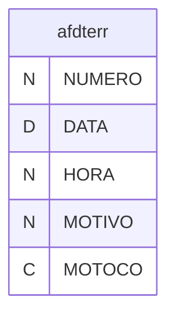

---
## Tabela DBF: `ajudira`
> **Origem:** `ajudira` (Driver: DBFCDX)

| Campo | Tipo | Tam | Dec |
| :--- | :--- | :--- | :--- |
| CPF | C | 14 | 0 |
| MES | N | 2 | 0 |
| NUMERO | N | 8 | 0 |
| VALOR1 | N | 12 | 2 |
| VALOR2 | N | 12 | 2 |
| VALOR3 | N | 12 | 2 |
| VALOR5 | N | 12 | 2 |
| VALOR4 | N | 12 | 2 |
| VALOR6 | N | 12 | 2 |
| VALOR7 | N | 12 | 2 |
| VALUF1 | N | 12 | 2 |
| VALUF2 | N | 12 | 2 |
| VALUF3 | N | 12 | 2 |
| VALUF4 | N | 12 | 2 |
| VALUF5 | N | 12 | 2 |
| VALUF6 | N | 12 | 2 |
| VALUF7 | N | 12 | 2 |

**Indices vinculados:**
- Tag: `AJUDIRA` Expressao: `CPF+STR(MES,2)`

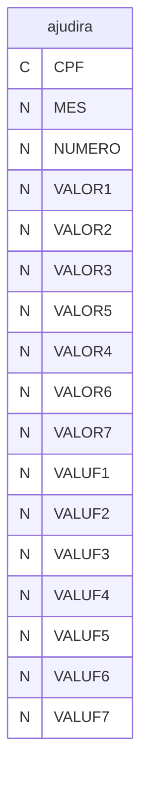

---
## Tabela DBF: `ajudird`
> **Origem:** `ajudird` (Driver: DBFCDX)

| Campo | Tipo | Tam | Dec |
| :--- | :--- | :--- | :--- |
| CPF | C | 14 | 0 |
| MES | N | 2 | 0 |
| NUMERO | N | 8 | 0 |
| VALOR1 | N | 12 | 2 |
| VALOR2 | N | 12 | 2 |
| VALOR3 | N | 12 | 2 |
| VALOR5 | N | 12 | 2 |
| VALOR4 | N | 12 | 2 |
| VALOR6 | N | 12 | 2 |
| VALOR7 | N | 12 | 2 |
| VALUF1 | N | 12 | 2 |
| VALUF2 | N | 12 | 2 |
| VALUF3 | N | 12 | 2 |
| VALUF4 | N | 12 | 2 |
| VALUF5 | N | 12 | 2 |
| VALUF6 | N | 12 | 2 |
| VALUF7 | N | 12 | 2 |

**Indices vinculados:**
- Tag: `AJUDIRD` Expressao: `CPF+STR(MES,2)`


---
## Tabela DBF: `ajudirf`
> **Origem:** `ajudirf` (Driver: DBFCDX)

| Campo | Tipo | Tam | Dec |
| :--- | :--- | :--- | :--- |
| CPF | C | 14 | 0 |
| MES | N | 2 | 0 |
| NUMERO | N | 8 | 0 |
| VALOR1 | N | 12 | 2 |
| VALOR2 | N | 12 | 2 |
| VALOR3 | N | 12 | 2 |
| VALOR5 | N | 12 | 2 |
| VALOR4 | N | 12 | 2 |
| VALOR6 | N | 12 | 2 |
| VALOR7 | N | 12 | 2 |
| VALUF1 | N | 12 | 2 |
| VALUF2 | N | 12 | 2 |
| VALUF3 | N | 12 | 2 |
| VALUF4 | N | 12 | 2 |
| VALUF5 | N | 12 | 2 |
| VALUF6 | N | 12 | 2 |
| VALUF7 | N | 12 | 2 |

**Indices vinculados:**
- Tag: `AJUDIRF` Expressao: `CPF+STR(MES,2)`

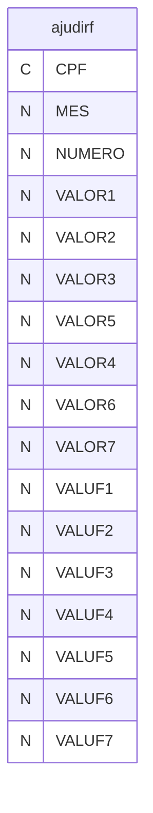

---
## Tabela DBF: `bcobak`
> **Origem:** `bcobak` (Driver: DBFCDX)

| Campo | Tipo | Tam | Dec |
| :--- | :--- | :--- | :--- |
| NUMERO | N | 8 | 0 |
| ANO | N | 4 | 0 |
| MES | N | 2 | 0 |
| SALDO | N | 8 | 2 |
| SALANT | N | 8 | 2 |
| CREDITO | N | 8 | 2 |
| DEBITO | N | 8 | 2 |
| DIAANT | N | 8 | 2 |
| DIACRE | N | 8 | 2 |
| DIADEB | N | 8 | 2 |
| DIASAL | N | 8 | 2 |

**Indices vinculados:**
- Tag: `BCOBAK` Expressao: `STR(NUMERO,8)+STR(ANO,4)+STR(MES,2)`

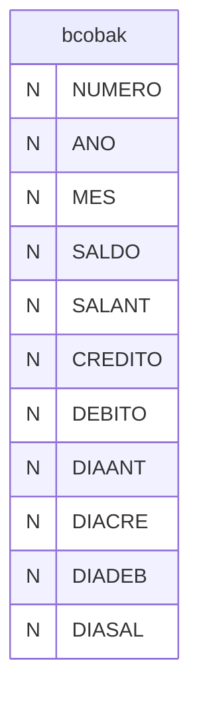

---
## Tabela DBF: `bcodek`
> **Origem:** `bcodek` (Driver: DBFCDX)

| Campo | Tipo | Tam | Dec |
| :--- | :--- | :--- | :--- |
| NUMERO | N | 8 | 0 |
| ANO | N | 4 | 0 |
| MES | N | 2 | 0 |
| SALDO | N | 8 | 2 |
| SALANT | N | 8 | 2 |
| CREDITO | N | 8 | 2 |
| DEBITO | N | 8 | 2 |
| DIAANT | N | 8 | 2 |
| DIACRE | N | 8 | 2 |
| DIADEB | N | 8 | 2 |
| DIASAL | N | 8 | 2 |

**Indices vinculados:**
- Tag: `BCODEK` Expressao: `STR(NUMERO,8)+STR(ANO,4)+STR(MES,2)`


---
## Tabela DBF: `bcodem`
> **Origem:** `bcodem` (Driver: DBFCDX)

| Campo | Tipo | Tam | Dec |
| :--- | :--- | :--- | :--- |
| NUMERO | N | 8 | 0 |
| ANO | N | 4 | 0 |
| MES | N | 2 | 0 |
| SALDO | N | 8 | 2 |
| SALANT | N | 8 | 2 |
| CREDITO | N | 8 | 2 |
| DEBITO | N | 8 | 2 |
| DIAANT | N | 8 | 2 |
| DIACRE | N | 8 | 2 |
| DIADEB | N | 8 | 2 |
| DIASAL | N | 8 | 2 |

**Indices vinculados:**
- Tag: `BCODEM` Expressao: `STR(NUMERO,8)+STR(ANO,4)+STR(MES,2)`

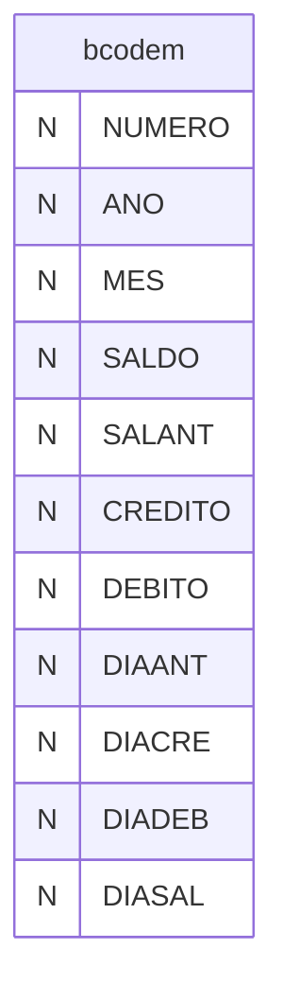

---
## Tabela DBF: `bcohrs`
> **Origem:** `bcohrs` (Driver: DBFCDX)

| Campo | Tipo | Tam | Dec |
| :--- | :--- | :--- | :--- |
| NUMERO | N | 8 | 0 |
| ANO | N | 4 | 0 |
| MES | N | 2 | 0 |
| SALDO | N | 8 | 2 |
| SALANT | N | 8 | 2 |
| CREDITO | N | 8 | 2 |
| DEBITO | N | 8 | 2 |
| DIAANT | N | 8 | 2 |
| DIACRE | N | 8 | 2 |
| DIADEB | N | 8 | 2 |
| DIASAL | N | 8 | 2 |

**Indices vinculados:**
- Tag: `BCOHRS` Expressao: `STR(NUMERO,8)+STR(ANO,4)+STR(MES,2)`

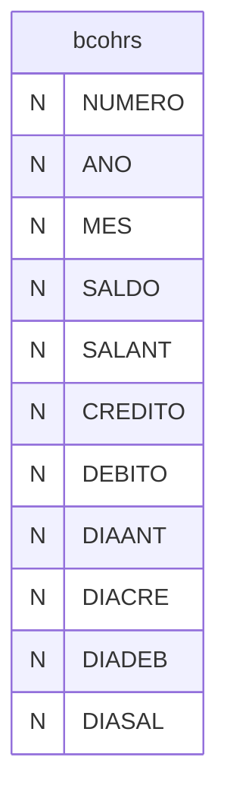

---
## Tabela DBF: `bcoreq`
> **Origem:** `bcoreq` (Driver: DBFCDX)

| Campo | Tipo | Tam | Dec |
| :--- | :--- | :--- | :--- |
| REQUISI | N | 8 | 0 |
| NUMERO | N | 8 | 0 |
| DATA | D | 8 | 0 |
| TIPO | C | 1 | 0 |
| HORAS | N | 6 | 2 |
| DIAS | N | 6 | 2 |
| OBS | C | 60 | 0 |
| IMP | C | 6 | 0 |

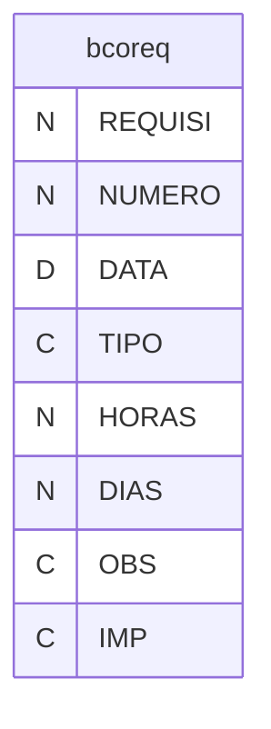

---
## Tabela DBF: `bcrbak`
> **Origem:** `bcrbak` (Driver: DBFCDX)

| Campo | Tipo | Tam | Dec |
| :--- | :--- | :--- | :--- |
| REQUISI | N | 8 | 0 |
| NUMERO | N | 8 | 0 |
| DATA | D | 8 | 0 |
| TIPO | C | 1 | 0 |
| HORAS | N | 6 | 2 |
| DIAS | N | 6 | 2 |
| OBS | C | 60 | 0 |
| IMP | C | 6 | 0 |

**Indices vinculados:**
- Tag: `BCRBAK` Expressao: `REQUISI`

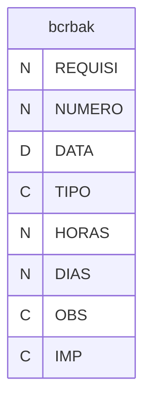

---
## Tabela DBF: `cesta`
> **Origem:** `cesta` (Driver: DBFCDX)

| Campo | Tipo | Tam | Dec |
| :--- | :--- | :--- | :--- |
| NUMERO | N | 8 | 0 |
| NOME | C | 40 | 0 |
| CESTA | C | 1 | 0 |
| ADMITIDO | D | 8 | 0 |
| OBS | C | 40 | 0 |

**Indices vinculados:**
- Tag: `CESTA` Expressao: `NUMERO`

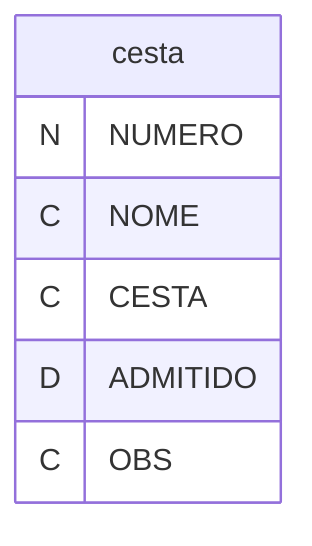

---
## Tabela DBF: `ctrhor`
> **Origem:** `ctrhor` (Driver: DBFCDX)

| Campo | Tipo | Tam | Dec |
| :--- | :--- | :--- | :--- |
| DEPTO | N | 4 | 0 |
| SETOR | N | 3 | 0 |
| SECAO | N | 3 | 0 |
| NOMEC | C | 15 | 0 |
| ANO | N | 4 | 0 |
| MES | N | 2 | 0 |
| QTFUN | N | 4 | 0 |
| HRTRA | N | 7 | 2 |
| HRDSR | N | 7 | 2 |
| HRNJU | N | 7 | 2 |
| HRJUS | N | 7 | 2 |
| CCUSTO | N | 6 | 0 |
| UNIFUN | C | 10 | 0 |
| MODIRETO | C | 1 | 0 |

**Indices vinculados:**
- Tag: `CTRHOR` Expressao: `STR(ANO,4)+STR(MES,2)+STR(DEPTO,4)`

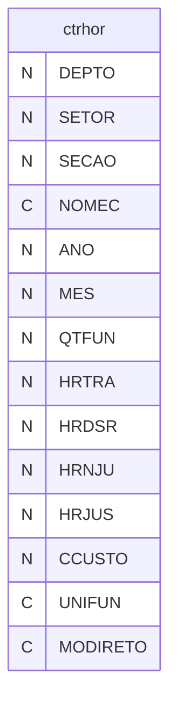

---
## Tabela DBF: `ferias`
> **Origem:** `ferias` (Driver: DBFCDX)

| Campo | Tipo | Tam | Dec |
| :--- | :--- | :--- | :--- |
| NUMERO | N | 5 | 0 |
| DEPTO | N | 4 | 0 |
| SECAO | N | 3 | 0 |
| SETOR | N | 3 | 0 |
| NOME | C | 30 | 0 |
| ADMITIDO | D | 8 | 0 |
| CCUSTO | N | 6 | 0 |
| UNIFUN | C | 10 | 0 |
| MODIRETA | C | 1 | 0 |
| QTVEN | N | 2 | 0 |
| INIPER | D | 8 | 0 |
| FIMPER | D | 8 | 0 |
| INIGOZ | D | 8 | 0 |
| FIMGOZ | D | 8 | 0 |
| INIPRG | D | 8 | 0 |
| FIMPRG | D | 8 | 0 |
| DEPSETSEC | N | 10 | 0 |
| DENUNIFUN | C | 30 | 0 |
| CNUMERO | C | 8 | 0 |
| FUNCAO | N | 8 | 0 |
| FUNNOME | C | 30 | 0 |
| HTT | C | 2 | 0 |
| SITUACAO | C | 2 | 0 |
| SALADM | N | 12 | 2 |

**Indices vinculados:**
- Tag: `FERIAS01` Expressao: `NUMERO`
- Tag: `FERIAS02` Expressao: `INIPER`
- Tag: `FERIAS03` Expressao: `STR(NUMERO,8)+DTOS(INIPER)`

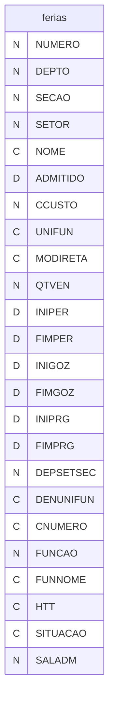

---
## Tabela DBF: `foopes`
> **Origem:** `foopes` (Driver: DBFCDX)

| Campo | Tipo | Tam | Dec |
| :--- | :--- | :--- | :--- |
| NUMERO | N | 8 | 0 |
| CNUMERO | C | 8 | 0 |
| DEPTO | N | 4 | 0 |
| SECAO | N | 3 | 0 |
| SETOR | N | 3 | 0 |
| DEPSETSEC | N | 10 | 0 |
| CHAPA | N | 8 | 0 |
| ORDEM | N | 10 | 0 |
| NOME | C | 60 | 0 |
| ENDTIP | C | 3 | 0 |
| ENDER | C | 40 | 0 |
| ENDNUM | C | 10 | 0 |
| ENDCOMPL | C | 30 | 0 |
| BAIRRO | C | 30 | 0 |
| IBGE | C | 7 | 0 |
| CIDADE | C | 35 | 0 |
| ESTADO | C | 2 | 0 |
| CEP | C | 9 | 0 |
| FONE | C | 14 | 0 |
| NASC | D | 8 | 0 |
| NASCIBGE | C | 7 | 0 |
| ANONASCI | N | 4 | 0 |
| NASCPAIS | C | 4 | 0 |
| CIVIL | N | 1 | 0 |
| ESTCIVIL | C | 1 | 0 |
| ESCRAIS | C | 2 | 0 |
| PAI | C | 40 | 0 |
| MAE | C | 40 | 0 |
| CPF | C | 14 | 0 |
| PROFIS | C | 7 | 0 |
| CTPSDATA | D | 8 | 0 |
| CTPSUF | C | 2 | 0 |
| SERIE | C | 5 | 0 |
| PIS | C | 11 | 0 |
| RGTIP | C | 3 | 0 |
| RG | C | 14 | 0 |
| RGUF | C | 2 | 0 |
| RGEMIS | C | 6 | 0 |
| RGDATA | D | 8 | 0 |
| FGTS | D | 8 | 0 |
| ADMITIDO | D | 8 | 0 |
| TIPFGTS | C | 2 | 0 |
| TIPO | C | 1 | 0 |
| HRSEM | N | 5 | 2 |
| FUNCAO | N | 4 | 0 |
| DEMITIDO | D | 8 | 0 |
| MOTIVO | C | 2 | 0 |
| DATCONTSIN | D | 8 | 0 |
| SINDICATO | N | 2 | 0 |
| BANCO | C | 3 | 0 |
| AGENCIA | C | 7 | 0 |
| CONTA | C | 12 | 0 |
| SOCIOSIND | C | 1 | 0 |
| SITUACAO | C | 2 | 0 |
| INSALUBRI | C | 1 | 0 |
| PERICULO | C | 1 | 0 |
| AVISOPREV | D | 8 | 0 |
| ALTFGTS | C | 3 | 0 |
| CONTAFGTS | C | 11 | 0 |
| AVOSM | N | 2 | 0 |
| SEXO | C | 1 | 0 |
| ASSM | C | 1 | 0 |
| ASSO | C | 1 | 0 |
| HT | C | 40 | 0 |
| FGTSMOT | C | 2 | 0 |
| MOTIVODEM | N | 2 | 0 |
| HTT | C | 2 | 0 |
| EXCVALE | C | 1 | 0 |
| VALEHORA | N | 6 | 2 |
| SALVAR13S | N | 12 | 2 |
| CNH | C | 11 | 0 |
| CATCNH | C | 2 | 0 |
| VALCNH | D | 8 | 0 |
| EXPCNH | D | 8 | 0 |
| OC | C | 10 | 0 |
| OCVAL | D | 8 | 0 |
| OCEXP | D | 8 | 0 |
| OCEMI | C | 10 | 0 |
| EXADAT | D | 8 | 0 |
| EXAPRO | D | 8 | 0 |
| CATEGORIA | C | 2 | 0 |
| PGFGTS | C | 1 | 0 |
| OCOFGTS | C | 1 | 0 |
| EOCO | C | 1 | 0 |
| VTDIAS | N | 3 | 0 |
| CI | N | 11 | 0 |
| CLASSE | N | 2 | 0 |
| TOMADOR | N | 8 | 0 |
| PGASSI | C | 1 | 0 |
| RACS | C | 1 | 0 |
| DEFICI | C | 1 | 0 |
| CCUSTO | N | 6 | 0 |
| UNIFUN | C | 10 | 0 |
| MODIRETA | C | 1 | 0 |
| CESTA | C | 1 | 0 |
| VT | C | 1 | 0 |
| EMAIL | C | 50 | 0 |
| TITULO | C | 14 | 0 |
| TITUZONA | C | 3 | 0 |
| TITUSECA | C | 3 | 0 |
| CNS | C | 15 | 0 |
| NUMREGANT | N | 8 | 0 |
| NUMEMPANT | N | 3 | 0 |
| DATTRANSF | D | 8 | 0 |
| ETADM | C | 1 | 0 |
| EIADM | C | 1 | 0 |
| E1ADM | C | 1 | 0 |
| EREGI | C | 3 | 0 |
| EPREV | C | 4 | 0 |
| EVINC | C | 3 | 0 |
| ELTRA | C | 1 | 0 |
| ETJOR | C | 1 | 0 |
| ETCOR | C | 1 | 0 |
| SALADM | N | 12 | 2 |
| APOSENT | C | 1 | 0 |
| APOSEND | D | 8 | 0 |
| RESERV | C | 12 | 0 |
| RESECAT | C | 1 | 0 |
| OCUF | C | 2 | 0 |
| CELULAR | C | 14 | 0 |
| RICUF | C | 2 | 0 |
| RICEXP | D | 8 | 0 |
| RIC | C | 32 | 0 |
| RICEMI | C | 3 | 0 |

**Indices vinculados:**
- Tag: `FO_PES` Expressao: `NUMERO`
- Tag: `FO_PES2` Expressao: `NOME`
- Tag: `FO_PES3` Expressao: `CPF`
- Tag: `FO_PES4` Expressao: `PIS`
- Tag: `FO_PES5` Expressao: `ordem`
- Tag: `TEMP` Expressao: `PIS+DTOS(ADMITIDO)`

```mermaid
erDiagram
    foopes {
        N NUMERO
        C CNUMERO
        N DEPTO
        N SECAO
        N SETOR
        N DEPSETSEC
        N CHAPA
        N ORDEM
        C NOME
        C ENDTIP
        C ENDER
        C ENDNUM
        C ENDCOMPL
        C BAIRRO
        C IBGE
        C CIDADE
        C ESTADO
        C CEP
        C FONE
        D NASC
        C NASCIBGE
        N ANONASCI
        C NASCPAIS
        N CIVIL
        C ESTCIVIL
        C ESCRAIS
        C PAI
        C MAE
        C CPF
        C PROFIS
        D CTPSDATA
        C CTPSUF
        C SERIE
        C PIS
        C RGTIP
        C RG
        C RGUF
        C RGEMIS
        D RGDATA
        D FGTS
        D ADMITIDO
        C TIPFGTS
        C TIPO
        N HRSEM
        N FUNCAO
        D DEMITIDO
        C MOTIVO
        D DATCONTSIN
        N SINDICATO
        C BANCO
        C AGENCIA
        C CONTA
        C SOCIOSIND
        C SITUACAO
        C INSALUBRI
        C PERICULO
        D AVISOPREV
        C ALTFGTS
        C CONTAFGTS
        N AVOSM
        C SEXO
        C ASSM
        C ASSO
        C HT
        C FGTSMOT
        N MOTIVODEM
        C HTT
        C EXCVALE
        N VALEHORA
        N SALVAR13S
        C CNH
        C CATCNH
        D VALCNH
        D EXPCNH
        C OC
        D OCVAL
        D OCEXP
        C OCEMI
        D EXADAT
        D EXAPRO
        C CATEGORIA
        C PGFGTS
        C OCOFGTS
        C EOCO
        N VTDIAS
        N CI
        N CLASSE
        N TOMADOR
        C PGASSI
        C RACS
        C DEFICI
        N CCUSTO
        C UNIFUN
        C MODIRETA
        C CESTA
        C VT
        C EMAIL
        C TITULO
        C TITUZONA
        C TITUSECA
        C CNS
        N NUMREGANT
        N NUMEMPANT
        D DATTRANSF
        C ETADM
        C EIADM
        C E1ADM
        C EREGI
        C EPREV
        C EVINC
        C ELTRA
        C ETJOR
        C ETCOR
        N SALADM
        C APOSENT
        D APOSEND
        C RESERV
        C RESECAT
        C OCUF
        C CELULAR
        C RICUF
        D RICEXP
        C RIC
        C RICEMI
    }
```

---
## Tabela DBF: `foptoatr`
> **Origem:** `foptoatr` (Driver: DBFCDX)

| Campo | Tipo | Tam | Dec |
| :--- | :--- | :--- | :--- |
| NUMERO | N | 8 | 0 |
| NOME | C | 40 | 0 |
| DATA | D | 8 | 0 |
| ENT | N | 5 | 2 |
| RENT | N | 5 | 2 |
| SAI | N | 5 | 2 |
| RSAI | N | 5 | 2 |
| CODANL | C | 2 | 0 |
| COD | C | 2 | 0 |
| SOD | C | 2 | 0 |
| BCOSN | C | 1 | 0 |
| OBSATR | C | 78 | 0 |
| HORXXX | N | 5 | 2 |

**Indices vinculados:**
- Tag: `FOPTOATR` Expressao: `STR(NUMERO,8)+DTOS(DATA)+CODANL`

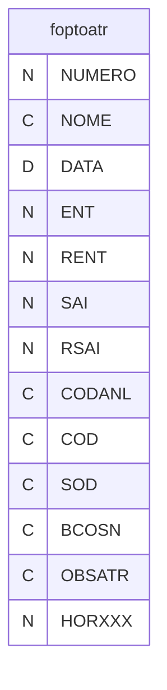

---
## Tabela DBF: `foptoeve`
> **Origem:** `foptoeve` (Driver: DBFCDX)

| Campo | Tipo | Tam | Dec |
| :--- | :--- | :--- | :--- |
| DIA | N | 2 | 0 |
| MES | N | 2 | 0 |
| CODIGO | C | 2 | 0 |
| DESCRICAO | C | 40 | 0 |
| BCOSN | C | 1 | 0 |
| REDSN | C | 1 | 0 |
| FOLSN | C | 1 | 0 |

**Indices vinculados:**
- Tag: `FOPTOEVE` Expressao: `STR(DIA,2)+STR(MES,2)`

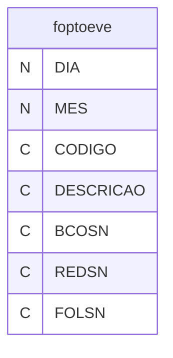

---
## Tabela DBF: `foptoprd`
> **Origem:** `foptoprd` (Driver: DBFCDX)

| Campo | Tipo | Tam | Dec |
| :--- | :--- | :--- | :--- |
| ORIGEM | N | 8 | 0 |
| DESTINO | N | 8 | 0 |
| DATA | D | 8 | 0 |
| NOME | C | 30 | 0 |

**Indices vinculados:**
- Tag: `FOPTOPRD` Expressao: `STR(ORIGEM,8)+DTOS(DATA)`

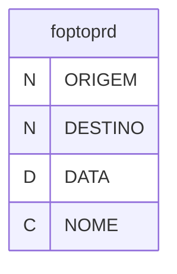

---
## Tabela DBF: `foptorev`
> **Origem:** `foptorev` (Driver: DBFCDX)

| Campo | Tipo | Tam | Dec |
| :--- | :--- | :--- | :--- |
| GRUPO | C | 2 | 0 |
| DATA | D | 8 | 0 |
| CODREV | C | 2 | 0 |
| ENTREV | N | 6 | 2 |
| ALIREV | N | 6 | 2 |
| ALSREV | N | 6 | 2 |
| SAIREV | N | 6 | 2 |
| VIRADA | C | 1 | 0 |
| SEQ | N | 2 | 0 |
| FOLGASN | C | 1 | 0 |
| CODADC | C | 2 | 0 |
| BCOSN | C | 1 | 0 |
| HORARIO | N | 8 | 0 |

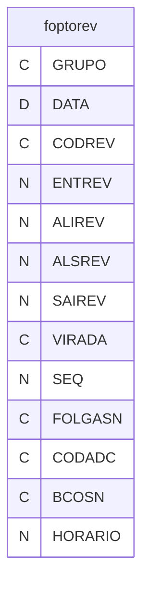

---
## Tabela DBF: `forais`
> **Origem:** `forais` (Driver: DBFCDX)

| Campo | Tipo | Tam | Dec |
| :--- | :--- | :--- | :--- |
| ANO | N | 4 | 0 |
| NUMERO | N | 8 | 0 |
| NOME | C | 30 | 0 |
| RAIZJAN | N | 10 | 2 |
| RAIZFEV | N | 10 | 2 |
| RAIZMAR | N | 10 | 2 |
| RAIZABR | N | 10 | 2 |
| RAIZMAI | N | 10 | 2 |
| RAIZJUN | N | 10 | 2 |
| RAIZJUL | N | 10 | 2 |
| RAIZAGO | N | 10 | 2 |
| RAIZSET | N | 10 | 2 |
| RAIZOUT | N | 10 | 2 |
| RAIZNOV | N | 10 | 2 |
| RAIZDEZ | N | 10 | 2 |
| RAIZAVI | N | 10 | 2 |
| SAL13_1 | N | 10 | 2 |
| MES_1 | N | 2 | 0 |
| SAL13_2 | N | 10 | 2 |
| MES_2 | N | 2 | 0 |
| RAIZFER | N | 9 | 2 |
| RAIZACR | N | 9 | 2 |
| RAIZGRA | N | 9 | 2 |
| RAIZMUL | N | 9 | 2 |
| RAIZBCH | N | 9 | 2 |
| MESBCH | N | 2 | 0 |
| MESACR | N | 2 | 0 |
| MESGRA | N | 2 | 0 |
| IBGECOD | C | 7 | 0 |
| HORJAN | N | 3 | 0 |
| HORFEV | N | 3 | 0 |
| HORMAR | N | 3 | 0 |
| HORABR | N | 3 | 0 |
| HORMAI | N | 3 | 0 |
| HORJUN | N | 3 | 0 |
| HORJUL | N | 3 | 0 |
| HORAGO | N | 3 | 0 |
| HORSET | N | 3 | 0 |
| HOROUT | N | 3 | 0 |
| HORNOV | N | 3 | 0 |
| HORDEZ | N | 3 | 0 |
| CODAFA01 | C | 2 | 0 |
| INIAFA01 | C | 4 | 0 |
| FIMAFA01 | C | 4 | 0 |
| CODAFA02 | C | 2 | 0 |
| INIAFA02 | C | 4 | 0 |
| FIMAFA02 | C | 4 | 0 |
| CODAFA03 | C | 2 | 0 |
| INIAFA03 | C | 4 | 0 |
| FIMAFA03 | C | 4 | 0 |
| DIASAFA | N | 3 | 0 |
| CGCSOC1 | C | 14 | 0 |
| VALSOC1 | N | 9 | 2 |
| CGCSOC2 | C | 14 | 0 |
| VALSOC2 | N | 9 | 2 |
| CGCSIN | C | 14 | 0 |
| VALSIN | N | 9 | 2 |
| CGCASS | C | 14 | 0 |
| VALASS | N | 9 | 2 |
| CGCCON | C | 14 | 0 |
| VALCON | N | 9 | 2 |
| RAISVINC | C | 2 | 0 |
| RAISSITU | C | 1 | 0 |
| RAISDEM | C | 2 | 0 |
| ALVARA | C | 1 | 0 |
| TIPOADM | C | 2 | 0 |

**Indices vinculados:**
- Tag: `FORAIS` Expressao: `STR(ANO,4)+STR(NUMERO,8)`
- Tag: `FORAIS-2` Expressao: `STR(ANO,4)+NOME`

```mermaid
erDiagram
    forais {
        N ANO
        N NUMERO
        C NOME
        N RAIZJAN
        N RAIZFEV
        N RAIZMAR
        N RAIZABR
        N RAIZMAI
        N RAIZJUN
        N RAIZJUL
        N RAIZAGO
        N RAIZSET
        N RAIZOUT
        N RAIZNOV
        N RAIZDEZ
        N RAIZAVI
        N SAL13_1
        N MES_1
        N SAL13_2
        N MES_2
        N RAIZFER
        N RAIZACR
        N RAIZGRA
        N RAIZMUL
        N RAIZBCH
        N MESBCH
        N MESACR
        N MESGRA
        C IBGECOD
        N HORJAN
        N HORFEV
        N HORMAR
        N HORABR
        N HORMAI
        N HORJUN
        N HORJUL
        N HORAGO
        N HORSET
        N HOROUT
        N HORNOV
        N HORDEZ
        C CODAFA01
        C INIAFA01
        C FIMAFA01
        C CODAFA02
        C INIAFA02
        C FIMAFA02
        C CODAFA03
        C INIAFA03
        C FIMAFA03
        N DIASAFA
        C CGCSOC1
        N VALSOC1
        C CGCSOC2
        N VALSOC2
        C CGCSIN
        N VALSIN
        C CGCASS
        N VALASS
        C CGCCON
        N VALCON
        C RAISVINC
        C RAISSITU
        C RAISDEM
        C ALVARA
        C TIPOADM
    }
```

---
## Tabela DBF: `fosfam`
> **Origem:** `fosfam` (Driver: DBFCDX)

| Campo | Tipo | Tam | Dec |
| :--- | :--- | :--- | :--- |
| REQUISI | N | 8 | 0 |
| NUMERO | N | 8 | 0 |
| NOME | C | 40 | 0 |
| NASCTO | D | 8 | 0 |
| LOCAL | C | 35 | 0 |
| CARTORIO | C | 15 | 0 |
| NREGIS | C | 32 | 0 |
| LIVRO | C | 5 | 0 |
| FOLHA | C | 5 | 0 |
| ENTREGA | D | 8 | 0 |
| BAIXA | D | 8 | 0 |
| CNS | C | 15 | 0 |
| IRRF | C | 1 | 0 |
| SALFAM | C | 1 | 0 |
| GRPA | C | 2 | 0 |
| ESOCIAL | C | 2 | 0 |
| NCARTORIO | C | 6 | 0 |
| TERMO | C | 7 | 0 |
| LOCALIBGE | C | 7 | 0 |
| SEXO | C | 1 | 0 |
| LOCALUF | C | 2 | 0 |
| CPF | C | 14 | 0 |
| CPFTIT | C | 14 | 0 |
| VIVO | C | 1 | 0 |
| CASAMENTO | D | 8 | 0 |
| ESTCIVIL | C | 1 | 0 |
| ESTUDO | C | 1 | 0 |
| INVALIDEZ | C | 1 | 0 |
| RG | C | 14 | 0 |
| RGUF | C | 2 | 0 |
| RGEMIS | C | 6 | 0 |
| RGDATA | D | 8 | 0 |

**Indices vinculados:**
- Tag: `FOSFAM` Expressao: `STR(NUMERO,8)+STR(REQUISI,8)`
- Tag: `FOSFAM-2` Expressao: `CPFTIT+CPF`
- Tag: `FOSFAM-3` Expressao: `CPFTIT+NOME`

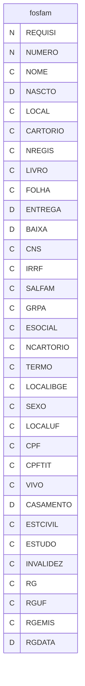

---
## Tabela DBF: `fo_comp`
> **Origem:** `fo_comp` (Driver: DBFCDX)

| Campo | Tipo | Tam | Dec |
| :--- | :--- | :--- | :--- |
| NUMERO | N | 5 | 0 |
| CONTA | N | 4 | 0 |
| HORAS | N | 6 | 2 |
| VALOR | N | 12 | 2 |
| CONTROLE | N | 9 | 0 |
| FATOR | N | 8 | 5 |
| TRIBUTIRR | N | 1 | 0 |
| TRIBUTINPS | N | 1 | 0 |
| TRIB_FGTS | N | 1 | 0 |
| TIPO | N | 1 | 0 |
| VALORBASE | N | 10 | 2 |
| VALORMES1 | N | 12 | 2 |
| VALORMES3 | N | 12 | 2 |
| MES1 | N | 2 | 0 |
| MES2 | N | 2 | 0 |

**Indices vinculados:**
- Tag: `FO_COMP` Expressao: `CONTROLE`

```mermaid
erDiagram
    fo_comp {
        N NUMERO
        N CONTA
        N HORAS
        N VALOR
        N CONTROLE
        N FATOR
        N TRIBUTIRR
        N TRIBUTINPS
        N TRIB_FGTS
        N TIPO
        N VALORBASE
        N VALORMES1
        N VALORMES3
        N MES1
        N MES2
    }
```

---
## Tabela DBF: `fo_dio`
> **Origem:** `fo_dio` (Driver: DBFCDX)

| Campo | Tipo | Tam | Dec |
| :--- | :--- | :--- | :--- |
| NUMERO | N | 8 | 0 |
| DATA | D | 8 | 0 |
| HORA | N | 5 | 2 |
| RELOGIO | C | 5 | 0 |
| TIPOM | C | 1 | 0 |
| TIPOR | C | 1 | 0 |

```mermaid
erDiagram
    fo_dio {
        N NUMERO
        D DATA
        N HORA
        C RELOGIO
        C TIPOM
        C TIPOR
    }
```

---
## Tabela DBF: `fo_exp`
> **Origem:** `fo_exp` (Driver: DBFCDX)

| Campo | Tipo | Tam | Dec |
| :--- | :--- | :--- | :--- |
| DEPTO | N | 4 | 0 |
| SETOR | N | 3 | 0 |
| SECAO | N | 3 | 0 |
| CHAPA | N | 3 | 0 |
| NUMERO | N | 5 | 0 |
| NOME | C | 30 | 0 |
| ADMITIDO | D | 8 | 0 |
| DIAS1 | N | 3 | 0 |
| DIAS2 | N | 3 | 0 |
| DATAFIM1 | D | 8 | 0 |
| DATAFIM2 | D | 8 | 0 |
| OBS1 | C | 60 | 0 |
| OBS2 | C | 60 | 0 |
| OBS3 | C | 60 | 0 |
| OBS4 | C | 60 | 0 |
| OBS5 | C | 60 | 0 |

**Indices vinculados:**
- Tag: `FO_EXP` Expressao: `NUMERO`

```mermaid
erDiagram
    fo_exp {
        N DEPTO
        N SETOR
        N SECAO
        N CHAPA
        N NUMERO
        C NOME
        D ADMITIDO
        N DIAS1
        N DIAS2
        D DATAFIM1
        D DATAFIM2
        C OBS1
        C OBS2
        C OBS3
        C OBS4
        C OBS5
    }
```

---
## Tabela DBF: `fo_fer`
> **Origem:** `fo_fer` (Driver: DBFCDX)

| Campo | Tipo | Tam | Dec |
| :--- | :--- | :--- | :--- |
| DEPTO | N | 4 | 0 |
| SECAO | N | 3 | 0 |
| SETOR | N | 3 | 0 |
| CHAPA | N | 4 | 0 |
| NUMERO | N | 5 | 0 |
| CONTROLE | N | 18 | 0 |
| DATFERIAS | D | 8 | 0 |
| DATFERIASF | D | 8 | 0 |
| FALTAS | N | 3 | 0 |
| GOZOU1DE | D | 8 | 0 |
| GOZOU1ATE | D | 8 | 0 |
| GOZOU2DE | D | 8 | 0 |
| GOZOU2ATE | D | 8 | 0 |
| PROGRAMA | D | 8 | 0 |
| PROGRAMA1 | D | 8 | 0 |
| DIASJUS | N | 2 | 0 |
| DIASPAGO | N | 2 | 0 |
| DIASGOZA | N | 2 | 0 |
| BAIXADO | C | 1 | 0 |
| ABONO1DE | D | 8 | 0 |
| ABONO1ATE | D | 8 | 0 |
| DIASPAGO2 | N | 2 | 0 |
| DIASGOZA2 | N | 2 | 0 |
| DIASPAGO3 | N | 2 | 0 |
| DIASGOZA3 | N | 2 | 0 |
| NOME | C | 30 | 0 |
| COMPDATAI | D | 8 | 0 |
| COMPDATAF | D | 8 | 0 |
| FA01 | N | 2 | 0 |
| FA02 | N | 2 | 0 |
| FA03 | N | 2 | 0 |
| FA04 | N | 2 | 0 |
| FA05 | N | 2 | 0 |
| FA06 | N | 2 | 0 |
| FA07 | N | 2 | 0 |
| FA08 | N | 2 | 0 |
| FA09 | N | 2 | 0 |
| FA10 | N | 2 | 0 |
| FA11 | N | 2 | 0 |
| FA12 | N | 2 | 0 |
| FA13 | N | 2 | 0 |
| SALVAR | N | 12 | 2 |
| SALVARC | N | 12 | 2 |
| COMPABOI | D | 8 | 0 |
| COMPABOF | D | 8 | 0 |

**Indices vinculados:**
- Tag: `FO_FER` Expressao: `CONTROLE`

```mermaid
erDiagram
    fo_fer {
        N DEPTO
        N SECAO
        N SETOR
        N CHAPA
        N NUMERO
        N CONTROLE
        D DATFERIAS
        D DATFERIASF
        N FALTAS
        D GOZOU1DE
        D GOZOU1ATE
        D GOZOU2DE
        D GOZOU2ATE
        D PROGRAMA
        D PROGRAMA1
        N DIASJUS
        N DIASPAGO
        N DIASGOZA
        C BAIXADO
        D ABONO1DE
        D ABONO1ATE
        N DIASPAGO2
        N DIASGOZA2
        N DIASPAGO3
        N DIASGOZA3
        C NOME
        D COMPDATAI
        D COMPDATAF
        N FA01
        N FA02
        N FA03
        N FA04
        N FA05
        N FA06
        N FA07
        N FA08
        N FA09
        N FA10
        N FA11
        N FA12
        N FA13
        N SALVAR
        N SALVARC
        D COMPABOI
        D COMPABOF
    }
```

---
## Tabela DBF: `fo_ffe`
> **Origem:** `fo_ffe` (Driver: DBFCDX)

| Campo | Tipo | Tam | Dec |
| :--- | :--- | :--- | :--- |
| CONTA | N | 3 | 0 |
| MES | N | 2 | 0 |
| HORAS | N | 10 | 2 |
| VALOR | N | 18 | 2 |
| CONTROLE | N | 5 | 0 |

**Indices vinculados:**
- Tag: `FO_FFE` Expressao: `CONTROLE`

```mermaid
erDiagram
    fo_ffe {
        N CONTA
        N MES
        N HORAS
        N VALOR
        N CONTROLE
    }
```

---
## Tabela DBF: `fo_fp13a`
> **Origem:** `fo_fp13a` (Driver: DBFCDX)

| Campo | Tipo | Tam | Dec |
| :--- | :--- | :--- | :--- |
| NUMERO | N | 5 | 0 |
| CONTA | N | 4 | 0 |
| HORAS | N | 7 | 2 |
| VALOR | N | 12 | 2 |
| CONTROLE | N | 9 | 0 |
| FATOR | N | 6 | 4 |
| TRIBUTIRR | N | 1 | 0 |
| TRIBUTINPS | N | 1 | 0 |
| TRIB_FGTS | N | 1 | 0 |
| TIPO | N | 1 | 0 |
| VALORBASE | N | 10 | 2 |

**Indices vinculados:**
- Tag: `FO_FP13A` Expressao: `CONTROLE`

```mermaid
erDiagram
    fo_fp13a {
        N NUMERO
        N CONTA
        N HORAS
        N VALOR
        N CONTROLE
        N FATOR
        N TRIBUTIRR
        N TRIBUTINPS
        N TRIB_FGTS
        N TIPO
        N VALORBASE
    }
```

---
## Tabela DBF: `fo_fp13b`
> **Origem:** `fo_fp13b` (Driver: DBFCDX)

| Campo | Tipo | Tam | Dec |
| :--- | :--- | :--- | :--- |
| NUMERO | N | 5 | 0 |
| CONTA | N | 4 | 0 |
| HORAS | N | 7 | 2 |
| VALOR | N | 12 | 2 |
| CONTROLE | N | 9 | 0 |
| FATOR | N | 6 | 4 |
| TRIBUTIRR | N | 1 | 0 |
| TRIBUTINPS | N | 1 | 0 |
| TRIB_FGTS | N | 1 | 0 |
| TIPO | N | 1 | 0 |
| VALORBASE | N | 10 | 2 |

**Indices vinculados:**
- Tag: `FO_FP13B` Expressao: `CONTROLE`

```mermaid
erDiagram
    fo_fp13b {
        N NUMERO
        N CONTA
        N HORAS
        N VALOR
        N CONTROLE
        N FATOR
        N TRIBUTIRR
        N TRIBUTINPS
        N TRIB_FGTS
        N TIPO
        N VALORBASE
    }
```

---
## Tabela DBF: `fo_fp13c`
> **Origem:** `fo_fp13c` (Driver: DBFCDX)

| Campo | Tipo | Tam | Dec |
| :--- | :--- | :--- | :--- |
| NUMERO | N | 5 | 0 |
| CONTA | N | 4 | 0 |
| HORAS | N | 7 | 2 |
| VALOR | N | 12 | 2 |
| CONTROLE | N | 9 | 0 |
| FATOR | N | 6 | 4 |
| TRIBUTIRR | N | 1 | 0 |
| TRIBUTINPS | N | 1 | 0 |
| TRIB_FGTS | N | 1 | 0 |
| TIPO | N | 1 | 0 |
| VALORBASE | N | 10 | 2 |

**Indices vinculados:**
- Tag: `FO_FP13C` Expressao: `CONTROLE`

```mermaid
erDiagram
    fo_fp13c {
        N NUMERO
        N CONTA
        N HORAS
        N VALOR
        N CONTROLE
        N FATOR
        N TRIBUTIRR
        N TRIBUTINPS
        N TRIB_FGTS
        N TIPO
        N VALORBASE
    }
```

---
## Tabela DBF: `fo_hor`
> **Origem:** `fo_hor` (Driver: DBFCDX)

| Campo | Tipo | Tam | Dec |
| :--- | :--- | :--- | :--- |
| NUMERO | N | 5 | 0 |
| NOME | C | 30 | 0 |
| D1 | C | 60 | 0 |
| D2 | C | 60 | 0 |
| D3 | C | 60 | 0 |
| D4 | C | 60 | 0 |
| D5 | C | 60 | 0 |
| D6 | C | 60 | 0 |
| D7 | C | 60 | 0 |

**Indices vinculados:**
- Tag: `FO_HOR` Expressao: `NUMERO`

```mermaid
erDiagram
    fo_hor {
        N NUMERO
        C NOME
        C D1
        C D2
        C D3
        C D4
        C D5
        C D6
        C D7
    }
```

---
## Tabela DBF: `fo_ira`
> **Origem:** `fo_ira` (Driver: DBFCDX)

| Campo | Tipo | Tam | Dec |
| :--- | :--- | :--- | :--- |
| NUMERO | N | 6 | 0 |
| CODREN | N | 3 | 0 |
| MES | N | 2 | 0 |
| VALOR | N | 18 | 2 |
| VALUFIR | N | 18 | 2 |
| CONTROLE | N | 18 | 0 |
| CPF | C | 14 | 0 |
| CONTROL2 | C | 20 | 0 |

**Indices vinculados:**
- Tag: `FO_IRA` Expressao: `CONTROL2`

```mermaid
erDiagram
    fo_ira {
        N NUMERO
        N CODREN
        N MES
        N VALOR
        N VALUFIR
        N CONTROLE
        C CPF
        C CONTROL2
    }
```

---
## Tabela DBF: `fo_ird`
> **Origem:** `fo_ird` (Driver: DBFCDX)

| Campo | Tipo | Tam | Dec |
| :--- | :--- | :--- | :--- |
| NUMERO | N | 6 | 0 |
| CODREN | N | 3 | 0 |
| MES | N | 2 | 0 |
| VALOR | N | 18 | 2 |
| VALUFIR | N | 18 | 2 |
| CONTROLE | N | 18 | 0 |
| CPF | C | 14 | 0 |
| CONTROL2 | C | 20 | 0 |

**Indices vinculados:**
- Tag: `FO_IRD` Expressao: `CONTROL2`

```mermaid
erDiagram
    fo_ird {
        N NUMERO
        N CODREN
        N MES
        N VALOR
        N VALUFIR
        N CONTROLE
        C CPF
        C CONTROL2
    }
```

---
## Tabela DBF: `fo_irr`
> **Origem:** `fo_irr` (Driver: DBFCDX)

| Campo | Tipo | Tam | Dec |
| :--- | :--- | :--- | :--- |
| NUMERO | N | 6 | 0 |
| CODREN | N | 3 | 0 |
| MES | N | 2 | 0 |
| VALOR | N | 18 | 2 |
| VALUFIR | N | 18 | 2 |
| CONTROLE | N | 18 | 0 |
| CPF | C | 14 | 0 |
| CONTROL2 | C | 20 | 0 |

**Indices vinculados:**
- Tag: `FO_IRR` Expressao: `CONTROL2`

```mermaid
erDiagram
    fo_irr {
        N NUMERO
        N CODREN
        N MES
        N VALOR
        N VALUFIR
        N CONTROLE
        C CPF
        C CONTROL2
    }
```

---
## Tabela DBF: `fo_oco`
> **Origem:** `fo_oco` (Driver: DBFCDX)

| Campo | Tipo | Tam | Dec |
| :--- | :--- | :--- | :--- |
| NUMERO | N | 8 | 0 |
| DATASAIDA | D | 8 | 0 |
| PERIODOPAG | N | 3 | 0 |
| DATARETORN | D | 8 | 0 |
| CODIGO | C | 2 | 0 |
| NOME | C | 30 | 0 |
| TEM_13_SAL | C | 1 | 0 |
| PRAZOMAXIM | N | 4 | 0 |
| CONTA | N | 3 | 0 |
| CONTROLE | N | 18 | 0 |
| OBS | C | 60 | 0 |
| OBS2 | C | 60 | 0 |
| NOMEF | C | 30 | 0 |
| DATAFIM13S | D | 8 | 0 |
| DATAFIMPAG | D | 8 | 0 |
| DEPTO | N | 4 | 0 |
| SETOR | N | 3 | 0 |
| SECAO | N | 3 | 0 |
| CHAPA | N | 5 | 0 |
| VALPG | N | 12 | 2 |
| ABTFGTS | C | 1 | 0 |
| CODFGS | C | 2 | 0 |
| CODFGR | C | 2 | 0 |
| PGFGS | C | 1 | 0 |
| PGFGR | C | 1 | 0 |
| DIASS | N | 2 | 0 |
| DIASR | N | 2 | 0 |

**Indices vinculados:**
- Tag: `FO_OCO` Expressao: `STR(NUMERO,8)+DTOS(DATASAIDA)`

```mermaid
erDiagram
    fo_oco {
        N NUMERO
        D DATASAIDA
        N PERIODOPAG
        D DATARETORN
        C CODIGO
        C NOME
        C TEM_13_SAL
        N PRAZOMAXIM
        N CONTA
        N CONTROLE
        C OBS
        C OBS2
        C NOMEF
        D DATAFIM13S
        D DATAFIMPAG
        N DEPTO
        N SETOR
        N SECAO
        N CHAPA
        N VALPG
        C ABTFGTS
        C CODFGS
        C CODFGR
        C PGFGS
        C PGFGR
        N DIASS
        N DIASR
    }
```

---
## Tabela DBF: `fo_pdes`
> **Origem:** `fo_pdes` (Driver: DBFCDX)

| Campo | Tipo | Tam | Dec |
| :--- | :--- | :--- | :--- |
| NUMERO | N | 8 | 0 |
| DATA | D | 8 | 0 |
| CONTA | N | 2 | 0 |
| HORAS | N | 6 | 2 |
| OBS | C | 60 | 0 |
| HORA2 | N | 6 | 2 |

```mermaid
erDiagram
    fo_pdes {
        N NUMERO
        D DATA
        N CONTA
        N HORAS
        C OBS
        N HORA2
    }
```

---
## Tabela DBF: `fo_pes`
> **Origem:** `fo_pes` (Driver: DBFCDX)

| Campo | Tipo | Tam | Dec |
| :--- | :--- | :--- | :--- |
| NUMERO | N | 8 | 0 |
| CNUMERO | C | 8 | 0 |
| DEPTO | N | 4 | 0 |
| SECAO | N | 3 | 0 |
| SETOR | N | 3 | 0 |
| DEPSETSEC | N | 10 | 0 |
| CHAPA | N | 8 | 0 |
| ORDEM | N | 10 | 0 |
| NOME | C | 60 | 0 |
| ENDTIP | C | 3 | 0 |
| ENDER | C | 40 | 0 |
| ENDNUM | C | 10 | 0 |
| ENDCOMPL | C | 30 | 0 |
| BAIRRO | C | 30 | 0 |
| IBGE | C | 7 | 0 |
| CIDADE | C | 35 | 0 |
| ESTADO | C | 2 | 0 |
| CEP | C | 9 | 0 |
| FONE | C | 14 | 0 |
| NASC | D | 8 | 0 |
| NASCIBGE | C | 7 | 0 |
| ANONASCI | N | 4 | 0 |
| NASCPAIS | C | 4 | 0 |
| CIVIL | N | 1 | 0 |
| ESTCIVIL | C | 1 | 0 |
| ESCRAIS | C | 2 | 0 |
| PAI | C | 40 | 0 |
| MAE | C | 40 | 0 |
| CPF | C | 14 | 0 |
| PROFIS | C | 7 | 0 |
| CTPSDATA | D | 8 | 0 |
| CTPSUF | C | 2 | 0 |
| SERIE | C | 5 | 0 |
| PIS | C | 11 | 0 |
| RGTIP | C | 3 | 0 |
| RG | C | 14 | 0 |
| RGUF | C | 2 | 0 |
| RGEMIS | C | 6 | 0 |
| RGDATA | D | 8 | 0 |
| FGTS | D | 8 | 0 |
| ADMITIDO | D | 8 | 0 |
| TIPFGTS | C | 2 | 0 |
| TIPO | C | 1 | 0 |
| HRSEM | N | 5 | 2 |
| FUNCAO | N | 4 | 0 |
| DEMITIDO | D | 8 | 0 |
| MOTIVO | C | 2 | 0 |
| DATCONTSIN | D | 8 | 0 |
| SINDICATO | N | 2 | 0 |
| BANCO | C | 3 | 0 |
| AGENCIA | C | 7 | 0 |
| CONTA | C | 12 | 0 |
| SOCIOSIND | C | 1 | 0 |
| SITUACAO | C | 2 | 0 |
| INSALUBRI | C | 1 | 0 |
| PERICULO | C | 1 | 0 |
| AVISOPREV | D | 8 | 0 |
| ALTFGTS | C | 3 | 0 |
| CONTAFGTS | C | 11 | 0 |
| AVOSM | N | 2 | 0 |
| SEXO | C | 1 | 0 |
| ASSM | C | 1 | 0 |
| ASSO | C | 1 | 0 |
| HT | C | 40 | 0 |
| FGTSMOT | C | 2 | 0 |
| MOTIVODEM | N | 2 | 0 |
| HTT | C | 2 | 0 |
| EXCVALE | C | 1 | 0 |
| VALEHORA | N | 6 | 2 |
| SALVAR13S | N | 12 | 2 |
| CNH | C | 11 | 0 |
| CATCNH | C | 2 | 0 |
| VALCNH | D | 8 | 0 |
| EXPCNH | D | 8 | 0 |
| OC | C | 10 | 0 |
| OCVAL | D | 8 | 0 |
| OCEXP | D | 8 | 0 |
| OCEMI | C | 10 | 0 |
| EXADAT | D | 8 | 0 |
| EXAPRO | D | 8 | 0 |
| CATEGORIA | C | 2 | 0 |
| PGFGTS | C | 1 | 0 |
| OCOFGTS | C | 1 | 0 |
| EOCO | C | 1 | 0 |
| VTDIAS | N | 3 | 0 |
| CI | N | 11 | 0 |
| CLASSE | N | 2 | 0 |
| TOMADOR | N | 8 | 0 |
| PGASSI | C | 1 | 0 |
| RACS | C | 1 | 0 |
| DEFICI | C | 1 | 0 |
| CCUSTO | N | 6 | 0 |
| UNIFUN | C | 10 | 0 |
| MODIRETA | C | 1 | 0 |
| CESTA | C | 1 | 0 |
| VT | C | 1 | 0 |
| EMAIL | C | 50 | 0 |
| TITULO | C | 14 | 0 |
| TITUZONA | C | 3 | 0 |
| TITUSECA | C | 3 | 0 |
| CNS | C | 15 | 0 |
| NUMREGANT | N | 8 | 0 |
| NUMEMPANT | N | 3 | 0 |
| DATTRANSF | D | 8 | 0 |
| ETADM | C | 1 | 0 |
| EIADM | C | 1 | 0 |
| E1ADM | C | 1 | 0 |
| EREGI | C | 3 | 0 |
| EPREV | C | 4 | 0 |
| EVINC | C | 3 | 0 |
| ELTRA | C | 1 | 0 |
| ETJOR | C | 1 | 0 |
| ETCOR | C | 1 | 0 |
| SALADM | N | 12 | 2 |
| APOSENT | C | 1 | 0 |
| APOSEND | D | 8 | 0 |
| RESERV | C | 12 | 0 |
| RESECAT | C | 1 | 0 |
| OCUF | C | 2 | 0 |
| CELULAR | C | 14 | 0 |
| RICUF | C | 2 | 0 |
| RICEXP | D | 8 | 0 |
| RIC | C | 32 | 0 |
| RICEMI | C | 3 | 0 |

**Indices vinculados:**
- Tag: `FO_PES` Expressao: `NUMERO`
- Tag: `FO_PES2` Expressao: `NOME`
- Tag: `FO_PES3` Expressao: `CPF`
- Tag: `FO_PES4` Expressao: `PIS`
- Tag: `FO_PES5` Expressao: `ORDEM`

```mermaid
erDiagram
    fo_pes {
        N NUMERO
        C CNUMERO
        N DEPTO
        N SECAO
        N SETOR
        N DEPSETSEC
        N CHAPA
        N ORDEM
        C NOME
        C ENDTIP
        C ENDER
        C ENDNUM
        C ENDCOMPL
        C BAIRRO
        C IBGE
        C CIDADE
        C ESTADO
        C CEP
        C FONE
        D NASC
        C NASCIBGE
        N ANONASCI
        C NASCPAIS
        N CIVIL
        C ESTCIVIL
        C ESCRAIS
        C PAI
        C MAE
        C CPF
        C PROFIS
        D CTPSDATA
        C CTPSUF
        C SERIE
        C PIS
        C RGTIP
        C RG
        C RGUF
        C RGEMIS
        D RGDATA
        D FGTS
        D ADMITIDO
        C TIPFGTS
        C TIPO
        N HRSEM
        N FUNCAO
        D DEMITIDO
        C MOTIVO
        D DATCONTSIN
        N SINDICATO
        C BANCO
        C AGENCIA
        C CONTA
        C SOCIOSIND
        C SITUACAO
        C INSALUBRI
        C PERICULO
        D AVISOPREV
        C ALTFGTS
        C CONTAFGTS
        N AVOSM
        C SEXO
        C ASSM
        C ASSO
        C HT
        C FGTSMOT
        N MOTIVODEM
        C HTT
        C EXCVALE
        N VALEHORA
        N SALVAR13S
        C CNH
        C CATCNH
        D VALCNH
        D EXPCNH
        C OC
        D OCVAL
        D OCEXP
        C OCEMI
        D EXADAT
        D EXAPRO
        C CATEGORIA
        C PGFGTS
        C OCOFGTS
        C EOCO
        N VTDIAS
        N CI
        N CLASSE
        N TOMADOR
        C PGASSI
        C RACS
        C DEFICI
        N CCUSTO
        C UNIFUN
        C MODIRETA
        C CESTA
        C VT
        C EMAIL
        C TITULO
        C TITUZONA
        C TITUSECA
        C CNS
        N NUMREGANT
        N NUMEMPANT
        D DATTRANSF
        C ETADM
        C EIADM
        C E1ADM
        C EREGI
        C EPREV
        C EVINC
        C ELTRA
        C ETJOR
        C ETCOR
        N SALADM
        C APOSENT
        D APOSEND
        C RESERV
        C RESECAT
        C OCUF
        C CELULAR
        C RICUF
        D RICEXP
        C RIC
        C RICEMI
    }
```

---
## Tabela DBF: `fo_pfe`
> **Origem:** `fo_pfe` (Driver: DBFCDX)

| Campo | Tipo | Tam | Dec |
| :--- | :--- | :--- | :--- |
| NUMERO | N | 5 | 0 |
| CONTA | N | 4 | 0 |
| HORAS | N | 6 | 2 |
| VALOR | N | 12 | 2 |
| CONTROLE | N | 15 | 0 |
| FATOR | N | 8 | 5 |
| TRIBUTIRR | N | 1 | 0 |
| TRIBUTINPS | N | 1 | 0 |
| TRIB_FGTS | N | 1 | 0 |
| TIPO | N | 1 | 0 |
| VALORBASE | N | 10 | 2 |
| VALORMES1 | N | 18 | 2 |
| VALORMES2 | N | 18 | 2 |
| MES1 | N | 2 | 0 |
| MES2 | N | 2 | 0 |
| DATACOMP | D | 8 | 0 |

**Indices vinculados:**
- Tag: `FO_PFE` Expressao: `CONTROLE`

```mermaid
erDiagram
    fo_pfe {
        N NUMERO
        N CONTA
        N HORAS
        N VALOR
        N CONTROLE
        N FATOR
        N TRIBUTIRR
        N TRIBUTINPS
        N TRIB_FGTS
        N TIPO
        N VALORBASE
        N VALORMES1
        N VALORMES2
        N MES1
        N MES2
        D DATACOMP
    }
```

---
## Tabela DBF: `fo_phor`
> **Origem:** `fo_phor` (Driver: DBFCDX)

| Campo | Tipo | Tam | Dec |
| :--- | :--- | :--- | :--- |
| NUMERO | N | 8 | 0 |
| OCOINI | D | 8 | 0 |
| OCOFIM | D | 8 | 0 |
| OCOCOD | C | 2 | 0 |
| OCOMOT | C | 60 | 0 |
| MOTIVO | N | 8 | 0 |

```mermaid
erDiagram
    fo_phor {
        N NUMERO
        D OCOINI
        D OCOFIM
        C OCOCOD
        C OCOMOT
        N MOTIVO
    }
```

---
## Tabela DBF: `fo_pman`
> **Origem:** `fo_pman` (Driver: DBFCDX)

| Campo | Tipo | Tam | Dec |
| :--- | :--- | :--- | :--- |
| NUMERO | N | 8 | 0 |
| DATOCO | D | 8 | 0 |
| HOROCO | N | 5 | 2 |
| HOROC2 | N | 5 | 2 |
| HOROC3 | N | 5 | 2 |
| HOROC4 | N | 5 | 2 |
| TIPOCO | C | 1 | 0 |
| MOTOCO | C | 60 | 0 |
| MOTIVO | N | 8 | 0 |
| ZERHOR | C | 1 | 0 |

```mermaid
erDiagram
    fo_pman {
        N NUMERO
        D DATOCO
        N HOROCO
        N HOROC2
        N HOROC3
        N HOROC4
        C TIPOCO
        C MOTOCO
        N MOTIVO
        C ZERHOR
    }
```

---
## Tabela DBF: `fo_poco`
> **Origem:** `fo_poco` (Driver: DBFCDX)

| Campo | Tipo | Tam | Dec |
| :--- | :--- | :--- | :--- |
| NUMERO | N | 8 | 0 |
| OCOINI | D | 8 | 0 |
| OCOFIM | D | 8 | 0 |
| OCOCOD | C | 2 | 0 |
| OCOMOT | C | 60 | 0 |
| OCOSUB | C | 2 | 0 |
| OCOBCO | C | 1 | 0 |
| OCORED | C | 1 | 0 |
| OCOFOL | C | 1 | 0 |
| OCOEXT | C | 1 | 0 |
| OCOALM | C | 1 | 0 |
| HRREL | N | 6 | 2 |
| CESTA | C | 1 | 0 |
| ABONA | C | 1 | 0 |
| HRABO | N | 6 | 2 |
| HRRELDEC | N | 6 | 2 |
| HRABODEC | N | 6 | 2 |
| MOTIVO | N | 8 | 0 |

```mermaid
erDiagram
    fo_poco {
        N NUMERO
        D OCOINI
        D OCOFIM
        C OCOCOD
        C OCOMOT
        C OCOSUB
        C OCOBCO
        C OCORED
        C OCOFOL
        C OCOEXT
        C OCOALM
        N HRREL
        C CESTA
        C ABONA
        N HRABO
        N HRRELDEC
        N HRABODEC
        N MOTIVO
    }
```

---
## Tabela DBF: `fo_pon`
> **Origem:** `fo_pon` (Driver: DBFCDX)

| Campo | Tipo | Tam | Dec |
| :--- | :--- | :--- | :--- |
| NUMERO | N | 8 | 0 |
| DATA | D | 8 | 0 |
| ENT | N | 5 | 2 |
| ALS | N | 5 | 2 |
| ALE | N | 5 | 2 |
| SAI | N | 5 | 2 |
| COD | C | 2 | 0 |
| SOD | C | 2 | 0 |
| ALMOCO | C | 1 | 0 |
| CODREV | C | 2 | 0 |
| ENTREV | N | 6 | 2 |
| ALIREV | N | 6 | 2 |
| ALSREV | N | 6 | 2 |
| SAIREV | N | 6 | 2 |
| CTA01 | N | 6 | 2 |
| CTA02 | N | 6 | 2 |
| CTA03 | N | 6 | 2 |
| CTA04 | N | 6 | 2 |
| CTA05 | N | 6 | 2 |
| CTA06 | N | 6 | 2 |
| CTA07 | N | 6 | 2 |
| CTA08 | N | 6 | 2 |
| CTA09 | N | 6 | 2 |
| CTA10 | N | 6 | 2 |
| CTA11 | N | 6 | 2 |
| CTA12 | N | 6 | 2 |
| CTA13 | N | 6 | 2 |
| CTA14 | N | 6 | 2 |
| CTA15 | N | 6 | 2 |
| CTA16 | N | 6 | 2 |
| BCOSN | C | 1 | 0 |
| BCOHRS | N | 7 | 2 |
| REDSN | C | 1 | 0 |
| FOLSN | C | 1 | 0 |
| EXTSN | C | 1 | 0 |
| VIRADA | C | 1 | 0 |
| MUDENT | C | 1 | 0 |
| MUDSAI | C | 1 | 0 |
| MUDALS | C | 1 | 0 |
| MUDALE | C | 1 | 0 |
| MUDHOR | C | 1 | 0 |
| HORARIO | N | 8 | 0 |

```mermaid
erDiagram
    fo_pon {
        N NUMERO
        D DATA
        N ENT
        N ALS
        N ALE
        N SAI
        C COD
        C SOD
        C ALMOCO
        C CODREV
        N ENTREV
        N ALIREV
        N ALSREV
        N SAIREV
        N CTA01
        N CTA02
        N CTA03
        N CTA04
        N CTA05
        N CTA06
        N CTA07
        N CTA08
        N CTA09
        N CTA10
        N CTA11
        N CTA12
        N CTA13
        N CTA14
        N CTA15
        N CTA16
        C BCOSN
        N BCOHRS
        C REDSN
        C FOLSN
        C EXTSN
        C VIRADA
        C MUDENT
        C MUDSAI
        C MUDALS
        C MUDALE
        C MUDHOR
        N HORARIO
    }
```

---
## Tabela DBF: `fo_pos`
> **Origem:** `fo_pos` (Driver: DBFCDX)

| Campo | Tipo | Tam | Dec |
| :--- | :--- | :--- | :--- |
| NUMERO | N | 8 | 0 |
| NOME | C | 30 | 0 |
| SEMINI | D | 8 | 0 |
| SEMFIM | D | 8 | 0 |
| CTA01 | N | 7 | 2 |
| CTA02 | N | 7 | 2 |
| CTA03 | N | 7 | 2 |
| CTA04 | N | 7 | 2 |
| CTA05 | N | 7 | 2 |
| CTA06 | N | 7 | 2 |
| CTA07 | N | 7 | 2 |
| CTA08 | N | 7 | 2 |
| CTA09 | N | 7 | 2 |
| CTA10 | N | 7 | 2 |
| CTA11 | N | 7 | 2 |
| CTA12 | N | 7 | 2 |
| CTA13 | N | 7 | 2 |
| CTA14 | N | 7 | 2 |
| CTA15 | N | 7 | 2 |
| CTA16 | N | 7 | 2 |
| CTA17 | N | 7 | 2 |
| CTA18 | N | 7 | 2 |
| CTA19 | N | 7 | 2 |
| CTA20 | N | 7 | 2 |
| CTA21 | N | 7 | 2 |
| CTA22 | N | 7 | 2 |
| CTA23 | N | 7 | 2 |
| CTA24 | N | 7 | 2 |
| VAL01 | N | 12 | 2 |
| VAL02 | N | 12 | 2 |
| VAL03 | N | 12 | 2 |
| VAL04 | N | 12 | 2 |
| VAL05 | N | 12 | 2 |
| VAL06 | N | 12 | 2 |
| VAL07 | N | 12 | 2 |
| VAL08 | N | 12 | 2 |
| VAL09 | N | 12 | 2 |
| VAL10 | N | 12 | 2 |
| VAL11 | N | 12 | 2 |
| VAL12 | N | 12 | 2 |
| VAL13 | N | 12 | 2 |
| VAL14 | N | 12 | 2 |
| VAL15 | N | 12 | 2 |
| VAL16 | N | 12 | 2 |
| VAL17 | N | 12 | 2 |
| VAL18 | N | 12 | 2 |
| VAL19 | N | 12 | 2 |
| VAL20 | N | 12 | 2 |
| VAL21 | N | 12 | 2 |
| VAL22 | N | 12 | 2 |
| VAL23 | N | 12 | 2 |
| VAL24 | N | 12 | 2 |
| BCOHRS | N | 7 | 2 |
| MES | N | 2 | 0 |
| ANO | N | 4 | 0 |

```mermaid
erDiagram
    fo_pos {
        N NUMERO
        C NOME
        D SEMINI
        D SEMFIM
        N CTA01
        N CTA02
        N CTA03
        N CTA04
        N CTA05
        N CTA06
        N CTA07
        N CTA08
        N CTA09
        N CTA10
        N CTA11
        N CTA12
        N CTA13
        N CTA14
        N CTA15
        N CTA16
        N CTA17
        N CTA18
        N CTA19
        N CTA20
        N CTA21
        N CTA22
        N CTA23
        N CTA24
        N VAL01
        N VAL02
        N VAL03
        N VAL04
        N VAL05
        N VAL06
        N VAL07
        N VAL08
        N VAL09
        N VAL10
        N VAL11
        N VAL12
        N VAL13
        N VAL14
        N VAL15
        N VAL16
        N VAL17
        N VAL18
        N VAL19
        N VAL20
        N VAL21
        N VAL22
        N VAL23
        N VAL24
        N BCOHRS
        N MES
        N ANO
    }
```

---
## Tabela DBF: `fo_pot`
> **Origem:** `fo_pot` (Driver: DBFCDX)

| Campo | Tipo | Tam | Dec |
| :--- | :--- | :--- | :--- |
| NUMERO | N | 8 | 0 |
| NOME | C | 30 | 0 |
| MES | N | 2 | 0 |
| ANO | N | 4 | 0 |
| CTA01 | N | 7 | 2 |
| CTA02 | N | 7 | 2 |
| CTA03 | N | 7 | 2 |
| CTA04 | N | 7 | 2 |
| CTA05 | N | 7 | 2 |
| CTA06 | N | 7 | 2 |
| CTA07 | N | 7 | 2 |
| CTA08 | N | 7 | 2 |
| CTA09 | N | 7 | 2 |
| CTA10 | N | 7 | 2 |
| CTA11 | N | 7 | 2 |
| CTA12 | N | 7 | 2 |
| CTA13 | N | 7 | 2 |
| CTA14 | N | 7 | 2 |
| CTA15 | N | 7 | 2 |
| CTA16 | N | 7 | 2 |
| CTA17 | N | 7 | 2 |
| CTA18 | N | 7 | 2 |
| CTA19 | N | 7 | 2 |
| CTA20 | N | 7 | 2 |
| CTA21 | N | 7 | 2 |
| CTA22 | N | 7 | 2 |
| CTA23 | N | 7 | 2 |
| CTA24 | N | 7 | 2 |
| VAL01 | N | 12 | 2 |
| VAL02 | N | 12 | 2 |
| VAL03 | N | 12 | 2 |
| VAL04 | N | 12 | 2 |
| VAL05 | N | 12 | 2 |
| VAL06 | N | 12 | 2 |
| VAL07 | N | 12 | 2 |
| VAL08 | N | 12 | 2 |
| VAL09 | N | 12 | 2 |
| VAL10 | N | 12 | 2 |
| VAL11 | N | 12 | 2 |
| VAL12 | N | 12 | 2 |
| VAL13 | N | 12 | 2 |
| VAL14 | N | 12 | 2 |
| VAL15 | N | 12 | 2 |
| VAL16 | N | 12 | 2 |
| VAL17 | N | 12 | 2 |
| VAL18 | N | 12 | 2 |
| VAL19 | N | 12 | 2 |
| VAL20 | N | 12 | 2 |
| VAL21 | N | 12 | 2 |
| VAL22 | N | 12 | 2 |
| VAL23 | N | 12 | 2 |
| VAL24 | N | 12 | 2 |
| BCOHRS | N | 7 | 2 |

```mermaid
erDiagram
    fo_pot {
        N NUMERO
        C NOME
        N MES
        N ANO
        N CTA01
        N CTA02
        N CTA03
        N CTA04
        N CTA05
        N CTA06
        N CTA07
        N CTA08
        N CTA09
        N CTA10
        N CTA11
        N CTA12
        N CTA13
        N CTA14
        N CTA15
        N CTA16
        N CTA17
        N CTA18
        N CTA19
        N CTA20
        N CTA21
        N CTA22
        N CTA23
        N CTA24
        N VAL01
        N VAL02
        N VAL03
        N VAL04
        N VAL05
        N VAL06
        N VAL07
        N VAL08
        N VAL09
        N VAL10
        N VAL11
        N VAL12
        N VAL13
        N VAL14
        N VAL15
        N VAL16
        N VAL17
        N VAL18
        N VAL19
        N VAL20
        N VAL21
        N VAL22
        N VAL23
        N VAL24
        N BCOHRS
    }
```

---
## Tabela DBF: `fo_psl`
> **Origem:** `fo_psl` (Driver: DBFCDX)

| Campo | Tipo | Tam | Dec |
| :--- | :--- | :--- | :--- |
| NUMERO | N | 5 | 0 |
| NOME | C | 30 | 0 |
| ADMITIDO | D | 8 | 0 |
| FUNCAO | C | 20 | 0 |
| SALANT | N | 11 | 2 |
| SALATU | N | 11 | 2 |
| SALPRO | N | 11 | 2 |
| TAXA1 | N | 6 | 2 |
| TAXA2 | N | 6 | 2 |

**Indices vinculados:**
- Tag: `FO_PSL` Expressao: `NUMERO`

```mermaid
erDiagram
    fo_psl {
        N NUMERO
        C NOME
        D ADMITIDO
        C FUNCAO
        N SALANT
        N SALATU
        N SALPRO
        N TAXA1
        N TAXA2
    }
```

---
## Tabela DBF: `fo_ptt`
> **Origem:** `fo_ptt` (Driver: DBFCDX)

| Campo | Tipo | Tam | Dec |
| :--- | :--- | :--- | :--- |
| NUMERO | N | 8 | 0 |
| NOME | C | 30 | 0 |
| MES | N | 2 | 0 |
| ANO | N | 4 | 0 |
| CTA01 | N | 7 | 2 |
| CTA02 | N | 7 | 2 |
| CTA03 | N | 7 | 2 |
| CTA04 | N | 7 | 2 |
| CTA05 | N | 7 | 2 |
| CTA06 | N | 7 | 2 |
| CTA07 | N | 7 | 2 |
| CTA08 | N | 7 | 2 |
| CTA09 | N | 7 | 2 |
| CTA10 | N | 7 | 2 |
| CTA11 | N | 7 | 2 |
| CTA12 | N | 7 | 2 |
| CTA13 | N | 7 | 2 |
| CTA14 | N | 7 | 2 |
| CTA15 | N | 7 | 2 |
| CTA16 | N | 7 | 2 |
| VAL01 | N | 12 | 2 |
| VAL02 | N | 12 | 2 |
| VAL03 | N | 12 | 2 |
| VAL04 | N | 12 | 2 |
| VAL05 | N | 12 | 2 |
| VAL06 | N | 12 | 2 |
| VAL07 | N | 12 | 2 |
| VAL08 | N | 12 | 2 |
| VAL09 | N | 12 | 2 |
| VAL10 | N | 12 | 2 |
| VAL11 | N | 12 | 2 |
| VAL12 | N | 12 | 2 |
| VAL13 | N | 12 | 2 |
| VAL14 | N | 12 | 2 |
| VAL15 | N | 12 | 2 |
| VAL16 | N | 12 | 2 |
| BCOHRS | N | 7 | 2 |

**Indices vinculados:**
- Tag: `FO_PTT` Expressao: `STR(NUMERO,8)+STR(ANO,4)+STR(MES,2)`

```mermaid
erDiagram
    fo_ptt {
        N NUMERO
        C NOME
        N MES
        N ANO
        N CTA01
        N CTA02
        N CTA03
        N CTA04
        N CTA05
        N CTA06
        N CTA07
        N CTA08
        N CTA09
        N CTA10
        N CTA11
        N CTA12
        N CTA13
        N CTA14
        N CTA15
        N CTA16
        N VAL01
        N VAL02
        N VAL03
        N VAL04
        N VAL05
        N VAL06
        N VAL07
        N VAL08
        N VAL09
        N VAL10
        N VAL11
        N VAL12
        N VAL13
        N VAL14
        N VAL15
        N VAL16
        N BCOHRS
    }
```

---
## Tabela DBF: `fo_rdd`
> **Origem:** `fo_rdd` (Driver: DBFCDX)

| Campo | Tipo | Tam | Dec |
| :--- | :--- | :--- | :--- |
| NUMERO | N | 5 | 0 |
| CONTA | N | 3 | 0 |
| MES | N | 2 | 0 |
| HORAS | N | 6 | 2 |
| VALOR | N | 12 | 2 |
| CONTROLE | N | 18 | 0 |

**Indices vinculados:**
- Tag: `FO_RDD` Expressao: `CONTROLE`

```mermaid
erDiagram
    fo_rdd {
        N NUMERO
        N CONTA
        N MES
        N HORAS
        N VALOR
        N CONTROLE
    }
```

---
## Tabela DBF: `fo_relhr`
> **Origem:** `fo_relhr` (Driver: DBFCDX)

| Campo | Tipo | Tam | Dec |
| :--- | :--- | :--- | :--- |
| NUMERO | N | 8 | 0 |
| NOME | C | 30 | 0 |
| HFOL00 | C | 1 | 0 |
| GRUPO | C | 2 | 0 |
| ALMOCO | C | 1 | 0 |
| PADRAO | C | 1 | 0 |
| HORREF | C | 2 | 0 |
| MARALM | C | 1 | 0 |
| MARMES | C | 1 | 0 |
| DATAREF1 | D | 8 | 0 |

**Indices vinculados:**
- Tag: `FO_RELHR` Expressao: `NUMERO`

```mermaid
erDiagram
    fo_relhr {
        N NUMERO
        C NOME
        C HFOL00
        C GRUPO
        C ALMOCO
        C PADRAO
        C HORREF
        C MARALM
        C MARMES
        D DATAREF1
    }
```

---
## Tabela DBF: `fo_res`
> **Origem:** `fo_res` (Driver: DBFCDX)

| Campo | Tipo | Tam | Dec |
| :--- | :--- | :--- | :--- |
| NUMERO | N | 5 | 0 |
| CONTA | N | 3 | 0 |
| MES | N | 2 | 0 |
| HORAS | N | 6 | 2 |
| VALOR | N | 12 | 2 |
| CONTROLE | N | 18 | 0 |

**Indices vinculados:**
- Tag: `FO_RES` Expressao: `CONTROLE`

```mermaid
erDiagram
    fo_res {
        N NUMERO
        N CONTA
        N MES
        N HORAS
        N VALOR
        N CONTROLE
    }
```

---
## Tabela DBF: `fo_rss`
> **Origem:** `fo_rss` (Driver: DBFCDX)

| Campo | Tipo | Tam | Dec |
| :--- | :--- | :--- | :--- |
| NUMERO | N | 5 | 0 |
| CONTA | N | 4 | 0 |
| HORAS | N | 6 | 2 |
| VALOR | N | 12 | 2 |
| CONTROLE | N | 9 | 0 |
| FATOR | N | 8 | 5 |
| TRIBUTIRR | N | 1 | 0 |
| TRIBUTINPS | N | 1 | 0 |
| TRIB_FGTS | N | 1 | 0 |
| TIPO | N | 1 | 0 |
| VALORBASE | N | 10 | 2 |
| MES1 | N | 2 | 0 |
| VALORMES1 | N | 18 | 2 |
| MES2 | N | 2 | 0 |
| VALORMES2 | N | 18 | 2 |

**Indices vinculados:**
- Tag: `FO_RSS` Expressao: `CONTROLE`

```mermaid
erDiagram
    fo_rss {
        N NUMERO
        N CONTA
        N HORAS
        N VALOR
        N CONTROLE
        N FATOR
        N TRIBUTIRR
        N TRIBUTINPS
        N TRIB_FGTS
        N TIPO
        N VALORBASE
        N MES1
        N VALORMES1
        N MES2
        N VALORMES2
    }
```

---
## Tabela DBF: `fo_sal`
> **Origem:** `fo_sal` (Driver: DBFCDX)

| Campo | Tipo | Tam | Dec |
| :--- | :--- | :--- | :--- |
| NUMERO | N | 8 | 0 |
| ANO | N | 4 | 0 |
| SALJAN | N | 12 | 2 |
| MOT1 | C | 2 | 0 |
| SALFEV | N | 12 | 2 |
| MOT2 | C | 2 | 0 |
| SALMAR | N | 12 | 2 |
| MOT3 | C | 2 | 0 |
| SALABR | N | 12 | 2 |
| MOT4 | C | 2 | 0 |
| SALMAI | N | 12 | 2 |
| MOT5 | C | 2 | 0 |
| SALJUN | N | 12 | 2 |
| MOT6 | C | 2 | 0 |
| SALJUL | N | 12 | 2 |
| MOT7 | C | 2 | 0 |
| SALAGO | N | 12 | 2 |
| MOT8 | C | 2 | 0 |
| SALSET | N | 12 | 2 |
| MOT9 | C | 2 | 0 |
| SALOUT | N | 12 | 2 |
| MOT10 | C | 2 | 0 |
| SALNOV | N | 12 | 2 |
| MOT11 | C | 2 | 0 |
| SALDEZ | N | 12 | 2 |
| MOT12 | C | 2 | 0 |

**Indices vinculados:**
- Tag: `FO_SAL` Expressao: `STR(NUMERO,8)+STR(ANO,4)`

```mermaid
erDiagram
    fo_sal {
        N NUMERO
        N ANO
        N SALJAN
        C MOT1
        N SALFEV
        C MOT2
        N SALMAR
        C MOT3
        N SALABR
        C MOT4
        N SALMAI
        C MOT5
        N SALJUN
        C MOT6
        N SALJUL
        C MOT7
        N SALAGO
        C MOT8
        N SALSET
        C MOT9
        N SALOUT
        C MOT10
        N SALNOV
        C MOT11
        N SALDEZ
        C MOT12
    }
```

---
## Tabela DBF: `fo_var`
> **Origem:** `fo_var` (Driver: DBFCDX)

| Campo | Tipo | Tam | Dec |
| :--- | :--- | :--- | :--- |
| NUMERO | N | 10 | 0 |
| CONTA | N | 4 | 0 |
| HORAS | N | 18 | 2 |
| VALOR | N | 18 | 2 |
| TIPO | N | 1 | 0 |
| CONTROLE | N | 18 | 0 |
| VARFER | N | 1 | 0 |
| VARRES | N | 1 | 0 |
| VAR13S | N | 1 | 0 |
| NIVFER | N | 1 | 0 |
| NIVRES | N | 1 | 0 |
| NIV13S | N | 1 | 0 |

**Indices vinculados:**
- Tag: `FO_VAR` Expressao: `CONTROLE`

```mermaid
erDiagram
    fo_var {
        N NUMERO
        N CONTA
        N HORAS
        N VALOR
        N TIPO
        N CONTROLE
        N VARFER
        N VARRES
        N VAR13S
        N NIVFER
        N NIVRES
        N NIV13S
    }
```

---
## Tabela DBF: `fo_vbr`
> **Origem:** `fo_vbr` (Driver: DBFCDX)

| Campo | Tipo | Tam | Dec |
| :--- | :--- | :--- | :--- |
| NUMERO | N | 10 | 0 |
| CONTA | N | 4 | 0 |
| HORAS | N | 18 | 2 |
| VALOR | N | 18 | 2 |
| TIPO | N | 1 | 0 |
| CONTROLE | N | 18 | 0 |
| VARFER | N | 1 | 0 |
| VARRES | N | 1 | 0 |
| VAR13S | N | 1 | 0 |
| NIVFER | N | 1 | 0 |
| NIVRES | N | 1 | 0 |
| NIV13S | N | 1 | 0 |

**Indices vinculados:**
- Tag: `FO_VBR` Expressao: `CONTROLE`

```mermaid
erDiagram
    fo_vbr {
        N NUMERO
        N CONTA
        N HORAS
        N VALOR
        N TIPO
        N CONTROLE
        N VARFER
        N VARRES
        N VAR13S
        N NIVFER
        N NIVRES
        N NIV13S
    }
```

---
## Tabela DBF: `fp000100`
> **Origem:** `fp000100` (Driver: DBFCDX)

| Campo | Tipo | Tam | Dec |
| :--- | :--- | :--- | :--- |
| NUMERO | N | 5 | 0 |
| CONTA | N | 4 | 0 |
| HORAS | N | 6 | 2 |
| VALOR | N | 12 | 2 |
| CONTROLE | N | 9 | 0 |
| FATOR | N | 6 | 4 |
| TRIBUTIRR | N | 1 | 0 |
| TRIBUTINPS | N | 1 | 0 |
| TRIB_FGTS | N | 1 | 0 |
| TIPO | N | 1 | 0 |
| VALORBASE | N | 10 | 2 |

```mermaid
erDiagram
    fp000100 {
        N NUMERO
        N CONTA
        N HORAS
        N VALOR
        N CONTROLE
        N FATOR
        N TRIBUTIRR
        N TRIBUTINPS
        N TRIB_FGTS
        N TIPO
        N VALORBASE
    }
```

---
## Tabela DBF: `fp000101`
> **Origem:** `fp000101` (Driver: DBFCDX)

| Campo | Tipo | Tam | Dec |
| :--- | :--- | :--- | :--- |
| NUMERO | N | 5 | 0 |
| CONTA | N | 4 | 0 |
| HORAS | N | 6 | 2 |
| VALOR | N | 12 | 2 |
| CONTROLE | N | 9 | 0 |
| FATOR | N | 6 | 4 |
| TRIBUTIRR | N | 1 | 0 |
| TRIBUTINPS | N | 1 | 0 |
| TRIB_FGTS | N | 1 | 0 |
| TIPO | N | 1 | 0 |
| VALORBASE | N | 10 | 2 |

```mermaid
erDiagram
    fp000101 {
        N NUMERO
        N CONTA
        N HORAS
        N VALOR
        N CONTROLE
        N FATOR
        N TRIBUTIRR
        N TRIBUTINPS
        N TRIB_FGTS
        N TIPO
        N VALORBASE
    }
```

---
## Tabela DBF: `fp000102`
> **Origem:** `fp000102` (Driver: DBFCDX)

| Campo | Tipo | Tam | Dec |
| :--- | :--- | :--- | :--- |
| NUMERO | N | 5 | 0 |
| CONTA | N | 4 | 0 |
| HORAS | N | 6 | 2 |
| VALOR | N | 12 | 2 |
| CONTROLE | N | 9 | 0 |
| FATOR | N | 6 | 4 |
| TRIBUTIRR | N | 1 | 0 |
| TRIBUTINPS | N | 1 | 0 |
| TRIB_FGTS | N | 1 | 0 |
| TIPO | N | 1 | 0 |
| VALORBASE | N | 10 | 2 |

```mermaid
erDiagram
    fp000102 {
        N NUMERO
        N CONTA
        N HORAS
        N VALOR
        N CONTROLE
        N FATOR
        N TRIBUTIRR
        N TRIBUTINPS
        N TRIB_FGTS
        N TIPO
        N VALORBASE
    }
```

---
## Tabela DBF: `fp000103`
> **Origem:** `fp000103` (Driver: DBFCDX)

| Campo | Tipo | Tam | Dec |
| :--- | :--- | :--- | :--- |
| NUMERO | N | 5 | 0 |
| CONTA | N | 4 | 0 |
| HORAS | N | 6 | 2 |
| VALOR | N | 12 | 2 |
| CONTROLE | N | 9 | 0 |
| FATOR | N | 6 | 4 |
| TRIBUTIRR | N | 1 | 0 |
| TRIBUTINPS | N | 1 | 0 |
| TRIB_FGTS | N | 1 | 0 |
| TIPO | N | 1 | 0 |
| VALORBASE | N | 10 | 2 |

```mermaid
erDiagram
    fp000103 {
        N NUMERO
        N CONTA
        N HORAS
        N VALOR
        N CONTROLE
        N FATOR
        N TRIBUTIRR
        N TRIBUTINPS
        N TRIB_FGTS
        N TIPO
        N VALORBASE
    }
```

---
## Tabela DBF: `fp000104`
> **Origem:** `fp000104` (Driver: DBFCDX)

| Campo | Tipo | Tam | Dec |
| :--- | :--- | :--- | :--- |
| NUMERO | N | 5 | 0 |
| CONTA | N | 4 | 0 |
| HORAS | N | 6 | 2 |
| VALOR | N | 12 | 2 |
| CONTROLE | N | 9 | 0 |
| FATOR | N | 6 | 4 |
| TRIBUTIRR | N | 1 | 0 |
| TRIBUTINPS | N | 1 | 0 |
| TRIB_FGTS | N | 1 | 0 |
| TIPO | N | 1 | 0 |
| VALORBASE | N | 10 | 2 |

```mermaid
erDiagram
    fp000104 {
        N NUMERO
        N CONTA
        N HORAS
        N VALOR
        N CONTROLE
        N FATOR
        N TRIBUTIRR
        N TRIBUTINPS
        N TRIB_FGTS
        N TIPO
        N VALORBASE
    }
```

---
## Tabela DBF: `fp000105`
> **Origem:** `fp000105` (Driver: DBFCDX)

| Campo | Tipo | Tam | Dec |
| :--- | :--- | :--- | :--- |
| NUMERO | N | 5 | 0 |
| CONTA | N | 4 | 0 |
| HORAS | N | 6 | 2 |
| VALOR | N | 12 | 2 |
| CONTROLE | N | 9 | 0 |
| FATOR | N | 6 | 4 |
| TRIBUTIRR | N | 1 | 0 |
| TRIBUTINPS | N | 1 | 0 |
| TRIB_FGTS | N | 1 | 0 |
| TIPO | N | 1 | 0 |
| VALORBASE | N | 10 | 2 |

```mermaid
erDiagram
    fp000105 {
        N NUMERO
        N CONTA
        N HORAS
        N VALOR
        N CONTROLE
        N FATOR
        N TRIBUTIRR
        N TRIBUTINPS
        N TRIB_FGTS
        N TIPO
        N VALORBASE
    }
```

---
## Tabela DBF: `fp000106`
> **Origem:** `fp000106` (Driver: DBFCDX)

| Campo | Tipo | Tam | Dec |
| :--- | :--- | :--- | :--- |
| NUMERO | N | 5 | 0 |
| CONTA | N | 4 | 0 |
| HORAS | N | 6 | 2 |
| VALOR | N | 12 | 2 |
| CONTROLE | N | 9 | 0 |
| FATOR | N | 6 | 4 |
| TRIBUTIRR | N | 1 | 0 |
| TRIBUTINPS | N | 1 | 0 |
| TRIB_FGTS | N | 1 | 0 |
| TIPO | N | 1 | 0 |
| VALORBASE | N | 10 | 2 |

```mermaid
erDiagram
    fp000106 {
        N NUMERO
        N CONTA
        N HORAS
        N VALOR
        N CONTROLE
        N FATOR
        N TRIBUTIRR
        N TRIBUTINPS
        N TRIB_FGTS
        N TIPO
        N VALORBASE
    }
```

---
## Tabela DBF: `fp000107`
> **Origem:** `fp000107` (Driver: DBFCDX)

| Campo | Tipo | Tam | Dec |
| :--- | :--- | :--- | :--- |
| NUMERO | N | 5 | 0 |
| CONTA | N | 4 | 0 |
| HORAS | N | 6 | 2 |
| VALOR | N | 12 | 2 |
| CONTROLE | N | 9 | 0 |
| FATOR | N | 6 | 4 |
| TRIBUTIRR | N | 1 | 0 |
| TRIBUTINPS | N | 1 | 0 |
| TRIB_FGTS | N | 1 | 0 |
| TIPO | N | 1 | 0 |
| VALORBASE | N | 10 | 2 |

```mermaid
erDiagram
    fp000107 {
        N NUMERO
        N CONTA
        N HORAS
        N VALOR
        N CONTROLE
        N FATOR
        N TRIBUTIRR
        N TRIBUTINPS
        N TRIB_FGTS
        N TIPO
        N VALORBASE
    }
```

---
## Tabela DBF: `fp000108`
> **Origem:** `fp000108` (Driver: DBFCDX)

| Campo | Tipo | Tam | Dec |
| :--- | :--- | :--- | :--- |
| NUMERO | N | 5 | 0 |
| CONTA | N | 4 | 0 |
| HORAS | N | 6 | 2 |
| VALOR | N | 12 | 2 |
| CONTROLE | N | 9 | 0 |
| FATOR | N | 6 | 4 |
| TRIBUTIRR | N | 1 | 0 |
| TRIBUTINPS | N | 1 | 0 |
| TRIB_FGTS | N | 1 | 0 |
| TIPO | N | 1 | 0 |
| VALORBASE | N | 10 | 2 |

```mermaid
erDiagram
    fp000108 {
        N NUMERO
        N CONTA
        N HORAS
        N VALOR
        N CONTROLE
        N FATOR
        N TRIBUTIRR
        N TRIBUTINPS
        N TRIB_FGTS
        N TIPO
        N VALORBASE
    }
```

---
## Tabela DBF: `fp000109`
> **Origem:** `fp000109` (Driver: DBFCDX)

| Campo | Tipo | Tam | Dec |
| :--- | :--- | :--- | :--- |
| NUMERO | N | 5 | 0 |
| CONTA | N | 4 | 0 |
| HORAS | N | 6 | 2 |
| VALOR | N | 12 | 2 |
| CONTROLE | N | 9 | 0 |
| FATOR | N | 6 | 4 |
| TRIBUTIRR | N | 1 | 0 |
| TRIBUTINPS | N | 1 | 0 |
| TRIB_FGTS | N | 1 | 0 |
| TIPO | N | 1 | 0 |
| VALORBASE | N | 10 | 2 |

```mermaid
erDiagram
    fp000109 {
        N NUMERO
        N CONTA
        N HORAS
        N VALOR
        N CONTROLE
        N FATOR
        N TRIBUTIRR
        N TRIBUTINPS
        N TRIB_FGTS
        N TIPO
        N VALORBASE
    }
```

---
## Tabela DBF: `fp000110`
> **Origem:** `fp000110` (Driver: DBFCDX)

| Campo | Tipo | Tam | Dec |
| :--- | :--- | :--- | :--- |
| NUMERO | N | 5 | 0 |
| CONTA | N | 4 | 0 |
| HORAS | N | 6 | 2 |
| VALOR | N | 12 | 2 |
| CONTROLE | N | 9 | 0 |
| FATOR | N | 6 | 4 |
| TRIBUTIRR | N | 1 | 0 |
| TRIBUTINPS | N | 1 | 0 |
| TRIB_FGTS | N | 1 | 0 |
| TIPO | N | 1 | 0 |
| VALORBASE | N | 10 | 2 |

```mermaid
erDiagram
    fp000110 {
        N NUMERO
        N CONTA
        N HORAS
        N VALOR
        N CONTROLE
        N FATOR
        N TRIBUTIRR
        N TRIBUTINPS
        N TRIB_FGTS
        N TIPO
        N VALORBASE
    }
```

---
## Tabela DBF: `fp000111`
> **Origem:** `fp000111` (Driver: DBFCDX)

| Campo | Tipo | Tam | Dec |
| :--- | :--- | :--- | :--- |
| NUMERO | N | 5 | 0 |
| CONTA | N | 4 | 0 |
| HORAS | N | 6 | 2 |
| VALOR | N | 12 | 2 |
| CONTROLE | N | 9 | 0 |
| FATOR | N | 6 | 4 |
| TRIBUTIRR | N | 1 | 0 |
| TRIBUTINPS | N | 1 | 0 |
| TRIB_FGTS | N | 1 | 0 |
| TIPO | N | 1 | 0 |
| VALORBASE | N | 10 | 2 |

```mermaid
erDiagram
    fp000111 {
        N NUMERO
        N CONTA
        N HORAS
        N VALOR
        N CONTROLE
        N FATOR
        N TRIBUTIRR
        N TRIBUTINPS
        N TRIB_FGTS
        N TIPO
        N VALORBASE
    }
```

---
## Tabela DBF: `fp000112`
> **Origem:** `fp000112` (Driver: DBFCDX)

| Campo | Tipo | Tam | Dec |
| :--- | :--- | :--- | :--- |
| NUMERO | N | 5 | 0 |
| CONTA | N | 4 | 0 |
| HORAS | N | 6 | 2 |
| VALOR | N | 12 | 2 |
| CONTROLE | N | 9 | 0 |
| FATOR | N | 6 | 4 |
| TRIBUTIRR | N | 1 | 0 |
| TRIBUTINPS | N | 1 | 0 |
| TRIB_FGTS | N | 1 | 0 |
| TIPO | N | 1 | 0 |
| VALORBASE | N | 10 | 2 |

```mermaid
erDiagram
    fp000112 {
        N NUMERO
        N CONTA
        N HORAS
        N VALOR
        N CONTROLE
        N FATOR
        N TRIBUTIRR
        N TRIBUTINPS
        N TRIB_FGTS
        N TIPO
        N VALORBASE
    }
```

---
## Tabela DBF: `htttroca`
> **Origem:** `htttroca` (Driver: DBFCDX)

| Campo | Tipo | Tam | Dec |
| :--- | :--- | :--- | :--- |
| NUMERO | N | 8 | 0 |
| DATA | C | 10 | 0 |
| HORA | C | 10 | 0 |
| ANT | C | 10 | 0 |
| HTT | C | 10 | 0 |

**Indices vinculados:**
- Tag: `HTTTROCA` Expressao: `NUMERO`

```mermaid
erDiagram
    htttroca {
        N NUMERO
        C DATA
        C HORA
        C ANT
        C HTT
    }
```

---
## Tabela DBF: `irrf`
> **Origem:** `irrf` (Driver: DBFCDX)

| Campo | Tipo | Tam | Dec |
| :--- | :--- | :--- | :--- |
| CGC | C | 18 | 0 |
| CPF | C | 18 | 0 |
| NOME | C | 40 | 0 |
| V401 | N | 12 | 2 |
| V402 | N | 12 | 2 |
| V403 | N | 12 | 2 |
| V404 | N | 12 | 2 |
| V407 | N | 12 | 2 |
| V405 | N | 12 | 2 |
| V501 | N | 12 | 2 |
| V502 | N | 12 | 2 |
| V503 | N | 12 | 2 |
| V504 | N | 12 | 2 |
| V505 | N | 12 | 2 |
| V506 | N | 12 | 2 |
| V507 | N | 12 | 2 |
| V611 | N | 12 | 2 |
| V612 | N | 12 | 2 |
| V613 | N | 12 | 2 |
| V614 | N | 12 | 2 |
| V615 | N | 12 | 2 |
| V617 | N | 12 | 2 |
| OBS01 | C | 60 | 0 |
| OBS02 | C | 60 | 0 |
| OBS03 | C | 60 | 0 |
| OBS04 | C | 60 | 0 |
| OBS05 | C | 60 | 0 |
| V601 | N | 12 | 2 |
| V602 | N | 12 | 2 |
| V603 | N | 12 | 2 |
| V604 | N | 12 | 2 |
| V605 | N | 12 | 2 |
| V607 | N | 12 | 2 |

**Indices vinculados:**
- Tag: `IRRF` Expressao: `CPF`

```mermaid
erDiagram
    irrf {
        C CGC
        C CPF
        C NOME
        N V401
        N V402
        N V403
        N V404
        N V407
        N V405
        N V501
        N V502
        N V503
        N V504
        N V505
        N V506
        N V507
        N V611
        N V612
        N V613
        N V614
        N V615
        N V617
        C OBS01
        C OBS02
        C OBS03
        C OBS04
        C OBS05
        N V601
        N V602
        N V603
        N V604
        N V605
        N V607
    }
```

---
## Tabela DBF: `irrf01`
> **Origem:** `irrf01` (Driver: DBFCDX)

| Campo | Tipo | Tam | Dec |
| :--- | :--- | :--- | :--- |
| NUMERO | N | 8 | 0 |
| DOCUMENTO | C | 20 | 0 |
| ANO | N | 4 | 0 |
| CGC | C | 18 | 0 |
| PESSOA | C | 1 | 0 |
| NOME | C | 40 | 0 |
| ENDERECO | C | 40 | 0 |
| BAIRRO | C | 30 | 0 |
| CIDADE | C | 30 | 0 |
| ESTADO | C | 2 | 0 |
| CEP | C | 9 | 0 |
| DDD | C | 4 | 0 |
| TELEFONE | C | 9 | 0 |
| CONTATO | C | 12 | 0 |

**Indices vinculados:**
- Tag: `IRRF01` Expressao: `NUMERO`

```mermaid
erDiagram
    irrf01 {
        N NUMERO
        C DOCUMENTO
        N ANO
        C CGC
        C PESSOA
        C NOME
        C ENDERECO
        C BAIRRO
        C CIDADE
        C ESTADO
        C CEP
        C DDD
        C TELEFONE
        C CONTATO
    }
```

---
## Tabela DBF: `irrf02`
> **Origem:** `irrf02` (Driver: DBFCDX)

| Campo | Tipo | Tam | Dec |
| :--- | :--- | :--- | :--- |
| NUMERO | N | 8 | 0 |
| ITEM | N | 2 | 0 |
| MES | N | 4 | 0 |
| DARF | C | 4 | 0 |
| NATUREZA | C | 20 | 0 |
| RENDA | N | 12 | 2 |
| ALIQUOTA | N | 5 | 2 |
| IRRF | N | 8 | 2 |

**Indices vinculados:**
- Tag: `IRRF02` Expressao: `STR(NUMERO,8)+STR(ITEM,2)`

```mermaid
erDiagram
    irrf02 {
        N NUMERO
        N ITEM
        N MES
        C DARF
        C NATUREZA
        N RENDA
        N ALIQUOTA
        N IRRF
    }
```

---
## Tabela DBF: `prov13`
> **Origem:** `prov13` (Driver: DBFCDX)

| Campo | Tipo | Tam | Dec |
| :--- | :--- | :--- | :--- |
| NUMERO | N | 8 | 0 |
| SALARIO | N | 12 | 2 |
| SALVAR | N | 12 | 2 |
| AVOS | N | 2 | 0 |
| VALOR | N | 12 | 2 |
| VALENC | N | 12 | 2 |
| VALTOT | N | 12 | 2 |
| VALPRI | N | 12 | 2 |
| VALLIQ | N | 12 | 2 |
| MES | N | 2 | 0 |
| ANO | N | 4 | 0 |
| DEPTO | N | 4 | 0 |
| SETOR | N | 3 | 0 |
| SECAO | N | 3 | 0 |

**Indices vinculados:**
- Tag: `PROV13` Expressao: `STRZERO(NUMERO,8)+STRZERO(ANO,4)+STRZERO(MES,2)`

```mermaid
erDiagram
    prov13 {
        N NUMERO
        N SALARIO
        N SALVAR
        N AVOS
        N VALOR
        N VALENC
        N VALTOT
        N VALPRI
        N VALLIQ
        N MES
        N ANO
        N DEPTO
        N SETOR
        N SECAO
    }
```

---
## Tabela DBF: `provfe`
> **Origem:** `provfe` (Driver: DBFCDX)

| Campo | Tipo | Tam | Dec |
| :--- | :--- | :--- | :--- |
| NUMERO | N | 8 | 0 |
| COMP | D | 8 | 0 |
| SALARIO | N | 12 | 2 |
| SALVAR | N | 12 | 2 |
| AVOS | N | 2 | 0 |
| DIAS | N | 2 | 0 |
| VALOR | N | 12 | 2 |
| VALTER | N | 12 | 2 |
| VALENC | N | 12 | 2 |
| VALTOT | N | 12 | 2 |
| MES | N | 2 | 0 |
| ANO | N | 4 | 0 |
| DEPTO | N | 4 | 0 |
| SETOR | N | 3 | 0 |
| SECAO | N | 3 | 0 |
| CONTROLE | C | 24 | 0 |

**Indices vinculados:**
- Tag: `PROVFE` Expressao: `CONTROLE`

```mermaid
erDiagram
    provfe {
        N NUMERO
        D COMP
        N SALARIO
        N SALVAR
        N AVOS
        N DIAS
        N VALOR
        N VALTER
        N VALENC
        N VALTOT
        N MES
        N ANO
        N DEPTO
        N SETOR
        N SECAO
        C CONTROLE
    }
```

---
## Tabela DBF: `resfor`
> **Origem:** `resfor` (Driver: DBFCDX)

| Campo | Tipo | Tam | Dec |
| :--- | :--- | :--- | :--- |
| NUMERO | N | 8 | 0 |
| VAL29 | N | 12 | 2 |
| HOR29 | N | 6 | 2 |
| VAL30 | N | 12 | 2 |
| HOR30 | N | 6 | 2 |
| VAL31 | N | 12 | 2 |
| HOR31 | N | 6 | 2 |
| VAL32 | N | 12 | 2 |
| HOR32 | N | 6 | 2 |
| VAL33 | N | 12 | 2 |
| HOR33 | N | 6 | 2 |
| VAL34 | N | 12 | 2 |
| HOR34 | N | 6 | 2 |
| VAL35 | N | 12 | 2 |
| HOR35 | N | 6 | 2 |
| VAL36 | N | 12 | 2 |
| HOR36 | N | 6 | 2 |
| VAL37 | N | 12 | 2 |
| HOR37 | N | 6 | 2 |
| VAL38 | N | 12 | 2 |
| HOR38 | N | 6 | 2 |
| VAL39 | N | 12 | 2 |
| HOR39 | N | 6 | 2 |
| VAL40 | N | 12 | 2 |
| HOR40 | N | 6 | 2 |
| VAL41 | N | 12 | 2 |
| HOR41 | N | 6 | 2 |
| VAL42 | N | 12 | 2 |
| HOR42 | N | 6 | 2 |
| VAL43 | N | 12 | 2 |
| HOR43 | N | 6 | 2 |
| VAL44 | N | 12 | 2 |
| HOR44 | N | 6 | 2 |
| VAL45 | N | 12 | 2 |
| HOR45 | N | 6 | 2 |
| VAL46 | N | 12 | 2 |
| HOR46 | N | 6 | 2 |
| VAL47 | N | 12 | 2 |
| HOR47 | N | 6 | 2 |
| VAL48 | N | 12 | 2 |
| HOR48 | N | 6 | 2 |
| VAL49 | N | 12 | 2 |
| HOR49 | N | 6 | 2 |
| VAL50 | N | 12 | 2 |
| HOR50 | N | 6 | 2 |
| VAL51 | N | 12 | 2 |
| HOR51 | N | 6 | 2 |
| VAL52 | N | 12 | 2 |
| HOR52 | N | 6 | 2 |
| VAL53 | N | 12 | 2 |
| HOR53 | N | 6 | 2 |
| VAL54 | N | 12 | 2 |
| HOR54 | N | 6 | 2 |
| VAL55 | N | 12 | 2 |
| HOR55 | N | 6 | 2 |
| DES29 | C | 20 | 0 |
| DES30 | C | 20 | 0 |
| DES31 | C | 20 | 0 |
| DES32 | C | 20 | 0 |
| DES33 | C | 20 | 0 |
| DES34 | C | 20 | 0 |
| DES35 | C | 20 | 0 |
| DES36 | C | 20 | 0 |
| DES37 | C | 20 | 0 |
| DES38 | C | 20 | 0 |
| DES39 | C | 20 | 0 |
| DES40 | C | 20 | 0 |
| DES41 | C | 20 | 0 |
| DES42 | C | 20 | 0 |
| DES43 | C | 20 | 0 |
| DES44 | C | 20 | 0 |
| DES45 | C | 20 | 0 |
| DES46 | C | 20 | 0 |
| DES47 | C | 20 | 0 |
| DES48 | C | 20 | 0 |
| DES49 | C | 20 | 0 |
| DES50 | C | 20 | 0 |
| DES51 | C | 20 | 0 |
| DES52 | C | 20 | 0 |
| DES53 | C | 20 | 0 |
| DES54 | C | 20 | 0 |
| DES55 | C | 20 | 0 |

**Indices vinculados:**
- Tag: `RESFOR` Expressao: `NUMERO`

```mermaid
erDiagram
    resfor {
        N NUMERO
        N VAL29
        N HOR29
        N VAL30
        N HOR30
        N VAL31
        N HOR31
        N VAL32
        N HOR32
        N VAL33
        N HOR33
        N VAL34
        N HOR34
        N VAL35
        N HOR35
        N VAL36
        N HOR36
        N VAL37
        N HOR37
        N VAL38
        N HOR38
        N VAL39
        N HOR39
        N VAL40
        N HOR40
        N VAL41
        N HOR41
        N VAL42
        N HOR42
        N VAL43
        N HOR43
        N VAL44
        N HOR44
        N VAL45
        N HOR45
        N VAL46
        N HOR46
        N VAL47
        N HOR47
        N VAL48
        N HOR48
        N VAL49
        N HOR49
        N VAL50
        N HOR50
        N VAL51
        N HOR51
        N VAL52
        N HOR52
        N VAL53
        N HOR53
        N VAL54
        N HOR54
        N VAL55
        N HOR55
        C DES29
        C DES30
        C DES31
        C DES32
        C DES33
        C DES34
        C DES35
        C DES36
        C DES37
        C DES38
        C DES39
        C DES40
        C DES41
        C DES42
        C DES43
        C DES44
        C DES45
        C DES46
        C DES47
        C DES48
        C DES49
        C DES50
        C DES51
        C DES52
        C DES53
        C DES54
        C DES55
    }
```

---
## Tabela DBF: `vtavul`
> **Origem:** `vtavul` (Driver: DBFCDX)

| Campo | Tipo | Tam | Dec |
| :--- | :--- | :--- | :--- |
| NUMERO | N | 5 | 0 |
| CONTA | N | 4 | 0 |
| HORAS | N | 6 | 2 |
| VALOR | N | 12 | 2 |
| CONTROLE | N | 9 | 0 |

**Indices vinculados:**
- Tag: `VTAVUL` Expressao: `CONTROLE`

```mermaid
erDiagram
    vtavul {
        N NUMERO
        N CONTA
        N HORAS
        N VALOR
        N CONTROLE
    }
```

---
## Tabela DBF: `vtfixo`
> **Origem:** `vtfixo` (Driver: DBFCDX)

| Campo | Tipo | Tam | Dec |
| :--- | :--- | :--- | :--- |
| NUMERO | N | 8 | 0 |
| CONTA | N | 4 | 0 |
| HORAS | N | 6 | 2 |
| VALOR | N | 12 | 2 |
| CONTROLE | N | 9 | 0 |
| CTACOM | N | 4 | 0 |

**Indices vinculados:**
- Tag: `VTFIXO` Expressao: `STR(NUMERO,8)+STR(CONTA,4)+STR(CTACOM,4)`

```mermaid
erDiagram
    vtfixo {
        N NUMERO
        N CONTA
        N HORAS
        N VALOR
        N CONTROLE
        N CTACOM
    }
```

---
## Tabela DBF: `vtfolha`
> **Origem:** `vtfolha` (Driver: DBFCDX)

| Campo | Tipo | Tam | Dec |
| :--- | :--- | :--- | :--- |
| NUMERO | N | 5 | 0 |
| CONTA | N | 4 | 0 |
| HORAS | N | 6 | 2 |
| VALOR | N | 12 | 2 |
| CONTROLE | N | 9 | 0 |

**Indices vinculados:**
- Tag: `VTFOLHA` Expressao: `CONTROLE`

```mermaid
erDiagram
    vtfolha {
        N NUMERO
        N CONTA
        N HORAS
        N VALOR
        N CONTROLE
    }
```

---
