# Dicionario de Estruturas de Dados do Projeto
> Varredura automatica realizada em: 09/09/2026

## Tabela DBF: `esocial_cbo`
> **Origem:** `esocial_cbo` (Driver: DBFCDX)

| Campo | Tipo | Tam | Dec |
| :--- | :--- | :--- | :--- |
| CODIGO | C | 6 | 0 |
| NOME | C | 150 | 0 |
| DT_INI | D | 8 | 0 |
| DT_FIN | D | 8 | 0 |

**Indices vinculados:**
- Tag: `CODIGO` Expressao: `CODIGO`

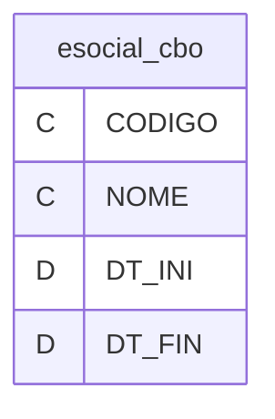

---
## Tabela DBF: `esocial_tab01`
> **Origem:** `esocial_tab01` (Driver: DBFCDX)

| Campo | Tipo | Tam | Dec |
| :--- | :--- | :--- | :--- |
| CODIGO | C | 3 | 0 |
| NOME | C | 255 | 0 |
| DTINICIO | D | 8 | 0 |
| DTFIM | D | 8 | 0 |
| GRUPO | C | 5 | 0 |
| ALIQFGTS | C | 1 | 0 |
| OBRIGA | C | 1 | 0 |
| ALIQFGTSCO | C | 3 | 0 |

**Indices vinculados:**
- Tag: `CODIGO` Expressao: `CODIGO`

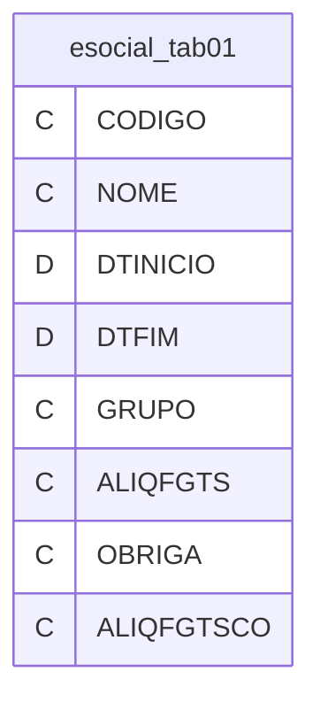

---
## Tabela DBF: `esocial_tab02`
> **Origem:** `esocial_tab02` (Driver: DBFCDX)

| Campo | Tipo | Tam | Dec |
| :--- | :--- | :--- | :--- |
| CODIGO | N | 1 | 0 |
| NOME | C | 74 | 0 |
| DTINICIO | D | 8 | 0 |
| DTFIM | D | 8 | 0 |

**Indices vinculados:**
- Tag: `CODIGO` Expressao: `CODIGO`


---
## Tabela DBF: `esocial_tab03`
> **Origem:** `esocial_tab03` (Driver: DBFCDX)

| Campo | Tipo | Tam | Dec |
| :--- | :--- | :--- | :--- |
| CODIGO | C | 4 | 0 |
| NOME | C | 65 | 0 |
| DTINICIO | D | 8 | 0 |
| DTFIM | D | 8 | 0 |
| DESCRICAO | C | 255 | 0 |

**Indices vinculados:**
- Tag: `CODIGO` Expressao: `CODIGO`

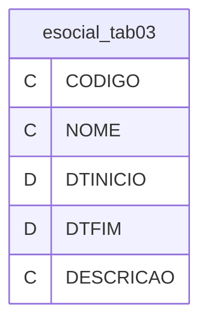

---
## Tabela DBF: `esocial_tab04`
> **Origem:** `esocial_tab04` (Driver: DBFCDX)

| Campo | Tipo | Tam | Dec |
| :--- | :--- | :--- | :--- |
| CODFPAS | N | 3 | 0 |
| INDCOOP | C | 6 | 0 |
| DTINICIO | D | 8 | 0 |
| DTFIM | D | 8 | 0 |
| CLASSTRIB | C | 2 | 0 |
| CODTERC | N | 4 | 0 |
| ALIQTERC | N | 4 | 2 |

**Indices vinculados:**
- Tag: `CODFPAS` Expressao: `CODFPAS`

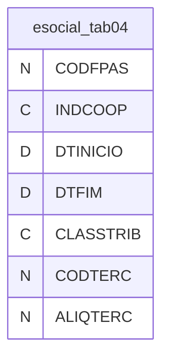

---
## Tabela DBF: `esocial_tab05`
> **Origem:** `esocial_tab05` (Driver: DBFCDX)

| Campo | Tipo | Tam | Dec |
| :--- | :--- | :--- | :--- |
| CODIGO | N | 1 | 0 |
| NOME | C | 56 | 0 |
| DTINICIO | D | 8 | 0 |
| DTFIM | D | 8 | 0 |

**Indices vinculados:**
- Tag: `CODIGO` Expressao: `CODIGO`


---
## Tabela DBF: `esocial_tab07`
> **Origem:** `esocial_tab07` (Driver: DBFCDX)

| Campo | Tipo | Tam | Dec |
| :--- | :--- | :--- | :--- |
| CODIGO | C | 4 | 0 |
| NOME | C | 55 | 0 |
| DTINICIO | D | 8 | 0 |
| DTFIM | D | 8 | 0 |
| MATERIABIO | C | 3 | 0 |
| AGENTEQUIM | N | 2 | 0 |

**Indices vinculados:**
- Tag: `CODIGO` Expressao: `codigo`

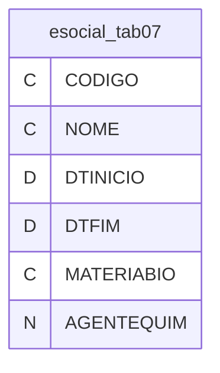

---
## Tabela DBF: `esocial_tab08`
> **Origem:** `esocial_tab08` (Driver: DBFCDX)

| Campo | Tipo | Tam | Dec |
| :--- | :--- | :--- | :--- |
| CODIGO | N | 2 | 0 |
| NOME | C | 149 | 0 |
| DTINICIO | D | 8 | 0 |
| DTFIM | D | 8 | 0 |
| TPINSC | N | 1 | 0 |

**Indices vinculados:**
- Tag: `CODIGO` Expressao: `CODIGO`

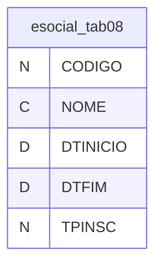

---
## Tabela DBF: `esocial_tab09`
> **Origem:** `esocial_tab09` (Driver: DBFCDX)

| Campo | Tipo | Tam | Dec |
| :--- | :--- | :--- | :--- |
| CODIGO | C | 6 | 0 |
| NOME | C | 84 | 0 |
| DTINICIO | D | 8 | 0 |
| DTFIM | D | 8 | 0 |
| IDTPEVENTO | N | 2 | 0 |
| TAGTPEVENT | C | 17 | 0 |
| IDENTIFIC | C | 23 | 0 |
| INDCHDUPL | N | 1 | 0 |
| INDEXCL | N | 1 | 0 |
| CLASSTRIB | C | 11 | 0 |
| NCLASSTRI | C | 2 | 0 |

**Indices vinculados:**
- Tag: `CODIGO` Expressao: `CODIGO`

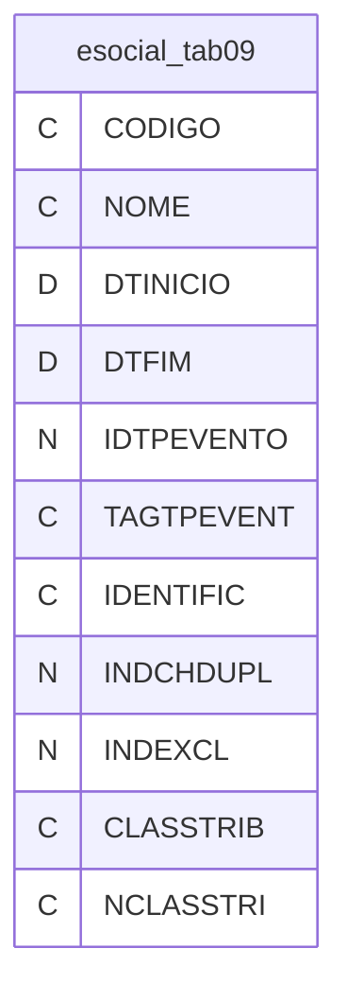

---
## Tabela DBF: `esocial_tab10`
> **Origem:** `esocial_tab10` (Driver: DBFCDX)

| Campo | Tipo | Tam | Dec |
| :--- | :--- | :--- | :--- |
| CODIGO | C | 2 | 0 |
| NOME | C | 255 | 0 |
| DTINICIO | D | 8 | 0 |
| DTFIM | D | 8 | 0 |
| TPINSCR | C | 13 | 0 |
| NRINSCR | C | 98 | 0 |
| CDVALID | C | 1 | 0 |
| TXCLASSTRB | C | 47 | 0 |

**Indices vinculados:**
- Tag: `CODIGO` Expressao: `CODIGO`

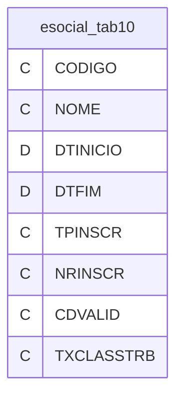

---
## Tabela DBF: `esocial_tab11`
> **Origem:** `esocial_tab11` (Driver: DBFCDX)

| Campo | Tipo | Tam | Dec |
| :--- | :--- | :--- | :--- |
| CODIGO | N | 3 | 0 |
| CLASSTRIB | C | 11 | 0 |
| DTINICIO | D | 8 | 0 |
| DTFIM | D | 8 | 0 |
| NCLASSTRI | C | 8 | 0 |
| COOPERATIV | C | 1 | 0 |
| TPLOTACAO | C | 20 | 0 |

**Indices vinculados:**
- Tag: `CODIGO` Expressao: `CODIGO`

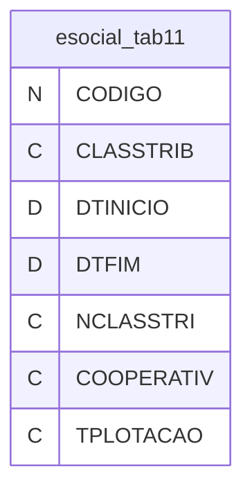

---
## Tabela DBF: `esocial_tab13`
> **Origem:** `esocial_tab13` (Driver: DBFCDX)

| Campo | Tipo | Tam | Dec |
| :--- | :--- | :--- | :--- |
| CODIGO | C | 9 | 0 |
| NOME | C | 161 | 0 |
| DTINICIO | D | 8 | 0 |
| DTFIM | C | 8 | 0 |

**Indices vinculados:**
- Tag: `CODIGO` Expressao: `codigo`

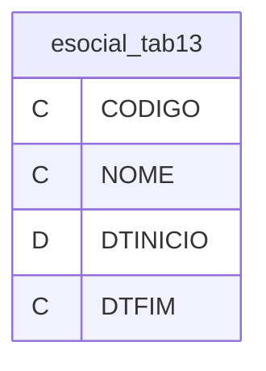

---
## Tabela DBF: `esocial_tab14`
> **Origem:** `esocial_tab14` (Driver: DBFCDX)

| Campo | Tipo | Tam | Dec |
| :--- | :--- | :--- | :--- |
| CODIGO | N | 9 | 0 |
| NOME | C | 185 | 0 |
| DTINICIO | D | 8 | 0 |
| DTFIM | D | 8 | 0 |

**Indices vinculados:**
- Tag: `CODIGO` Expressao: `codigo`

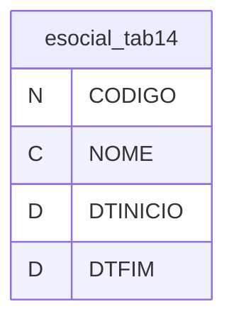

---
## Tabela DBF: `esocial_tab15`
> **Origem:** `esocial_tab15` (Driver: DBFCDX)

| Campo | Tipo | Tam | Dec |
| :--- | :--- | :--- | :--- |
| CODIGO | C | 9 | 0 |
| NOME | C | 135 | 0 |
| DTINICIO | D | 8 | 0 |
| DTFIM | D | 8 | 0 |

**Indices vinculados:**
- Tag: `CODIGO` Expressao: `CODIGO`


---
## Tabela DBF: `esocial_tab16`
> **Origem:** `esocial_tab16` (Driver: DBFCDX)

| Campo | Tipo | Tam | Dec |
| :--- | :--- | :--- | :--- |
| CODIGO | C | 9 | 0 |
| NOME | C | 63 | 0 |
| DTINICIO | D | 8 | 0 |
| DTFIM | C | 8 | 0 |

**Indices vinculados:**
- Tag: `CODIGO` Expressao: `codigo`


---
## Tabela DBF: `esocial_tab17`
> **Origem:** `esocial_tab17` (Driver: DBFCDX)

| Campo | Tipo | Tam | Dec |
| :--- | :--- | :--- | :--- |
| CODIGO | C | 9 | 0 |
| NOME | C | 135 | 0 |
| DTINICIO | D | 8 | 0 |
| DTFIM | D | 8 | 0 |

**Indices vinculados:**
- Tag: `CODIGO` Expressao: `codigo`

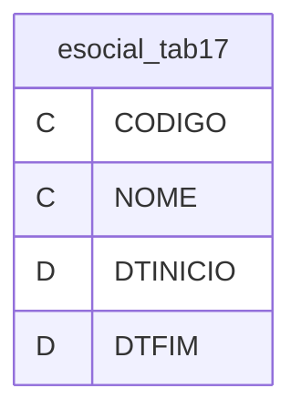

---
## Tabela DBF: `esocial_tab18`
> **Origem:** `esocial_tab18` (Driver: DBFCDX)

| Campo | Tipo | Tam | Dec |
| :--- | :--- | :--- | :--- |
| CODIGO | C | 2 | 0 |
| NOME | C | 255 | 0 |
| DTINICIO | D | 8 | 0 |
| DTFIM | D | 8 | 0 |
| PERALTMOT | C | 5 | 0 |
| DOMESTICO | C | 1 | 0 |
| DESCRESUM | C | 50 | 0 |
| SUSSALMEN | C | 1 | 0 |
| PAGSALFAM | C | 1 | 0 |
| GERAREMUN | C | 1 | 0 |

**Indices vinculados:**
- Tag: `CODIGO` Expressao: `CODIGO`

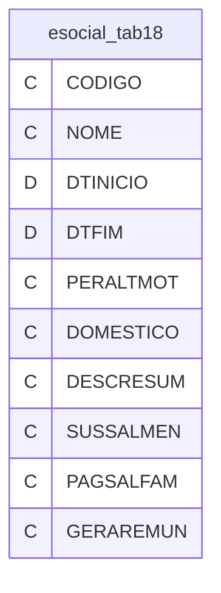

---
## Tabela DBF: `esocial_tab19`
> **Origem:** `esocial_tab19` (Driver: DBFCDX)

| Campo | Tipo | Tam | Dec |
| :--- | :--- | :--- | :--- |
| CODIGO | N | 2 | 0 |
| NOME | C | 236 | 0 |
| DTINICIO | D | 8 | 0 |
| DTFIM | D | 8 | 0 |
| GERADAE | N | 1 | 0 |
| LCATEGTRAB | C | 23 | 0 |
| GERAINDCOM | N | 1 | 0 |

**Indices vinculados:**
- Tag: `CODIGO` Expressao: `CODIGO`

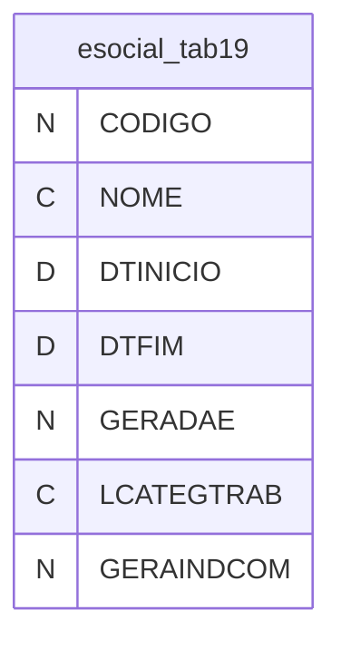

---
## Tabela DBF: `esocial_tab20`
> **Origem:** `esocial_tab20` (Driver: DBFCDX)

| Campo | Tipo | Tam | Dec |
| :--- | :--- | :--- | :--- |
| CODIGO | C | 3 | 0 |
| NOME | C | 11 | 0 |
| DTINICIO | D | 8 | 0 |
| DTFIM | D | 8 | 0 |

**Indices vinculados:**
- Tag: `CODIGO` Expressao: `CODIGO`


---
## Tabela DBF: `esocial_tab21`
> **Origem:** `esocial_tab21` (Driver: DBFCDX)

| Campo | Tipo | Tam | Dec |
| :--- | :--- | :--- | :--- |
| CODIGO | C | 9 | 0 |
| NOME | C | 135 | 0 |
| DTINICIO | D | 8 | 0 |
| DTFIM | D | 8 | 0 |
| CODIGOPAI | C | 9 | 0 |
| TIPO | C | 1 | 0 |

**Indices vinculados:**
- Tag: `CODIGO` Expressao: `codigo`

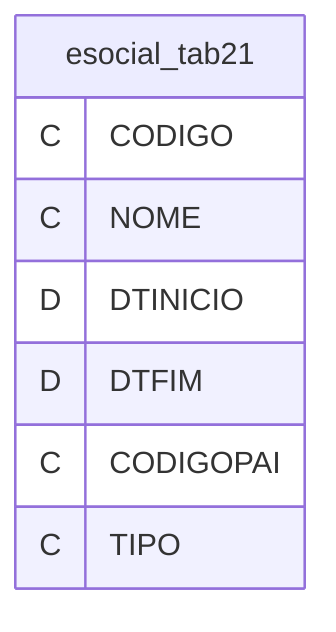

---
## Tabela DBF: `esocial_tab22`
> **Origem:** `esocial_tab22` (Driver: DBFCDX)

| Campo | Tipo | Tam | Dec |
| :--- | :--- | :--- | :--- |
| CODIGO | C | 9 | 0 |
| NOME | C | 206 | 0 |
| DTINICIO | D | 8 | 0 |
| DTFIM | D | 8 | 0 |
| GRAU | C | 6 | 0 |
| OPERATIV | C | 255 | 0 |

**Indices vinculados:**
- Tag: `CODIGO` Expressao: `CODIGO`

```mermaid
erDiagram
    esocial_tab22 {
        C CODIGO
        C NOME
        D DTINICIO
        D DTFIM
        C GRAU
        C OPERATIV
    }
```

---
## Tabela DBF: `esocial_tab23`
> **Origem:** `esocial_tab23` (Driver: DBFCDX)

| Campo | Tipo | Tam | Dec |
| :--- | :--- | :--- | :--- |
| CODIGO | C | 8 | 0 |
| NOME | C | 148 | 0 |
| DTINICIO | D | 8 | 0 |
| DTFIM | D | 8 | 0 |
| TEMPCONTR | N | 2 | 0 |
| ALIQ | N | 2 | 0 |

**Indices vinculados:**
- Tag: `CODIGO` Expressao: `CODIGO`

```mermaid
erDiagram
    esocial_tab23 {
        C CODIGO
        C NOME
        D DTINICIO
        D DTFIM
        N TEMPCONTR
        N ALIQ
    }
```

---
## Tabela DBF: `esocial_tab24`
> **Origem:** `esocial_tab24` (Driver: DBFCDX)

| Campo | Tipo | Tam | Dec |
| :--- | :--- | :--- | :--- |
| CODIGO | N | 3 | 0 |
| LCLASSTRIB | C | 44 | 0 |
| DTINICIO | D | 8 | 0 |
| DTFIM | D | 8 | 0 |

**Indices vinculados:**
- Tag: `CODIGO` Expressao: `CODIGO`

```mermaid
erDiagram
    esocial_tab24 {
        N CODIGO
        C LCLASSTRIB
        D DTINICIO
        D DTFIM
    }
```

---
## Tabela DBF: `esocial_tab26`
> **Origem:** `esocial_tab26` (Driver: DBFCDX)

| Campo | Tipo | Tam | Dec |
| :--- | :--- | :--- | :--- |
| CODIGO | C | 6 | 0 |
| NOME | C | 255 | 0 |
| DTINICIO | D | 8 | 0 |
| DTFIM | D | 8 | 0 |

**Indices vinculados:**
- Tag: `CODIGO` Expressao: `CODIGO`

```mermaid
erDiagram
    esocial_tab26 {
        C CODIGO
        C NOME
        D DTINICIO
        D DTFIM
    }
```

---
## Tabela DBF: `esocial_tab51`
> **Origem:** `esocial_tab51` (Driver: DBFCDX)

| Campo | Tipo | Tam | Dec |
| :--- | :--- | :--- | :--- |
| CODIGO | N | 4 | 0 |
| NOME | C | 16 | 0 |
| DTINICIO | D | 8 | 0 |
| DTFIM | D | 8 | 0 |
| OBRIGA | C | 1 | 0 |

**Indices vinculados:**
- Tag: `CODIGO` Expressao: `CODIGO`

```mermaid
erDiagram
    esocial_tab51 {
        N CODIGO
        C NOME
        D DTINICIO
        D DTFIM
        C OBRIGA
    }
```

---
## Tabela DBF: `esocial_tab52`
> **Origem:** `esocial_tab52` (Driver: DBFCDX)

| Campo | Tipo | Tam | Dec |
| :--- | :--- | :--- | :--- |
| CODIGO | C | 10 | 0 |
| NOME | C | 56 | 0 |
| DTINICIO | D | 8 | 0 |
| DTFIM | D | 8 | 0 |
| HRENTR | N | 3 | 0 |
| HRSAIDA | N | 4 | 0 |
| DURJORNADA | N | 3 | 0 |
| TPINTERV | N | 1 | 0 |
| DURINTERV | N | 3 | 0 |
| INIINTERV | C | 1 | 0 |
| TERMINTERV | C | 1 | 0 |
| PERHORFLEX | C | 1 | 0 |
| QTDHRSSEM | C | 2 | 0 |

**Indices vinculados:**
- Tag: `CODIGO` Expressao: `CODIGO`

```mermaid
erDiagram
    esocial_tab52 {
        C CODIGO
        C NOME
        D DTINICIO
        D DTFIM
        N HRENTR
        N HRSAIDA
        N DURJORNADA
        N TPINTERV
        N DURINTERV
        C INIINTERV
        C TERMINTERV
        C PERHORFLEX
        C QTDHRSSEM
    }
```

---
## Tabela DBF: `esocial_tab53`
> **Origem:** `esocial_tab53` (Driver: DBFCDX)

| Campo | Tipo | Tam | Dec |
| :--- | :--- | :--- | :--- |
| CODIGO | N | 4 | 0 |
| NOME | C | 73 | 0 |
| DTINICIO | D | 8 | 0 |
| DTFIM | D | 8 | 0 |
| ESOCFILIAL | C | 1 | 0 |

**Indices vinculados:**
- Tag: `CODIGO` Expressao: `CODIGO`

```mermaid
erDiagram
    esocial_tab53 {
        N CODIGO
        C NOME
        D DTINICIO
        D DTFIM
        C ESOCFILIAL
    }
```

---
## Tabela DBF: `esocial_tab54`
> **Origem:** `esocial_tab54` (Driver: DBFCDX)

| Campo | Tipo | Tam | Dec |
| :--- | :--- | :--- | :--- |
| CODIGO | C | 11 | 0 |
| NOME | C | 84 | 0 |
| DTINICIO | D | 8 | 0 |
| DTFIM | D | 8 | 0 |
| NATRUBR | C | 4 | 0 |
| TPRUBR | C | 1 | 0 |
| CODINCCP | C | 2 | 0 |
| CODINCIRRF | C | 2 | 0 |
| CODINCFGTS | C | 2 | 0 |
| CODINCSIND | C | 1 | 0 |
| REPDSR | C | 1 | 0 |
| REP13 | C | 1 | 0 |
| REPFERIAS | C | 1 | 0 |
| REPRESC | C | 1 | 0 |
| REPAFAST | C | 1 | 0 |
| FATORRUBR | C | 1 | 0 |
| LOCALAPLIC | C | 24 | 0 |
| DOMESTICA | C | 1 | 0 |
| SE | C | 1 | 0 |
| GERAL | C | 1 | 0 |
| DESCRICAO | C | 255 | 0 |
| NOTA | C | 255 | 0 |
| ORDRESCDOM | C | 2 | 0 |
| PERADICRUB | C | 1 | 0 |
| ORDREMDOM | C | 2 | 0 |
| REPSFDOM | C | 1 | 0 |
| PERFOLRES | C | 1 | 0 |
| PEREDITRUB | C | 1 | 0 |
| PEREXCRUB | C | 1 | 0 |
| FILCATRUB | C | 3 | 0 |
| GRUPRENDDO | C | 5 | 0 |

**Indices vinculados:**
- Tag: `CODIGO` Expressao: `codigo`

```mermaid
erDiagram
    esocial_tab54 {
        C CODIGO
        C NOME
        D DTINICIO
        D DTFIM
        C NATRUBR
        C TPRUBR
        C CODINCCP
        C CODINCIRRF
        C CODINCFGTS
        C CODINCSIND
        C REPDSR
        C REP13
        C REPFERIAS
        C REPRESC
        C REPAFAST
        C FATORRUBR
        C LOCALAPLIC
        C DOMESTICA
        C SE
        C GERAL
        C DESCRICAO
        C NOTA
        C ORDRESCDOM
        C PERADICRUB
        C ORDREMDOM
        C REPSFDOM
        C PERFOLRES
        C PEREDITRUB
        C PEREXCRUB
        C FILCATRUB
        C GRUPRENDDO
    }
```

---
## Tabela DBF: `esocial_tab55`
> **Origem:** `esocial_tab55` (Driver: DBFCDX)

| Campo | Tipo | Tam | Dec |
| :--- | :--- | :--- | :--- |
| CODIGO | N | 3 | 0 |
| NOME | C | 50 | 0 |
| DTINICIO | D | 8 | 0 |
| DTFIM | D | 8 | 0 |
| CLASSTRIB | C | 2 | 0 |
| NCLASSTRIB | N | 2 | 0 |

**Indices vinculados:**
- Tag: `CODIGO` Expressao: `CODIGO`

```mermaid
erDiagram
    esocial_tab55 {
        N CODIGO
        C NOME
        D DTINICIO
        D DTFIM
        C CLASSTRIB
        N NCLASSTRIB
    }
```

---
## Tabela DBF: `esocial_tab57`
> **Origem:** `esocial_tab57` (Driver: DBFCDX)

| Campo | Tipo | Tam | Dec |
| :--- | :--- | :--- | :--- |
| INFSALCONT | N | 7 | 2 |
| SUPSALCONT | N | 7 | 2 |
| DTINICIO | D | 8 | 0 |
| DTFIM | D | 8 | 0 |
| ALIQ | N | 2 | 0 |
| FAIXA | N | 1 | 0 |

**Indices vinculados:**
- Tag: `FAIXA` Expressao: `FAIXA`

```mermaid
erDiagram
    esocial_tab57 {
        N INFSALCONT
        N SUPSALCONT
        D DTINICIO
        D DTFIM
        N ALIQ
        N FAIXA
    }
```

---
## Tabela DBF: `esocial_tab58`
> **Origem:** `esocial_tab58` (Driver: DBFCDX)

| Campo | Tipo | Tam | Dec |
| :--- | :--- | :--- | :--- |
| INFBC | N | 7 | 2 |
| SUPBC | N | 13 | 2 |
| DTINICIO | D | 8 | 0 |
| DTFIM | D | 8 | 0 |
| ALIQ | N | 4 | 1 |
| PARCDED | N | 6 | 2 |
| FAIXA | N | 1 | 0 |

**Indices vinculados:**
- Tag: `FAIXA` Expressao: `FAIXA`

```mermaid
erDiagram
    esocial_tab58 {
        N INFBC
        N SUPBC
        D DTINICIO
        D DTFIM
        N ALIQ
        N PARCDED
        N FAIXA
    }
```

---
## Tabela DBF: `esocial_tab59`
> **Origem:** `esocial_tab59` (Driver: DBFCDX)

| Campo | Tipo | Tam | Dec |
| :--- | :--- | :--- | :--- |
| CODIGO | N | 2 | 0 |
| NOME | C | 74 | 0 |
| DTINICIO | D | 8 | 0 |
| DTFIM | D | 8 | 0 |
| TPSUSP | N | 1 | 0 |

**Indices vinculados:**
- Tag: `CODIGO` Expressao: `CODIGO`

```mermaid
erDiagram
    esocial_tab59 {
        N CODIGO
        C NOME
        D DTINICIO
        D DTFIM
        N TPSUSP
    }
```

---
## Tabela DBF: `esocial_tab60`
> **Origem:** `esocial_tab60` (Driver: DBFCDX)

| Campo | Tipo | Tam | Dec |
| :--- | :--- | :--- | :--- |
| CODIGO | C | 4 | 0 |
| DESCRICAO | C | 255 | 0 |
| DTINICIO | D | 8 | 0 |
| DTFIM | D | 8 | 0 |
| NOME | C | 50 | 0 |

**Indices vinculados:**
- Tag: `CODIGO` Expressao: `codigo`

```mermaid
erDiagram
    esocial_tab60 {
        C CODIGO
        C DESCRICAO
        D DTINICIO
        D DTFIM
        C NOME
    }
```

---
## Tabela DBF: `esocial_tab61`
> **Origem:** `esocial_tab61` (Driver: DBFCDX)

| Campo | Tipo | Tam | Dec |
| :--- | :--- | :--- | :--- |
| CODIGO | C | 11 | 0 |
| NOME | C | 98 | 0 |
| DTINICIO | D | 8 | 0 |
| DTFIM | D | 8 | 0 |
| CODGRUPO | N | 3 | 0 |
| CODCBO | N | 6 | 0 |
| TPTRAB | N | 1 | 0 |

**Indices vinculados:**
- Tag: `CODIGO` Expressao: `CODIGO`

```mermaid
erDiagram
    esocial_tab61 {
        C CODIGO
        C NOME
        D DTINICIO
        D DTFIM
        N CODGRUPO
        N CODCBO
        N TPTRAB
    }
```

---
## Tabela DBF: `esocial_tab62`
> **Origem:** `esocial_tab62` (Driver: DBFCDX)

| Campo | Tipo | Tam | Dec |
| :--- | :--- | :--- | :--- |
| CODIGO | N | 3 | 0 |
| NOME | C | 112 | 0 |
| DTINICIO | D | 8 | 0 |
| DTFIM | C | 1 | 0 |

**Indices vinculados:**
- Tag: `CODIGO` Expressao: `CODIGO`

```mermaid
erDiagram
    esocial_tab62 {
        N CODIGO
        C NOME
        D DTINICIO
        C DTFIM
    }
```

---
## Tabela DBF: `esocial_tab63`
> **Origem:** `esocial_tab63` (Driver: DBFCDX)

| Campo | Tipo | Tam | Dec |
| :--- | :--- | :--- | :--- |
| CODIGO | N | 1 | 0 |
| NOME | C | 56 | 0 |
| DTINICIO | D | 8 | 0 |
| DTFIM | D | 8 | 0 |
| EVENTO | C | 6 | 0 |
| RUBRICAS | C | 215 | 0 |
| CATEGORIA | N | 3 | 0 |

**Indices vinculados:**
- Tag: `CODIGO` Expressao: `CODIGO`

```mermaid
erDiagram
    esocial_tab63 {
        N CODIGO
        C NOME
        D DTINICIO
        D DTFIM
        C EVENTO
        C RUBRICAS
        N CATEGORIA
    }
```

---
## Tabela DBF: `esocial_tab64`
> **Origem:** `esocial_tab64` (Driver: DBFCDX)

| Campo | Tipo | Tam | Dec |
| :--- | :--- | :--- | :--- |
| CODIGO | C | 11 | 0 |
| NOME | C | 62 | 0 |
| DTINICIO | D | 8 | 0 |
| DTFIM | D | 8 | 0 |
| TPLOTACAO | N | 2 | 0 |
| TPINSC | C | 1 | 0 |
| NRINSC | C | 1 | 0 |
| FPAS | N | 3 | 0 |
| CODTERCS | N | 1 | 0 |
| CATEGIGUAL | N | 3 | 0 |
| CATEGDIF | C | 1 | 0 |

**Indices vinculados:**
- Tag: `CODIGO` Expressao: `CODIGO`

```mermaid
erDiagram
    esocial_tab64 {
        C CODIGO
        C NOME
        D DTINICIO
        D DTFIM
        N TPLOTACAO
        C TPINSC
        C NRINSC
        N FPAS
        N CODTERCS
        N CATEGIGUAL
        C CATEGDIF
    }
```

---
## Tabela DBF: `esocial_tab65`
> **Origem:** `esocial_tab65` (Driver: DBFCDX)

| Campo | Tipo | Tam | Dec |
| :--- | :--- | :--- | :--- |
| INFBC | N | 6 | 2 |
| SUPBC | N | 7 | 2 |
| DTINICIO | N | 7 | 0 |
| DTFIM | N | 8 | 0 |
| PARCDED | N | 5 | 2 |
| FAIXA | N | 1 | 0 |

**Indices vinculados:**
- Tag: `FAIXA` Expressao: `FAIXA`

```mermaid
erDiagram
    esocial_tab65 {
        N INFBC
        N SUPBC
        N DTINICIO
        N DTFIM
        N PARCDED
        N FAIXA
    }
```

---
## Tabela DBF: `esocial_tab66`
> **Origem:** `esocial_tab66` (Driver: DBFCDX)

| Campo | Tipo | Tam | Dec |
| :--- | :--- | :--- | :--- |
| CODIGO | N | 1 | 0 |
| DESCRICAO | C | 27 | 0 |
| DTINICIO | N | 7 | 0 |
| DTFIM | C | 8 | 0 |
| CATEGORIA | N | 3 | 0 |
| NCATEGORIA | C | 1 | 0 |
| VALOR | N | 6 | 2 |

**Indices vinculados:**
- Tag: `CODIGO` Expressao: `CODIGO`

```mermaid
erDiagram
    esocial_tab66 {
        N CODIGO
        C DESCRICAO
        N DTINICIO
        C DTFIM
        N CATEGORIA
        C NCATEGORIA
        N VALOR
    }
```

---
## Tabela DBF: `esocial_tab67`
> **Origem:** `esocial_tab67` (Driver: DBFCDX)

| Campo | Tipo | Tam | Dec |
| :--- | :--- | :--- | :--- |
| CODIGO | C | 3 | 0 |
| DESCRICAO | C | 113 | 0 |
| DTINICIO | N | 7 | 0 |
| DTFIM | C | 1 | 0 |
| CODESOCIAL | N | 2 | 0 |

**Indices vinculados:**
- Tag: `CODIGO` Expressao: `CODIGO`

```mermaid
erDiagram
    esocial_tab67 {
        C CODIGO
        C DESCRICAO
        N DTINICIO
        C DTFIM
        N CODESOCIAL
    }
```

---
## Tabela DBF: `esocial_tab68`
> **Origem:** `esocial_tab68` (Driver: DBFCDX)

| Campo | Tipo | Tam | Dec |
| :--- | :--- | :--- | :--- |
| CODIGO | N | 3 | 0 |
| NOME | C | 82 | 0 |
| DTINICIO | N | 7 | 0 |
| DTFIM | C | 8 | 0 |
| CODIGORUBR | C | 35 | 0 |
| CAMPOFIXO | C | 1 | 0 |
| RESTRICAON | C | 35 | 0 |

**Indices vinculados:**
- Tag: `CODIGO` Expressao: `CODIGO`

```mermaid
erDiagram
    esocial_tab68 {
        N CODIGO
        C NOME
        N DTINICIO
        C DTFIM
        C CODIGORUBR
        C CAMPOFIXO
        C RESTRICAON
    }
```

---
## Tabela DBF: `esocial_tab69`
> **Origem:** `esocial_tab69` (Driver: DBFCDX)

| Campo | Tipo | Tam | Dec |
| :--- | :--- | :--- | :--- |
| CODIGO | C | 11 | 0 |
| DESCRICAO | C | 39 | 0 |
| DTINICIO | N | 7 | 0 |
| DTFIM | C | 1 | 0 |

**Indices vinculados:**
- Tag: `CODIGO` Expressao: `CODIGO`

```mermaid
erDiagram
    esocial_tab69 {
        C CODIGO
        C DESCRICAO
        N DTINICIO
        C DTFIM
    }
```

---
## Tabela DBF: `esocial_tab70`
> **Origem:** `esocial_tab70` (Driver: DBFCDX)

| Campo | Tipo | Tam | Dec |
| :--- | :--- | :--- | :--- |
| CODIGO | N | 1 | 0 |
| DESCRICAO | C | 66 | 0 |
| DTINICIO | N | 7 | 0 |
| DTFIM | C | 1 | 0 |

**Indices vinculados:**
- Tag: `CODIGO` Expressao: `CODIGO`

```mermaid
erDiagram
    esocial_tab70 {
        N CODIGO
        C DESCRICAO
        N DTINICIO
        C DTFIM
    }
```

---
## Tabela DBF: `esocial_tab71`
> **Origem:** `esocial_tab71` (Driver: DBFCDX)

| Campo | Tipo | Tam | Dec |
| :--- | :--- | :--- | :--- |
| CODIGO | N | 1 | 0 |
| DESCRICAO | C | 20 | 0 |
| DTINICIO | N | 7 | 0 |
| DTFIM | C | 1 | 0 |

**Indices vinculados:**
- Tag: `CODIGO` Expressao: `CODIGO`

```mermaid
erDiagram
    esocial_tab71 {
        N CODIGO
        C DESCRICAO
        N DTINICIO
        C DTFIM
    }
```

---
## Tabela DBF: `esocial_tab72`
> **Origem:** `esocial_tab72` (Driver: DBFCDX)

| Campo | Tipo | Tam | Dec |
| :--- | :--- | :--- | :--- |
| CODIGO | N | 1 | 0 |
| DESCRICAO | C | 59 | 0 |
| DTINICIO | N | 7 | 0 |
| DTFIM | C | 1 | 0 |

**Indices vinculados:**
- Tag: `CODIGO` Expressao: `CODIGO`

```mermaid
erDiagram
    esocial_tab72 {
        N CODIGO
        C DESCRICAO
        N DTINICIO
        C DTFIM
    }
```

---
## Tabela DBF: `esocial_tab73`
> **Origem:** `esocial_tab73` (Driver: DBFCDX)

| Campo | Tipo | Tam | Dec |
| :--- | :--- | :--- | :--- |
| CODIGO | N | 1 | 0 |
| DESCRICAO | C | 202 | 0 |
| DTINICIO | N | 7 | 0 |
| DTFIM | C | 1 | 0 |

**Indices vinculados:**
- Tag: `CODIGO` Expressao: `CODIGO`

```mermaid
erDiagram
    esocial_tab73 {
        N CODIGO
        C DESCRICAO
        N DTINICIO
        C DTFIM
    }
```

---
## Tabela DBF: `esocial_tab74`
> **Origem:** `esocial_tab74` (Driver: DBFCDX)

| Campo | Tipo | Tam | Dec |
| :--- | :--- | :--- | :--- |
| CODIGO | N | 1 | 0 |
| DESCRICAO | C | 44 | 0 |
| DTINICIO | N | 7 | 0 |
| DTFIM | C | 1 | 0 |

**Indices vinculados:**
- Tag: `CODIGO` Expressao: `CODIGO`

```mermaid
erDiagram
    esocial_tab74 {
        N CODIGO
        C DESCRICAO
        N DTINICIO
        C DTFIM
    }
```

---
## Tabela DBF: `esocial_tab75`
> **Origem:** `esocial_tab75` (Driver: DBFCDX)

| Campo | Tipo | Tam | Dec |
| :--- | :--- | :--- | :--- |
| CODIGO | N | 1 | 0 |
| DESCRICAO | C | 33 | 0 |
| DTINICIO | N | 7 | 0 |
| DTFIM | C | 1 | 0 |

**Indices vinculados:**
- Tag: `CODIGO` Expressao: `CODIGO`

```mermaid
erDiagram
    esocial_tab75 {
        N CODIGO
        C DESCRICAO
        N DTINICIO
        C DTFIM
    }
```

---
