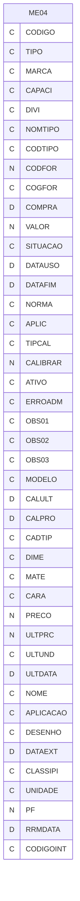
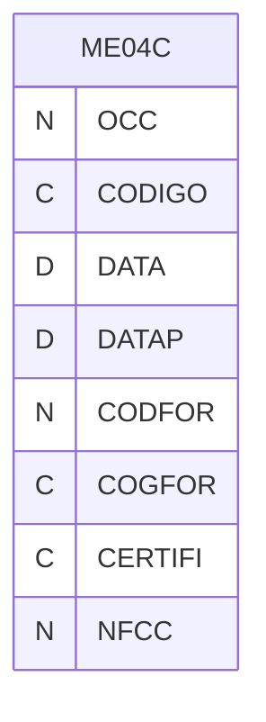
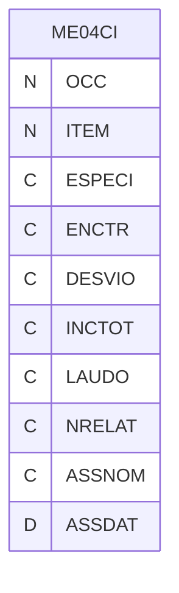
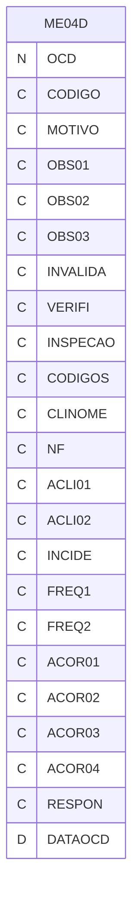
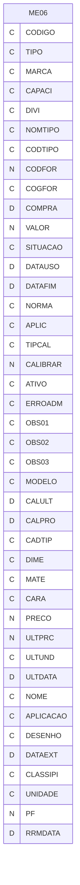
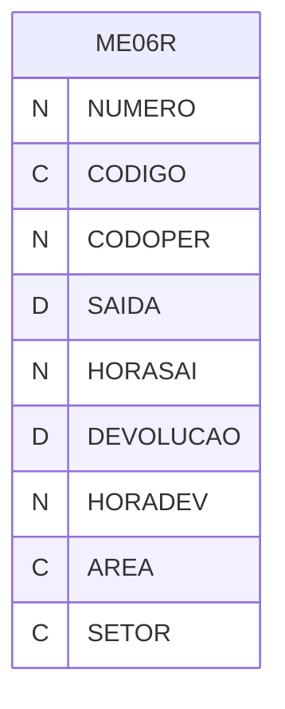
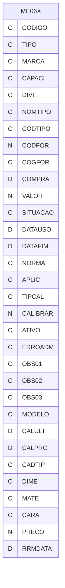
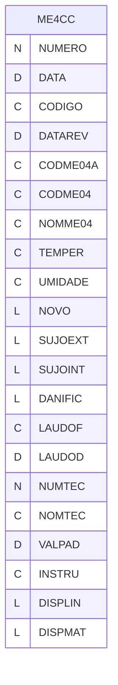
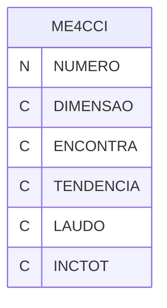

# Dicionario de Estruturas de Dados do Projeto
> Varredura automatica realizada em: 09/09/2026

## Tabela DBF: `ME04`
> **Origem:** `ME04` (Driver: DBFCDX)

| Campo | Tipo | Tam | Dec |
| :--- | :--- | :--- | :--- |
| CODIGO | C | 8 | 0 |
| TIPO | C | 30 | 0 |
| MARCA | C | 20 | 0 |
| CAPACI | C | 30 | 0 |
| DIVI | C | 10 | 0 |
| NOMTIPO | C | 30 | 0 |
| CODTIPO | C | 3 | 0 |
| CODFOR | N | 8 | 0 |
| COGFOR | C | 12 | 0 |
| COMPRA | D | 8 | 0 |
| VALOR | N | 9 | 2 |
| SITUACAO | C | 1 | 0 |
| DATAUSO | D | 8 | 0 |
| DATAFIM | D | 8 | 0 |
| NORMA | C | 30 | 0 |
| APLIC | C | 30 | 0 |
| TIPCAL | C | 1 | 0 |
| CALIBRAR | N | 3 | 0 |
| ATIVO | C | 1 | 0 |
| ERROADM | C | 15 | 0 |
| OBS01 | C | 70 | 0 |
| OBS02 | C | 70 | 0 |
| OBS03 | C | 70 | 0 |
| MODELO | C | 20 | 0 |
| CALULT | D | 8 | 0 |
| CALPRO | D | 8 | 0 |
| CADTIP | C | 1 | 0 |
| DIME | C | 1 | 0 |
| MATE | C | 1 | 0 |
| CARA | C | 1 | 0 |
| PRECO | N | 9 | 2 |
| ULTPRC | N | 9 | 2 |
| ULTUND | C | 2 | 0 |
| ULTDATA | D | 8 | 0 |
| NOME | C | 1 | 0 |
| APLICACAO | C | 24 | 0 |
| DESENHO | C | 25 | 0 |
| DATAEXT | D | 8 | 0 |
| CLASSIPI | C | 10 | 0 |
| UNIDADE | C | 2 | 0 |
| PF | N | 8 | 0 |
| RRMDATA | D | 8 | 0 |
| CODIGOINT | C | 15 | 0 |

**Indices vinculados:**
- Tag: `ME04-1` Expressao: `CODIGO`
- Tag: `ME04-2` Expressao: `CODTIPO+CODIGO`
- Tag: `ME04-3` Expressao: `CALPRO`

---
## Tabela DBF: `ME04C`
> **Origem:** `ME04C` (Driver: DBFCDX)

| Campo | Tipo | Tam | Dec |
| :--- | :--- | :--- | :--- |
| OCC | N | 8 | 0 |
| CODIGO | C | 10 | 0 |
| DATA | D | 8 | 0 |
| DATAP | D | 8 | 0 |
| CODFOR | N | 8 | 0 |
| COGFOR | C | 20 | 0 |
| CERTIFI | C | 10 | 0 |
| NFCC | N | 8 | 0 |

**Indices vinculados:**
- Tag: `ME04C-1` Expressao: `OCC`
- Tag: `ME04C-2` Expressao: `CODIGO`
- Tag: `ME04C-3` Expressao: `CERTIFI`

---
## Tabela DBF: `ME04CI`
> **Origem:** `ME04CI` (Driver: DBFCDX)

| Campo | Tipo | Tam | Dec |
| :--- | :--- | :--- | :--- |
| OCC | N | 8 | 0 |
| ITEM | N | 3 | 0 |
| ESPECI | C | 30 | 0 |
| ENCTR | C | 30 | 0 |
| DESVIO | C | 10 | 0 |
| INCTOT | C | 10 | 0 |
| LAUDO | C | 1 | 0 |
| NRELAT | C | 5 | 0 |
| ASSNOM | C | 10 | 0 |
| ASSDAT | D | 8 | 0 |

**Indices vinculados:**
- Tag: `ME04CI-1` Expressao: `STR(OCC,8)+STR(ITEM,3)`
- Tag: `ME04CI-2` Expressao: `OCC`

---
## Tabela DBF: `ME04D`
> **Origem:** `ME04D` (Driver: DBFCDX)

| Campo | Tipo | Tam | Dec |
| :--- | :--- | :--- | :--- |
| OCD | N | 8 | 0 |
| CODIGO | C | 24 | 0 |
| MOTIVO | C | 1 | 0 |
| OBS01 | C | 50 | 0 |
| OBS02 | C | 50 | 0 |
| OBS03 | C | 50 | 0 |
| INVALIDA | C | 1 | 0 |
| VERIFI | C | 20 | 0 |
| INSPECAO | C | 1 | 0 |
| CODIGOS | C | 40 | 0 |
| CLINOME | C | 40 | 0 |
| NF | C | 30 | 0 |
| ACLI01 | C | 50 | 0 |
| ACLI02 | C | 50 | 0 |
| INCIDE | C | 1 | 0 |
| FREQ1 | C | 20 | 0 |
| FREQ2 | C | 20 | 0 |
| ACOR01 | C | 75 | 0 |
| ACOR02 | C | 75 | 0 |
| ACOR03 | C | 75 | 0 |
| ACOR04 | C | 75 | 0 |
| RESPON | C | 30 | 0 |
| DATAOCD | D | 8 | 0 |

**Indices vinculados:**
- Tag: `ME04D-1` Expressao: `OCD`
- Tag: `ME04D-2` Expressao: `CODIGO`

---
## Tabela DBF: `ME04R`
> **Origem:** `ME04R` (Driver: DBFCDX)

| Campo | Tipo | Tam | Dec |
| :--- | :--- | :--- | :--- |
| NUMERO | N | 8 | 0 |
| CODIGO | C | 8 | 0 |
| CODOPER | N | 8 | 0 |
| SAIDA | D | 8 | 0 |
| HORASAI | N | 6 | 2 |
| DEVOLUCAO | D | 8 | 0 |
| HORADEV | N | 6 | 2 |
| AREA | C | 2 | 0 |
| SETOR | C | 3 | 0 |

**Indices vinculados:**
- Tag: `ME04R-1` Expressao: `NUMERO`
- Tag: `ME04R-2` Expressao: `CODOPER`
- Tag: `ME04R-3` Expressao: `CODIGO`

---
## Tabela DBF: `ME06`
> **Origem:** `ME06` (Driver: DBFCDX)

| Campo | Tipo | Tam | Dec |
| :--- | :--- | :--- | :--- |
| CODIGO | C | 8 | 0 |
| TIPO | C | 30 | 0 |
| MARCA | C | 20 | 0 |
| CAPACI | C | 30 | 0 |
| DIVI | C | 10 | 0 |
| NOMTIPO | C | 30 | 0 |
| CODTIPO | C | 3 | 0 |
| CODFOR | N | 8 | 0 |
| COGFOR | C | 12 | 0 |
| COMPRA | D | 8 | 0 |
| VALOR | N | 9 | 2 |
| SITUACAO | C | 1 | 0 |
| DATAUSO | D | 8 | 0 |
| DATAFIM | D | 8 | 0 |
| NORMA | C | 30 | 0 |
| APLIC | C | 30 | 0 |
| TIPCAL | C | 1 | 0 |
| CALIBRAR | N | 3 | 0 |
| ATIVO | C | 1 | 0 |
| ERROADM | C | 15 | 0 |
| OBS01 | C | 70 | 0 |
| OBS02 | C | 70 | 0 |
| OBS03 | C | 70 | 0 |
| MODELO | C | 20 | 0 |
| CALULT | D | 8 | 0 |
| CALPRO | D | 8 | 0 |
| CADTIP | C | 1 | 0 |
| DIME | C | 1 | 0 |
| MATE | C | 1 | 0 |
| CARA | C | 1 | 0 |
| PRECO | N | 9 | 2 |
| ULTPRC | N | 9 | 2 |
| ULTUND | C | 2 | 0 |
| ULTDATA | D | 8 | 0 |
| NOME | C | 1 | 0 |
| APLICACAO | C | 24 | 0 |
| DESENHO | C | 25 | 0 |
| DATAEXT | D | 8 | 0 |
| CLASSIPI | C | 10 | 0 |
| UNIDADE | C | 2 | 0 |
| PF | N | 8 | 0 |
| RRMDATA | D | 8 | 0 |

**Indices vinculados:**
- Tag: `ME06-1` Expressao: `CODIGO`
- Tag: `ME06-2` Expressao: `CODTIPO+CODIGO`
- Tag: `ME06-3` Expressao: `CALPRO`

---
## Tabela DBF: `ME06R`
> **Origem:** `ME06R` (Driver: DBFCDX)

| Campo | Tipo | Tam | Dec |
| :--- | :--- | :--- | :--- |
| NUMERO | N | 8 | 0 |
| CODIGO | C | 8 | 0 |
| CODOPER | N | 8 | 0 |
| SAIDA | D | 8 | 0 |
| HORASAI | N | 6 | 2 |
| DEVOLUCAO | D | 8 | 0 |
| HORADEV | N | 6 | 2 |
| AREA | C | 2 | 0 |
| SETOR | C | 3 | 0 |

**Indices vinculados:**
- Tag: `ME06R-1` Expressao: `NUMERO`
- Tag: `ME06R-2` Expressao: `CODOPER`
- Tag: `ME06R-3` Expressao: `CODIGO`

---
## Tabela DBF: `ME06X`
> **Origem:** `ME06X` (Driver: DBFCDX)

| Campo | Tipo | Tam | Dec |
| :--- | :--- | :--- | :--- |
| CODIGO | C | 8 | 0 |
| TIPO | C | 30 | 0 |
| MARCA | C | 20 | 0 |
| CAPACI | C | 30 | 0 |
| DIVI | C | 10 | 0 |
| NOMTIPO | C | 30 | 0 |
| CODTIPO | C | 3 | 0 |
| CODFOR | N | 8 | 0 |
| COGFOR | C | 12 | 0 |
| COMPRA | D | 8 | 0 |
| VALOR | N | 12 | 2 |
| SITUACAO | C | 1 | 0 |
| DATAUSO | D | 8 | 0 |
| DATAFIM | D | 8 | 0 |
| NORMA | C | 30 | 0 |
| APLIC | C | 30 | 0 |
| TIPCAL | C | 1 | 0 |
| CALIBRAR | N | 3 | 0 |
| ATIVO | C | 8 | 0 |
| ERROADM | C | 15 | 0 |
| OBS01 | C | 70 | 0 |
| OBS02 | C | 70 | 0 |
| OBS03 | C | 70 | 0 |
| MODELO | C | 20 | 0 |
| CALULT | D | 8 | 0 |
| CALPRO | D | 8 | 0 |
| CADTIP | C | 1 | 0 |
| DIME | C | 40 | 0 |
| MATE | C | 30 | 0 |
| CARA | C | 50 | 0 |
| PRECO | N | 12 | 2 |
| RRMDATA | D | 8 | 0 |

**Indices vinculados:**
- Tag: `ME06X-1` Expressao: `CODIGO`
- Tag: `ME06X-2` Expressao: `CODTIPO+CODIGO`
- Tag: `ME06X-3` Expressao: `CALPRO`

---
## Tabela DBF: `ME4CC`
> **Origem:** `ME4CC` (Driver: DBFCDX)

| Campo | Tipo | Tam | Dec |
| :--- | :--- | :--- | :--- |
| NUMERO | N | 8 | 0 |
| DATA | D | 8 | 0 |
| CODIGO | C | 24 | 0 |
| DATAREV | D | 8 | 0 |
| CODME04A | C | 8 | 0 |
| CODME04 | C | 8 | 0 |
| NOMME04 | C | 30 | 0 |
| TEMPER | C | 10 | 0 |
| UMIDADE | C | 5 | 0 |
| NOVO | L | 1 | 0 |
| SUJOEXT | L | 1 | 0 |
| SUJOINT | L | 1 | 0 |
| DANIFIC | L | 1 | 0 |
| LAUDOF | C | 1 | 0 |
| LAUDOD | D | 8 | 0 |
| NUMTEC | N | 8 | 0 |
| NOMTEC | C | 40 | 0 |
| VALPAD | D | 8 | 0 |
| INSTRU | C | 20 | 0 |
| DISPLIN | L | 1 | 0 |
| DISPMAT | L | 1 | 0 |

**Indices vinculados:**
- Tag: `NUMERO` Expressao: `NUMERO`
- Tag: `CODIGO` Expressao: `CODIGO`

---
## Tabela DBF: `ME4CCI`
> **Origem:** `ME4CCI` (Driver: DBFCDX)

| Campo | Tipo | Tam | Dec |
| :--- | :--- | :--- | :--- |
| NUMERO | N | 8 | 0 |
| DIMENSAO | C | 50 | 0 |
| ENCONTRA | C | 30 | 0 |
| TENDENCIA | C | 10 | 0 |
| LAUDO | C | 1 | 0 |
| INCTOT | C | 10 | 0 |

**Indices vinculados:**
- Tag: `NUMERO` Expressao: `NUMERO`

---
## Tabela DBF: `RRM`
> **Origem:** `RRM` (Driver: DBFCDX)

| Campo | Tipo | Tam | Dec |
| :--- | :--- | :--- | :--- |
| RRS | N | 8 | 0 |
| CLIENTE | N | 8 | 0 |
| CLINOME | C | 40 | 0 |
| DESENHO | C | 24 | 0 |
| DESCRI | C | 40 | 0 |
| INSTRU | C | 8 | 0 |
| DESCII | C | 25 | 0 |
| CARAC | C | 40 | 0 |
| ESPEC | C | 40 | 0 |
| AVA | C | 40 | 0 |
| AVB | C | 40 | 0 |
| AVAN | N | 8 | 0 |
| AVBN | N | 8 | 0 |
| AMA01 | N | 10 | 4 |
| AMA02 | N | 10 | 4 |
| AMA03 | N | 10 | 4 |
| AMA04 | N | 10 | 4 |
| AMA05 | N | 10 | 4 |
| AMAA01 | N | 10 | 4 |
| AMAA02 | N | 10 | 4 |
| AMAA03 | N | 10 | 4 |
| AMAA04 | N | 10 | 4 |
| AMAA05 | N | 10 | 4 |
| AMB01 | N | 10 | 4 |
| AMB02 | N | 10 | 4 |
| AMB03 | N | 10 | 4 |
| AMB04 | N | 10 | 4 |
| AMB05 | N | 10 | 4 |
| AMBB01 | N | 10 | 4 |
| AMBB02 | N | 10 | 4 |
| AMBB03 | N | 10 | 4 |
| AMBB04 | N | 10 | 4 |
| AMBB05 | N | 10 | 4 |
| DIFA01 | N | 7 | 4 |
| DIFA02 | N | 7 | 4 |
| DIFA03 | N | 7 | 4 |
| DIFA04 | N | 7 | 4 |
| DIFA05 | N | 7 | 4 |
| DIFB01 | N | 7 | 4 |
| DIFB02 | N | 7 | 4 |
| DIFB03 | N | 7 | 4 |
| DIFB04 | N | 7 | 4 |
| DIFB05 | N | 7 | 4 |
| TOTAA | N | 11 | 4 |
| TOTAB | N | 11 | 4 |
| MEDAA | N | 7 | 4 |
| TOTALA | N | 11 | 4 |
| TOTBA | N | 11 | 4 |
| TOTBB | N | 11 | 4 |
| MEDBB | N | 7 | 4 |
| TOTALB | N | 11 | 4 |
| MEDIA | N | 11 | 4 |
| MEDIB | N | 11 | 4 |
| MEDSOM | N | 11 | 4 |
| MEDMED | N | 7 | 4 |
| DIFMED | N | 7 | 4 |
| VE | N | 7 | 5 |
| VA | N | 7 | 5 |
| RR | N | 7 | 5 |
| VP | N | 10 | 5 |
| VT | N | 10 | 5 |
| PRR | N | 10 | 5 |
| DATA | D | 8 | 0 |
| OBS01 | C | 50 | 0 |
| OBS02 | C | 50 | 0 |
| RP | N | 11 | 5 |
| M01 | N | 11 | 5 |
| M02 | N | 11 | 5 |
| M03 | N | 11 | 5 |
| M04 | N | 11 | 5 |
| M05 | N | 11 | 5 |
| RPMAX | N | 11 | 4 |
| RPMIN | N | 11 | 4 |
| XMAX | N | 11 | 4 |
| XMIN | N | 11 | 4 |
| K01 | N | 6 | 4 |
| K02 | N | 6 | 4 |
| K03 | N | 6 | 4 |
| TOLMIN | N | 9 | 5 |
| TOLMAX | N | 9 | 5 |
| NUMASS | N | 8 | 0 |
| DATASS | D | 8 | 0 |
| NOMASS | C | 40 | 0 |

**Indices vinculados:**
- Tag: `RRS` Expressao: `RRS`

```mermaid
erDiagram
    RRM {
        N RRS
        N CLIENTE
        C CLINOME
        C DESENHO
        C DESCRI
        C INSTRU
        C DESCII
        C CARAC
        C ESPEC
        C AVA
        C AVB
        N AVAN
        N AVBN
        N AMA01
        N AMA02
        N AMA03
        N AMA04
        N AMA05
        N AMAA01
        N AMAA02
        N AMAA03
        N AMAA04
        N AMAA05
        N AMB01
        N AMB02
        N AMB03
        N AMB04
        N AMB05
        N AMBB01
        N AMBB02
        N AMBB03
        N AMBB04
        N AMBB05
        N DIFA01
        N DIFA02
        N DIFA03
        N DIFA04
        N DIFA05
        N DIFB01
        N DIFB02
        N DIFB03
        N DIFB04
        N DIFB05
        N TOTAA
        N TOTAB
        N MEDAA
        N TOTALA
        N TOTBA
        N TOTBB
        N MEDBB
        N TOTALB
        N MEDIA
        N MEDIB
        N MEDSOM
        N MEDMED
        N DIFMED
        N VE
        N VA
        N RR
        N VP
        N VT
        N PRR
        D DATA
        C OBS01
        C OBS02
        N RP
        N M01
        N M02
        N M03
        N M04
        N M05
        N RPMAX
        N RPMIN
        N XMAX
        N XMIN
        N K01
        N K02
        N K03
        N TOLMIN
        N TOLMAX
        N NUMASS
        D DATASS
        C NOMASS
    }
```

---
