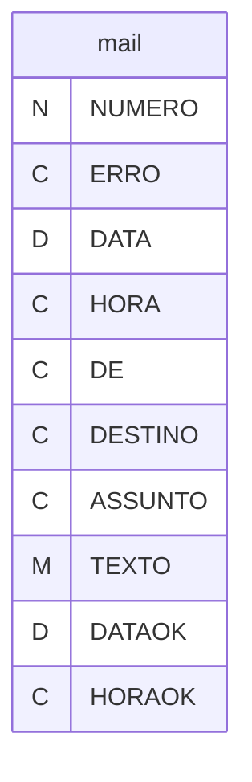
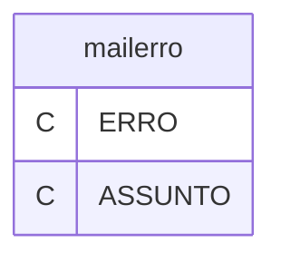
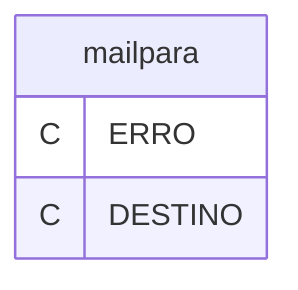
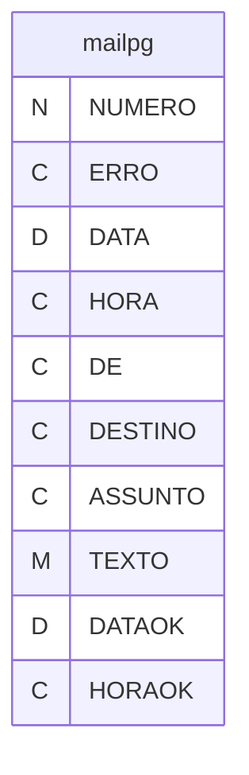

# Dicionario de Estruturas de Dados do Projeto
> Varredura automatica realizada em: 09/09/2026

## Tabela DBF: `mail`
> **Origem:** `mail` (Driver: DBFCDX)

| Campo | Tipo | Tam | Dec |
| :--- | :--- | :--- | :--- |
| NUMERO | N | 8 | 0 |
| ERRO | C | 8 | 0 |
| DATA | D | 8 | 0 |
| HORA | C | 8 | 0 |
| DE | C | 12 | 0 |
| DESTINO | C | 12 | 0 |
| ASSUNTO | C | 120 | 0 |
| TEXTO | M | 10 | 0 |
| DATAOK | D | 8 | 0 |
| HORAOK | C | 8 | 0 |

---
## Tabela DBF: `mailerro`
> **Origem:** `mailerro` (Driver: DBFCDX)

| Campo | Tipo | Tam | Dec |
| :--- | :--- | :--- | :--- |
| ERRO | C | 8 | 0 |
| ASSUNTO | C | 120 | 0 |

**Indices vinculados:**
- Tag: `MAILERRO` Expressao: `ERRO`

---
## Tabela DBF: `mailpara`
> **Origem:** `mailpara` (Driver: DBFCDX)

| Campo | Tipo | Tam | Dec |
| :--- | :--- | :--- | :--- |
| ERRO | C | 8 | 0 |
| DESTINO | C | 12 | 0 |

**Indices vinculados:**
- Tag: `MAILPARA` Expressao: `ERRO`

---
## Tabela DBF: `mailpg`
> **Origem:** `mailpg` (Driver: DBFCDX)

| Campo | Tipo | Tam | Dec |
| :--- | :--- | :--- | :--- |
| NUMERO | N | 8 | 0 |
| ERRO | C | 8 | 0 |
| DATA | D | 8 | 0 |
| HORA | C | 8 | 0 |
| DE | C | 12 | 0 |
| DESTINO | C | 12 | 0 |
| ASSUNTO | C | 120 | 0 |
| TEXTO | M | 10 | 0 |
| DATAOK | D | 8 | 0 |
| HORAOK | C | 8 | 0 |

---
