# Dicionario de Estruturas de Dados do Projeto
> Varredura automatica realizada em: 09/09/2026

## Tabela DBF: `agenda`
> **Origem:** `agenda` (Driver: DBFCDX)

| Campo | Tipo | Tam | Dec |
| :--- | :--- | :--- | :--- |
| CDDATA | D | 8 | 0 |
| OBS1 | C | 60 | 0 |
| OBS2 | C | 60 | 0 |
| OBS3 | C | 60 | 0 |
| OBS4 | C | 60 | 0 |
| OBS5 | C | 60 | 0 |
| OBS6 | C | 60 | 0 |
| OBS7 | C | 60 | 0 |
| OBS8 | C | 60 | 0 |

**Indices vinculados:**
- Tag: `AGENDA` Expressao: `CDDATA`

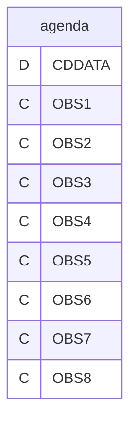

---
## Tabela DBF: `codimp`
> **Origem:** `codimp` (Driver: DBFCDX)

| Campo | Tipo | Tam | Dec |
| :--- | :--- | :--- | :--- |
| CODIGO | C | 6 | 0 |
| NOMEIMP | C | 12 | 0 |
| DESCRICAO | C | 50 | 0 |
| CONTEUDO | C | 70 | 0 |

**Indices vinculados:**
- Tag: `CODIMP` Expressao: `CODIGO`

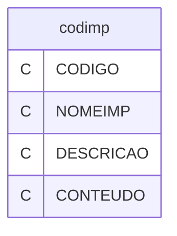

---
## Tabela DBF: `cores`
> **Origem:** `cores` (Driver: DBFCDX)

| Campo | Tipo | Tam | Dec |
| :--- | :--- | :--- | :--- |
| CODIGO | C | 7 | 0 |
| DESCRICAO | C | 60 | 0 |
| COR1 | C | 6 | 0 |
| COR2 | C | 6 | 0 |
| COR3 | C | 6 | 0 |
| COR4 | C | 6 | 0 |
| COR5 | C | 6 | 0 |
| COR6 | C | 6 | 0 |

**Indices vinculados:**
- Tag: `CORES` Expressao: `CODIGO`

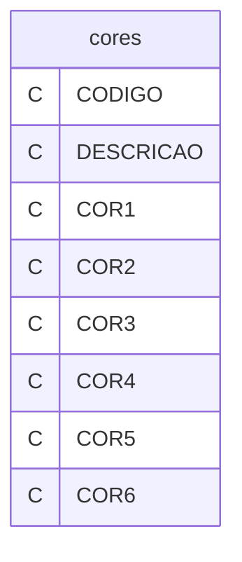

---
## Tabela DBF: `macess`
> **Origem:** `macess` (Driver: DBFCDX)

| Campo | Tipo | Tam | Dec |
| :--- | :--- | :--- | :--- |
| CODIGO | C | 6 | 0 |
| DESCRICAO | C | 60 | 0 |
| SENHA | C | 5 | 0 |

**Indices vinculados:**
- Tag: `MACESS` Expressao: `CODIGO`

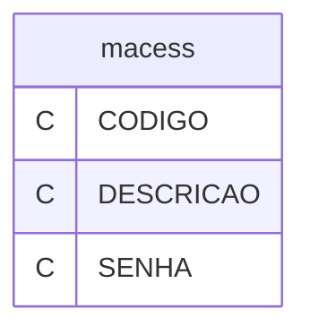

---
## Tabela DBF: `manaman`
> **Origem:** `manaman` (Driver: DBFCDX)

| Campo | Tipo | Tam | Dec |
| :--- | :--- | :--- | :--- |
| DESCRICAO | C | 76 | 0 |
| ARQUIVO | C | 12 | 0 |

**Indices vinculados:**
- Tag: `MANAMAN` Expressao: `ARQUIVO`

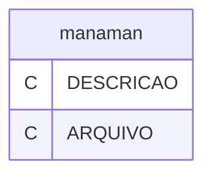

---
## Tabela DBF: `manarq`
> **Origem:** `manarq` (Driver: DBFCDX)

| Campo | Tipo | Tam | Dec |
| :--- | :--- | :--- | :--- |
| ARQUIVO | C | 8 | 0 |
| DESCRICAO | C | 60 | 0 |
| CAMINHO | C | 40 | 0 |
| FIXAR | C | 1 | 0 |
| LACHI | N | 4 | 0 |
| PADRAO | C | 1 | 0 |
| VIDEO | C | 1 | 0 |
| PBUS | C | 1 | 0 |
| PIND | C | 1 | 0 |
| CBAR | C | 120 | 0 |
| TIPG | C | 1 | 0 |
| LAYGET | C | 6 | 0 |
| CBAS | C | 78 | 0 |
| IBUS | N | 2 | 0 |
| IEXI | N | 2 | 0 |
| ARQMES | N | 2 | 0 |
| ARQANO | N | 4 | 0 |
| PULAFIX | C | 1 | 0 |
| DRIVER | C | 10 | 0 |

**Indices vinculados:**
- Tag: `MANARQ` Expressao: `ARQUIVO`

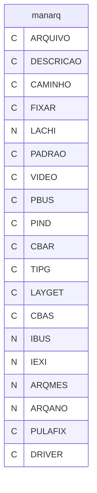

---
## Tabela DBF: `manarq1`
> **Origem:** `manarq1` (Driver: DBFCDX)

| Campo | Tipo | Tam | Dec |
| :--- | :--- | :--- | :--- |
| ARQUIVO | C | 8 | 0 |
| ITEM | N | 2 | 0 |
| INDICE | C | 8 | 0 |
| INDEXP | C | 60 | 0 |
| DESC | C | 55 | 0 |
| LIN1 | N | 2 | 0 |
| LIN2 | N | 2 | 0 |
| LIN3 | N | 2 | 0 |
| COL1 | N | 2 | 0 |
| COL2 | N | 2 | 0 |
| COL3 | N | 2 | 0 |
| VAR1 | C | 10 | 0 |
| VAR2 | C | 10 | 0 |
| VAR3 | C | 10 | 0 |
| DES1 | C | 30 | 0 |
| DES2 | C | 30 | 0 |
| DES3 | C | 30 | 0 |
| FORMULA | C | 60 | 0 |

**Indices vinculados:**
- Tag: `MANARQ1` Expressao: `ARQUIVO+STR(ITEM,2)`

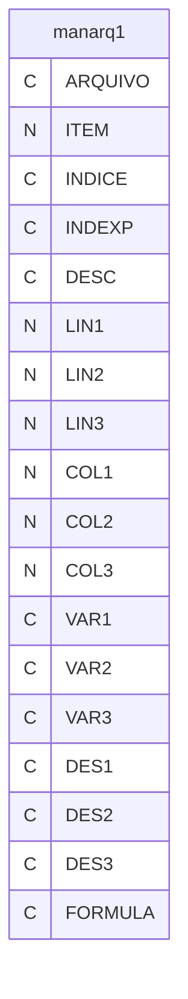

---
## Tabela DBF: `manatu`
> **Origem:** `manatu` (Driver: DBFCDX)

| Campo | Tipo | Tam | Dec |
| :--- | :--- | :--- | :--- |
| ARQUIVO1 | C | 8 | 0 |
| ARQUIVO2 | C | 8 | 0 |
| INDICE | N | 2 | 0 |

**Indices vinculados:**
- Tag: `MANATU` Expressao: `ARQUIVO1`

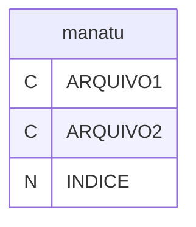

---
## Tabela DBF: `manerr`
> **Origem:** `manerr` (Driver: DBFCDX)

| Campo | Tipo | Tam | Dec |
| :--- | :--- | :--- | :--- |
| USUARIO | C | 10 | 0 |
| DATA | D | 8 | 0 |
| HORA | C | 8 | 0 |
| ERRO | C | 20 | 0 |
| OPR | C | 3 | 0 |
| ARQUIVO | C | 8 | 0 |

**Indices vinculados:**
- Tag: `MANERR` Expressao: `USUARIO+DTOS(DATA)`

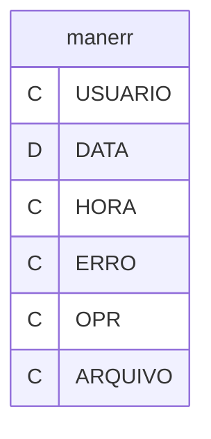

---
## Tabela DBF: `manfec`
> **Origem:** `manfec` (Driver: DBFCDX)

| Campo | Tipo | Tam | Dec |
| :--- | :--- | :--- | :--- |
| ARQORI | C | 8 | 0 |
| STRANO | C | 8 | 0 |
| STRDES | C | 2 | 0 |
| STRATU | C | 8 | 0 |
| STRBAI | C | 8 | 0 |
| FECANU | C | 100 | 0 |
| CAMDAT | C | 10 | 0 |
| CAMDA2 | C | 10 | 0 |
| OPER01 | C | 200 | 0 |
| OPER02 | C | 200 | 0 |
| OPER03 | C | 200 | 0 |
| OPER04 | C | 200 | 0 |
| OPER05 | C | 200 | 0 |
| OPER06 | C | 200 | 0 |
| OPER07 | C | 200 | 0 |
| FECHAAUTO | C | 1 | 0 |

**Indices vinculados:**
- Tag: `MANFEC` Expressao: `ARQORI`
- Tag: `MANFEC-2` Expressao: `STRANO`
- Tag: `MANFEC-3` Expressao: `STRDES`

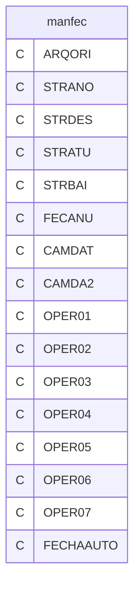

---
## Tabela DBF: `manfer`
> **Origem:** `manfer` (Driver: DBFCDX)

| Campo | Tipo | Tam | Dec |
| :--- | :--- | :--- | :--- |
| DIA | N | 2 | 0 |
| MES | N | 2 | 0 |
| DESCRICAO | C | 40 | 0 |

**Indices vinculados:**
- Tag: `MANFER` Expressao: `STR(DIA)+STR(MES)`

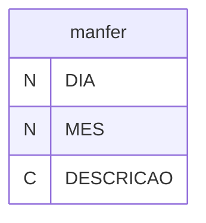

---
## Tabela DBF: `manget`
> **Origem:** `manget` (Driver: DBFCDX)

| Campo | Tipo | Tam | Dec |
| :--- | :--- | :--- | :--- |
| CODIGO | C | 6 | 0 |
| SEQ | N | 3 | 0 |
| TIP | C | 1 | 0 |
| LININI | N | 2 | 0 |
| COLINI | N | 2 | 0 |
| LINFIM | N | 2 | 0 |
| COLFIM | N | 2 | 0 |
| CAMPO | C | 10 | 0 |
| ESTILO | C | 25 | 0 |
| MENSAGEM | C | 40 | 0 |
| CONDICAO | C | 200 | 0 |
| PRECOND | C | 200 | 0 |

**Indices vinculados:**
- Tag: `MANGET` Expressao: `CODIGO+STR(SEQ,3)`

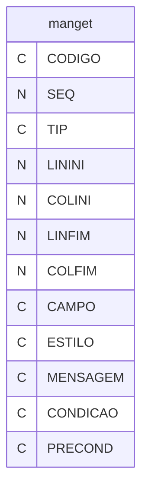

---
## Tabela DBF: `manopt`
> **Origem:** `manopt` (Driver: DBFCDX)

| Campo | Tipo | Tam | Dec |
| :--- | :--- | :--- | :--- |
| ITEMENU | C | 1 | 0 |
| POSICAO | N | 2 | 0 |
| DESCP | C | 30 | 0 |
| DESCM | C | 75 | 0 |
| LINHA | N | 2 | 0 |
| COLUNA | N | 2 | 0 |
| TECLA | N | 3 | 0 |
| EXECUTAR | C | 254 | 0 |

**Indices vinculados:**
- Tag: `MANOPT` Expressao: `ITEMENU+STR(POSICAO,2)`

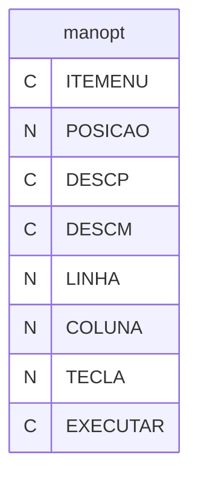

---
## Tabela DBF: `manre1`
> **Origem:** `manre1` (Driver: DBFCDX)

| Campo | Tipo | Tam | Dec |
| :--- | :--- | :--- | :--- |
| ARQUIVO | N | 3 | 0 |
| MENU | C | 2 | 0 |
| CODIGO | C | 8 | 0 |
| TIPO | C | 1 | 0 |
| SEQUENCIA | N | 3 | 0 |
| SEQ | N | 3 | 0 |
| ESPACEJAR | N | 2 | 0 |
| COLUNA | N | 3 | 0 |
| CONTEUDO | C | 78 | 0 |
| MASCARA | C | 25 | 0 |
| TOTALIZA | L | 1 | 0 |
| FORMULA | C | 35 | 0 |
| QUEBRAR | N | 2 | 0 |

**Indices vinculados:**
- Tag: `MANRE1-1` Expressao: `MENU+CODIGO+STR(ARQUIVO)+STR(SEQUENCIA)+STR(COLUNA)`

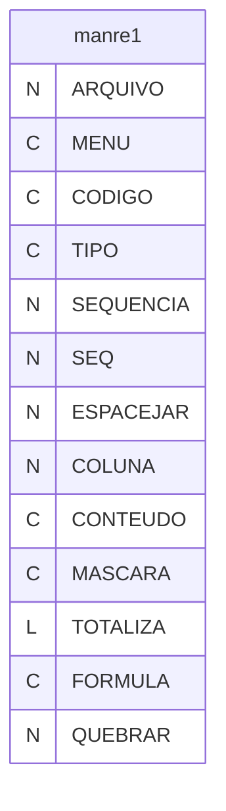

---
## Tabela DBF: `manreg`
> **Origem:** `manreg` (Driver: DBFCDX)

| Campo | Tipo | Tam | Dec |
| :--- | :--- | :--- | :--- |
| POSICAO | N | 2 | 0 |
| GRUPO | C | 2 | 0 |
| DESCRICAO | C | 70 | 0 |

**Indices vinculados:**
- Tag: `MANREG-1` Expressao: `POSICAO`
- Tag: `MANREG-2` Expressao: `GRUPO`

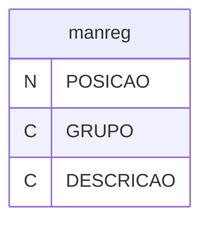

---
## Tabela DBF: `manrel`
> **Origem:** `manrel` (Driver: DBFCDX)

| Campo | Tipo | Tam | Dec |
| :--- | :--- | :--- | :--- |
| MENU | C | 2 | 0 |
| MENU1 | C | 2 | 0 |
| CODIGO | C | 8 | 0 |
| CODIGO1 | C | 8 | 0 |
| NOME | C | 60 | 0 |
| FOLHA | N | 3 | 0 |
| ETIQ | C | 1 | 0 |
| ALTURA | N | 2 | 0 |
| LARGURA | N | 2 | 0 |
| COLUNAS | N | 2 | 0 |
| ARQUIVO1 | C | 8 | 0 |
| PIND1 | C | 1 | 0 |
| INDICE1 | N | 2 | 0 |
| CAMPO1 | C | 150 | 0 |
| ARQUIVO2 | C | 8 | 0 |
| PIND2 | C | 1 | 0 |
| INDICE2 | N | 2 | 0 |
| CAMPO2 | C | 150 | 0 |
| ARQUIVO3 | C | 8 | 0 |
| PIND3 | C | 1 | 0 |
| INDICE3 | N | 2 | 0 |
| CAMPO3 | C | 150 | 0 |
| ARQUIVO4 | C | 8 | 0 |
| PIND4 | C | 1 | 0 |
| INDICE4 | N | 2 | 0 |
| CAMPO4 | C | 150 | 0 |
| ARQUIVO5 | C | 8 | 0 |
| PIND5 | C | 1 | 0 |
| INDICE5 | N | 2 | 0 |
| CAMPO5 | C | 150 | 0 |
| ARQUIVO6 | C | 8 | 0 |
| PIND6 | C | 1 | 0 |
| INDICE6 | N | 2 | 0 |
| CAMPO6 | C | 150 | 0 |
| INDEXACAO | C | 78 | 0 |
| SETUP | C | 78 | 0 |
| FILTRO | C | 78 | 0 |
| REL1ARQ | N | 2 | 0 |
| REL2ARQ | N | 2 | 0 |
| REL3ARQ | N | 2 | 0 |
| REL4ARQ | N | 2 | 0 |
| RELACAO1 | C | 71 | 0 |
| RELACAO2 | C | 71 | 0 |
| RELACAO3 | C | 71 | 0 |
| RELACAO4 | C | 71 | 0 |
| DEFAULT | N | 3 | 0 |
| QUEBRA1A | C | 53 | 0 |
| QUEBRA1B | C | 53 | 0 |
| QUEBRA1C | C | 53 | 0 |
| QUEBRA1D | C | 53 | 0 |
| QUEBRA1E | C | 53 | 0 |
| QUEBRA2A | C | 53 | 0 |
| QUEBRA2B | C | 53 | 0 |
| QUEBRA2C | C | 53 | 0 |
| QUEBRA2D | C | 53 | 0 |
| QUEBRA2E | C | 53 | 0 |
| QUEBRA3A | C | 53 | 0 |
| QUEBRA3B | C | 53 | 0 |
| QUEBRA3C | C | 53 | 0 |
| QUEBRA3D | C | 53 | 0 |
| QUEBRA3E | C | 53 | 0 |
| QUEBRA4A | C | 53 | 0 |
| QUEBRA4B | C | 53 | 0 |
| QUEBRA4C | C | 53 | 0 |
| QUEBRA4D | C | 53 | 0 |
| QUEBRA4E | C | 53 | 0 |
| QUEBRA5A | C | 53 | 0 |
| QUEBRA5B | C | 53 | 0 |
| QUEBRA5C | C | 53 | 0 |
| QUEBRA5D | C | 53 | 0 |
| QUEBRA5E | C | 53 | 0 |
| SELECAO | N | 2 | 0 |
| FATOR1 | C | 1 | 0 |
| FATOR2 | C | 1 | 0 |
| FATOR3 | C | 1 | 0 |
| FATOR4 | C | 1 | 0 |
| FATOR5 | C | 1 | 0 |
| DESCRICA1 | C | 25 | 0 |
| DESCRICA2 | C | 25 | 0 |
| DESCRICA3 | C | 25 | 0 |
| DESCRICA4 | C | 25 | 0 |
| DESCRICA5 | C | 25 | 0 |
| TAM1 | N | 2 | 0 |
| TAM2 | N | 2 | 0 |
| TAM3 | N | 2 | 0 |
| TAM4 | N | 2 | 0 |
| TAM5 | N | 2 | 0 |
| NOME_LISTA | C | 70 | 0 |
| REL_NIV2 | C | 1 | 0 |
| REL_NIV3 | C | 1 | 0 |
| REL_NIV4 | C | 1 | 0 |
| REL_NIV5 | C | 1 | 0 |
| ACESSOS | N | 8 | 0 |
| DATAULT | D | 8 | 0 |

**Indices vinculados:**
- Tag: `MANREL` Expressao: `MENU+CODIGO`


---
## Tabela DBF: `mansub`
> **Origem:** `mansub` (Driver: DBFCDX)

| Campo | Tipo | Tam | Dec |
| :--- | :--- | :--- | :--- |
| ITEMENU | C | 4 | 0 |
| POSICAO | N | 2 | 0 |
| DESCP | C | 30 | 0 |
| DESCM | C | 75 | 0 |
| LINHA | N | 2 | 0 |
| COLUNA | N | 2 | 0 |
| TECLA | N | 3 | 0 |
| EXECUTAR | C | 200 | 0 |

**Indices vinculados:**
- Tag: `MANSUB` Expressao: `ITEMENU+STR(POSICAO,2)`

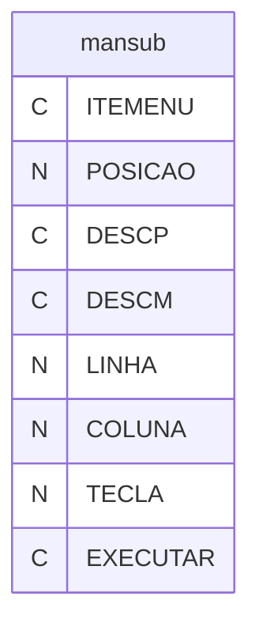

---
## Tabela DBF: `mantel`
> **Origem:** `mantel` (Driver: DBFCDX)

| Campo | Tipo | Tam | Dec |
| :--- | :--- | :--- | :--- |
| CODIGO | C | 6 | 0 |
| SEQ | N | 3 | 0 |
| TIP | C | 1 | 0 |
| LININI | N | 2 | 0 |
| COLINI | N | 2 | 0 |
| LINFIM | N | 2 | 0 |
| COLFIM | N | 2 | 0 |
| DIZER | C | 80 | 0 |
| ESTILO | C | 20 | 0 |

**Indices vinculados:**
- Tag: `MANTEL` Expressao: `CODIGO+STR(SEQ,3)`

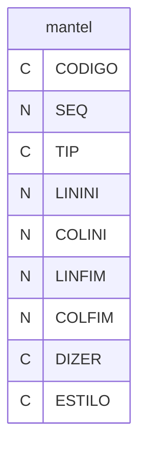

---
## Tabela DBF: `mcarta`
> **Origem:** `mcarta` (Driver: DBFCDX)

| Campo | Tipo | Tam | Dec |
| :--- | :--- | :--- | :--- |
| ARQUIVO | C | 8 | 0 |
| NOME | C | 50 | 0 |
| SETUP | C | 20 | 0 |
| MARSUP | N | 2 | 0 |
| MARINF | N | 2 | 0 |
| MARDIR | N | 2 | 0 |
| MARESQ | N | 2 | 0 |
| MARCOL | N | 3 | 0 |
| MARLIN | N | 2 | 0 |

**Indices vinculados:**
- Tag: `MCARTA` Expressao: `ARQUIVO`

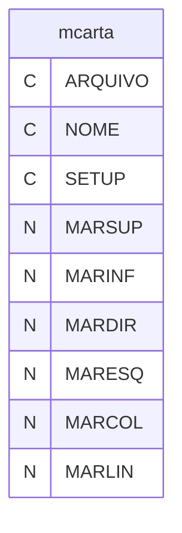

---
## Tabela DBF: `mcopia`
> **Origem:** `mcopia` (Driver: DBFCDX)

| Campo | Tipo | Tam | Dec |
| :--- | :--- | :--- | :--- |
| NOME | C | 6 | 0 |
| DIRETORIO | C | 35 | 0 |
| ARQ01 | C | 12 | 0 |
| ARQ02 | C | 12 | 0 |
| ARQ03 | C | 12 | 0 |
| ARQ04 | C | 12 | 0 |
| ARQ05 | C | 12 | 0 |
| ARQ06 | C | 12 | 0 |
| ARQO7 | C | 12 | 0 |
| ARQO8 | C | 12 | 0 |
| ARQ09 | C | 12 | 0 |
| ARQ10 | C | 12 | 0 |
| ARQ11 | C | 12 | 0 |
| ARQ12 | C | 12 | 0 |
| ARQ13 | C | 12 | 0 |
| ARQ14 | C | 12 | 0 |
| ARQ15 | C | 12 | 0 |
| ARQ16 | C | 12 | 0 |
| ARQ17 | C | 12 | 0 |
| ARQ18 | C | 12 | 0 |
| ARQ19 | C | 12 | 0 |
| ARQ20 | C | 12 | 0 |
| ARQ21 | C | 12 | 0 |
| ARQ22 | C | 12 | 0 |
| ARQ23 | C | 12 | 0 |
| ARQ24 | C | 12 | 0 |
| ARQ25 | C | 12 | 0 |
| ARQ26 | C | 12 | 0 |
| ARQ27 | C | 12 | 0 |
| ARQ28 | C | 12 | 0 |
| ARQ29 | C | 12 | 0 |
| ARQ30 | C | 12 | 0 |
| ARQ31 | C | 12 | 0 |
| ARQ32 | C | 12 | 0 |
| ARQ33 | C | 12 | 0 |
| ARQ34 | C | 12 | 0 |
| ARQ35 | C | 12 | 0 |
| ARQ36 | C | 12 | 0 |
| ARQ37 | C | 12 | 0 |
| ARQ38 | C | 12 | 0 |
| ARQ39 | C | 12 | 0 |
| ARQ40 | C | 12 | 0 |

**Indices vinculados:**
- Tag: `MCOPIA` Expressao: `NOME`

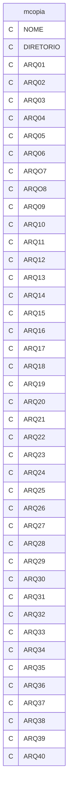

---
## Tabela DBF: `metiq`
> **Origem:** `metiq` (Driver: DBFCDX)

| Campo | Tipo | Tam | Dec |
| :--- | :--- | :--- | :--- |
| CODIGO | C | 6 | 0 |
| NOME | C | 50 | 0 |
| LINHA1 | C | 75 | 0 |
| LINHA2 | C | 75 | 0 |
| LINHA3 | C | 75 | 0 |
| LINHA4 | C | 75 | 0 |
| LINHA5 | C | 75 | 0 |
| LINHA6 | C | 75 | 0 |
| LINHA7 | C | 75 | 0 |
| LINHA8 | C | 75 | 0 |
| NLIN | N | 1 | 0 |
| NCOL | N | 2 | 0 |
| NCAR | N | 1 | 0 |
| SETUP | C | 20 | 0 |
| ARQUIVO | C | 8 | 0 |
| INDICE | N | 2 | 0 |
| FILTRO | C | 50 | 0 |
| ARQGRA | C | 8 | 0 |
| PIND | C | 1 | 0 |
| NIND | N | 2 | 0 |
| TIPFIL | C | 1 | 0 |
| CONFIL | C | 50 | 0 |
| PFIL | C | 1 | 0 |
| SETUPFIM | C | 20 | 0 |

**Indices vinculados:**
- Tag: `METIQ` Expressao: `CODIGO`

```mermaid
erDiagram
    metiq {
        C CODIGO
        C NOME
        C LINHA1
        C LINHA2
        C LINHA3
        C LINHA4
        C LINHA5
        C LINHA6
        C LINHA7
        C LINHA8
        N NLIN
        N NCOL
        N NCAR
        C SETUP
        C ARQUIVO
        N INDICE
        C FILTRO
        C ARQGRA
        C PIND
        N NIND
        C TIPFIL
        C CONFIL
        C PFIL
        C SETUPFIM
    }
```

---
## Tabela DBF: `mexpor`
> **Origem:** `mexpor` (Driver: DBFCDX)

| Campo | Tipo | Tam | Dec |
| :--- | :--- | :--- | :--- |
| ARQORI | C | 8 | 0 |
| ARQDES | C | 8 | 0 |
| CODIGO | C | 6 | 0 |
| DESCRICAO | C | 50 | 0 |
| CHAVEIND | C | 30 | 0 |
| DESAPP | C | 10 | 0 |
| ORIAPP | C | 40 | 0 |
| REPENC | C | 1 | 0 |
| APAGA | C | 1 | 0 |
| TIPO | C | 1 | 0 |
| ARQORIEXT | C | 3 | 0 |
| ARQDESEXT | C | 3 | 0 |

**Indices vinculados:**
- Tag: `MEXPOR` Expressao: `CODIGO`

```mermaid
erDiagram
    mexpor {
        C ARQORI
        C ARQDES
        C CODIGO
        C DESCRICAO
        C CHAVEIND
        C DESAPP
        C ORIAPP
        C REPENC
        C APAGA
        C TIPO
        C ARQORIEXT
        C ARQDESEXT
    }
```

---
## Tabela DBF: `mexpor1`
> **Origem:** `mexpor1` (Driver: DBFCDX)

| Campo | Tipo | Tam | Dec |
| :--- | :--- | :--- | :--- |
| CODIGO | C | 6 | 0 |
| VARDES | C | 20 | 0 |
| VARDRI | C | 100 | 0 |

**Indices vinculados:**
- Tag: `MEXPOR1` Expressao: `CODIGO+VARDES`

```mermaid
erDiagram
    mexpor1 {
        C CODIGO
        C VARDES
        C VARDRI
    }
```

---
## Tabela DBF: `mf11`
> **Origem:** `mf11` (Driver: DBFCDX)

| Campo | Tipo | Tam | Dec |
| :--- | :--- | :--- | :--- |
| VARIAVEL | C | 10 | 0 |
| EXECUTE | C | 120 | 0 |
| ARQUIVO | C | 8 | 0 |

**Indices vinculados:**
- Tag: `MF11-1` Expressao: `VARIAVEL+ARQUIVO`

```mermaid
erDiagram
    mf11 {
        C VARIAVEL
        C EXECUTE
        C ARQUIVO
    }
```

---
## Tabela DBF: `mmes`
> **Origem:** `mmes` (Driver: DBFCDX)

| Campo | Tipo | Tam | Dec |
| :--- | :--- | :--- | :--- |
| CODIGO | C | 6 | 0 |
| USO | C | 50 | 0 |
| MENSAGEM | C | 50 | 0 |
| DESCRICAO | M | 10 | 0 |

**Indices vinculados:**
- Tag: `MMES` Expressao: `CODIGO`

```mermaid
erDiagram
    mmes {
        C CODIGO
        C USO
        C MENSAGEM
        M DESCRICAO
    }
```

---
## Tabela DBF: `muser`
> **Origem:** `muser` (Driver: DBFCDX)

| Campo | Tipo | Tam | Dec |
| :--- | :--- | :--- | :--- |
| USUARIO | C | 10 | 0 |
| SENHA | C | 8 | 0 |
| VALIDADE | C | 8 | 0 |
| VALDATA | D | 8 | 0 |
| EQUIVALE | C | 10 | 0 |
| ESTADO | C | 1 | 0 |
| ARQFON | C | 8 | 0 |
| SETOR | C | 10 | 0 |
| WRPTNO | N | 8 | 0 |
| FOLHANO | N | 8 | 0 |
| DATATRO | D | 8 | 0 |
| USUARIOW | C | 20 | 0 |
| SENHAW | C | 20 | 0 |
| POSTEL01 | N | 3 | 0 |
| POSTEL02 | N | 3 | 0 |
| POSTEL03 | N | 3 | 0 |
| POSTEL04 | N | 3 | 0 |
| POSTEL05 | N | 3 | 0 |
| POSTEL06 | N | 3 | 0 |
| POSTEL07 | N | 3 | 0 |
| POSTEL08 | N | 3 | 0 |
| POSTEL09 | N | 3 | 0 |
| POSTEL10 | N | 3 | 0 |
| POSTEL11 | N | 3 | 0 |
| POSTEL12 | N | 3 | 0 |
| POSTEL13 | N | 3 | 0 |
| POSTEL14 | N | 3 | 0 |
| POSTEL15 | N | 3 | 0 |
| POSTEL16 | N | 3 | 0 |
| POSTEL17 | N | 3 | 0 |
| POSTEL18 | N | 3 | 0 |
| CHAVEH | C | 64 | 0 |
| CHAVEWC | C | 64 | 0 |
| CHAVEWW | C | 64 | 0 |
| CHAVEWS | C | 64 | 0 |

**Indices vinculados:**
- Tag: `MUSER` Expressao: `USUARIO`

```mermaid
erDiagram
    muser {
        C USUARIO
        C SENHA
        C VALIDADE
        D VALDATA
        C EQUIVALE
        C ESTADO
        C ARQFON
        C SETOR
        N WRPTNO
        N FOLHANO
        D DATATRO
        C USUARIOW
        C SENHAW
        N POSTEL01
        N POSTEL02
        N POSTEL03
        N POSTEL04
        N POSTEL05
        N POSTEL06
        N POSTEL07
        N POSTEL08
        N POSTEL09
        N POSTEL10
        N POSTEL11
        N POSTEL12
        N POSTEL13
        N POSTEL14
        N POSTEL15
        N POSTEL16
        N POSTEL17
        N POSTEL18
        C CHAVEH
        C CHAVEWC
        C CHAVEWW
        C CHAVEWS
    }
```

---
## Tabela DBF: `musera`
> **Origem:** `musera` (Driver: DBFCDX)

| Campo | Tipo | Tam | Dec |
| :--- | :--- | :--- | :--- |
| CONTROLE | C | 20 | 0 |

**Indices vinculados:**
- Tag: `MUSERA` Expressao: `CONTROLE`

```mermaid
erDiagram
    musera {
        C CONTROLE
    }
```

---
## Tabela DBF: `muserb`
> **Origem:** `muserb` (Driver: DBFCDX)

| Campo | Tipo | Tam | Dec |
| :--- | :--- | :--- | :--- |
| CONTROLE | C | 20 | 0 |
| ITEMENU | C | 3 | 0 |
| POSICAO | N | 3 | 0 |
| POSTELA | C | 30 | 0 |

**Indices vinculados:**
- Tag: `MUSERB` Expressao: `CONTROLE`
- Tag: `MUSERB-2` Expressao: `ITEMENU+STRZERO(POSICAO,3)+POSTELA`

```mermaid
erDiagram
    muserb {
        C CONTROLE
        C ITEMENU
        N POSICAO
        C POSTELA
    }
```

---
## Tabela DBF: `muserf`
> **Origem:** `muserf` (Driver: DBFCDX)

| Campo | Tipo | Tam | Dec |
| :--- | :--- | :--- | :--- |
| CONTROLE | C | 20 | 0 |

**Indices vinculados:**
- Tag: `MUSERF` Expressao: `CONTROLE`

```mermaid
erDiagram
    muserf {
        C CONTROLE
    }
```

---
## Tabela DBF: `muserm`
> **Origem:** `muserm` (Driver: DBFCDX)

| Campo | Tipo | Tam | Dec |
| :--- | :--- | :--- | :--- |
| CONTROLE | C | 13 | 0 |

**Indices vinculados:**
- Tag: `MUSERM` Expressao: `CONTROLE`

```mermaid
erDiagram
    muserm {
        C CONTROLE
    }
```

---
## Tabela DBF: `musern`
> **Origem:** `musern` (Driver: DBFCDX)

| Campo | Tipo | Tam | Dec |
| :--- | :--- | :--- | :--- |
| USUARIO | C | 10 | 0 |
| ID | C | 40 | 0 |

**Indices vinculados:**
- Tag: `MUSERN` Expressao: `USUARIO`

```mermaid
erDiagram
    musern {
        C USUARIO
        C ID
    }
```

---
## Tabela DBF: `musero`
> **Origem:** `musero` (Driver: DBFCDX)

| Campo | Tipo | Tam | Dec |
| :--- | :--- | :--- | :--- |
| CONTROLE | C | 20 | 0 |

**Indices vinculados:**
- Tag: `MUSERO` Expressao: `CONTROLE`

```mermaid
erDiagram
    musero {
        C CONTROLE
    }
```

---
## Tabela DBF: `muserr`
> **Origem:** `muserr` (Driver: DBFCDX)

| Campo | Tipo | Tam | Dec |
| :--- | :--- | :--- | :--- |
| CONTROLE | C | 20 | 0 |

**Indices vinculados:**
- Tag: `MUSERR` Expressao: `CONTROLE`

```mermaid
erDiagram
    muserr {
        C CONTROLE
    }
```

---
## Tabela DBF: `muserw`
> **Origem:** `muserw` (Driver: DBFCDX)

| Campo | Tipo | Tam | Dec |
| :--- | :--- | :--- | :--- |
| CONTROLE | C | 20 | 0 |
| ITEMENU | C | 3 | 0 |
| POSICAO | N | 3 | 0 |
| POSTELA | C | 30 | 0 |

**Indices vinculados:**
- Tag: `MUSERW` Expressao: `CONTROLE`
- Tag: `MUSERW-2` Expressao: `ITEMENU+STRZERO(POSICAO,3)+POSTELA`

```mermaid
erDiagram
    muserw {
        C CONTROLE
        C ITEMENU
        N POSICAO
        C POSTELA
    }
```

---
## Tabela DBF: `nota`
> **Origem:** `nota` (Driver: DBFCDX)

| Campo | Tipo | Tam | Dec |
| :--- | :--- | :--- | :--- |
| NOME | C | 10 | 0 |
| OBS1 | C | 60 | 0 |
| OBS2 | C | 60 | 0 |
| OBS3 | C | 60 | 0 |
| OBS4 | C | 60 | 0 |
| OBS5 | C | 60 | 0 |
| OBS6 | C | 60 | 0 |
| OBS7 | C | 60 | 0 |

**Indices vinculados:**
- Tag: `NOTA` Expressao: `NOME`

```mermaid
erDiagram
    nota {
        C NOME
        C OBS1
        C OBS2
        C OBS3
        C OBS4
        C OBS5
        C OBS6
        C OBS7
    }
```

---
## Tabela DBF: `padre1`
> **Origem:** `padre1` (Driver: DBFCDX)

| Campo | Tipo | Tam | Dec |
| :--- | :--- | :--- | :--- |
| ARQUIVO | N | 3 | 0 |
| MENU | C | 2 | 0 |
| CODIGO | C | 8 | 0 |
| TIPO | C | 1 | 0 |
| SEQUENCIA | N | 3 | 0 |
| SEQ | N | 3 | 0 |
| ESPACEJAR | N | 2 | 0 |
| COLUNA | N | 3 | 0 |
| CONTEUDO | C | 78 | 0 |
| MASCARA | C | 25 | 0 |
| TOTALIZA | L | 1 | 0 |
| FORMULA | C | 35 | 0 |
| QUEBRAR | N | 2 | 0 |

**Indices vinculados:**
- Tag: `PADRE1-1` Expressao: `MENU+CODIGO+STR(ARQUIVO)+STR(SEQUENCIA)+STR(COLUNA)`

```mermaid
erDiagram
    padre1 {
        N ARQUIVO
        C MENU
        C CODIGO
        C TIPO
        N SEQUENCIA
        N SEQ
        N ESPACEJAR
        N COLUNA
        C CONTEUDO
        C MASCARA
        L TOTALIZA
        C FORMULA
        N QUEBRAR
    }
```

---
## Tabela DBF: `padrel`
> **Origem:** `padrel` (Driver: DBFCDX)

| Campo | Tipo | Tam | Dec |
| :--- | :--- | :--- | :--- |
| MENU | C | 2 | 0 |
| MENU1 | C | 2 | 0 |
| CODIGO | C | 8 | 0 |
| CODIGO1 | C | 8 | 0 |
| NOME | C | 60 | 0 |
| FOLHA | N | 3 | 0 |
| ETIQ | C | 1 | 0 |
| ALTURA | N | 2 | 0 |
| LARGURA | N | 2 | 0 |
| COLUNAS | N | 2 | 0 |
| ARQUIVO1 | C | 8 | 0 |
| PIND1 | C | 1 | 0 |
| INDICE1 | N | 2 | 0 |
| CAMPO1 | C | 150 | 0 |
| ARQUIVO2 | C | 8 | 0 |
| PIND2 | C | 1 | 0 |
| INDICE2 | N | 2 | 0 |
| CAMPO2 | C | 150 | 0 |
| ARQUIVO3 | C | 8 | 0 |
| PIND3 | C | 1 | 0 |
| INDICE3 | N | 2 | 0 |
| CAMPO3 | C | 150 | 0 |
| ARQUIVO4 | C | 8 | 0 |
| PIND4 | C | 1 | 0 |
| INDICE4 | N | 2 | 0 |
| CAMPO4 | C | 150 | 0 |
| ARQUIVO5 | C | 8 | 0 |
| PIND5 | C | 1 | 0 |
| INDICE5 | N | 2 | 0 |
| CAMPO5 | C | 150 | 0 |
| ARQUIVO6 | C | 8 | 0 |
| PIND6 | C | 1 | 0 |
| INDICE6 | N | 2 | 0 |
| CAMPO6 | C | 150 | 0 |
| INDEXACAO | C | 78 | 0 |
| SETUP | C | 78 | 0 |
| FILTRO | C | 78 | 0 |
| REL1ARQ | N | 2 | 0 |
| REL2ARQ | N | 2 | 0 |
| REL3ARQ | N | 2 | 0 |
| REL4ARQ | N | 2 | 0 |
| RELACAO1 | C | 71 | 0 |
| RELACAO2 | C | 71 | 0 |
| RELACAO3 | C | 71 | 0 |
| RELACAO4 | C | 71 | 0 |
| DEFAULT | N | 3 | 0 |
| QUEBRA1A | C | 53 | 0 |
| QUEBRA1B | C | 53 | 0 |
| QUEBRA1C | C | 53 | 0 |
| QUEBRA1D | C | 53 | 0 |
| QUEBRA1E | C | 53 | 0 |
| QUEBRA2A | C | 53 | 0 |
| QUEBRA2B | C | 53 | 0 |
| QUEBRA2C | C | 53 | 0 |
| QUEBRA2D | C | 53 | 0 |
| QUEBRA2E | C | 53 | 0 |
| QUEBRA3A | C | 53 | 0 |
| QUEBRA3B | C | 53 | 0 |
| QUEBRA3C | C | 53 | 0 |
| QUEBRA3D | C | 53 | 0 |
| QUEBRA3E | C | 53 | 0 |
| QUEBRA4A | C | 53 | 0 |
| QUEBRA4B | C | 53 | 0 |
| QUEBRA4C | C | 53 | 0 |
| QUEBRA4D | C | 53 | 0 |
| QUEBRA4E | C | 53 | 0 |
| QUEBRA5A | C | 53 | 0 |
| QUEBRA5B | C | 53 | 0 |
| QUEBRA5C | C | 53 | 0 |
| QUEBRA5D | C | 53 | 0 |
| QUEBRA5E | C | 53 | 0 |
| SELECAO | N | 2 | 0 |
| FATOR1 | C | 1 | 0 |
| FATOR2 | C | 1 | 0 |
| FATOR3 | C | 1 | 0 |
| FATOR4 | C | 1 | 0 |
| FATOR5 | C | 1 | 0 |
| DESCRICA1 | C | 25 | 0 |
| DESCRICA2 | C | 25 | 0 |
| DESCRICA3 | C | 25 | 0 |
| DESCRICA4 | C | 25 | 0 |
| DESCRICA5 | C | 25 | 0 |
| TAM1 | N | 2 | 0 |
| TAM2 | N | 2 | 0 |
| TAM3 | N | 2 | 0 |
| TAM4 | N | 2 | 0 |
| TAM5 | N | 2 | 0 |
| NOME_LISTA | C | 70 | 0 |
| REL_NIV2 | C | 1 | 0 |
| REL_NIV3 | C | 1 | 0 |
| REL_NIV4 | C | 1 | 0 |
| REL_NIV5 | C | 1 | 0 |
| ACESSOS | N | 8 | 0 |
| DATAULT | D | 8 | 0 |

**Indices vinculados:**
- Tag: `PADREL-1` Expressao: `MENU+CODIGO`

```mermaid
erDiagram
    padrel {
        C MENU
        C MENU1
        C CODIGO
        C CODIGO1
        C NOME
        N FOLHA
        C ETIQ
        N ALTURA
        N LARGURA
        N COLUNAS
        C ARQUIVO1
        C PIND1
        N INDICE1
        C CAMPO1
        C ARQUIVO2
        C PIND2
        N INDICE2
        C CAMPO2
        C ARQUIVO3
        C PIND3
        N INDICE3
        C CAMPO3
        C ARQUIVO4
        C PIND4
        N INDICE4
        C CAMPO4
        C ARQUIVO5
        C PIND5
        N INDICE5
        C CAMPO5
        C ARQUIVO6
        C PIND6
        N INDICE6
        C CAMPO6
        C INDEXACAO
        C SETUP
        C FILTRO
        N REL1ARQ
        N REL2ARQ
        N REL3ARQ
        N REL4ARQ
        C RELACAO1
        C RELACAO2
        C RELACAO3
        C RELACAO4
        N DEFAULT
        C QUEBRA1A
        C QUEBRA1B
        C QUEBRA1C
        C QUEBRA1D
        C QUEBRA1E
        C QUEBRA2A
        C QUEBRA2B
        C QUEBRA2C
        C QUEBRA2D
        C QUEBRA2E
        C QUEBRA3A
        C QUEBRA3B
        C QUEBRA3C
        C QUEBRA3D
        C QUEBRA3E
        C QUEBRA4A
        C QUEBRA4B
        C QUEBRA4C
        C QUEBRA4D
        C QUEBRA4E
        C QUEBRA5A
        C QUEBRA5B
        C QUEBRA5C
        C QUEBRA5D
        C QUEBRA5E
        N SELECAO
        C FATOR1
        C FATOR2
        C FATOR3
        C FATOR4
        C FATOR5
        C DESCRICA1
        C DESCRICA2
        C DESCRICA3
        C DESCRICA4
        C DESCRICA5
        N TAM1
        N TAM2
        N TAM3
        N TAM4
        N TAM5
        C NOME_LISTA
        C REL_NIV2
        C REL_NIV3
        C REL_NIV4
        C REL_NIV5
        N ACESSOS
        D DATAULT
    }
```

---
## Tabela DBF: `sysopt`
> **Origem:** `sysopt` (Driver: DBFCDX)

| Campo | Tipo | Tam | Dec |
| :--- | :--- | :--- | :--- |
| ITEMENU | C | 3 | 0 |
| POSICAO | N | 3 | 0 |
| DESCP | C | 30 | 0 |
| DESCM | C | 75 | 0 |
| LINHA | N | 2 | 0 |
| COLUNA | N | 2 | 0 |
| TECLA | N | 3 | 0 |
| EXECUTAR | C | 200 | 0 |

**Indices vinculados:**
- Tag: `SYSOPT` Expressao: `ITEMENU+STR(POSICAO,2)`

```mermaid
erDiagram
    sysopt {
        C ITEMENU
        N POSICAO
        C DESCP
        C DESCM
        N LINHA
        N COLUNA
        N TECLA
        C EXECUTAR
    }
```

---
## Tabela DBF: `telememo`
> **Origem:** `telememo` (Driver: DBFCDX)

| Campo | Tipo | Tam | Dec |
| :--- | :--- | :--- | :--- |
| NOME | C | 15 | 0 |
| ESPECIF | C | 35 | 0 |
| TELEF | C | 15 | 0 |
| FAX | C | 15 | 0 |

**Indices vinculados:**
- Tag: `TELEMEMO` Expressao: `NOME`

```mermaid
erDiagram
    telememo {
        C NOME
        C ESPECIF
        C TELEF
        C FAX
    }
```

---
## Tabela DBF: `winopt`
> **Origem:** `winopt` (Driver: DBFCDX)

| Campo | Tipo | Tam | Dec |
| :--- | :--- | :--- | :--- |
| ITEMENU | C | 3 | 0 |
| POSICAO | N | 3 | 0 |
| DESCP | C | 30 | 0 |
| DESCM | C | 75 | 0 |
| LINHA | N | 2 | 0 |
| COLUNA | N | 2 | 0 |
| TECLA | N | 3 | 0 |
| EXECUTAR | C | 200 | 0 |

**Indices vinculados:**
- Tag: `WINOPT` Expressao: `ITEMENU+STR(POSICAO,3)`

```mermaid
erDiagram
    winopt {
        C ITEMENU
        N POSICAO
        C DESCP
        C DESCM
        N LINHA
        N COLUNA
        N TECLA
        C EXECUTAR
    }
```

---
