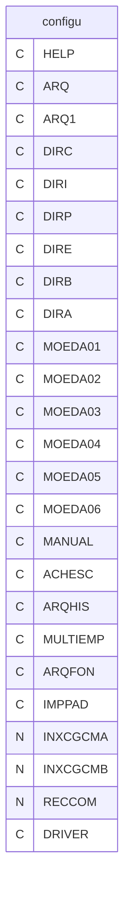
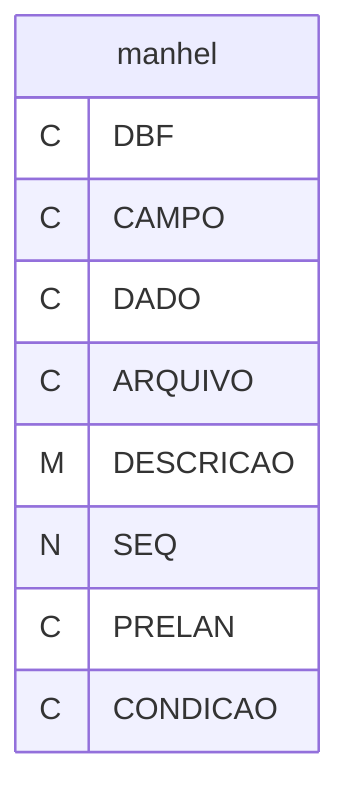

# Dicionario de Estruturas de Dados do Projeto
> Varredura automatica realizada em: 09/09/2026

## Tabela DBF: `configu`
> **Origem:** `configu` (Driver: DBFCDX)

| Campo | Tipo | Tam | Dec |
| :--- | :--- | :--- | :--- |
| HELP | C | 8 | 0 |
| ARQ | C | 8 | 0 |
| ARQ1 | C | 8 | 0 |
| DIRC | C | 60 | 0 |
| DIRI | C | 60 | 0 |
| DIRP | C | 60 | 0 |
| DIRE | C | 60 | 0 |
| DIRB | C | 60 | 0 |
| DIRA | C | 60 | 0 |
| MOEDA01 | C | 20 | 0 |
| MOEDA02 | C | 20 | 0 |
| MOEDA03 | C | 20 | 0 |
| MOEDA04 | C | 20 | 0 |
| MOEDA05 | C | 20 | 0 |
| MOEDA06 | C | 20 | 0 |
| MANUAL | C | 8 | 0 |
| ACHESC | C | 1 | 0 |
| ARQHIS | C | 8 | 0 |
| MULTIEMP | C | 1 | 0 |
| ARQFON | C | 8 | 0 |
| IMPPAD | C | 12 | 0 |
| INXCGCMA | N | 1 | 0 |
| INXCGCMB | N | 1 | 0 |
| RECCOM | N | 8 | 0 |
| DRIVER | C | 8 | 0 |

---
## Tabela DBF: `manemp`
> **Origem:** `manemp` (Driver: DBFCDX)

| Campo | Tipo | Tam | Dec |
| :--- | :--- | :--- | :--- |
| NUMERO | N | 5 | 0 |
| COGNOME | C | 12 | 0 |
| NOME | C | 40 | 0 |
| ENDERECO | C | 40 | 0 |
| BAIRRO | C | 30 | 0 |
| CIDADE | C | 35 | 0 |
| ESTADO | C | 2 | 0 |
| CEP | C | 9 | 0 |
| CXPOSTAL | C | 5 | 0 |
| DDD | C | 4 | 0 |
| TELEFONE | C | 9 | 0 |
| RAMAL | C | 4 | 0 |
| CONTATO | C | 22 | 0 |
| DDD1 | C | 4 | 0 |
| TELEFONE1 | C | 9 | 0 |
| RAMAL1 | C | 4 | 0 |
| CONTATO1 | C | 22 | 0 |
| DDDFAX | C | 4 | 0 |
| TELEFAX | C | 9 | 0 |
| PESSOA | C | 1 | 0 |
| CGC | C | 18 | 0 |
| INSCR | C | 15 | 0 |
| CUSFRETE | N | 10 | 2 |
| MEDIA | N | 3 | 0 |
| NIVEL1 | N | 2 | 0 |
| NIVEL2 | N | 2 | 0 |
| NIVEL3 | N | 2 | 0 |
| NIVEL4 | N | 2 | 0 |
| NIVEL5 | N | 2 | 0 |
| NIVEL6 | N | 2 | 0 |
| NIVEL7 | N | 2 | 0 |
| NIVEL8 | N | 2 | 0 |
| NIVEL9 | N | 2 | 0 |
| REDUZIDO | C | 1 | 0 |
| BATE | N | 1 | 0 |
| POSI | N | 1 | 0 |
| LANC | N | 1 | 0 |
| CO01 | N | 6 | 4 |
| CO02 | N | 6 | 4 |
| CO03 | N | 6 | 4 |
| CO04 | N | 6 | 4 |
| CO05 | N | 6 | 4 |
| CO06 | N | 6 | 4 |
| CO07 | N | 6 | 4 |
| CO08 | N | 6 | 4 |
| CO09 | N | 6 | 4 |
| CO10 | N | 6 | 4 |
| JUCESPC | C | 15 | 0 |
| JUCESPD | D | 8 | 0 |
| IMUNICI | C | 15 | 0 |
| PEDCOM | N | 8 | 0 |
| OBJLIN1 | C | 78 | 0 |
| OBJLIN2 | C | 78 | 0 |
| OBJLIN3 | C | 78 | 0 |
| OBJLIN4 | C | 78 | 0 |
| OBJLIN5 | C | 78 | 0 |
| DATAUB | D | 8 | 0 |
| DATAUP | D | 8 | 0 |
| DATAE | D | 8 | 0 |
| RECCOM | N | 8 | 0 |
| RNC | N | 8 | 0 |
| RACF | N | 8 | 0 |
| CRM | N | 8 | 0 |
| CONTMA01 | C | 80 | 0 |
| CONTMB01 | C | 80 | 0 |
| CONTMA01D | C | 80 | 0 |
| CONTMB01D | C | 80 | 0 |
| PERPIS | N | 5 | 2 |
| PERFIN | N | 5 | 2 |
| SITE | C | 30 | 0 |
| EMAIL | C | 30 | 0 |
| RESPF | C | 30 | 0 |
| CARGOR | C | 30 | 0 |
| CODEMPMIG | C | 2 | 0 |
| IMGCON | C | 8 | 0 |

**Indices vinculados:**
- Tag: `MANEMP` Expressao: `NUMERO`

```mermaid
erDiagram
    manemp {
        N NUMERO
        C COGNOME
        C NOME
        C ENDERECO
        C BAIRRO
        C CIDADE
        C ESTADO
        C CEP
        C CXPOSTAL
        C DDD
        C TELEFONE
        C RAMAL
        C CONTATO
        C DDD1
        C TELEFONE1
        C RAMAL1
        C CONTATO1
        C DDDFAX
        C TELEFAX
        C PESSOA
        C CGC
        C INSCR
        N CUSFRETE
        N MEDIA
        N NIVEL1
        N NIVEL2
        N NIVEL3
        N NIVEL4
        N NIVEL5
        N NIVEL6
        N NIVEL7
        N NIVEL8
        N NIVEL9
        C REDUZIDO
        N BATE
        N POSI
        N LANC
        N CO01
        N CO02
        N CO03
        N CO04
        N CO05
        N CO06
        N CO07
        N CO08
        N CO09
        N CO10
        C JUCESPC
        D JUCESPD
        C IMUNICI
        N PEDCOM
        C OBJLIN1
        C OBJLIN2
        C OBJLIN3
        C OBJLIN4
        C OBJLIN5
        D DATAUB
        D DATAUP
        D DATAE
        N RECCOM
        N RNC
        N RACF
        N CRM
        C CONTMA01
        C CONTMB01
        C CONTMA01D
        C CONTMB01D
        N PERPIS
        N PERFIN
        C SITE
        C EMAIL
        C RESPF
        C CARGOR
        C CODEMPMIG
        C IMGCON
    }
```

---
## Tabela DBF: `manhel`
> **Origem:** `manhel` (Driver: DBFCDX)

| Campo | Tipo | Tam | Dec |
| :--- | :--- | :--- | :--- |
| DBF | C | 8 | 0 |
| CAMPO | C | 10 | 0 |
| DADO | C | 40 | 0 |
| ARQUIVO | C | 12 | 0 |
| DESCRICAO | M | 10 | 0 |
| SEQ | N | 3 | 0 |
| PRELAN | C | 20 | 0 |
| CONDICAO | C | 20 | 0 |

**Indices vinculados:**
- Tag: `MANHEL` Expressao: `DBF+CAMPO`

---
