# Dicionario de Estruturas de Dados do Projeto
> Varredura automatica realizada em: 09/09/2026

## Tabela DBF: `agenda`
> **Origem:** `agenda` (Driver: DBFCDX)

| Campo | Tipo | Tam | Dec |
| :--- | :--- | :--- | :--- |
| CDDATA | D | 8 | 0 |
| OBS1 | C | 60 | 0 |
| OBS2 | C | 60 | 0 |
| OBS3 | C | 60 | 0 |
| OBS4 | C | 60 | 0 |
| OBS5 | C | 60 | 0 |
| OBS6 | C | 60 | 0 |
| OBS7 | C | 60 | 0 |
| OBS8 | C | 60 | 0 |

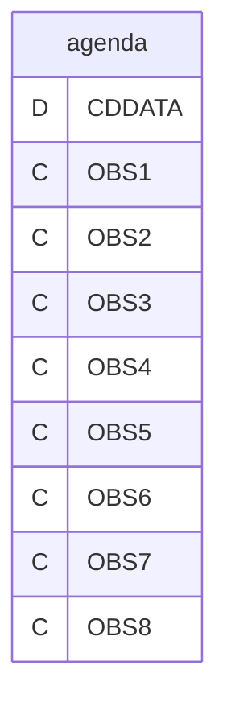

---
## Tabela DBF: `apucfo`
> **Origem:** `apucfo` (Driver: DBFCDX)

| Campo | Tipo | Tam | Dec |
| :--- | :--- | :--- | :--- |
| CFO | C | 3 | 0 |
| CFONEW | C | 4 | 0 |
| SUBCFO | C | 1 | 0 |
| DESCRICAO | C | 40 | 0 |
| CONTABIL | N | 12 | 2 |
| BASE | N | 12 | 2 |
| VALOR | N | 12 | 2 |
| ISENTA | N | 12 | 2 |
| OUTRA | N | 12 | 2 |
| OBS | N | 12 | 2 |

**Indices vinculados:**
- Tag: `APUCFO` Expressao: `CFO+SUBCFO`
- Tag: `APUCFO-2` Expressao: `CFONEW`

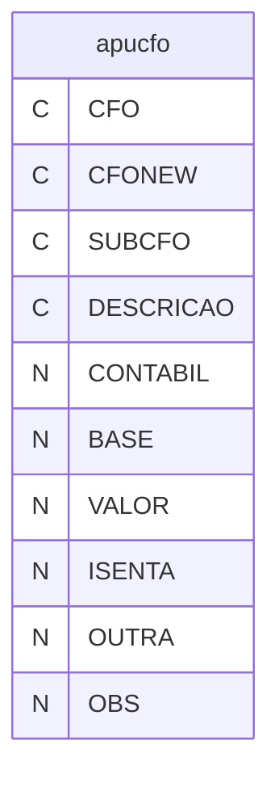

---
## Tabela DBF: `apucfouf`
> **Origem:** `apucfouf` (Driver: DBFCDX)

| Campo | Tipo | Tam | Dec |
| :--- | :--- | :--- | :--- |
| CFO | C | 3 | 0 |
| CFONEW | C | 4 | 0 |
| SUBCFO | C | 1 | 0 |
| UF | C | 2 | 0 |
| DESCRICAO | C | 40 | 0 |
| CONTABIL | N | 12 | 2 |
| BASE | N | 12 | 2 |
| VALOR | N | 12 | 2 |
| ISENTA | N | 12 | 2 |
| OUTRA | N | 12 | 2 |
| OBS | N | 12 | 2 |
| UFGIA | C | 2 | 0 |

**Indices vinculados:**
- Tag: `APUCFOU1` Expressao: `CFO+SUBCFO+UF`
- Tag: `APUCFOU2` Expressao: `CFONEW+UF`
- Tag: `APUCFOU3` Expressao: `CFONEW+UFGIA`

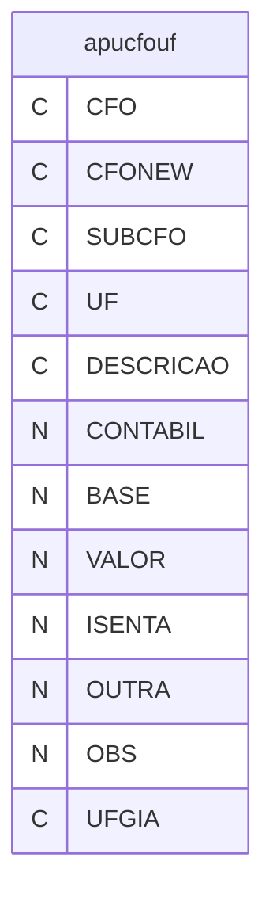

---
## Tabela DBF: `apucfozf`
> **Origem:** `apucfozf` (Driver: DBFCDX)

| Campo | Tipo | Tam | Dec |
| :--- | :--- | :--- | :--- |
| NF | N | 6 | 0 |
| DATA | D | 8 | 0 |
| VALOR | N | 12 | 2 |
| CNPJ | C | 18 | 0 |
| CODMUN | C | 5 | 0 |

**Indices vinculados:**
- Tag: `APUCFOZF` Expressao: `NF`

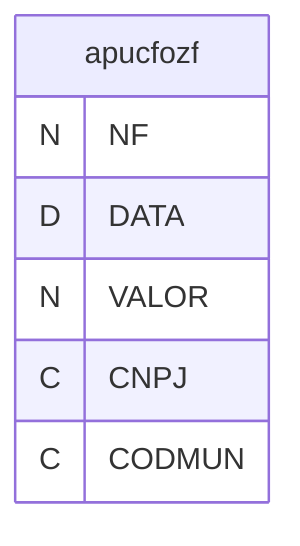

---
## Tabela DBF: `apuita`
> **Origem:** `apuita` (Driver: DBFCDX)

| Campo | Tipo | Tam | Dec |
| :--- | :--- | :--- | :--- |
| MES | N | 2 | 0 |
| ANO | N | 4 | 0 |
| SALDO | N | 18 | 2 |

**Indices vinculados:**
- Tag: `APUITA` Expressao: `STR(ANO,4)+STR(MES,2)`

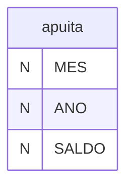

---
## Tabela DBF: `apura`
> **Origem:** `apura` (Driver: DBFCDX)

| Campo | Tipo | Tam | Dec |
| :--- | :--- | :--- | :--- |
| FORNECEDO | N | 5 | 0 |
| COGNOME | C | 12 | 0 |
| GRUPOEMP | C | 12 | 0 |
| PROD | N | 18 | 2 |
| FERRA | N | 18 | 2 |
| MOPROD | N | 18 | 2 |
| MOFERRA | N | 18 | 2 |
| SERV | N | 18 | 2 |
| TOTALMER | N | 18 | 2 |
| PORCENTO | N | 6 | 2 |
| TOTAL | N | 18 | 2 |
| MES | N | 2 | 0 |
| PROD2 | N | 18 | 2 |
| FERRA2 | N | 18 | 2 |
| MOPROD2 | N | 18 | 2 |
| MOFERRA2 | N | 18 | 2 |
| SERV2 | N | 18 | 2 |
| TOTDEV | N | 18 | 2 |
| TOTDEVNF | N | 18 | 2 |

**Indices vinculados:**
- Tag: `APURA-1` Expressao: `COGNOME`

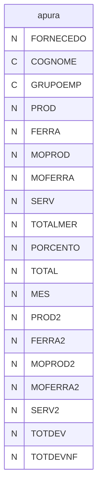

---
## Tabela DBF: `apura2`
> **Origem:** `apura2` (Driver: DBFCDX)

| Campo | Tipo | Tam | Dec |
| :--- | :--- | :--- | :--- |
| FORNECEDO | N | 5 | 0 |
| COGNOME | C | 12 | 0 |
| GRUPOEMP | C | 12 | 0 |
| PROD | N | 18 | 2 |
| FERRA | N | 18 | 2 |
| MOPROD | N | 18 | 2 |
| MOFERRA | N | 18 | 2 |
| SERV | N | 18 | 2 |
| TOTALMER | N | 18 | 2 |
| PORCENTO | N | 6 | 2 |
| TOTAL | N | 18 | 2 |
| MES | N | 2 | 0 |
| PROD2 | N | 18 | 2 |
| FERRA2 | N | 18 | 2 |
| MOPROD2 | N | 18 | 2 |
| MOFERRA2 | N | 18 | 2 |
| SERV2 | N | 18 | 2 |
| TOTDEV | N | 18 | 2 |
| TOTDEVNF | N | 18 | 2 |
| ABADEV | N | 18 | 2 |
| ABA | N | 18 | 2 |
| DEV | N | 18 | 2 |

**Indices vinculados:**
- Tag: `APURA2-1` Expressao: `TOTAL`
- Tag: `APURA2-2` Expressao: `GRUPOEMP`

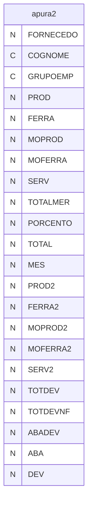

---
## Tabela DBF: `apura2c`
> **Origem:** `apura2c` (Driver: DBFCDX)

| Campo | Tipo | Tam | Dec |
| :--- | :--- | :--- | :--- |
| FORNECEDO | N | 5 | 0 |
| COGNOME | C | 12 | 0 |
| GRUPOEMP | C | 12 | 0 |
| PROD | N | 18 | 2 |
| FERRA | N | 18 | 2 |
| MOPROD | N | 18 | 2 |
| MOFERRA | N | 18 | 2 |
| SERV | N | 18 | 2 |
| TOTALMER | N | 18 | 2 |
| PORCENTO | N | 6 | 2 |
| TOTAL | N | 18 | 2 |
| MES | N | 2 | 0 |
| PROD2 | N | 18 | 2 |
| FERRA2 | N | 18 | 2 |
| MOPROD2 | N | 18 | 2 |
| MOFERRA2 | N | 18 | 2 |
| SERV2 | N | 18 | 2 |
| TOTDEV | N | 18 | 2 |
| TOTDEVNF | N | 18 | 2 |
| ABADEV | N | 18 | 2 |
| ABA | N | 18 | 2 |
| DEV | N | 18 | 2 |

**Indices vinculados:**
- Tag: `APURA2C1` Expressao: `TOTAL`

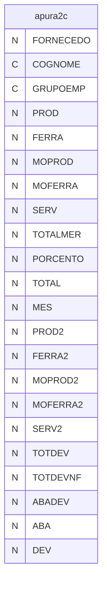

---
## Tabela DBF: `apura5`
> **Origem:** `apura5` (Driver: DBFCDX)

| Campo | Tipo | Tam | Dec |
| :--- | :--- | :--- | :--- |
| CLIENTE | N | 8 | 0 |
| COGCLI | C | 12 | 0 |
| GRUPO | C | 12 | 0 |
| CODIGO | C | 24 | 0 |
| NOME | C | 40 | 0 |
| ICM | N | 5 | 2 |
| PARTI | N | 8 | 2 |
| PPLAN | N | 10 | 4 |
| PPLANL | C | 1 | 0 |
| PPCAL | N | 10 | 4 |
| QTDDE | N | 12 | 0 |
| VALORMER | N | 12 | 2 |
| VALORTOT | N | 12 | 2 |
| PRECOM | N | 8 | 2 |
| PERCLI | N | 8 | 2 |
| PERLUC | N | 8 | 2 |
| VALLUC | N | 12 | 2 |
| DIFLUC | N | 8 | 2 |
| SUBGER | C | 2 | 0 |
| CLITOTPER | N | 8 | 2 |
| CLITOTVAL | N | 12 | 2 |

**Indices vinculados:**
- Tag: `APURA5-1` Expressao: `STR(CLIENTE,8)+CODIGO`
- Tag: `APURA5-2` Expressao: `STR(PERCLI,6,2)+CODIGO`
- Tag: `APURA5-3` Expressao: `CODIGO`
- Tag: `APURA5-4` Expressao: `PERLUC`
- Tag: `APURA5-5` Expressao: `DIFLUC`

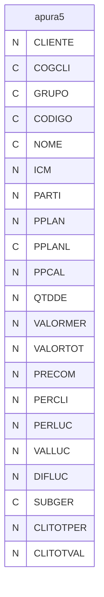

---
## Tabela DBF: `apura5a`
> **Origem:** `apura5a` (Driver: DBFCDX)

| Campo | Tipo | Tam | Dec |
| :--- | :--- | :--- | :--- |
| CLIENTE | N | 8 | 0 |
| COGCLI | C | 12 | 0 |
| VALORTOT | N | 12 | 2 |
| PERCLI | N | 6 | 2 |
| PERPRO | N | 6 | 2 |
| INTPERC | N | 8 | 0 |
| TGRUPO | C | 1 | 0 |
| LEXPORTA | L | 1 | 0 |
| VALOREXP | N | 12 | 2 |
| SUBGER | C | 2 | 0 |

**Indices vinculados:**
- Tag: `APURA5A1` Expressao: `CLIENTE`

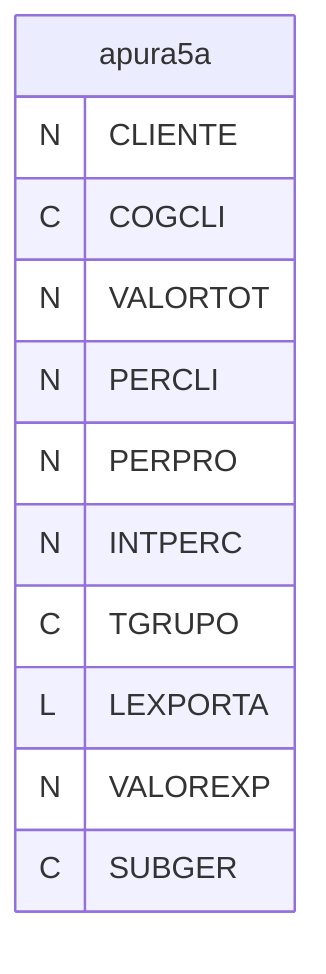

---
## Tabela DBF: `apura5b`
> **Origem:** `apura5b` (Driver: DBFCDX)

| Campo | Tipo | Tam | Dec |
| :--- | :--- | :--- | :--- |
| CLIENTE | N | 8 | 0 |
| COGCLI | C | 12 | 0 |
| CODIGO | C | 24 | 0 |
| NOME | C | 40 | 0 |
| PARTI | N | 6 | 2 |
| PPLAN | N | 9 | 4 |
| QTDDE | N | 12 | 0 |
| VALORMER | N | 12 | 2 |
| VALORTOT | N | 12 | 2 |
| PRECOM | N | 8 | 2 |
| PERCLI | N | 6 | 2 |
| INTCOM | N | 8 | 0 |
| INTCLI | N | 8 | 0 |
| JUNTO | C | 40 | 0 |

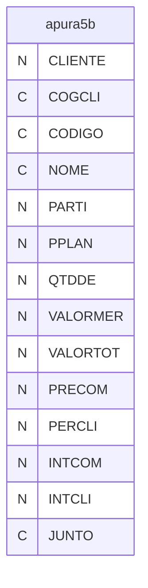

---
## Tabela DBF: `apura5d`
> **Origem:** `apura5d` (Driver: DBFCDX)

| Campo | Tipo | Tam | Dec |
| :--- | :--- | :--- | :--- |
| JUNTO | C | 40 | 0 |
| PERLUC | N | 6 | 2 |
| INTPER | N | 6 | 0 |

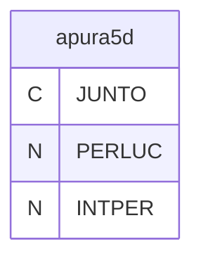

---
## Tabela DBF: `apuser`
> **Origem:** `apuser` (Driver: DBFCDX)

| Campo | Tipo | Tam | Dec |
| :--- | :--- | :--- | :--- |
| CLIENTE | N | 8 | 0 |
| ANO | N | 4 | 0 |
| MES | N | 2 | 0 |
| VALOR | N | 12 | 2 |
| SEMNOTA | C | 1 | 0 |

**Indices vinculados:**
- Tag: `APUSER` Expressao: `STR(CLIENTE,8)+STR(ANO,4)+STR(MES,2)`
- Tag: `APUSER-2` Expressao: `STR(ANO,4)+STR(MES,2)+STR(CLIENTE,8)`

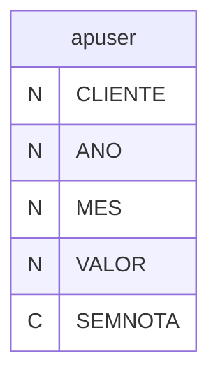

---
## Tabela DBF: `cnab400r`
> **Origem:** `cnab400r` (Driver: DBFCDX)

| Campo | Tipo | Tam | Dec |
| :--- | :--- | :--- | :--- |
| TITEMP | C | 25 | 0 |
| TITBAN | C | 20 | 0 |
| CODREG | C | 3 | 0 |
| INDOPE | C | 24 | 0 |
| CODCAR | C | 2 | 0 |
| CODOCO | C | 2 | 0 |
| DATAOCO | D | 8 | 0 |
| SEUNUM | C | 10 | 0 |
| DATAVEN | D | 8 | 0 |
| VALTIT | N | 12 | 2 |
| CODBCO | C | 3 | 0 |
| AGCBCO | C | 5 | 0 |
| ESPTIT | C | 2 | 0 |
| VALDEP | N | 12 | 2 |
| VALIOF | N | 12 | 2 |
| VALABT | N | 12 | 2 |
| VALDES | N | 12 | 2 |
| VALPAG | N | 12 | 2 |
| VALJUR | N | 12 | 2 |
| VALMUL | N | 12 | 2 |
| CODMOD | C | 1 | 0 |
| CREDATA | D | 8 | 0 |
| SEQARQ | N | 6 | 0 |
| VALDEPOUT | N | 12 | 2 |
| VALJURATR | N | 12 | 2 |
| MOTPRO | C | 1 | 0 |
| MOTREG01 | C | 2 | 0 |
| MOTREG02 | C | 2 | 0 |
| MOTREG03 | C | 2 | 0 |
| MOTREG04 | C | 2 | 0 |
| MOTREG05 | C | 2 | 0 |
| LIQDATA | D | 8 | 0 |

**Indices vinculados:**
- Tag: `CNAB400R` Expressao: `SEQARQ`

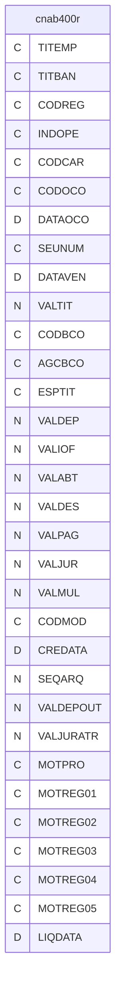

---
## Tabela DBF: `dipam`
> **Origem:** `dipam` (Driver: DBFCDX)

| Campo | Tipo | Tam | Dec |
| :--- | :--- | :--- | :--- |
| FORNECEDO | N | 8 | 0 |
| CODIGO | C | 24 | 0 |
| CLASSIPI | C | 14 | 0 |
| VALORMER | N | 12 | 2 |
| NOME | C | 40 | 0 |

**Indices vinculados:**
- Tag: `DIPAM` Expressao: `STR(FORNECEDO,8)+CLASSIPI+CODIGO`
- Tag: `DIPAM-2` Expressao: `STR(VALORMER,12,2)`
- Tag: `DIPAM-3` Expressao: `CLASSIPI+NOME`

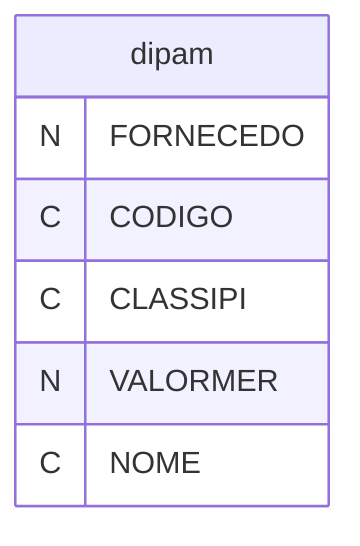

---
## Tabela DBF: `dipam2`
> **Origem:** `dipam2` (Driver: DBFCDX)

| Campo | Tipo | Tam | Dec |
| :--- | :--- | :--- | :--- |
| FORNECEDO | N | 8 | 0 |
| VALORMER | N | 12 | 2 |

**Indices vinculados:**
- Tag: `DIPAM2-1` Expressao: `VALORMER`

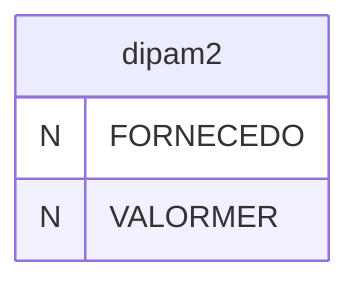

---
## Tabela DBF: `dipam3`
> **Origem:** `dipam3` (Driver: DBFCDX)

| Campo | Tipo | Tam | Dec |
| :--- | :--- | :--- | :--- |
| CLASSIPI | C | 14 | 0 |
| VALORMER | N | 12 | 2 |
| NOME | C | 40 | 0 |

**Indices vinculados:**
- Tag: `DIPAM3` Expressao: `VALORMER`

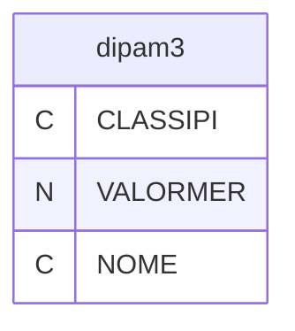

---
## Tabela DBF: `eti`
> **Origem:** `eti` (Driver: DBFCDX)

| Campo | Tipo | Tam | Dec |
| :--- | :--- | :--- | :--- |
| CODIGO | C | 12 | 0 |
| NOME | C | 100 | 0 |
| NOM2 | C | 10 | 0 |
| CAMADA | C | 50 | 0 |
| SALTO | C | 50 | 0 |
| ESPE | C | 50 | 0 |
| SUPE | C | 50 | 0 |
| CCM | N | 15 | 6 |
| ULTPRC | N | 15 | 6 |
| ULTUND | C | 2 | 0 |
| ULTDATA | D | 8 | 0 |
| REDICM | N | 6 | 2 |
| REV | N | 3 | 0 |
| REVDATA | D | 8 | 0 |
| VALOR | N | 15 | 6 |
| CUSTF | N | 15 | 6 |
| CODMW | C | 3 | 0 |
| LEADTIME | N | 2 | 0 |
| COGNOME | C | 10 | 0 |
| PISCON | C | 1 | 0 |
| NINTERNO | N | 8 | 0 |

**Indices vinculados:**
- Tag: `ETI` Expressao: `CODIGO`
- Tag: `ETI-2` Expressao: `NOME`

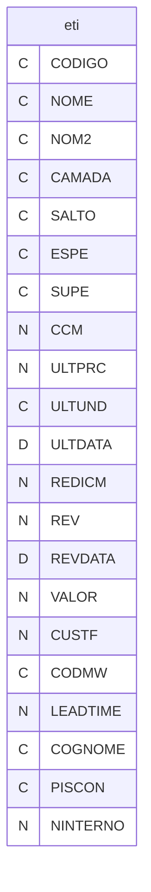

---
## Tabela DBF: `fo_chis`
> **Origem:** `fo_chis` (Driver: DBFCDX)

| Campo | Tipo | Tam | Dec |
| :--- | :--- | :--- | :--- |
| NUMERO | N | 8 | 0 |
| NOME | C | 40 | 0 |
| ADMISSAO | D | 8 | 0 |
| DEMISSAO | D | 8 | 0 |
| ARQUIVO | C | 20 | 0 |
| OBS | C | 40 | 0 |

**Indices vinculados:**
- Tag: `FO_CHIS` Expressao: `NUMERO`
- Tag: `FO_CHI2` Expressao: `NOME`

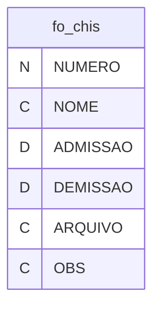

---
## Tabela DBF: `irrf`
> **Origem:** `irrf` (Driver: DBFCDX)

| Campo | Tipo | Tam | Dec |
| :--- | :--- | :--- | :--- |
| CPF | C | 18 | 0 |
| NOME | C | 40 | 0 |
| V401 | N | 12 | 2 |
| V402 | N | 12 | 2 |
| V403 | N | 12 | 2 |
| V404 | N | 12 | 2 |
| V405 | N | 12 | 2 |
| V501 | N | 12 | 2 |
| V502 | N | 12 | 2 |
| V503 | N | 12 | 2 |
| V504 | N | 12 | 2 |
| V605 | N | 12 | 2 |
| V606 | N | 12 | 2 |
| V611 | N | 12 | 2 |
| V602 | N | 12 | 2 |

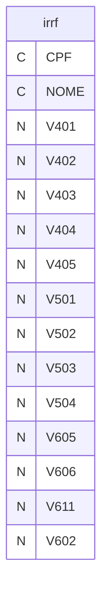

---
## Tabela DBF: `irrf01`
> **Origem:** `irrf01` (Driver: DBFCDX)

| Campo | Tipo | Tam | Dec |
| :--- | :--- | :--- | :--- |
| NUMERO | N | 8 | 0 |
| DARF | C | 4 | 0 |
| DOCUMENTO | C | 20 | 0 |
| ANO | N | 4 | 0 |
| CGC | C | 18 | 0 |
| PESSOA | C | 1 | 0 |
| NOME | C | 40 | 0 |
| ENDERECO | C | 40 | 0 |
| CIDADE | C | 30 | 0 |
| ESTADO | C | 2 | 0 |
| BAIRRO | C | 30 | 0 |
| CEP | C | 9 | 0 |
| DDD | C | 4 | 0 |
| TELEFONE | C | 9 | 0 |
| CONTATO | C | 12 | 0 |

```mermaid
erDiagram
    irrf01 {
        N NUMERO
        C DARF
        C DOCUMENTO
        N ANO
        C CGC
        C PESSOA
        C NOME
        C ENDERECO
        C CIDADE
        C ESTADO
        C BAIRRO
        C CEP
        C DDD
        C TELEFONE
        C CONTATO
    }
```

---
## Tabela DBF: `irrf02`
> **Origem:** `irrf02` (Driver: DBFCDX)

| Campo | Tipo | Tam | Dec |
| :--- | :--- | :--- | :--- |
| NUMERO | N | 8 | 0 |
| ITEM | N | 2 | 0 |
| MES | N | 4 | 0 |
| DARF | C | 4 | 0 |
| NATUREZA | C | 20 | 0 |
| RENDA | N | 12 | 2 |
| ALIQUOTA | N | 5 | 2 |
| IRRF | N | 8 | 2 |

```mermaid
erDiagram
    irrf02 {
        N NUMERO
        N ITEM
        N MES
        C DARF
        C NATUREZA
        N RENDA
        N ALIQUOTA
        N IRRF
    }
```

---
## Tabela DBF: `ma01`
> **Origem:** `ma01` (Driver: DBFCDX)

| Campo | Tipo | Tam | Dec |
| :--- | :--- | :--- | :--- |
| NUMERO | N | 5 | 0 |
| CNUMERO | C | 8 | 0 |
| COGNOME | C | 12 | 0 |
| NOME | C | 50 | 0 |
| ENDERECO | C | 40 | 0 |
| BAIRRO | C | 30 | 0 |
| CIDADE | C | 30 | 0 |
| ESTADO | C | 2 | 0 |
| CEP | C | 9 | 0 |
| CXPOSTAL | C | 5 | 0 |
| DDD | C | 2 | 0 |
| TELEFONE | C | 12 | 0 |
| RAMAL | C | 4 | 0 |
| CONTATO | C | 22 | 0 |
| DDD1 | C | 2 | 0 |
| TELEFONE1 | C | 12 | 0 |
| RAMAL1 | C | 4 | 0 |
| CONTATO1 | C | 22 | 0 |
| DDDFAX | C | 2 | 0 |
| TELEFAX | C | 12 | 0 |
| CGC | C | 18 | 0 |
| INSCR | C | 18 | 0 |
| VENDEDOR | C | 5 | 0 |
| CODIGO | C | 15 | 0 |
| TRANSPORTE | N | 4 | 0 |
| ZONA | C | 6 | 0 |
| ENDERECO2 | C | 40 | 0 |
| BAIRRO2 | C | 30 | 0 |
| CIDADE2 | C | 30 | 0 |
| ESTADO2 | C | 2 | 0 |
| CEP2 | C | 9 | 0 |
| DDD2 | C | 2 | 0 |
| TELEFONE2 | C | 12 | 0 |
| RAMAL2 | C | 4 | 0 |
| CONTATO2 | C | 22 | 0 |
| DDDFAX2 | C | 2 | 0 |
| TELEFAX2 | C | 12 | 0 |
| CONDPAG | C | 2 | 0 |
| TIPOCOB | C | 2 | 0 |
| CONCEITO | C | 10 | 0 |
| LIMITE | N | 1 | 0 |
| LIMITEACU | N | 1 | 0 |
| NOME3 | C | 50 | 0 |
| ENDERECO3 | C | 40 | 0 |
| BAIRRO3 | C | 30 | 0 |
| CIDADE3 | C | 30 | 0 |
| ESTADO3 | C | 2 | 0 |
| CEP3 | C | 9 | 0 |
| DDD3 | C | 2 | 0 |
| TELEFONE3 | C | 12 | 0 |
| RAMAL3 | C | 4 | 0 |
| CONTATO3 | C | 22 | 0 |
| DDDFAX3 | C | 3 | 0 |
| TELEFAX3 | C | 9 | 0 |
| CGC3 | C | 18 | 0 |
| INSCR3 | C | 16 | 0 |
| TOTDEV | N | 1 | 0 |
| RAMO | C | 2 | 0 |
| DTCAD | D | 8 | 0 |
| DT1COM | D | 8 | 0 |
| VL1CRU | N | 1 | 0 |
| VL1DOL | N | 1 | 0 |
| DTMCOM | D | 8 | 0 |
| VLMCRU | N | 1 | 0 |
| VLMDOL | N | 1 | 0 |
| DTUCOM | D | 8 | 0 |
| VLUCRU | N | 1 | 0 |
| VLUDOL | N | 1 | 0 |
| DIAATRA | N | 3 | 0 |
| VLACRU | N | 1 | 0 |
| VLADOL | N | 1 | 0 |
| PESSOA | C | 1 | 0 |
| CTACONTB | C | 11 | 0 |
| ZONAROT | C | 10 | 0 |
| ZONASEQ | N | 2 | 0 |
| KM | N | 5 | 0 |
| CONDCONC | C | 2 | 0 |
| GRUPOEMP | C | 12 | 0 |
| CODCONC | C | 2 | 0 |
| COMPRADOR | C | 5 | 0 |
| LUCRO | N | 1 | 0 |
| TABCOB | C | 2 | 0 |
| TABESP | C | 1 | 0 |
| DOCA | C | 14 | 0 |
| PLANTA | C | 3 | 0 |
| SISCO | C | 5 | 0 |
| MO02LISTA | N | 8 | 0 |
| CONTACRE | C | 11 | 0 |
| CONTADEB | C | 11 | 0 |
| CONTRCRE | N | 6 | 0 |
| CONTRDEB | N | 6 | 0 |
| TIPOGER | C | 2 | 0 |
| SUBGER | C | 2 | 0 |
| PADHIS | C | 3 | 0 |
| GERAAE | C | 1 | 0 |
| TEMICMS | C | 1 | 0 |
| TEMIPI | C | 1 | 0 |
| IMUNICIPI | C | 20 | 0 |
| CGCCOMP | C | 18 | 0 |
| CLICOMP | C | 15 | 0 |
| CLIENTR | C | 15 | 0 |
| ATIVO | C | 1 | 0 |
| BCOCOB | N | 3 | 0 |
| TEMPISFIN | C | 1 | 0 |
| EMAIL | C | 50 | 0 |
| CODIGOINT | C | 20 | 0 |
| CNAE | C | 7 | 0 |
| SUFRAMA | C | 9 | 0 |

**Indices vinculados:**
- Tag: `MA01-1` Expressao: `NUMERO`
- Tag: `MA01-2` Expressao: `COGNOME`
- Tag: `MA01-3` Expressao: `NOME`
- Tag: `MA01-4` Expressao: `CGC`
- Tag: `MA01-5` Expressao: `VENDEDOR+COGNOME`
- Tag: `MA01-6` Expressao: `SISCO`
- Tag: `MA01-7` Expressao: `CNUMERO`
- Tag: `MA01-8` Expressao: `CODIGOINT`

```mermaid
erDiagram
    ma01 {
        N NUMERO
        C CNUMERO
        C COGNOME
        C NOME
        C ENDERECO
        C BAIRRO
        C CIDADE
        C ESTADO
        C CEP
        C CXPOSTAL
        C DDD
        C TELEFONE
        C RAMAL
        C CONTATO
        C DDD1
        C TELEFONE1
        C RAMAL1
        C CONTATO1
        C DDDFAX
        C TELEFAX
        C CGC
        C INSCR
        C VENDEDOR
        C CODIGO
        N TRANSPORTE
        C ZONA
        C ENDERECO2
        C BAIRRO2
        C CIDADE2
        C ESTADO2
        C CEP2
        C DDD2
        C TELEFONE2
        C RAMAL2
        C CONTATO2
        C DDDFAX2
        C TELEFAX2
        C CONDPAG
        C TIPOCOB
        C CONCEITO
        N LIMITE
        N LIMITEACU
        C NOME3
        C ENDERECO3
        C BAIRRO3
        C CIDADE3
        C ESTADO3
        C CEP3
        C DDD3
        C TELEFONE3
        C RAMAL3
        C CONTATO3
        C DDDFAX3
        C TELEFAX3
        C CGC3
        C INSCR3
        N TOTDEV
        C RAMO
        D DTCAD
        D DT1COM
        N VL1CRU
        N VL1DOL
        D DTMCOM
        N VLMCRU
        N VLMDOL
        D DTUCOM
        N VLUCRU
        N VLUDOL
        N DIAATRA
        N VLACRU
        N VLADOL
        C PESSOA
        C CTACONTB
        C ZONAROT
        N ZONASEQ
        N KM
        C CONDCONC
        C GRUPOEMP
        C CODCONC
        C COMPRADOR
        N LUCRO
        C TABCOB
        C TABESP
        C DOCA
        C PLANTA
        C SISCO
        N MO02LISTA
        C CONTACRE
        C CONTADEB
        N CONTRCRE
        N CONTRDEB
        C TIPOGER
        C SUBGER
        C PADHIS
        C GERAAE
        C TEMICMS
        C TEMIPI
        C IMUNICIPI
        C CGCCOMP
        C CLICOMP
        C CLIENTR
        C ATIVO
        N BCOCOB
        C TEMPISFIN
        C EMAIL
        C CODIGOINT
        C CNAE
        C SUFRAMA
    }
```

---
## Tabela DBF: `mala`
> **Origem:** `mala` (Driver: DBFCDX)

| Campo | Tipo | Tam | Dec |
| :--- | :--- | :--- | :--- |
| NUMERO | N | 8 | 0 |
| NOME | C | 50 | 0 |
| ENDLOG | C | 12 | 0 |
| ENDRUA | C | 49 | 0 |
| ENDNUM | C | 5 | 0 |
| ENDERECO | C | 68 | 0 |
| BAIRRO | C | 30 | 0 |
| CIDADE | C | 35 | 0 |
| ESTADO | C | 2 | 0 |
| CEP | C | 9 | 0 |
| DDD | C | 4 | 0 |
| TELEFONE | C | 9 | 0 |
| RAMAL | C | 4 | 0 |
| DATACONTAT | D | 8 | 0 |
| CONTATO | C | 10 | 0 |
| IMPRIME | C | 1 | 0 |
| OBS | M | 10 | 0 |

```mermaid
erDiagram
    mala {
        N NUMERO
        C NOME
        C ENDLOG
        C ENDRUA
        C ENDNUM
        C ENDERECO
        C BAIRRO
        C CIDADE
        C ESTADO
        C CEP
        C DDD
        C TELEFONE
        C RAMAL
        D DATACONTAT
        C CONTATO
        C IMPRIME
        M OBS
    }
```

---
## Tabela DBF: `malaconf`
> **Origem:** `malaconf` (Driver: DBFCDX)

| Campo | Tipo | Tam | Dec |
| :--- | :--- | :--- | :--- |
| CODIGO | N | 8 | 0 |
| DESCRICAO | C | 60 | 0 |
| DBF | C | 8 | 0 |

```mermaid
erDiagram
    malaconf {
        N CODIGO
        C DESCRICAO
        C DBF
    }
```

---
## Tabela DBF: `manerr`
> **Origem:** `manerr` (Driver: DBFCDX)

| Campo | Tipo | Tam | Dec |
| :--- | :--- | :--- | :--- |
| USUARIO | C | 10 | 0 |
| DATA | D | 8 | 0 |
| HORA | C | 8 | 0 |
| ERRO | C | 40 | 0 |
| OPR | C | 3 | 0 |
| ARQUIVO | C | 8 | 0 |

```mermaid
erDiagram
    manerr {
        C USUARIO
        D DATA
        C HORA
        C ERRO
        C OPR
        C ARQUIVO
    }
```

---
## Tabela DBF: `manivers`
> **Origem:** `manivers` (Driver: DBFCDX)

| Campo | Tipo | Tam | Dec |
| :--- | :--- | :--- | :--- |
| NOME | C | 30 | 0 |
| APELIDO | C | 20 | 0 |
| DATA | D | 8 | 0 |
| FIRMA | C | 40 | 0 |

**Indices vinculados:**
- Tag: `MANIVER1` Expressao: `NOME`
- Tag: `MANIVER2` Expressao: `STR(DAY(DATA))+STR(MONTH(DATA))`

```mermaid
erDiagram
    manivers {
        C NOME
        C APELIDO
        D DATA
        C FIRMA
    }
```

---
## Tabela DBF: `mb01`
> **Origem:** `mb01` (Driver: DBFCDX)

| Campo | Tipo | Tam | Dec |
| :--- | :--- | :--- | :--- |
| COGNOME | C | 15 | 0 |
| NOME | C | 40 | 0 |
| ENDERECO | C | 40 | 0 |
| BAIRRO | C | 30 | 0 |
| CIDADE | C | 30 | 0 |
| ESTADO | C | 2 | 0 |
| CEP | C | 9 | 0 |
| DDD | C | 4 | 0 |
| TELEFONE | C | 9 | 0 |
| RAMAL | C | 4 | 0 |
| CONTATO | C | 22 | 0 |
| DDDFAX | C | 4 | 0 |
| TELEFAX | C | 9 | 0 |
| CGC | C | 18 | 0 |
| IESTADUAL | C | 16 | 0 |
| DDD1 | C | 4 | 0 |
| TELEFONE1 | C | 9 | 0 |
| RAMAL1 | C | 4 | 0 |
| CONTATO1 | C | 22 | 0 |
| NOMEMAT | C | 40 | 0 |
| PESSOA | C | 1 | 0 |
| CODMAT | C | 4 | 0 |
| CTACONTB | C | 11 | 0 |
| CONDPAG | C | 2 | 0 |
| VENDEDOR | C | 5 | 0 |
| BANCO | C | 3 | 0 |
| AGENCIA | C | 6 | 0 |
| CONTA | C | 8 | 0 |
| CONCEITO | C | 2 | 0 |
| QUALIFI | C | 12 | 0 |
| ZONA | C | 6 | 0 |
| TIPPAG | C | 2 | 0 |
| SITE | C | 30 | 0 |
| EMAIL | C | 30 | 0 |
| RESPF | C | 30 | 0 |
| CARGOR | C | 30 | 0 |
| CONTACRE | C | 11 | 0 |
| CONTADEB | C | 11 | 0 |
| CONTRCRE | N | 6 | 0 |
| CONTRDEB | N | 6 | 0 |
| DDDPCP | C | 4 | 0 |
| TELPCP | C | 9 | 0 |
| RAMPCP | C | 4 | 0 |
| CONPCP | C | 24 | 0 |
| DDDFAXPCP | C | 4 | 0 |
| TELFAXPCP | C | 9 | 0 |
| EMAILPCP | C | 50 | 0 |
| PADHIS | C | 3 | 0 |
| RESPPCP | C | 30 | 0 |
| CARGOPCP | C | 30 | 0 |
| NUMERO | N | 5 | 0 |
| IMUNICIPI | C | 20 | 0 |
| NFSESP | C | 5 | 0 |
| NFSCOD | C | 5 | 0 |
| NFSSER | C | 5 | 0 |
| SUBRAMO | C | 3 | 0 |
| CODIGOINT | C | 15 | 0 |
| CNAE | C | 7 | 0 |
| SUFRAMA | C | 9 | 0 |

**Indices vinculados:**
- Tag: `MB01-1` Expressao: `NUMERO`
- Tag: `MB01-2` Expressao: `COGNOME`
- Tag: `MB01-3` Expressao: `CGC`
- Tag: `MB01-4` Expressao: `NOME`

```mermaid
erDiagram
    mb01 {
        C COGNOME
        C NOME
        C ENDERECO
        C BAIRRO
        C CIDADE
        C ESTADO
        C CEP
        C DDD
        C TELEFONE
        C RAMAL
        C CONTATO
        C DDDFAX
        C TELEFAX
        C CGC
        C IESTADUAL
        C DDD1
        C TELEFONE1
        C RAMAL1
        C CONTATO1
        C NOMEMAT
        C PESSOA
        C CODMAT
        C CTACONTB
        C CONDPAG
        C VENDEDOR
        C BANCO
        C AGENCIA
        C CONTA
        C CONCEITO
        C QUALIFI
        C ZONA
        C TIPPAG
        C SITE
        C EMAIL
        C RESPF
        C CARGOR
        C CONTACRE
        C CONTADEB
        N CONTRCRE
        N CONTRDEB
        C DDDPCP
        C TELPCP
        C RAMPCP
        C CONPCP
        C DDDFAXPCP
        C TELFAXPCP
        C EMAILPCP
        C PADHIS
        C RESPPCP
        C CARGOPCP
        N NUMERO
        C IMUNICIPI
        C NFSESP
        C NFSCOD
        C NFSSER
        C SUBRAMO
        C CODIGOINT
        C CNAE
        C SUFRAMA
    }
```

---
## Tabela DBF: `mc01`
> **Origem:** `mc01` (Driver: DBFCDX)

| Campo | Tipo | Tam | Dec |
| :--- | :--- | :--- | :--- |
| NUMERO | C | 5 | 0 |
| COGNOME | C | 12 | 0 |
| NOME | C | 40 | 0 |
| ENDERECO | C | 40 | 0 |
| BAIRRO | C | 30 | 0 |
| CIDADE | C | 35 | 0 |
| ESTADO | C | 2 | 0 |
| CEP | C | 9 | 0 |
| DDD | C | 4 | 0 |
| TELEFONE | C | 9 | 0 |
| RAMAL | C | 4 | 0 |
| CONTATO | C | 22 | 0 |
| DDD1 | C | 4 | 0 |
| TELEFONE1 | C | 9 | 0 |
| RAMAL1 | C | 4 | 0 |
| CONTATO1 | C | 22 | 0 |
| CELULAR | C | 9 | 0 |
| DDDFAX | C | 4 | 0 |
| TELEFAX | C | 9 | 0 |
| CGC | C | 18 | 0 |
| IESTADUAL | C | 15 | 0 |
| OBSERVA | C | 30 | 0 |
| ZONA | C | 6 | 0 |
| DATANASC | D | 8 | 0 |
| PESSOA | C | 1 | 0 |
| PORCOMIS | N | 5 | 2 |
| COTA | N | 13 | 2 |
| BANCO | C | 3 | 0 |
| AGENCIA | C | 7 | 0 |
| CONTA | C | 12 | 0 |
| DDDBIP | C | 4 | 0 |
| TELBIP | C | 9 | 0 |
| CODBIP | C | 12 | 0 |
| VENGRU | C | 4 | 0 |
| VENHIE | C | 2 | 0 |

**Indices vinculados:**
- Tag: `MC01-1` Expressao: `NUMERO`

```mermaid
erDiagram
    mc01 {
        C NUMERO
        C COGNOME
        C NOME
        C ENDERECO
        C BAIRRO
        C CIDADE
        C ESTADO
        C CEP
        C DDD
        C TELEFONE
        C RAMAL
        C CONTATO
        C DDD1
        C TELEFONE1
        C RAMAL1
        C CONTATO1
        C CELULAR
        C DDDFAX
        C TELEFAX
        C CGC
        C IESTADUAL
        C OBSERVA
        C ZONA
        D DATANASC
        C PESSOA
        N PORCOMIS
        N COTA
        C BANCO
        C AGENCIA
        C CONTA
        C DDDBIP
        C TELBIP
        C CODBIP
        C VENGRU
        C VENHIE
    }
```

---
## Tabela DBF: `mc01r`
> **Origem:** `mc01r` (Driver: DBFCDX)

| Campo | Tipo | Tam | Dec |
| :--- | :--- | :--- | :--- |
| NUMERO | N | 5 | 0 |
| NOME | C | 40 | 0 |
| COGNOME | C | 12 | 0 |
| ENDERECO | C | 40 | 0 |
| BAIRRO | C | 30 | 0 |
| CIDADE | C | 35 | 0 |
| ESTADO | C | 2 | 0 |
| CEP | C | 9 | 0 |
| DDD | C | 4 | 0 |
| TELEFONE | C | 9 | 0 |
| RAMAL | C | 4 | 0 |
| DDDFAX | C | 4 | 0 |
| TELEFAX | C | 9 | 0 |
| CGC | C | 18 | 0 |
| IESTADUAL | C | 15 | 0 |
| CONTATO | C | 20 | 0 |
| DDD1 | C | 4 | 0 |
| TELEFONE1 | C | 9 | 0 |
| RAMAL1 | C | 4 | 0 |
| CONTATO1 | C | 20 | 0 |
| NOMEMAT | C | 20 | 0 |
| PESSOA | C | 1 | 0 |
| CODMAT | C | 4 | 0 |
| CTACONTB | C | 11 | 0 |
| CONDPAG | C | 2 | 0 |
| BANCO | N | 3 | 0 |
| AGENCIA | C | 6 | 0 |
| CONTA | C | 8 | 0 |
| CONCEITO | C | 2 | 0 |
| QUALIFI | C | 12 | 0 |
| TIPPAG | C | 2 | 0 |
| VENDEDOR | C | 5 | 0 |
| ZONA | C | 6 | 0 |
| EMAIL | C | 30 | 0 |
| SITE | C | 30 | 0 |
| RESPF | C | 30 | 0 |
| CARGOR | C | 30 | 0 |

```mermaid
erDiagram
    mc01r {
        N NUMERO
        C NOME
        C COGNOME
        C ENDERECO
        C BAIRRO
        C CIDADE
        C ESTADO
        C CEP
        C DDD
        C TELEFONE
        C RAMAL
        C DDDFAX
        C TELEFAX
        C CGC
        C IESTADUAL
        C CONTATO
        C DDD1
        C TELEFONE1
        C RAMAL1
        C CONTATO1
        C NOMEMAT
        C PESSOA
        C CODMAT
        C CTACONTB
        C CONDPAG
        N BANCO
        C AGENCIA
        C CONTA
        C CONCEITO
        C QUALIFI
        C TIPPAG
        C VENDEDOR
        C ZONA
        C EMAIL
        C SITE
        C RESPF
        C CARGOR
    }
```

---
## Tabela DBF: `mc02`
> **Origem:** `mc02` (Driver: DBFCDX)

| Campo | Tipo | Tam | Dec |
| :--- | :--- | :--- | :--- |
| NUMERO | C | 5 | 0 |
| COGNOME | C | 12 | 0 |
| NOME | C | 40 | 0 |
| ENDERECO | C | 40 | 0 |
| BAIRRO | C | 30 | 0 |
| CIDADE | C | 35 | 0 |
| ESTADO | C | 2 | 0 |
| CEP | C | 9 | 0 |
| DDD | C | 4 | 0 |
| TELEFONE | C | 9 | 0 |
| RAMAL | C | 4 | 0 |
| CONTATO | C | 22 | 0 |
| DDD1 | C | 4 | 0 |
| TELEFONE1 | C | 9 | 0 |
| RAMAL1 | C | 4 | 0 |
| CONTATO1 | C | 22 | 0 |
| CELULAR | C | 9 | 0 |
| DDDFAX | C | 4 | 0 |
| TELEFAX | C | 9 | 0 |
| CGC | C | 18 | 0 |
| IESTADUAL | C | 15 | 0 |
| OBSERVA | C | 30 | 0 |
| ZONA | C | 6 | 0 |
| DATANASC | D | 8 | 0 |
| PESSOA | C | 1 | 0 |
| PORCOMIS | N | 5 | 2 |
| COTA | N | 13 | 2 |
| BANCO | C | 3 | 0 |
| AGENCIA | C | 7 | 0 |
| CONTA | C | 12 | 0 |
| DDDBIP | C | 4 | 0 |
| TELBIP | C | 9 | 0 |
| CODBIP | C | 12 | 0 |
| VENGRU | C | 4 | 0 |
| VENHIE | C | 2 | 0 |

**Indices vinculados:**
- Tag: `MC02-1` Expressao: `NUMERO`

```mermaid
erDiagram
    mc02 {
        C NUMERO
        C COGNOME
        C NOME
        C ENDERECO
        C BAIRRO
        C CIDADE
        C ESTADO
        C CEP
        C DDD
        C TELEFONE
        C RAMAL
        C CONTATO
        C DDD1
        C TELEFONE1
        C RAMAL1
        C CONTATO1
        C CELULAR
        C DDDFAX
        C TELEFAX
        C CGC
        C IESTADUAL
        C OBSERVA
        C ZONA
        D DATANASC
        C PESSOA
        N PORCOMIS
        N COTA
        C BANCO
        C AGENCIA
        C CONTA
        C DDDBIP
        C TELBIP
        C CODBIP
        C VENGRU
        C VENHIE
    }
```

---
## Tabela DBF: `mc03`
> **Origem:** `mc03` (Driver: DBFCDX)

| Campo | Tipo | Tam | Dec |
| :--- | :--- | :--- | :--- |
| NUMERO | C | 5 | 0 |
| COGNOME | C | 12 | 0 |
| NOME | C | 40 | 0 |
| ENDERECO | C | 40 | 0 |
| BAIRRO | C | 30 | 0 |
| CIDADE | C | 35 | 0 |
| ESTADO | C | 2 | 0 |
| CEP | C | 9 | 0 |
| DDD | C | 4 | 0 |
| TELEFONE | C | 9 | 0 |
| RAMAL | C | 4 | 0 |
| CONTATO | C | 22 | 0 |
| DDD1 | C | 4 | 0 |
| TELEFONE1 | C | 9 | 0 |
| RAMAL1 | C | 4 | 0 |
| CONTATO1 | C | 22 | 0 |
| CELULAR | C | 9 | 0 |
| DDDFAX | C | 4 | 0 |
| TELEFAX | C | 9 | 0 |
| CGC | C | 18 | 0 |
| IESTADUAL | C | 15 | 0 |
| OBSERVA | C | 30 | 0 |
| ZONA | C | 6 | 0 |
| DATANASC | D | 8 | 0 |
| PESSOA | C | 1 | 0 |
| PORCOMIS | N | 5 | 2 |
| COTA | N | 13 | 2 |
| BANCO | C | 3 | 0 |
| AGENCIA | C | 7 | 0 |
| CONTA | C | 12 | 0 |
| DDDBIP | C | 4 | 0 |
| TELBIP | C | 9 | 0 |
| CODBIP | C | 12 | 0 |
| VENGRU | C | 4 | 0 |
| VENHIE | C | 2 | 0 |

**Indices vinculados:**
- Tag: `MC03-1` Expressao: `NUMERO`

```mermaid
erDiagram
    mc03 {
        C NUMERO
        C COGNOME
        C NOME
        C ENDERECO
        C BAIRRO
        C CIDADE
        C ESTADO
        C CEP
        C DDD
        C TELEFONE
        C RAMAL
        C CONTATO
        C DDD1
        C TELEFONE1
        C RAMAL1
        C CONTATO1
        C CELULAR
        C DDDFAX
        C TELEFAX
        C CGC
        C IESTADUAL
        C OBSERVA
        C ZONA
        D DATANASC
        C PESSOA
        N PORCOMIS
        N COTA
        C BANCO
        C AGENCIA
        C CONTA
        C DDDBIP
        C TELBIP
        C CODBIP
        C VENGRU
        C VENHIE
    }
```

---
## Tabela DBF: `mc04`
> **Origem:** `mc04` (Driver: DBFCDX)

| Campo | Tipo | Tam | Dec |
| :--- | :--- | :--- | :--- |
| NUMERO | C | 5 | 0 |
| COGNOME | C | 12 | 0 |
| NOME | C | 40 | 0 |
| ENDERECO | C | 40 | 0 |
| BAIRRO | C | 30 | 0 |
| CIDADE | C | 35 | 0 |
| ESTADO | C | 2 | 0 |
| CEP | C | 9 | 0 |
| DDD | C | 4 | 0 |
| TELEFONE | C | 9 | 0 |
| RAMAL | C | 4 | 0 |
| CONTATO | C | 22 | 0 |
| DDD1 | C | 4 | 0 |
| TELEFONE1 | C | 9 | 0 |
| RAMAL1 | C | 4 | 0 |
| CONTATO1 | C | 22 | 0 |
| CELULAR | C | 9 | 0 |
| DDDFAX | C | 4 | 0 |
| TELEFAX | C | 9 | 0 |
| CGC | C | 18 | 0 |
| IESTADUAL | C | 15 | 0 |
| OBSERVA | C | 30 | 0 |
| ZONA | C | 6 | 0 |
| DATANASC | D | 8 | 0 |
| PESSOA | C | 1 | 0 |
| PORCOMIS | N | 5 | 2 |
| COTA | N | 13 | 2 |
| BANCO | C | 3 | 0 |
| AGENCIA | C | 7 | 0 |
| CONTA | C | 12 | 0 |
| DDDBIP | C | 4 | 0 |
| TELBIP | C | 9 | 0 |
| CODBIP | C | 12 | 0 |
| VENGRU | C | 4 | 0 |
| VENHIE | C | 2 | 0 |

**Indices vinculados:**
- Tag: `MC04-1` Expressao: `NUMERO`

```mermaid
erDiagram
    mc04 {
        C NUMERO
        C COGNOME
        C NOME
        C ENDERECO
        C BAIRRO
        C CIDADE
        C ESTADO
        C CEP
        C DDD
        C TELEFONE
        C RAMAL
        C CONTATO
        C DDD1
        C TELEFONE1
        C RAMAL1
        C CONTATO1
        C CELULAR
        C DDDFAX
        C TELEFAX
        C CGC
        C IESTADUAL
        C OBSERVA
        C ZONA
        D DATANASC
        C PESSOA
        N PORCOMIS
        N COTA
        C BANCO
        C AGENCIA
        C CONTA
        C DDDBIP
        C TELBIP
        C CODBIP
        C VENGRU
        C VENHIE
    }
```

---
## Tabela DBF: `mc05`
> **Origem:** `mc05` (Driver: DBFCDX)

| Campo | Tipo | Tam | Dec |
| :--- | :--- | :--- | :--- |
| NUMERO | C | 5 | 0 |
| COGNOME | C | 12 | 0 |
| NOME | C | 40 | 0 |
| ENDERECO | C | 40 | 0 |
| BAIRRO | C | 30 | 0 |
| CIDADE | C | 35 | 0 |
| ESTADO | C | 2 | 0 |
| CEP | C | 9 | 0 |
| DDD | C | 2 | 0 |
| TELEFONE | C | 12 | 0 |
| RAMAL | C | 4 | 0 |
| CONTATO | C | 22 | 0 |
| DDD1 | C | 2 | 0 |
| TELEFONE1 | C | 12 | 0 |
| RAMAL1 | C | 4 | 0 |
| CONTATO1 | C | 22 | 0 |
| CELULAR | C | 9 | 0 |
| DDDFAX | C | 2 | 0 |
| TELEFAX | C | 12 | 0 |
| CGC | C | 18 | 0 |
| IESTADUAL | C | 15 | 0 |
| OBSERVA | C | 30 | 0 |
| ZONA | C | 6 | 0 |
| DATANASC | D | 8 | 0 |
| PESSOA | C | 1 | 0 |
| PORCOMIS | N | 5 | 2 |
| COTA | N | 13 | 2 |
| BANCO | C | 3 | 0 |
| AGENCIA | C | 7 | 0 |
| CONTA | C | 12 | 0 |
| DDDBIP | C | 2 | 0 |
| TELBIP | C | 12 | 0 |
| CODBIP | C | 12 | 0 |
| VENGRU | C | 4 | 0 |
| VENHIE | C | 2 | 0 |
| EMAIL | C | 50 | 0 |

**Indices vinculados:**
- Tag: `MC05-1` Expressao: `NUMERO`

```mermaid
erDiagram
    mc05 {
        C NUMERO
        C COGNOME
        C NOME
        C ENDERECO
        C BAIRRO
        C CIDADE
        C ESTADO
        C CEP
        C DDD
        C TELEFONE
        C RAMAL
        C CONTATO
        C DDD1
        C TELEFONE1
        C RAMAL1
        C CONTATO1
        C CELULAR
        C DDDFAX
        C TELEFAX
        C CGC
        C IESTADUAL
        C OBSERVA
        C ZONA
        D DATANASC
        C PESSOA
        N PORCOMIS
        N COTA
        C BANCO
        C AGENCIA
        C CONTA
        C DDDBIP
        C TELBIP
        C CODBIP
        C VENGRU
        C VENHIE
        C EMAIL
    }
```

---
## Tabela DBF: `mcarta`
> **Origem:** `mcarta` (Driver: DBFCDX)

| Campo | Tipo | Tam | Dec |
| :--- | :--- | :--- | :--- |
| ARQUIVO | C | 8 | 0 |
| NOME | C | 50 | 0 |
| SETUP | C | 20 | 0 |
| MARSUP | N | 2 | 0 |
| MARINF | N | 2 | 0 |
| MARDIR | N | 2 | 0 |
| MARESQ | N | 2 | 0 |
| MARCOL | N | 3 | 0 |
| MARLIN | N | 2 | 0 |

```mermaid
erDiagram
    mcarta {
        C ARQUIVO
        C NOME
        C SETUP
        N MARSUP
        N MARINF
        N MARDIR
        N MARESQ
        N MARCOL
        N MARLIN
    }
```

---
## Tabela DBF: `mcopia`
> **Origem:** `mcopia` (Driver: DBFCDX)

| Campo | Tipo | Tam | Dec |
| :--- | :--- | :--- | :--- |
| NOME | C | 6 | 0 |
| DIRETORIO | C | 50 | 0 |
| DESCRICAO | C | 50 | 0 |
| ARQ01 | C | 12 | 0 |
| ARQ02 | C | 12 | 0 |
| ARQ03 | C | 12 | 0 |
| ARQ04 | C | 12 | 0 |
| ARQ05 | C | 12 | 0 |
| ARQ06 | C | 12 | 0 |
| ARQ07 | C | 12 | 0 |
| ARQ08 | C | 12 | 0 |
| ARQ09 | C | 12 | 0 |
| ARQ10 | C | 12 | 0 |
| ARQ11 | C | 12 | 0 |
| ARQ12 | C | 12 | 0 |
| ARQ13 | C | 12 | 0 |
| ARQ14 | C | 12 | 0 |
| ARQ15 | C | 12 | 0 |
| ARQ16 | C | 12 | 0 |
| ARQ17 | C | 12 | 0 |
| ARQ18 | C | 12 | 0 |
| ARQ19 | C | 12 | 0 |
| ARQ20 | C | 12 | 0 |
| ARQ21 | C | 12 | 0 |
| ARQ22 | C | 12 | 0 |
| ARQ23 | C | 12 | 0 |
| ARQ24 | C | 12 | 0 |
| ARQ25 | C | 12 | 0 |
| ARQ26 | C | 12 | 0 |
| ARQ27 | C | 12 | 0 |
| ARQ28 | C | 12 | 0 |
| ARQ29 | C | 12 | 0 |
| ARQ30 | C | 12 | 0 |
| ARQ31 | C | 12 | 0 |
| ARQ32 | C | 12 | 0 |
| ARQ33 | C | 12 | 0 |
| ARQ34 | C | 12 | 0 |
| ARQ35 | C | 12 | 0 |
| ARQ36 | C | 12 | 0 |
| ARQ37 | C | 12 | 0 |
| ARQ38 | C | 12 | 0 |
| ARQ39 | C | 12 | 0 |
| ARQ40 | C | 12 | 0 |

```mermaid
erDiagram
    mcopia {
        C NOME
        C DIRETORIO
        C DESCRICAO
        C ARQ01
        C ARQ02
        C ARQ03
        C ARQ04
        C ARQ05
        C ARQ06
        C ARQ07
        C ARQ08
        C ARQ09
        C ARQ10
        C ARQ11
        C ARQ12
        C ARQ13
        C ARQ14
        C ARQ15
        C ARQ16
        C ARQ17
        C ARQ18
        C ARQ19
        C ARQ20
        C ARQ21
        C ARQ22
        C ARQ23
        C ARQ24
        C ARQ25
        C ARQ26
        C ARQ27
        C ARQ28
        C ARQ29
        C ARQ30
        C ARQ31
        C ARQ32
        C ARQ33
        C ARQ34
        C ARQ35
        C ARQ36
        C ARQ37
        C ARQ38
        C ARQ39
        C ARQ40
    }
```

---
## Tabela DBF: `md01`
> **Origem:** `md01` (Driver: DBFCDX)

| Campo | Tipo | Tam | Dec |
| :--- | :--- | :--- | :--- |
| CODIGO | C | 12 | 0 |
| NOME | C | 40 | 0 |
| TIPO | C | 1 | 0 |
| GRUPO | C | 2 | 0 |

**Indices vinculados:**
- Tag: `MD01-1` Expressao: `CODIGO`

```mermaid
erDiagram
    md01 {
        C CODIGO
        C NOME
        C TIPO
        C GRUPO
    }
```

---
## Tabela DBF: `md02`
> **Origem:** `md02` (Driver: DBFCDX)

| Campo | Tipo | Tam | Dec |
| :--- | :--- | :--- | :--- |
| CODIGO | C | 12 | 0 |
| CODIGO1 | C | 12 | 0 |
| DESCRICAO | C | 100 | 0 |
| DATA | D | 8 | 0 |
| VALOR | N | 12 | 4 |
| VARIACAO | N | 12 | 4 |
| ACUMULADO | N | 12 | 4 |
| ACUMULANU | N | 12 | 4 |
| ACUMUGERA | N | 12 | 4 |
| CODIGO2 | C | 12 | 0 |
| CODIGO3 | C | 12 | 0 |

**Indices vinculados:**
- Tag: `MD02-1` Expressao: `CODIGO+CODIGO1+DTOS(DATA)`
- Tag: `MD02-2` Expressao: `DATA`
- Tag: `MD02-3` Expressao: `CODIGO`
- Tag: `MD02-4` Expressao: `CODIGO+DTOS(DATA)`

```mermaid
erDiagram
    md02 {
        C CODIGO
        C CODIGO1
        C DESCRICAO
        D DATA
        N VALOR
        N VARIACAO
        N ACUMULADO
        N ACUMULANU
        N ACUMUGERA
        C CODIGO2
        C CODIGO3
    }
```

---
## Tabela DBF: `md03`
> **Origem:** `md03` (Driver: DBFCDX)

| Campo | Tipo | Tam | Dec |
| :--- | :--- | :--- | :--- |
| CODIGO | C | 2 | 0 |
| CLASSIFIC | C | 14 | 0 |
| DESCRICAO | C | 50 | 0 |
| ALIQUOTA | N | 2 | 0 |
| ALIQUOTAR | N | 5 | 2 |
| ALIQUOTAI | N | 5 | 2 |
| DSTA | C | 1 | 0 |
| DIPIPI | C | 1 | 0 |
| DIPICM | C | 1 | 0 |

**Indices vinculados:**
- Tag: `MD03-1` Expressao: `CODIGO`
- Tag: `MD03-2` Expressao: `CLASSIFIC`
- Tag: `MD03-3` Expressao: `CLASSIFIC+CODIGO`

```mermaid
erDiagram
    md03 {
        C CODIGO
        C CLASSIFIC
        C DESCRICAO
        N ALIQUOTA
        N ALIQUOTAR
        N ALIQUOTAI
        C DSTA
        C DIPIPI
        C DIPICM
    }
```

---
## Tabela DBF: `md06`
> **Origem:** `md06` (Driver: DBFCDX)

| Campo | Tipo | Tam | Dec |
| :--- | :--- | :--- | :--- |
| MES | N | 2 | 0 |
| ANO | N | 4 | 0 |
| FIN01 | N | 6 | 3 |
| FIN02 | N | 6 | 3 |
| FIN03 | N | 6 | 3 |
| FIN04 | N | 6 | 3 |
| FIN05 | N | 6 | 3 |
| FIN06 | N | 6 | 3 |
| FIN07 | N | 6 | 3 |
| FIN08 | N | 6 | 3 |
| FIN09 | N | 6 | 3 |
| FIN10 | N | 6 | 3 |
| FIN11 | N | 6 | 3 |
| FIN12 | N | 6 | 3 |
| FIN13 | N | 6 | 3 |
| FIN14 | N | 6 | 3 |
| FIN15 | N | 6 | 3 |
| FIN16 | N | 6 | 3 |
| FIN17 | N | 6 | 3 |
| FIN18 | N | 6 | 3 |
| FIN19 | N | 6 | 3 |
| FIN20 | N | 6 | 3 |
| FIN21 | N | 6 | 3 |
| FIN22 | N | 6 | 3 |
| FIN23 | N | 6 | 3 |
| FIN24 | N | 6 | 3 |
| FIN25 | N | 6 | 3 |
| FIN26 | N | 6 | 3 |
| FIN27 | N | 6 | 3 |
| FIN28 | N | 6 | 3 |
| FIN29 | N | 6 | 3 |
| FIN30 | N | 6 | 3 |
| FIN31 | N | 6 | 3 |
| FIN32 | N | 6 | 3 |
| FIN33 | N | 6 | 3 |
| FIN34 | N | 6 | 3 |
| FIN35 | N | 6 | 3 |
| FIN36 | N | 6 | 3 |
| FIN37 | N | 6 | 3 |
| FIN38 | N | 6 | 3 |
| FIN39 | N | 6 | 3 |
| FIN40 | N | 6 | 3 |
| FIN41 | N | 6 | 3 |
| FIN42 | N | 6 | 3 |
| FIN43 | N | 6 | 3 |
| FIN44 | N | 6 | 3 |
| FIN45 | N | 6 | 3 |
| FIN46 | N | 6 | 3 |
| FIN47 | N | 6 | 3 |
| FIN48 | N | 6 | 3 |
| FIN49 | N | 6 | 3 |
| FIN50 | N | 6 | 3 |
| FIN51 | N | 6 | 3 |
| FIN52 | N | 6 | 3 |
| FIN53 | N | 6 | 3 |
| FIN54 | N | 6 | 3 |
| FIN55 | N | 6 | 3 |
| FIN56 | N | 6 | 3 |
| FIN57 | N | 6 | 3 |
| FIN58 | N | 6 | 3 |
| FIN59 | N | 6 | 3 |
| FIN60 | N | 6 | 3 |

**Indices vinculados:**
- Tag: `MD06-1` Expressao: `STR(MES)+STR(ANO)`

```mermaid
erDiagram
    md06 {
        N MES
        N ANO
        N FIN01
        N FIN02
        N FIN03
        N FIN04
        N FIN05
        N FIN06
        N FIN07
        N FIN08
        N FIN09
        N FIN10
        N FIN11
        N FIN12
        N FIN13
        N FIN14
        N FIN15
        N FIN16
        N FIN17
        N FIN18
        N FIN19
        N FIN20
        N FIN21
        N FIN22
        N FIN23
        N FIN24
        N FIN25
        N FIN26
        N FIN27
        N FIN28
        N FIN29
        N FIN30
        N FIN31
        N FIN32
        N FIN33
        N FIN34
        N FIN35
        N FIN36
        N FIN37
        N FIN38
        N FIN39
        N FIN40
        N FIN41
        N FIN42
        N FIN43
        N FIN44
        N FIN45
        N FIN46
        N FIN47
        N FIN48
        N FIN49
        N FIN50
        N FIN51
        N FIN52
        N FIN53
        N FIN54
        N FIN55
        N FIN56
        N FIN57
        N FIN58
        N FIN59
        N FIN60
    }
```

---
## Tabela DBF: `md07`
> **Origem:** `md07` (Driver: DBFCDX)

| Campo | Tipo | Tam | Dec |
| :--- | :--- | :--- | :--- |
| UNIDADE | C | 3 | 0 |
| UNIDDES | C | 60 | 0 |
| UNIDDEC | C | 1 | 0 |

**Indices vinculados:**
- Tag: `MD07-1` Expressao: `UNIDADE`

```mermaid
erDiagram
    md07 {
        C UNIDADE
        C UNIDDES
        C UNIDDEC
    }
```

---
## Tabela DBF: `md08`
> **Origem:** `md08` (Driver: DBFCDX)

| Campo | Tipo | Tam | Dec |
| :--- | :--- | :--- | :--- |
| SEDEXT | C | 1 | 0 |
| KILO | N | 2 | 0 |
| RJ | N | 6 | 2 |
| SP | N | 6 | 2 |
| MT | N | 6 | 2 |
| RS | N | 6 | 2 |
| AC | N | 6 | 2 |
| AL | N | 6 | 2 |
| AP | N | 6 | 2 |
| AM | N | 6 | 2 |
| BA | N | 6 | 2 |
| CE | N | 6 | 2 |
| DF | N | 6 | 2 |
| ES | N | 6 | 2 |
| GO | N | 6 | 2 |
| MA | N | 6 | 2 |
| MG | N | 6 | 2 |
| MS | N | 6 | 2 |
| PA | N | 6 | 2 |
| PB | N | 6 | 2 |
| PR | N | 6 | 2 |
| PE | N | 6 | 2 |
| PI | N | 6 | 2 |
| RN | N | 6 | 2 |
| RR | N | 6 | 2 |
| RO | N | 6 | 2 |
| SC | N | 6 | 2 |
| SE | N | 6 | 2 |
| TO | N | 6 | 2 |
| XX | N | 6 | 2 |
| FN | N | 6 | 2 |

**Indices vinculados:**
- Tag: `MD08-1` Expressao: `SEDEXT+STR(KILO,2)`

```mermaid
erDiagram
    md08 {
        C SEDEXT
        N KILO
        N RJ
        N SP
        N MT
        N RS
        N AC
        N AL
        N AP
        N AM
        N BA
        N CE
        N DF
        N ES
        N GO
        N MA
        N MG
        N MS
        N PA
        N PB
        N PR
        N PE
        N PI
        N RN
        N RR
        N RO
        N SC
        N SE
        N TO
        N XX
        N FN
    }
```

---
## Tabela DBF: `md09`
> **Origem:** `md09` (Driver: DBFCDX)

| Campo | Tipo | Tam | Dec |
| :--- | :--- | :--- | :--- |
| CODIGO | C | 4 | 0 |
| DESCRICAO | C | 50 | 0 |

**Indices vinculados:**
- Tag: `MD09-1` Expressao: `CODIGO`

```mermaid
erDiagram
    md09 {
        C CODIGO
        C DESCRICAO
    }
```

---
## Tabela DBF: `mdchedev`
> **Origem:** `mdchedev` (Driver: DBFCDX)

| Campo | Tipo | Tam | Dec |
| :--- | :--- | :--- | :--- |
| CODIGO | C | 2 | 0 |
| NOME | C | 255 | 0 |

```mermaid
erDiagram
    mdchedev {
        C CODIGO
        C NOME
    }
```

---
## Tabela DBF: `mdmoeda`
> **Origem:** `mdmoeda` (Driver: DBFCDX)

| Campo | Tipo | Tam | Dec |
| :--- | :--- | :--- | :--- |
| CODIGO | C | 3 | 0 |
| DESCRICAO | C | 30 | 0 |
| PAIS | C | 3 | 0 |
| PAISNOME | C | 35 | 0 |
| SIMBOLO | C | 5 | 0 |

```mermaid
erDiagram
    mdmoeda {
        C CODIGO
        C DESCRICAO
        C PAIS
        C PAISNOME
        C SIMBOLO
    }
```

---
## Tabela DBF: `me01`
> **Origem:** `me01` (Driver: DBFCDX)

| Campo | Tipo | Tam | Dec |
| :--- | :--- | :--- | :--- |
| NUMERO | C | 4 | 0 |
| CONTABIL | C | 8 | 0 |
| NOME | C | 40 | 0 |
| LOCALIZA | C | 3 | 0 |
| NUMFAB | C | 8 | 0 |
| FABRICANTE | C | 20 | 0 |
| MODELO | C | 20 | 0 |
| MOTORCV | N | 7 | 3 |
| KWH | N | 7 | 3 |
| ESPECIFI | C | 100 | 0 |
| ESPECIFI1 | C | 100 | 0 |
| ESPECIFI2 | C | 100 | 0 |
| ESPECIFI3 | C | 100 | 0 |
| ESPECIFI4 | C | 100 | 0 |
| ESPECIFI5 | C | 100 | 0 |
| ESPECIFI6 | C | 100 | 0 |
| SETOR | C | 10 | 0 |
| TIPO | C | 1 | 0 |
| QTDE | N | 4 | 0 |
| ANO | N | 4 | 0 |
| NRFORNE | N | 5 | 0 |
| COGNOME | C | 12 | 0 |
| DATA | D | 8 | 0 |
| VALOR | N | 18 | 2 |
| TABELA | C | 12 | 0 |
| VALOR_CONV | N | 18 | 4 |
| MESES | N | 2 | 0 |
| OBSERVA | C | 40 | 0 |
| GRUPO | C | 3 | 0 |
| CHT | C | 1 | 0 |
| CHM | N | 6 | 2 |
| CHS | N | 6 | 2 |
| CH1 | N | 5 | 2 |
| CH2 | N | 5 | 2 |
| CH3 | N | 5 | 2 |
| CH4 | N | 5 | 2 |
| CH5 | N | 5 | 2 |
| CH6 | N | 5 | 2 |
| CH7 | N | 5 | 2 |
| CODMP01 | C | 12 | 0 |
| ATIVA | C | 1 | 0 |
| SETCOD | C | 1 | 0 |
| APUEFI | C | 1 | 0 |
| APLICACAO | C | 20 | 0 |
| SITUACAO | C | 1 | 0 |
| DATAATV | D | 8 | 0 |
| DATADES | D | 8 | 0 |
| DATADEV | D | 8 | 0 |
| DATAOUT | D | 8 | 0 |
| QTDEBASE | N | 12 | 0 |
| QTDESALDO | N | 12 | 0 |
| QTDEPED | N | 12 | 0 |
| QTDEURG | N | 12 | 0 |
| DATASALDO | D | 8 | 0 |
| DATAPED | D | 8 | 0 |
| DATAURG | D | 8 | 0 |
| QTDETOT | N | 12 | 0 |
| HRBAS | N | 9 | 2 |
| HRTOT | N | 9 | 2 |
| HRPRE | N | 9 | 2 |
| HRURG | N | 9 | 2 |
| HRSAL | N | 9 | 2 |
| DATHPED | D | 8 | 0 |
| DATHURG | D | 8 | 0 |
| DATHSAL | D | 8 | 0 |
| GRUPOUTL | C | 3 | 0 |
| PREVER | C | 1 | 0 |
| LUBRI | L | 1 | 0 |
| LUB01 | L | 1 | 0 |
| LUB02 | L | 1 | 0 |
| LUB03 | L | 1 | 0 |
| LUB04 | L | 1 | 0 |
| LUB05 | L | 1 | 0 |
| VDBAS | N | 12 | 0 |
| VDPRE | N | 12 | 0 |
| VDURG | N | 12 | 0 |
| VDDPRE | D | 8 | 0 |
| VDDURG | D | 8 | 0 |
| VDHBAS | N | 9 | 2 |
| VDHPRE | N | 9 | 2 |
| VDHURG | N | 9 | 2 |
| VDHDPRE | D | 8 | 0 |
| VDHDURG | D | 8 | 0 |
| PROPRIA | C | 1 | 0 |
| NAEMPRESA | C | 1 | 0 |
| VISUALNUM | N | 8 | 0 |
| VISUALNOM | C | 40 | 0 |
| VISUALOBS | C | 100 | 0 |
| MEDA | N | 12 | 3 |
| MEDB | N | 12 | 3 |
| MEDC | N | 12 | 3 |
| MEDD | N | 12 | 3 |
| MEDH | N | 12 | 3 |
| PESO | N | 12 | 3 |
| FEMEA | N | 8 | 0 |

**Indices vinculados:**
- Tag: `ME01-1` Expressao: `NUMERO`
- Tag: `ME01-2` Expressao: `NOME+MODELO`
- Tag: `ME01-3` Expressao: `CODMP01+NUMERO`

```mermaid
erDiagram
    me01 {
        C NUMERO
        C CONTABIL
        C NOME
        C LOCALIZA
        C NUMFAB
        C FABRICANTE
        C MODELO
        N MOTORCV
        N KWH
        C ESPECIFI
        C ESPECIFI1
        C ESPECIFI2
        C ESPECIFI3
        C ESPECIFI4
        C ESPECIFI5
        C ESPECIFI6
        C SETOR
        C TIPO
        N QTDE
        N ANO
        N NRFORNE
        C COGNOME
        D DATA
        N VALOR
        C TABELA
        N VALOR_CONV
        N MESES
        C OBSERVA
        C GRUPO
        C CHT
        N CHM
        N CHS
        N CH1
        N CH2
        N CH3
        N CH4
        N CH5
        N CH6
        N CH7
        C CODMP01
        C ATIVA
        C SETCOD
        C APUEFI
        C APLICACAO
        C SITUACAO
        D DATAATV
        D DATADES
        D DATADEV
        D DATAOUT
        N QTDEBASE
        N QTDESALDO
        N QTDEPED
        N QTDEURG
        D DATASALDO
        D DATAPED
        D DATAURG
        N QTDETOT
        N HRBAS
        N HRTOT
        N HRPRE
        N HRURG
        N HRSAL
        D DATHPED
        D DATHURG
        D DATHSAL
        C GRUPOUTL
        C PREVER
        L LUBRI
        L LUB01
        L LUB02
        L LUB03
        L LUB04
        L LUB05
        N VDBAS
        N VDPRE
        N VDURG
        D VDDPRE
        D VDDURG
        N VDHBAS
        N VDHPRE
        N VDHURG
        D VDHDPRE
        D VDHDURG
        C PROPRIA
        C NAEMPRESA
        N VISUALNUM
        C VISUALNOM
        C VISUALOBS
        N MEDA
        N MEDB
        N MEDC
        N MEDD
        N MEDH
        N PESO
        N FEMEA
    }
```

---
## Tabela DBF: `me01inv`
> **Origem:** `me01inv` (Driver: DBFCDX)

| Campo | Tipo | Tam | Dec |
| :--- | :--- | :--- | :--- |
| CONTABIL | C | 8 | 0 |
| NOME | C | 40 | 0 |
| NRFORNE | N | 5 | 0 |
| COGNOME | C | 12 | 0 |

**Indices vinculados:**
- Tag: `ME01INV` Expressao: `CONTABIL`

```mermaid
erDiagram
    me01inv {
        C CONTABIL
        C NOME
        N NRFORNE
        C COGNOME
    }
```

---
## Tabela DBF: `me02`
> **Origem:** `me02` (Driver: DBFCDX)

| Campo | Tipo | Tam | Dec |
| :--- | :--- | :--- | :--- |
| NUMERO | C | 4 | 0 |
| SEQ | N | 3 | 0 |
| CODMP01 | C | 12 | 0 |
| NOMMP01 | C | 30 | 0 |

**Indices vinculados:**
- Tag: `ME02-1` Expressao: `NUMERO+STR(SEQ,3)`
- Tag: `ME02-2` Expressao: `CODMP01+STR(SEQ,3)`

```mermaid
erDiagram
    me02 {
        C NUMERO
        N SEQ
        C CODMP01
        C NOMMP01
    }
```

---
## Tabela DBF: `me03`
> **Origem:** `me03` (Driver: DBFCDX)

| Campo | Tipo | Tam | Dec |
| :--- | :--- | :--- | :--- |
| NUMERO | C | 4 | 0 |
| DATA | D | 8 | 0 |
| ESTQINI | N | 5 | 2 |
| ESTQSAI | N | 5 | 2 |
| ESTQSAL | N | 5 | 2 |

**Indices vinculados:**
- Tag: `ME03-1` Expressao: `NUMERO+DTOS(DATA)`

```mermaid
erDiagram
    me03 {
        C NUMERO
        D DATA
        N ESTQINI
        N ESTQSAI
        N ESTQSAL
    }
```

---
## Tabela DBF: `me03a`
> **Origem:** `me03a` (Driver: DBFCDX)

| Campo | Tipo | Tam | Dec |
| :--- | :--- | :--- | :--- |
| NUMERO | C | 4 | 0 |
| OF | N | 8 | 2 |
| DATA | D | 8 | 0 |
| QTDDE | N | 12 | 5 |
| CODMP01 | C | 12 | 0 |
| CODRES | C | 1 | 0 |
| SEQ | N | 3 | 0 |
| SSQ | N | 3 | 0 |
| QTDPEC | N | 12 | 3 |

**Indices vinculados:**
- Tag: `ME03A-1` Expressao: `NUMERO+DTOS(DATA)+STR(OF,8,2)`

```mermaid
erDiagram
    me03a {
        C NUMERO
        N OF
        D DATA
        N QTDDE
        C CODMP01
        C CODRES
        N SEQ
        N SSQ
        N QTDPEC
    }
```

---
## Tabela DBF: `me04`
> **Origem:** `me04` (Driver: DBFCDX)

| Campo | Tipo | Tam | Dec |
| :--- | :--- | :--- | :--- |
| CODIGO | C | 8 | 0 |
| CADTIP | C | 1 | 0 |
| TIPO | C | 30 | 0 |
| MARCA | C | 20 | 0 |
| CAPACI | C | 30 | 0 |
| DIVI | C | 10 | 0 |
| NOMTIPO | C | 30 | 0 |
| CODTIPO | C | 3 | 0 |
| CODFOR | N | 8 | 0 |
| COGFOR | C | 12 | 0 |
| COMPRA | D | 8 | 0 |
| VALOR | N | 12 | 2 |
| SITUACAO | C | 1 | 0 |
| DATAUSO | D | 8 | 0 |
| DATAFIM | D | 8 | 0 |
| NORMA | C | 30 | 0 |
| APLIC | C | 30 | 0 |
| TIPCAL | C | 1 | 0 |
| CALIBRAR | N | 3 | 0 |
| ATIVO | C | 8 | 0 |
| ERROADM | C | 15 | 0 |
| OBS01 | C | 70 | 0 |
| OBS02 | C | 70 | 0 |
| OBS03 | C | 70 | 0 |
| MODELO | C | 20 | 0 |
| CALULT | D | 8 | 0 |
| CALPRO | D | 8 | 0 |
| DIME | C | 40 | 0 |
| MATERIAL | C | 30 | 0 |
| CARA | C | 50 | 0 |

```mermaid
erDiagram
    me04 {
        C CODIGO
        C CADTIP
        C TIPO
        C MARCA
        C CAPACI
        C DIVI
        C NOMTIPO
        C CODTIPO
        N CODFOR
        C COGFOR
        D COMPRA
        N VALOR
        C SITUACAO
        D DATAUSO
        D DATAFIM
        C NORMA
        C APLIC
        C TIPCAL
        N CALIBRAR
        C ATIVO
        C ERROADM
        C OBS01
        C OBS02
        C OBS03
        C MODELO
        D CALULT
        D CALPRO
        C DIME
        C MATERIAL
        C CARA
    }
```

---
## Tabela DBF: `me04c`
> **Origem:** `me04c` (Driver: DBFCDX)

| Campo | Tipo | Tam | Dec |
| :--- | :--- | :--- | :--- |
| OCC | N | 8 | 0 |
| CODIGO | C | 10 | 0 |
| DATA | D | 8 | 0 |
| CODFOR | N | 8 | 0 |
| COGFOR | C | 12 | 0 |
| CERTIFI | C | 10 | 0 |

```mermaid
erDiagram
    me04c {
        N OCC
        C CODIGO
        D DATA
        N CODFOR
        C COGFOR
        C CERTIFI
    }
```

---
## Tabela DBF: `me04ci`
> **Origem:** `me04ci` (Driver: DBFCDX)

| Campo | Tipo | Tam | Dec |
| :--- | :--- | :--- | :--- |
| OCC | N | 8 | 0 |
| ITEM | N | 3 | 0 |
| ESPECI | C | 30 | 0 |
| ENCTR | C | 10 | 0 |
| DESVIO | C | 10 | 0 |
| INCTOT | C | 10 | 0 |
| LAUDO | C | 2 | 0 |

```mermaid
erDiagram
    me04ci {
        N OCC
        N ITEM
        C ESPECI
        C ENCTR
        C DESVIO
        C INCTOT
        C LAUDO
    }
```

---
## Tabela DBF: `me04d`
> **Origem:** `me04d` (Driver: DBFCDX)

| Campo | Tipo | Tam | Dec |
| :--- | :--- | :--- | :--- |
| OCD | N | 8 | 0 |
| CODIGO | C | 24 | 0 |
| MOTIVO | C | 1 | 0 |
| OBS01 | C | 50 | 0 |
| OBS02 | C | 50 | 0 |
| OBS03 | C | 50 | 0 |
| INVALIDA | C | 1 | 0 |
| VERIFI | C | 20 | 0 |
| INSPECAO | C | 1 | 0 |
| CODIGOS | C | 40 | 0 |
| CLINOME | C | 40 | 0 |
| NF | C | 30 | 0 |
| ACLI01 | C | 50 | 0 |
| ACLI02 | C | 50 | 0 |
| INCIDE | C | 1 | 0 |
| FREQ1 | C | 20 | 0 |
| FREQ2 | C | 20 | 0 |
| ACOR01 | C | 50 | 0 |
| ACOR02 | C | 50 | 0 |
| ACOR03 | C | 50 | 0 |
| ACOR04 | C | 50 | 0 |
| RESPON | C | 30 | 0 |
| DATAOCD | D | 8 | 0 |

```mermaid
erDiagram
    me04d {
        N OCD
        C CODIGO
        C MOTIVO
        C OBS01
        C OBS02
        C OBS03
        C INVALIDA
        C VERIFI
        C INSPECAO
        C CODIGOS
        C CLINOME
        C NF
        C ACLI01
        C ACLI02
        C INCIDE
        C FREQ1
        C FREQ2
        C ACOR01
        C ACOR02
        C ACOR03
        C ACOR04
        C RESPON
        D DATAOCD
    }
```

---
## Tabela DBF: `me04r`
> **Origem:** `me04r` (Driver: DBFCDX)

| Campo | Tipo | Tam | Dec |
| :--- | :--- | :--- | :--- |
| NUMERO | N | 8 | 0 |
| CODIGO | C | 8 | 0 |
| CODOPER | N | 8 | 0 |
| SAIDA | D | 8 | 0 |
| HORASAI | N | 6 | 2 |
| DEVOLUCAO | D | 8 | 0 |
| HORADEV | N | 6 | 2 |
| SETOR | C | 3 | 0 |
| AREA | C | 2 | 0 |

```mermaid
erDiagram
    me04r {
        N NUMERO
        C CODIGO
        N CODOPER
        D SAIDA
        N HORASAI
        D DEVOLUCAO
        N HORADEV
        C SETOR
        C AREA
    }
```

---
## Tabela DBF: `me05`
> **Origem:** `me05` (Driver: DBFCDX)

| Campo | Tipo | Tam | Dec |
| :--- | :--- | :--- | :--- |
| DDD | C | 4 | 0 |
| NUMERO | C | 9 | 0 |
| TIPOT | C | 12 | 0 |
| HEXA | C | 12 | 0 |
| MODELO | C | 30 | 0 |

**Indices vinculados:**
- Tag: `ME05-1` Expressao: `DDD+NUMERO`

```mermaid
erDiagram
    me05 {
        C DDD
        C NUMERO
        C TIPOT
        C HEXA
        C MODELO
    }
```

---
## Tabela DBF: `metiq`
> **Origem:** `metiq` (Driver: DBFCDX)

| Campo | Tipo | Tam | Dec |
| :--- | :--- | :--- | :--- |
| CODIGO | C | 6 | 0 |
| NOME | C | 50 | 0 |
| LINHA1 | C | 75 | 0 |
| LINHA2 | C | 75 | 0 |
| LINHA3 | C | 75 | 0 |
| LINHA4 | C | 75 | 0 |
| LINHA5 | C | 75 | 0 |
| LINHA6 | C | 75 | 0 |
| LINHA7 | C | 75 | 0 |
| LINHA8 | C | 75 | 0 |
| NLIN | N | 1 | 0 |
| NCOL | N | 2 | 0 |
| NCAR | N | 1 | 0 |
| SETUP | C | 20 | 0 |
| SETUPFIM | C | 20 | 0 |
| ARQUIVO | C | 8 | 0 |
| INDICE | N | 2 | 0 |
| FILTRO | C | 50 | 0 |
| ARQGRA | C | 8 | 0 |
| PIND | C | 1 | 0 |
| NIND | N | 2 | 0 |
| TIPFIL | C | 1 | 0 |
| CONFIL | C | 50 | 0 |
| PFIL | C | 1 | 0 |

```mermaid
erDiagram
    metiq {
        C CODIGO
        C NOME
        C LINHA1
        C LINHA2
        C LINHA3
        C LINHA4
        C LINHA5
        C LINHA6
        C LINHA7
        C LINHA8
        N NLIN
        N NCOL
        N NCAR
        C SETUP
        C SETUPFIM
        C ARQUIVO
        N INDICE
        C FILTRO
        C ARQGRA
        C PIND
        N NIND
        C TIPFIL
        C CONFIL
        C PFIL
    }
```

---
## Tabela DBF: `mf01`
> **Origem:** `mf01` (Driver: DBFCDX)

| Campo | Tipo | Tam | Dec |
| :--- | :--- | :--- | :--- |
| NUMERO | C | 3 | 0 |
| DIGITO | C | 1 | 0 |
| COGNOME | C | 12 | 0 |
| NOME | C | 60 | 0 |
| BANCO | N | 3 | 0 |
| CARTEIRA | C | 3 | 0 |
| FLUXODIA | C | 1 | 0 |
| SITE | C | 50 | 0 |
| ISPB | C | 8 | 0 |
| CNPJ | C | 18 | 0 |
| NOMECOMP | C | 80 | 0 |

**Indices vinculados:**
- Tag: `MF01-1` Expressao: `NUMERO+DIGITO`
- Tag: `MF01-2` Expressao: `COGNOME`
- Tag: `MF01-3` Expressao: `NOME`
- Tag: `MF01-4` Expressao: `ISPB`

```mermaid
erDiagram
    mf01 {
        C NUMERO
        C DIGITO
        C COGNOME
        C NOME
        N BANCO
        C CARTEIRA
        C FLUXODIA
        C SITE
        C ISPB
        C CNPJ
        C NOMECOMP
    }
```

---
## Tabela DBF: `mf02`
> **Origem:** `mf02` (Driver: DBFCDX)

| Campo | Tipo | Tam | Dec |
| :--- | :--- | :--- | :--- |
| NUMERO | N | 5 | 0 |
| AGENCIA | C | 12 | 0 |
| CONTA | C | 12 | 0 |
| NRCONTA | N | 5 | 0 |
| NOMEAG | C | 40 | 0 |
| COGNAG | C | 12 | 0 |
| ENDERECO | C | 40 | 0 |
| BAIRRO | C | 30 | 0 |
| CIDADE | C | 30 | 0 |
| ESTADO | C | 2 | 0 |
| CEP | C | 9 | 0 |
| CXPOSTAL | C | 5 | 0 |
| DDD | C | 2 | 0 |
| TELEFONE | C | 12 | 0 |
| RAMAL | C | 4 | 0 |
| CONTATO | C | 22 | 0 |
| DDD1 | C | 2 | 0 |
| TELEFONE1 | C | 12 | 0 |
| RAMAL1 | C | 4 | 0 |
| CONTATO1 | C | 22 | 0 |
| DDDFAX | C | 4 | 0 |
| TELEFAX | C | 12 | 0 |
| PESSOA | C | 1 | 0 |
| CGC | C | 18 | 0 |
| INSCR | C | 16 | 0 |
| PRACA | C | 12 | 0 |
| TITULAR1 | C | 40 | 0 |
| TITULAR2 | C | 40 | 0 |
| TIPOCTA | C | 1 | 0 |
| XNDERECO1 | C | 40 | 0 |
| XAIRRO1 | C | 30 | 0 |
| XIDADE1 | C | 30 | 0 |
| XSTADO1 | C | 2 | 0 |
| XEP1 | C | 9 | 0 |
| XXPOSTAL1 | C | 5 | 0 |
| XDD1 | C | 2 | 0 |
| XELEFONE1 | C | 12 | 0 |
| XAMAL1 | C | 4 | 0 |
| XONTATO1 | C | 22 | 0 |
| XDF1 | C | 2 | 0 |
| XAX1 | C | 12 | 0 |
| XPF1 | C | 14 | 0 |
| XNDERECO2 | C | 40 | 0 |
| XAIRRO2 | C | 30 | 0 |
| XIDADE2 | C | 30 | 0 |
| XSTADO2 | C | 2 | 0 |
| XEP2 | C | 9 | 0 |
| XXPOSTAL2 | C | 5 | 0 |
| XDD2 | C | 2 | 0 |
| XELEFONE2 | C | 12 | 0 |
| XAMAL2 | C | 4 | 0 |
| XONTATO2 | C | 22 | 0 |
| XDF2 | C | 2 | 0 |
| XAX2 | C | 12 | 0 |
| XPF2 | C | 14 | 0 |
| DVAG | C | 1 | 0 |

**Indices vinculados:**
- Tag: `MF02-1` Expressao: `STR(NUMERO,5)+AGENCIA+CONTA`
- Tag: `MF02-2` Expressao: `NRCONTA`

```mermaid
erDiagram
    mf02 {
        N NUMERO
        C AGENCIA
        C CONTA
        N NRCONTA
        C NOMEAG
        C COGNAG
        C ENDERECO
        C BAIRRO
        C CIDADE
        C ESTADO
        C CEP
        C CXPOSTAL
        C DDD
        C TELEFONE
        C RAMAL
        C CONTATO
        C DDD1
        C TELEFONE1
        C RAMAL1
        C CONTATO1
        C DDDFAX
        C TELEFAX
        C PESSOA
        C CGC
        C INSCR
        C PRACA
        C TITULAR1
        C TITULAR2
        C TIPOCTA
        C XNDERECO1
        C XAIRRO1
        C XIDADE1
        C XSTADO1
        C XEP1
        C XXPOSTAL1
        C XDD1
        C XELEFONE1
        C XAMAL1
        C XONTATO1
        C XDF1
        C XAX1
        C XPF1
        C XNDERECO2
        C XAIRRO2
        C XIDADE2
        C XSTADO2
        C XEP2
        C XXPOSTAL2
        C XDD2
        C XELEFONE2
        C XAMAL2
        C XONTATO2
        C XDF2
        C XAX2
        C XPF2
        C DVAG
    }
```

---
## Tabela DBF: `mf03`
> **Origem:** `mf03` (Driver: DBFCDX)

| Campo | Tipo | Tam | Dec |
| :--- | :--- | :--- | :--- |
| NUMERO | N | 5 | 0 |
| AGENCIA | C | 12 | 0 |
| CONTA | C | 12 | 0 |
| TITULAR1 | C | 40 | 0 |
| TITULAR2 | C | 40 | 0 |
| TIPOCTA | C | 1 | 0 |
| ENDERECO1 | C | 40 | 0 |
| BAIRRO1 | C | 30 | 0 |
| CIDADE1 | C | 30 | 0 |
| ESTADO1 | C | 2 | 0 |
| CEP1 | C | 9 | 0 |
| CXPOSTAL1 | C | 5 | 0 |
| DDD1 | C | 4 | 0 |
| TELEFONE1 | C | 9 | 0 |
| RAMAL1 | C | 4 | 0 |
| CONTATO1 | C | 22 | 0 |
| DDF1 | C | 4 | 0 |
| FAX1 | C | 9 | 0 |
| CPF1 | C | 14 | 0 |
| ENDERECO2 | C | 40 | 0 |
| BAIRRO2 | C | 30 | 0 |
| CIDADE2 | C | 30 | 0 |
| ESTADO2 | C | 2 | 0 |
| CEP2 | C | 9 | 0 |
| CXPOSTAL2 | C | 5 | 0 |
| DDD2 | C | 4 | 0 |
| TELEFONE2 | C | 9 | 0 |
| RAMAL2 | C | 4 | 0 |
| CONTATO2 | C | 22 | 0 |
| DDF2 | C | 4 | 0 |
| FAX2 | C | 9 | 0 |
| CPF2 | C | 14 | 0 |

**Indices vinculados:**
- Tag: `MF03-1` Expressao: `STR(NUMERO,5)+AGENCIA+CONTA`

```mermaid
erDiagram
    mf03 {
        N NUMERO
        C AGENCIA
        C CONTA
        C TITULAR1
        C TITULAR2
        C TIPOCTA
        C ENDERECO1
        C BAIRRO1
        C CIDADE1
        C ESTADO1
        C CEP1
        C CXPOSTAL1
        C DDD1
        C TELEFONE1
        C RAMAL1
        C CONTATO1
        C DDF1
        C FAX1
        C CPF1
        C ENDERECO2
        C BAIRRO2
        C CIDADE2
        C ESTADO2
        C CEP2
        C CXPOSTAL2
        C DDD2
        C TELEFONE2
        C RAMAL2
        C CONTATO2
        C DDF2
        C FAX2
        C CPF2
    }
```

---
## Tabela DBF: `mf04`
> **Origem:** `mf04` (Driver: DBFCDX)

| Campo | Tipo | Tam | Dec |
| :--- | :--- | :--- | :--- |
| NUMERO | N | 5 | 0 |
| PRACA | C | 12 | 0 |
| NOMEPR | C | 40 | 0 |
| CIDPRA | C | 30 | 0 |
| ESTPRA | C | 2 | 0 |
| AREA1 | C | 70 | 0 |
| AREA2 | C | 70 | 0 |
| AREA3 | C | 70 | 0 |
| AREA4 | C | 70 | 0 |
| AREA5 | C | 70 | 0 |
| FERIADO | D | 8 | 0 |
| CEPPRA | C | 9 | 0 |

**Indices vinculados:**
- Tag: `MF04-1` Expressao: `STR(NUMERO,5)+PRACA`

```mermaid
erDiagram
    mf04 {
        N NUMERO
        C PRACA
        C NOMEPR
        C CIDPRA
        C ESTPRA
        C AREA1
        C AREA2
        C AREA3
        C AREA4
        C AREA5
        D FERIADO
        C CEPPRA
    }
```

---
## Tabela DBF: `mf05`
> **Origem:** `mf05` (Driver: DBFCDX)

| Campo | Tipo | Tam | Dec |
| :--- | :--- | :--- | :--- |
| CARTAO | C | 20 | 0 |
| NOME | C | 20 | 0 |
| VENC | N | 2 | 0 |
| LIMITENAC | N | 12 | 2 |
| LIMITEINT | N | 12 | 2 |
| TITULAR1 | C | 40 | 0 |
| TITULAR2 | C | 40 | 0 |
| TIPOCTA | C | 1 | 0 |
| ENDERECO1 | C | 40 | 0 |
| BAIRRO1 | C | 30 | 0 |
| CIDADE1 | C | 35 | 0 |
| ESTADO1 | C | 2 | 0 |
| CEP1 | C | 9 | 0 |
| CXPOSTAL1 | C | 5 | 0 |
| DDD1 | C | 4 | 0 |
| TELEFONE1 | C | 9 | 0 |
| RAMAL1 | C | 4 | 0 |
| CONTATO1 | C | 22 | 0 |
| DDF1 | C | 4 | 0 |
| FAX1 | C | 9 | 0 |
| CPF1 | C | 14 | 0 |
| ENDERECO2 | C | 40 | 0 |
| BAIRRO2 | C | 30 | 0 |
| CIDADE2 | C | 35 | 0 |
| ESTADO2 | C | 2 | 0 |
| CEP2 | C | 9 | 0 |
| CXPOSTAL2 | C | 5 | 0 |
| DDD2 | C | 4 | 0 |
| TELEFONE2 | C | 9 | 0 |
| RAMAL2 | C | 4 | 0 |
| CONTATO2 | C | 22 | 0 |
| DDF2 | C | 4 | 0 |
| FAX2 | C | 9 | 0 |
| CPF2 | C | 14 | 0 |

**Indices vinculados:**
- Tag: `MF05-1` Expressao: `CARTAO`

```mermaid
erDiagram
    mf05 {
        C CARTAO
        C NOME
        N VENC
        N LIMITENAC
        N LIMITEINT
        C TITULAR1
        C TITULAR2
        C TIPOCTA
        C ENDERECO1
        C BAIRRO1
        C CIDADE1
        C ESTADO1
        C CEP1
        C CXPOSTAL1
        C DDD1
        C TELEFONE1
        C RAMAL1
        C CONTATO1
        C DDF1
        C FAX1
        C CPF1
        C ENDERECO2
        C BAIRRO2
        C CIDADE2
        C ESTADO2
        C CEP2
        C CXPOSTAL2
        C DDD2
        C TELEFONE2
        C RAMAL2
        C CONTATO2
        C DDF2
        C FAX2
        C CPF2
    }
```

---
## Tabela DBF: `mf06`
> **Origem:** `mf06` (Driver: DBFCDX)

| Campo | Tipo | Tam | Dec |
| :--- | :--- | :--- | :--- |
| CONTA | C | 12 | 0 |
| NOME | C | 40 | 0 |

**Indices vinculados:**
- Tag: `MF06-1` Expressao: `CONTA`

```mermaid
erDiagram
    mf06 {
        C CONTA
        C NOME
    }
```

---
## Tabela DBF: `mg01`
> **Origem:** `mg01` (Driver: DBFCDX)

| Campo | Tipo | Tam | Dec |
| :--- | :--- | :--- | :--- |
| NUMERO | C | 5 | 0 |
| COGNOME | C | 12 | 0 |
| NOME | C | 40 | 0 |
| ENDERECO | C | 40 | 0 |
| BAIRRO | C | 30 | 0 |
| CIDADE | C | 35 | 0 |
| ESTADO | C | 2 | 0 |
| CEP | C | 9 | 0 |
| CXPOSTAL | C | 5 | 0 |
| DDDTLX | C | 4 | 0 |
| TELEX | C | 6 | 0 |
| DDD | C | 4 | 0 |
| TELEFONE | C | 9 | 0 |
| RAMAL | C | 4 | 0 |
| CONTATO | C | 22 | 0 |
| DDD1 | C | 4 | 0 |
| TELEFONE1 | C | 9 | 0 |
| RAMAL1 | C | 4 | 0 |
| CONTATO1 | C | 22 | 0 |
| DDDFAX | C | 4 | 0 |
| TELEFAX | C | 9 | 0 |
| CGC | C | 18 | 0 |
| INSCR | C | 15 | 0 |
| JUCESP | C | 15 | 0 |
| OBSERVA | C | 30 | 0 |
| CODMAT | C | 5 | 0 |
| MATERIAL | C | 5 | 0 |
| NOMEMAT | C | 40 | 0 |
| ZONA | N | 5 | 2 |
| CLICAD | C | 1 | 0 |
| CLIPRIN | C | 1 | 0 |
| PESSOA | C | 1 | 0 |
| CHAPA | C | 8 | 0 |
| MOTORISTA | C | 30 | 0 |
| IMUNI | C | 15 | 0 |
| ADMITIDO | D | 8 | 0 |
| DEMITIDO | D | 8 | 0 |
| DEPENDE | N | 3 | 0 |
| DEPTO | N | 3 | 0 |
| SETOR | N | 3 | 0 |
| SECAO | N | 3 | 0 |
| SALJAN | N | 18 | 2 |
| SALFEV | N | 18 | 2 |
| SALMAR | N | 18 | 2 |
| SALABR | N | 18 | 2 |
| SALMAI | N | 18 | 2 |
| SALJUN | N | 18 | 2 |
| SALJUL | N | 18 | 2 |
| SALAGO | N | 18 | 2 |
| SALSET | N | 18 | 2 |
| SALOUT | N | 18 | 2 |
| SALNOV | N | 18 | 2 |
| SALDEZ | N | 18 | 2 |
| HRSEM | N | 5 | 2 |
| TIPO | C | 1 | 0 |
| FUNCAO | N | 4 | 0 |
| TIPSER | C | 20 | 0 |
| GRUPO | C | 50 | 0 |
| SITUACAO | C | 1 | 0 |

**Indices vinculados:**
- Tag: `MG01-1` Expressao: `NUMERO`
- Tag: `MG01-2` Expressao: `COGNOME`
- Tag: `MG01-3` Expressao: `CGC`

```mermaid
erDiagram
    mg01 {
        C NUMERO
        C COGNOME
        C NOME
        C ENDERECO
        C BAIRRO
        C CIDADE
        C ESTADO
        C CEP
        C CXPOSTAL
        C DDDTLX
        C TELEX
        C DDD
        C TELEFONE
        C RAMAL
        C CONTATO
        C DDD1
        C TELEFONE1
        C RAMAL1
        C CONTATO1
        C DDDFAX
        C TELEFAX
        C CGC
        C INSCR
        C JUCESP
        C OBSERVA
        C CODMAT
        C MATERIAL
        C NOMEMAT
        N ZONA
        C CLICAD
        C CLIPRIN
        C PESSOA
        C CHAPA
        C MOTORISTA
        C IMUNI
        D ADMITIDO
        D DEMITIDO
        N DEPENDE
        N DEPTO
        N SETOR
        N SECAO
        N SALJAN
        N SALFEV
        N SALMAR
        N SALABR
        N SALMAI
        N SALJUN
        N SALJUL
        N SALAGO
        N SALSET
        N SALOUT
        N SALNOV
        N SALDEZ
        N HRSEM
        C TIPO
        N FUNCAO
        C TIPSER
        C GRUPO
        C SITUACAO
    }
```

---
## Tabela DBF: `mg02`
> **Origem:** `mg02` (Driver: DBFCDX)

| Campo | Tipo | Tam | Dec |
| :--- | :--- | :--- | :--- |
| NUMERO | C | 5 | 0 |
| CHAPAF | C | 8 | 0 |
| MOTORF | C | 30 | 0 |
| OBS1 | C | 40 | 0 |
| CODEMP | C | 12 | 0 |
| CNH | C | 9 | 0 |
| CATCNH | C | 1 | 0 |
| VALCNH | D | 8 | 0 |
| EXPCNH | D | 8 | 0 |
| KMINI | N | 8 | 3 |

**Indices vinculados:**
- Tag: `MG02-1` Expressao: `NUMERO+CODEMP`

```mermaid
erDiagram
    mg02 {
        C NUMERO
        C CHAPAF
        C MOTORF
        C OBS1
        C CODEMP
        C CNH
        C CATCNH
        D VALCNH
        D EXPCNH
        N KMINI
    }
```

---
## Tabela DBF: `mg03`
> **Origem:** `mg03` (Driver: DBFCDX)

| Campo | Tipo | Tam | Dec |
| :--- | :--- | :--- | :--- |
| NUMERO | C | 5 | 0 |
| CODEMP | C | 12 | 0 |
| CODFRO | C | 12 | 0 |
| CHAPAF | C | 8 | 0 |
| PROFRO | C | 10 | 0 |
| ANOMOD | N | 4 | 0 |
| ANOFRO | N | 4 | 0 |
| KMINI | N | 8 | 3 |
| CHASSI | C | 22 | 0 |
| TIPFRO | C | 20 | 0 |
| MARFRO | C | 20 | 0 |
| MODFRO | C | 25 | 0 |
| COMFRO | C | 12 | 0 |
| RENAVAM | C | 9 | 0 |
| CATFRO | C | 20 | 0 |
| ESTFRO | C | 2 | 0 |
| CIDIPVA | C | 4 | 0 |
| CIDFRO | C | 35 | 0 |
| ESPFRO | C | 12 | 0 |
| CARFRO | C | 20 | 0 |
| CODIPVA | N | 7 | 0 |
| NOMPRO | C | 40 | 0 |
| ENDPRO | C | 40 | 0 |
| BAIPRO | C | 30 | 0 |
| CIDPRO | C | 35 | 0 |
| ESTPRO | C | 2 | 0 |
| PESSOA | C | 1 | 0 |
| CGC | C | 18 | 0 |
| CEPPRO | C | 9 | 0 |

**Indices vinculados:**
- Tag: `MG03-1` Expressao: `NUMERO+CODFRO`

```mermaid
erDiagram
    mg03 {
        C NUMERO
        C CODEMP
        C CODFRO
        C CHAPAF
        C PROFRO
        N ANOMOD
        N ANOFRO
        N KMINI
        C CHASSI
        C TIPFRO
        C MARFRO
        C MODFRO
        C COMFRO
        C RENAVAM
        C CATFRO
        C ESTFRO
        C CIDIPVA
        C CIDFRO
        C ESPFRO
        C CARFRO
        N CODIPVA
        C NOMPRO
        C ENDPRO
        C BAIPRO
        C CIDPRO
        C ESTPRO
        C PESSOA
        C CGC
        C CEPPRO
    }
```

---
## Tabela DBF: `mg04`
> **Origem:** `mg04` (Driver: DBFCDX)

| Campo | Tipo | Tam | Dec |
| :--- | :--- | :--- | :--- |
| COD_IPVA | N | 7 | 0 |
| TIPO | N | 1 | 0 |
| FAIXA_IPVA | N | 2 | 0 |
| LINHA | N | 4 | 0 |
| COD_REF | N | 4 | 0 |
| MARCA | C | 20 | 0 |
| MODELO | C | 55 | 0 |
| ORIGEM | C | 3 | 0 |
| NUMMARCA | N | 8 | 0 |
| CATEGORIA | C | 2 | 0 |
| CAPACID | N | 3 | 0 |
| CODFIPE | C | 7 | 0 |

**Indices vinculados:**
- Tag: `MG04-1` Expressao: `str(nummarca,8)+modelo`

```mermaid
erDiagram
    mg04 {
        N COD_IPVA
        N TIPO
        N FAIXA_IPVA
        N LINHA
        N COD_REF
        C MARCA
        C MODELO
        C ORIGEM
        N NUMMARCA
        C CATEGORIA
        N CAPACID
        C CODFIPE
    }
```

---
## Tabela DBF: `mg05`
> **Origem:** `mg05` (Driver: DBFCDX)

| Campo | Tipo | Tam | Dec |
| :--- | :--- | :--- | :--- |
| NUMERO | N | 8 | 0 |
| NOME | C | 20 | 0 |

**Indices vinculados:**
- Tag: `MG05-1` Expressao: `NUMERO`
- Tag: `MG05-2` Expressao: `NOME`

```mermaid
erDiagram
    mg05 {
        N NUMERO
        C NOME
    }
```

---
## Tabela DBF: `mh01`
> **Origem:** `mh01` (Driver: DBFCDX)

| Campo | Tipo | Tam | Dec |
| :--- | :--- | :--- | :--- |
| NUMERO | C | 6 | 0 |
| COGNOME | C | 12 | 0 |
| LOCAL1 | C | 74 | 0 |
| LOCAL2 | C | 74 | 0 |
| LOCAL3 | C | 74 | 0 |
| LOCAL4 | C | 74 | 0 |
| LOCAL5 | C | 74 | 0 |
| LOCAL6 | C | 74 | 0 |

**Indices vinculados:**
- Tag: `MH01-1` Expressao: `NUMERO`
- Tag: `MH01-2` Expressao: `COGNOME`

```mermaid
erDiagram
    mh01 {
        C NUMERO
        C COGNOME
        C LOCAL1
        C LOCAL2
        C LOCAL3
        C LOCAL4
        C LOCAL5
        C LOCAL6
    }
```

---
## Tabela DBF: `mh02`
> **Origem:** `mh02` (Driver: DBFCDX)

| Campo | Tipo | Tam | Dec |
| :--- | :--- | :--- | :--- |
| NUMERO | C | 6 | 0 |
| COGNOME | C | 12 | 0 |
| LOCAL1 | C | 74 | 0 |
| LOCAL2 | C | 74 | 0 |
| LOCAL3 | C | 74 | 0 |
| LOCAL4 | C | 74 | 0 |
| LOCAL5 | C | 74 | 0 |
| LOCAL6 | C | 74 | 0 |

**Indices vinculados:**
- Tag: `MH02-1` Expressao: `NUMERO`
- Tag: `MH02-2` Expressao: `COGNOME`

```mermaid
erDiagram
    mh02 {
        C NUMERO
        C COGNOME
        C LOCAL1
        C LOCAL2
        C LOCAL3
        C LOCAL4
        C LOCAL5
        C LOCAL6
    }
```

---
## Tabela DBF: `mh03`
> **Origem:** `mh03` (Driver: DBFCDX)

| Campo | Tipo | Tam | Dec |
| :--- | :--- | :--- | :--- |
| NUMERO | C | 6 | 0 |
| COGNOME | C | 12 | 0 |
| LOCAL1 | C | 74 | 0 |
| LOCAL2 | C | 74 | 0 |
| LOCAL3 | C | 74 | 0 |
| LOCAL4 | C | 74 | 0 |
| LOCAL5 | C | 74 | 0 |
| LOCAL6 | C | 74 | 0 |

**Indices vinculados:**
- Tag: `MH03-1` Expressao: `NUMERO`
- Tag: `MH03-2` Expressao: `COGNOME`

```mermaid
erDiagram
    mh03 {
        C NUMERO
        C COGNOME
        C LOCAL1
        C LOCAL2
        C LOCAL3
        C LOCAL4
        C LOCAL5
        C LOCAL6
    }
```

---
## Tabela DBF: `mi01`
> **Origem:** `mi01` (Driver: DBFCDX)

| Campo | Tipo | Tam | Dec |
| :--- | :--- | :--- | :--- |
| CONTA | C | 11 | 0 |
| NIVEL | N | 1 | 0 |
| TIPO | C | 1 | 0 |
| NOME | C | 50 | 0 |
| NUMERO | N | 6 | 0 |
| IDENTIFICA | C | 1 | 0 |
| DAC | N | 1 | 0 |
| SAL01 | N | 18 | 2 |
| SAL02 | N | 18 | 2 |
| SAL03 | N | 18 | 2 |
| SAL04 | N | 18 | 2 |
| SAL05 | N | 18 | 2 |
| SAL06 | N | 18 | 2 |
| SAL07 | N | 18 | 2 |
| SAL08 | N | 18 | 2 |
| SAL09 | N | 18 | 2 |
| SAL10 | N | 18 | 2 |
| SAL11 | N | 18 | 2 |
| SAL12 | N | 18 | 2 |
| SAS01 | N | 18 | 2 |
| SAS02 | N | 18 | 2 |
| SAS03 | N | 18 | 2 |
| SAS04 | N | 18 | 2 |
| SAS05 | N | 18 | 2 |
| SAS06 | N | 18 | 2 |
| SAS07 | N | 18 | 2 |
| SAS08 | N | 18 | 2 |
| SAS09 | N | 18 | 2 |
| SAS10 | N | 18 | 2 |
| SAS11 | N | 18 | 2 |
| SAS12 | N | 18 | 2 |
| SAO01 | N | 18 | 2 |
| SAO02 | N | 18 | 2 |
| SAO03 | N | 18 | 2 |
| SAO04 | N | 18 | 2 |
| SAO05 | N | 18 | 2 |
| SAO06 | N | 18 | 2 |
| SAO07 | N | 18 | 2 |
| SAO08 | N | 18 | 2 |
| SAO09 | N | 18 | 2 |
| SAO10 | N | 18 | 2 |
| SAO11 | N | 18 | 2 |
| SAO12 | N | 18 | 2 |
| CONTAREF | C | 15 | 0 |

**Indices vinculados:**
- Tag: `MI01-1` Expressao: `CONTA`
- Tag: `MI01-2` Expressao: `NUMERO`

```mermaid
erDiagram
    mi01 {
        C CONTA
        N NIVEL
        C TIPO
        C NOME
        N NUMERO
        C IDENTIFICA
        N DAC
        N SAL01
        N SAL02
        N SAL03
        N SAL04
        N SAL05
        N SAL06
        N SAL07
        N SAL08
        N SAL09
        N SAL10
        N SAL11
        N SAL12
        N SAS01
        N SAS02
        N SAS03
        N SAS04
        N SAS05
        N SAS06
        N SAS07
        N SAS08
        N SAS09
        N SAS10
        N SAS11
        N SAS12
        N SAO01
        N SAO02
        N SAO03
        N SAO04
        N SAO05
        N SAO06
        N SAO07
        N SAO08
        N SAO09
        N SAO10
        N SAO11
        N SAO12
        C CONTAREF
    }
```

---
## Tabela DBF: `mi02`
> **Origem:** `mi02` (Driver: DBFCDX)

| Campo | Tipo | Tam | Dec |
| :--- | :--- | :--- | :--- |
| CODIGO | C | 3 | 0 |
| DESCRICAO | C | 35 | 0 |
| VALOR | N | 15 | 2 |
| VALOR1 | N | 15 | 2 |
| TIPO | C | 1 | 0 |

**Indices vinculados:**
- Tag: `MI02-1` Expressao: `CODIGO`

```mermaid
erDiagram
    mi02 {
        C CODIGO
        C DESCRICAO
        N VALOR
        N VALOR1
        C TIPO
    }
```

---
## Tabela DBF: `mi03`
> **Origem:** `mi03` (Driver: DBFCDX)

| Campo | Tipo | Tam | Dec |
| :--- | :--- | :--- | :--- |
| UE | C | 7 | 0 |
| ATIVIDADE | C | 50 | 0 |
| GASTO | C | 1 | 0 |
| CENTRO | C | 4 | 0 |
| CFOLHA | N | 3 | 0 |

**Indices vinculados:**
- Tag: `MI03-1` Expressao: `CENTRO`

```mermaid
erDiagram
    mi03 {
        C UE
        C ATIVIDADE
        C GASTO
        C CENTRO
        N CFOLHA
    }
```

---
## Tabela DBF: `mi04`
> **Origem:** `mi04` (Driver: DBFCDX)

| Campo | Tipo | Tam | Dec |
| :--- | :--- | :--- | :--- |
| CONTA | C | 11 | 0 |
| NOME | C | 50 | 0 |
| SAIREL | C | 1 | 0 |

**Indices vinculados:**
- Tag: `MI04-1` Expressao: `CONTA`

```mermaid
erDiagram
    mi04 {
        C CONTA
        C NOME
        C SAIREL
    }
```

---
## Tabela DBF: `mj01`
> **Origem:** `mj01` (Driver: DBFCDX)

| Campo | Tipo | Tam | Dec |
| :--- | :--- | :--- | :--- |
| NUMERO | C | 2 | 0 |
| NOME | C | 40 | 0 |
| PGIPI | C | 1 | 0 |
| DIA1 | N | 3 | 0 |
| DIA2 | N | 3 | 0 |
| DIA3 | N | 3 | 0 |
| DIA4 | N | 3 | 0 |
| DIA5 | N | 3 | 0 |
| DIA6 | N | 3 | 0 |
| DIA7 | N | 3 | 0 |
| DIA8 | N | 3 | 0 |
| DIA9 | N | 3 | 0 |
| DIA10 | N | 3 | 0 |
| POR1 | N | 3 | 0 |
| POR2 | N | 3 | 0 |
| POR3 | N | 3 | 0 |
| POR4 | N | 3 | 0 |
| POR5 | N | 3 | 0 |
| POR6 | N | 3 | 0 |
| POR7 | N | 3 | 0 |
| POR8 | N | 3 | 0 |
| POR9 | N | 3 | 0 |
| POR10 | N | 3 | 0 |
| DATA | C | 1 | 0 |
| CAI1 | N | 2 | 0 |
| CAI2 | N | 2 | 0 |
| CAI3 | N | 2 | 0 |
| CAI4 | N | 2 | 0 |
| SEMANA | N | 1 | 0 |
| PAGADESF | C | 1 | 0 |
| JPAG | N | 8 | 4 |
| TPC01 | C | 2 | 0 |
| TPC02 | C | 2 | 0 |
| TPC03 | C | 2 | 0 |
| TPC04 | C | 2 | 0 |
| TPC05 | C | 2 | 0 |
| TPC06 | C | 2 | 0 |
| TPC07 | C | 2 | 0 |
| TPC08 | C | 2 | 0 |
| TPC09 | C | 2 | 0 |
| TPC10 | C | 2 | 0 |

**Indices vinculados:**
- Tag: `MJ01-1` Expressao: `NUMERO`
- Tag: `MJ01-2` Expressao: `NOME`

```mermaid
erDiagram
    mj01 {
        C NUMERO
        C NOME
        C PGIPI
        N DIA1
        N DIA2
        N DIA3
        N DIA4
        N DIA5
        N DIA6
        N DIA7
        N DIA8
        N DIA9
        N DIA10
        N POR1
        N POR2
        N POR3
        N POR4
        N POR5
        N POR6
        N POR7
        N POR8
        N POR9
        N POR10
        C DATA
        N CAI1
        N CAI2
        N CAI3
        N CAI4
        N SEMANA
        C PAGADESF
        N JPAG
        C TPC01
        C TPC02
        C TPC03
        C TPC04
        C TPC05
        C TPC06
        C TPC07
        C TPC08
        C TPC09
        C TPC10
    }
```

---
## Tabela DBF: `mk01`
> **Origem:** `mk01` (Driver: DBFCDX)

| Campo | Tipo | Tam | Dec |
| :--- | :--- | :--- | :--- |
| NRNOTA | N | 8 | 0 |
| DATA | D | 8 | 0 |
| DATAREF | D | 8 | 0 |
| ENTREGA | D | 8 | 0 |
| TIPOCLI | C | 1 | 0 |
| FORNECEDO | N | 5 | 0 |
| COGNOME | C | 12 | 0 |
| OPERACAO | C | 7 | 0 |
| CFONEW | C | 5 | 0 |
| CFONEWB | C | 5 | 0 |
| SUBOPER | C | 1 | 0 |
| VIATRANS | C | 10 | 0 |
| ICM | N | 5 | 2 |
| TOTBICM | N | 12 | 2 |
| TOTICM | N | 12 | 2 |
| TOTBIPI | N | 12 | 2 |
| TOTIPI | N | 12 | 2 |
| TOTMER | N | 12 | 2 |
| TOTNF | N | 12 | 2 |
| INCLUSO | C | 1 | 0 |
| TOTPLIQ | N | 7 | 3 |
| TOTPBRU | N | 7 | 3 |
| EMBMARCA | C | 5 | 0 |
| EMBNUMERO | C | 5 | 0 |
| EMBQTDDE | N | 6 | 0 |
| EMBESPEC | C | 10 | 0 |
| CONDPAG | C | 2 | 0 |
| TAXA | N | 6 | 4 |
| DAT01 | D | 8 | 0 |
| DAT02 | D | 8 | 0 |
| DAT03 | D | 8 | 0 |
| DAT04 | D | 8 | 0 |
| DAT05 | D | 8 | 0 |
| DAT06 | D | 8 | 0 |
| DAT07 | D | 8 | 0 |
| DAT08 | D | 8 | 0 |
| DAT09 | D | 8 | 0 |
| DAT10 | D | 8 | 0 |
| VAL01 | N | 12 | 2 |
| VAL02 | N | 12 | 2 |
| VAL03 | N | 12 | 2 |
| VAL04 | N | 12 | 2 |
| VAL05 | N | 12 | 2 |
| VAL06 | N | 12 | 2 |
| VAL07 | N | 12 | 2 |
| VAL08 | N | 12 | 2 |
| VAL09 | N | 12 | 2 |
| VAL10 | N | 12 | 2 |
| OBS1 | C | 50 | 0 |
| OBS2 | C | 50 | 0 |
| OBS3 | C | 50 | 0 |
| LIN01 | C | 50 | 0 |
| LIN02 | C | 50 | 0 |
| LIN03 | C | 50 | 0 |
| LIN04 | C | 50 | 0 |
| LIN05 | C | 50 | 0 |
| LIN06 | C | 50 | 0 |
| LIN07 | C | 50 | 0 |
| LIN08 | C | 50 | 0 |
| TRANSPORT | N | 5 | 0 |
| NOMETRANS | C | 40 | 0 |
| ENDETRANS | C | 40 | 0 |
| BAIRTRANS | C | 30 | 0 |
| CIDATRANS | C | 30 | 0 |
| ESTATRANS | C | 2 | 0 |
| CEPTRANS | C | 9 | 0 |
| CHAPA | C | 8 | 0 |
| ENDERECO3 | C | 40 | 0 |
| BAIRRO3 | C | 30 | 0 |
| CIDADE3 | C | 30 | 0 |
| ESTADO3 | C | 2 | 0 |
| CEP3 | C | 9 | 0 |
| CGC3 | C | 18 | 0 |
| INSC3 | C | 15 | 0 |
| ORDEM | N | 8 | 0 |
| TOTBASICM | N | 12 | 2 |
| TOTVALICM | N | 12 | 2 |
| TOTISEICM | N | 12 | 2 |
| TOTOUTICM | N | 12 | 2 |
| TOTBASIPI | N | 12 | 2 |
| TOTVALIPI | N | 12 | 2 |
| TOTISEIPI | N | 12 | 2 |
| TOTOUTIPI | N | 12 | 2 |
| TOTVALNF | N | 12 | 2 |
| APURA | C | 1 | 0 |
| ISENTA | N | 4 | 0 |
| ESPECIE | C | 5 | 0 |
| SERIE | C | 5 | 0 |
| MODELO | C | 2 | 0 |
| ESTADO | C | 2 | 0 |
| COD | C | 3 | 0 |
| DIFDUP | N | 6 | 2 |
| CONTSIM | C | 1 | 0 |
| OBSPED | C | 20 | 0 |
| DIFPG | N | 6 | 2 |
| VALPIS | N | 12 | 2 |
| VALFIN | N | 12 | 2 |
| TOTFRETE | N | 12 | 2 |

**Indices vinculados:**
- Tag: `MK01-1` Expressao: `STR(NRNOTA,8)+STR(FORNECEDO,5)`
- Tag: `MK01-2` Expressao: `FORNECEDO`
- Tag: `MK01-3` Expressao: `TOTNF`
- Tag: `MK01-4` Expressao: `COGNOME`
- Tag: `MK01-5` Expressao: `ORDEM`
- Tag: `MK01-6` Expressao: `OPERACAO`

```mermaid
erDiagram
    mk01 {
        N NRNOTA
        D DATA
        D DATAREF
        D ENTREGA
        C TIPOCLI
        N FORNECEDO
        C COGNOME
        C OPERACAO
        C CFONEW
        C CFONEWB
        C SUBOPER
        C VIATRANS
        N ICM
        N TOTBICM
        N TOTICM
        N TOTBIPI
        N TOTIPI
        N TOTMER
        N TOTNF
        C INCLUSO
        N TOTPLIQ
        N TOTPBRU
        C EMBMARCA
        C EMBNUMERO
        N EMBQTDDE
        C EMBESPEC
        C CONDPAG
        N TAXA
        D DAT01
        D DAT02
        D DAT03
        D DAT04
        D DAT05
        D DAT06
        D DAT07
        D DAT08
        D DAT09
        D DAT10
        N VAL01
        N VAL02
        N VAL03
        N VAL04
        N VAL05
        N VAL06
        N VAL07
        N VAL08
        N VAL09
        N VAL10
        C OBS1
        C OBS2
        C OBS3
        C LIN01
        C LIN02
        C LIN03
        C LIN04
        C LIN05
        C LIN06
        C LIN07
        C LIN08
        N TRANSPORT
        C NOMETRANS
        C ENDETRANS
        C BAIRTRANS
        C CIDATRANS
        C ESTATRANS
        C CEPTRANS
        C CHAPA
        C ENDERECO3
        C BAIRRO3
        C CIDADE3
        C ESTADO3
        C CEP3
        C CGC3
        C INSC3
        N ORDEM
        N TOTBASICM
        N TOTVALICM
        N TOTISEICM
        N TOTOUTICM
        N TOTBASIPI
        N TOTVALIPI
        N TOTISEIPI
        N TOTOUTIPI
        N TOTVALNF
        C APURA
        N ISENTA
        C ESPECIE
        C SERIE
        C MODELO
        C ESTADO
        C COD
        N DIFDUP
        C CONTSIM
        C OBSPED
        N DIFPG
        N VALPIS
        N VALFIN
        N TOTFRETE
    }
```

---
## Tabela DBF: `mk02`
> **Origem:** `mk02` (Driver: DBFCDX)

| Campo | Tipo | Tam | Dec |
| :--- | :--- | :--- | :--- |
| NRNOTA | N | 8 | 0 |
| ITEM | N | 2 | 0 |
| DATA | D | 8 | 0 |
| FORNECEDO | N | 5 | 0 |
| COGFOR | C | 15 | 0 |
| OPERACAO | C | 7 | 0 |
| CFONEW | C | 5 | 0 |
| CFONEWB | C | 5 | 0 |
| SUBOPER | C | 1 | 0 |
| QTDE | N | 12 | 4 |
| UNID | C | 2 | 0 |
| PESO | N | 9 | 3 |
| TIPOENT | C | 1 | 0 |
| CODIGO | C | 24 | 0 |
| NOME | C | 40 | 0 |
| PRECO | N | 12 | 5 |
| VALORMER | N | 12 | 2 |
| CODIPI | C | 2 | 0 |
| CLASSIPI | C | 14 | 0 |
| IPI | N | 5 | 2 |
| BASEIPI | N | 12 | 2 |
| VALORIPI | N | 12 | 2 |
| VALORTOT | N | 12 | 2 |
| ICM | N | 2 | 0 |
| BASEICM | N | 12 | 2 |
| VALORICM | N | 12 | 2 |
| SOMANF | C | 1 | 0 |
| CONSUMO | C | 1 | 0 |
| DIPICM | C | 1 | 0 |
| DIPIPI | C | 1 | 0 |
| APURA | C | 1 | 0 |
| VALFRE | N | 12 | 2 |
| TIPOSERV | C | 1 | 0 |
| COMPE | N | 8 | 0 |
| COMPRAS | N | 8 | 0 |
| COMITEM | N | 3 | 0 |
| REDICM | N | 6 | 2 |
| CODDEP | C | 3 | 0 |
| CRM | N | 8 | 0 |
| AUT | N | 8 | 0 |
| PRCCRM | N | 10 | 6 |
| NUMMY04 | N | 8 | 0 |
| PRCMY04 | N | 12 | 5 |
| CODPGMW | C | 2 | 0 |
| PRCMW02 | N | 12 | 5 |
| PESOCRM | N | 9 | 3 |
| PEDCCRM | C | 1 | 0 |
| REDICMMW | N | 6 | 2 |
| ENTRCRM | D | 8 | 0 |
| PISCON | C | 1 | 0 |
| CODICM | C | 3 | 0 |
| NOTA_DEV | N | 8 | 0 |
| DATA_DEV | D | 8 | 0 |
| QTDE_DEV | N | 7 | 3 |
| VALD_DEV | N | 12 | 2 |
| NOTA_DEV2 | N | 8 | 0 |
| DATA_DEV2 | D | 8 | 0 |
| QTDE_DEV2 | N | 7 | 3 |
| VALD_DEV2 | N | 12 | 2 |
| ISENTAICM | N | 12 | 2 |
| OUTRAICM | N | 12 | 2 |
| ISENTAIPI | N | 12 | 2 |
| OUTRAIPI | N | 12 | 2 |
| INDICE | C | 12 | 0 |
| VAIPIS | N | 12 | 2 |
| VAIFIN | N | 12 | 2 |

**Indices vinculados:**
- Tag: `MK02-1` Expressao: `STR(NRNOTA,8)+STR(FORNECEDO,5)+CODIGO+STR(ITEM,2)`
- Tag: `MK02-2` Expressao: `FORNECEDO`
- Tag: `MK02-3` Expressao: `LEFT(OPERACAO,3)+CLASSIPI`
- Tag: `MK02-4` Expressao: `NRNOTA`
- Tag: `MK02-5` Expressao: `TIPOENT+CODIGO`

```mermaid
erDiagram
    mk02 {
        N NRNOTA
        N ITEM
        D DATA
        N FORNECEDO
        C COGFOR
        C OPERACAO
        C CFONEW
        C CFONEWB
        C SUBOPER
        N QTDE
        C UNID
        N PESO
        C TIPOENT
        C CODIGO
        C NOME
        N PRECO
        N VALORMER
        C CODIPI
        C CLASSIPI
        N IPI
        N BASEIPI
        N VALORIPI
        N VALORTOT
        N ICM
        N BASEICM
        N VALORICM
        C SOMANF
        C CONSUMO
        C DIPICM
        C DIPIPI
        C APURA
        N VALFRE
        C TIPOSERV
        N COMPE
        N COMPRAS
        N COMITEM
        N REDICM
        C CODDEP
        N CRM
        N AUT
        N PRCCRM
        N NUMMY04
        N PRCMY04
        C CODPGMW
        N PRCMW02
        N PESOCRM
        C PEDCCRM
        N REDICMMW
        D ENTRCRM
        C PISCON
        C CODICM
        N NOTA_DEV
        D DATA_DEV
        N QTDE_DEV
        N VALD_DEV
        N NOTA_DEV2
        D DATA_DEV2
        N QTDE_DEV2
        N VALD_DEV2
        N ISENTAICM
        N OUTRAICM
        N ISENTAIPI
        N OUTRAIPI
        C INDICE
        N VAIPIS
        N VAIFIN
    }
```

---
## Tabela DBF: `mk03`
> **Origem:** `mk03` (Driver: DBFCDX)

| Campo | Tipo | Tam | Dec |
| :--- | :--- | :--- | :--- |
| NRNOTA | N | 8 | 0 |
| DATA | D | 8 | 0 |
| FORNECEDO | N | 5 | 0 |
| CODIGO | C | 11 | 0 |
| MES | N | 2 | 0 |
| ANO | N | 4 | 0 |
| VALORMES | N | 12 | 2 |
| CONTA | C | 11 | 0 |

```mermaid
erDiagram
    mk03 {
        N NRNOTA
        D DATA
        N FORNECEDO
        C CODIGO
        N MES
        N ANO
        N VALORMES
        C CONTA
    }
```

---
## Tabela DBF: `mk04`
> **Origem:** `mk04` (Driver: DBFCDX)

| Campo | Tipo | Tam | Dec |
| :--- | :--- | :--- | :--- |
| NRNOTA | N | 8 | 0 |
| DATA | D | 8 | 0 |
| TIPOCLI | C | 1 | 0 |
| FORNECEDO | N | 5 | 0 |
| COGNOME | C | 12 | 0 |
| CENTRO | C | 4 | 0 |
| GASTO | C | 1 | 0 |
| CODIGO | C | 11 | 0 |
| MES | N | 2 | 0 |
| ANO | N | 4 | 0 |
| VALORMES | N | 12 | 2 |
| CONTA | C | 11 | 0 |

```mermaid
erDiagram
    mk04 {
        N NRNOTA
        D DATA
        C TIPOCLI
        N FORNECEDO
        C COGNOME
        C CENTRO
        C GASTO
        C CODIGO
        N MES
        N ANO
        N VALORMES
        C CONTA
    }
```

---
## Tabela DBF: `mk05`
> **Origem:** `mk05` (Driver: DBFCDX)

| Campo | Tipo | Tam | Dec |
| :--- | :--- | :--- | :--- |
| REQUISI | N | 8 | 0 |
| NRNOTA | N | 8 | 0 |
| DATA | D | 8 | 0 |
| TIPOCLI | C | 1 | 0 |
| FORNECEDO | N | 5 | 0 |
| COGNOME | C | 12 | 0 |
| CONTA | C | 11 | 0 |
| MES | N | 2 | 0 |
| ANO | N | 4 | 0 |
| VALORMES | N | 12 | 2 |

```mermaid
erDiagram
    mk05 {
        N REQUISI
        N NRNOTA
        D DATA
        C TIPOCLI
        N FORNECEDO
        C COGNOME
        C CONTA
        N MES
        N ANO
        N VALORMES
    }
```

---
## Tabela DBF: `mk06`
> **Origem:** `mk06` (Driver: DBFCDX)

| Campo | Tipo | Tam | Dec |
| :--- | :--- | :--- | :--- |
| ORDEM | N | 8 | 0 |
| NUMERO | N | 8 | 0 |
| ITEM | N | 3 | 0 |
| DATA | D | 8 | 0 |
| DATAREF | D | 8 | 0 |
| TIPOFOR | C | 1 | 0 |
| FORNECEDO | N | 5 | 0 |
| COGNOME | C | 12 | 0 |
| DOPER | C | 3 | 0 |
| DCFONEW | C | 4 | 0 |
| SUBDOPER | C | 1 | 0 |
| SOMANF | C | 1 | 0 |
| CONSUMO | C | 1 | 0 |
| DBASEICM | N | 12 | 2 |
| DICM | N | 5 | 2 |
| DVALICM | N | 12 | 2 |
| ISENTAICM | N | 12 | 2 |
| OUTRAICM | N | 12 | 2 |
| DBASEIPI | N | 12 | 2 |
| DIPI | N | 4 | 1 |
| DVALIPI | N | 12 | 2 |
| ISENTAIPI | N | 12 | 2 |
| OUTRAIPI | N | 12 | 2 |
| DCLASSIPI | C | 12 | 0 |
| DVALORNF | N | 12 | 2 |
| UNIDADE | C | 2 | 0 |
| QUANT | N | 12 | 3 |
| MICM01 | N | 4 | 0 |
| MICM02 | N | 4 | 0 |
| MICM03 | N | 4 | 0 |
| MIPI01 | N | 4 | 0 |
| MIPI02 | N | 4 | 0 |
| MIPI03 | N | 4 | 0 |
| LOTE | N | 5 | 0 |
| DIPAM | C | 2 | 0 |
| ESPECIE | C | 3 | 0 |
| OBS | C | 30 | 0 |
| OBSICM | N | 12 | 2 |
| OBSIPI | N | 12 | 2 |
| DCANCEL | D | 8 | 0 |
| DPISCON | C | 1 | 0 |
| CHKIPI | C | 1 | 0 |
| PULASIN | C | 1 | 0 |
| DESCSIN | N | 12 | 2 |

**Indices vinculados:**
- Tag: `MK06-1` Expressao: `STR(ORDEM,8)+STR(NUMERO,6)+STR(ITEM,2)`
- Tag: `MK06-2` Expressao: `DCFONEW`
- Tag: `MK06-3` Expressao: `NUMERO`
- Tag: `MK06-4` Expressao: `LOTE`
- Tag: `MK06-5` Expressao: `DVALORNF`

```mermaid
erDiagram
    mk06 {
        N ORDEM
        N NUMERO
        N ITEM
        D DATA
        D DATAREF
        C TIPOFOR
        N FORNECEDO
        C COGNOME
        C DOPER
        C DCFONEW
        C SUBDOPER
        C SOMANF
        C CONSUMO
        N DBASEICM
        N DICM
        N DVALICM
        N ISENTAICM
        N OUTRAICM
        N DBASEIPI
        N DIPI
        N DVALIPI
        N ISENTAIPI
        N OUTRAIPI
        C DCLASSIPI
        N DVALORNF
        C UNIDADE
        N QUANT
        N MICM01
        N MICM02
        N MICM03
        N MIPI01
        N MIPI02
        N MIPI03
        N LOTE
        C DIPAM
        C ESPECIE
        C OBS
        N OBSICM
        N OBSIPI
        D DCANCEL
        C DPISCON
        C CHKIPI
        C PULASIN
        N DESCSIN
    }
```

---
## Tabela DBF: `mk09`
> **Origem:** `mk09` (Driver: DBFCDX)

| Campo | Tipo | Tam | Dec |
| :--- | :--- | :--- | :--- |
| ORDEM | N | 8 | 0 |
| NUMERO | N | 8 | 0 |
| ITEM | N | 3 | 0 |
| DATA | D | 8 | 0 |
| DATAREF | D | 8 | 0 |
| TIPOFOR | C | 1 | 0 |
| FORNECEDO | N | 5 | 0 |
| COGNOME | C | 12 | 0 |
| DOPER | C | 3 | 0 |
| DCFONEW | C | 5 | 0 |
| SUBDOPER | C | 1 | 0 |
| SOMANF | C | 1 | 0 |
| CONSUMO | C | 1 | 0 |
| DBASEICM | N | 12 | 2 |
| DICM | N | 5 | 2 |
| DVALICM | N | 12 | 2 |
| ISENTAICM | N | 12 | 2 |
| OUTRAICM | N | 12 | 2 |
| DBASEIPI | N | 12 | 2 |
| DIPI | N | 4 | 1 |
| DVALIPI | N | 12 | 2 |
| ISENTAIPI | N | 12 | 2 |
| OUTRAIPI | N | 12 | 2 |
| DCLASSIPI | C | 12 | 0 |
| DVALORNF | N | 12 | 2 |
| UNIDADE | C | 2 | 0 |
| QUANT | N | 12 | 3 |
| MICM01 | N | 4 | 0 |
| MICM02 | N | 4 | 0 |
| MICM03 | N | 4 | 0 |
| MIPI01 | N | 4 | 0 |
| MIPI02 | N | 4 | 0 |
| MIPI03 | N | 4 | 0 |
| LOTE | N | 5 | 0 |
| DIPAM | C | 2 | 0 |
| ESPECIE | C | 5 | 0 |
| OBS | C | 50 | 0 |
| OBSICM | N | 12 | 2 |
| OBSIPI | N | 12 | 2 |
| DCANCEL | D | 8 | 0 |
| DPISCON | C | 1 | 0 |
| CHKIPI | C | 1 | 0 |
| SERIE | C | 5 | 0 |
| SITUACAO | C | 1 | 0 |
| CODREC | C | 5 | 0 |
| BCPIS | N | 12 | 2 |
| BCALI | N | 5 | 2 |
| BCVAL | N | 12 | 2 |
| CODDEP | C | 3 | 0 |
| DAT01 | D | 8 | 0 |
| VAL01 | N | 12 | 2 |

**Indices vinculados:**
- Tag: `MK09-1` Expressao: `STR(NUMERO,8)+STR(FORNECEDO,8)`
- Tag: `MK09-2` Expressao: `NUMERO`
- Tag: `MK09-3` Expressao: `DVALORNF`
- Tag: `MK09-4` Expressao: `LOTE`

```mermaid
erDiagram
    mk09 {
        N ORDEM
        N NUMERO
        N ITEM
        D DATA
        D DATAREF
        C TIPOFOR
        N FORNECEDO
        C COGNOME
        C DOPER
        C DCFONEW
        C SUBDOPER
        C SOMANF
        C CONSUMO
        N DBASEICM
        N DICM
        N DVALICM
        N ISENTAICM
        N OUTRAICM
        N DBASEIPI
        N DIPI
        N DVALIPI
        N ISENTAIPI
        N OUTRAIPI
        C DCLASSIPI
        N DVALORNF
        C UNIDADE
        N QUANT
        N MICM01
        N MICM02
        N MICM03
        N MIPI01
        N MIPI02
        N MIPI03
        N LOTE
        C DIPAM
        C ESPECIE
        C OBS
        N OBSICM
        N OBSIPI
        D DCANCEL
        C DPISCON
        C CHKIPI
        C SERIE
        C SITUACAO
        C CODREC
        N BCPIS
        N BCALI
        N BCVAL
        C CODDEP
        D DAT01
        N VAL01
    }
```

---
## Tabela DBF: `mk90`
> **Origem:** `mk90` (Driver: DBFCDX)

| Campo | Tipo | Tam | Dec |
| :--- | :--- | :--- | :--- |
| ORDEM | N | 8 | 0 |
| NUMERO | N | 8 | 0 |
| ITEM | N | 3 | 0 |
| DATA | D | 8 | 0 |
| DATAREF | D | 8 | 0 |
| TIPOFOR | C | 1 | 0 |
| FORNECEDO | N | 5 | 0 |
| COGNOME | C | 12 | 0 |
| DOPER | C | 3 | 0 |
| DCFONEW | C | 5 | 0 |
| SUBDOPER | C | 1 | 0 |
| SOMANF | C | 1 | 0 |
| CONSUMO | C | 1 | 0 |
| DBASEICM | N | 15 | 2 |
| DICM | N | 5 | 2 |
| DVALICM | N | 15 | 2 |
| ISENTAICM | N | 15 | 2 |
| OUTRAICM | N | 15 | 2 |
| DBASEIPI | N | 15 | 2 |
| DIPI | N | 2 | 0 |
| DVALIPI | N | 15 | 2 |
| ISENTAIPI | N | 15 | 2 |
| OUTRAIPI | N | 15 | 2 |
| DCLASSIPI | C | 12 | 0 |
| DVALORNF | N | 15 | 2 |
| UNIDADE | C | 2 | 0 |
| QUANT | N | 14 | 3 |
| MICM01 | N | 4 | 0 |
| MICM02 | N | 4 | 0 |
| MICM03 | N | 4 | 0 |
| MIPI01 | N | 4 | 0 |
| MIPI02 | N | 4 | 0 |
| MIPI03 | N | 4 | 0 |
| LOTE | N | 5 | 0 |
| DIPAM | C | 2 | 0 |
| ESPECIE | C | 5 | 0 |
| OBS | C | 50 | 0 |
| OBSICM | N | 15 | 2 |
| OBSIPI | N | 15 | 2 |
| DCANCEL | D | 8 | 0 |
| DPISCON | C | 1 | 0 |
| CHKIPI | C | 1 | 0 |
| SERIE | C | 5 | 0 |
| SITUACAO | C | 1 | 0 |
| CODREC | C | 5 | 0 |
| MES | N | 2 | 0 |
| ANO | N | 4 | 0 |

**Indices vinculados:**
- Tag: `MK90-1` Expressao: `STR(NUMERO,8)+STR(FORNECEDO,8)`
- Tag: `MK90-2` Expressao: `NUMERO`
- Tag: `MK90-3` Expressao: `DVALORNF`
- Tag: `MK90-4` Expressao: `LOTE`

```mermaid
erDiagram
    mk90 {
        N ORDEM
        N NUMERO
        N ITEM
        D DATA
        D DATAREF
        C TIPOFOR
        N FORNECEDO
        C COGNOME
        C DOPER
        C DCFONEW
        C SUBDOPER
        C SOMANF
        C CONSUMO
        N DBASEICM
        N DICM
        N DVALICM
        N ISENTAICM
        N OUTRAICM
        N DBASEIPI
        N DIPI
        N DVALIPI
        N ISENTAIPI
        N OUTRAIPI
        C DCLASSIPI
        N DVALORNF
        C UNIDADE
        N QUANT
        N MICM01
        N MICM02
        N MICM03
        N MIPI01
        N MIPI02
        N MIPI03
        N LOTE
        C DIPAM
        C ESPECIE
        C OBS
        N OBSICM
        N OBSIPI
        D DCANCEL
        C DPISCON
        C CHKIPI
        C SERIE
        C SITUACAO
        C CODREC
        N MES
        N ANO
    }
```

---
## Tabela DBF: `mk91`
> **Origem:** `mk91` (Driver: DBFCDX)

| Campo | Tipo | Tam | Dec |
| :--- | :--- | :--- | :--- |
| NRNOTA | N | 8 | 0 |
| DATA | D | 8 | 0 |
| DATAREF | D | 8 | 0 |
| ENTREGA | D | 8 | 0 |
| TIPOCLI | C | 1 | 0 |
| FORNECEDO | N | 5 | 0 |
| COGNOME | C | 12 | 0 |
| OPERACAO | C | 7 | 0 |
| CFONEW | C | 5 | 0 |
| CFONEWB | C | 5 | 0 |
| SUBOPER | C | 1 | 0 |
| VIATRANS | C | 10 | 0 |
| ICM | N | 5 | 2 |
| TOTBICM | N | 12 | 2 |
| TOTICM | N | 12 | 2 |
| TOTBIPI | N | 12 | 2 |
| TOTIPI | N | 12 | 2 |
| TOTMER | N | 12 | 2 |
| TOTNF | N | 12 | 2 |
| INCLUSO | C | 1 | 0 |
| TOTPLIQ | N | 7 | 3 |
| TOTPBRU | N | 7 | 3 |
| EMBMARCA | C | 5 | 0 |
| EMBNUMERO | C | 5 | 0 |
| EMBQTDDE | N | 6 | 0 |
| EMBESPEC | C | 10 | 0 |
| CONDPAG | C | 2 | 0 |
| TAXA | N | 6 | 4 |
| DAT01 | D | 8 | 0 |
| DAT02 | D | 8 | 0 |
| DAT03 | D | 8 | 0 |
| DAT04 | D | 8 | 0 |
| DAT05 | D | 8 | 0 |
| DAT06 | D | 8 | 0 |
| DAT07 | D | 8 | 0 |
| DAT08 | D | 8 | 0 |
| DAT09 | D | 8 | 0 |
| DAT10 | D | 8 | 0 |
| VAL01 | N | 12 | 2 |
| VAL02 | N | 12 | 2 |
| VAL03 | N | 12 | 2 |
| VAL04 | N | 12 | 2 |
| VAL05 | N | 12 | 2 |
| VAL06 | N | 12 | 2 |
| VAL07 | N | 12 | 2 |
| VAL08 | N | 12 | 2 |
| VAL09 | N | 12 | 2 |
| VAL10 | N | 12 | 2 |
| OBS1 | C | 50 | 0 |
| OBS2 | C | 50 | 0 |
| OBS3 | C | 50 | 0 |
| LIN01 | C | 50 | 0 |
| LIN02 | C | 50 | 0 |
| LIN03 | C | 50 | 0 |
| LIN04 | C | 50 | 0 |
| LIN05 | C | 50 | 0 |
| LIN06 | C | 50 | 0 |
| LIN07 | C | 50 | 0 |
| LIN08 | C | 50 | 0 |
| TRANSPORT | N | 5 | 0 |
| NOMETRANS | C | 40 | 0 |
| ENDETRANS | C | 40 | 0 |
| BAIRTRANS | C | 30 | 0 |
| CIDATRANS | C | 30 | 0 |
| ESTATRANS | C | 2 | 0 |
| CEPTRANS | C | 9 | 0 |
| CHAPA | C | 8 | 0 |
| ENDERECO3 | C | 40 | 0 |
| BAIRRO3 | C | 30 | 0 |
| CIDADE3 | C | 30 | 0 |
| ESTADO3 | C | 2 | 0 |
| CEP3 | C | 9 | 0 |
| CGC3 | C | 18 | 0 |
| INSC3 | C | 15 | 0 |
| ORDEM | N | 8 | 0 |
| TOTBASICM | N | 12 | 2 |
| TOTVALICM | N | 12 | 2 |
| TOTISEICM | N | 12 | 2 |
| TOTOUTICM | N | 12 | 2 |
| TOTBASIPI | N | 12 | 2 |
| TOTVALIPI | N | 12 | 2 |
| TOTISEIPI | N | 12 | 2 |
| TOTOUTIPI | N | 12 | 2 |
| TOTVALNF | N | 12 | 2 |
| APURA | C | 1 | 0 |
| ISENTA | N | 4 | 0 |
| ESPECIE | C | 5 | 0 |
| SERIE | C | 5 | 0 |
| MODELO | C | 2 | 0 |
| ESTADO | C | 2 | 0 |
| COD | C | 3 | 0 |
| DIFDUP | N | 6 | 2 |
| CONTSIM | C | 1 | 0 |
| OBSPED | C | 20 | 0 |
| DIFPG | N | 6 | 2 |
| VALPIS | N | 12 | 2 |
| VALFIN | N | 12 | 2 |
| TOTFRETE | N | 12 | 2 |
| MES | N | 2 | 0 |
| ANO | N | 4 | 0 |

**Indices vinculados:**
- Tag: `MK91-1` Expressao: `STR(NRNOTA,8)+STR(FORNECEDO,5)`
- Tag: `MK91-2` Expressao: `FORNECEDO`
- Tag: `MK91-3` Expressao: `TOTNF`
- Tag: `MK91-4` Expressao: `COGNOME`
- Tag: `MK91-5` Expressao: `ORDEM`

```mermaid
erDiagram
    mk91 {
        N NRNOTA
        D DATA
        D DATAREF
        D ENTREGA
        C TIPOCLI
        N FORNECEDO
        C COGNOME
        C OPERACAO
        C CFONEW
        C CFONEWB
        C SUBOPER
        C VIATRANS
        N ICM
        N TOTBICM
        N TOTICM
        N TOTBIPI
        N TOTIPI
        N TOTMER
        N TOTNF
        C INCLUSO
        N TOTPLIQ
        N TOTPBRU
        C EMBMARCA
        C EMBNUMERO
        N EMBQTDDE
        C EMBESPEC
        C CONDPAG
        N TAXA
        D DAT01
        D DAT02
        D DAT03
        D DAT04
        D DAT05
        D DAT06
        D DAT07
        D DAT08
        D DAT09
        D DAT10
        N VAL01
        N VAL02
        N VAL03
        N VAL04
        N VAL05
        N VAL06
        N VAL07
        N VAL08
        N VAL09
        N VAL10
        C OBS1
        C OBS2
        C OBS3
        C LIN01
        C LIN02
        C LIN03
        C LIN04
        C LIN05
        C LIN06
        C LIN07
        C LIN08
        N TRANSPORT
        C NOMETRANS
        C ENDETRANS
        C BAIRTRANS
        C CIDATRANS
        C ESTATRANS
        C CEPTRANS
        C CHAPA
        C ENDERECO3
        C BAIRRO3
        C CIDADE3
        C ESTADO3
        C CEP3
        C CGC3
        C INSC3
        N ORDEM
        N TOTBASICM
        N TOTVALICM
        N TOTISEICM
        N TOTOUTICM
        N TOTBASIPI
        N TOTVALIPI
        N TOTISEIPI
        N TOTOUTIPI
        N TOTVALNF
        C APURA
        N ISENTA
        C ESPECIE
        C SERIE
        C MODELO
        C ESTADO
        C COD
        N DIFDUP
        C CONTSIM
        C OBSPED
        N DIFPG
        N VALPIS
        N VALFIN
        N TOTFRETE
        N MES
        N ANO
    }
```

---
## Tabela DBF: `mk92`
> **Origem:** `mk92` (Driver: DBFCDX)

| Campo | Tipo | Tam | Dec |
| :--- | :--- | :--- | :--- |
| NRNOTA | N | 8 | 0 |
| ITEM | N | 2 | 0 |
| DATA | D | 8 | 0 |
| FORNECEDO | N | 5 | 0 |
| COGFOR | C | 15 | 0 |
| OPERACAO | C | 7 | 0 |
| CFONEW | C | 5 | 0 |
| CFONEWB | C | 5 | 0 |
| SUBOPER | C | 1 | 0 |
| QTDE | N | 12 | 4 |
| UNID | C | 2 | 0 |
| PESO | N | 9 | 3 |
| TIPOENT | C | 1 | 0 |
| CODIGO | C | 24 | 0 |
| NOME | C | 40 | 0 |
| PRECO | N | 12 | 5 |
| VALORMER | N | 12 | 2 |
| CODIPI | C | 2 | 0 |
| CLASSIPI | C | 14 | 0 |
| IPI | N | 5 | 2 |
| BASEIPI | N | 12 | 2 |
| VALORIPI | N | 12 | 2 |
| VALORTOT | N | 12 | 2 |
| ICM | N | 2 | 0 |
| BASEICM | N | 12 | 2 |
| VALORICM | N | 12 | 2 |
| SOMANF | C | 1 | 0 |
| CONSUMO | C | 1 | 0 |
| DIPICM | C | 1 | 0 |
| DIPIPI | C | 1 | 0 |
| APURA | C | 1 | 0 |
| VALFRE | N | 12 | 2 |
| TIPOSERV | C | 1 | 0 |
| COMPE | N | 8 | 0 |
| COMPRAS | N | 8 | 0 |
| COMITEM | N | 3 | 0 |
| REDICM | N | 6 | 2 |
| CODDEP | C | 3 | 0 |
| CRM | N | 8 | 0 |
| AUT | N | 8 | 0 |
| PRCCRM | N | 10 | 6 |
| NUMMY04 | N | 8 | 0 |
| PRCMY04 | N | 12 | 5 |
| CODPGMW | C | 2 | 0 |
| PRCMW02 | N | 12 | 5 |
| PESOCRM | N | 9 | 3 |
| PEDCCRM | C | 1 | 0 |
| REDICMMW | N | 6 | 2 |
| ENTRCRM | D | 8 | 0 |
| PISCON | C | 1 | 0 |
| CODICM | C | 3 | 0 |
| NOTA_DEV | N | 8 | 0 |
| DATA_DEV | D | 8 | 0 |
| QTDE_DEV | N | 7 | 3 |
| VALD_DEV | N | 12 | 2 |
| NOTA_DEV2 | N | 8 | 0 |
| DATA_DEV2 | D | 8 | 0 |
| QTDE_DEV2 | N | 7 | 3 |
| VALD_DEV2 | N | 12 | 2 |
| ISENTAICM | N | 12 | 2 |
| OUTRAICM | N | 12 | 2 |
| ISENTAIPI | N | 12 | 2 |
| OUTRAIPI | N | 12 | 2 |
| INDICE | C | 12 | 0 |
| VAIPIS | N | 12 | 2 |
| VAIFIN | N | 12 | 2 |
| MES | N | 2 | 0 |
| ANO | N | 4 | 0 |

**Indices vinculados:**
- Tag: `MK92-1` Expressao: `STR(NRNOTA,8)+STR(FORNECEDO,5)+CODIGO+STR(ITEM,2)`
- Tag: `MK92-2` Expressao: `FORNECEDO`
- Tag: `MK92-3` Expressao: `LEFT(OPERACAO,3)+CLASSIPI`
- Tag: `MK92-4` Expressao: `NRNOTA`

```mermaid
erDiagram
    mk92 {
        N NRNOTA
        N ITEM
        D DATA
        N FORNECEDO
        C COGFOR
        C OPERACAO
        C CFONEW
        C CFONEWB
        C SUBOPER
        N QTDE
        C UNID
        N PESO
        C TIPOENT
        C CODIGO
        C NOME
        N PRECO
        N VALORMER
        C CODIPI
        C CLASSIPI
        N IPI
        N BASEIPI
        N VALORIPI
        N VALORTOT
        N ICM
        N BASEICM
        N VALORICM
        C SOMANF
        C CONSUMO
        C DIPICM
        C DIPIPI
        C APURA
        N VALFRE
        C TIPOSERV
        N COMPE
        N COMPRAS
        N COMITEM
        N REDICM
        C CODDEP
        N CRM
        N AUT
        N PRCCRM
        N NUMMY04
        N PRCMY04
        C CODPGMW
        N PRCMW02
        N PESOCRM
        C PEDCCRM
        N REDICMMW
        D ENTRCRM
        C PISCON
        C CODICM
        N NOTA_DEV
        D DATA_DEV
        N QTDE_DEV
        N VALD_DEV
        N NOTA_DEV2
        D DATA_DEV2
        N QTDE_DEV2
        N VALD_DEV2
        N ISENTAICM
        N OUTRAICM
        N ISENTAIPI
        N OUTRAIPI
        C INDICE
        N VAIPIS
        N VAIFIN
        N MES
        N ANO
    }
```

---
## Tabela DBF: `mk96`
> **Origem:** `mk96` (Driver: DBFCDX)

| Campo | Tipo | Tam | Dec |
| :--- | :--- | :--- | :--- |
| ORDEM | N | 8 | 0 |
| NUMERO | N | 8 | 0 |
| ITEM | N | 3 | 0 |
| DATA | D | 8 | 0 |
| DATAREF | D | 8 | 0 |
| TIPOFOR | C | 1 | 0 |
| FORNECEDO | N | 5 | 0 |
| COGNOME | C | 12 | 0 |
| DOPER | C | 3 | 0 |
| DCFONEW | C | 4 | 0 |
| SUBDOPER | C | 1 | 0 |
| SOMANF | C | 1 | 0 |
| CONSUMO | C | 1 | 0 |
| DBASEICM | N | 12 | 2 |
| DICM | N | 5 | 2 |
| DVALICM | N | 12 | 2 |
| ISENTAICM | N | 12 | 2 |
| OUTRAICM | N | 12 | 2 |
| DBASEIPI | N | 12 | 2 |
| DIPI | N | 4 | 1 |
| DVALIPI | N | 12 | 2 |
| ISENTAIPI | N | 12 | 2 |
| OUTRAIPI | N | 12 | 2 |
| DCLASSIPI | C | 12 | 0 |
| DVALORNF | N | 12 | 2 |
| UNIDADE | C | 2 | 0 |
| QUANT | N | 12 | 3 |
| MICM01 | N | 4 | 0 |
| MICM02 | N | 4 | 0 |
| MICM03 | N | 4 | 0 |
| MIPI01 | N | 4 | 0 |
| MIPI02 | N | 4 | 0 |
| MIPI03 | N | 4 | 0 |
| LOTE | N | 5 | 0 |
| DIPAM | C | 2 | 0 |
| ESPECIE | C | 3 | 0 |
| OBS | C | 30 | 0 |
| OBSICM | N | 12 | 2 |
| OBSIPI | N | 12 | 2 |
| DCANCEL | D | 8 | 0 |
| DPISCON | C | 1 | 0 |
| CHKIPI | C | 1 | 0 |
| PULASIN | C | 1 | 0 |
| DESCSIN | N | 12 | 2 |
| MES | N | 2 | 0 |
| ANO | N | 4 | 0 |

**Indices vinculados:**
- Tag: `MK96-1` Expressao: `STR(ORDEM,8)+STR(NUMERO,6)+STR(ITEM,2)`
- Tag: `MK96-2` Expressao: `DCFONEW`
- Tag: `MK96-3` Expressao: `NUMERO`
- Tag: `MK96-4` Expressao: `LOTE`
- Tag: `MK96-5` Expressao: `DVALORNF`

```mermaid
erDiagram
    mk96 {
        N ORDEM
        N NUMERO
        N ITEM
        D DATA
        D DATAREF
        C TIPOFOR
        N FORNECEDO
        C COGNOME
        C DOPER
        C DCFONEW
        C SUBDOPER
        C SOMANF
        C CONSUMO
        N DBASEICM
        N DICM
        N DVALICM
        N ISENTAICM
        N OUTRAICM
        N DBASEIPI
        N DIPI
        N DVALIPI
        N ISENTAIPI
        N OUTRAIPI
        C DCLASSIPI
        N DVALORNF
        C UNIDADE
        N QUANT
        N MICM01
        N MICM02
        N MICM03
        N MIPI01
        N MIPI02
        N MIPI03
        N LOTE
        C DIPAM
        C ESPECIE
        C OBS
        N OBSICM
        N OBSIPI
        D DCANCEL
        C DPISCON
        C CHKIPI
        C PULASIN
        N DESCSIN
        N MES
        N ANO
    }
```

---
## Tabela DBF: `mk99`
> **Origem:** `mk99` (Driver: DBFCDX)

| Campo | Tipo | Tam | Dec |
| :--- | :--- | :--- | :--- |
| ORDEM | N | 16 | 0 |
| NUMERO | N | 8 | 0 |
| ITEM | N | 3 | 0 |
| DATA | D | 8 | 0 |
| DATAREF | D | 8 | 0 |
| TIPOFOR | C | 1 | 0 |
| FORNECEDO | N | 5 | 0 |
| COGNOME | C | 12 | 0 |
| DOPER | C | 3 | 0 |
| DCFONEW | C | 5 | 0 |
| SUBDOPER | C | 1 | 0 |
| SOMANF | C | 1 | 0 |
| CONSUMO | C | 1 | 0 |
| DBASEICM | N | 15 | 2 |
| DICM | N | 5 | 2 |
| DVALICM | N | 15 | 2 |
| ISENTAICM | N | 15 | 2 |
| OUTRAICM | N | 15 | 2 |
| DBASEIPI | N | 15 | 2 |
| DIPI | N | 2 | 0 |
| DVALIPI | N | 15 | 2 |
| ISENTAIPI | N | 15 | 2 |
| OUTRAIPI | N | 15 | 2 |
| DCLASSIPI | C | 12 | 0 |
| DVALORNF | N | 15 | 2 |
| UNIDADE | C | 2 | 0 |
| QUANT | N | 14 | 3 |
| MICM01 | N | 4 | 0 |
| MICM02 | N | 4 | 0 |
| MICM03 | N | 4 | 0 |
| MIPI01 | N | 4 | 0 |
| MIPI02 | N | 4 | 0 |
| MIPI03 | N | 4 | 0 |
| LOTE | N | 5 | 0 |
| DIPAM | C | 2 | 0 |
| ESPECIE | C | 3 | 0 |
| OBS | C | 50 | 0 |
| OBSICM | N | 15 | 2 |
| OBSIPI | N | 15 | 2 |
| DCANCEL | D | 8 | 0 |
| DPISCON | C | 1 | 0 |
| CHKIPI | C | 1 | 0 |
| MES | N | 2 | 0 |
| ANO | N | 4 | 0 |

```mermaid
erDiagram
    mk99 {
        N ORDEM
        N NUMERO
        N ITEM
        D DATA
        D DATAREF
        C TIPOFOR
        N FORNECEDO
        C COGNOME
        C DOPER
        C DCFONEW
        C SUBDOPER
        C SOMANF
        C CONSUMO
        N DBASEICM
        N DICM
        N DVALICM
        N ISENTAICM
        N OUTRAICM
        N DBASEIPI
        N DIPI
        N DVALIPI
        N ISENTAIPI
        N OUTRAIPI
        C DCLASSIPI
        N DVALORNF
        C UNIDADE
        N QUANT
        N MICM01
        N MICM02
        N MICM03
        N MIPI01
        N MIPI02
        N MIPI03
        N LOTE
        C DIPAM
        C ESPECIE
        C OBS
        N OBSICM
        N OBSIPI
        D DCANCEL
        C DPISCON
        C CHKIPI
        N MES
        N ANO
    }
```

---
## Tabela DBF: `ml01`
> **Origem:** `ml01` (Driver: DBFCDX)

| Campo | Tipo | Tam | Dec |
| :--- | :--- | :--- | :--- |
| NRNOTA | N | 8 | 0 |
| TIPFAT | C | 1 | 0 |
| DATA | D | 8 | 0 |
| TIPOCLI | C | 1 | 0 |
| FORNECEDO | N | 5 | 0 |
| COGNOME | C | 12 | 0 |
| PEDIDO | N | 8 | 0 |
| DDD | C | 4 | 0 |
| TELEFONE | C | 9 | 0 |
| VENDEDOR | C | 5 | 0 |
| TOTFAT | N | 12 | 2 |
| SITUACAO | N | 2 | 0 |
| COD | C | 3 | 0 |
| BANCO | C | 3 | 0 |
| NOMEBCO | C | 12 | 0 |
| DOCBOL | N | 15 | 0 |
| DOCDUP | N | 15 | 0 |
| VENCIMENT | D | 8 | 0 |
| VALOR | N | 12 | 2 |
| NOTA | N | 8 | 0 |
| DOCABATE | N | 8 | 0 |
| ABATER | N | 12 | 2 |
| TAXA | N | 7 | 4 |
| DIAS | N | 3 | 0 |
| JUROS | N | 12 | 2 |
| VALATUAL | N | 12 | 2 |
| OBS | C | 55 | 0 |
| OBS1 | C | 70 | 0 |
| OBS2 | C | 70 | 0 |
| OBS3 | C | 70 | 0 |
| OBS4 | C | 70 | 0 |
| DATAPG | D | 8 | 0 |
| VALORPG | N | 12 | 2 |
| DIFERENCA | N | 12 | 2 |
| PREVATR | N | 3 | 0 |
| FLUXO | C | 1 | 0 |
| BCODEP | N | 3 | 0 |
| AGCDEP | C | 6 | 0 |
| CTADEP | C | 8 | 0 |
| OBSPG | C | 30 | 0 |
| CONTA | C | 12 | 0 |
| GERACOB | C | 1 | 0 |
| CLIENTE | N | 8 | 0 |

**Indices vinculados:**
- Tag: `ML01-1` Expressao: `DTOS(VENCIMENT)+STR(NRNOTA,8)+TIPFAT`
- Tag: `ML01-2` Expressao: `DOCDUP`
- Tag: `ML01-3` Expressao: `DOCBOL`
- Tag: `ML01-4` Expressao: `STR(NRNOTA,8)`
- Tag: `ML01-5` Expressao: `VALOR`
- Tag: `ML01-6` Expressao: `DATA`
- Tag: `ML01-7` Expressao: `FORNECEDO`

```mermaid
erDiagram
    ml01 {
        N NRNOTA
        C TIPFAT
        D DATA
        C TIPOCLI
        N FORNECEDO
        C COGNOME
        N PEDIDO
        C DDD
        C TELEFONE
        C VENDEDOR
        N TOTFAT
        N SITUACAO
        C COD
        C BANCO
        C NOMEBCO
        N DOCBOL
        N DOCDUP
        D VENCIMENT
        N VALOR
        N NOTA
        N DOCABATE
        N ABATER
        N TAXA
        N DIAS
        N JUROS
        N VALATUAL
        C OBS
        C OBS1
        C OBS2
        C OBS3
        C OBS4
        D DATAPG
        N VALORPG
        N DIFERENCA
        N PREVATR
        C FLUXO
        N BCODEP
        C AGCDEP
        C CTADEP
        C OBSPG
        C CONTA
        C GERACOB
        N CLIENTE
    }
```

---
## Tabela DBF: `ml01pg`
> **Origem:** `ml01pg` (Driver: DBFCDX)

| Campo | Tipo | Tam | Dec |
| :--- | :--- | :--- | :--- |
| NRNOTA | N | 8 | 0 |
| TIPFAT | C | 1 | 0 |
| DATA | D | 8 | 0 |
| TIPOCLI | C | 1 | 0 |
| FORNECEDO | N | 5 | 0 |
| COGNOME | C | 12 | 0 |
| PEDIDO | N | 8 | 0 |
| DDD | C | 4 | 0 |
| TELEFONE | C | 9 | 0 |
| VENDEDOR | C | 5 | 0 |
| TOTFAT | N | 12 | 2 |
| SITUACAO | N | 2 | 0 |
| COD | C | 3 | 0 |
| BANCO | C | 3 | 0 |
| NOMEBCO | C | 12 | 0 |
| DOCBOL | N | 15 | 0 |
| DOCDUP | N | 15 | 0 |
| VENCIMENT | D | 8 | 0 |
| VALOR | N | 12 | 2 |
| NOTA | N | 8 | 0 |
| DOCABATE | N | 8 | 0 |
| ABATER | N | 12 | 2 |
| TAXA | N | 7 | 4 |
| DIAS | N | 3 | 0 |
| JUROS | N | 12 | 2 |
| VALATUAL | N | 12 | 2 |
| OBS | C | 55 | 0 |
| OBS1 | C | 70 | 0 |
| OBS2 | C | 70 | 0 |
| OBS3 | C | 70 | 0 |
| OBS4 | C | 70 | 0 |
| DATAPG | D | 8 | 0 |
| VALORPG | N | 12 | 2 |
| DIFERENCA | N | 12 | 2 |
| PREVATR | N | 3 | 0 |
| FLUXO | C | 1 | 0 |
| BCODEP | N | 3 | 0 |
| AGCDEP | C | 6 | 0 |
| CTADEP | C | 8 | 0 |
| OBSPG | C | 30 | 0 |
| CONTA | C | 12 | 0 |
| GERACOB | C | 1 | 0 |
| CLIENTE | N | 8 | 0 |

**Indices vinculados:**
- Tag: `ML01PG-1` Expressao: `DTOS(VENCIMENT)+STR(NRNOTA,8)+TIPFAT`
- Tag: `ML01PG-2` Expressao: `STR(NRNOTA,8)+TIPFAT`
- Tag: `ML01PG-3` Expressao: `FORNECEDO`
- Tag: `ML01PG-4` Expressao: `BANCO+DTOS(DATAPG)`
- Tag: `ML01PG-5` Expressao: `VALOR`

```mermaid
erDiagram
    ml01pg {
        N NRNOTA
        C TIPFAT
        D DATA
        C TIPOCLI
        N FORNECEDO
        C COGNOME
        N PEDIDO
        C DDD
        C TELEFONE
        C VENDEDOR
        N TOTFAT
        N SITUACAO
        C COD
        C BANCO
        C NOMEBCO
        N DOCBOL
        N DOCDUP
        D VENCIMENT
        N VALOR
        N NOTA
        N DOCABATE
        N ABATER
        N TAXA
        N DIAS
        N JUROS
        N VALATUAL
        C OBS
        C OBS1
        C OBS2
        C OBS3
        C OBS4
        D DATAPG
        N VALORPG
        N DIFERENCA
        N PREVATR
        C FLUXO
        N BCODEP
        C AGCDEP
        C CTADEP
        C OBSPG
        C CONTA
        C GERACOB
        N CLIENTE
    }
```

---
## Tabela DBF: `ml02`
> **Origem:** `ml02` (Driver: DBFCDX)

| Campo | Tipo | Tam | Dec |
| :--- | :--- | :--- | :--- |
| NRNOTA | N | 8 | 0 |
| TIPFAT | C | 1 | 0 |
| DATA | D | 8 | 0 |
| TIPOCLI | C | 2 | 0 |
| CLIENTE | N | 5 | 0 |
| COGNOME | C | 12 | 0 |
| PEDIDO | N | 8 | 0 |
| DDD | C | 4 | 0 |
| TELEFONE | C | 9 | 0 |
| VENDEDOR | C | 5 | 0 |
| TOTFAT | N | 18 | 2 |
| SITUACAO | N | 2 | 0 |
| BANCO | C | 3 | 0 |
| NOMEBCO | C | 12 | 0 |
| DOCUMENTO | C | 15 | 0 |
| DATENT | N | 2 | 0 |
| VENTIP | C | 1 | 0 |
| VALOR | N | 18 | 2 |
| JUROS | N | 18 | 2 |
| OBS | C | 70 | 0 |
| OBS1 | C | 70 | 0 |
| OBS2 | C | 70 | 0 |
| OBS3 | C | 70 | 0 |
| OBS4 | C | 70 | 0 |
| FATPER | N | 6 | 2 |
| HISTORICO | C | 3 | 0 |

**Indices vinculados:**
- Tag: `ML02-1` Expressao: `STR(CLIENTE)+VENTIP+STR(DATENT,2)`

```mermaid
erDiagram
    ml02 {
        N NRNOTA
        C TIPFAT
        D DATA
        C TIPOCLI
        N CLIENTE
        C COGNOME
        N PEDIDO
        C DDD
        C TELEFONE
        C VENDEDOR
        N TOTFAT
        N SITUACAO
        C BANCO
        C NOMEBCO
        C DOCUMENTO
        N DATENT
        C VENTIP
        N VALOR
        N JUROS
        C OBS
        C OBS1
        C OBS2
        C OBS3
        C OBS4
        N FATPER
        C HISTORICO
    }
```

---
## Tabela DBF: `ml03`
> **Origem:** `ml03` (Driver: DBFCDX)

| Campo | Tipo | Tam | Dec |
| :--- | :--- | :--- | :--- |
| NRNOTA | N | 8 | 0 |
| TIPFAT | C | 1 | 0 |
| BANCO | C | 3 | 0 |
| AGENCIA | C | 7 | 0 |
| CONTA | C | 12 | 0 |
| CHEQUE | C | 15 | 0 |
| DATA | D | 8 | 0 |
| DATADEP | D | 8 | 0 |
| VALOR | N | 12 | 2 |
| PREDATADO | C | 1 | 0 |
| DATAPARA | D | 8 | 0 |
| VALORDES | N | 12 | 2 |
| VALORNEG | N | 12 | 2 |
| CTACUSTO | C | 15 | 0 |
| DEPDATA | D | 8 | 0 |
| DEPBCO | N | 3 | 0 |
| DEPAGC | C | 7 | 0 |
| DEPCTA | C | 12 | 0 |
| DEV01DATA | D | 8 | 0 |
| DEV01COD | C | 10 | 0 |
| DEP01DATA | D | 8 | 0 |
| DEV01DEP | N | 12 | 2 |
| DEV02DATA | D | 8 | 0 |
| DEV02COD | C | 10 | 0 |
| DEV02DEP | N | 12 | 2 |
| REP02DATA | D | 8 | 0 |
| COMPENSADO | D | 8 | 0 |
| OBS | C | 100 | 0 |
| FINALIZADO | C | 1 | 0 |
| CLIENTE | N | 8 | 0 |

**Indices vinculados:**
- Tag: `ML03-1` Expressao: `STR(NRNOTA)+TIPFAT`

```mermaid
erDiagram
    ml03 {
        N NRNOTA
        C TIPFAT
        C BANCO
        C AGENCIA
        C CONTA
        C CHEQUE
        D DATA
        D DATADEP
        N VALOR
        C PREDATADO
        D DATAPARA
        N VALORDES
        N VALORNEG
        C CTACUSTO
        D DEPDATA
        N DEPBCO
        C DEPAGC
        C DEPCTA
        D DEV01DATA
        C DEV01COD
        D DEP01DATA
        N DEV01DEP
        D DEV02DATA
        C DEV02COD
        N DEV02DEP
        D REP02DATA
        D COMPENSADO
        C OBS
        C FINALIZADO
        N CLIENTE
    }
```

---
## Tabela DBF: `ml03pg`
> **Origem:** `ml03pg` (Driver: DBFCDX)

| Campo | Tipo | Tam | Dec |
| :--- | :--- | :--- | :--- |
| NRNOTA | N | 8 | 0 |
| TIPFAT | C | 1 | 0 |
| BANCO | C | 3 | 0 |
| AGENCIA | C | 7 | 0 |
| CONTA | C | 12 | 0 |
| CHEQUE | C | 15 | 0 |
| DATA | D | 8 | 0 |
| DATADEP | D | 8 | 0 |
| VALOR | N | 12 | 2 |
| PREDATADO | C | 1 | 0 |
| DATAPARA | D | 8 | 0 |
| VALORDES | N | 12 | 2 |
| VALORNEG | N | 12 | 2 |
| CTACUSTO | C | 15 | 0 |
| DEPDATA | D | 8 | 0 |
| DEPBCO | N | 3 | 0 |
| DEPAGC | C | 7 | 0 |
| DEPCTA | C | 12 | 0 |
| DEV01DATA | D | 8 | 0 |
| DEV01COD | C | 10 | 0 |
| DEP01DATA | D | 8 | 0 |
| DEV01DEP | N | 12 | 2 |
| DEV02DATA | D | 8 | 0 |
| DEV02COD | C | 10 | 0 |
| DEV02DEP | N | 12 | 2 |
| REP02DATA | D | 8 | 0 |
| COMPENSADO | D | 8 | 0 |
| OBS | C | 100 | 0 |
| FINALIZADO | C | 1 | 0 |
| CLIENTE | N | 8 | 0 |

**Indices vinculados:**
- Tag: `ML03PG-1` Expressao: `STR(NRNOTA)+TIPFAT`

```mermaid
erDiagram
    ml03pg {
        N NRNOTA
        C TIPFAT
        C BANCO
        C AGENCIA
        C CONTA
        C CHEQUE
        D DATA
        D DATADEP
        N VALOR
        C PREDATADO
        D DATAPARA
        N VALORDES
        N VALORNEG
        C CTACUSTO
        D DEPDATA
        N DEPBCO
        C DEPAGC
        C DEPCTA
        D DEV01DATA
        C DEV01COD
        D DEP01DATA
        N DEV01DEP
        D DEV02DATA
        C DEV02COD
        N DEV02DEP
        D REP02DATA
        D COMPENSADO
        C OBS
        C FINALIZADO
        N CLIENTE
    }
```

---
## Tabela DBF: `ml91pg`
> **Origem:** `ml91pg` (Driver: DBFCDX)

| Campo | Tipo | Tam | Dec |
| :--- | :--- | :--- | :--- |
| NRNOTA | N | 8 | 0 |
| TIPFAT | C | 1 | 0 |
| DATA | D | 8 | 0 |
| TIPOCLI | C | 1 | 0 |
| FORNECEDO | N | 5 | 0 |
| COGNOME | C | 12 | 0 |
| PEDIDO | N | 8 | 0 |
| DDD | C | 2 | 0 |
| TELEFONE | C | 12 | 0 |
| VENDEDOR | C | 5 | 0 |
| TOTFAT | N | 10 | 2 |
| SITUACAO | N | 2 | 0 |
| COD | C | 3 | 0 |
| BANCO | C | 3 | 0 |
| NOMEBCO | C | 12 | 0 |
| DOCBOL | N | 15 | 0 |
| DOCDUP | N | 15 | 0 |
| VENCIMENT | D | 8 | 0 |
| VALOR | N | 10 | 2 |
| NOTA | N | 8 | 0 |
| DOCABATE | N | 8 | 0 |
| ABATER | N | 8 | 2 |
| TAXA | N | 7 | 4 |
| DIAS | N | 4 | 0 |
| JUROS | N | 8 | 2 |
| VALATUAL | N | 10 | 2 |
| OBS | C | 40 | 0 |
| OBS1 | C | 40 | 0 |
| OBS2 | C | 40 | 0 |
| OBS3 | C | 40 | 0 |
| OBS4 | C | 40 | 0 |
| DATAPG | D | 8 | 0 |
| VALORPG | N | 10 | 2 |
| DIFERENCA | N | 8 | 2 |
| PREVATR | N | 4 | 0 |
| FLUXO | C | 1 | 0 |
| BCODEP | C | 3 | 0 |
| AGCDEP | C | 6 | 0 |
| CTADEP | C | 8 | 0 |
| OBSPG | C | 20 | 0 |
| CONTA | C | 12 | 0 |
| GERACOB | C | 1 | 0 |
| VALPIS | N | 8 | 2 |
| VALFIN | N | 8 | 2 |
| VALCSLL | N | 8 | 2 |
| VALIRRF | N | 8 | 2 |
| VALISS | N | 8 | 2 |
| VALINSS | N | 8 | 2 |
| ENCARGOS | N | 8 | 2 |
| MES | N | 2 | 0 |
| ANO | N | 4 | 0 |

**Indices vinculados:**
- Tag: `ML91PG-1` Expressao: `DTOS(VENCIMENT)+STR(NRNOTA,8)+TIPFAT`
- Tag: `ML91PG-2` Expressao: `STR(NRNOTA,8)+TIPFAT`
- Tag: `ML91PG-3` Expressao: `FORNECEDO`
- Tag: `ML91PG-4` Expressao: `BANCO+DTOS(DATAPG)`

```mermaid
erDiagram
    ml91pg {
        N NRNOTA
        C TIPFAT
        D DATA
        C TIPOCLI
        N FORNECEDO
        C COGNOME
        N PEDIDO
        C DDD
        C TELEFONE
        C VENDEDOR
        N TOTFAT
        N SITUACAO
        C COD
        C BANCO
        C NOMEBCO
        N DOCBOL
        N DOCDUP
        D VENCIMENT
        N VALOR
        N NOTA
        N DOCABATE
        N ABATER
        N TAXA
        N DIAS
        N JUROS
        N VALATUAL
        C OBS
        C OBS1
        C OBS2
        C OBS3
        C OBS4
        D DATAPG
        N VALORPG
        N DIFERENCA
        N PREVATR
        C FLUXO
        C BCODEP
        C AGCDEP
        C CTADEP
        C OBSPG
        C CONTA
        C GERACOB
        N VALPIS
        N VALFIN
        N VALCSLL
        N VALIRRF
        N VALISS
        N VALINSS
        N ENCARGOS
        N MES
        N ANO
    }
```

---
## Tabela DBF: `ml98`
> **Origem:** `ml98` (Driver: DBFCDX)

| Campo | Tipo | Tam | Dec |
| :--- | :--- | :--- | :--- |
| NRNOTA | N | 8 | 0 |
| TIPOCLI | C | 1 | 0 |
| TIPFAT | C | 1 | 0 |
| DATA | D | 8 | 0 |
| CLIENTE | N | 5 | 0 |
| COGNOME | C | 12 | 0 |
| PEDIDO | N | 8 | 0 |
| DDD | C | 4 | 0 |
| TELEFONE | C | 8 | 0 |
| VENDEDOR | C | 5 | 0 |
| TOTFAT | N | 18 | 2 |
| SITUACAO | N | 2 | 0 |
| BANCO | C | 3 | 0 |
| NOMEBCO | C | 12 | 0 |
| DOCBOL | N | 15 | 0 |
| DOCDUP | N | 15 | 0 |
| VENCIMENT | D | 8 | 0 |
| VALOR | N | 18 | 2 |
| NOTA | N | 8 | 0 |
| DOCABATE | N | 8 | 0 |
| ABATER | N | 18 | 2 |
| TAXA | N | 6 | 4 |
| DIAS | N | 3 | 0 |
| JUROS | N | 18 | 2 |
| VALATUAL | N | 18 | 2 |
| OBS | C | 55 | 0 |
| OBS1 | C | 70 | 0 |
| OBS2 | C | 70 | 0 |
| OBS3 | C | 70 | 0 |
| OBS4 | C | 70 | 0 |
| DATAPG | D | 8 | 0 |
| VALORPG | N | 18 | 2 |
| DIFERENCA | N | 18 | 2 |
| PREVATR | N | 3 | 0 |
| MES | N | 2 | 0 |
| ANO | N | 4 | 0 |

```mermaid
erDiagram
    ml98 {
        N NRNOTA
        C TIPOCLI
        C TIPFAT
        D DATA
        N CLIENTE
        C COGNOME
        N PEDIDO
        C DDD
        C TELEFONE
        C VENDEDOR
        N TOTFAT
        N SITUACAO
        C BANCO
        C NOMEBCO
        N DOCBOL
        N DOCDUP
        D VENCIMENT
        N VALOR
        N NOTA
        N DOCABATE
        N ABATER
        N TAXA
        N DIAS
        N JUROS
        N VALATUAL
        C OBS
        C OBS1
        C OBS2
        C OBS3
        C OBS4
        D DATAPG
        N VALORPG
        N DIFERENCA
        N PREVATR
        N MES
        N ANO
    }
```

---
## Tabela DBF: `ml99`
> **Origem:** `ml99` (Driver: DBFCDX)

| Campo | Tipo | Tam | Dec |
| :--- | :--- | :--- | :--- |
| NRNOTA | N | 8 | 0 |
| TIPFAT | C | 1 | 0 |
| DATA | D | 8 | 0 |
| TIPOCLI | C | 1 | 0 |
| FORNECEDO | N | 5 | 0 |
| COGNOME | C | 12 | 0 |
| PEDIDO | N | 8 | 0 |
| DDD | C | 4 | 0 |
| TELEFONE | C | 9 | 0 |
| VENDEDOR | C | 5 | 0 |
| TOTFAT | N | 12 | 2 |
| SITUACAO | N | 2 | 0 |
| COD | C | 3 | 0 |
| BANCO | C | 3 | 0 |
| NOMEBCO | C | 12 | 0 |
| DOCBOL | N | 15 | 0 |
| DOCDUP | N | 15 | 0 |
| VENCIMENT | D | 8 | 0 |
| VALOR | N | 12 | 2 |
| NOTA | N | 8 | 0 |
| DOCABATE | N | 8 | 0 |
| ABATER | N | 12 | 2 |
| TAXA | N | 7 | 4 |
| DIAS | N | 3 | 0 |
| JUROS | N | 12 | 2 |
| VALATUAL | N | 12 | 2 |
| OBS | C | 55 | 0 |
| OBS1 | C | 70 | 0 |
| OBS2 | C | 70 | 0 |
| OBS3 | C | 70 | 0 |
| OBS4 | C | 70 | 0 |
| DATAPG | D | 8 | 0 |
| VALORPG | N | 12 | 2 |
| DIFERENCA | N | 12 | 2 |
| PREVATR | N | 3 | 0 |
| FLUXO | C | 1 | 0 |
| BCODEP | N | 3 | 0 |
| AGCDEP | C | 6 | 0 |
| CTADEP | C | 8 | 0 |
| OBSPG | C | 30 | 0 |
| CONTA | C | 12 | 0 |
| GERACOB | C | 1 | 0 |
| MES | N | 2 | 0 |
| ANO | N | 4 | 0 |

**Indices vinculados:**
- Tag: `ML99-1` Expressao: `DTOS(VENCIMENT)+STR(NRNOTA,8)+TIPFAT`
- Tag: `ML99-2` Expressao: `STR(NRNOTA,8)+TIPFAT`
- Tag: `ML99-3` Expressao: `FORNECEDO`

```mermaid
erDiagram
    ml99 {
        N NRNOTA
        C TIPFAT
        D DATA
        C TIPOCLI
        N FORNECEDO
        C COGNOME
        N PEDIDO
        C DDD
        C TELEFONE
        C VENDEDOR
        N TOTFAT
        N SITUACAO
        C COD
        C BANCO
        C NOMEBCO
        N DOCBOL
        N DOCDUP
        D VENCIMENT
        N VALOR
        N NOTA
        N DOCABATE
        N ABATER
        N TAXA
        N DIAS
        N JUROS
        N VALATUAL
        C OBS
        C OBS1
        C OBS2
        C OBS3
        C OBS4
        D DATAPG
        N VALORPG
        N DIFERENCA
        N PREVATR
        C FLUXO
        N BCODEP
        C AGCDEP
        C CTADEP
        C OBSPG
        C CONTA
        C GERACOB
        N MES
        N ANO
    }
```

---
## Tabela DBF: `mm01`
> **Origem:** `mm01` (Driver: DBFCDX)

| Campo | Tipo | Tam | Dec |
| :--- | :--- | :--- | :--- |
| NUMERO | N | 8 | 0 |
| DATA | D | 8 | 0 |
| TIPOSERV | C | 1 | 0 |
| TIPOCLI | C | 1 | 0 |
| FORNECEDO | N | 5 | 0 |
| COGNOME | C | 12 | 0 |
| VENDEDOR | C | 5 | 0 |
| OPERACAO | C | 7 | 0 |
| SUBOPER | C | 1 | 0 |
| CFONEW | C | 5 | 0 |
| CFONEWB | C | 5 | 0 |
| VIATRANS | C | 20 | 0 |
| ICM | N | 2 | 0 |
| TOTBICM | N | 10 | 2 |
| TOTICM | N | 10 | 2 |
| TOTBIPI | N | 10 | 2 |
| TOTIPI | N | 10 | 2 |
| TOTMER | N | 10 | 2 |
| TOTNF | N | 10 | 2 |
| TOTALPES | N | 13 | 5 |
| TOTALBRU | N | 13 | 5 |
| MARCAEMB | C | 5 | 0 |
| NUMEROEMB | C | 8 | 0 |
| QUANTEMB | N | 6 | 0 |
| EMBALAGEM | C | 15 | 0 |
| CONDPAG | C | 2 | 0 |
| DAT01 | D | 8 | 0 |
| DAT02 | D | 8 | 0 |
| DAT03 | D | 8 | 0 |
| DAT04 | D | 8 | 0 |
| DAT05 | D | 8 | 0 |
| DAT06 | D | 8 | 0 |
| DAT07 | D | 8 | 0 |
| DAT08 | D | 8 | 0 |
| DAT09 | D | 8 | 0 |
| DAT10 | D | 8 | 0 |
| VAL01 | N | 10 | 2 |
| VAL02 | N | 10 | 2 |
| VAL03 | N | 10 | 2 |
| VAL04 | N | 10 | 2 |
| VAL05 | N | 10 | 2 |
| VAL06 | N | 10 | 2 |
| VAL07 | N | 10 | 2 |
| VAL08 | N | 10 | 2 |
| VAL09 | N | 10 | 2 |
| VAL10 | N | 10 | 2 |
| OBS1 | C | 70 | 0 |
| OBS2 | C | 70 | 0 |
| OBS3 | C | 70 | 0 |
| LIN01 | C | 80 | 0 |
| LIN02 | C | 80 | 0 |
| LIN03 | C | 80 | 0 |
| LIN04 | C | 80 | 0 |
| LIN05 | C | 80 | 0 |
| LIN06 | C | 80 | 0 |
| LIN07 | C | 80 | 0 |
| LIN08 | C | 80 | 0 |
| TRANSP | N | 5 | 0 |
| MOTORISTA | C | 20 | 0 |
| NOMETRANS | C | 40 | 0 |
| ENDETRANS | C | 40 | 0 |
| BAIRTRANS | C | 30 | 0 |
| CIDATRANS | C | 30 | 0 |
| ESTATRANS | C | 2 | 0 |
| CEPTRANS | C | 9 | 0 |
| CGCTRANS | C | 18 | 0 |
| IETRANS | C | 15 | 0 |
| CHAPA | C | 8 | 0 |
| ENDERECO3 | C | 40 | 0 |
| BAIRRO3 | C | 30 | 0 |
| CIDADE3 | C | 30 | 0 |
| ESTADO3 | C | 2 | 0 |
| CEP3 | C | 9 | 0 |
| CGC3 | C | 18 | 0 |
| INSC3 | C | 15 | 0 |
| TIPONF | C | 1 | 0 |
| TIPOFR | C | 1 | 0 |
| APURA | C | 1 | 0 |
| ESPECIE | C | 5 | 0 |
| SERIE | C | 5 | 0 |
| MODELO | C | 2 | 0 |
| ESTADO | C | 2 | 0 |
| ORDEM | N | 8 | 0 |
| TOTBASICM | N | 10 | 2 |
| TOTVALICM | N | 10 | 2 |
| TOTISEICM | N | 10 | 2 |
| TOTOUTICM | N | 10 | 2 |
| TOTBASIPI | N | 10 | 2 |
| TOTVALIPI | N | 10 | 2 |
| TOTISEIPI | N | 10 | 2 |
| TOTOUTIPI | N | 10 | 2 |
| TOTVALNF | N | 10 | 2 |
| COPIA | N | 8 | 0 |
| CONTSIM | C | 1 | 0 |
| CANCELADA | C | 1 | 0 |
| GERAAE | C | 1 | 0 |
| HORAEMI | C | 8 | 0 |
| HORAAE | C | 8 | 0 |
| VALREM | N | 10 | 2 |

**Indices vinculados:**
- Tag: `MM01-1` Expressao: `NUMERO`
- Tag: `MM01-2` Expressao: `FORNECEDO`
- Tag: `MM01-3` Expressao: `TOTNF`

```mermaid
erDiagram
    mm01 {
        N NUMERO
        D DATA
        C TIPOSERV
        C TIPOCLI
        N FORNECEDO
        C COGNOME
        C VENDEDOR
        C OPERACAO
        C SUBOPER
        C CFONEW
        C CFONEWB
        C VIATRANS
        N ICM
        N TOTBICM
        N TOTICM
        N TOTBIPI
        N TOTIPI
        N TOTMER
        N TOTNF
        N TOTALPES
        N TOTALBRU
        C MARCAEMB
        C NUMEROEMB
        N QUANTEMB
        C EMBALAGEM
        C CONDPAG
        D DAT01
        D DAT02
        D DAT03
        D DAT04
        D DAT05
        D DAT06
        D DAT07
        D DAT08
        D DAT09
        D DAT10
        N VAL01
        N VAL02
        N VAL03
        N VAL04
        N VAL05
        N VAL06
        N VAL07
        N VAL08
        N VAL09
        N VAL10
        C OBS1
        C OBS2
        C OBS3
        C LIN01
        C LIN02
        C LIN03
        C LIN04
        C LIN05
        C LIN06
        C LIN07
        C LIN08
        N TRANSP
        C MOTORISTA
        C NOMETRANS
        C ENDETRANS
        C BAIRTRANS
        C CIDATRANS
        C ESTATRANS
        C CEPTRANS
        C CGCTRANS
        C IETRANS
        C CHAPA
        C ENDERECO3
        C BAIRRO3
        C CIDADE3
        C ESTADO3
        C CEP3
        C CGC3
        C INSC3
        C TIPONF
        C TIPOFR
        C APURA
        C ESPECIE
        C SERIE
        C MODELO
        C ESTADO
        N ORDEM
        N TOTBASICM
        N TOTVALICM
        N TOTISEICM
        N TOTOUTICM
        N TOTBASIPI
        N TOTVALIPI
        N TOTISEIPI
        N TOTOUTIPI
        N TOTVALNF
        N COPIA
        C CONTSIM
        C CANCELADA
        C GERAAE
        C HORAEMI
        C HORAAE
        N VALREM
    }
```

---
## Tabela DBF: `mm02`
> **Origem:** `mm02` (Driver: DBFCDX)

| Campo | Tipo | Tam | Dec |
| :--- | :--- | :--- | :--- |
| NUMERO | N | 8 | 0 |
| DATA | D | 8 | 0 |
| FORNECEDO | N | 5 | 0 |
| OPERACAO | C | 7 | 0 |
| SUBOPER | C | 1 | 0 |
| CFONEW | C | 5 | 0 |
| CFONEWB | C | 5 | 0 |
| TIPOENT | C | 1 | 0 |
| TIPOSERV | C | 1 | 0 |
| OS | N | 8 | 2 |
| QTDE | N | 10 | 3 |
| UNID | C | 2 | 0 |
| PESO | N | 10 | 5 |
| COMPRA | C | 9 | 0 |
| CODIGO | C | 24 | 0 |
| NOME | C | 25 | 0 |
| PRECO | N | 12 | 5 |
| VALORMER | N | 10 | 2 |
| CODIPI | C | 2 | 0 |
| IPI | N | 4 | 1 |
| VALORIPI | N | 8 | 2 |
| BASEIPI | N | 10 | 2 |
| VALORTOT | N | 10 | 2 |
| CLASSIPI | C | 10 | 0 |
| ICM | N | 5 | 2 |
| BASEICM | N | 10 | 2 |
| VALORICM | N | 8 | 2 |
| CONSUMO | C | 1 | 0 |
| NOTADEV | N | 8 | 0 |
| DOCDEV | N | 8 | 0 |
| DATADEV | D | 8 | 0 |
| TOTDEV | N | 10 | 2 |
| TOTSDEV | N | 10 | 2 |
| DEV | N | 10 | 2 |
| QTDEDEV | N | 10 | 2 |
| UNIDEV | C | 2 | 0 |
| PRCDEV | N | 10 | 3 |
| CODDEV | C | 10 | 0 |
| NOTADE2 | N | 8 | 0 |
| DOCDEV2 | N | 8 | 0 |
| DATADE2 | D | 8 | 0 |
| TOTDE2 | N | 10 | 2 |
| TOTSDE2 | N | 10 | 2 |
| DE2 | N | 10 | 2 |
| QTDEDE2 | N | 10 | 2 |
| UNIDE2 | C | 2 | 0 |
| PRCDE2 | N | 10 | 3 |
| CODDE2 | C | 10 | 0 |
| ALOS | C | 1 | 0 |
| ALSE | N | 1 | 0 |
| ALMA | C | 1 | 0 |
| ALDE | C | 1 | 0 |
| MBBN | C | 1 | 0 |
| MBBP | C | 1 | 0 |
| CODICM | C | 3 | 0 |
| LINADD01 | C | 45 | 0 |
| LINADD02 | C | 45 | 0 |
| LINADD03 | C | 45 | 0 |
| LINADD04 | C | 45 | 0 |
| LINADD05 | C | 45 | 0 |
| LINADD06 | C | 45 | 0 |
| APURA | C | 1 | 0 |
| INDICE | C | 12 | 0 |
| SEQ | N | 2 | 0 |
| PESTOT | N | 10 | 2 |
| ESPECIE | C | 5 | 0 |
| SOMANF | C | 1 | 0 |
| DIPICM | C | 1 | 0 |
| DIPIPI | C | 1 | 0 |
| RASTRO | C | 22 | 0 |
| RASTR2 | C | 22 | 0 |
| PEDIDOCLI | C | 20 | 0 |
| ENTREGA | D | 8 | 0 |
| QTDESAL | N | 10 | 3 |
| REDICM | N | 6 | 2 |
| AVEMBQ | N | 8 | 2 |
| AVEMBC | C | 24 | 0 |
| FATBX | C | 1 | 0 |
| PEDIDO | C | 10 | 0 |
| PISCON | C | 1 | 0 |
| IMPMY | L | 1 | 0 |
| PEDCLIITE | N | 3 | 0 |

**Indices vinculados:**
- Tag: `MM02-1` Expressao: `STR(NUMERO,8)+STR(SEQ,2)`
- Tag: `MM02-2` Expressao: `FORNECEDO`
- Tag: `MM02-3` Expressao: `LEFT(OPERACAO,3)+CLASSIPI`
- Tag: `MM02-4` Expressao: `NUMERO`
- Tag: `MM02-5` Expressao: `CODIGO`

```mermaid
erDiagram
    mm02 {
        N NUMERO
        D DATA
        N FORNECEDO
        C OPERACAO
        C SUBOPER
        C CFONEW
        C CFONEWB
        C TIPOENT
        C TIPOSERV
        N OS
        N QTDE
        C UNID
        N PESO
        C COMPRA
        C CODIGO
        C NOME
        N PRECO
        N VALORMER
        C CODIPI
        N IPI
        N VALORIPI
        N BASEIPI
        N VALORTOT
        C CLASSIPI
        N ICM
        N BASEICM
        N VALORICM
        C CONSUMO
        N NOTADEV
        N DOCDEV
        D DATADEV
        N TOTDEV
        N TOTSDEV
        N DEV
        N QTDEDEV
        C UNIDEV
        N PRCDEV
        C CODDEV
        N NOTADE2
        N DOCDEV2
        D DATADE2
        N TOTDE2
        N TOTSDE2
        N DE2
        N QTDEDE2
        C UNIDE2
        N PRCDE2
        C CODDE2
        C ALOS
        N ALSE
        C ALMA
        C ALDE
        C MBBN
        C MBBP
        C CODICM
        C LINADD01
        C LINADD02
        C LINADD03
        C LINADD04
        C LINADD05
        C LINADD06
        C APURA
        C INDICE
        N SEQ
        N PESTOT
        C ESPECIE
        C SOMANF
        C DIPICM
        C DIPIPI
        C RASTRO
        C RASTR2
        C PEDIDOCLI
        D ENTREGA
        N QTDESAL
        N REDICM
        N AVEMBQ
        C AVEMBC
        C FATBX
        C PEDIDO
        C PISCON
        L IMPMY
        N PEDCLIITE
    }
```

---
## Tabela DBF: `mm02l`
> **Origem:** `mm02l` (Driver: DBFCDX)

| Campo | Tipo | Tam | Dec |
| :--- | :--- | :--- | :--- |
| NUMMENS | N | 5 | 0 |
| DESMENS | C | 60 | 0 |
| LIN01 | C | 45 | 0 |
| LIN02 | C | 45 | 0 |
| LIN03 | C | 45 | 0 |
| LIN04 | C | 45 | 0 |
| LIN05 | C | 45 | 0 |
| LIN06 | C | 45 | 0 |
| LIN07 | C | 45 | 0 |
| LIN08 | C | 45 | 0 |

**Indices vinculados:**
- Tag: `MM02L-1` Expressao: `NUMMENS`

```mermaid
erDiagram
    mm02l {
        N NUMMENS
        C DESMENS
        C LIN01
        C LIN02
        C LIN03
        C LIN04
        C LIN05
        C LIN06
        C LIN07
        C LIN08
    }
```

---
## Tabela DBF: `mm03`
> **Origem:** `mm03` (Driver: DBFCDX)

| Campo | Tipo | Tam | Dec |
| :--- | :--- | :--- | :--- |
| NUMMENS | N | 5 | 0 |
| DESMENS | C | 60 | 0 |
| LIN01 | C | 70 | 0 |
| LIN02 | C | 70 | 0 |
| LIN03 | C | 70 | 0 |
| LIN04 | C | 70 | 0 |
| LIN05 | C | 70 | 0 |
| LIN06 | C | 70 | 0 |
| LIN07 | C | 70 | 0 |
| LIN08 | C | 70 | 0 |

**Indices vinculados:**
- Tag: `MM03-1` Expressao: `NUMMENS`

```mermaid
erDiagram
    mm03 {
        N NUMMENS
        C DESMENS
        C LIN01
        C LIN02
        C LIN03
        C LIN04
        C LIN05
        C LIN06
        C LIN07
        C LIN08
    }
```

---
## Tabela DBF: `mm04`
> **Origem:** `mm04` (Driver: DBFCDX)

| Campo | Tipo | Tam | Dec |
| :--- | :--- | :--- | :--- |
| NUMMENS | N | 5 | 0 |
| DESMENS | C | 60 | 0 |
| LIN01 | C | 80 | 0 |
| LIN02 | C | 80 | 0 |
| LIN03 | C | 80 | 0 |
| LIN04 | C | 80 | 0 |
| LIN05 | C | 80 | 0 |
| LIN06 | C | 80 | 0 |
| LIN07 | C | 80 | 0 |
| LIN08 | C | 80 | 0 |

**Indices vinculados:**
- Tag: `MM04-1` Expressao: `NUMMENS`

```mermaid
erDiagram
    mm04 {
        N NUMMENS
        C DESMENS
        C LIN01
        C LIN02
        C LIN03
        C LIN04
        C LIN05
        C LIN06
        C LIN07
        C LIN08
    }
```

---
## Tabela DBF: `mm05`
> **Origem:** `mm05` (Driver: DBFCDX)

| Campo | Tipo | Tam | Dec |
| :--- | :--- | :--- | :--- |
| OPERACAO | C | 7 | 0 |
| CLASSIPI | C | 14 | 0 |
| TOTALMER | N | 18 | 2 |
| TOTALIPI | N | 18 | 2 |
| TOTPESO | N | 13 | 3 |

**Indices vinculados:**
- Tag: `MM05-1` Expressao: `OPERACAO+CLASSIPI`

```mermaid
erDiagram
    mm05 {
        C OPERACAO
        C CLASSIPI
        N TOTALMER
        N TOTALIPI
        N TOTPESO
    }
```

---
## Tabela DBF: `mm06`
> **Origem:** `mm06` (Driver: DBFCDX)

| Campo | Tipo | Tam | Dec |
| :--- | :--- | :--- | :--- |
| ORDEM | N | 8 | 0 |
| NUMERO | N | 8 | 0 |
| ITEM | N | 3 | 0 |
| DATA | D | 8 | 0 |
| DATAREF | D | 8 | 0 |
| TIPOFOR | C | 1 | 0 |
| FORNECEDO | N | 5 | 0 |
| COGNOME | C | 12 | 0 |
| DOPER | C | 3 | 0 |
| DCFONEW | C | 4 | 0 |
| SUBDOPER | C | 1 | 0 |
| SOMANF | C | 1 | 0 |
| CONSUMO | C | 1 | 0 |
| DBASEICM | N | 12 | 2 |
| DICM | N | 5 | 2 |
| DVALICM | N | 12 | 2 |
| ISENTAICM | N | 12 | 2 |
| OUTRAICM | N | 12 | 2 |
| DBASEIPI | N | 12 | 2 |
| DIPI | N | 4 | 1 |
| DVALIPI | N | 12 | 2 |
| ISENTAIPI | N | 12 | 2 |
| OUTRAIPI | N | 12 | 2 |
| DCLASSIPI | C | 12 | 0 |
| DVALORNF | N | 12 | 2 |
| UNIDADE | C | 2 | 0 |
| QUANT | N | 12 | 3 |
| MICM01 | N | 4 | 0 |
| MICM02 | N | 4 | 0 |
| MICM03 | N | 4 | 0 |
| MIPI01 | N | 4 | 0 |
| MIPI02 | N | 4 | 0 |
| MIPI03 | N | 4 | 0 |
| LOTE | N | 5 | 0 |
| DIPAM | C | 2 | 0 |
| ESPECIE | C | 3 | 0 |
| DCANCEL | D | 8 | 0 |
| OBS | C | 30 | 0 |
| CHKIPI | C | 1 | 0 |
| OBSICM | N | 12 | 2 |
| OBSIPI | N | 12 | 2 |
| DPISCON | C | 1 | 0 |
| PULASIN | C | 1 | 0 |
| DESCSIN | N | 12 | 2 |

**Indices vinculados:**
- Tag: `MM06-1` Expressao: `STR(ORDEM,8)+STR(NUMERO,6)+STR(ITEM,2)`
- Tag: `MM06-2` Expressao: `DCFONEW`
- Tag: `MM06-3` Expressao: `NUMERO`
- Tag: `MM06-4` Expressao: `LOTE`
- Tag: `MM06-5` Expressao: `DVALORNF`

```mermaid
erDiagram
    mm06 {
        N ORDEM
        N NUMERO
        N ITEM
        D DATA
        D DATAREF
        C TIPOFOR
        N FORNECEDO
        C COGNOME
        C DOPER
        C DCFONEW
        C SUBDOPER
        C SOMANF
        C CONSUMO
        N DBASEICM
        N DICM
        N DVALICM
        N ISENTAICM
        N OUTRAICM
        N DBASEIPI
        N DIPI
        N DVALIPI
        N ISENTAIPI
        N OUTRAIPI
        C DCLASSIPI
        N DVALORNF
        C UNIDADE
        N QUANT
        N MICM01
        N MICM02
        N MICM03
        N MIPI01
        N MIPI02
        N MIPI03
        N LOTE
        C DIPAM
        C ESPECIE
        D DCANCEL
        C OBS
        C CHKIPI
        N OBSICM
        N OBSIPI
        C DPISCON
        C PULASIN
        N DESCSIN
    }
```

---
## Tabela DBF: `mm07`
> **Origem:** `mm07` (Driver: DBFCDX)

| Campo | Tipo | Tam | Dec |
| :--- | :--- | :--- | :--- |
| REQDEV | N | 8 | 0 |
| CLIENTE | N | 8 | 0 |
| COGCLI | C | 12 | 0 |
| NF | N | 8 | 0 |
| NFC | N | 8 | 0 |
| PRODUTO | C | 24 | 0 |
| DATANF | D | 8 | 0 |
| DATADEV | D | 8 | 0 |
| VALOR | N | 12 | 2 |

**Indices vinculados:**
- Tag: `MM07-1` Expressao: `REQDEV`

```mermaid
erDiagram
    mm07 {
        N REQDEV
        N CLIENTE
        C COGCLI
        N NF
        N NFC
        C PRODUTO
        D DATANF
        D DATADEV
        N VALOR
    }
```

---
## Tabela DBF: `mm08`
> **Origem:** `mm08` (Driver: DBFCDX)

| Campo | Tipo | Tam | Dec |
| :--- | :--- | :--- | :--- |
| TIPOENT | C | 1 | 0 |
| CODIGO | C | 24 | 0 |
| FORNECEDO | N | 8 | 0 |
| REDICM | N | 6 | 2 |

**Indices vinculados:**
- Tag: `MM08-1` Expressao: `TIPOENT+CODIGO+STR(FORNECEDO,8)`

```mermaid
erDiagram
    mm08 {
        C TIPOENT
        C CODIGO
        N FORNECEDO
        N REDICM
    }
```

---
## Tabela DBF: `mm09`
> **Origem:** `mm09` (Driver: DBFCDX)

| Campo | Tipo | Tam | Dec |
| :--- | :--- | :--- | :--- |
| ORDEM | N | 8 | 0 |
| NUMERO | N | 8 | 0 |
| ITEM | N | 3 | 0 |
| DATA | D | 8 | 0 |
| DATAREF | D | 8 | 0 |
| TIPOFOR | C | 1 | 0 |
| FORNECEDO | N | 5 | 0 |
| COGNOME | C | 12 | 0 |
| DOPER | C | 3 | 0 |
| DCFONEW | C | 5 | 0 |
| SUBDOPER | C | 1 | 0 |
| SOMANF | C | 1 | 0 |
| CONSUMO | C | 1 | 0 |
| DBASEICM | N | 15 | 2 |
| DICM | N | 5 | 2 |
| DVALICM | N | 15 | 2 |
| ISENTAICM | N | 15 | 2 |
| OUTRAICM | N | 15 | 2 |
| DBASEIPI | N | 15 | 2 |
| DIPI | N | 2 | 0 |
| DVALIPI | N | 15 | 2 |
| ISENTAIPI | N | 15 | 2 |
| OUTRAIPI | N | 15 | 2 |
| DCLASSIPI | C | 12 | 0 |
| DVALORNF | N | 15 | 2 |
| UNIDADE | C | 2 | 0 |
| QUANT | N | 14 | 3 |
| MICM01 | N | 4 | 0 |
| MICM02 | N | 4 | 0 |
| MICM03 | N | 4 | 0 |
| MIPI01 | N | 4 | 0 |
| MIPI02 | N | 4 | 0 |
| MIPI03 | N | 4 | 0 |
| LOTE | N | 5 | 0 |
| DIPAM | C | 2 | 0 |
| ESPECIE | C | 5 | 0 |
| OBS | C | 50 | 0 |
| OBSICM | N | 15 | 2 |
| OBSIPI | N | 15 | 2 |
| DCANCEL | D | 8 | 0 |
| DPISCON | C | 1 | 0 |
| CHKIPI | C | 1 | 0 |
| SERIE | C | 5 | 0 |
| SITUACAO | C | 1 | 0 |
| CODREC | C | 5 | 0 |

**Indices vinculados:**
- Tag: `MM09-1` Expressao: `STR(NUMERO,8)+STR(FORNECEDO,8)`
- Tag: `MM09-2` Expressao: `NUMERO`
- Tag: `MM09-3` Expressao: `DVALORNF`
- Tag: `MM09-4` Expressao: `LOTE`

```mermaid
erDiagram
    mm09 {
        N ORDEM
        N NUMERO
        N ITEM
        D DATA
        D DATAREF
        C TIPOFOR
        N FORNECEDO
        C COGNOME
        C DOPER
        C DCFONEW
        C SUBDOPER
        C SOMANF
        C CONSUMO
        N DBASEICM
        N DICM
        N DVALICM
        N ISENTAICM
        N OUTRAICM
        N DBASEIPI
        N DIPI
        N DVALIPI
        N ISENTAIPI
        N OUTRAIPI
        C DCLASSIPI
        N DVALORNF
        C UNIDADE
        N QUANT
        N MICM01
        N MICM02
        N MICM03
        N MIPI01
        N MIPI02
        N MIPI03
        N LOTE
        C DIPAM
        C ESPECIE
        C OBS
        N OBSICM
        N OBSIPI
        D DCANCEL
        C DPISCON
        C CHKIPI
        C SERIE
        C SITUACAO
        C CODREC
    }
```

---
## Tabela DBF: `mm90`
> **Origem:** `mm90` (Driver: DBFCDX)

| Campo | Tipo | Tam | Dec |
| :--- | :--- | :--- | :--- |
| ORDEM | N | 8 | 0 |
| NUMERO | N | 8 | 0 |
| ITEM | N | 3 | 0 |
| DATA | D | 8 | 0 |
| DATAREF | D | 8 | 0 |
| TIPOFOR | C | 1 | 0 |
| FORNECEDO | N | 5 | 0 |
| COGNOME | C | 12 | 0 |
| DOPER | C | 3 | 0 |
| DCFONEW | C | 5 | 0 |
| SUBDOPER | C | 1 | 0 |
| SOMANF | C | 1 | 0 |
| CONSUMO | C | 1 | 0 |
| DBASEICM | N | 15 | 2 |
| DICM | N | 5 | 2 |
| DVALICM | N | 15 | 2 |
| ISENTAICM | N | 15 | 2 |
| OUTRAICM | N | 15 | 2 |
| DBASEIPI | N | 15 | 2 |
| DIPI | N | 2 | 0 |
| DVALIPI | N | 15 | 2 |
| ISENTAIPI | N | 15 | 2 |
| OUTRAIPI | N | 15 | 2 |
| DCLASSIPI | C | 12 | 0 |
| DVALORNF | N | 15 | 2 |
| UNIDADE | C | 2 | 0 |
| QUANT | N | 14 | 3 |
| MICM01 | N | 4 | 0 |
| MICM02 | N | 4 | 0 |
| MICM03 | N | 4 | 0 |
| MIPI01 | N | 4 | 0 |
| MIPI02 | N | 4 | 0 |
| MIPI03 | N | 4 | 0 |
| LOTE | N | 5 | 0 |
| DIPAM | C | 2 | 0 |
| ESPECIE | C | 5 | 0 |
| OBS | C | 50 | 0 |
| OBSICM | N | 15 | 2 |
| OBSIPI | N | 15 | 2 |
| DCANCEL | D | 8 | 0 |
| DPISCON | C | 1 | 0 |
| CHKIPI | C | 1 | 0 |
| SERIE | C | 5 | 0 |
| SITUACAO | C | 1 | 0 |
| CODREC | C | 5 | 0 |
| MES | N | 2 | 0 |
| ANO | N | 4 | 0 |

**Indices vinculados:**
- Tag: `MM90-1` Expressao: `STR(NUMERO,8)+STR(FORNECEDO,8)`
- Tag: `MM90-2` Expressao: `NUMERO`
- Tag: `MM90-3` Expressao: `DVALORNF`
- Tag: `MM90-4` Expressao: `LOTE`

```mermaid
erDiagram
    mm90 {
        N ORDEM
        N NUMERO
        N ITEM
        D DATA
        D DATAREF
        C TIPOFOR
        N FORNECEDO
        C COGNOME
        C DOPER
        C DCFONEW
        C SUBDOPER
        C SOMANF
        C CONSUMO
        N DBASEICM
        N DICM
        N DVALICM
        N ISENTAICM
        N OUTRAICM
        N DBASEIPI
        N DIPI
        N DVALIPI
        N ISENTAIPI
        N OUTRAIPI
        C DCLASSIPI
        N DVALORNF
        C UNIDADE
        N QUANT
        N MICM01
        N MICM02
        N MICM03
        N MIPI01
        N MIPI02
        N MIPI03
        N LOTE
        C DIPAM
        C ESPECIE
        C OBS
        N OBSICM
        N OBSIPI
        D DCANCEL
        C DPISCON
        C CHKIPI
        C SERIE
        C SITUACAO
        C CODREC
        N MES
        N ANO
    }
```

---
## Tabela DBF: `mm91`
> **Origem:** `mm91` (Driver: DBFCDX)

| Campo | Tipo | Tam | Dec |
| :--- | :--- | :--- | :--- |
| NUMERO | N | 5 | 0 |
| DATA | D | 8 | 0 |
| TIPOSERV | C | 1 | 0 |
| TIPOCLI | C | 1 | 0 |
| FORNECEDO | N | 5 | 0 |
| COGNOME | C | 12 | 0 |
| VENDEDOR | C | 5 | 0 |
| OPERACAO | C | 7 | 0 |
| SUBOPER | C | 1 | 0 |
| CFONEW | C | 5 | 0 |
| CFONEWB | C | 5 | 0 |
| VIATRANS | C | 20 | 0 |
| ICM | N | 2 | 0 |
| TOTBICM | N | 12 | 2 |
| TOTICM | N | 12 | 2 |
| TOTBIPI | N | 12 | 2 |
| TOTIPI | N | 12 | 2 |
| TOTMER | N | 12 | 2 |
| TOTNF | N | 12 | 2 |
| TOTALPES | N | 15 | 6 |
| TOTALBRU | N | 15 | 6 |
| MARCAEMB | C | 5 | 0 |
| NUMEROEMB | C | 5 | 0 |
| QUANTEMB | N | 6 | 0 |
| EMBALAGEM | C | 15 | 0 |
| CONDPAG | C | 2 | 0 |
| DAT01 | D | 8 | 0 |
| DAT02 | D | 8 | 0 |
| DAT03 | D | 8 | 0 |
| DAT04 | D | 8 | 0 |
| DAT05 | D | 8 | 0 |
| DAT06 | D | 8 | 0 |
| DAT07 | D | 8 | 0 |
| DAT08 | D | 8 | 0 |
| DAT09 | D | 8 | 0 |
| DAT10 | D | 8 | 0 |
| VAL01 | N | 12 | 2 |
| VAL02 | N | 12 | 2 |
| VAL03 | N | 12 | 2 |
| VAL04 | N | 12 | 2 |
| VAL05 | N | 12 | 2 |
| VAL06 | N | 12 | 2 |
| VAL07 | N | 12 | 2 |
| VAL08 | N | 12 | 2 |
| VAL09 | N | 12 | 2 |
| VAL10 | N | 12 | 2 |
| OBS1 | C | 70 | 0 |
| OBS2 | C | 70 | 0 |
| OBS3 | C | 70 | 0 |
| LIN01 | C | 80 | 0 |
| LIN02 | C | 80 | 0 |
| LIN03 | C | 80 | 0 |
| LIN04 | C | 80 | 0 |
| LIN05 | C | 80 | 0 |
| LIN06 | C | 80 | 0 |
| LIN07 | C | 80 | 0 |
| LIN08 | C | 80 | 0 |
| TRANSP | N | 5 | 0 |
| MOTORISTA | C | 20 | 0 |
| NOMETRANS | C | 40 | 0 |
| ENDETRANS | C | 40 | 0 |
| BAIRTRANS | C | 30 | 0 |
| CIDATRANS | C | 30 | 0 |
| ESTATRANS | C | 2 | 0 |
| CEPTRANS | C | 9 | 0 |
| CGCTRANS | C | 18 | 0 |
| IETRANS | C | 15 | 0 |
| CHAPA | C | 8 | 0 |
| ENDERECO3 | C | 40 | 0 |
| BAIRRO3 | C | 30 | 0 |
| CIDADE3 | C | 30 | 0 |
| ESTADO3 | C | 2 | 0 |
| CEP3 | C | 9 | 0 |
| CGC3 | C | 18 | 0 |
| INSC3 | C | 15 | 0 |
| TIPONF | C | 1 | 0 |
| TIPOFR | C | 1 | 0 |
| APURA | C | 1 | 0 |
| ESPECIE | C | 5 | 0 |
| SERIE | C | 5 | 0 |
| MODELO | C | 2 | 0 |
| ESTADO | C | 2 | 0 |
| ORDEM | N | 5 | 0 |
| TOTBASICM | N | 12 | 2 |
| TOTVALICM | N | 12 | 2 |
| TOTISEICM | N | 12 | 2 |
| TOTOUTICM | N | 12 | 2 |
| TOTBASIPI | N | 12 | 2 |
| TOTVALIPI | N | 12 | 2 |
| TOTISEIPI | N | 12 | 2 |
| TOTOUTIPI | N | 12 | 2 |
| TOTVALNF | N | 12 | 2 |
| COPIA | N | 8 | 0 |
| CONTSIM | C | 1 | 0 |
| CANCELADA | C | 1 | 0 |
| GERAAE | C | 1 | 0 |
| HORAEMI | C | 8 | 0 |
| HORAAE | C | 8 | 0 |
| VALREM | N | 12 | 2 |
| MES | N | 2 | 0 |
| ANO | N | 4 | 0 |

**Indices vinculados:**
- Tag: `MM91-1` Expressao: `NUMERO`

```mermaid
erDiagram
    mm91 {
        N NUMERO
        D DATA
        C TIPOSERV
        C TIPOCLI
        N FORNECEDO
        C COGNOME
        C VENDEDOR
        C OPERACAO
        C SUBOPER
        C CFONEW
        C CFONEWB
        C VIATRANS
        N ICM
        N TOTBICM
        N TOTICM
        N TOTBIPI
        N TOTIPI
        N TOTMER
        N TOTNF
        N TOTALPES
        N TOTALBRU
        C MARCAEMB
        C NUMEROEMB
        N QUANTEMB
        C EMBALAGEM
        C CONDPAG
        D DAT01
        D DAT02
        D DAT03
        D DAT04
        D DAT05
        D DAT06
        D DAT07
        D DAT08
        D DAT09
        D DAT10
        N VAL01
        N VAL02
        N VAL03
        N VAL04
        N VAL05
        N VAL06
        N VAL07
        N VAL08
        N VAL09
        N VAL10
        C OBS1
        C OBS2
        C OBS3
        C LIN01
        C LIN02
        C LIN03
        C LIN04
        C LIN05
        C LIN06
        C LIN07
        C LIN08
        N TRANSP
        C MOTORISTA
        C NOMETRANS
        C ENDETRANS
        C BAIRTRANS
        C CIDATRANS
        C ESTATRANS
        C CEPTRANS
        C CGCTRANS
        C IETRANS
        C CHAPA
        C ENDERECO3
        C BAIRRO3
        C CIDADE3
        C ESTADO3
        C CEP3
        C CGC3
        C INSC3
        C TIPONF
        C TIPOFR
        C APURA
        C ESPECIE
        C SERIE
        C MODELO
        C ESTADO
        N ORDEM
        N TOTBASICM
        N TOTVALICM
        N TOTISEICM
        N TOTOUTICM
        N TOTBASIPI
        N TOTVALIPI
        N TOTISEIPI
        N TOTOUTIPI
        N TOTVALNF
        N COPIA
        C CONTSIM
        C CANCELADA
        C GERAAE
        C HORAEMI
        C HORAAE
        N VALREM
        N MES
        N ANO
    }
```

---
## Tabela DBF: `mm92`
> **Origem:** `mm92` (Driver: DBFCDX)

| Campo | Tipo | Tam | Dec |
| :--- | :--- | :--- | :--- |
| NUMERO | N | 8 | 0 |
| DATA | D | 8 | 0 |
| FORNECEDO | N | 5 | 0 |
| OPERACAO | C | 7 | 0 |
| SUBOPER | C | 1 | 0 |
| CFONEW | C | 5 | 0 |
| CFONEWB | C | 5 | 0 |
| TIPOENT | C | 1 | 0 |
| TIPOSERV | C | 1 | 0 |
| OS | N | 8 | 2 |
| QTDE | N | 10 | 3 |
| UNID | C | 2 | 0 |
| PESO | N | 12 | 5 |
| COMPRA | C | 9 | 0 |
| CODIGO | C | 24 | 0 |
| NOME | C | 25 | 0 |
| PRECO | N | 12 | 5 |
| VALORMER | N | 10 | 2 |
| CODIPI | C | 2 | 0 |
| IPI | N | 2 | 0 |
| VALORIPI | N | 10 | 2 |
| BASEIPI | N | 10 | 2 |
| VALORTOT | N | 10 | 2 |
| CLASSIPI | C | 14 | 0 |
| ICM | N | 5 | 2 |
| BASEICM | N | 10 | 2 |
| VALORICM | N | 10 | 2 |
| CONSUMO | C | 1 | 0 |
| NOTADEV | N | 8 | 0 |
| DATADEV | D | 8 | 0 |
| TOTDEV | N | 10 | 2 |
| TOTSDEV | N | 10 | 2 |
| DEV | N | 10 | 2 |
| QTDEDEV | N | 12 | 2 |
| UNIDEV | C | 2 | 0 |
| PRCDEV | N | 10 | 3 |
| CODDEV | C | 10 | 0 |
| NOTADE2 | N | 8 | 0 |
| DATADE2 | D | 8 | 0 |
| TOTDE2 | N | 10 | 2 |
| TOTSDE2 | N | 10 | 2 |
| DE2 | N | 10 | 2 |
| QTDEDE2 | N | 12 | 2 |
| UNIDE2 | C | 2 | 0 |
| PRCDE2 | N | 10 | 3 |
| CODDE2 | C | 10 | 0 |
| ALOS | C | 6 | 0 |
| ALSE | N | 4 | 0 |
| ALMA | C | 8 | 0 |
| ALDE | C | 12 | 0 |
| MBBN | C | 6 | 0 |
| MBBP | C | 13 | 0 |
| CODICM | C | 3 | 0 |
| LINADD01 | C | 45 | 0 |
| LINADD02 | C | 45 | 0 |
| LINADD03 | C | 45 | 0 |
| LINADD04 | C | 45 | 0 |
| LINADD05 | C | 45 | 0 |
| LINADD06 | C | 45 | 0 |
| APURA | C | 1 | 0 |
| INDICE | C | 12 | 0 |
| SEQ | N | 2 | 0 |
| PESTOT | N | 12 | 2 |
| ESPECIE | C | 5 | 0 |
| SOMANF | C | 1 | 0 |
| DIPICM | C | 1 | 0 |
| DIPIPI | C | 1 | 0 |
| RASTRO | C | 25 | 0 |
| RASTR2 | C | 40 | 0 |
| PEDIDOCLI | C | 20 | 0 |
| ENTREGA | D | 8 | 0 |
| QTDESAL | N | 10 | 3 |
| REDICM | N | 6 | 2 |
| AVEMBQ | N | 10 | 2 |
| AVEMBC | C | 24 | 0 |
| FATBX | C | 1 | 0 |
| PEDIDO | C | 10 | 0 |
| PISCON | C | 1 | 0 |
| MES | N | 2 | 0 |
| ANO | N | 4 | 0 |
| PEDCLIITE | N | 3 | 0 |

**Indices vinculados:**
- Tag: `MM92-1` Expressao: `STR(NUMERO,8)+STR(SEQ,2)`
- Tag: `MM92-2` Expressao: `FORNECEDO`
- Tag: `MM92-3` Expressao: `LEFT(OPERACAO,3)+CLASSIPI`
- Tag: `MM92-4` Expressao: `NUMERO`
- Tag: `MM92-5` Expressao: `CODIGO`

```mermaid
erDiagram
    mm92 {
        N NUMERO
        D DATA
        N FORNECEDO
        C OPERACAO
        C SUBOPER
        C CFONEW
        C CFONEWB
        C TIPOENT
        C TIPOSERV
        N OS
        N QTDE
        C UNID
        N PESO
        C COMPRA
        C CODIGO
        C NOME
        N PRECO
        N VALORMER
        C CODIPI
        N IPI
        N VALORIPI
        N BASEIPI
        N VALORTOT
        C CLASSIPI
        N ICM
        N BASEICM
        N VALORICM
        C CONSUMO
        N NOTADEV
        D DATADEV
        N TOTDEV
        N TOTSDEV
        N DEV
        N QTDEDEV
        C UNIDEV
        N PRCDEV
        C CODDEV
        N NOTADE2
        D DATADE2
        N TOTDE2
        N TOTSDE2
        N DE2
        N QTDEDE2
        C UNIDE2
        N PRCDE2
        C CODDE2
        C ALOS
        N ALSE
        C ALMA
        C ALDE
        C MBBN
        C MBBP
        C CODICM
        C LINADD01
        C LINADD02
        C LINADD03
        C LINADD04
        C LINADD05
        C LINADD06
        C APURA
        C INDICE
        N SEQ
        N PESTOT
        C ESPECIE
        C SOMANF
        C DIPICM
        C DIPIPI
        C RASTRO
        C RASTR2
        C PEDIDOCLI
        D ENTREGA
        N QTDESAL
        N REDICM
        N AVEMBQ
        C AVEMBC
        C FATBX
        C PEDIDO
        C PISCON
        N MES
        N ANO
        N PEDCLIITE
    }
```

---
## Tabela DBF: `mm96`
> **Origem:** `mm96` (Driver: DBFCDX)

| Campo | Tipo | Tam | Dec |
| :--- | :--- | :--- | :--- |
| ORDEM | N | 8 | 0 |
| NUMERO | N | 8 | 0 |
| ITEM | N | 3 | 0 |
| DATA | D | 8 | 0 |
| DATAREF | D | 8 | 0 |
| TIPOFOR | C | 1 | 0 |
| FORNECEDO | N | 5 | 0 |
| COGNOME | C | 12 | 0 |
| DOPER | C | 3 | 0 |
| DCFONEW | C | 4 | 0 |
| SUBDOPER | C | 1 | 0 |
| SOMANF | C | 1 | 0 |
| CONSUMO | C | 1 | 0 |
| DBASEICM | N | 12 | 2 |
| DICM | N | 5 | 2 |
| DVALICM | N | 12 | 2 |
| ISENTAICM | N | 12 | 2 |
| OUTRAICM | N | 12 | 2 |
| DBASEIPI | N | 12 | 2 |
| DIPI | N | 4 | 1 |
| DVALIPI | N | 12 | 2 |
| ISENTAIPI | N | 12 | 2 |
| OUTRAIPI | N | 12 | 2 |
| DCLASSIPI | C | 12 | 0 |
| DVALORNF | N | 12 | 2 |
| UNIDADE | C | 2 | 0 |
| QUANT | N | 12 | 3 |
| MICM01 | N | 4 | 0 |
| MICM02 | N | 4 | 0 |
| MICM03 | N | 4 | 0 |
| MIPI01 | N | 4 | 0 |
| MIPI02 | N | 4 | 0 |
| MIPI03 | N | 4 | 0 |
| LOTE | N | 5 | 0 |
| DIPAM | C | 2 | 0 |
| ESPECIE | C | 3 | 0 |
| DCANCEL | D | 8 | 0 |
| OBS | C | 30 | 0 |
| CHKIPI | C | 1 | 0 |
| OBSICM | N | 12 | 2 |
| OBSIPI | N | 12 | 2 |
| DPISCON | C | 1 | 0 |
| PULASIN | C | 1 | 0 |
| DESCSIN | N | 12 | 2 |
| MES | N | 2 | 0 |
| ANO | N | 4 | 0 |

**Indices vinculados:**
- Tag: `MM96-1` Expressao: `STR(ORDEM,8)+STR(NUMERO,6)+STR(ITEM,2)`
- Tag: `MM96-2` Expressao: `DCFONEW`
- Tag: `MM96-3` Expressao: `NUMERO`
- Tag: `MM96-4` Expressao: `LOTE`
- Tag: `MM96-5` Expressao: `DVALORNF`

```mermaid
erDiagram
    mm96 {
        N ORDEM
        N NUMERO
        N ITEM
        D DATA
        D DATAREF
        C TIPOFOR
        N FORNECEDO
        C COGNOME
        C DOPER
        C DCFONEW
        C SUBDOPER
        C SOMANF
        C CONSUMO
        N DBASEICM
        N DICM
        N DVALICM
        N ISENTAICM
        N OUTRAICM
        N DBASEIPI
        N DIPI
        N DVALIPI
        N ISENTAIPI
        N OUTRAIPI
        C DCLASSIPI
        N DVALORNF
        C UNIDADE
        N QUANT
        N MICM01
        N MICM02
        N MICM03
        N MIPI01
        N MIPI02
        N MIPI03
        N LOTE
        C DIPAM
        C ESPECIE
        D DCANCEL
        C OBS
        C CHKIPI
        N OBSICM
        N OBSIPI
        C DPISCON
        C PULASIN
        N DESCSIN
        N MES
        N ANO
    }
```

---
## Tabela DBF: `mm99`
> **Origem:** `mm99` (Driver: DBFCDX)

| Campo | Tipo | Tam | Dec |
| :--- | :--- | :--- | :--- |
| ORDEM | N | 16 | 0 |
| NUMERO | N | 8 | 0 |
| ITEM | N | 3 | 0 |
| DATA | D | 8 | 0 |
| DATAREF | D | 8 | 0 |
| TIPOFOR | C | 1 | 0 |
| FORNECEDO | N | 5 | 0 |
| COGNOME | C | 12 | 0 |
| DOPER | C | 3 | 0 |
| DCFONEW | C | 5 | 0 |
| SUBDOPER | C | 1 | 0 |
| SOMANF | C | 1 | 0 |
| CONSUMO | C | 1 | 0 |
| DBASEICM | N | 15 | 2 |
| DICM | N | 5 | 2 |
| DVALICM | N | 15 | 2 |
| ISENTAICM | N | 15 | 2 |
| OUTRAICM | N | 15 | 2 |
| DBASEIPI | N | 15 | 2 |
| DIPI | N | 2 | 0 |
| DVALIPI | N | 15 | 2 |
| ISENTAIPI | N | 15 | 2 |
| OUTRAIPI | N | 15 | 2 |
| DCLASSIPI | C | 12 | 0 |
| DVALORNF | N | 15 | 2 |
| UNIDADE | C | 2 | 0 |
| QUANT | N | 14 | 3 |
| MICM01 | N | 4 | 0 |
| MICM02 | N | 4 | 0 |
| MICM03 | N | 4 | 0 |
| MIPI01 | N | 4 | 0 |
| MIPI02 | N | 4 | 0 |
| MIPI03 | N | 4 | 0 |
| LOTE | N | 5 | 0 |
| DIPAM | C | 2 | 0 |
| ESPECIE | C | 3 | 0 |
| OBS | C | 50 | 0 |
| OBSICM | N | 15 | 2 |
| OBSIPI | N | 15 | 2 |
| DCANCEL | D | 8 | 0 |
| DPISCON | C | 1 | 0 |
| CHKIPI | C | 1 | 0 |
| MES | N | 2 | 0 |
| ANO | N | 4 | 0 |

```mermaid
erDiagram
    mm99 {
        N ORDEM
        N NUMERO
        N ITEM
        D DATA
        D DATAREF
        C TIPOFOR
        N FORNECEDO
        C COGNOME
        C DOPER
        C DCFONEW
        C SUBDOPER
        C SOMANF
        C CONSUMO
        N DBASEICM
        N DICM
        N DVALICM
        N ISENTAICM
        N OUTRAICM
        N DBASEIPI
        N DIPI
        N DVALIPI
        N ISENTAIPI
        N OUTRAIPI
        C DCLASSIPI
        N DVALORNF
        C UNIDADE
        N QUANT
        N MICM01
        N MICM02
        N MICM03
        N MIPI01
        N MIPI02
        N MIPI03
        N LOTE
        C DIPAM
        C ESPECIE
        C OBS
        N OBSICM
        N OBSIPI
        D DCANCEL
        C DPISCON
        C CHKIPI
        N MES
        N ANO
    }
```

---
## Tabela DBF: `mn01`
> **Origem:** `mn01` (Driver: DBFCDX)

| Campo | Tipo | Tam | Dec |
| :--- | :--- | :--- | :--- |
| NUMERO | N | 8 | 0 |
| NRNOTA | N | 8 | 0 |
| TIPFAT | C | 1 | 0 |
| OPERACAO | C | 21 | 0 |
| DATA | D | 8 | 0 |
| FORNECEDO | N | 5 | 0 |
| COGNOME | C | 12 | 0 |
| PEDIDO | N | 8 | 2 |
| DDD | C | 4 | 0 |
| TELEFONE | C | 9 | 0 |
| VENDEDOR | C | 5 | 0 |
| TOTNF | N | 12 | 2 |
| SITUACAO | N | 2 | 0 |
| BANCO | C | 3 | 0 |
| NOMEBCO | C | 12 | 0 |
| DOCBOL | C | 15 | 0 |
| DOCDUP | C | 15 | 0 |
| VENCIMENT | D | 8 | 0 |
| VALOR | N | 12 | 2 |
| NOTA | N | 8 | 0 |
| DOCABATE | N | 8 | 0 |
| ABATER | N | 12 | 2 |
| TAXA | N | 6 | 4 |
| DIAS | N | 3 | 0 |
| JUROS | N | 12 | 2 |
| JURVAL | N | 12 | 2 |
| VALATUAL | N | 12 | 2 |
| OBS | C | 55 | 0 |
| OBS1 | C | 70 | 0 |
| OBS2 | C | 70 | 0 |
| OBS3 | C | 70 | 0 |
| OBS4 | C | 70 | 0 |
| DATAPG | D | 8 | 0 |
| VALORPG | N | 12 | 2 |
| DIFERENCA | N | 12 | 2 |
| NF_COMPLE | C | 40 | 0 |
| CODCOMP | C | 1 | 0 |
| IMPDUP | C | 1 | 0 |
| PREVATR | N | 5 | 0 |
| FLUXO | C | 1 | 0 |
| TIPOCLI | C | 1 | 0 |
| BCODEP | N | 3 | 0 |
| AGCDEP | C | 6 | 0 |
| CTADEP | C | 6 | 0 |
| CONTA | C | 12 | 0 |
| GERACOB | C | 1 | 0 |
| CLIENTE | N | 8 | 0 |

**Indices vinculados:**
- Tag: `MN01-1` Expressao: `DTOS(VENCIMENT)+STR(NUMERO,8)+TIPFAT`
- Tag: `MN01-2` Expressao: `DOCDUP`
- Tag: `MN01-3` Expressao: `DOCBOL`
- Tag: `MN01-4` Expressao: `STR(NUMERO,8)`
- Tag: `MN01-5` Expressao: `FORNECEDO`
- Tag: `MN01-6` Expressao: `VALOR`

```mermaid
erDiagram
    mn01 {
        N NUMERO
        N NRNOTA
        C TIPFAT
        C OPERACAO
        D DATA
        N FORNECEDO
        C COGNOME
        N PEDIDO
        C DDD
        C TELEFONE
        C VENDEDOR
        N TOTNF
        N SITUACAO
        C BANCO
        C NOMEBCO
        C DOCBOL
        C DOCDUP
        D VENCIMENT
        N VALOR
        N NOTA
        N DOCABATE
        N ABATER
        N TAXA
        N DIAS
        N JUROS
        N JURVAL
        N VALATUAL
        C OBS
        C OBS1
        C OBS2
        C OBS3
        C OBS4
        D DATAPG
        N VALORPG
        N DIFERENCA
        C NF_COMPLE
        C CODCOMP
        C IMPDUP
        N PREVATR
        C FLUXO
        C TIPOCLI
        N BCODEP
        C AGCDEP
        C CTADEP
        C CONTA
        C GERACOB
        N CLIENTE
    }
```

---
## Tabela DBF: `mn01pg`
> **Origem:** `mn01pg` (Driver: DBFCDX)

| Campo | Tipo | Tam | Dec |
| :--- | :--- | :--- | :--- |
| NUMERO | N | 8 | 0 |
| NRNOTA | N | 8 | 0 |
| TIPFAT | C | 1 | 0 |
| OPERACAO | C | 21 | 0 |
| DATA | D | 8 | 0 |
| FORNECEDO | N | 5 | 0 |
| COGNOME | C | 12 | 0 |
| PEDIDO | N | 8 | 2 |
| DDD | C | 4 | 0 |
| TELEFONE | C | 9 | 0 |
| VENDEDOR | C | 5 | 0 |
| TOTNF | N | 12 | 2 |
| SITUACAO | N | 2 | 0 |
| BANCO | C | 3 | 0 |
| NOMEBCO | C | 12 | 0 |
| DOCBOL | C | 15 | 0 |
| DOCDUP | C | 15 | 0 |
| VENCIMENT | D | 8 | 0 |
| VALOR | N | 12 | 2 |
| NOTA | N | 8 | 0 |
| DOCABATE | N | 8 | 0 |
| ABATER | N | 12 | 2 |
| TAXA | N | 6 | 4 |
| DIAS | N | 3 | 0 |
| JUROS | N | 12 | 2 |
| JURVAL | N | 12 | 2 |
| VALATUAL | N | 12 | 2 |
| OBS | C | 55 | 0 |
| OBS1 | C | 70 | 0 |
| OBS2 | C | 70 | 0 |
| OBS3 | C | 70 | 0 |
| OBS4 | C | 70 | 0 |
| DATAPG | D | 8 | 0 |
| VALORPG | N | 12 | 2 |
| DIFERENCA | N | 12 | 2 |
| NF_COMPLE | C | 40 | 0 |
| CODCOMP | C | 1 | 0 |
| IMPDUP | C | 1 | 0 |
| PREVATR | N | 5 | 0 |
| FLUXO | C | 1 | 0 |
| TIPOCLI | C | 1 | 0 |
| BCODEP | N | 3 | 0 |
| AGCDEP | C | 6 | 0 |
| CTADEP | C | 6 | 0 |
| CONTA | C | 12 | 0 |
| GERACOB | C | 1 | 0 |
| CLIENTE | N | 8 | 0 |

**Indices vinculados:**
- Tag: `MN01PG-1` Expressao: `DTOS(VENCIMENT)+STR(NUMERO,8)+TIPFAT`
- Tag: `MN01PG-2` Expressao: `DTOS(DATAPG)+STR(NUMERO,8)+TIPFAT`
- Tag: `MN01PG-3` Expressao: `STR(FORNECEDO,5)+STR(NUMERO,8)`
- Tag: `MN01PG-4` Expressao: `BANCO+DTOS(DATAPG)`
- Tag: `MN01PG-5` Expressao: `NUMERO`

```mermaid
erDiagram
    mn01pg {
        N NUMERO
        N NRNOTA
        C TIPFAT
        C OPERACAO
        D DATA
        N FORNECEDO
        C COGNOME
        N PEDIDO
        C DDD
        C TELEFONE
        C VENDEDOR
        N TOTNF
        N SITUACAO
        C BANCO
        C NOMEBCO
        C DOCBOL
        C DOCDUP
        D VENCIMENT
        N VALOR
        N NOTA
        N DOCABATE
        N ABATER
        N TAXA
        N DIAS
        N JUROS
        N JURVAL
        N VALATUAL
        C OBS
        C OBS1
        C OBS2
        C OBS3
        C OBS4
        D DATAPG
        N VALORPG
        N DIFERENCA
        C NF_COMPLE
        C CODCOMP
        C IMPDUP
        N PREVATR
        C FLUXO
        C TIPOCLI
        N BCODEP
        C AGCDEP
        C CTADEP
        C CONTA
        C GERACOB
        N CLIENTE
    }
```

---
## Tabela DBF: `mn02`
> **Origem:** `mn02` (Driver: DBFCDX)

| Campo | Tipo | Tam | Dec |
| :--- | :--- | :--- | :--- |
| NRNOTA | N | 8 | 0 |
| DATA | D | 8 | 0 |
| CLIENTE | N | 5 | 0 |
| OPERACAO | C | 7 | 0 |
| PEDIDO | C | 15 | 0 |
| OS | N | 8 | 0 |
| ITEMFAT | N | 3 | 0 |
| QTDE | N | 7 | 3 |
| UNID | C | 2 | 0 |
| PESLIQ | N | 7 | 3 |
| CODIGO | C | 7 | 0 |
| NOME | C | 40 | 0 |
| PRECO | N | 18 | 2 |
| VALORMER | N | 18 | 2 |
| CODIPI | C | 2 | 0 |
| CLASSIPI | C | 14 | 0 |
| IPI | N | 2 | 0 |
| BASEIPI | N | 18 | 2 |
| VALORIPI | N | 18 | 2 |
| VALORTOT | N | 18 | 2 |
| ICM | N | 2 | 0 |
| BASEICM | N | 18 | 2 |
| VALORICM | N | 18 | 2 |
| NOTA_DEV | N | 8 | 0 |
| DATA_DEV | D | 8 | 0 |
| QTDE_DEV | N | 7 | 3 |
| VALD_DEV | N | 18 | 2 |
| NOTA_DEV2 | N | 8 | 0 |
| DATA_DEV2 | D | 8 | 0 |
| QTDE_DEV2 | N | 7 | 3 |
| VALD_DEV2 | N | 18 | 2 |

```mermaid
erDiagram
    mn02 {
        N NRNOTA
        D DATA
        N CLIENTE
        C OPERACAO
        C PEDIDO
        N OS
        N ITEMFAT
        N QTDE
        C UNID
        N PESLIQ
        C CODIGO
        C NOME
        N PRECO
        N VALORMER
        C CODIPI
        C CLASSIPI
        N IPI
        N BASEIPI
        N VALORIPI
        N VALORTOT
        N ICM
        N BASEICM
        N VALORICM
        N NOTA_DEV
        D DATA_DEV
        N QTDE_DEV
        N VALD_DEV
        N NOTA_DEV2
        D DATA_DEV2
        N QTDE_DEV2
        N VALD_DEV2
    }
```

---
## Tabela DBF: `mn03`
> **Origem:** `mn03` (Driver: DBFCDX)

| Campo | Tipo | Tam | Dec |
| :--- | :--- | :--- | :--- |
| NRNOTA | N | 8 | 0 |
| TIPFAT | C | 1 | 0 |
| BANCO | C | 3 | 0 |
| AGENCIA | C | 7 | 0 |
| CONTA | C | 12 | 0 |
| CHEQUE | C | 15 | 0 |
| DATA | D | 8 | 0 |
| DATADEP | D | 8 | 0 |
| VALOR | N | 12 | 2 |
| PREDATADO | C | 1 | 0 |
| DATAPARA | D | 8 | 0 |
| VALORDES | N | 12 | 2 |
| VALORNEG | N | 12 | 2 |
| CTACUSTO | C | 15 | 0 |
| DEPDATA | D | 8 | 0 |
| DEPBCO | N | 3 | 0 |
| DEPAGC | C | 7 | 0 |
| DEPCTA | C | 12 | 0 |
| DEV01DATA | D | 8 | 0 |
| DEV01COD | C | 10 | 0 |
| DEP01DATA | D | 8 | 0 |
| DEV01DEP | N | 12 | 2 |
| DEV02DATA | D | 8 | 0 |
| DEV02COD | C | 10 | 0 |
| DEV02DEP | N | 12 | 2 |
| REP02DATA | D | 8 | 0 |
| COMPENSADO | D | 8 | 0 |
| OBS | C | 100 | 0 |
| FINALIZADO | C | 1 | 0 |
| CLIENTE | N | 8 | 0 |

**Indices vinculados:**
- Tag: `MN03-1` Expressao: `STR(NRNOTA)+TIPFAT`

```mermaid
erDiagram
    mn03 {
        N NRNOTA
        C TIPFAT
        C BANCO
        C AGENCIA
        C CONTA
        C CHEQUE
        D DATA
        D DATADEP
        N VALOR
        C PREDATADO
        D DATAPARA
        N VALORDES
        N VALORNEG
        C CTACUSTO
        D DEPDATA
        N DEPBCO
        C DEPAGC
        C DEPCTA
        D DEV01DATA
        C DEV01COD
        D DEP01DATA
        N DEV01DEP
        D DEV02DATA
        C DEV02COD
        N DEV02DEP
        D REP02DATA
        D COMPENSADO
        C OBS
        C FINALIZADO
        N CLIENTE
    }
```

---
## Tabela DBF: `mn03pg`
> **Origem:** `mn03pg` (Driver: DBFCDX)

| Campo | Tipo | Tam | Dec |
| :--- | :--- | :--- | :--- |
| NRNOTA | N | 8 | 0 |
| TIPFAT | C | 1 | 0 |
| BANCO | C | 3 | 0 |
| AGENCIA | C | 7 | 0 |
| CONTA | C | 12 | 0 |
| CHEQUE | C | 15 | 0 |
| DATA | D | 8 | 0 |
| DATADEP | D | 8 | 0 |
| VALOR | N | 12 | 2 |
| PREDATADO | C | 1 | 0 |
| DATAPARA | D | 8 | 0 |
| VALORDES | N | 12 | 2 |
| VALORNEG | N | 12 | 2 |
| CTACUSTO | C | 15 | 0 |
| DEPDATA | D | 8 | 0 |
| DEPBCO | N | 3 | 0 |
| DEPAGC | C | 7 | 0 |
| DEPCTA | C | 12 | 0 |
| DEV01DATA | D | 8 | 0 |
| DEV01COD | C | 10 | 0 |
| DEP01DATA | D | 8 | 0 |
| DEV01DEP | N | 12 | 2 |
| DEV02DATA | D | 8 | 0 |
| DEV02COD | C | 10 | 0 |
| DEV02DEP | N | 12 | 2 |
| REP02DATA | D | 8 | 0 |
| COMPENSADO | D | 8 | 0 |
| OBS | C | 100 | 0 |
| FINALIZADO | C | 1 | 0 |
| CLIENTE | N | 8 | 0 |

**Indices vinculados:**
- Tag: `MN03PG-1` Expressao: `STR(NRNOTA)+TIPFAT`

```mermaid
erDiagram
    mn03pg {
        N NRNOTA
        C TIPFAT
        C BANCO
        C AGENCIA
        C CONTA
        C CHEQUE
        D DATA
        D DATADEP
        N VALOR
        C PREDATADO
        D DATAPARA
        N VALORDES
        N VALORNEG
        C CTACUSTO
        D DEPDATA
        N DEPBCO
        C DEPAGC
        C DEPCTA
        D DEV01DATA
        C DEV01COD
        D DEP01DATA
        N DEV01DEP
        D DEV02DATA
        C DEV02COD
        N DEV02DEP
        D REP02DATA
        D COMPENSADO
        C OBS
        C FINALIZADO
        N CLIENTE
    }
```

---
## Tabela DBF: `mn98`
> **Origem:** `mn98` (Driver: DBFCDX)

| Campo | Tipo | Tam | Dec |
| :--- | :--- | :--- | :--- |
| NRNOTA | N | 8 | 0 |
| TIPFAT | C | 1 | 0 |
| DATA | D | 8 | 0 |
| CLIENTE | N | 5 | 0 |
| COGNOME | C | 12 | 0 |
| PEDIDO | N | 8 | 0 |
| DDD | C | 4 | 0 |
| TELEFONE | C | 8 | 0 |
| VENDEDOR | C | 5 | 0 |
| TOTFAT | N | 18 | 2 |
| SITUACAO | N | 2 | 0 |
| BANCO | C | 3 | 0 |
| NOMEBCO | C | 12 | 0 |
| DOCBOL | N | 15 | 0 |
| DOCDUP | N | 15 | 0 |
| VENCIMENT | D | 8 | 0 |
| VALOR | N | 18 | 2 |
| NOTA | N | 8 | 0 |
| DOCABATE | N | 8 | 0 |
| ABATER | N | 18 | 2 |
| TAXA | N | 6 | 4 |
| DIAS | N | 3 | 0 |
| JUROS | N | 18 | 2 |
| VALATUAL | N | 18 | 2 |
| OBS | C | 55 | 0 |
| OBS1 | C | 70 | 0 |
| OBS2 | C | 70 | 0 |
| OBS3 | C | 70 | 0 |
| OBS4 | C | 70 | 0 |
| DATAPG | D | 8 | 0 |
| VALORPG | N | 18 | 2 |
| DIFERENCA | N | 18 | 2 |
| FLUXO | C | 1 | 0 |
| PREVATR | N | 3 | 0 |
| AVISO | C | 1 | 0 |
| MES | N | 2 | 0 |
| ANO | N | 4 | 0 |

```mermaid
erDiagram
    mn98 {
        N NRNOTA
        C TIPFAT
        D DATA
        N CLIENTE
        C COGNOME
        N PEDIDO
        C DDD
        C TELEFONE
        C VENDEDOR
        N TOTFAT
        N SITUACAO
        C BANCO
        C NOMEBCO
        N DOCBOL
        N DOCDUP
        D VENCIMENT
        N VALOR
        N NOTA
        N DOCABATE
        N ABATER
        N TAXA
        N DIAS
        N JUROS
        N VALATUAL
        C OBS
        C OBS1
        C OBS2
        C OBS3
        C OBS4
        D DATAPG
        N VALORPG
        N DIFERENCA
        C FLUXO
        N PREVATR
        C AVISO
        N MES
        N ANO
    }
```

---
## Tabela DBF: `mn99`
> **Origem:** `mn99` (Driver: DBFCDX)

| Campo | Tipo | Tam | Dec |
| :--- | :--- | :--- | :--- |
| NUMERO | N | 8 | 0 |
| NRNOTA | N | 8 | 0 |
| TIPFAT | C | 1 | 0 |
| OPERACAO | C | 21 | 0 |
| DATA | D | 8 | 0 |
| FORNECEDO | N | 5 | 0 |
| COGNOME | C | 12 | 0 |
| PEDIDO | N | 8 | 2 |
| DDD | C | 4 | 0 |
| TELEFONE | C | 9 | 0 |
| VENDEDOR | C | 5 | 0 |
| TOTNF | N | 12 | 2 |
| SITUACAO | N | 2 | 0 |
| BANCO | C | 3 | 0 |
| NOMEBCO | C | 12 | 0 |
| DOCBOL | C | 15 | 0 |
| DOCDUP | C | 15 | 0 |
| VENCIMENT | D | 8 | 0 |
| VALOR | N | 12 | 2 |
| NOTA | N | 8 | 0 |
| DOCABATE | N | 8 | 0 |
| ABATER | N | 12 | 2 |
| TAXA | N | 6 | 4 |
| DIAS | N | 3 | 0 |
| JUROS | N | 12 | 2 |
| JURVAL | N | 12 | 2 |
| VALATUAL | N | 12 | 2 |
| OBS | C | 55 | 0 |
| OBS1 | C | 70 | 0 |
| OBS2 | C | 70 | 0 |
| OBS3 | C | 70 | 0 |
| OBS4 | C | 70 | 0 |
| DATAPG | D | 8 | 0 |
| VALORPG | N | 12 | 2 |
| DIFERENCA | N | 12 | 2 |
| NF_COMPLE | C | 40 | 0 |
| CODCOMP | C | 1 | 0 |
| IMPDUP | C | 1 | 0 |
| PREVATR | N | 5 | 0 |
| FLUXO | C | 1 | 0 |
| TIPOCLI | C | 1 | 0 |
| BCODEP | N | 3 | 0 |
| AGCDEP | C | 6 | 0 |
| CTADEP | C | 6 | 0 |
| CONTA | C | 12 | 0 |
| GERACOB | C | 1 | 0 |
| MES | N | 2 | 0 |
| ANO | N | 4 | 0 |

**Indices vinculados:**
- Tag: `MN99-1` Expressao: `DTOS(VENCIMENT)+STR(NUMERO,8)+TIPFAT`
- Tag: `MN99-2` Expressao: `DTOS(DATAPG)+STR(NUMERO,8)+TIPFAT`
- Tag: `MN99-3` Expressao: `STR(FORNECEDO,5)+STR(NUMERO,8)`
- Tag: `MN99-4` Expressao: `BANCO+DTOS(DATAPG)`

```mermaid
erDiagram
    mn99 {
        N NUMERO
        N NRNOTA
        C TIPFAT
        C OPERACAO
        D DATA
        N FORNECEDO
        C COGNOME
        N PEDIDO
        C DDD
        C TELEFONE
        C VENDEDOR
        N TOTNF
        N SITUACAO
        C BANCO
        C NOMEBCO
        C DOCBOL
        C DOCDUP
        D VENCIMENT
        N VALOR
        N NOTA
        N DOCABATE
        N ABATER
        N TAXA
        N DIAS
        N JUROS
        N JURVAL
        N VALATUAL
        C OBS
        C OBS1
        C OBS2
        C OBS3
        C OBS4
        D DATAPG
        N VALORPG
        N DIFERENCA
        C NF_COMPLE
        C CODCOMP
        C IMPDUP
        N PREVATR
        C FLUXO
        C TIPOCLI
        N BCODEP
        C AGCDEP
        C CTADEP
        C CONTA
        C GERACOB
        N MES
        N ANO
    }
```

---
## Tabela DBF: `mo01`
> **Origem:** `mo01` (Driver: DBFCDX)

| Campo | Tipo | Tam | Dec |
| :--- | :--- | :--- | :--- |
| PEDIDO | N | 8 | 2 |
| OS | N | 8 | 2 |
| TIPOSERV | C | 1 | 0 |
| DATA | D | 8 | 0 |
| FORNECEDO | N | 5 | 0 |
| COGNOME | C | 12 | 0 |
| VENDEDOR | C | 5 | 0 |
| COMISSAO | N | 5 | 2 |
| ZONA | C | 5 | 0 |
| DATABASE | D | 8 | 0 |
| MATPRIMA | C | 2 | 0 |
| CONDPAG | C | 2 | 0 |
| CONSUMO | C | 1 | 0 |
| PEDIDOCLI | C | 20 | 0 |
| ICM | N | 12 | 0 |
| TOTBICM | N | 12 | 2 |
| TOTICM | N | 12 | 2 |
| TOTBIPI | N | 12 | 2 |
| TOTIPI | N | 12 | 2 |
| TOTMER | N | 12 | 2 |
| TOTNF | N | 12 | 2 |
| ENTREGA | D | 8 | 0 |
| BAIXAM | C | 1 | 0 |
| TIPOPRG | C | 1 | 0 |
| PEDCLIITE | N | 3 | 0 |

**Indices vinculados:**
- Tag: `MO01-1` Expressao: `PEDIDO`
- Tag: `MO01-2` Expressao: `STR(FORNECEDO,8)+DTOS(ENTREGA)+PEDIDOCLI`

```mermaid
erDiagram
    mo01 {
        N PEDIDO
        N OS
        C TIPOSERV
        D DATA
        N FORNECEDO
        C COGNOME
        C VENDEDOR
        N COMISSAO
        C ZONA
        D DATABASE
        C MATPRIMA
        C CONDPAG
        C CONSUMO
        C PEDIDOCLI
        N ICM
        N TOTBICM
        N TOTICM
        N TOTBIPI
        N TOTIPI
        N TOTMER
        N TOTNF
        D ENTREGA
        C BAIXAM
        C TIPOPRG
        N PEDCLIITE
    }
```

---
## Tabela DBF: `mo01bx`
> **Origem:** `mo01bx` (Driver: DBFCDX)

| Campo | Tipo | Tam | Dec |
| :--- | :--- | :--- | :--- |
| PEDIDO | N | 8 | 2 |
| OS | N | 8 | 2 |
| TIPOSERV | C | 1 | 0 |
| DATA | D | 8 | 0 |
| FORNECEDO | N | 5 | 0 |
| COGNOME | C | 12 | 0 |
| VENDEDOR | C | 5 | 0 |
| COMISSAO | N | 5 | 2 |
| ZONA | C | 5 | 0 |
| DATABASE | D | 8 | 0 |
| MATPRIMA | C | 2 | 0 |
| CONDPAG | C | 2 | 0 |
| CONSUMO | C | 1 | 0 |
| PEDIDOCLI | C | 20 | 0 |
| ICM | N | 15 | 0 |
| TOTBICM | N | 15 | 2 |
| TOTICM | N | 15 | 2 |
| TOTBIPI | N | 15 | 2 |
| TOTIPI | N | 15 | 2 |
| TOTMER | N | 15 | 2 |
| TOTNF | N | 15 | 2 |
| ENTREGA | D | 8 | 0 |
| BAIXAM | C | 1 | 0 |
| TIPOPRG | C | 1 | 0 |
| PEDCLIITE | N | 3 | 0 |

**Indices vinculados:**
- Tag: `MO01BX-1` Expressao: `PEDIDO`

```mermaid
erDiagram
    mo01bx {
        N PEDIDO
        N OS
        C TIPOSERV
        D DATA
        N FORNECEDO
        C COGNOME
        C VENDEDOR
        N COMISSAO
        C ZONA
        D DATABASE
        C MATPRIMA
        C CONDPAG
        C CONSUMO
        C PEDIDOCLI
        N ICM
        N TOTBICM
        N TOTICM
        N TOTBIPI
        N TOTIPI
        N TOTMER
        N TOTNF
        D ENTREGA
        C BAIXAM
        C TIPOPRG
        N PEDCLIITE
    }
```

---
## Tabela DBF: `mo02`
> **Origem:** `mo02` (Driver: DBFCDX)

| Campo | Tipo | Tam | Dec |
| :--- | :--- | :--- | :--- |
| PEDIDO | N | 8 | 2 |
| OS | N | 8 | 2 |
| TIPOSERV | C | 1 | 0 |
| DATA | D | 8 | 0 |
| FORNECEDO | N | 5 | 0 |
| COGNOME | C | 12 | 0 |
| VENDEDOR | C | 1 | 0 |
| COMISSAO | N | 1 | 0 |
| ZONA | C | 5 | 0 |
| DATABASE | D | 8 | 0 |
| MATPRIMA | C | 1 | 0 |
| CONSUMO | C | 1 | 0 |
| HORAPED | N | 1 | 0 |
| HORAENT | N | 1 | 0 |
| HORASAL | N | 1 | 0 |
| HORAFAT | N | 1 | 0 |
| QTDEPED | N | 10 | 3 |
| QTDEENT | N | 10 | 3 |
| QTDESAL | N | 10 | 3 |
| QTDEFAT | N | 10 | 3 |
| FABRICAR | N | 6 | 0 |
| PESOUNI | N | 7 | 3 |
| UNID | C | 2 | 0 |
| ITEM | N | 2 | 0 |
| CODIGO | C | 24 | 0 |
| COMPRA | C | 1 | 0 |
| LISTA | N | 5 | 0 |
| NOME | C | 40 | 0 |
| INDICE | C | 12 | 0 |
| VALOR | N | 9 | 4 |
| VALIND | N | 9 | 4 |
| VALORMER | N | 9 | 2 |
| CODIPI | C | 2 | 0 |
| IPI | N | 4 | 1 |
| VALORIPI | N | 9 | 2 |
| BASEIPI | N | 9 | 2 |
| CLASSIPI | C | 10 | 0 |
| TIPI | C | 1 | 0 |
| ICM | N | 5 | 2 |
| VALORICM | N | 9 | 2 |
| BASEICM | N | 9 | 2 |
| VALORTOT | N | 9 | 2 |
| ENTREGA | D | 8 | 0 |
| OBSERVACAO | C | 30 | 0 |
| NOTADEV | N | 8 | 0 |
| DOCDEV | N | 8 | 0 |
| DATADEV | D | 8 | 0 |
| TOTDEV | N | 10 | 2 |
| TOTSDEV | N | 10 | 2 |
| DEV | N | 10 | 2 |
| QTDEDEV | N | 10 | 2 |
| UNIDEV | C | 2 | 0 |
| PRCDEV | N | 10 | 3 |
| CODDEV | C | 10 | 0 |
| NOTADE2 | N | 8 | 0 |
| DOCDEV2 | N | 8 | 0 |
| DATADE2 | D | 8 | 0 |
| TOTDE2 | N | 10 | 2 |
| TOTSDE2 | N | 10 | 2 |
| DE2 | N | 10 | 2 |
| QTDEDE2 | N | 10 | 2 |
| UNIDE2 | C | 2 | 0 |
| PRCDE2 | N | 10 | 3 |
| CODDE2 | C | 10 | 0 |
| ALOS | C | 1 | 0 |
| ALSE | N | 1 | 0 |
| ALMA | C | 1 | 0 |
| ALDE | C | 1 | 0 |
| MBBN | C | 1 | 0 |
| MBBP | C | 1 | 0 |
| CODICM | C | 3 | 0 |
| DIPICM | C | 1 | 0 |
| DIPIPI | C | 1 | 0 |
| RASTRO | C | 12 | 0 |
| RASTR2 | C | 12 | 0 |
| GERAOF | C | 1 | 0 |
| PLANTA | C | 2 | 0 |
| PEDMEN | C | 1 | 0 |
| FATURA | C | 1 | 0 |
| AVEMBQ | N | 6 | 0 |
| AVEMBC | C | 24 | 0 |
| DATAIMP | D | 8 | 0 |
| QTDEPRE | N | 9 | 3 |
| CODMR01 | C | 10 | 0 |
| PCEMB | N | 6 | 0 |
| PCEMBQ | N | 5 | 0 |
| QTDEANT | N | 10 | 3 |
| HORAPRG | N | 5 | 2 |

**Indices vinculados:**
- Tag: `MO02-1` Expressao: `STR(PEDIDO,8,2)+STR(ITEM,2)`
- Tag: `MO02-2` Expressao: `COGNOME+CODIGO+DTOS(ENTREGA)+STR(HORAPRG,5,2)`
- Tag: `MO02-3` Expressao: `CODIGO`
- Tag: `MO02-4` Expressao: `PEDIDO`
- Tag: `MO02-5` Expressao: `STR(FORNECEDO,5)+CODIGO+DTOS(ENTREGA)+STR(HORAPRG,5,2)`
- Tag: `MO02-6` Expressao: `CODIGO+STR(LISTA,5)+COMPRA`

```mermaid
erDiagram
    mo02 {
        N PEDIDO
        N OS
        C TIPOSERV
        D DATA
        N FORNECEDO
        C COGNOME
        C VENDEDOR
        N COMISSAO
        C ZONA
        D DATABASE
        C MATPRIMA
        C CONSUMO
        N HORAPED
        N HORAENT
        N HORASAL
        N HORAFAT
        N QTDEPED
        N QTDEENT
        N QTDESAL
        N QTDEFAT
        N FABRICAR
        N PESOUNI
        C UNID
        N ITEM
        C CODIGO
        C COMPRA
        N LISTA
        C NOME
        C INDICE
        N VALOR
        N VALIND
        N VALORMER
        C CODIPI
        N IPI
        N VALORIPI
        N BASEIPI
        C CLASSIPI
        C TIPI
        N ICM
        N VALORICM
        N BASEICM
        N VALORTOT
        D ENTREGA
        C OBSERVACAO
        N NOTADEV
        N DOCDEV
        D DATADEV
        N TOTDEV
        N TOTSDEV
        N DEV
        N QTDEDEV
        C UNIDEV
        N PRCDEV
        C CODDEV
        N NOTADE2
        N DOCDEV2
        D DATADE2
        N TOTDE2
        N TOTSDE2
        N DE2
        N QTDEDE2
        C UNIDE2
        N PRCDE2
        C CODDE2
        C ALOS
        N ALSE
        C ALMA
        C ALDE
        C MBBN
        C MBBP
        C CODICM
        C DIPICM
        C DIPIPI
        C RASTRO
        C RASTR2
        C GERAOF
        C PLANTA
        C PEDMEN
        C FATURA
        N AVEMBQ
        C AVEMBC
        D DATAIMP
        N QTDEPRE
        C CODMR01
        N PCEMB
        N PCEMBQ
        N QTDEANT
        N HORAPRG
    }
```

---
## Tabela DBF: `mo02bx`
> **Origem:** `mo02bx` (Driver: DBFCDX)

| Campo | Tipo | Tam | Dec |
| :--- | :--- | :--- | :--- |
| PEDIDO | N | 8 | 2 |
| OS | N | 8 | 2 |
| TIPOSERV | C | 1 | 0 |
| DATA | D | 8 | 0 |
| FORNECEDO | N | 5 | 0 |
| COGNOME | C | 12 | 0 |
| VENDEDOR | C | 1 | 0 |
| COMISSAO | N | 1 | 0 |
| ZONA | C | 5 | 0 |
| DATABASE | D | 8 | 0 |
| MATPRIMA | C | 1 | 0 |
| CONSUMO | C | 1 | 0 |
| HORAPED | N | 1 | 0 |
| HORAENT | N | 1 | 0 |
| HORASAL | N | 1 | 0 |
| HORAFAT | N | 1 | 0 |
| QTDEPED | N | 10 | 3 |
| QTDEENT | N | 10 | 3 |
| QTDESAL | N | 10 | 3 |
| QTDEFAT | N | 10 | 3 |
| FABRICAR | N | 6 | 0 |
| PESOUNI | N | 7 | 3 |
| UNID | C | 2 | 0 |
| ITEM | N | 2 | 0 |
| CODIGO | C | 24 | 0 |
| COMPRA | C | 1 | 0 |
| LISTA | N | 5 | 0 |
| NOME | C | 40 | 0 |
| INDICE | C | 12 | 0 |
| VALOR | N | 9 | 4 |
| VALIND | N | 9 | 4 |
| VALORMER | N | 9 | 2 |
| CODIPI | C | 2 | 0 |
| IPI | N | 4 | 1 |
| VALORIPI | N | 9 | 2 |
| BASEIPI | N | 9 | 2 |
| CLASSIPI | C | 10 | 0 |
| TIPI | C | 1 | 0 |
| ICM | N | 5 | 2 |
| VALORICM | N | 9 | 2 |
| BASEICM | N | 9 | 2 |
| VALORTOT | N | 9 | 2 |
| ENTREGA | D | 8 | 0 |
| OBSERVACAO | C | 30 | 0 |
| NOTADEV | N | 8 | 0 |
| DOCDEV | N | 8 | 0 |
| DATADEV | D | 8 | 0 |
| TOTDEV | N | 10 | 2 |
| TOTSDEV | N | 10 | 2 |
| DEV | N | 10 | 2 |
| QTDEDEV | N | 10 | 2 |
| UNIDEV | C | 2 | 0 |
| PRCDEV | N | 10 | 3 |
| CODDEV | C | 10 | 0 |
| NOTADE2 | N | 8 | 0 |
| DOCDEV2 | N | 8 | 0 |
| DATADE2 | D | 8 | 0 |
| TOTDE2 | N | 10 | 2 |
| TOTSDE2 | N | 10 | 2 |
| DE2 | N | 10 | 2 |
| QTDEDE2 | N | 10 | 2 |
| UNIDE2 | C | 2 | 0 |
| PRCDE2 | N | 10 | 3 |
| CODDE2 | C | 10 | 0 |
| ALOS | C | 1 | 0 |
| ALSE | N | 1 | 0 |
| ALMA | C | 1 | 0 |
| ALDE | C | 1 | 0 |
| MBBN | C | 1 | 0 |
| MBBP | C | 1 | 0 |
| CODICM | C | 3 | 0 |
| DIPICM | C | 1 | 0 |
| DIPIPI | C | 1 | 0 |
| RASTRO | C | 12 | 0 |
| RASTR2 | C | 12 | 0 |
| GERAOF | C | 1 | 0 |
| PLANTA | C | 2 | 0 |
| PEDMEN | C | 1 | 0 |
| FATURA | C | 1 | 0 |
| AVEMBQ | N | 6 | 0 |
| AVEMBC | C | 24 | 0 |
| DATAIMP | D | 8 | 0 |
| QTDEPRE | N | 9 | 3 |
| CODMR01 | C | 10 | 0 |
| PCEMB | N | 6 | 0 |
| PCEMBQ | N | 5 | 0 |
| QTDEANT | N | 10 | 3 |
| HORAPRG | N | 5 | 2 |

**Indices vinculados:**
- Tag: `MO02BX-1` Expressao: `STR(PEDIDO,8,2)+STR(ITEM,2)`

```mermaid
erDiagram
    mo02bx {
        N PEDIDO
        N OS
        C TIPOSERV
        D DATA
        N FORNECEDO
        C COGNOME
        C VENDEDOR
        N COMISSAO
        C ZONA
        D DATABASE
        C MATPRIMA
        C CONSUMO
        N HORAPED
        N HORAENT
        N HORASAL
        N HORAFAT
        N QTDEPED
        N QTDEENT
        N QTDESAL
        N QTDEFAT
        N FABRICAR
        N PESOUNI
        C UNID
        N ITEM
        C CODIGO
        C COMPRA
        N LISTA
        C NOME
        C INDICE
        N VALOR
        N VALIND
        N VALORMER
        C CODIPI
        N IPI
        N VALORIPI
        N BASEIPI
        C CLASSIPI
        C TIPI
        N ICM
        N VALORICM
        N BASEICM
        N VALORTOT
        D ENTREGA
        C OBSERVACAO
        N NOTADEV
        N DOCDEV
        D DATADEV
        N TOTDEV
        N TOTSDEV
        N DEV
        N QTDEDEV
        C UNIDEV
        N PRCDEV
        C CODDEV
        N NOTADE2
        N DOCDEV2
        D DATADE2
        N TOTDE2
        N TOTSDE2
        N DE2
        N QTDEDE2
        C UNIDE2
        N PRCDE2
        C CODDE2
        C ALOS
        N ALSE
        C ALMA
        C ALDE
        C MBBN
        C MBBP
        C CODICM
        C DIPICM
        C DIPIPI
        C RASTRO
        C RASTR2
        C GERAOF
        C PLANTA
        C PEDMEN
        C FATURA
        N AVEMBQ
        C AVEMBC
        D DATAIMP
        N QTDEPRE
        C CODMR01
        N PCEMB
        N PCEMBQ
        N QTDEANT
        N HORAPRG
    }
```

---
## Tabela DBF: `mo02x`
> **Origem:** `mo02x` (Driver: DBFCDX)

| Campo | Tipo | Tam | Dec |
| :--- | :--- | :--- | :--- |
| PEDIDO | N | 8 | 2 |
| OS | N | 8 | 2 |
| TIPOSERV | C | 1 | 0 |
| DATA | D | 8 | 0 |
| FORNECEDO | N | 5 | 0 |
| COGNOME | C | 12 | 0 |
| VENDEDOR | C | 1 | 0 |
| COMISSAO | N | 1 | 0 |
| ZONA | C | 5 | 0 |
| DATABASE | D | 8 | 0 |
| MATPRIMA | C | 1 | 0 |
| CONSUMO | C | 1 | 0 |
| HORAPED | N | 1 | 0 |
| HORAENT | N | 1 | 0 |
| HORASAL | N | 1 | 0 |
| HORAFAT | N | 1 | 0 |
| QTDEPED | N | 10 | 3 |
| QTDEENT | N | 10 | 3 |
| QTDESAL | N | 10 | 3 |
| QTDEFAT | N | 10 | 3 |
| FABRICAR | N | 6 | 0 |
| PESOUNI | N | 7 | 3 |
| UNID | C | 2 | 0 |
| ITEM | N | 2 | 0 |
| CODIGO | C | 24 | 0 |
| COMPRA | C | 1 | 0 |
| LISTA | N | 5 | 0 |
| NOME | C | 40 | 0 |
| INDICE | C | 12 | 0 |
| VALOR | N | 11 | 4 |
| VALIND | N | 9 | 4 |
| VALORMER | N | 9 | 2 |
| CODIPI | C | 2 | 0 |
| IPI | N | 4 | 1 |
| VALORIPI | N | 9 | 2 |
| BASEIPI | N | 9 | 2 |
| CLASSIPI | C | 10 | 0 |
| TIPI | C | 1 | 0 |
| ICM | N | 5 | 2 |
| VALORICM | N | 9 | 2 |
| BASEICM | N | 9 | 2 |
| VALORTOT | N | 9 | 2 |
| ENTREGA | D | 8 | 0 |
| OBSERVACAO | C | 30 | 0 |
| NOTADEV | N | 8 | 0 |
| DOCDEV | N | 8 | 0 |
| DATADEV | D | 8 | 0 |
| TOTDEV | N | 10 | 2 |
| TOTSDEV | N | 10 | 2 |
| DEV | N | 10 | 2 |
| QTDEDEV | N | 10 | 2 |
| UNIDEV | C | 2 | 0 |
| PRCDEV | N | 10 | 3 |
| CODDEV | C | 10 | 0 |
| NOTADE2 | N | 8 | 0 |
| DOCDEV2 | N | 8 | 0 |
| DATADE2 | D | 8 | 0 |
| TOTDE2 | N | 10 | 2 |
| TOTSDE2 | N | 10 | 2 |
| DE2 | N | 10 | 2 |
| QTDEDE2 | N | 10 | 2 |
| UNIDE2 | C | 2 | 0 |
| PRCDE2 | N | 10 | 3 |
| CODDE2 | C | 10 | 0 |
| ALOS | C | 1 | 0 |
| ALSE | N | 1 | 0 |
| ALMA | C | 1 | 0 |
| ALDE | C | 1 | 0 |
| MBBN | C | 1 | 0 |
| MBBP | C | 1 | 0 |
| CODICM | C | 3 | 0 |
| DIPICM | C | 1 | 0 |
| DIPIPI | C | 1 | 0 |
| RASTRO | C | 12 | 0 |
| RASTR2 | C | 12 | 0 |
| GERAOF | C | 1 | 0 |
| PLANTA | C | 2 | 0 |
| PEDMEN | C | 1 | 0 |
| FATURA | C | 1 | 0 |
| AVEMBQ | N | 6 | 0 |
| AVEMBC | C | 24 | 0 |
| DATAIMP | D | 8 | 0 |
| QTDEPRE | N | 9 | 3 |
| CODMR01 | C | 10 | 0 |
| PCEMB | N | 6 | 0 |
| PCEMBQ | N | 5 | 0 |
| QTDEANT | N | 10 | 3 |
| HORAPRG | N | 5 | 2 |

**Indices vinculados:**
- Tag: `MO02X-1` Expressao: `STR(PEDIDO,8,2)+STR(ITEM,2)`

```mermaid
erDiagram
    mo02x {
        N PEDIDO
        N OS
        C TIPOSERV
        D DATA
        N FORNECEDO
        C COGNOME
        C VENDEDOR
        N COMISSAO
        C ZONA
        D DATABASE
        C MATPRIMA
        C CONSUMO
        N HORAPED
        N HORAENT
        N HORASAL
        N HORAFAT
        N QTDEPED
        N QTDEENT
        N QTDESAL
        N QTDEFAT
        N FABRICAR
        N PESOUNI
        C UNID
        N ITEM
        C CODIGO
        C COMPRA
        N LISTA
        C NOME
        C INDICE
        N VALOR
        N VALIND
        N VALORMER
        C CODIPI
        N IPI
        N VALORIPI
        N BASEIPI
        C CLASSIPI
        C TIPI
        N ICM
        N VALORICM
        N BASEICM
        N VALORTOT
        D ENTREGA
        C OBSERVACAO
        N NOTADEV
        N DOCDEV
        D DATADEV
        N TOTDEV
        N TOTSDEV
        N DEV
        N QTDEDEV
        C UNIDEV
        N PRCDEV
        C CODDEV
        N NOTADE2
        N DOCDEV2
        D DATADE2
        N TOTDE2
        N TOTSDE2
        N DE2
        N QTDEDE2
        C UNIDE2
        N PRCDE2
        C CODDE2
        C ALOS
        N ALSE
        C ALMA
        C ALDE
        C MBBN
        C MBBP
        C CODICM
        C DIPICM
        C DIPIPI
        C RASTRO
        C RASTR2
        C GERAOF
        C PLANTA
        C PEDMEN
        C FATURA
        N AVEMBQ
        C AVEMBC
        D DATAIMP
        N QTDEPRE
        C CODMR01
        N PCEMB
        N PCEMBQ
        N QTDEANT
        N HORAPRG
    }
```

---
## Tabela DBF: `mofp`
> **Origem:** `mofp` (Driver: DBFCDX)

| Campo | Tipo | Tam | Dec |
| :--- | :--- | :--- | :--- |
| FP | N | 8 | 0 |
| CODIGO | C | 24 | 0 |
| SEQ | N | 3 | 0 |
| SSQ | N | 3 | 0 |
| ME01COD | C | 4 | 0 |
| DATA | D | 8 | 0 |
| QTDEPF | N | 8 | 0 |
| QTDEBX | N | 8 | 0 |

**Indices vinculados:**
- Tag: `MOFP-1` Expressao: `FP`
- Tag: `MOFP-2` Expressao: `CODIGO+STR(SEQ,3)+STR(SSQ,3)`
- Tag: `MOFP-3` Expressao: `ME01COD`

```mermaid
erDiagram
    mofp {
        N FP
        C CODIGO
        N SEQ
        N SSQ
        C ME01COD
        D DATA
        N QTDEPF
        N QTDEBX
    }
```

---
## Tabela DBF: `mosb01`
> **Origem:** `mosb01` (Driver: DBFCDX)

| Campo | Tipo | Tam | Dec |
| :--- | :--- | :--- | :--- |
| NUMERO | N | 8 | 0 |
| DATA | D | 8 | 0 |
| FORNECEDO | N | 8 | 0 |
| COGNOME | C | 12 | 0 |
| CFONEW | C | 4 | 0 |
| TIPOFRE | C | 1 | 0 |

**Indices vinculados:**
- Tag: `MOSB01-1` Expressao: `NUMERO`

```mermaid
erDiagram
    mosb01 {
        N NUMERO
        D DATA
        N FORNECEDO
        C COGNOME
        C CFONEW
        C TIPOFRE
    }
```

---
## Tabela DBF: `mosb02`
> **Origem:** `mosb02` (Driver: DBFCDX)

| Campo | Tipo | Tam | Dec |
| :--- | :--- | :--- | :--- |
| NUMERO | N | 8 | 0 |
| CODIGO | C | 24 | 0 |
| SEQ | N | 2 | 0 |
| UNID | C | 2 | 0 |
| QTDE | N | 10 | 3 |
| PESO | N | 12 | 5 |
| TIPOENT | C | 1 | 0 |
| NOME | C | 25 | 0 |
| PRECO | N | 12 | 4 |
| RASTRO | C | 25 | 0 |
| RASTR2 | C | 40 | 0 |
| LISTA | N | 8 | 0 |
| TIPOSERV | C | 1 | 0 |
| CODIPI | C | 2 | 0 |
| PISCON | C | 1 | 0 |
| REDICM | N | 6 | 2 |
| UNIDTAB | C | 2 | 0 |
| PRECTAB | N | 12 | 5 |
| CODITAB | C | 24 | 0 |
| OBS | C | 60 | 0 |
| INDICE | C | 12 | 0 |

**Indices vinculados:**
- Tag: `MOSB02-1` Expressao: `STR(NUMERO,8)+STR(SEQ,2)`
- Tag: `MOSB02-2` Expressao: `STR(NUMERO,8)+TIPOENT`

```mermaid
erDiagram
    mosb02 {
        N NUMERO
        C CODIGO
        N SEQ
        C UNID
        N QTDE
        N PESO
        C TIPOENT
        C NOME
        N PRECO
        C RASTRO
        C RASTR2
        N LISTA
        C TIPOSERV
        C CODIPI
        C PISCON
        N REDICM
        C UNIDTAB
        N PRECTAB
        C CODITAB
        C OBS
        C INDICE
    }
```

---
## Tabela DBF: `mp01`
> **Origem:** `mp01` (Driver: DBFCDX)

| Campo | Tipo | Tam | Dec |
| :--- | :--- | :--- | :--- |
| CODIGO | C | 12 | 0 |
| NOME | C | 30 | 0 |
| COGNOME | C | 10 | 0 |
| UNIDADE | C | 2 | 0 |
| NOM2 | C | 200 | 0 |
| QTDEMIN | N | 12 | 2 |
| VALOR | N | 12 | 2 |
| ESTQENT | N | 12 | 3 |
| ESTQSAI | N | 12 | 3 |
| ESTQSAL | N | 12 | 3 |
| ESTQINI | N | 12 | 3 |
| ESTQPRO | N | 12 | 3 |
| SUBAPL | C | 24 | 0 |
| DATABALAN | D | 8 | 0 |
| DIASENT | N | 3 | 0 |
| DIASEST | N | 3 | 0 |
| ESTQMIN | N | 8 | 0 |
| SAIMIN | N | 12 | 3 |
| DATMIN | D | 8 | 0 |
| CHT | C | 1 | 0 |
| CHM | N | 7 | 2 |
| CHS | N | 7 | 2 |
| CHD | N | 7 | 2 |
| AREA | C | 2 | 0 |
| CCCLI | C | 20 | 0 |
| NORMA | C | 14 | 0 |
| APLICACAO | C | 30 | 0 |
| OBS01 | C | 70 | 0 |
| OBS02 | C | 70 | 0 |
| OBS03 | C | 70 | 0 |
| QTDEEQ | N | 3 | 0 |
| CCM | N | 15 | 6 |
| ULTPRC | N | 12 | 2 |
| ULTUND | C | 2 | 0 |
| ULTDATA | D | 8 | 0 |
| CODFOLHA | N | 5 | 0 |
| REDICM | N | 6 | 2 |
| GRUPOUTL | C | 3 | 0 |
| SETOR | C | 12 | 0 |
| TIPTRA | C | 1 | 0 |
| CODMW | C | 3 | 0 |
| COGCUSTO | C | 20 | 0 |
| LEADTIME | N | 2 | 0 |
| PISCON | C | 1 | 0 |
| TURNO | N | 1 | 0 |
| MININD | N | 12 | 3 |
| TURN2 | N | 1 | 0 |
| QTDEE2 | N | 1 | 0 |
| QTDEAPU | N | 12 | 0 |
| CRMSEL | N | 2 | 0 |
| CODIGOINT | C | 4 | 0 |

**Indices vinculados:**
- Tag: `MP01-1` Expressao: `CODIGO`
- Tag: `MP01-2` Expressao: `NOME`
- Tag: `MP01-3` Expressao: `CODFOLHA`

```mermaid
erDiagram
    mp01 {
        C CODIGO
        C NOME
        C COGNOME
        C UNIDADE
        C NOM2
        N QTDEMIN
        N VALOR
        N ESTQENT
        N ESTQSAI
        N ESTQSAL
        N ESTQINI
        N ESTQPRO
        C SUBAPL
        D DATABALAN
        N DIASENT
        N DIASEST
        N ESTQMIN
        N SAIMIN
        D DATMIN
        C CHT
        N CHM
        N CHS
        N CHD
        C AREA
        C CCCLI
        C NORMA
        C APLICACAO
        C OBS01
        C OBS02
        C OBS03
        N QTDEEQ
        N CCM
        N ULTPRC
        C ULTUND
        D ULTDATA
        N CODFOLHA
        N REDICM
        C GRUPOUTL
        C SETOR
        C TIPTRA
        C CODMW
        C COGCUSTO
        N LEADTIME
        C PISCON
        N TURNO
        N MININD
        N TURN2
        N QTDEE2
        N QTDEAPU
        N CRMSEL
        C CODIGOINT
    }
```

---
## Tabela DBF: `mp01a`
> **Origem:** `mp01a` (Driver: DBFCDX)

| Campo | Tipo | Tam | Dec |
| :--- | :--- | :--- | :--- |
| CODIGO | C | 12 | 0 |
| SEQ | N | 3 | 0 |
| CODMPSB | C | 12 | 0 |
| NOMMPSB | C | 30 | 0 |

**Indices vinculados:**
- Tag: `MP01A-1` Expressao: `CODIGO+STR(SEQ,3)`
- Tag: `MP01A-2` Expressao: `CODMPSB+STR(SEQ,3)`

```mermaid
erDiagram
    mp01a {
        C CODIGO
        N SEQ
        C CODMPSB
        C NOMMPSB
    }
```

---
## Tabela DBF: `mp02`
> **Origem:** `mp02` (Driver: DBFCDX)

| Campo | Tipo | Tam | Dec |
| :--- | :--- | :--- | :--- |
| CODIGO | C | 12 | 0 |
| COGNOME | C | 10 | 0 |
| NOME | C | 30 | 0 |
| NOM2 | C | 1 | 0 |
| UNIDADE | C | 2 | 0 |
| QTDEMIN | N | 2 | 0 |
| VALOR | N | 7 | 2 |
| VALORC | N | 7 | 2 |
| ESTQENT | N | 10 | 3 |
| ESTQSAI | N | 10 | 3 |
| ESTQSAL | N | 10 | 3 |
| ESTQINI | N | 10 | 3 |
| ESTQPRO | N | 10 | 3 |
| DATABALAN | D | 8 | 0 |
| DIASENT | N | 3 | 0 |
| DIASEST | N | 3 | 0 |
| ESTQMIN | N | 5 | 0 |
| SAIMIN | N | 10 | 3 |
| DATMIN | D | 8 | 0 |
| CHT | C | 1 | 0 |
| CHM | N | 7 | 2 |
| CHS | N | 7 | 2 |
| CHD | N | 7 | 2 |
| AREA | C | 2 | 0 |
| CCCLI | C | 1 | 0 |
| NORMA | C | 1 | 0 |
| APLICACAO | C | 1 | 0 |
| SUBAPL | C | 1 | 0 |
| OBS01 | C | 1 | 0 |
| OBS02 | C | 1 | 0 |
| OBS03 | C | 1 | 0 |
| DES01 | C | 150 | 0 |
| DES02 | C | 150 | 0 |
| DES03 | C | 150 | 0 |
| DES04 | C | 150 | 0 |
| DES05 | C | 150 | 0 |
| DES06 | C | 150 | 0 |
| DES07 | C | 150 | 0 |
| DES08 | C | 150 | 0 |
| DES09 | C | 150 | 0 |
| DES10 | C | 150 | 0 |
| REQ01 | C | 100 | 0 |
| REQ02 | C | 100 | 0 |
| REQ03 | C | 100 | 0 |
| REQ04 | C | 100 | 0 |
| REQ05 | C | 100 | 0 |
| REQ06 | C | 100 | 0 |
| REQ07 | C | 100 | 0 |
| REQ08 | C | 100 | 0 |
| REQ09 | C | 100 | 0 |
| REQ10 | C | 100 | 0 |
| RED01 | C | 75 | 0 |
| RED02 | C | 75 | 0 |
| RED03 | C | 75 | 0 |
| RED04 | C | 75 | 0 |
| RED05 | C | 75 | 0 |
| RED06 | C | 75 | 0 |
| RED07 | C | 75 | 0 |
| RED08 | C | 75 | 0 |
| RED09 | C | 75 | 0 |
| RED10 | C | 75 | 0 |
| QTDEEQ | N | 3 | 0 |
| CCM | N | 1 | 0 |
| ULTPRC | N | 1 | 0 |
| ULTUND | C | 2 | 0 |
| ULTDATA | D | 8 | 0 |
| CODFOLHA | N | 5 | 0 |
| REDICM | N | 6 | 2 |
| GRUPOUTL | C | 3 | 0 |
| SETOR | C | 12 | 0 |
| TIPTRA | C | 1 | 0 |
| CODMW | C | 2 | 0 |
| DATATAL | D | 8 | 0 |
| ESCOLA | C | 2 | 0 |
| LEADTIME | N | 2 | 0 |
| PISCON | C | 1 | 0 |
| TURNO | N | 1 | 0 |
| ESCOLD | C | 80 | 0 |
| SUPIME | C | 30 | 0 |
| EXP01 | C | 75 | 0 |
| EXP02 | C | 75 | 0 |
| EXP03 | C | 75 | 0 |
| HAB01 | C | 75 | 0 |
| HAB02 | C | 75 | 0 |
| HAB03 | C | 75 | 0 |
| DATAREV | D | 8 | 0 |
| ESCOLA2 | C | 2 | 0 |
| ESCOLD2 | C | 100 | 0 |
| ESCOLA3 | C | 2 | 0 |
| ESCOLD3 | C | 100 | 0 |
| MININD | N | 1 | 0 |
| QTDEE2 | N | 1 | 0 |
| TURN2 | N | 1 | 0 |
| QTDEAPU | N | 1 | 0 |
| CRMSEL | N | 1 | 0 |
| CODIGOINT | C | 1 | 0 |
| ELANUM | N | 8 | 0 |
| ELANOM | C | 40 | 0 |
| ELADAT | D | 8 | 0 |
| ANANUM | N | 8 | 0 |
| ANANOM | C | 40 | 0 |
| ANADAT | D | 8 | 0 |
| APRNUM | N | 8 | 0 |
| APRNOM | C | 40 | 0 |
| APRDAT | D | 8 | 0 |

**Indices vinculados:**
- Tag: `MP02-1` Expressao: `CODIGO`
- Tag: `MP02-2` Expressao: `NOME`
- Tag: `MP02-3` Expressao: `CODFOLHA`

```mermaid
erDiagram
    mp02 {
        C CODIGO
        C COGNOME
        C NOME
        C NOM2
        C UNIDADE
        N QTDEMIN
        N VALOR
        N VALORC
        N ESTQENT
        N ESTQSAI
        N ESTQSAL
        N ESTQINI
        N ESTQPRO
        D DATABALAN
        N DIASENT
        N DIASEST
        N ESTQMIN
        N SAIMIN
        D DATMIN
        C CHT
        N CHM
        N CHS
        N CHD
        C AREA
        C CCCLI
        C NORMA
        C APLICACAO
        C SUBAPL
        C OBS01
        C OBS02
        C OBS03
        C DES01
        C DES02
        C DES03
        C DES04
        C DES05
        C DES06
        C DES07
        C DES08
        C DES09
        C DES10
        C REQ01
        C REQ02
        C REQ03
        C REQ04
        C REQ05
        C REQ06
        C REQ07
        C REQ08
        C REQ09
        C REQ10
        C RED01
        C RED02
        C RED03
        C RED04
        C RED05
        C RED06
        C RED07
        C RED08
        C RED09
        C RED10
        N QTDEEQ
        N CCM
        N ULTPRC
        C ULTUND
        D ULTDATA
        N CODFOLHA
        N REDICM
        C GRUPOUTL
        C SETOR
        C TIPTRA
        C CODMW
        D DATATAL
        C ESCOLA
        N LEADTIME
        C PISCON
        N TURNO
        C ESCOLD
        C SUPIME
        C EXP01
        C EXP02
        C EXP03
        C HAB01
        C HAB02
        C HAB03
        D DATAREV
        C ESCOLA2
        C ESCOLD2
        C ESCOLA3
        C ESCOLD3
        N MININD
        N QTDEE2
        N TURN2
        N QTDEAPU
        N CRMSEL
        C CODIGOINT
        N ELANUM
        C ELANOM
        D ELADAT
        N ANANUM
        C ANANOM
        D ANADAT
        N APRNUM
        C APRNOM
        D APRDAT
    }
```

---
## Tabela DBF: `mp02a`
> **Origem:** `mp02a` (Driver: DBFCDX)

| Campo | Tipo | Tam | Dec |
| :--- | :--- | :--- | :--- |
| CODIGO | C | 12 | 0 |
| SEQ | N | 3 | 0 |
| CODMPSB | C | 12 | 0 |
| NOMMPSB | C | 30 | 0 |

**Indices vinculados:**
- Tag: `MP02A-1` Expressao: `CODIGO+STR(SEQ,3)`
- Tag: `MP02A-2` Expressao: `CODMPSB+STR(SEQ,3)`

```mermaid
erDiagram
    mp02a {
        C CODIGO
        N SEQ
        C CODMPSB
        C NOMMPSB
    }
```

---
## Tabela DBF: `mp02tal`
> **Origem:** `mp02tal` (Driver: DBFCDX)

| Campo | Tipo | Tam | Dec |
| :--- | :--- | :--- | :--- |
| CODIGO | C | 12 | 0 |
| CURSO | C | 20 | 0 |
| NUMFUN | N | 8 | 0 |
| TREIN | N | 8 | 0 |

**Indices vinculados:**
- Tag: `CHAVE` Expressao: `CODIGO+CURSO+STR(NUMFUN,8)`

```mermaid
erDiagram
    mp02tal {
        C CODIGO
        C CURSO
        N NUMFUN
        N TREIN
    }
```

---
## Tabela DBF: `mp03`
> **Origem:** `mp03` (Driver: DBFCDX)

| Campo | Tipo | Tam | Dec |
| :--- | :--- | :--- | :--- |
| CODIGO | C | 24 | 0 |
| NOME | C | 30 | 0 |
| COGNOME | C | 10 | 0 |
| UNIDADE | C | 2 | 0 |
| NOM2 | C | 200 | 0 |
| QTDEMIN | N | 12 | 2 |
| VALOR | N | 15 | 6 |
| ESTQENT | N | 12 | 3 |
| ESTQSAI | N | 12 | 3 |
| ESTQSAL | N | 12 | 3 |
| ESTQINI | N | 12 | 3 |
| ESTQPRO | N | 12 | 3 |
| DATABALAN | D | 8 | 0 |
| DIASENT | N | 3 | 0 |
| DIASEST | N | 3 | 0 |
| ESTQMIN | N | 8 | 0 |
| SAIMIN | N | 12 | 3 |
| DATMIN | D | 8 | 0 |
| CHT | C | 1 | 0 |
| CHM | N | 7 | 2 |
| CHS | N | 7 | 2 |
| CHD | N | 7 | 2 |
| AREA | C | 2 | 0 |
| CCCLI | C | 20 | 0 |
| NORMA | C | 14 | 0 |
| APLICACAO | C | 30 | 0 |
| SUBAPL | C | 24 | 0 |
| SUBPROD | C | 24 | 0 |
| OBS01 | C | 70 | 0 |
| OBS02 | C | 70 | 0 |
| OBS03 | C | 70 | 0 |
| QTDEEQ | N | 3 | 0 |
| ULTPRC | N | 15 | 6 |
| ULTUND | C | 2 | 0 |
| ULTDATA | D | 8 | 0 |
| CCM | N | 15 | 6 |
| CODFOLHA | N | 5 | 0 |
| REDICM | N | 6 | 2 |
| GRUPOUTL | C | 3 | 0 |
| SETOR | C | 12 | 0 |
| TIPTRA | C | 1 | 0 |
| CODMW | C | 3 | 0 |
| LEADTIME | N | 2 | 0 |
| PISCON | C | 1 | 0 |
| TURNO | N | 1 | 0 |
| CODIPI | C | 2 | 0 |
| CLASSIPI | C | 14 | 0 |
| IPI | N | 5 | 2 |
| MININD | N | 12 | 3 |
| QTDEE2 | N | 1 | 0 |
| TURN2 | N | 1 | 0 |
| QTDEAPU | N | 12 | 0 |
| CRMSEL | N | 2 | 0 |
| CTACONTB | C | 11 | 0 |
| CODIGOINT | C | 24 | 0 |

**Indices vinculados:**
- Tag: `MP03-1` Expressao: `CODIGO`
- Tag: `MP03-2` Expressao: `NOME`
- Tag: `MP03-3` Expressao: `CODIGOINT`

```mermaid
erDiagram
    mp03 {
        C CODIGO
        C NOME
        C COGNOME
        C UNIDADE
        C NOM2
        N QTDEMIN
        N VALOR
        N ESTQENT
        N ESTQSAI
        N ESTQSAL
        N ESTQINI
        N ESTQPRO
        D DATABALAN
        N DIASENT
        N DIASEST
        N ESTQMIN
        N SAIMIN
        D DATMIN
        C CHT
        N CHM
        N CHS
        N CHD
        C AREA
        C CCCLI
        C NORMA
        C APLICACAO
        C SUBAPL
        C SUBPROD
        C OBS01
        C OBS02
        C OBS03
        N QTDEEQ
        N ULTPRC
        C ULTUND
        D ULTDATA
        N CCM
        N CODFOLHA
        N REDICM
        C GRUPOUTL
        C SETOR
        C TIPTRA
        C CODMW
        N LEADTIME
        C PISCON
        N TURNO
        C CODIPI
        C CLASSIPI
        N IPI
        N MININD
        N QTDEE2
        N TURN2
        N QTDEAPU
        N CRMSEL
        C CTACONTB
        C CODIGOINT
    }
```

---
## Tabela DBF: `mp03a`
> **Origem:** `mp03a` (Driver: DBFCDX)

| Campo | Tipo | Tam | Dec |
| :--- | :--- | :--- | :--- |
| CODIGO | C | 12 | 0 |
| SEQ | N | 3 | 0 |
| CODMPSB | C | 12 | 0 |
| NOMMPSB | C | 30 | 0 |

**Indices vinculados:**
- Tag: `MP03A-1` Expressao: `CODIGO+STR(SEQ,3)`
- Tag: `MP03A-2` Expressao: `CODMPSB+STR(SEQ,3)`

```mermaid
erDiagram
    mp03a {
        C CODIGO
        N SEQ
        C CODMPSB
        C NOMMPSB
    }
```

---
## Tabela DBF: `mp03x`
> **Origem:** `mp03x` (Driver: DBFCDX)

| Campo | Tipo | Tam | Dec |
| :--- | :--- | :--- | :--- |
| CODIGO | C | 24 | 0 |
| NOME | C | 30 | 0 |
| COGNOME | C | 10 | 0 |
| UNIDADE | C | 2 | 0 |
| NOM2 | C | 200 | 0 |
| QTDEMIN | N | 12 | 2 |
| VALOR | N | 15 | 6 |
| ESTQENT | N | 12 | 3 |
| ESTQSAI | N | 12 | 3 |
| ESTQSAL | N | 12 | 3 |
| ESTQINI | N | 12 | 3 |
| ESTQPRO | N | 12 | 3 |
| DATABALAN | D | 8 | 0 |
| DIASENT | N | 3 | 0 |
| DIASEST | N | 3 | 0 |
| ESTQMIN | N | 8 | 0 |
| SAIMIN | N | 12 | 3 |
| DATMIN | D | 8 | 0 |
| CHT | C | 1 | 0 |
| CHM | N | 7 | 2 |
| CHS | N | 7 | 2 |
| CHD | N | 7 | 2 |
| AREA | C | 2 | 0 |
| CCCLI | C | 20 | 0 |
| NORMA | C | 14 | 0 |
| APLICACAO | C | 30 | 0 |
| SUBAPL | C | 24 | 0 |
| SUBPROD | C | 24 | 0 |
| OBS01 | C | 70 | 0 |
| OBS02 | C | 70 | 0 |
| OBS03 | C | 70 | 0 |
| QTDEEQ | N | 3 | 0 |
| ULTPRC | N | 15 | 6 |
| ULTUND | C | 2 | 0 |
| ULTDATA | D | 8 | 0 |
| CCM | N | 15 | 6 |
| CODFOLHA | N | 5 | 0 |
| REDICM | N | 6 | 2 |
| GRUPOUTL | C | 3 | 0 |
| SETOR | C | 12 | 0 |
| TIPTRA | C | 1 | 0 |
| CODMW | C | 3 | 0 |
| LEADTIME | N | 2 | 0 |
| PISCON | C | 1 | 0 |
| TURNO | N | 1 | 0 |
| CODIPI | C | 2 | 0 |
| CLASSIPI | C | 14 | 0 |
| IPI | N | 5 | 2 |
| MININD | N | 12 | 3 |
| QTDEE2 | N | 1 | 0 |
| TURN2 | N | 1 | 0 |
| QTDEAPU | N | 12 | 0 |
| CRMSEL | N | 2 | 0 |
| CTACONTB | C | 11 | 0 |
| CODIGOINT | C | 24 | 0 |
| CLICODINT | C | 20 | 0 |

**Indices vinculados:**
- Tag: `MP03X-1` Expressao: `CODIGO`
- Tag: `MP03X-2` Expressao: `NOME`
- Tag: `MP03X-3` Expressao: `CODIGOINT`

```mermaid
erDiagram
    mp03x {
        C CODIGO
        C NOME
        C COGNOME
        C UNIDADE
        C NOM2
        N QTDEMIN
        N VALOR
        N ESTQENT
        N ESTQSAI
        N ESTQSAL
        N ESTQINI
        N ESTQPRO
        D DATABALAN
        N DIASENT
        N DIASEST
        N ESTQMIN
        N SAIMIN
        D DATMIN
        C CHT
        N CHM
        N CHS
        N CHD
        C AREA
        C CCCLI
        C NORMA
        C APLICACAO
        C SUBAPL
        C SUBPROD
        C OBS01
        C OBS02
        C OBS03
        N QTDEEQ
        N ULTPRC
        C ULTUND
        D ULTDATA
        N CCM
        N CODFOLHA
        N REDICM
        C GRUPOUTL
        C SETOR
        C TIPTRA
        C CODMW
        N LEADTIME
        C PISCON
        N TURNO
        C CODIPI
        C CLASSIPI
        N IPI
        N MININD
        N QTDEE2
        N TURN2
        N QTDEAPU
        N CRMSEL
        C CTACONTB
        C CODIGOINT
        C CLICODINT
    }
```

---
## Tabela DBF: `mp04`
> **Origem:** `mp04` (Driver: DBFCDX)

| Campo | Tipo | Tam | Dec |
| :--- | :--- | :--- | :--- |
| TECNICO | N | 8 | 0 |
| CNUMERO | C | 8 | 0 |
| COGTEC | C | 12 | 0 |
| NOMTEC | C | 40 | 0 |
| TABTEC | C | 12 | 0 |
| AREA | C | 2 | 0 |
| ARE2 | C | 2 | 0 |
| SETOR | C | 12 | 0 |
| ADMITIDO | D | 8 | 0 |
| DEMITIDO | D | 8 | 0 |
| APONTA | C | 1 | 0 |
| DATAEXM | D | 8 | 0 |
| DATAHAB | D | 8 | 0 |
| DATAVIS | D | 8 | 0 |
| EMAILINT | C | 50 | 0 |
| EMAILEXT | C | 50 | 0 |
| SOLDADOR | L | 1 | 0 |
| EMPILHAD | L | 1 | 0 |
| PONTOROL | L | 1 | 0 |
| OBSESCOLA | C | 50 | 0 |
| OBSTECNO | C | 50 | 0 |
| OBSUNIVER | C | 50 | 0 |
| NUMFOLHA | N | 3 | 0 |
| ESCCOMPR | L | 1 | 0 |
| ESCCOMOB | C | 50 | 0 |
| OBSPOS | C | 50 | 0 |
| ESCRAIS | C | 2 | 0 |
| NUMREGANT | N | 8 | 0 |
| NUMEMPANT | N | 3 | 0 |
| DATTRANSF | D | 8 | 0 |
| CPF | C | 14 | 0 |

**Indices vinculados:**
- Tag: `MP04-1` Expressao: `TECNICO`
- Tag: `MP04-2` Expressao: `NOMTEC`
- Tag: `MP04-3` Expressao: `CNUMERO`
- Tag: `MP04-4` Expressao: `TABTEC`

```mermaid
erDiagram
    mp04 {
        N TECNICO
        C CNUMERO
        C COGTEC
        C NOMTEC
        C TABTEC
        C AREA
        C ARE2
        C SETOR
        D ADMITIDO
        D DEMITIDO
        C APONTA
        D DATAEXM
        D DATAHAB
        D DATAVIS
        C EMAILINT
        C EMAILEXT
        L SOLDADOR
        L EMPILHAD
        L PONTOROL
        C OBSESCOLA
        C OBSTECNO
        C OBSUNIVER
        N NUMFOLHA
        L ESCCOMPR
        C ESCCOMOB
        C OBSPOS
        C ESCRAIS
        N NUMREGANT
        N NUMEMPANT
        D DATTRANSF
        C CPF
    }
```

---
## Tabela DBF: `mp04a`
> **Origem:** `mp04a` (Driver: DBFCDX)

| Campo | Tipo | Tam | Dec |
| :--- | :--- | :--- | :--- |
| TECNICO | N | 8 | 0 |
| CURSO | C | 20 | 0 |
| DESCUR | C | 120 | 0 |
| TREIN | N | 8 | 0 |
| NUMANT | N | 8 | 0 |
| CARHOR | N | 8 | 0 |

**Indices vinculados:**
- Tag: `TECNICO` Expressao: `TECNICO`
- Tag: `CURSO` Expressao: `CURSO`

```mermaid
erDiagram
    mp04a {
        N TECNICO
        C CURSO
        C DESCUR
        N TREIN
        N NUMANT
        N CARHOR
    }
```

---
## Tabela DBF: `mp04c`
> **Origem:** `mp04c` (Driver: DBFCDX)

| Campo | Tipo | Tam | Dec |
| :--- | :--- | :--- | :--- |
| TECNICO | N | 8 | 0 |
| CURSO | C | 20 | 0 |
| DESCUR | C | 120 | 0 |
| TREIN | N | 8 | 0 |
| NUMANT | N | 8 | 0 |
| CARHOR | N | 8 | 0 |

**Indices vinculados:**
- Tag: `TECNICO` Expressao: `TECNICO`
- Tag: `CURSO` Expressao: `CURSO`

```mermaid
erDiagram
    mp04c {
        N TECNICO
        C CURSO
        C DESCUR
        N TREIN
        N NUMANT
        N CARHOR
    }
```

---
## Tabela DBF: `mp05`
> **Origem:** `mp05` (Driver: DBFCDX)

| Campo | Tipo | Tam | Dec |
| :--- | :--- | :--- | :--- |
| CODIGO | C | 2 | 0 |
| DESCRI | C | 30 | 0 |
| RESPON | C | 40 | 0 |
| SUPLE | C | 40 | 0 |
| SETOR | C | 3 | 0 |
| CARGO | C | 40 | 0 |
| PPAP | L | 1 | 0 |

**Indices vinculados:**
- Tag: `MP05-1` Expressao: `CODIGO`

```mermaid
erDiagram
    mp05 {
        C CODIGO
        C DESCRI
        C RESPON
        C SUPLE
        C SETOR
        C CARGO
        L PPAP
    }
```

---
## Tabela DBF: `mp07`
> **Origem:** `mp07` (Driver: DBFCDX)

| Campo | Tipo | Tam | Dec |
| :--- | :--- | :--- | :--- |
| ARMARIO | N | 8 | 0 |
| NUMERO | N | 8 | 0 |
| NOME | C | 40 | 0 |

**Indices vinculados:**
- Tag: `MP07-1` Expressao: `ARMARIO`
- Tag: `MP07-2` Expressao: `NUMERO`

```mermaid
erDiagram
    mp07 {
        N ARMARIO
        N NUMERO
        C NOME
    }
```

---
## Tabela DBF: `mp08`
> **Origem:** `mp08` (Driver: DBFCDX)

| Campo | Tipo | Tam | Dec |
| :--- | :--- | :--- | :--- |
| NUMERO | N | 8 | 0 |
| NUMMP04 | N | 8 | 0 |
| DATA | D | 8 | 0 |
| TIPO | C | 1 | 0 |
| CODIGO | C | 24 | 0 |
| QTDE | N | 10 | 0 |
| PRAZO | D | 8 | 0 |
| PRAZOD | N | 4 | 0 |
| RETORNO | D | 8 | 0 |
| PRORROGA | N | 4 | 0 |

**Indices vinculados:**
- Tag: `MP08-1` Expressao: `NUMERO`
- Tag: `MP08-2` Expressao: `NUMMP04`
- Tag: `MP08-3` Expressao: `PRAZO`

```mermaid
erDiagram
    mp08 {
        N NUMERO
        N NUMMP04
        D DATA
        C TIPO
        C CODIGO
        N QTDE
        D PRAZO
        N PRAZOD
        D RETORNO
        N PRORROGA
    }
```

---
## Tabela DBF: `mp91`
> **Origem:** `mp91` (Driver: DBFCDX)

| Campo | Tipo | Tam | Dec |
| :--- | :--- | :--- | :--- |
| ARQUIVO | C | 8 | 0 |
| DOCUMENTO | C | 40 | 0 |
| OPERACAO | C | 1 | 0 |
| USUARIO | C | 5 | 0 |
| QTDE | N | 12 | 3 |
| OLDQTDE | N | 12 | 3 |
| DATA | D | 8 | 0 |
| NUMERO | N | 8 | 0 |
| CODIGO | C | 10 | 0 |
| RASTRO | C | 10 | 0 |
| ESTQXXX | N | 12 | 3 |
| ESTQYYY | N | 12 | 3 |

**Indices vinculados:**
- Tag: `MP91-1` Expressao: `ARQUIVO+DOCUMENTO`
- Tag: `MP91-2` Expressao: `CODIGO+DTOS(DATA)`

```mermaid
erDiagram
    mp91 {
        C ARQUIVO
        C DOCUMENTO
        C OPERACAO
        C USUARIO
        N QTDE
        N OLDQTDE
        D DATA
        N NUMERO
        C CODIGO
        C RASTRO
        N ESTQXXX
        N ESTQYYY
    }
```

---
## Tabela DBF: `mp92`
> **Origem:** `mp92` (Driver: DBFCDX)

| Campo | Tipo | Tam | Dec |
| :--- | :--- | :--- | :--- |
| ARQUIVO | C | 8 | 0 |
| DOCUMENTO | C | 40 | 0 |
| OPERACAO | C | 1 | 0 |
| USUARIO | C | 5 | 0 |
| QTDE | N | 12 | 3 |
| OLDQTDE | N | 12 | 3 |
| DATA | D | 8 | 0 |
| NUMERO | N | 8 | 0 |
| CODIGO | C | 10 | 0 |
| RASTRO | C | 10 | 0 |
| ESTQXXX | N | 12 | 3 |
| ESTQYYY | N | 12 | 3 |

**Indices vinculados:**
- Tag: `MP92-1` Expressao: `ARQUIVO+DOCUMENTO`
- Tag: `MP92-2` Expressao: `CODIGO+DTOS(DATA)`

```mermaid
erDiagram
    mp92 {
        C ARQUIVO
        C DOCUMENTO
        C OPERACAO
        C USUARIO
        N QTDE
        N OLDQTDE
        D DATA
        N NUMERO
        C CODIGO
        C RASTRO
        N ESTQXXX
        N ESTQYYY
    }
```

---
## Tabela DBF: `mp93`
> **Origem:** `mp93` (Driver: DBFCDX)

| Campo | Tipo | Tam | Dec |
| :--- | :--- | :--- | :--- |
| ARQUIVO | C | 8 | 0 |
| DOCUMENTO | C | 40 | 0 |
| OPERACAO | C | 1 | 0 |
| USUARIO | C | 5 | 0 |
| QTDE | N | 12 | 3 |
| OLDQTDE | N | 12 | 3 |
| DATA | D | 8 | 0 |
| NUMERO | N | 8 | 0 |
| CODIGO | C | 24 | 0 |
| RASTRO | C | 10 | 0 |
| ESTQXXX | N | 12 | 3 |
| ESTQYYY | N | 12 | 3 |

**Indices vinculados:**
- Tag: `MP93-1` Expressao: `ARQUIVO+DOCUMENTO`
- Tag: `MP93-2` Expressao: `CODIGO+DTOS(DATA)`

```mermaid
erDiagram
    mp93 {
        C ARQUIVO
        C DOCUMENTO
        C OPERACAO
        C USUARIO
        N QTDE
        N OLDQTDE
        D DATA
        N NUMERO
        C CODIGO
        C RASTRO
        N ESTQXXX
        N ESTQYYY
    }
```

---
## Tabela DBF: `mq01`
> **Origem:** `mq01` (Driver: DBFCDX)

| Campo | Tipo | Tam | Dec |
| :--- | :--- | :--- | :--- |
| CODIGO | C | 24 | 0 |
| UNIDADE | C | 2 | 0 |
| NOME | C | 50 | 0 |
| NOM2 | C | 50 | 0 |
| CTACONTB | C | 11 | 0 |
| APLICACAO | C | 50 | 0 |
| LOCACAO | C | 10 | 0 |
| PESLIQ | N | 6 | 3 |
| CODIPI | C | 2 | 0 |
| COTDATA | D | 8 | 0 |
| COTFORN | N | 5 | 0 |
| COTCOGN | C | 12 | 0 |
| COTCONT | C | 20 | 0 |
| COTVAL | N | 12 | 2 |
| COTIN1 | C | 12 | 0 |
| COTIN2 | C | 12 | 0 |
| COTDA1 | D | 8 | 0 |
| COTDA2 | D | 8 | 0 |
| COTCO1 | N | 12 | 6 |
| COTCO2 | N | 12 | 6 |
| COTIV1 | N | 12 | 6 |
| COTIV2 | N | 12 | 6 |
| DATABALAN | D | 8 | 0 |
| ESTQINI | N | 12 | 3 |
| ESTQENT | N | 12 | 3 |
| ESTQSAI | N | 12 | 3 |
| ESTQSAL | N | 12 | 3 |
| ESTQMIN | N | 12 | 3 |
| ESTQPRO | N | 12 | 3 |
| SAIMIN | N | 12 | 3 |
| DATMIN | D | 8 | 0 |
| DIASENT | N | 8 | 0 |
| DIASEST | N | 8 | 0 |
| FREPES | C | 1 | 0 |
| PRECUST | N | 15 | 2 |
| DIMX | N | 9 | 2 |
| DIMY | N | 9 | 2 |
| DIMZ | N | 9 | 2 |
| CLASSIPI | C | 14 | 0 |
| CUSTF | N | 15 | 6 |
| MMENSAL | N | 12 | 3 |
| MINDI | N | 12 | 3 |
| MININD | N | 12 | 3 |
| CAUTO | N | 12 | 3 |
| IPI | N | 5 | 2 |
| CCCLI | C | 20 | 0 |
| VALINV | N | 10 | 2 |
| INSTRU | C | 50 | 0 |
| ULTPRC | N | 15 | 6 |
| ULTUND | C | 2 | 0 |
| ULTDATA | D | 8 | 0 |
| CCM | N | 15 | 6 |
| CONSIG | C | 1 | 0 |
| CODMW | C | 3 | 0 |
| PISCON | C | 1 | 0 |

**Indices vinculados:**
- Tag: `MQ01-1` Expressao: `CODIGO`
- Tag: `MQ01-2` Expressao: `NOME`

```mermaid
erDiagram
    mq01 {
        C CODIGO
        C UNIDADE
        C NOME
        C NOM2
        C CTACONTB
        C APLICACAO
        C LOCACAO
        N PESLIQ
        C CODIPI
        D COTDATA
        N COTFORN
        C COTCOGN
        C COTCONT
        N COTVAL
        C COTIN1
        C COTIN2
        D COTDA1
        D COTDA2
        N COTCO1
        N COTCO2
        N COTIV1
        N COTIV2
        D DATABALAN
        N ESTQINI
        N ESTQENT
        N ESTQSAI
        N ESTQSAL
        N ESTQMIN
        N ESTQPRO
        N SAIMIN
        D DATMIN
        N DIASENT
        N DIASEST
        C FREPES
        N PRECUST
        N DIMX
        N DIMY
        N DIMZ
        C CLASSIPI
        N CUSTF
        N MMENSAL
        N MINDI
        N MININD
        N CAUTO
        N IPI
        C CCCLI
        N VALINV
        C INSTRU
        N ULTPRC
        C ULTUND
        D ULTDATA
        N CCM
        C CONSIG
        C CODMW
        C PISCON
    }
```

---
## Tabela DBF: `mq01i`
> **Origem:** `mq01i` (Driver: DBFCDX)

| Campo | Tipo | Tam | Dec |
| :--- | :--- | :--- | :--- |
| CODIGO | C | 10 | 0 |
| ITEM | N | 3 | 0 |
| ESPE | C | 60 | 0 |
| ENCO | C | 60 | 0 |
| VALPAD | N | 8 | 2 |
| VALMAX | N | 8 | 2 |
| VALMIN | N | 8 | 2 |
| TOLMAX | N | 8 | 2 |
| TOLMIN | N | 8 | 2 |
| UNIDADE | C | 3 | 0 |
| TIPA | C | 3 | 0 |
| UNIDREF | C | 4 | 0 |
| QTDEREF | N | 8 | 2 |

```mermaid
erDiagram
    mq01i {
        C CODIGO
        N ITEM
        C ESPE
        C ENCO
        N VALPAD
        N VALMAX
        N VALMIN
        N TOLMAX
        N TOLMIN
        C UNIDADE
        C TIPA
        C UNIDREF
        N QTDEREF
    }
```

---
## Tabela DBF: `mq01x`
> **Origem:** `mq01x` (Driver: DBFCDX)

| Campo | Tipo | Tam | Dec |
| :--- | :--- | :--- | :--- |
| CODIGO | C | 24 | 0 |
| UNIDADE | C | 2 | 0 |
| NOME | C | 50 | 0 |
| NOM2 | C | 50 | 0 |
| CTACONTB | C | 11 | 0 |
| APLICACAO | C | 50 | 0 |
| LOCACAO | C | 10 | 0 |
| PESLIQ | N | 6 | 3 |
| CODIPI | C | 2 | 0 |
| COTDATA | D | 8 | 0 |
| COTFORN | N | 5 | 0 |
| COTCOGN | C | 12 | 0 |
| COTCONT | C | 20 | 0 |
| COTVAL | N | 12 | 2 |
| COTIN1 | C | 12 | 0 |
| COTIN2 | C | 12 | 0 |
| COTDA1 | D | 8 | 0 |
| COTDA2 | D | 8 | 0 |
| COTCO1 | N | 12 | 6 |
| COTCO2 | N | 12 | 6 |
| COTIV1 | N | 12 | 6 |
| COTIV2 | N | 12 | 6 |
| DATABALAN | D | 8 | 0 |
| ESTQINI | N | 12 | 3 |
| ESTQENT | N | 12 | 3 |
| ESTQSAI | N | 12 | 3 |
| ESTQSAL | N | 12 | 3 |
| ESTQMIN | N | 12 | 3 |
| ESTQPRO | N | 12 | 3 |
| SAIMIN | N | 12 | 3 |
| DATMIN | D | 8 | 0 |
| DIASENT | N | 8 | 0 |
| DIASEST | N | 8 | 0 |
| FREPES | C | 1 | 0 |
| PRECUST | N | 15 | 2 |
| DIMX | N | 9 | 2 |
| DIMY | N | 9 | 2 |
| DIMZ | N | 9 | 2 |
| CLASSIPI | C | 14 | 0 |
| CUSTF | N | 15 | 6 |
| MMENSAL | N | 12 | 3 |
| MINDI | N | 12 | 3 |
| MININD | N | 12 | 3 |
| CAUTO | N | 12 | 3 |
| IPI | N | 5 | 2 |
| CCCLI | C | 20 | 0 |
| VALINV | N | 10 | 2 |
| INSTRU | C | 50 | 0 |
| ULTPRC | N | 15 | 6 |
| ULTUND | C | 2 | 0 |
| ULTDATA | D | 8 | 0 |
| CCM | N | 15 | 6 |
| CONSIG | C | 1 | 0 |
| CODMW | C | 3 | 0 |
| PISCON | C | 1 | 0 |
| PLTINV | N | 8 | 0 |
| QTDEAPU | N | 12 | 0 |
| CRMSEL | N | 2 | 0 |
| CODIGOINT | C | 24 | 0 |
| CLICODINT | C | 20 | 0 |

**Indices vinculados:**
- Tag: `MQ01X-1` Expressao: `CODIGO`
- Tag: `MQ01X-2` Expressao: `NOME`
- Tag: `MQ01X-3` Expressao: `CODIGOINT`

```mermaid
erDiagram
    mq01x {
        C CODIGO
        C UNIDADE
        C NOME
        C NOM2
        C CTACONTB
        C APLICACAO
        C LOCACAO
        N PESLIQ
        C CODIPI
        D COTDATA
        N COTFORN
        C COTCOGN
        C COTCONT
        N COTVAL
        C COTIN1
        C COTIN2
        D COTDA1
        D COTDA2
        N COTCO1
        N COTCO2
        N COTIV1
        N COTIV2
        D DATABALAN
        N ESTQINI
        N ESTQENT
        N ESTQSAI
        N ESTQSAL
        N ESTQMIN
        N ESTQPRO
        N SAIMIN
        D DATMIN
        N DIASENT
        N DIASEST
        C FREPES
        N PRECUST
        N DIMX
        N DIMY
        N DIMZ
        C CLASSIPI
        N CUSTF
        N MMENSAL
        N MINDI
        N MININD
        N CAUTO
        N IPI
        C CCCLI
        N VALINV
        C INSTRU
        N ULTPRC
        C ULTUND
        D ULTDATA
        N CCM
        C CONSIG
        C CODMW
        C PISCON
        N PLTINV
        N QTDEAPU
        N CRMSEL
        C CODIGOINT
        C CLICODINT
    }
```

---
## Tabela DBF: `mq02`
> **Origem:** `mq02` (Driver: DBFCDX)

| Campo | Tipo | Tam | Dec |
| :--- | :--- | :--- | :--- |
| CODIGO | C | 24 | 0 |
| UNIDADE | C | 2 | 0 |
| NOME | C | 30 | 0 |
| COTDATA | D | 8 | 0 |
| COTFORN | N | 5 | 0 |
| COTCOGN | C | 12 | 0 |
| COTCONT | C | 20 | 0 |
| COTVAL | N | 12 | 2 |
| COTIN1 | C | 12 | 0 |
| COTIN2 | C | 12 | 0 |
| COTDA1 | D | 8 | 0 |
| COTDA2 | D | 8 | 0 |
| COTCO1 | N | 12 | 6 |
| COTCO2 | N | 12 | 6 |
| COTIV1 | N | 12 | 6 |
| COTIV2 | N | 12 | 6 |
| COTM01 | D | 8 | 0 |
| COTM02 | D | 8 | 0 |
| COTM03 | D | 8 | 0 |
| COTM04 | D | 8 | 0 |
| COTM05 | D | 8 | 0 |
| COTM06 | D | 8 | 0 |
| COTM07 | D | 8 | 0 |
| COTM08 | D | 8 | 0 |
| COTM09 | D | 8 | 0 |
| COTM10 | D | 8 | 0 |
| COTM11 | D | 8 | 0 |
| COTM12 | D | 8 | 0 |
| VALM01 | N | 12 | 2 |
| VALM02 | N | 12 | 2 |
| VALM03 | N | 12 | 2 |
| VALM04 | N | 12 | 2 |
| VALM05 | N | 12 | 2 |
| VALM06 | N | 12 | 2 |
| VALM07 | N | 12 | 2 |
| VALM08 | N | 12 | 2 |
| VALM09 | N | 12 | 2 |
| VALM10 | N | 12 | 2 |
| VALM11 | N | 12 | 2 |
| VALM12 | N | 12 | 2 |
| INDM01 | N | 12 | 6 |
| INDM02 | N | 12 | 6 |
| INDM03 | N | 12 | 6 |
| INDM04 | N | 12 | 6 |
| INDM05 | N | 12 | 6 |
| INDM06 | N | 12 | 6 |
| INDM07 | N | 12 | 6 |
| INDM08 | N | 12 | 6 |
| INDM09 | N | 12 | 6 |
| INDM10 | N | 12 | 6 |
| INDM11 | N | 12 | 6 |
| INDM12 | N | 12 | 6 |
| CONM01 | N | 12 | 6 |
| CONM02 | N | 12 | 6 |
| CONM03 | N | 12 | 6 |
| CONM04 | N | 12 | 6 |
| CONM05 | N | 12 | 6 |
| CONM06 | N | 12 | 6 |
| CONM07 | N | 12 | 6 |
| CONM08 | N | 12 | 6 |
| CONM09 | N | 12 | 6 |
| CONM10 | N | 12 | 6 |
| CONM11 | N | 12 | 6 |
| CONM12 | N | 12 | 6 |

**Indices vinculados:**
- Tag: `MQ02-1` Expressao: `CODIGO+STR(COTFORN)`

```mermaid
erDiagram
    mq02 {
        C CODIGO
        C UNIDADE
        C NOME
        D COTDATA
        N COTFORN
        C COTCOGN
        C COTCONT
        N COTVAL
        C COTIN1
        C COTIN2
        D COTDA1
        D COTDA2
        N COTCO1
        N COTCO2
        N COTIV1
        N COTIV2
        D COTM01
        D COTM02
        D COTM03
        D COTM04
        D COTM05
        D COTM06
        D COTM07
        D COTM08
        D COTM09
        D COTM10
        D COTM11
        D COTM12
        N VALM01
        N VALM02
        N VALM03
        N VALM04
        N VALM05
        N VALM06
        N VALM07
        N VALM08
        N VALM09
        N VALM10
        N VALM11
        N VALM12
        N INDM01
        N INDM02
        N INDM03
        N INDM04
        N INDM05
        N INDM06
        N INDM07
        N INDM08
        N INDM09
        N INDM10
        N INDM11
        N INDM12
        N CONM01
        N CONM02
        N CONM03
        N CONM04
        N CONM05
        N CONM06
        N CONM07
        N CONM08
        N CONM09
        N CONM10
        N CONM11
        N CONM12
    }
```

---
## Tabela DBF: `mq03`
> **Origem:** `mq03` (Driver: DBFCDX)

| Campo | Tipo | Tam | Dec |
| :--- | :--- | :--- | :--- |
| CODIGO | C | 24 | 0 |
| UNIDADE | C | 2 | 0 |
| NOME | C | 30 | 0 |
| NRNOTAINI | N | 8 | 0 |
| DIGCTR | C | 1 | 0 |
| SERIE | C | 3 | 0 |
| DATAFAT | D | 8 | 0 |
| OSINI | N | 8 | 2 |
| VALORINI | N | 10 | 2 |
| TOTKGINI | N | 9 | 2 |
| NRNOTASAI | N | 8 | 0 |
| TOTKGANT | N | 9 | 2 |
| TOTKGSAI | N | 9 | 2 |
| TOTKGEST | N | 9 | 2 |
| TIPOCLI | C | 1 | 0 |
| CLIENTE | N | 5 | 0 |
| COGNOME | C | 12 | 0 |
| DATASAI | D | 8 | 0 |
| CRM | N | 8 | 0 |
| PESOREF | N | 12 | 5 |
| CLASSIPI | C | 14 | 0 |
| PRECO | N | 10 | 2 |
| TIPOENT | C | 1 | 0 |
| OBS | C | 30 | 0 |

**Indices vinculados:**
- Tag: `MQ03-1` Expressao: `CODIGO+STR(NRNOTAINI)+DIGCTR`
- Tag: `MQ03-2` Expressao: `STR(NRNOTAINI,8)+CODIGO`
- Tag: `MQ03-3` Expressao: `STR(CLIENTE,8)+CODIGO`
- Tag: `MQ03-4` Expressao: `CLIENTE`

```mermaid
erDiagram
    mq03 {
        C CODIGO
        C UNIDADE
        C NOME
        N NRNOTAINI
        C DIGCTR
        C SERIE
        D DATAFAT
        N OSINI
        N VALORINI
        N TOTKGINI
        N NRNOTASAI
        N TOTKGANT
        N TOTKGSAI
        N TOTKGEST
        C TIPOCLI
        N CLIENTE
        C COGNOME
        D DATASAI
        N CRM
        N PESOREF
        C CLASSIPI
        N PRECO
        C TIPOENT
        C OBS
    }
```

---
## Tabela DBF: `mq03bx`
> **Origem:** `mq03bx` (Driver: DBFCDX)

| Campo | Tipo | Tam | Dec |
| :--- | :--- | :--- | :--- |
| CODIGO | C | 24 | 0 |
| UNIDADE | C | 2 | 0 |
| NOME | C | 30 | 0 |
| NRNOTAINI | N | 8 | 0 |
| DIGCTR | C | 1 | 0 |
| SERIE | C | 3 | 0 |
| DATAFAT | D | 8 | 0 |
| OSINI | N | 8 | 2 |
| VALORINI | N | 10 | 2 |
| TOTKGINI | N | 9 | 2 |
| NRNOTASAI | N | 8 | 0 |
| TOTKGANT | N | 9 | 2 |
| TOTKGSAI | N | 9 | 2 |
| TOTKGEST | N | 9 | 2 |
| TIPOCLI | C | 1 | 0 |
| CLIENTE | N | 5 | 0 |
| COGNOME | C | 12 | 0 |
| DATASAI | D | 8 | 0 |
| CRM | N | 8 | 0 |
| PESOREF | N | 12 | 5 |
| CLASSIPI | C | 14 | 0 |
| PRECO | N | 10 | 2 |
| TIPOENT | C | 1 | 0 |
| OBS | C | 30 | 0 |

**Indices vinculados:**
- Tag: `MQ03BX-1` Expressao: `CODIGO+STR(NRNOTAINI)+DIGCTR`
- Tag: `MQ03BX-2` Expressao: `STR(NRNOTAINI)+CODIGO`
- Tag: `MQ03BX-3` Expressao: `NRNOTAINI`
- Tag: `MQ03BX-4` Expressao: `CLIENTE`

```mermaid
erDiagram
    mq03bx {
        C CODIGO
        C UNIDADE
        C NOME
        N NRNOTAINI
        C DIGCTR
        C SERIE
        D DATAFAT
        N OSINI
        N VALORINI
        N TOTKGINI
        N NRNOTASAI
        N TOTKGANT
        N TOTKGSAI
        N TOTKGEST
        C TIPOCLI
        N CLIENTE
        C COGNOME
        D DATASAI
        N CRM
        N PESOREF
        C CLASSIPI
        N PRECO
        C TIPOENT
        C OBS
    }
```

---
## Tabela DBF: `mq04`
> **Origem:** `mq04` (Driver: DBFCDX)

| Campo | Tipo | Tam | Dec |
| :--- | :--- | :--- | :--- |
| CODIGO | C | 24 | 0 |
| SEQ | N | 5 | 0 |
| DATA | D | 8 | 0 |
| HISTORICO | C | 30 | 0 |
| TIPOENT | C | 1 | 0 |
| QTDDE | N | 12 | 2 |
| PRECO | N | 12 | 3 |
| TOTQTDDE | N | 18 | 2 |
| TOTPRECO | N | 18 | 2 |
| TOTITEM | N | 12 | 2 |
| MEDIO | N | 12 | 3 |

**Indices vinculados:**
- Tag: `MQ04-1` Expressao: `CODIGO+STR(SEQ,5)`

```mermaid
erDiagram
    mq04 {
        C CODIGO
        N SEQ
        D DATA
        C HISTORICO
        C TIPOENT
        N QTDDE
        N PRECO
        N TOTQTDDE
        N TOTPRECO
        N TOTITEM
        N MEDIO
    }
```

---
## Tabela DBF: `mq99`
> **Origem:** `mq99` (Driver: DBFCDX)

| Campo | Tipo | Tam | Dec |
| :--- | :--- | :--- | :--- |
| ARQUIVO | C | 8 | 0 |
| DOCUMENTO | C | 40 | 0 |
| OPERACAO | C | 1 | 0 |
| USUARIO | C | 5 | 0 |
| QTDE | N | 10 | 3 |
| OLDQTDE | N | 10 | 3 |
| DATA | D | 8 | 0 |
| NUMERO | N | 8 | 0 |
| CODIGO | C | 24 | 0 |
| RASTRO | C | 10 | 0 |
| ESTQXXX | N | 12 | 3 |
| ESTQYYY | N | 12 | 3 |

**Indices vinculados:**
- Tag: `MQ99-1` Expressao: `ARQUIVO+DOCUMENTO`
- Tag: `MQ99-2` Expressao: `CODIGO+DTOS(DATA)`

```mermaid
erDiagram
    mq99 {
        C ARQUIVO
        C DOCUMENTO
        C OPERACAO
        C USUARIO
        N QTDE
        N OLDQTDE
        D DATA
        N NUMERO
        C CODIGO
        C RASTRO
        N ESTQXXX
        N ESTQYYY
    }
```

---
## Tabela DBF: `mr01`
> **Origem:** `mr01` (Driver: DBFCDX)

| Campo | Tipo | Tam | Dec |
| :--- | :--- | :--- | :--- |
| CODIGO | C | 10 | 0 |
| UNIDADE | C | 2 | 0 |
| NOME | C | 50 | 0 |
| NOM2 | C | 50 | 0 |
| CTACONTB | C | 11 | 0 |
| APLICACAO | C | 50 | 0 |
| LOCACAO | C | 10 | 0 |
| PESLIQ | N | 8 | 3 |
| CODIPI | C | 2 | 0 |
| COTDATA | D | 8 | 0 |
| COTFORN | N | 5 | 0 |
| COTCOGN | C | 12 | 0 |
| COTCONT | C | 20 | 0 |
| COTVAL | N | 12 | 2 |
| COTIN1 | C | 12 | 0 |
| COTIN2 | C | 12 | 0 |
| COTDA1 | D | 8 | 0 |
| COTDA2 | D | 8 | 0 |
| COTCO1 | N | 12 | 6 |
| COTCO2 | N | 12 | 6 |
| COTIV1 | N | 12 | 6 |
| COTIV2 | N | 12 | 6 |
| DATABALAN | D | 8 | 0 |
| ESTQINI | N | 12 | 3 |
| ESTQENT | N | 12 | 3 |
| ESTQSAI | N | 12 | 3 |
| ESTQSAL | N | 12 | 3 |
| ESTQMIN | N | 12 | 3 |
| ESTQPRO | N | 12 | 3 |
| SAIMIN | N | 12 | 3 |
| DATMIN | D | 8 | 0 |
| DIASENT | N | 8 | 0 |
| DIASEST | N | 8 | 0 |
| FREPES | C | 1 | 0 |
| PRECUST | N | 15 | 2 |
| DIMX | N | 9 | 2 |
| DIMY | N | 9 | 2 |
| DIMZ | N | 9 | 2 |
| CLASSIPI | C | 14 | 0 |
| CUSTF | N | 15 | 6 |
| MMENSAL | N | 12 | 3 |
| MINDI | N | 12 | 3 |
| MININD | N | 12 | 3 |
| CAUTO | N | 12 | 3 |
| IPI | N | 5 | 2 |
| CCCLI | C | 20 | 0 |
| VALINV | N | 10 | 2 |
| INSTRU | C | 50 | 0 |
| ULTPRC | N | 15 | 6 |
| ULTUND | C | 2 | 0 |
| ULTDATA | D | 8 | 0 |
| CCM | N | 15 | 6 |
| CONSIG | C | 1 | 0 |
| CODMW | C | 3 | 0 |
| PISCON | C | 1 | 0 |
| PLTINV | N | 8 | 0 |
| QTDEAPU | N | 12 | 0 |
| CRMSEL | N | 2 | 0 |

**Indices vinculados:**
- Tag: `MR01-1` Expressao: `CODIGO`
- Tag: `MR01-2` Expressao: `NOME`

```mermaid
erDiagram
    mr01 {
        C CODIGO
        C UNIDADE
        C NOME
        C NOM2
        C CTACONTB
        C APLICACAO
        C LOCACAO
        N PESLIQ
        C CODIPI
        D COTDATA
        N COTFORN
        C COTCOGN
        C COTCONT
        N COTVAL
        C COTIN1
        C COTIN2
        D COTDA1
        D COTDA2
        N COTCO1
        N COTCO2
        N COTIV1
        N COTIV2
        D DATABALAN
        N ESTQINI
        N ESTQENT
        N ESTQSAI
        N ESTQSAL
        N ESTQMIN
        N ESTQPRO
        N SAIMIN
        D DATMIN
        N DIASENT
        N DIASEST
        C FREPES
        N PRECUST
        N DIMX
        N DIMY
        N DIMZ
        C CLASSIPI
        N CUSTF
        N MMENSAL
        N MINDI
        N MININD
        N CAUTO
        N IPI
        C CCCLI
        N VALINV
        C INSTRU
        N ULTPRC
        C ULTUND
        D ULTDATA
        N CCM
        C CONSIG
        C CODMW
        C PISCON
        N PLTINV
        N QTDEAPU
        N CRMSEL
    }
```

---
## Tabela DBF: `mr02`
> **Origem:** `mr02` (Driver: DBFCDX)

| Campo | Tipo | Tam | Dec |
| :--- | :--- | :--- | :--- |
| CODIGO | C | 10 | 0 |
| UNIDADE | C | 2 | 0 |
| NOME | C | 30 | 0 |
| COTDATA | D | 8 | 0 |
| COTFORN | N | 5 | 0 |
| COTCOGN | C | 12 | 0 |
| COTCONT | C | 20 | 0 |
| COTVAL | N | 12 | 2 |
| COTIN1 | C | 12 | 0 |
| COTIN2 | C | 12 | 0 |
| COTDA1 | D | 8 | 0 |
| COTDA2 | D | 8 | 0 |
| COTCO1 | N | 12 | 6 |
| COTCO2 | N | 12 | 6 |
| COTIV1 | N | 12 | 6 |
| COTIV2 | N | 12 | 6 |
| COTM01 | D | 8 | 0 |
| COTM02 | D | 8 | 0 |
| COTM03 | D | 8 | 0 |
| COTM04 | D | 8 | 0 |
| COTM05 | D | 8 | 0 |
| COTM06 | D | 8 | 0 |
| COTM07 | D | 8 | 0 |
| COTM08 | D | 8 | 0 |
| COTM09 | D | 8 | 0 |
| COTM10 | D | 8 | 0 |
| COTM11 | D | 8 | 0 |
| COTM12 | D | 8 | 0 |
| VALM01 | N | 12 | 2 |
| VALM02 | N | 12 | 2 |
| VALM03 | N | 12 | 2 |
| VALM04 | N | 12 | 2 |
| VALM05 | N | 12 | 2 |
| VALM06 | N | 12 | 2 |
| VALM07 | N | 12 | 2 |
| VALM08 | N | 12 | 2 |
| VALM09 | N | 12 | 2 |
| VALM10 | N | 12 | 2 |
| VALM11 | N | 12 | 2 |
| VALM12 | N | 12 | 2 |
| INDM01 | N | 12 | 6 |
| INDM02 | N | 12 | 6 |
| INDM03 | N | 12 | 6 |
| INDM04 | N | 12 | 6 |
| INDM05 | N | 12 | 6 |
| INDM06 | N | 12 | 6 |
| INDM07 | N | 12 | 6 |
| INDM08 | N | 12 | 6 |
| INDM09 | N | 12 | 6 |
| INDM10 | N | 12 | 6 |
| INDM11 | N | 12 | 6 |
| INDM12 | N | 12 | 6 |
| CONM01 | N | 12 | 6 |
| CONM02 | N | 12 | 6 |
| CONM03 | N | 12 | 6 |
| CONM04 | N | 12 | 6 |
| CONM05 | N | 12 | 6 |
| CONM06 | N | 12 | 6 |
| CONM07 | N | 12 | 6 |
| CONM08 | N | 12 | 6 |
| CONM09 | N | 12 | 6 |
| CONM10 | N | 12 | 6 |
| CONM11 | N | 12 | 6 |
| CONM12 | N | 12 | 6 |

**Indices vinculados:**
- Tag: `MR02-1` Expressao: `CODIGO+STR(COTFORN)`

```mermaid
erDiagram
    mr02 {
        C CODIGO
        C UNIDADE
        C NOME
        D COTDATA
        N COTFORN
        C COTCOGN
        C COTCONT
        N COTVAL
        C COTIN1
        C COTIN2
        D COTDA1
        D COTDA2
        N COTCO1
        N COTCO2
        N COTIV1
        N COTIV2
        D COTM01
        D COTM02
        D COTM03
        D COTM04
        D COTM05
        D COTM06
        D COTM07
        D COTM08
        D COTM09
        D COTM10
        D COTM11
        D COTM12
        N VALM01
        N VALM02
        N VALM03
        N VALM04
        N VALM05
        N VALM06
        N VALM07
        N VALM08
        N VALM09
        N VALM10
        N VALM11
        N VALM12
        N INDM01
        N INDM02
        N INDM03
        N INDM04
        N INDM05
        N INDM06
        N INDM07
        N INDM08
        N INDM09
        N INDM10
        N INDM11
        N INDM12
        N CONM01
        N CONM02
        N CONM03
        N CONM04
        N CONM05
        N CONM06
        N CONM07
        N CONM08
        N CONM09
        N CONM10
        N CONM11
        N CONM12
    }
```

---
## Tabela DBF: `mr03`
> **Origem:** `mr03` (Driver: DBFCDX)

| Campo | Tipo | Tam | Dec |
| :--- | :--- | :--- | :--- |
| CODIGO | C | 24 | 0 |
| UNIDADE | C | 2 | 0 |
| NOME | C | 30 | 0 |
| NRNOTAINI | N | 8 | 0 |
| DIGCTR | C | 1 | 0 |
| SERIE | C | 3 | 0 |
| DATAFAT | D | 8 | 0 |
| OSINI | N | 8 | 2 |
| VALORINI | N | 10 | 2 |
| TOTKGINI | N | 9 | 2 |
| NRNOTASAI | N | 8 | 0 |
| TOTKGANT | N | 9 | 2 |
| TOTKGSAI | N | 9 | 2 |
| TOTKGEST | N | 9 | 2 |
| TIPOCLI | C | 1 | 0 |
| CLIENTE | N | 5 | 0 |
| COGNOME | C | 12 | 0 |
| DATASAI | D | 8 | 0 |
| CRM | N | 8 | 0 |
| PESOREF | N | 12 | 5 |
| CLASSIPI | C | 14 | 0 |
| PRECO | N | 10 | 2 |
| TIPOENT | C | 1 | 0 |
| OBS | C | 30 | 0 |
| RASTRO | C | 12 | 0 |
| DIFSALDO | N | 9 | 2 |
| LOCAL | C | 5 | 0 |
| QTDEEMB | N | 2 | 0 |

**Indices vinculados:**
- Tag: `MR03-1` Expressao: `CODIGO+STR(NRNOTAINI)+DIGCTR`
- Tag: `MR03-2` Expressao: `STR(NRNOTAINI,8)+CODIGO`
- Tag: `MR03-3` Expressao: `STR(CLIENTE,8)+CODIGO`
- Tag: `MR03-4` Expressao: `CLIENTE`

```mermaid
erDiagram
    mr03 {
        C CODIGO
        C UNIDADE
        C NOME
        N NRNOTAINI
        C DIGCTR
        C SERIE
        D DATAFAT
        N OSINI
        N VALORINI
        N TOTKGINI
        N NRNOTASAI
        N TOTKGANT
        N TOTKGSAI
        N TOTKGEST
        C TIPOCLI
        N CLIENTE
        C COGNOME
        D DATASAI
        N CRM
        N PESOREF
        C CLASSIPI
        N PRECO
        C TIPOENT
        C OBS
        C RASTRO
        N DIFSALDO
        C LOCAL
        N QTDEEMB
    }
```

---
## Tabela DBF: `mr03bx`
> **Origem:** `mr03bx` (Driver: DBFCDX)

| Campo | Tipo | Tam | Dec |
| :--- | :--- | :--- | :--- |
| CODIGO | C | 24 | 0 |
| UNIDADE | C | 2 | 0 |
| NOME | C | 30 | 0 |
| NRNOTAINI | N | 8 | 0 |
| DIGCTR | C | 1 | 0 |
| SERIE | C | 3 | 0 |
| DATAFAT | D | 8 | 0 |
| OSINI | N | 8 | 2 |
| VALORINI | N | 10 | 2 |
| TOTKGINI | N | 9 | 2 |
| NRNOTASAI | N | 8 | 0 |
| TOTKGANT | N | 9 | 2 |
| TOTKGSAI | N | 9 | 2 |
| TOTKGEST | N | 9 | 2 |
| TIPOCLI | C | 1 | 0 |
| CLIENTE | N | 5 | 0 |
| COGNOME | C | 12 | 0 |
| DATASAI | D | 8 | 0 |
| CRM | N | 8 | 0 |
| PESOREF | N | 12 | 5 |
| CLASSIPI | C | 14 | 0 |
| PRECO | N | 10 | 2 |
| TIPOENT | C | 1 | 0 |
| OBS | C | 30 | 0 |
| RASTRO | C | 12 | 0 |
| DIFSALDO | N | 9 | 2 |
| LOCAL | C | 5 | 0 |
| QTDEEMB | N | 2 | 0 |

**Indices vinculados:**
- Tag: `MR03BX-1` Expressao: `CODIGO+STR(NRNOTAINI)+DIGCTR`
- Tag: `MR03BX-2` Expressao: `STR(NRNOTAINI)+CODIGO`
- Tag: `MR03BX-3` Expressao: `NRNOTAINI`
- Tag: `MR03BX-4` Expressao: `CLIENTE`

```mermaid
erDiagram
    mr03bx {
        C CODIGO
        C UNIDADE
        C NOME
        N NRNOTAINI
        C DIGCTR
        C SERIE
        D DATAFAT
        N OSINI
        N VALORINI
        N TOTKGINI
        N NRNOTASAI
        N TOTKGANT
        N TOTKGSAI
        N TOTKGEST
        C TIPOCLI
        N CLIENTE
        C COGNOME
        D DATASAI
        N CRM
        N PESOREF
        C CLASSIPI
        N PRECO
        C TIPOENT
        C OBS
        C RASTRO
        N DIFSALDO
        C LOCAL
        N QTDEEMB
    }
```

---
## Tabela DBF: `mr04`
> **Origem:** `mr04` (Driver: DBFCDX)

| Campo | Tipo | Tam | Dec |
| :--- | :--- | :--- | :--- |
| CODIGO | C | 10 | 0 |
| SEQ | N | 5 | 0 |
| DATA | D | 8 | 0 |
| HISTORICO | C | 30 | 0 |
| TIPOENT | C | 1 | 0 |
| QTDDE | N | 12 | 2 |
| PRECO | N | 12 | 3 |
| TOTQTDDE | N | 18 | 2 |
| TOTPRECO | N | 18 | 2 |
| TOTITEM | N | 12 | 2 |
| MEDIO | N | 12 | 3 |

**Indices vinculados:**
- Tag: `MR04-1` Expressao: `CODIGO+STR(SEQ,5)`

```mermaid
erDiagram
    mr04 {
        C CODIGO
        N SEQ
        D DATA
        C HISTORICO
        C TIPOENT
        N QTDDE
        N PRECO
        N TOTQTDDE
        N TOTPRECO
        N TOTITEM
        N MEDIO
    }
```

---
## Tabela DBF: `mr99`
> **Origem:** `mr99` (Driver: DBFCDX)

| Campo | Tipo | Tam | Dec |
| :--- | :--- | :--- | :--- |
| ARQUIVO | C | 8 | 0 |
| DOCUMENTO | C | 40 | 0 |
| OPERACAO | C | 1 | 0 |
| USUARIO | C | 5 | 0 |
| QTDE | N | 10 | 3 |
| OLDQTDE | N | 10 | 3 |
| DATA | D | 8 | 0 |
| NUMERO | N | 8 | 0 |
| CODIGO | C | 24 | 0 |
| RASTRO | C | 10 | 0 |
| ESTQXXX | N | 12 | 3 |
| ESTQYYY | N | 12 | 3 |

**Indices vinculados:**
- Tag: `MR99-1` Expressao: `ARQUIVO+DOCUMENTO`
- Tag: `MR99-2` Expressao: `CODIGO+DTOS(DATA)`

```mermaid
erDiagram
    mr99 {
        C ARQUIVO
        C DOCUMENTO
        C OPERACAO
        C USUARIO
        N QTDE
        N OLDQTDE
        D DATA
        N NUMERO
        C CODIGO
        C RASTRO
        N ESTQXXX
        N ESTQYYY
    }
```

---
## Tabela DBF: `mrms`
> **Origem:** `mrms` (Driver: DBFCDX)

| Campo | Tipo | Tam | Dec |
| :--- | :--- | :--- | :--- |
| CODMS01 | C | 24 | 0 |
| CODMR01 | C | 10 | 0 |
| CODMA01 | N | 8 | 0 |
| PCEMB | N | 10 | 0 |

**Indices vinculados:**
- Tag: `MRMS-1` Expressao: `CODMS01+STR(CODMA01,8)`

```mermaid
erDiagram
    mrms {
        C CODMS01
        C CODMR01
        N CODMA01
        N PCEMB
    }
```

---
## Tabela DBF: `ms01`
> **Origem:** `ms01` (Driver: DBFCDX)

| Campo | Tipo | Tam | Dec |
| :--- | :--- | :--- | :--- |
| CODIGO | C | 24 | 0 |
| FORNECEDO | N | 5 | 0 |
| CLIPCP | N | 8 | 0 |
| COMPRA | C | 9 | 0 |
| UNID | C | 2 | 0 |
| NOME | C | 40 | 0 |
| NOM2 | C | 1 | 0 |
| CODIPI | C | 2 | 0 |
| DATABALAN | D | 8 | 0 |
| ESTQINI | N | 12 | 3 |
| ESTQENT | N | 12 | 3 |
| ESTQSAI | N | 12 | 3 |
| ESTQSAL | N | 12 | 3 |
| ESTQMIN | N | 12 | 3 |
| ESTQPRO | N | 12 | 3 |
| SAIMIN | N | 12 | 3 |
| DATMIN | D | 8 | 0 |
| DIASENT | N | 3 | 0 |
| DIASEST | N | 3 | 0 |
| PESOUNI | N | 7 | 3 |
| VALDOLAR | N | 18 | 4 |
| INDICE | C | 12 | 0 |
| VALIND | N | 18 | 4 |
| LOCACAO | C | 20 | 0 |
| DIACOM | N | 3 | 0 |
| DIAENT | N | 3 | 0 |
| PERTOL | N | 5 | 2 |
| LMINIMO | N | 10 | 4 |
| TEMP | N | 3 | 0 |
| UNIDADE | C | 2 | 0 |
| PARTI | N | 6 | 2 |
| PPLAN | N | 9 | 4 |
| CUSTF | N | 12 | 2 |
| NORMAT | C | 20 | 0 |
| REVI | C | 2 | 0 |
| DELIVERY | C | 16 | 0 |
| USING | C | 10 | 0 |
| EQUIP | C | 6 | 0 |
| QTDEETI | N | 5 | 0 |
| VALINV | N | 12 | 2 |
| SEQAREA | C | 10 | 0 |
| ATIVO | C | 1 | 0 |
| OPCAO | C | 1 | 0 |
| PESUNIPF | N | 7 | 3 |
| PESEMBPF | N | 7 | 3 |
| PRODUSO | C | 1 | 0 |
| IMPOSTO | C | 2 | 0 |
| BAIXAFAT | C | 1 | 0 |
| TIPOGER | C | 2 | 0 |
| MIND | N | 12 | 3 |
| MININD | N | 12 | 3 |
| CCM | N | 15 | 3 |
| ULTPRC | N | 15 | 6 |
| ULTUND | C | 2 | 0 |
| ULTDATA | D | 8 | 0 |
| PLANTAFAB | C | 10 | 0 |
| MODELO | C | 10 | 0 |
| PART_NUM | C | 8 | 0 |
| PLT | C | 2 | 0 |
| DUNS | C | 9 | 0 |
| PART_NAME | C | 50 | 0 |
| QTDEMBA | N | 8 | 0 |
| CONTNER | C | 8 | 0 |
| DLOC | C | 12 | 0 |
| DOCK_STCK | C | 7 | 0 |
| EMBAL | C | 8 | 0 |
| CODMW | C | 3 | 0 |
| SAILISTA | C | 1 | 0 |
| PCPRGMED | N | 8 | 0 |
| PCPRGHOR | N | 8 | 2 |
| ULTIMOFA | D | 8 | 0 |
| ULTIMONF | N | 8 | 0 |
| PISCON | C | 1 | 0 |
| FILIAL | N | 1 | 0 |
| TIPOQUA | C | 1 | 0 |
| IPI | N | 5 | 2 |
| CLASSIPI | C | 14 | 0 |
| PRECUST | N | 12 | 2 |
| PLTINV | N | 8 | 0 |
| VALFATINV | N | 12 | 2 |
| QTDEAPU | N | 12 | 0 |
| CRMSEL | N | 2 | 0 |
| CODIGOINT | C | 24 | 0 |
| CLICODINT | C | 20 | 0 |
| PRIFATDAT | D | 8 | 0 |
| PRIFATNF | N | 9 | 0 |

**Indices vinculados:**
- Tag: `MS01-1` Expressao: `CODIGO+STR(FORNECEDO,5)+COMPRA`
- Tag: `MS01-2` Expressao: `CODIGO`
- Tag: `MS01-3` Expressao: `CODIGOINT`
- Tag: `MS01-4` Expressao: `STR(FORNECEDO)+CODIGO`
- Tag: `MS01-5` Expressao: `FORNECEDO`

```mermaid
erDiagram
    ms01 {
        C CODIGO
        N FORNECEDO
        N CLIPCP
        C COMPRA
        C UNID
        C NOME
        C NOM2
        C CODIPI
        D DATABALAN
        N ESTQINI
        N ESTQENT
        N ESTQSAI
        N ESTQSAL
        N ESTQMIN
        N ESTQPRO
        N SAIMIN
        D DATMIN
        N DIASENT
        N DIASEST
        N PESOUNI
        N VALDOLAR
        C INDICE
        N VALIND
        C LOCACAO
        N DIACOM
        N DIAENT
        N PERTOL
        N LMINIMO
        N TEMP
        C UNIDADE
        N PARTI
        N PPLAN
        N CUSTF
        C NORMAT
        C REVI
        C DELIVERY
        C USING
        C EQUIP
        N QTDEETI
        N VALINV
        C SEQAREA
        C ATIVO
        C OPCAO
        N PESUNIPF
        N PESEMBPF
        C PRODUSO
        C IMPOSTO
        C BAIXAFAT
        C TIPOGER
        N MIND
        N MININD
        N CCM
        N ULTPRC
        C ULTUND
        D ULTDATA
        C PLANTAFAB
        C MODELO
        C PART_NUM
        C PLT
        C DUNS
        C PART_NAME
        N QTDEMBA
        C CONTNER
        C DLOC
        C DOCK_STCK
        C EMBAL
        C CODMW
        C SAILISTA
        N PCPRGMED
        N PCPRGHOR
        D ULTIMOFA
        N ULTIMONF
        C PISCON
        N FILIAL
        C TIPOQUA
        N IPI
        C CLASSIPI
        N PRECUST
        N PLTINV
        N VALFATINV
        N QTDEAPU
        N CRMSEL
        C CODIGOINT
        C CLICODINT
        D PRIFATDAT
        N PRIFATNF
    }
```

---
## Tabela DBF: `ms01p`
> **Origem:** `ms01p` (Driver: DBFCDX)

| Campo | Tipo | Tam | Dec |
| :--- | :--- | :--- | :--- |
| CODIGO | C | 24 | 0 |
| FORNECEDO | N | 5 | 0 |
| PPLAN | N | 9 | 4 |

**Indices vinculados:**
- Tag: `MS01P-1` Expressao: `CODIGO+STR(FORNECEDO,5)`

```mermaid
erDiagram
    ms01p {
        C CODIGO
        N FORNECEDO
        N PPLAN
    }
```

---
## Tabela DBF: `MS01x`
> **Origem:** `MS01x` (Driver: DBFCDX)

| Campo | Tipo | Tam | Dec |
| :--- | :--- | :--- | :--- |
| CODIGO | C | 24 | 0 |
| FORNECEDO | N | 5 | 0 |
| CLIPCP | N | 8 | 0 |
| COMPRA | C | 9 | 0 |
| UNID | C | 2 | 0 |
| NOME | C | 40 | 0 |
| NOM2 | C | 1 | 0 |
| CODIPI | C | 2 | 0 |
| DATABALAN | D | 8 | 0 |
| ESTQINI | N | 12 | 3 |
| ESTQENT | N | 12 | 3 |
| ESTQSAI | N | 12 | 3 |
| ESTQSAL | N | 12 | 3 |
| ESTQMIN | N | 12 | 3 |
| ESTQPRO | N | 12 | 3 |
| SAIMIN | N | 12 | 3 |
| DATMIN | D | 8 | 0 |
| DIASENT | N | 3 | 0 |
| DIASEST | N | 3 | 0 |
| PESOUNI | N | 7 | 3 |
| VALDOLAR | N | 18 | 4 |
| INDICE | C | 12 | 0 |
| VALIND | N | 18 | 4 |
| LOCACAO | C | 20 | 0 |
| DIACOM | N | 3 | 0 |
| DIAENT | N | 3 | 0 |
| PERTOL | N | 5 | 2 |
| LMINIMO | N | 10 | 4 |
| TEMP | N | 3 | 0 |
| UNIDADE | C | 2 | 0 |
| PARTI | N | 6 | 2 |
| PPLAN | N | 9 | 4 |
| CUSTF | N | 12 | 2 |
| NORMAT | C | 20 | 0 |
| REVI | C | 2 | 0 |
| DELIVERY | C | 16 | 0 |
| USING | C | 10 | 0 |
| EQUIP | C | 6 | 0 |
| QTDEETI | N | 5 | 0 |
| VALINV | N | 12 | 2 |
| SEQAREA | C | 10 | 0 |
| ATIVO | C | 1 | 0 |
| OPCAO | C | 1 | 0 |
| PESUNIPF | N | 7 | 3 |
| PESEMBPF | N | 7 | 3 |
| PRODUSO | C | 1 | 0 |
| IMPOSTO | C | 2 | 0 |
| BAIXAFAT | C | 1 | 0 |
| TIPOGER | C | 2 | 0 |
| MIND | N | 12 | 3 |
| MININD | N | 12 | 3 |
| CCM | N | 15 | 3 |
| ULTPRC | N | 15 | 6 |
| ULTUND | C | 2 | 0 |
| ULTDATA | D | 8 | 0 |
| PLANTAFAB | C | 10 | 0 |
| MODELO | C | 10 | 0 |
| PART_NUM | C | 8 | 0 |
| PLT | C | 2 | 0 |
| DUNS | C | 9 | 0 |
| PART_NAME | C | 50 | 0 |
| QTDEMBA | N | 8 | 0 |
| CONTNER | C | 8 | 0 |
| DLOC | C | 12 | 0 |
| DOCK_STCK | C | 7 | 0 |
| EMBAL | C | 8 | 0 |
| CODMW | C | 3 | 0 |
| SAILISTA | C | 1 | 0 |
| PCPRGMED | N | 8 | 0 |
| PCPRGHOR | N | 8 | 2 |
| ULTIMOFA | D | 8 | 0 |
| ULTIMONF | N | 8 | 0 |
| PISCON | C | 1 | 0 |
| FILIAL | N | 1 | 0 |
| TIPOQUA | C | 1 | 0 |
| IPI | N | 5 | 2 |
| CLASSIPI | C | 14 | 0 |
| PRECUST | N | 12 | 2 |
| PLTINV | N | 8 | 0 |
| VALFATINV | N | 12 | 2 |
| QTDEAPU | N | 12 | 0 |
| CRMSEL | N | 2 | 0 |
| CODIGOINT | C | 24 | 0 |
| CLICODINT | C | 20 | 0 |
| PRIFATDAT | D | 8 | 0 |
| PRIFATNF | N | 9 | 0 |

**Indices vinculados:**
- Tag: `MS01X-1` Expressao: `CODIGO`
- Tag: `MS01X-2` Expressao: `NOME`
- Tag: `MS01X-3` Expressao: `CODIGOINT`

```mermaid
erDiagram
    MS01x {
        C CODIGO
        N FORNECEDO
        N CLIPCP
        C COMPRA
        C UNID
        C NOME
        C NOM2
        C CODIPI
        D DATABALAN
        N ESTQINI
        N ESTQENT
        N ESTQSAI
        N ESTQSAL
        N ESTQMIN
        N ESTQPRO
        N SAIMIN
        D DATMIN
        N DIASENT
        N DIASEST
        N PESOUNI
        N VALDOLAR
        C INDICE
        N VALIND
        C LOCACAO
        N DIACOM
        N DIAENT
        N PERTOL
        N LMINIMO
        N TEMP
        C UNIDADE
        N PARTI
        N PPLAN
        N CUSTF
        C NORMAT
        C REVI
        C DELIVERY
        C USING
        C EQUIP
        N QTDEETI
        N VALINV
        C SEQAREA
        C ATIVO
        C OPCAO
        N PESUNIPF
        N PESEMBPF
        C PRODUSO
        C IMPOSTO
        C BAIXAFAT
        C TIPOGER
        N MIND
        N MININD
        N CCM
        N ULTPRC
        C ULTUND
        D ULTDATA
        C PLANTAFAB
        C MODELO
        C PART_NUM
        C PLT
        C DUNS
        C PART_NAME
        N QTDEMBA
        C CONTNER
        C DLOC
        C DOCK_STCK
        C EMBAL
        C CODMW
        C SAILISTA
        N PCPRGMED
        N PCPRGHOR
        D ULTIMOFA
        N ULTIMONF
        C PISCON
        N FILIAL
        C TIPOQUA
        N IPI
        C CLASSIPI
        N PRECUST
        N PLTINV
        N VALFATINV
        N QTDEAPU
        N CRMSEL
        C CODIGOINT
        C CLICODINT
        D PRIFATDAT
        N PRIFATNF
    }
```

---
## Tabela DBF: `ms02`
> **Origem:** `ms02` (Driver: DBFCDX)

| Campo | Tipo | Tam | Dec |
| :--- | :--- | :--- | :--- |
| CODIGO | C | 24 | 0 |
| FORNECEDO | N | 5 | 0 |
| COMPRA | C | 9 | 0 |
| TIPOCLI | C | 1 | 0 |
| DATA | D | 8 | 0 |
| TIPO | C | 1 | 0 |
| TIPI | C | 1 | 0 |
| VALOR | N | 18 | 4 |
| UNIDE | C | 2 | 0 |
| COIDE | C | 2 | 0 |
| ATUAL | C | 1 | 0 |
| CLIFOR | N | 8 | 0 |

**Indices vinculados:**
- Tag: `MS02-1` Expressao: `CODIGO+STR(FORNECEDO,5)+COMPRA+DTOS(DATA)`
- Tag: `MS02-2` Expressao: `CODIGO+STR(FORNECEDO,5)`
- Tag: `MS02-3` Expressao: `CODIGO`
- Tag: `MS02-4` Expressao: `CODIGO+STR(YEAR(DATA),4)+STR(MONTH(DATA),2)+STR(DAY(DATA),2)`
- Tag: `MS02-5` Expressao: `CODIGO+STR(FORNECEDO,5)+DTOS(DATA)`

```mermaid
erDiagram
    ms02 {
        C CODIGO
        N FORNECEDO
        C COMPRA
        C TIPOCLI
        D DATA
        C TIPO
        C TIPI
        N VALOR
        C UNIDE
        C COIDE
        C ATUAL
        N CLIFOR
    }
```

---
## Tabela DBF: `ms03`
> **Origem:** `ms03` (Driver: DBFCDX)

| Campo | Tipo | Tam | Dec |
| :--- | :--- | :--- | :--- |
| CODIGO | C | 24 | 0 |
| TIPOENT | C | 1 | 0 |
| CODCOMP | C | 24 | 0 |
| NOMECOMP | C | 50 | 0 |
| NOMECOM2 | C | 50 | 0 |
| QTDDE | N | 10 | 5 |
| PRECO | N | 12 | 2 |
| TOTAL | N | 18 | 2 |
| BAIXAC | C | 1 | 0 |
| BSEQ | N | 3 | 0 |
| BSSQ | N | 3 | 0 |
| OPCAO | C | 1 | 0 |
| GERARN | C | 1 | 0 |
| QPAA2 | N | 12 | 2 |
| QPAAS | N | 12 | 2 |
| QPAAA | N | 12 | 2 |
| XPAA2 | N | 12 | 2 |
| XPAAS | N | 12 | 2 |
| XPAAA | N | 12 | 2 |
| FILIAL | N | 1 | 0 |
| QTDEPC | N | 8 | 0 |
| QTDEEST | N | 8 | 0 |

**Indices vinculados:**
- Tag: `MS03-1` Expressao: `CODIGO+TIPOENT+CODCOMP+STR(BSEQ,3)+STR(BSSQ,3)`
- Tag: `MS03-2` Expressao: `CODIGO+STR(BSEQ,3)+STR(BSSQ,3)`
- Tag: `MS03-3` Expressao: `CODCOMP`
- Tag: `MS03-4` Expressao: `CODIGO`

```mermaid
erDiagram
    ms03 {
        C CODIGO
        C TIPOENT
        C CODCOMP
        C NOMECOMP
        C NOMECOM2
        N QTDDE
        N PRECO
        N TOTAL
        C BAIXAC
        N BSEQ
        N BSSQ
        C OPCAO
        C GERARN
        N QPAA2
        N QPAAS
        N QPAAA
        N XPAA2
        N XPAAS
        N XPAAA
        N FILIAL
        N QTDEPC
        N QTDEEST
    }
```

---
## Tabela DBF: `ms04`
> **Origem:** `ms04` (Driver: DBFCDX)

| Campo | Tipo | Tam | Dec |
| :--- | :--- | :--- | :--- |
| CODIGO | C | 24 | 0 |
| UNIDADE | C | 2 | 0 |
| NOME | C | 30 | 0 |
| NRNOTAINI | N | 8 | 0 |
| DIGCTR | C | 1 | 0 |
| SERIE | C | 3 | 0 |
| DATAFAT | D | 8 | 0 |
| OSINI | N | 8 | 2 |
| VALORINI | N | 10 | 2 |
| TOTKGINI | N | 9 | 2 |
| NRNOTASAI | N | 8 | 0 |
| TOTKGANT | N | 9 | 2 |
| TOTKGSAI | N | 9 | 2 |
| TOTKGEST | N | 9 | 2 |
| TIPOCLI | C | 1 | 0 |
| CLIENTE | N | 5 | 0 |
| COGNOME | C | 12 | 0 |
| DATASAI | D | 8 | 0 |
| CRM | N | 8 | 0 |
| PESOREF | N | 12 | 5 |
| CLASSIPI | C | 14 | 0 |
| PRECO | N | 10 | 2 |
| TIPOENT | C | 1 | 0 |
| OBS | C | 30 | 0 |
| RASTRO | C | 10 | 0 |

**Indices vinculados:**
- Tag: `MS04-1` Expressao: `CODIGO+STR(NRNOTAINI,8)+DIGCTR`
- Tag: `MS04-2` Expressao: `STR(NRNOTAINI,8)+CODIGO`
- Tag: `MS04-3` Expressao: `NRNOTAINI`
- Tag: `MS04-4` Expressao: `CLIENTE`

```mermaid
erDiagram
    ms04 {
        C CODIGO
        C UNIDADE
        C NOME
        N NRNOTAINI
        C DIGCTR
        C SERIE
        D DATAFAT
        N OSINI
        N VALORINI
        N TOTKGINI
        N NRNOTASAI
        N TOTKGANT
        N TOTKGSAI
        N TOTKGEST
        C TIPOCLI
        N CLIENTE
        C COGNOME
        D DATASAI
        N CRM
        N PESOREF
        C CLASSIPI
        N PRECO
        C TIPOENT
        C OBS
        C RASTRO
    }
```

---
## Tabela DBF: `ms04bx`
> **Origem:** `ms04bx` (Driver: DBFCDX)

| Campo | Tipo | Tam | Dec |
| :--- | :--- | :--- | :--- |
| CODIGO | C | 24 | 0 |
| UNIDADE | C | 2 | 0 |
| NOME | C | 30 | 0 |
| NRNOTAINI | N | 8 | 0 |
| DIGCTR | C | 1 | 0 |
| SERIE | C | 3 | 0 |
| DATAFAT | D | 8 | 0 |
| OSINI | N | 8 | 2 |
| VALORINI | N | 10 | 2 |
| TOTKGINI | N | 9 | 2 |
| NRNOTASAI | N | 8 | 0 |
| TOTKGANT | N | 9 | 2 |
| TOTKGSAI | N | 9 | 2 |
| TOTKGEST | N | 9 | 2 |
| TIPOCLI | C | 1 | 0 |
| CLIENTE | N | 5 | 0 |
| COGNOME | C | 12 | 0 |
| DATASAI | D | 8 | 0 |
| CRM | N | 8 | 0 |
| PESOREF | N | 12 | 5 |
| CLASSIPI | C | 14 | 0 |
| PRECO | N | 10 | 2 |
| TIPOENT | C | 1 | 0 |
| OBS | C | 30 | 0 |
| RASTRO | C | 10 | 0 |

**Indices vinculados:**
- Tag: `MS04BX-1` Expressao: `CODIGO+STR(NRNOTAINI,8)+DIGCTR`
- Tag: `MS04BX-2` Expressao: `STR(NRNOTAINI,8)+CODIGO`
- Tag: `MS04BX-3` Expressao: `NRNOTAINI`
- Tag: `MS04BX-4` Expressao: `CLIENTE`

```mermaid
erDiagram
    ms04bx {
        C CODIGO
        C UNIDADE
        C NOME
        N NRNOTAINI
        C DIGCTR
        C SERIE
        D DATAFAT
        N OSINI
        N VALORINI
        N TOTKGINI
        N NRNOTASAI
        N TOTKGANT
        N TOTKGSAI
        N TOTKGEST
        C TIPOCLI
        N CLIENTE
        C COGNOME
        D DATASAI
        N CRM
        N PESOREF
        C CLASSIPI
        N PRECO
        C TIPOENT
        C OBS
        C RASTRO
    }
```

---
## Tabela DBF: `ms05`
> **Origem:** `ms05` (Driver: DBFCDX)

| Campo | Tipo | Tam | Dec |
| :--- | :--- | :--- | :--- |
| DOCODIGO | C | 13 | 0 |
| CODIGO | C | 13 | 0 |
| CENTRAL | C | 1 | 0 |

```mermaid
erDiagram
    ms05 {
        C DOCODIGO
        C CODIGO
        C CENTRAL
    }
```

---
## Tabela DBF: `ms06`
> **Origem:** `ms06` (Driver: DBFCDX)

| Campo | Tipo | Tam | Dec |
| :--- | :--- | :--- | :--- |
| CODIGO | C | 24 | 0 |
| SEQ | N | 3 | 0 |
| SSQ | N | 3 | 0 |
| DESCRI | C | 70 | 0 |
| CODMP01 | C | 12 | 0 |
| CODMP02 | C | 12 | 0 |
| CODMP03 | C | 24 | 0 |
| CODMP02B | C | 12 | 0 |
| CODMP02C | C | 12 | 0 |
| CODMP02D | C | 12 | 0 |
| DATABALAN | D | 8 | 0 |
| ESTQINI | N | 7 | 0 |
| ESTQENT | N | 7 | 0 |
| ESTQSAI | N | 7 | 0 |
| ESTQSAL | N | 7 | 0 |
| ESTQMIN | N | 7 | 0 |
| SAIMIN | N | 7 | 0 |
| DAIMIN | D | 8 | 0 |
| DIASENT | N | 3 | 0 |
| DIASEST | N | 3 | 0 |
| TIPFEC | C | 1 | 0 |
| TIPBAI | C | 1 | 0 |
| CODFEC | C | 24 | 0 |
| FATOR | N | 2 | 0 |
| AREA | C | 2 | 0 |
| VALINV | N | 7 | 2 |
| FATBAT | N | 9 | 5 |
| PCHORA | N | 6 | 0 |
| PCHOR2 | N | 6 | 0 |
| PCHOR3 | N | 6 | 0 |
| PCHOR4 | N | 6 | 0 |
| OPCAO | C | 1 | 0 |
| PULREQ | C | 1 | 0 |
| FERRAMEN | C | 24 | 0 |
| FERRAME2 | C | 24 | 0 |
| FERRAME3 | C | 24 | 0 |
| FERRAME4 | C | 24 | 0 |
| NOMER | C | 10 | 0 |
| SETOROP | C | 1 | 0 |
| LIMTIME | N | 5 | 0 |
| PF | N | 8 | 0 |
| DATAINI | D | 8 | 0 |
| LMINOPR | N | 10 | 0 |
| PCHORMED | N | 8 | 2 |
| PCHORMEQ | N | 8 | 4 |
| PCHORDIA | N | 10 | 7 |
| LEADCALC | N | 8 | 2 |
| LEADARRE | N | 2 | 0 |
| PCHORNEC | N | 8 | 2 |
| FILIAL | N | 1 | 0 |
| PCHORAX1 | N | 6 | 0 |
| PCHORAX2 | N | 6 | 0 |
| LEADESP | N | 2 | 0 |
| PCHORAMD | N | 6 | 0 |
| PARCEIRO | C | 24 | 0 |
| ULTPRC | N | 9 | 2 |
| PLTINV | N | 8 | 0 |
| CODINT | C | 24 | 0 |

**Indices vinculados:**
- Tag: `MS06-1` Expressao: `CODIGO+STR(SEQ,3)+STR(SSQ,3)`
- Tag: `MS06-2` Expressao: `CODIGO`
- Tag: `MS06-3` Expressao: `FERRAMEN`
- Tag: `MS06-4` Expressao: `CODIGO+TIPFEC`
- Tag: `MS06-5` Expressao: `STR(PF,8)+STR(SEQ,3)+STR(SSQ,3)`
- Tag: `MS06-6` Expressao: `CODINT`

```mermaid
erDiagram
    ms06 {
        C CODIGO
        N SEQ
        N SSQ
        C DESCRI
        C CODMP01
        C CODMP02
        C CODMP03
        C CODMP02B
        C CODMP02C
        C CODMP02D
        D DATABALAN
        N ESTQINI
        N ESTQENT
        N ESTQSAI
        N ESTQSAL
        N ESTQMIN
        N SAIMIN
        D DAIMIN
        N DIASENT
        N DIASEST
        C TIPFEC
        C TIPBAI
        C CODFEC
        N FATOR
        C AREA
        N VALINV
        N FATBAT
        N PCHORA
        N PCHOR2
        N PCHOR3
        N PCHOR4
        C OPCAO
        C PULREQ
        C FERRAMEN
        C FERRAME2
        C FERRAME3
        C FERRAME4
        C NOMER
        C SETOROP
        N LIMTIME
        N PF
        D DATAINI
        N LMINOPR
        N PCHORMED
        N PCHORMEQ
        N PCHORDIA
        N LEADCALC
        N LEADARRE
        N PCHORNEC
        N FILIAL
        N PCHORAX1
        N PCHORAX2
        N LEADESP
        N PCHORAMD
        C PARCEIRO
        N ULTPRC
        N PLTINV
        C CODINT
    }
```

---
## Tabela DBF: `ms06bx`
> **Origem:** `ms06bx` (Driver: DBFCDX)

| Campo | Tipo | Tam | Dec |
| :--- | :--- | :--- | :--- |
| CODIGO | C | 24 | 0 |
| SEQ | N | 3 | 0 |
| SSQ | N | 3 | 0 |
| DESCRI | C | 70 | 0 |
| CODMP01 | C | 12 | 0 |
| CODMP02 | C | 12 | 0 |
| CODMP03 | C | 24 | 0 |
| CODMP02B | C | 12 | 0 |
| CODMP02C | C | 12 | 0 |
| CODMP02D | C | 12 | 0 |
| DATABALAN | D | 8 | 0 |
| ESTQINI | N | 7 | 0 |
| ESTQENT | N | 7 | 0 |
| ESTQSAI | N | 7 | 0 |
| ESTQSAL | N | 7 | 0 |
| ESTQMIN | N | 7 | 0 |
| SAIMIN | N | 7 | 0 |
| DAIMIN | D | 8 | 0 |
| DIASENT | N | 3 | 0 |
| DIASEST | N | 3 | 0 |
| TIPFEC | C | 1 | 0 |
| TIPBAI | C | 1 | 0 |
| CODFEC | C | 24 | 0 |
| FATOR | N | 2 | 0 |
| AREA | C | 2 | 0 |
| VALINV | N | 7 | 2 |
| FATBAT | N | 9 | 5 |
| PCHORA | N | 6 | 0 |
| PCHOR2 | N | 6 | 0 |
| PCHOR3 | N | 6 | 0 |
| PCHOR4 | N | 6 | 0 |
| OPCAO | C | 1 | 0 |
| PULREQ | C | 1 | 0 |
| FERRAMEN | C | 24 | 0 |
| FERRAME2 | C | 24 | 0 |
| FERRAME3 | C | 24 | 0 |
| FERRAME4 | C | 24 | 0 |
| NOMER | C | 15 | 0 |
| SETOROP | C | 1 | 0 |
| LIMTIME | N | 5 | 0 |
| PF | N | 8 | 0 |
| DATAINI | D | 8 | 0 |
| LMINOPR | N | 10 | 0 |
| PCHORMED | N | 8 | 2 |
| PCHORMEQ | N | 8 | 4 |
| PCHORDIA | N | 10 | 7 |
| LEADCALC | N | 8 | 2 |
| LEADARRE | N | 2 | 0 |
| PCHORNEC | N | 8 | 2 |
| FILIAL | N | 1 | 0 |
| PCHORAX1 | N | 6 | 0 |
| PCHORAX2 | N | 6 | 0 |
| LEADESP | N | 2 | 0 |
| PCHORAMD | N | 6 | 0 |
| PARCEIRO | C | 24 | 0 |
| ULTPRC | N | 9 | 2 |
| PLTINV | N | 8 | 0 |
| VALIII | N | 12 | 2 |

**Indices vinculados:**
- Tag: `MS06BX-1` Expressao: `CODIGO+STR(SEQ,3)+STR(SSQ,3)`
- Tag: `MS06BX-2` Expressao: `CODIGO`
- Tag: `MS06BX-3` Expressao: `FERRAMEN`
- Tag: `MS06BX-4` Expressao: `CODIGO+TIPFEC`
- Tag: `MS06BX-5` Expressao: `STR(PF,8)+STR(SEQ,3)+STR(SSQ,3)`

```mermaid
erDiagram
    ms06bx {
        C CODIGO
        N SEQ
        N SSQ
        C DESCRI
        C CODMP01
        C CODMP02
        C CODMP03
        C CODMP02B
        C CODMP02C
        C CODMP02D
        D DATABALAN
        N ESTQINI
        N ESTQENT
        N ESTQSAI
        N ESTQSAL
        N ESTQMIN
        N SAIMIN
        D DAIMIN
        N DIASENT
        N DIASEST
        C TIPFEC
        C TIPBAI
        C CODFEC
        N FATOR
        C AREA
        N VALINV
        N FATBAT
        N PCHORA
        N PCHOR2
        N PCHOR3
        N PCHOR4
        C OPCAO
        C PULREQ
        C FERRAMEN
        C FERRAME2
        C FERRAME3
        C FERRAME4
        C NOMER
        C SETOROP
        N LIMTIME
        N PF
        D DATAINI
        N LMINOPR
        N PCHORMED
        N PCHORMEQ
        N PCHORDIA
        N LEADCALC
        N LEADARRE
        N PCHORNEC
        N FILIAL
        N PCHORAX1
        N PCHORAX2
        N LEADESP
        N PCHORAMD
        C PARCEIRO
        N ULTPRC
        N PLTINV
        N VALIII
    }
```

---
## Tabela DBF: `ms06req`
> **Origem:** `ms06req` (Driver: DBFCDX)

| Campo | Tipo | Tam | Dec |
| :--- | :--- | :--- | :--- |
| NUMERO | N | 8 | 0 |
| CODIGO | C | 24 | 0 |
| SEQ | N | 3 | 0 |
| SSQ | N | 3 | 0 |
| BXCOD | C | 24 | 0 |
| BXSEQ | N | 3 | 0 |
| BXSSQ | N | 3 | 0 |
| BXFAT | N | 6 | 2 |

**Indices vinculados:**
- Tag: `MS06REQ1` Expressao: `NUMERO`
- Tag: `MS06REQ2` Expressao: `CODIGO+STR(SEQ,3)+STR(SSQ,3)`

```mermaid
erDiagram
    ms06req {
        N NUMERO
        C CODIGO
        N SEQ
        N SSQ
        C BXCOD
        N BXSEQ
        N BXSSQ
        N BXFAT
    }
```

---
## Tabela DBF: `ms07`
> **Origem:** `ms07` (Driver: DBFCDX)

| Campo | Tipo | Tam | Dec |
| :--- | :--- | :--- | :--- |
| CODIGO | C | 24 | 0 |
| UNIDADE | C | 2 | 0 |
| NOME | C | 30 | 0 |
| NRNOTAINI | N | 8 | 0 |
| DIGCTR | C | 1 | 0 |
| SERIE | C | 3 | 0 |
| DATAFAT | D | 8 | 0 |
| OSINI | N | 8 | 2 |
| VALORINI | N | 10 | 2 |
| TOTKGINI | N | 9 | 2 |
| NRNOTASAI | N | 8 | 0 |
| TOTKGANT | N | 9 | 2 |
| TOTKGSAI | N | 9 | 2 |
| TOTKGEST | N | 9 | 2 |
| TIPOCLI | C | 1 | 0 |
| CLIENTE | N | 5 | 0 |
| COGNOME | C | 12 | 0 |
| DATASAI | D | 8 | 0 |
| CRM | N | 8 | 0 |
| PESOREF | N | 12 | 5 |
| CLASSIPI | C | 14 | 0 |
| PRECO | N | 10 | 2 |
| TIPOENT | C | 1 | 0 |
| OBS | C | 30 | 0 |

**Indices vinculados:**
- Tag: `MS07-1` Expressao: `CODIGO+STR(NRNOTAINI,8)+DIGCTR`
- Tag: `MS07-2` Expressao: `STR(NRNOTAINI,8)+CODIGO`
- Tag: `MS07-3` Expressao: `NRNOTAINI`
- Tag: `MS07-4` Expressao: `CLIENTE`

```mermaid
erDiagram
    ms07 {
        C CODIGO
        C UNIDADE
        C NOME
        N NRNOTAINI
        C DIGCTR
        C SERIE
        D DATAFAT
        N OSINI
        N VALORINI
        N TOTKGINI
        N NRNOTASAI
        N TOTKGANT
        N TOTKGSAI
        N TOTKGEST
        C TIPOCLI
        N CLIENTE
        C COGNOME
        D DATASAI
        N CRM
        N PESOREF
        C CLASSIPI
        N PRECO
        C TIPOENT
        C OBS
    }
```

---
## Tabela DBF: `ms07bx`
> **Origem:** `ms07bx` (Driver: DBFCDX)

| Campo | Tipo | Tam | Dec |
| :--- | :--- | :--- | :--- |
| CODIGO | C | 24 | 0 |
| UNIDADE | C | 2 | 0 |
| NOME | C | 30 | 0 |
| NRNOTAINI | N | 8 | 0 |
| DIGCTR | C | 1 | 0 |
| SERIE | C | 3 | 0 |
| DATAFAT | D | 8 | 0 |
| OSINI | N | 8 | 2 |
| VALORINI | N | 10 | 2 |
| TOTKGINI | N | 9 | 2 |
| NRNOTASAI | N | 8 | 0 |
| TOTKGANT | N | 9 | 2 |
| TOTKGSAI | N | 9 | 2 |
| TOTKGEST | N | 9 | 2 |
| TIPOCLI | C | 1 | 0 |
| CLIENTE | N | 5 | 0 |
| COGNOME | C | 12 | 0 |
| DATASAI | D | 8 | 0 |
| CRM | N | 8 | 0 |
| PESOREF | N | 12 | 5 |
| CLASSIPI | C | 14 | 0 |
| PRECO | N | 10 | 2 |
| TIPOENT | C | 1 | 0 |
| OBS | C | 30 | 0 |

**Indices vinculados:**
- Tag: `MS07BX-1` Expressao: `CODIGO+STR(NRNOTAINI,8)+DIGCTR`
- Tag: `MS07BX-2` Expressao: `STR(NRNOTAINI,8)+CODIGO`
- Tag: `MS07BX-3` Expressao: `NRNOTAINI`
- Tag: `MS07BX-4` Expressao: `CLIENTE`

```mermaid
erDiagram
    ms07bx {
        C CODIGO
        C UNIDADE
        C NOME
        N NRNOTAINI
        C DIGCTR
        C SERIE
        D DATAFAT
        N OSINI
        N VALORINI
        N TOTKGINI
        N NRNOTASAI
        N TOTKGANT
        N TOTKGSAI
        N TOTKGEST
        C TIPOCLI
        N CLIENTE
        C COGNOME
        D DATASAI
        N CRM
        N PESOREF
        C CLASSIPI
        N PRECO
        C TIPOENT
        C OBS
    }
```

---
## Tabela DBF: `ms96`
> **Origem:** `ms96` (Driver: DBFCDX)

| Campo | Tipo | Tam | Dec |
| :--- | :--- | :--- | :--- |
| ARQUIVO | C | 8 | 0 |
| DOCUMENTO | C | 1 | 0 |
| OPERACAO | C | 1 | 0 |
| USUARIO | C | 10 | 0 |
| QTDE | N | 6 | 0 |
| OLDQTDE | N | 6 | 0 |
| NUMERO | N | 8 | 0 |
| DATA | D | 8 | 0 |
| CODIGO | C | 24 | 0 |
| RASTRO | C | 12 | 0 |
| ESTQXXX | N | 6 | 0 |
| ESTQYYY | N | 6 | 0 |
| SEQ | N | 3 | 0 |
| SSQ | N | 3 | 0 |

**Indices vinculados:**
- Tag: `MS96-1` Expressao: `ARQUIVO+DOCUMENTO`
- Tag: `MS96-2` Expressao: `CODIGO+STR(SEQ,3)+STR(SSQ,3)+DTOS(DATA)`

```mermaid
erDiagram
    ms96 {
        C ARQUIVO
        C DOCUMENTO
        C OPERACAO
        C USUARIO
        N QTDE
        N OLDQTDE
        N NUMERO
        D DATA
        C CODIGO
        C RASTRO
        N ESTQXXX
        N ESTQYYY
        N SEQ
        N SSQ
    }
```

---
## Tabela DBF: `ms99`
> **Origem:** `ms99` (Driver: DBFCDX)

| Campo | Tipo | Tam | Dec |
| :--- | :--- | :--- | :--- |
| ARQUIVO | C | 8 | 0 |
| DOCUMENTO | C | 40 | 0 |
| OPERACAO | C | 1 | 0 |
| USUARIO | C | 5 | 0 |
| QTDE | N | 12 | 3 |
| OLDQTDE | N | 12 | 3 |
| NUMERO | N | 8 | 0 |
| DATA | D | 8 | 0 |
| CODIGO | C | 24 | 0 |
| RASTRO | C | 10 | 0 |
| ESTQXXX | N | 12 | 3 |
| ESTQYYY | N | 12 | 3 |

**Indices vinculados:**
- Tag: `MS99-1` Expressao: `ARQUIVO+DOCUMENTO`
- Tag: `MS99-2` Expressao: `CODIGO+DTOS(DATA)`

```mermaid
erDiagram
    ms99 {
        C ARQUIVO
        C DOCUMENTO
        C OPERACAO
        C USUARIO
        N QTDE
        N OLDQTDE
        N NUMERO
        D DATA
        C CODIGO
        C RASTRO
        N ESTQXXX
        N ESTQYYY
    }
```

---
## Tabela DBF: `msbai`
> **Origem:** `msbai` (Driver: DBFCDX)

| Campo | Tipo | Tam | Dec |
| :--- | :--- | :--- | :--- |
| ORIGEM | C | 24 | 0 |
| DESTINO | C | 24 | 0 |
| PLANTA | N | 8 | 0 |

**Indices vinculados:**
- Tag: `MSBAI` Expressao: `ORIGEM+STR(PLANTA,8)`

```mermaid
erDiagram
    msbai {
        C ORIGEM
        C DESTINO
        N PLANTA
    }
```

---
## Tabela DBF: `msinv`
> **Origem:** `msinv` (Driver: DBFCDX)

| Campo | Tipo | Tam | Dec |
| :--- | :--- | :--- | :--- |
| CLIENTE | N | 8 | 0 |
| ANO | N | 4 | 0 |
| MES | N | 2 | 0 |
| COGNOME | C | 15 | 0 |
| FAT | N | 12 | 2 |
| MAT | N | 12 | 2 |
| MATP | N | 7 | 2 |
| COM | N | 12 | 2 |
| COMP | N | 7 | 2 |
| MATCOM | N | 12 | 2 |
| MATCOMP | N | 7 | 2 |
| EST | N | 12 | 2 |
| ESTP | N | 7 | 2 |
| PRO | N | 12 | 2 |
| PROP | N | 7 | 2 |
| ESP | N | 12 | 2 |
| ESPP | N | 7 | 2 |
| TOT | N | 12 | 2 |
| TOTP | N | 7 | 2 |

**Indices vinculados:**
- Tag: `MSINV-1` Expressao: `STR(CLIENTE,8)+STR(ANO,4)+STR(MES,2)`

```mermaid
erDiagram
    msinv {
        N CLIENTE
        N ANO
        N MES
        C COGNOME
        N FAT
        N MAT
        N MATP
        N COM
        N COMP
        N MATCOM
        N MATCOMP
        N EST
        N ESTP
        N PRO
        N PROP
        N ESP
        N ESPP
        N TOT
        N TOTP
    }
```

---
## Tabela DBF: `msop`
> **Origem:** `msop` (Driver: DBFCDX)

| Campo | Tipo | Tam | Dec |
| :--- | :--- | :--- | :--- |
| CODIGO | C | 24 | 0 |
| QTDE | N | 10 | 0 |
| LOCAL | C | 10 | 0 |
| OP | N | 8 | 0 |

**Indices vinculados:**
- Tag: `MSOP-1` Expressao: `CODIGO+LOCAL+STR(OP,8)`

```mermaid
erDiagram
    msop {
        C CODIGO
        N QTDE
        C LOCAL
        N OP
    }
```

---
## Tabela DBF: `mt01`
> **Origem:** `mt01` (Driver: DBFCDX)

| Campo | Tipo | Tam | Dec |
| :--- | :--- | :--- | :--- |
| CODIGO | C | 10 | 0 |
| UNIDADE | C | 2 | 0 |
| NOME | C | 50 | 0 |
| NOM2 | C | 50 | 0 |
| CTACONTB | C | 11 | 0 |
| APLICACAO | C | 50 | 0 |
| LOCACAO | C | 10 | 0 |
| PESLIQ | N | 6 | 3 |
| CODIPI | C | 2 | 0 |
| COTDATA | D | 8 | 0 |
| COTFORN | N | 5 | 0 |
| COTCOGN | C | 12 | 0 |
| COTCONT | C | 20 | 0 |
| COTVAL | N | 12 | 2 |
| COTIN1 | C | 12 | 0 |
| COTIN2 | C | 12 | 0 |
| COTDA1 | D | 8 | 0 |
| COTDA2 | D | 8 | 0 |
| COTCO1 | N | 12 | 6 |
| COTCO2 | N | 12 | 6 |
| COTIV1 | N | 12 | 6 |
| COTIV2 | N | 12 | 6 |
| DATABALAN | D | 8 | 0 |
| ESTQINI | N | 12 | 3 |
| ESTQENT | N | 12 | 3 |
| ESTQSAI | N | 12 | 3 |
| ESTQSAL | N | 12 | 3 |
| ESTQMIN | N | 12 | 3 |
| ESTQPRO | N | 12 | 3 |
| SAIMIN | N | 12 | 3 |
| DATMIN | D | 8 | 0 |
| DIASENT | N | 8 | 0 |
| DIASEST | N | 8 | 0 |
| FREPES | C | 1 | 0 |
| PRECUST | N | 15 | 2 |
| DIMX | N | 9 | 2 |
| DIMY | N | 9 | 2 |
| DIMZ | N | 9 | 2 |
| CLASSIPI | C | 14 | 0 |
| CUSTF | N | 15 | 6 |
| MMENSAL | N | 12 | 3 |
| MINDI | N | 12 | 3 |
| MININD | N | 12 | 3 |
| CAUTO | N | 12 | 3 |
| IPI | N | 5 | 2 |
| CCCLI | C | 20 | 0 |
| VALINV | N | 12 | 2 |
| INSTRU | C | 50 | 0 |
| ULTPRC | N | 15 | 6 |
| ULTUND | C | 2 | 0 |
| ULTDATA | D | 8 | 0 |
| CCM | N | 15 | 6 |
| CONSIG | C | 1 | 0 |
| CODMW | C | 3 | 0 |
| PISCON | C | 1 | 0 |
| PLTINV | N | 8 | 0 |

**Indices vinculados:**
- Tag: `MT01-1` Expressao: `CODIGO`
- Tag: `MT01-2` Expressao: `NOME`
- Tag: `MT01-3` Expressao: `STR(DIMX,9,2)+STR(DIMY,9,2)+STR(DIMZ,9,2)`

```mermaid
erDiagram
    mt01 {
        C CODIGO
        C UNIDADE
        C NOME
        C NOM2
        C CTACONTB
        C APLICACAO
        C LOCACAO
        N PESLIQ
        C CODIPI
        D COTDATA
        N COTFORN
        C COTCOGN
        C COTCONT
        N COTVAL
        C COTIN1
        C COTIN2
        D COTDA1
        D COTDA2
        N COTCO1
        N COTCO2
        N COTIV1
        N COTIV2
        D DATABALAN
        N ESTQINI
        N ESTQENT
        N ESTQSAI
        N ESTQSAL
        N ESTQMIN
        N ESTQPRO
        N SAIMIN
        D DATMIN
        N DIASENT
        N DIASEST
        C FREPES
        N PRECUST
        N DIMX
        N DIMY
        N DIMZ
        C CLASSIPI
        N CUSTF
        N MMENSAL
        N MINDI
        N MININD
        N CAUTO
        N IPI
        C CCCLI
        N VALINV
        C INSTRU
        N ULTPRC
        C ULTUND
        D ULTDATA
        N CCM
        C CONSIG
        C CODMW
        C PISCON
        N PLTINV
    }
```

---
## Tabela DBF: `mt02`
> **Origem:** `mt02` (Driver: DBFCDX)

| Campo | Tipo | Tam | Dec |
| :--- | :--- | :--- | :--- |
| CODIGO | C | 10 | 0 |
| UNIDADE | C | 2 | 0 |
| NOME | C | 30 | 0 |
| COTDATA | D | 8 | 0 |
| COTFORN | N | 5 | 0 |
| COTCOGN | C | 12 | 0 |
| COTCONT | C | 20 | 0 |
| COTVAL | N | 12 | 2 |
| COTIN1 | C | 12 | 0 |
| COTIN2 | C | 12 | 0 |
| COTDA1 | D | 8 | 0 |
| COTDA2 | D | 8 | 0 |
| COTCO1 | N | 12 | 6 |
| COTCO2 | N | 12 | 6 |
| COTIV1 | N | 12 | 6 |
| COTIV2 | N | 12 | 6 |
| COTM01 | D | 8 | 0 |
| COTM02 | D | 8 | 0 |
| COTM03 | D | 8 | 0 |
| COTM04 | D | 8 | 0 |
| COTM05 | D | 8 | 0 |
| COTM06 | D | 8 | 0 |
| COTM07 | D | 8 | 0 |
| COTM08 | D | 8 | 0 |
| COTM09 | D | 8 | 0 |
| COTM10 | D | 8 | 0 |
| COTM11 | D | 8 | 0 |
| COTM12 | D | 8 | 0 |
| VALM01 | N | 12 | 2 |
| VALM02 | N | 12 | 2 |
| VALM03 | N | 12 | 2 |
| VALM04 | N | 12 | 2 |
| VALM05 | N | 12 | 2 |
| VALM06 | N | 12 | 2 |
| VALM07 | N | 12 | 2 |
| VALM08 | N | 12 | 2 |
| VALM09 | N | 12 | 2 |
| VALM10 | N | 12 | 2 |
| VALM11 | N | 12 | 2 |
| VALM12 | N | 12 | 2 |
| INDM01 | N | 12 | 6 |
| INDM02 | N | 12 | 6 |
| INDM03 | N | 12 | 6 |
| INDM04 | N | 12 | 6 |
| INDM05 | N | 12 | 6 |
| INDM06 | N | 12 | 6 |
| INDM07 | N | 12 | 6 |
| INDM08 | N | 12 | 6 |
| INDM09 | N | 12 | 6 |
| INDM10 | N | 12 | 6 |
| INDM11 | N | 12 | 6 |
| INDM12 | N | 12 | 6 |
| CONM01 | N | 12 | 6 |
| CONM02 | N | 12 | 6 |
| CONM03 | N | 12 | 6 |
| CONM04 | N | 12 | 6 |
| CONM05 | N | 12 | 6 |
| CONM06 | N | 12 | 6 |
| CONM07 | N | 12 | 6 |
| CONM08 | N | 12 | 6 |
| CONM09 | N | 12 | 6 |
| CONM10 | N | 12 | 6 |
| CONM11 | N | 12 | 6 |
| CONM12 | N | 12 | 6 |

**Indices vinculados:**
- Tag: `MT02-1` Expressao: `CODIGO+STR(COTFORN)`

```mermaid
erDiagram
    mt02 {
        C CODIGO
        C UNIDADE
        C NOME
        D COTDATA
        N COTFORN
        C COTCOGN
        C COTCONT
        N COTVAL
        C COTIN1
        C COTIN2
        D COTDA1
        D COTDA2
        N COTCO1
        N COTCO2
        N COTIV1
        N COTIV2
        D COTM01
        D COTM02
        D COTM03
        D COTM04
        D COTM05
        D COTM06
        D COTM07
        D COTM08
        D COTM09
        D COTM10
        D COTM11
        D COTM12
        N VALM01
        N VALM02
        N VALM03
        N VALM04
        N VALM05
        N VALM06
        N VALM07
        N VALM08
        N VALM09
        N VALM10
        N VALM11
        N VALM12
        N INDM01
        N INDM02
        N INDM03
        N INDM04
        N INDM05
        N INDM06
        N INDM07
        N INDM08
        N INDM09
        N INDM10
        N INDM11
        N INDM12
        N CONM01
        N CONM02
        N CONM03
        N CONM04
        N CONM05
        N CONM06
        N CONM07
        N CONM08
        N CONM09
        N CONM10
        N CONM11
        N CONM12
    }
```

---
## Tabela DBF: `mt03`
> **Origem:** `mt03` (Driver: DBFCDX)

| Campo | Tipo | Tam | Dec |
| :--- | :--- | :--- | :--- |
| CODIGO | C | 24 | 0 |
| UNIDADE | C | 2 | 0 |
| NOME | C | 30 | 0 |
| NRNOTAINI | N | 8 | 0 |
| DIGCTR | C | 1 | 0 |
| SERIE | C | 3 | 0 |
| DATAFAT | D | 8 | 0 |
| OSINI | N | 8 | 2 |
| VALORINI | N | 10 | 2 |
| TOTKGINI | N | 9 | 2 |
| NRNOTASAI | N | 8 | 0 |
| TOTKGANT | N | 9 | 2 |
| TOTKGSAI | N | 9 | 2 |
| TOTKGEST | N | 9 | 2 |
| TIPOCLI | C | 1 | 0 |
| CLIENTE | N | 5 | 0 |
| COGNOME | C | 12 | 0 |
| DATASAI | D | 8 | 0 |
| CRM | N | 8 | 0 |
| PESOREF | N | 12 | 5 |
| CLASSIPI | C | 14 | 0 |
| PRECO | N | 10 | 2 |
| TIPOENT | C | 1 | 0 |
| OBS | C | 30 | 0 |

**Indices vinculados:**
- Tag: `MT03-1` Expressao: `CODIGO+STR(NRNOTAINI)+DIGCTR`
- Tag: `MT03-2` Expressao: `STR(NRNOTAINI)+CODIGO`
- Tag: `MT03-3` Expressao: `NRNOTAINI`
- Tag: `MT03-4` Expressao: `CLIENTE`

```mermaid
erDiagram
    mt03 {
        C CODIGO
        C UNIDADE
        C NOME
        N NRNOTAINI
        C DIGCTR
        C SERIE
        D DATAFAT
        N OSINI
        N VALORINI
        N TOTKGINI
        N NRNOTASAI
        N TOTKGANT
        N TOTKGSAI
        N TOTKGEST
        C TIPOCLI
        N CLIENTE
        C COGNOME
        D DATASAI
        N CRM
        N PESOREF
        C CLASSIPI
        N PRECO
        C TIPOENT
        C OBS
    }
```

---
## Tabela DBF: `mt03bx`
> **Origem:** `mt03bx` (Driver: DBFCDX)

| Campo | Tipo | Tam | Dec |
| :--- | :--- | :--- | :--- |
| CODIGO | C | 24 | 0 |
| UNIDADE | C | 2 | 0 |
| NOME | C | 30 | 0 |
| NRNOTAINI | N | 8 | 0 |
| DIGCTR | C | 1 | 0 |
| SERIE | C | 3 | 0 |
| DATAFAT | D | 8 | 0 |
| OSINI | N | 8 | 2 |
| VALORINI | N | 10 | 2 |
| TOTKGINI | N | 9 | 2 |
| NRNOTASAI | N | 8 | 0 |
| TOTKGANT | N | 9 | 2 |
| TOTKGSAI | N | 9 | 2 |
| TOTKGEST | N | 9 | 2 |
| TIPOCLI | C | 1 | 0 |
| CLIENTE | N | 5 | 0 |
| COGNOME | C | 12 | 0 |
| DATASAI | D | 8 | 0 |
| CRM | N | 8 | 0 |
| PESOREF | N | 12 | 5 |
| CLASSIPI | C | 14 | 0 |
| PRECO | N | 10 | 2 |
| TIPOENT | C | 1 | 0 |
| OBS | C | 30 | 0 |

**Indices vinculados:**
- Tag: `MT03BX-1` Expressao: `CODIGO+STR(NRNOTAINI)+DIGCTR`
- Tag: `MT03BX-2` Expressao: `STR(NRNOTAINI)+CODIGO`
- Tag: `MT03BX-3` Expressao: `NRNOTAINI`
- Tag: `MT03BX-4` Expressao: `STR(CLIENTE,8)+str(NRNOTAINI,8)`

```mermaid
erDiagram
    mt03bx {
        C CODIGO
        C UNIDADE
        C NOME
        N NRNOTAINI
        C DIGCTR
        C SERIE
        D DATAFAT
        N OSINI
        N VALORINI
        N TOTKGINI
        N NRNOTASAI
        N TOTKGANT
        N TOTKGSAI
        N TOTKGEST
        C TIPOCLI
        N CLIENTE
        C COGNOME
        D DATASAI
        N CRM
        N PESOREF
        C CLASSIPI
        N PRECO
        C TIPOENT
        C OBS
    }
```

---
## Tabela DBF: `mt04`
> **Origem:** `mt04` (Driver: DBFCDX)

| Campo | Tipo | Tam | Dec |
| :--- | :--- | :--- | :--- |
| CODIGO | C | 10 | 0 |
| SEQ | N | 5 | 0 |
| DATA | D | 8 | 0 |
| HISTORICO | C | 30 | 0 |
| TIPOENT | C | 1 | 0 |
| QTDDE | N | 12 | 2 |
| PRECO | N | 12 | 3 |
| TOTQTDDE | N | 18 | 2 |
| TOTPRECO | N | 18 | 2 |
| TOTITEM | N | 12 | 2 |
| MEDIO | N | 12 | 3 |

**Indices vinculados:**
- Tag: `MT04-1` Expressao: `CODIGO+STR(SEQ,5)`

```mermaid
erDiagram
    mt04 {
        C CODIGO
        N SEQ
        D DATA
        C HISTORICO
        C TIPOENT
        N QTDDE
        N PRECO
        N TOTQTDDE
        N TOTPRECO
        N TOTITEM
        N MEDIO
    }
```

---
## Tabela DBF: `mt99`
> **Origem:** `mt99` (Driver: DBFCDX)

| Campo | Tipo | Tam | Dec |
| :--- | :--- | :--- | :--- |
| ARQUIVO | C | 8 | 0 |
| DOCUMENTO | C | 40 | 0 |
| OPERACAO | C | 1 | 0 |
| USUARIO | C | 5 | 0 |
| QTDE | N | 15 | 6 |
| OLDQTDE | N | 15 | 6 |
| DATA | D | 8 | 0 |
| NUMERO | N | 8 | 0 |
| CODIGO | C | 24 | 0 |
| RASTRO | C | 10 | 0 |
| ESTQXXX | N | 15 | 6 |
| ESTQYYY | N | 15 | 6 |

**Indices vinculados:**
- Tag: `MT99-1` Expressao: `ARQUIVO+DOCUMENTO`
- Tag: `MT99-2` Expressao: `CODIGO+DTOS(DATA)`

```mermaid
erDiagram
    mt99 {
        C ARQUIVO
        C DOCUMENTO
        C OPERACAO
        C USUARIO
        N QTDE
        N OLDQTDE
        D DATA
        N NUMERO
        C CODIGO
        C RASTRO
        N ESTQXXX
        N ESTQYYY
    }
```

---
## Tabela DBF: `mu01`
> **Origem:** `mu01` (Driver: DBFCDX)

| Campo | Tipo | Tam | Dec |
| :--- | :--- | :--- | :--- |
| CODIGO | C | 10 | 0 |
| UNIDADE | C | 2 | 0 |
| NOME | C | 50 | 0 |
| NOM2 | C | 50 | 0 |
| CTACONTB | C | 11 | 0 |
| APLICACAO | C | 50 | 0 |
| LOCACAO | C | 10 | 0 |
| PESLIQ | N | 6 | 3 |
| CODIPI | C | 2 | 0 |
| COTDATA | D | 8 | 0 |
| COTFORN | N | 5 | 0 |
| COTCOGN | C | 12 | 0 |
| COTCONT | C | 20 | 0 |
| COTVAL | N | 12 | 2 |
| COTIN1 | C | 12 | 0 |
| COTIN2 | C | 12 | 0 |
| COTDA1 | D | 8 | 0 |
| COTDA2 | D | 8 | 0 |
| COTCO1 | N | 12 | 6 |
| COTCO2 | N | 12 | 6 |
| COTIV1 | N | 12 | 6 |
| COTIV2 | N | 12 | 6 |
| DATABALAN | D | 8 | 0 |
| ESTQINI | N | 12 | 3 |
| ESTQENT | N | 12 | 3 |
| ESTQSAI | N | 12 | 3 |
| ESTQSAL | N | 12 | 3 |
| ESTQMIN | N | 12 | 3 |
| ESTQPRO | N | 12 | 3 |
| SAIMIN | N | 12 | 3 |
| DATMIN | D | 8 | 0 |
| DIASENT | N | 8 | 0 |
| DIASEST | N | 8 | 0 |
| FREPES | C | 1 | 0 |
| PRECUST | N | 15 | 2 |
| DIMX | N | 9 | 2 |
| DIMY | N | 9 | 2 |
| DIMZ | N | 9 | 2 |
| CLASSIPI | C | 14 | 0 |
| CUSTF | N | 15 | 6 |
| MMENSAL | N | 12 | 3 |
| MINDI | N | 12 | 3 |
| MININD | N | 12 | 3 |
| CAUTO | N | 12 | 3 |
| IPI | N | 5 | 2 |
| CCCLI | C | 20 | 0 |
| VALINV | N | 10 | 2 |
| INSTRU | C | 50 | 0 |
| ULTPRC | N | 15 | 6 |
| ULTUND | C | 2 | 0 |
| ULTDATA | D | 8 | 0 |
| CCM | N | 15 | 6 |
| CONSIG | C | 1 | 0 |
| CODMW | C | 3 | 0 |
| PISCON | C | 1 | 0 |
| PLTINV | N | 8 | 0 |

**Indices vinculados:**
- Tag: `MU01-1` Expressao: `CODIGO`
- Tag: `MU01-2` Expressao: `NOME`
- Tag: `MU01-3` Expressao: `STR(DIMX,9,2)+STR(DIMY,9,2)+STR(DIMZ,9,2)`

```mermaid
erDiagram
    mu01 {
        C CODIGO
        C UNIDADE
        C NOME
        C NOM2
        C CTACONTB
        C APLICACAO
        C LOCACAO
        N PESLIQ
        C CODIPI
        D COTDATA
        N COTFORN
        C COTCOGN
        C COTCONT
        N COTVAL
        C COTIN1
        C COTIN2
        D COTDA1
        D COTDA2
        N COTCO1
        N COTCO2
        N COTIV1
        N COTIV2
        D DATABALAN
        N ESTQINI
        N ESTQENT
        N ESTQSAI
        N ESTQSAL
        N ESTQMIN
        N ESTQPRO
        N SAIMIN
        D DATMIN
        N DIASENT
        N DIASEST
        C FREPES
        N PRECUST
        N DIMX
        N DIMY
        N DIMZ
        C CLASSIPI
        N CUSTF
        N MMENSAL
        N MINDI
        N MININD
        N CAUTO
        N IPI
        C CCCLI
        N VALINV
        C INSTRU
        N ULTPRC
        C ULTUND
        D ULTDATA
        N CCM
        C CONSIG
        C CODMW
        C PISCON
        N PLTINV
    }
```

---
## Tabela DBF: `mu02`
> **Origem:** `mu02` (Driver: DBFCDX)

| Campo | Tipo | Tam | Dec |
| :--- | :--- | :--- | :--- |
| CODIGO | C | 10 | 0 |
| UNIDADE | C | 2 | 0 |
| NOME | C | 30 | 0 |
| COTDATA | D | 8 | 0 |
| COTFORN | N | 5 | 0 |
| COTCOGN | C | 12 | 0 |
| COTCONT | C | 20 | 0 |
| COTVAL | N | 12 | 2 |
| COTIN1 | C | 12 | 0 |
| COTIN2 | C | 12 | 0 |
| COTDA1 | D | 8 | 0 |
| COTDA2 | D | 8 | 0 |
| COTCO1 | N | 12 | 6 |
| COTCO2 | N | 12 | 6 |
| COTIV1 | N | 12 | 6 |
| COTIV2 | N | 12 | 6 |
| COTM01 | D | 8 | 0 |
| COTM02 | D | 8 | 0 |
| COTM03 | D | 8 | 0 |
| COTM04 | D | 8 | 0 |
| COTM05 | D | 8 | 0 |
| COTM06 | D | 8 | 0 |
| COTM07 | D | 8 | 0 |
| COTM08 | D | 8 | 0 |
| COTM09 | D | 8 | 0 |
| COTM10 | D | 8 | 0 |
| COTM11 | D | 8 | 0 |
| COTM12 | D | 8 | 0 |
| VALM01 | N | 12 | 2 |
| VALM02 | N | 12 | 2 |
| VALM03 | N | 12 | 2 |
| VALM04 | N | 12 | 2 |
| VALM05 | N | 12 | 2 |
| VALM06 | N | 12 | 2 |
| VALM07 | N | 12 | 2 |
| VALM08 | N | 12 | 2 |
| VALM09 | N | 12 | 2 |
| VALM10 | N | 12 | 2 |
| VALM11 | N | 12 | 2 |
| VALM12 | N | 12 | 2 |
| INDM01 | N | 12 | 6 |
| INDM02 | N | 12 | 6 |
| INDM03 | N | 12 | 6 |
| INDM04 | N | 12 | 6 |
| INDM05 | N | 12 | 6 |
| INDM06 | N | 12 | 6 |
| INDM07 | N | 12 | 6 |
| INDM08 | N | 12 | 6 |
| INDM09 | N | 12 | 6 |
| INDM10 | N | 12 | 6 |
| INDM11 | N | 12 | 6 |
| INDM12 | N | 12 | 6 |
| CONM01 | N | 12 | 6 |
| CONM02 | N | 12 | 6 |
| CONM03 | N | 12 | 6 |
| CONM04 | N | 12 | 6 |
| CONM05 | N | 12 | 6 |
| CONM06 | N | 12 | 6 |
| CONM07 | N | 12 | 6 |
| CONM08 | N | 12 | 6 |
| CONM09 | N | 12 | 6 |
| CONM10 | N | 12 | 6 |
| CONM11 | N | 12 | 6 |
| CONM12 | N | 12 | 6 |

**Indices vinculados:**
- Tag: `MU02-1` Expressao: `CODIGO+STR(COTFORN)`

```mermaid
erDiagram
    mu02 {
        C CODIGO
        C UNIDADE
        C NOME
        D COTDATA
        N COTFORN
        C COTCOGN
        C COTCONT
        N COTVAL
        C COTIN1
        C COTIN2
        D COTDA1
        D COTDA2
        N COTCO1
        N COTCO2
        N COTIV1
        N COTIV2
        D COTM01
        D COTM02
        D COTM03
        D COTM04
        D COTM05
        D COTM06
        D COTM07
        D COTM08
        D COTM09
        D COTM10
        D COTM11
        D COTM12
        N VALM01
        N VALM02
        N VALM03
        N VALM04
        N VALM05
        N VALM06
        N VALM07
        N VALM08
        N VALM09
        N VALM10
        N VALM11
        N VALM12
        N INDM01
        N INDM02
        N INDM03
        N INDM04
        N INDM05
        N INDM06
        N INDM07
        N INDM08
        N INDM09
        N INDM10
        N INDM11
        N INDM12
        N CONM01
        N CONM02
        N CONM03
        N CONM04
        N CONM05
        N CONM06
        N CONM07
        N CONM08
        N CONM09
        N CONM10
        N CONM11
        N CONM12
    }
```

---
## Tabela DBF: `mu03`
> **Origem:** `mu03` (Driver: DBFCDX)

| Campo | Tipo | Tam | Dec |
| :--- | :--- | :--- | :--- |
| CODIGO | C | 24 | 0 |
| UNIDADE | C | 2 | 0 |
| NOME | C | 30 | 0 |
| NRNOTAINI | N | 8 | 0 |
| DIGCTR | C | 1 | 0 |
| SERIE | C | 3 | 0 |
| DATAFAT | D | 8 | 0 |
| OSINI | N | 8 | 2 |
| VALORINI | N | 10 | 2 |
| TOTKGINI | N | 9 | 2 |
| NRNOTASAI | N | 8 | 0 |
| TOTKGANT | N | 9 | 2 |
| TOTKGSAI | N | 9 | 2 |
| TOTKGEST | N | 9 | 2 |
| TIPOCLI | C | 1 | 0 |
| CLIENTE | N | 5 | 0 |
| COGNOME | C | 12 | 0 |
| DATASAI | D | 8 | 0 |
| CRM | N | 8 | 0 |
| PESOREF | N | 12 | 5 |
| CLASSIPI | C | 14 | 0 |
| PRECO | N | 10 | 2 |
| TIPOENT | C | 1 | 0 |
| OBS | C | 30 | 0 |

**Indices vinculados:**
- Tag: `MU03-1` Expressao: `CODIGO+STR(NRNOTAINI)+DIGCTR`
- Tag: `MU03-2` Expressao: `STR(NRNOTAINI)+CODIGO`
- Tag: `MU03-3` Expressao: `NRNOTAINI`
- Tag: `MU03-4` Expressao: `CLIENTE`

```mermaid
erDiagram
    mu03 {
        C CODIGO
        C UNIDADE
        C NOME
        N NRNOTAINI
        C DIGCTR
        C SERIE
        D DATAFAT
        N OSINI
        N VALORINI
        N TOTKGINI
        N NRNOTASAI
        N TOTKGANT
        N TOTKGSAI
        N TOTKGEST
        C TIPOCLI
        N CLIENTE
        C COGNOME
        D DATASAI
        N CRM
        N PESOREF
        C CLASSIPI
        N PRECO
        C TIPOENT
        C OBS
    }
```

---
## Tabela DBF: `mu03bx`
> **Origem:** `mu03bx` (Driver: DBFCDX)

| Campo | Tipo | Tam | Dec |
| :--- | :--- | :--- | :--- |
| CODIGO | C | 24 | 0 |
| UNIDADE | C | 2 | 0 |
| NOME | C | 30 | 0 |
| NRNOTAINI | N | 8 | 0 |
| DIGCTR | C | 1 | 0 |
| SERIE | C | 3 | 0 |
| DATAFAT | D | 8 | 0 |
| OSINI | N | 8 | 2 |
| VALORINI | N | 10 | 2 |
| TOTKGINI | N | 9 | 2 |
| NRNOTASAI | N | 8 | 0 |
| TOTKGANT | N | 9 | 2 |
| TOTKGSAI | N | 9 | 2 |
| TOTKGEST | N | 9 | 2 |
| TIPOCLI | C | 1 | 0 |
| CLIENTE | N | 5 | 0 |
| COGNOME | C | 12 | 0 |
| DATASAI | D | 8 | 0 |
| CRM | N | 8 | 0 |
| PESOREF | N | 12 | 5 |
| CLASSIPI | C | 14 | 0 |
| PRECO | N | 10 | 2 |
| TIPOENT | C | 1 | 0 |
| OBS | C | 30 | 0 |

**Indices vinculados:**
- Tag: `MU03BX-1` Expressao: `CODIGO+STR(NRNOTAINI)+DIGCTR`
- Tag: `MU03BX-2` Expressao: `STR(NRNOTAINI)+CODIGO`
- Tag: `MU03BX-3` Expressao: `NRNOTAINI`
- Tag: `MU03BX-4` Expressao: `CLIENTE`

```mermaid
erDiagram
    mu03bx {
        C CODIGO
        C UNIDADE
        C NOME
        N NRNOTAINI
        C DIGCTR
        C SERIE
        D DATAFAT
        N OSINI
        N VALORINI
        N TOTKGINI
        N NRNOTASAI
        N TOTKGANT
        N TOTKGSAI
        N TOTKGEST
        C TIPOCLI
        N CLIENTE
        C COGNOME
        D DATASAI
        N CRM
        N PESOREF
        C CLASSIPI
        N PRECO
        C TIPOENT
        C OBS
    }
```

---
## Tabela DBF: `mu04`
> **Origem:** `mu04` (Driver: DBFCDX)

| Campo | Tipo | Tam | Dec |
| :--- | :--- | :--- | :--- |
| CODIGO | C | 10 | 0 |
| SEQ | N | 5 | 0 |
| DATA | D | 8 | 0 |
| HISTORICO | C | 30 | 0 |
| TIPOENT | C | 1 | 0 |
| QTDDE | N | 12 | 2 |
| PRECO | N | 12 | 3 |
| TOTQTDDE | N | 18 | 2 |
| TOTPRECO | N | 18 | 2 |
| TOTITEM | N | 12 | 2 |
| MEDIO | N | 12 | 3 |

**Indices vinculados:**
- Tag: `MU04-1` Expressao: `CODIGO+STR(SEQ,5)`

```mermaid
erDiagram
    mu04 {
        C CODIGO
        N SEQ
        D DATA
        C HISTORICO
        C TIPOENT
        N QTDDE
        N PRECO
        N TOTQTDDE
        N TOTPRECO
        N TOTITEM
        N MEDIO
    }
```

---
## Tabela DBF: `mu99`
> **Origem:** `mu99` (Driver: DBFCDX)

| Campo | Tipo | Tam | Dec |
| :--- | :--- | :--- | :--- |
| ARQUIVO | C | 8 | 0 |
| DOCUMENTO | C | 40 | 0 |
| OPERACAO | C | 1 | 0 |
| USUARIO | C | 5 | 0 |
| QTDE | N | 15 | 5 |
| OLDQTDE | N | 15 | 5 |
| DATA | D | 8 | 0 |
| NUMERO | N | 8 | 0 |
| CODIGO | C | 24 | 0 |
| RASTRO | C | 10 | 0 |
| ESTQXXX | N | 12 | 3 |
| ESTQYYY | N | 12 | 3 |

**Indices vinculados:**
- Tag: `MU99-1` Expressao: `ARQUIVO+DOCUMENTO`
- Tag: `MU99-2` Expressao: `CODIGO+DTOS(DATA)`

```mermaid
erDiagram
    mu99 {
        C ARQUIVO
        C DOCUMENTO
        C OPERACAO
        C USUARIO
        N QTDE
        N OLDQTDE
        D DATA
        N NUMERO
        C CODIGO
        C RASTRO
        N ESTQXXX
        N ESTQYYY
    }
```

---
## Tabela DBF: `mw01`
> **Origem:** `mw01` (Driver: DBFCDX)

| Campo | Tipo | Tam | Dec |
| :--- | :--- | :--- | :--- |
| COMPED | N | 8 | 0 |
| COMFOR | N | 8 | 0 |
| COMCOG | C | 15 | 0 |
| COMCON | C | 22 | 0 |
| COMDDD | C | 4 | 0 |
| COMTEL | C | 9 | 0 |
| COMDDDFAX | C | 4 | 0 |
| COMTELFAX | C | 9 | 0 |
| COMPRAZ | C | 20 | 0 |
| COMDPRAZ | D | 8 | 0 |
| COMCPAG | C | 2 | 0 |
| COMCPAGD | C | 40 | 0 |
| OBS01 | C | 100 | 0 |
| OBS02 | C | 100 | 0 |
| OBS03 | C | 100 | 0 |
| OBS04 | C | 100 | 0 |
| OBS05 | C | 100 | 0 |
| OBS06 | C | 100 | 0 |
| COMDABE | D | 8 | 0 |
| COMDFEC | D | 8 | 0 |
| LIBER | C | 1 | 0 |
| COMCTA | C | 11 | 0 |
| LIBUS | C | 10 | 0 |
| LIBDAT | D | 8 | 0 |
| RECEBER | C | 1 | 0 |
| BAIXAOBS | C | 20 | 0 |
| PRGENT | N | 8 | 0 |
| CONTRATO | C | 1 | 0 |
| BAIXAOBX | C | 20 | 0 |
| TRAVAPED | C | 1 | 0 |
| PAUSA | C | 1 | 0 |

**Indices vinculados:**
- Tag: `MW01-1` Expressao: `COMPED`
- Tag: `MW01-2` Expressao: `COMCTA`

```mermaid
erDiagram
    mw01 {
        N COMPED
        N COMFOR
        C COMCOG
        C COMCON
        C COMDDD
        C COMTEL
        C COMDDDFAX
        C COMTELFAX
        C COMPRAZ
        D COMDPRAZ
        C COMCPAG
        C COMCPAGD
        C OBS01
        C OBS02
        C OBS03
        C OBS04
        C OBS05
        C OBS06
        D COMDABE
        D COMDFEC
        C LIBER
        C COMCTA
        C LIBUS
        D LIBDAT
        C RECEBER
        C BAIXAOBS
        N PRGENT
        C CONTRATO
        C BAIXAOBX
        C TRAVAPED
        C PAUSA
    }
```

---
## Tabela DBF: `mw01bx`
> **Origem:** `mw01bx` (Driver: DBFCDX)

| Campo | Tipo | Tam | Dec |
| :--- | :--- | :--- | :--- |
| COMPED | N | 8 | 0 |
| COMFOR | N | 8 | 0 |
| COMCOG | C | 15 | 0 |
| COMCON | C | 22 | 0 |
| COMDDD | C | 4 | 0 |
| COMTEL | C | 9 | 0 |
| COMDDDFAX | C | 4 | 0 |
| COMTELFAX | C | 9 | 0 |
| COMPRAZ | C | 20 | 0 |
| COMDPRAZ | D | 8 | 0 |
| COMCPAG | C | 2 | 0 |
| COMCPAGD | C | 40 | 0 |
| OBS01 | C | 100 | 0 |
| OBS02 | C | 100 | 0 |
| OBS03 | C | 100 | 0 |
| OBS04 | C | 100 | 0 |
| OBS05 | C | 100 | 0 |
| OBS06 | C | 100 | 0 |
| COMDABE | D | 8 | 0 |
| COMDFEC | D | 8 | 0 |
| LIBER | C | 1 | 0 |
| COMCTA | C | 11 | 0 |
| LIBUS | C | 10 | 0 |
| LIBDAT | D | 8 | 0 |
| RECEBER | C | 1 | 0 |
| BAIXAOBS | C | 20 | 0 |
| PRGENT | N | 8 | 0 |
| CONTRATO | C | 1 | 0 |
| BAIXAOBX | C | 20 | 0 |
| TRAVAPED | C | 1 | 0 |
| PAUSA | C | 1 | 0 |

**Indices vinculados:**
- Tag: `MW01BX-1` Expressao: `COMPED`
- Tag: `MW01BX-2` Expressao: `COMCTA`

```mermaid
erDiagram
    mw01bx {
        N COMPED
        N COMFOR
        C COMCOG
        C COMCON
        C COMDDD
        C COMTEL
        C COMDDDFAX
        C COMTELFAX
        C COMPRAZ
        D COMDPRAZ
        C COMCPAG
        C COMCPAGD
        C OBS01
        C OBS02
        C OBS03
        C OBS04
        C OBS05
        C OBS06
        D COMDABE
        D COMDFEC
        C LIBER
        C COMCTA
        C LIBUS
        D LIBDAT
        C RECEBER
        C BAIXAOBS
        N PRGENT
        C CONTRATO
        C BAIXAOBX
        C TRAVAPED
        C PAUSA
    }
```

---
## Tabela DBF: `mw02`
> **Origem:** `mw02` (Driver: DBFCDX)

| Campo | Tipo | Tam | Dec |
| :--- | :--- | :--- | :--- |
| COMPED | N | 8 | 0 |
| ITEM | N | 3 | 0 |
| ITETIP | C | 1 | 0 |
| ITECOD | C | 13 | 0 |
| ITEREC | N | 8 | 0 |
| ITENOM | C | 200 | 0 |
| ITENO2 | C | 50 | 0 |
| ITEO01 | C | 200 | 0 |
| ITEO02 | C | 70 | 0 |
| ITEO03 | C | 70 | 0 |
| ITEN01 | C | 35 | 0 |
| ITEN02 | C | 35 | 0 |
| ITEUNI | C | 2 | 0 |
| ITEQTD | N | 12 | 3 |
| ITETOT | N | 12 | 2 |
| ITEPRC | N | 15 | 5 |
| RECDAT | D | 8 | 0 |
| ITEUE | C | 7 | 0 |
| ITESOL | C | 12 | 0 |
| ITECTA | C | 11 | 0 |
| ITEIPI | N | 2 | 0 |
| ITEENT | N | 12 | 3 |
| ITERES | N | 12 | 3 |
| ITESAL | N | 12 | 3 |
| ITECCM | N | 15 | 6 |
| DESTINO | C | 20 | 0 |
| CODDEP | C | 3 | 0 |
| RECO01 | C | 200 | 0 |
| RECO02 | C | 70 | 0 |
| RECO03 | C | 70 | 0 |
| RECNUM | N | 8 | 0 |
| RECNOT | N | 8 | 0 |
| PRGENT | N | 8 | 0 |
| REQDAT | D | 8 | 0 |
| PEDCLI | C | 1 | 0 |
| VIGENCIA | D | 8 | 0 |
| VERIFICA | D | 8 | 0 |
| RESIDUO | C | 1 | 0 |
| PPAP | N | 8 | 0 |
| PPAPD | D | 8 | 0 |
| REDICM | N | 6 | 2 |
| PEDATIVO | C | 1 | 0 |
| CODMW | C | 3 | 0 |

**Indices vinculados:**
- Tag: `MW02-1` Expressao: `STR(COMPED,8)+STR(ITEM,3)`
- Tag: `MW02-2` Expressao: `COMPED`
- Tag: `MW02-3` Expressao: `ITECOD`
- Tag: `MW02-4` Expressao: `PRGENT`

```mermaid
erDiagram
    mw02 {
        N COMPED
        N ITEM
        C ITETIP
        C ITECOD
        N ITEREC
        C ITENOM
        C ITENO2
        C ITEO01
        C ITEO02
        C ITEO03
        C ITEN01
        C ITEN02
        C ITEUNI
        N ITEQTD
        N ITETOT
        N ITEPRC
        D RECDAT
        C ITEUE
        C ITESOL
        C ITECTA
        N ITEIPI
        N ITEENT
        N ITERES
        N ITESAL
        N ITECCM
        C DESTINO
        C CODDEP
        C RECO01
        C RECO02
        C RECO03
        N RECNUM
        N RECNOT
        N PRGENT
        D REQDAT
        C PEDCLI
        D VIGENCIA
        D VERIFICA
        C RESIDUO
        N PPAP
        D PPAPD
        N REDICM
        C PEDATIVO
        C CODMW
    }
```

---
## Tabela DBF: `mw02bx`
> **Origem:** `mw02bx` (Driver: DBFCDX)

| Campo | Tipo | Tam | Dec |
| :--- | :--- | :--- | :--- |
| COMPED | N | 8 | 0 |
| ITEM | N | 3 | 0 |
| ITETIP | C | 1 | 0 |
| ITECOD | C | 13 | 0 |
| ITEREC | N | 8 | 0 |
| ITENOM | C | 200 | 0 |
| ITENO2 | C | 50 | 0 |
| ITEO01 | C | 200 | 0 |
| ITEO02 | C | 70 | 0 |
| ITEO03 | C | 70 | 0 |
| ITEN01 | C | 35 | 0 |
| ITEN02 | C | 35 | 0 |
| ITEUNI | C | 2 | 0 |
| ITEQTD | N | 12 | 3 |
| ITETOT | N | 12 | 2 |
| ITEPRC | N | 15 | 5 |
| RECDAT | D | 8 | 0 |
| ITEUE | C | 7 | 0 |
| ITESOL | C | 12 | 0 |
| ITECTA | C | 11 | 0 |
| ITEIPI | N | 2 | 0 |
| ITEENT | N | 12 | 3 |
| ITERES | N | 12 | 3 |
| ITESAL | N | 12 | 3 |
| ITECCM | N | 15 | 6 |
| DESTINO | C | 20 | 0 |
| CODDEP | C | 3 | 0 |
| RECO01 | C | 200 | 0 |
| RECO02 | C | 70 | 0 |
| RECO03 | C | 70 | 0 |
| RECNUM | N | 8 | 0 |
| RECNOT | N | 8 | 0 |
| PRGENT | N | 8 | 0 |
| REQDAT | D | 8 | 0 |
| PEDCLI | C | 1 | 0 |
| VIGENCIA | D | 8 | 0 |
| VERIFICA | D | 8 | 0 |
| RESIDUO | C | 1 | 0 |
| PPAP | N | 8 | 0 |
| PPAPD | D | 8 | 0 |
| REDICM | N | 6 | 2 |
| PEDATIVO | C | 1 | 0 |
| CODMW | C | 3 | 0 |

**Indices vinculados:**
- Tag: `MW02BX-1` Expressao: `STR(COMPED,8)+STR(ITEM,3)`
- Tag: `MW02BX-2` Expressao: `COMPED`

```mermaid
erDiagram
    mw02bx {
        N COMPED
        N ITEM
        C ITETIP
        C ITECOD
        N ITEREC
        C ITENOM
        C ITENO2
        C ITEO01
        C ITEO02
        C ITEO03
        C ITEN01
        C ITEN02
        C ITEUNI
        N ITEQTD
        N ITETOT
        N ITEPRC
        D RECDAT
        C ITEUE
        C ITESOL
        C ITECTA
        N ITEIPI
        N ITEENT
        N ITERES
        N ITESAL
        N ITECCM
        C DESTINO
        C CODDEP
        C RECO01
        C RECO02
        C RECO03
        N RECNUM
        N RECNOT
        N PRGENT
        D REQDAT
        C PEDCLI
        D VIGENCIA
        D VERIFICA
        C RESIDUO
        N PPAP
        D PPAPD
        N REDICM
        C PEDATIVO
        C CODMW
    }
```

---
## Tabela DBF: `mw03`
> **Origem:** `mw03` (Driver: DBFCDX)

| Campo | Tipo | Tam | Dec |
| :--- | :--- | :--- | :--- |
| COMPED | N | 8 | 0 |
| ITEM | N | 3 | 0 |
| ITEENT | N | 3 | 0 |
| DATENT | D | 8 | 0 |
| DATOBS | C | 20 | 0 |
| QTDINI | N | 12 | 3 |
| QTDENT | N | 12 | 3 |
| QTDSAL | N | 12 | 3 |
| QTDNF | N | 12 | 3 |
| NFENT | N | 8 | 0 |
| NFDAT | D | 8 | 0 |
| COMFOR | N | 8 | 0 |
| COMCOG | C | 12 | 0 |
| ITECOD | C | 12 | 0 |

**Indices vinculados:**
- Tag: `MW03-1` Expressao: `STR(COMPED,8)+STR(ITEM,3)+STR(ITEENT,3)`

```mermaid
erDiagram
    mw03 {
        N COMPED
        N ITEM
        N ITEENT
        D DATENT
        C DATOBS
        N QTDINI
        N QTDENT
        N QTDSAL
        N QTDNF
        N NFENT
        D NFDAT
        N COMFOR
        C COMCOG
        C ITECOD
    }
```

---
## Tabela DBF: `mw03bx`
> **Origem:** `mw03bx` (Driver: DBFCDX)

| Campo | Tipo | Tam | Dec |
| :--- | :--- | :--- | :--- |
| COMPED | N | 8 | 0 |
| ITEM | N | 3 | 0 |
| ITEENT | N | 3 | 0 |
| DATENT | D | 8 | 0 |
| DATOBS | C | 20 | 0 |
| QTDINI | N | 12 | 3 |
| QTDENT | N | 12 | 3 |
| QTDSAL | N | 12 | 3 |
| QTDNF | N | 12 | 3 |
| NFENT | N | 8 | 0 |
| NFDAT | D | 8 | 0 |
| COMFOR | N | 8 | 0 |
| COMCOG | C | 12 | 0 |
| ITECOD | C | 12 | 0 |

**Indices vinculados:**
- Tag: `MW03BX-1` Expressao: `STR(COMPED,8)+STR(ITEM,3)+STR(ITEENT,3)`

```mermaid
erDiagram
    mw03bx {
        N COMPED
        N ITEM
        N ITEENT
        D DATENT
        C DATOBS
        N QTDINI
        N QTDENT
        N QTDSAL
        N QTDNF
        N NFENT
        D NFDAT
        N COMFOR
        C COMCOG
        C ITECOD
    }
```

---
## Tabela DBF: `mw04`
> **Origem:** `mw04` (Driver: DBFCDX)

| Campo | Tipo | Tam | Dec |
| :--- | :--- | :--- | :--- |
| RECCOM | N | 8 | 0 |
| RECDAT | D | 8 | 0 |
| RECUE | C | 7 | 0 |
| RECSOL | C | 12 | 0 |
| RECTIP | C | 1 | 0 |
| RECCOD | C | 13 | 0 |
| RECNOM | C | 200 | 0 |
| RECNO2 | C | 50 | 0 |
| RECCTA | C | 11 | 0 |
| RELQTDI | N | 12 | 3 |
| RELQTDP | N | 12 | 2 |
| RELQTDS | N | 12 | 2 |
| RECPED | N | 8 | 0 |
| RECPD | D | 8 | 0 |
| RECPI | N | 3 | 0 |
| RECUND | C | 3 | 0 |
| RECO01 | C | 78 | 0 |
| RECO02 | C | 78 | 0 |
| RECO03 | C | 78 | 0 |
| LIRER | C | 1 | 0 |
| LIRUS | C | 10 | 0 |
| LIRDAT | D | 8 | 0 |
| LIBHOR | N | 5 | 2 |
| LICER | C | 1 | 0 |
| LICUS | C | 10 | 0 |
| LICDAT | D | 8 | 0 |
| LICHOR | N | 5 | 2 |
| RECPRA | D | 8 | 0 |
| RECPRO | C | 20 | 0 |
| RECESQ | N | 12 | 2 |
| RECCTR | C | 1 | 0 |
| COTACAO | N | 5 | 0 |
| AVULSA | C | 1 | 0 |
| RECGRU | C | 5 | 0 |
| RECULT | N | 16 | 5 |
| RECCCM | N | 16 | 5 |
| COMF01 | N | 8 | 0 |
| COMF02 | N | 8 | 0 |
| COMF03 | N | 8 | 0 |
| ITEP01 | N | 15 | 6 |
| ITEP02 | N | 15 | 6 |
| ITEP03 | N | 15 | 6 |
| ITEU01 | C | 2 | 0 |
| ITEU02 | C | 2 | 0 |
| ITEU03 | C | 2 | 0 |
| ITED01 | D | 8 | 0 |
| ITED02 | D | 8 | 0 |
| ITED03 | D | 8 | 0 |
| OBSNF | C | 50 | 0 |
| OBSFO | C | 50 | 0 |
| OBSPR | N | 15 | 6 |

**Indices vinculados:**
- Tag: `MW04-1` Expressao: `RECCOM`
- Tag: `MW04-2` Expressao: `RECUE+STR(RECCOM,8)`

```mermaid
erDiagram
    mw04 {
        N RECCOM
        D RECDAT
        C RECUE
        C RECSOL
        C RECTIP
        C RECCOD
        C RECNOM
        C RECNO2
        C RECCTA
        N RELQTDI
        N RELQTDP
        N RELQTDS
        N RECPED
        D RECPD
        N RECPI
        C RECUND
        C RECO01
        C RECO02
        C RECO03
        C LIRER
        C LIRUS
        D LIRDAT
        N LIBHOR
        C LICER
        C LICUS
        D LICDAT
        N LICHOR
        D RECPRA
        C RECPRO
        N RECESQ
        C RECCTR
        N COTACAO
        C AVULSA
        C RECGRU
        N RECULT
        N RECCCM
        N COMF01
        N COMF02
        N COMF03
        N ITEP01
        N ITEP02
        N ITEP03
        C ITEU01
        C ITEU02
        C ITEU03
        D ITED01
        D ITED02
        D ITED03
        C OBSNF
        C OBSFO
        N OBSPR
    }
```

---
## Tabela DBF: `mw04pg`
> **Origem:** `mw04pg` (Driver: DBFCDX)

| Campo | Tipo | Tam | Dec |
| :--- | :--- | :--- | :--- |
| RECCOM | N | 8 | 0 |
| RECDAT | D | 8 | 0 |
| RECUE | C | 7 | 0 |
| RECSOL | C | 12 | 0 |
| RECTIP | C | 1 | 0 |
| RECCOD | C | 13 | 0 |
| RECNOM | C | 200 | 0 |
| RECNO2 | C | 50 | 0 |
| RECCTA | C | 11 | 0 |
| RELQTDI | N | 12 | 3 |
| RELQTDP | N | 12 | 2 |
| RELQTDS | N | 12 | 2 |
| RECPED | N | 8 | 0 |
| RECPD | D | 8 | 0 |
| RECPI | N | 3 | 0 |
| RECUND | C | 3 | 0 |
| RECO01 | C | 78 | 0 |
| RECO02 | C | 78 | 0 |
| RECO03 | C | 78 | 0 |
| LIRER | C | 1 | 0 |
| LIRUS | C | 10 | 0 |
| LIRDAT | D | 8 | 0 |
| LIBHOR | N | 5 | 2 |
| LICER | C | 1 | 0 |
| LICUS | C | 10 | 0 |
| LICDAT | D | 8 | 0 |
| LICHOR | N | 5 | 2 |
| RECPRA | D | 8 | 0 |
| RECPRO | C | 20 | 0 |
| RECESQ | N | 12 | 2 |
| RECCTR | C | 1 | 0 |
| COTACAO | N | 5 | 0 |
| AVULSA | C | 1 | 0 |
| RECGRU | C | 5 | 0 |
| RECULT | N | 16 | 5 |
| RECCCM | N | 16 | 5 |
| COMF01 | N | 8 | 0 |
| COMF02 | N | 8 | 0 |
| COMF03 | N | 8 | 0 |
| ITEP01 | N | 15 | 6 |
| ITEP02 | N | 15 | 6 |
| ITEP03 | N | 15 | 6 |
| ITEU01 | C | 2 | 0 |
| ITEU02 | C | 2 | 0 |
| ITEU03 | C | 2 | 0 |
| ITED01 | D | 8 | 0 |
| ITED02 | D | 8 | 0 |
| ITED03 | D | 8 | 0 |
| OBSNF | C | 50 | 0 |
| OBSFO | C | 50 | 0 |
| OBSPR | N | 15 | 6 |

**Indices vinculados:**
- Tag: `MW04PG-1` Expressao: `STR(RECCOM,8)+STR(RECPED,8)+STR(RECPI,3)`
- Tag: `MW04PG-2` Expressao: `RECCOM`
- Tag: `MW04PG-3` Expressao: `RECUE+STR(RECCOM,8)`

```mermaid
erDiagram
    mw04pg {
        N RECCOM
        D RECDAT
        C RECUE
        C RECSOL
        C RECTIP
        C RECCOD
        C RECNOM
        C RECNO2
        C RECCTA
        N RELQTDI
        N RELQTDP
        N RELQTDS
        N RECPED
        D RECPD
        N RECPI
        C RECUND
        C RECO01
        C RECO02
        C RECO03
        C LIRER
        C LIRUS
        D LIRDAT
        N LIBHOR
        C LICER
        C LICUS
        D LICDAT
        N LICHOR
        D RECPRA
        C RECPRO
        N RECESQ
        C RECCTR
        N COTACAO
        C AVULSA
        C RECGRU
        N RECULT
        N RECCCM
        N COMF01
        N COMF02
        N COMF03
        N ITEP01
        N ITEP02
        N ITEP03
        C ITEU01
        C ITEU02
        C ITEU03
        D ITED01
        D ITED02
        D ITED03
        C OBSNF
        C OBSFO
        N OBSPR
    }
```

---
## Tabela DBF: `mw05`
> **Origem:** `mw05` (Driver: DBFCDX)

| Campo | Tipo | Tam | Dec |
| :--- | :--- | :--- | :--- |
| CODIGO | C | 15 | 0 |
| NOME | C | 200 | 0 |
| NOM2 | C | 1 | 0 |
| CTACONTB | C | 11 | 0 |
| UNIDADE | C | 2 | 0 |
| SAIMIN | N | 12 | 3 |
| ESTQMIN | N | 12 | 3 |
| ESTQENT | N | 12 | 3 |
| ESTQSAI | N | 12 | 3 |
| ESTQINI | N | 12 | 3 |
| ESTQSAL | N | 12 | 3 |
| ESTQPRO | N | 12 | 3 |
| DIASENT | N | 3 | 0 |
| DIASEST | N | 3 | 0 |
| DATABALAN | D | 8 | 0 |
| DATMIN | D | 8 | 0 |
| MMENSAL | N | 12 | 3 |
| MINDI | N | 12 | 3 |
| MININD | N | 12 | 3 |
| CAUTO | N | 12 | 3 |
| MW05GRU | C | 5 | 0 |
| TIPDIS | C | 1 | 0 |
| DIADIS | N | 2 | 0 |
| OBS | C | 70 | 0 |
| COTVAL | N | 12 | 3 |
| ULTPRC | N | 15 | 6 |
| ULTUND | C | 2 | 0 |
| ULTDATA | D | 8 | 0 |
| CCM | N | 15 | 6 |
| REDICM | N | 6 | 2 |
| APLICACAO | C | 50 | 0 |
| CODMW | C | 3 | 0 |
| PISCON | C | 1 | 0 |
| CODIPI | C | 2 | 0 |
| CLASSIPI | C | 14 | 0 |
| IPI | N | 5 | 2 |
| VALINV | N | 12 | 2 |
| PRECUST | N | 12 | 2 |
| PLTINV | N | 8 | 0 |

**Indices vinculados:**
- Tag: `MW05-1` Expressao: `CODIGO`
- Tag: `MW05-2` Expressao: `NOME`

```mermaid
erDiagram
    mw05 {
        C CODIGO
        C NOME
        C NOM2
        C CTACONTB
        C UNIDADE
        N SAIMIN
        N ESTQMIN
        N ESTQENT
        N ESTQSAI
        N ESTQINI
        N ESTQSAL
        N ESTQPRO
        N DIASENT
        N DIASEST
        D DATABALAN
        D DATMIN
        N MMENSAL
        N MINDI
        N MININD
        N CAUTO
        C MW05GRU
        C TIPDIS
        N DIADIS
        C OBS
        N COTVAL
        N ULTPRC
        C ULTUND
        D ULTDATA
        N CCM
        N REDICM
        C APLICACAO
        C CODMW
        C PISCON
        C CODIPI
        C CLASSIPI
        N IPI
        N VALINV
        N PRECUST
        N PLTINV
    }
```

---
## Tabela DBF: `mw06`
> **Origem:** `mw06` (Driver: DBFCDX)

| Campo | Tipo | Tam | Dec |
| :--- | :--- | :--- | :--- |
| TIPO | C | 1 | 0 |
| CODIGO | C | 15 | 0 |
| ANO | N | 4 | 0 |
| MES | N | 2 | 0 |
| USO | N | 16 | 5 |

**Indices vinculados:**
- Tag: `MW06-1` Expressao: `TIPO+CODIGO+STR(ANO,4)+STR(MES,2)`

```mermaid
erDiagram
    mw06 {
        C TIPO
        C CODIGO
        N ANO
        N MES
        N USO
    }
```

---
## Tabela DBF: `mw07`
> **Origem:** `mw07` (Driver: DBFCDX)

| Campo | Tipo | Tam | Dec |
| :--- | :--- | :--- | :--- |
| CODIGO | C | 15 | 0 |
| NOME | C | 200 | 0 |
| NOM2 | C | 1 | 0 |
| CTACONTB | C | 11 | 0 |
| UNIDADE | C | 2 | 0 |
| SAIMIN | N | 12 | 3 |
| ESTQMIN | N | 12 | 3 |
| ESTQENT | N | 12 | 3 |
| ESTQSAI | N | 12 | 3 |
| ESTQINI | N | 12 | 3 |
| ESTQSAL | N | 12 | 3 |
| ESTQPRO | N | 12 | 3 |
| DIASENT | N | 3 | 0 |
| DIASEST | N | 3 | 0 |
| DATABALAN | D | 8 | 0 |
| DATMIN | D | 8 | 0 |
| MMENSAL | N | 12 | 3 |
| MINDI | N | 12 | 3 |
| MININD | N | 12 | 3 |
| CAUTO | N | 12 | 3 |
| MW05GRU | C | 5 | 0 |
| TIPDIS | C | 1 | 0 |
| DIADIS | N | 3 | 0 |
| OBS | C | 70 | 0 |
| COTVAL | N | 12 | 3 |
| ULTPRC | N | 15 | 6 |
| ULTUND | C | 2 | 0 |
| ULTDATA | D | 8 | 0 |
| CCM | N | 15 | 6 |
| REDICM | N | 6 | 2 |
| APLICACAO | C | 50 | 0 |
| CODMW | C | 3 | 0 |
| PISCON | C | 1 | 0 |
| CODIPI | C | 2 | 0 |
| CLASSIPI | C | 14 | 0 |
| IPI | N | 5 | 2 |
| VALINV | N | 12 | 2 |
| PRECUST | N | 12 | 2 |
| PLTINV | N | 8 | 0 |
| PESLIQ | N | 6 | 3 |
| QTDEAPU | N | 12 | 0 |
| CRMSEL | N | 2 | 0 |

**Indices vinculados:**
- Tag: `MW07-1` Expressao: `CODIGO`
- Tag: `MW07-2` Expressao: `NOME`

```mermaid
erDiagram
    mw07 {
        C CODIGO
        C NOME
        C NOM2
        C CTACONTB
        C UNIDADE
        N SAIMIN
        N ESTQMIN
        N ESTQENT
        N ESTQSAI
        N ESTQINI
        N ESTQSAL
        N ESTQPRO
        N DIASENT
        N DIASEST
        D DATABALAN
        D DATMIN
        N MMENSAL
        N MINDI
        N MININD
        N CAUTO
        C MW05GRU
        C TIPDIS
        N DIADIS
        C OBS
        N COTVAL
        N ULTPRC
        C ULTUND
        D ULTDATA
        N CCM
        N REDICM
        C APLICACAO
        C CODMW
        C PISCON
        C CODIPI
        C CLASSIPI
        N IPI
        N VALINV
        N PRECUST
        N PLTINV
        N PESLIQ
        N QTDEAPU
        N CRMSEL
    }
```

---
## Tabela DBF: `mw08`
> **Origem:** `mw08` (Driver: DBFCDX)

| Campo | Tipo | Tam | Dec |
| :--- | :--- | :--- | :--- |
| ITETIP | C | 1 | 0 |
| ITECOD | C | 24 | 0 |
| COMFOR | N | 8 | 0 |
| ITEPRC | N | 13 | 5 |
| ITEUNI | C | 2 | 0 |
| DATA | D | 8 | 0 |
| COMPED | N | 8 | 0 |
| ITEM | N | 3 | 0 |
| PEDATIVO | C | 1 | 0 |
| CODMW | C | 3 | 0 |
| DATAINI | D | 8 | 0 |

**Indices vinculados:**
- Tag: `MW08-1` Expressao: `ITETIP+ITECOD+STR(COMFOR,8)+DTOS(DATA)`
- Tag: `MW08-2` Expressao: `ITETIP+ITECOD+DTOS(DATA)`
- Tag: `MW08-3` Expressao: `COMFOR`
- Tag: `MW08-4` Expressao: `COMPED`

```mermaid
erDiagram
    mw08 {
        C ITETIP
        C ITECOD
        N COMFOR
        N ITEPRC
        C ITEUNI
        D DATA
        N COMPED
        N ITEM
        C PEDATIVO
        C CODMW
        D DATAINI
    }
```

---
## Tabela DBF: `mw91`
> **Origem:** `mw91` (Driver: DBFCDX)

| Campo | Tipo | Tam | Dec |
| :--- | :--- | :--- | :--- |
| COMPED | N | 8 | 0 |
| COMFOR | N | 8 | 0 |
| COMCOG | C | 15 | 0 |
| COMCON | C | 22 | 0 |
| COMDDD | C | 4 | 0 |
| COMTEL | C | 12 | 0 |
| COMDDDFAX | C | 4 | 0 |
| COMTELFAX | C | 12 | 0 |
| COMPRAZ | C | 20 | 0 |
| COMDPRAZ | D | 8 | 0 |
| COMCPAG | C | 2 | 0 |
| COMCPAGD | C | 40 | 0 |
| OBS01 | C | 100 | 0 |
| OBS02 | C | 100 | 0 |
| OBS03 | C | 100 | 0 |
| OBS04 | C | 100 | 0 |
| OBS05 | C | 100 | 0 |
| OBS06 | C | 100 | 0 |
| COMDABE | D | 8 | 0 |
| COMDFEC | D | 8 | 0 |
| LIBER | C | 1 | 0 |
| COMCTA | C | 11 | 0 |
| LIBUS | C | 10 | 0 |
| LIBDAT | D | 8 | 0 |
| RECEBER | C | 1 | 0 |
| BAIXAOBS | C | 20 | 0 |
| PRGENT | N | 8 | 0 |
| CONTRATO | C | 1 | 0 |
| BAIXAOBX | C | 20 | 0 |
| TRAVAPED | C | 1 | 0 |
| PAUSA | C | 1 | 0 |
| MES | N | 2 | 0 |
| ANO | N | 4 | 0 |

**Indices vinculados:**
- Tag: `MW91-1` Expressao: `COMPED`

```mermaid
erDiagram
    mw91 {
        N COMPED
        N COMFOR
        C COMCOG
        C COMCON
        C COMDDD
        C COMTEL
        C COMDDDFAX
        C COMTELFAX
        C COMPRAZ
        D COMDPRAZ
        C COMCPAG
        C COMCPAGD
        C OBS01
        C OBS02
        C OBS03
        C OBS04
        C OBS05
        C OBS06
        D COMDABE
        D COMDFEC
        C LIBER
        C COMCTA
        C LIBUS
        D LIBDAT
        C RECEBER
        C BAIXAOBS
        N PRGENT
        C CONTRATO
        C BAIXAOBX
        C TRAVAPED
        C PAUSA
        N MES
        N ANO
    }
```

---
## Tabela DBF: `mw92`
> **Origem:** `mw92` (Driver: DBFCDX)

| Campo | Tipo | Tam | Dec |
| :--- | :--- | :--- | :--- |
| COMPED | N | 8 | 0 |
| ITEM | N | 3 | 0 |
| ITETIP | C | 1 | 0 |
| ITECOD | C | 13 | 0 |
| ITEREC | N | 8 | 0 |
| ITENOM | C | 200 | 0 |
| ITENO2 | C | 50 | 0 |
| ITEO01 | C | 200 | 0 |
| ITEO02 | C | 70 | 0 |
| ITEO03 | C | 70 | 0 |
| ITEN01 | C | 35 | 0 |
| ITEN02 | C | 35 | 0 |
| ITEUNI | C | 2 | 0 |
| ITEQTD | N | 12 | 3 |
| ITETOT | N | 12 | 2 |
| ITEPRC | N | 15 | 5 |
| RECDAT | D | 8 | 0 |
| ITEUE | C | 7 | 0 |
| ITESOL | C | 12 | 0 |
| ITECTA | C | 11 | 0 |
| ITEIPI | N | 2 | 0 |
| ITEENT | N | 12 | 3 |
| ITERES | N | 12 | 3 |
| ITESAL | N | 12 | 3 |
| ITECCM | N | 15 | 6 |
| DESTINO | C | 20 | 0 |
| CODDEP | C | 3 | 0 |
| RECO01 | C | 200 | 0 |
| RECO02 | C | 70 | 0 |
| RECO03 | C | 70 | 0 |
| RECNUM | N | 8 | 0 |
| RECNOT | N | 8 | 0 |
| PRGENT | N | 8 | 0 |
| REQDAT | D | 8 | 0 |
| PEDCLI | C | 1 | 0 |
| VIGENCIA | D | 8 | 0 |
| VERIFICA | D | 8 | 0 |
| RESIDUO | C | 1 | 0 |
| PPAP | N | 8 | 0 |
| PPAPD | D | 8 | 0 |
| REDICM | N | 6 | 2 |
| PEDATIVO | C | 1 | 0 |
| CODMW | C | 3 | 0 |
| MES | N | 2 | 0 |
| ANO | N | 4 | 0 |

**Indices vinculados:**
- Tag: `MW92-1` Expressao: `STR(COMPED,8)+STR(ITEM,3)`

```mermaid
erDiagram
    mw92 {
        N COMPED
        N ITEM
        C ITETIP
        C ITECOD
        N ITEREC
        C ITENOM
        C ITENO2
        C ITEO01
        C ITEO02
        C ITEO03
        C ITEN01
        C ITEN02
        C ITEUNI
        N ITEQTD
        N ITETOT
        N ITEPRC
        D RECDAT
        C ITEUE
        C ITESOL
        C ITECTA
        N ITEIPI
        N ITEENT
        N ITERES
        N ITESAL
        N ITECCM
        C DESTINO
        C CODDEP
        C RECO01
        C RECO02
        C RECO03
        N RECNUM
        N RECNOT
        N PRGENT
        D REQDAT
        C PEDCLI
        D VIGENCIA
        D VERIFICA
        C RESIDUO
        N PPAP
        D PPAPD
        N REDICM
        C PEDATIVO
        C CODMW
        N MES
        N ANO
    }
```

---
## Tabela DBF: `mw95`
> **Origem:** `mw95` (Driver: DBFCDX)

| Campo | Tipo | Tam | Dec |
| :--- | :--- | :--- | :--- |
| ARQUIVO | C | 8 | 0 |
| DOCUMENTO | C | 40 | 0 |
| OPERACAO | C | 1 | 0 |
| USUARIO | C | 5 | 0 |
| QTDE | N | 12 | 3 |
| OLDQTDE | N | 12 | 3 |
| NUMERO | N | 8 | 0 |
| DATA | D | 8 | 0 |
| CODIGO | C | 24 | 0 |
| RASTRO | C | 10 | 0 |
| ESTQXXX | N | 12 | 3 |
| ESTQYYY | N | 12 | 3 |

**Indices vinculados:**
- Tag: `MW95-1` Expressao: `ARQUIVO+DOCUMENTO`
- Tag: `MW95-2` Expressao: `CODIGO+DTOS(DATA)`

```mermaid
erDiagram
    mw95 {
        C ARQUIVO
        C DOCUMENTO
        C OPERACAO
        C USUARIO
        N QTDE
        N OLDQTDE
        N NUMERO
        D DATA
        C CODIGO
        C RASTRO
        N ESTQXXX
        N ESTQYYY
    }
```

---
## Tabela DBF: `mw97`
> **Origem:** `mw97` (Driver: DBFCDX)

| Campo | Tipo | Tam | Dec |
| :--- | :--- | :--- | :--- |
| ARQUIVO | C | 8 | 0 |
| DOCUMENTO | C | 40 | 0 |
| OPERACAO | C | 1 | 0 |
| USUARIO | C | 5 | 0 |
| QTDE | N | 12 | 3 |
| OLDQTDE | N | 12 | 3 |
| NUMERO | N | 8 | 0 |
| DATA | D | 8 | 0 |
| CODIGO | C | 24 | 0 |
| RASTRO | C | 10 | 0 |
| ESTQXXX | N | 12 | 3 |
| ESTQYYY | N | 12 | 3 |

**Indices vinculados:**
- Tag: `MW97-1` Expressao: `ARQUIVO+DOCUMENTO`
- Tag: `MW97-2` Expressao: `CODIGO+DTOS(DATA)`

```mermaid
erDiagram
    mw97 {
        C ARQUIVO
        C DOCUMENTO
        C OPERACAO
        C USUARIO
        N QTDE
        N OLDQTDE
        N NUMERO
        D DATA
        C CODIGO
        C RASTRO
        N ESTQXXX
        N ESTQYYY
    }
```

---
## Tabela DBF: `mx01`
> **Origem:** `mx01` (Driver: DBFCDX)

| Campo | Tipo | Tam | Dec |
| :--- | :--- | :--- | :--- |
| OS | N | 8 | 2 |
| DATA | D | 8 | 0 |
| CLIENTE | N | 5 | 0 |
| COGNOME | C | 12 | 0 |
| EMPREGADO | N | 5 | 0 |
| NOME | C | 32 | 0 |
| CARGO | C | 20 | 0 |
| COD_CARGO | N | 4 | 0 |
| SERVICO | C | 8 | 0 |
| DESCRICAO | C | 40 | 0 |
| HRINI | N | 5 | 2 |
| HRFIM | N | 5 | 2 |
| HRDES | N | 5 | 2 |
| HRQTDE | N | 5 | 2 |
| DATABASE | D | 8 | 0 |
| TIPBASE | C | 1 | 0 |
| TIPOSERV | C | 1 | 0 |
| VALOR | N | 12 | 2 |
| VALORTOT | N | 12 | 2 |
| OBSERVACAO | C | 73 | 0 |
| QTDDE | N | 5 | 2 |
| IMPOSTO | C | 2 | 0 |
| ALIQUOTA | N | 5 | 2 |
| UNID | C | 2 | 0 |
| VALORIMP | N | 12 | 2 |
| VALORMER | N | 12 | 2 |

**Indices vinculados:**
- Tag: `MX01-1` Expressao: `OS`
- Tag: `MX01-2` Expressao: `CLIENTE`

```mermaid
erDiagram
    mx01 {
        N OS
        D DATA
        N CLIENTE
        C COGNOME
        N EMPREGADO
        C NOME
        C CARGO
        N COD_CARGO
        C SERVICO
        C DESCRICAO
        N HRINI
        N HRFIM
        N HRDES
        N HRQTDE
        D DATABASE
        C TIPBASE
        C TIPOSERV
        N VALOR
        N VALORTOT
        C OBSERVACAO
        N QTDDE
        C IMPOSTO
        N ALIQUOTA
        C UNID
        N VALORIMP
        N VALORMER
    }
```

---
## Tabela DBF: `mx02`
> **Origem:** `mx02` (Driver: DBFCDX)

| Campo | Tipo | Tam | Dec |
| :--- | :--- | :--- | :--- |
| OS | N | 8 | 2 |
| DATA | D | 8 | 0 |
| CLIENTE | N | 5 | 0 |
| COGNOME | C | 12 | 0 |
| DESCRICAO | C | 40 | 0 |
| OBS | C | 70 | 0 |

**Indices vinculados:**
- Tag: `MX02-1` Expressao: `OS`
- Tag: `MX02-2` Expressao: `CLIENTE`

```mermaid
erDiagram
    mx02 {
        N OS
        D DATA
        N CLIENTE
        C COGNOME
        C DESCRICAO
        C OBS
    }
```

---
## Tabela DBF: `mx03`
> **Origem:** `mx03` (Driver: DBFCDX)

| Campo | Tipo | Tam | Dec |
| :--- | :--- | :--- | :--- |
| CODIGO | C | 8 | 0 |
| DESCRICAO | C | 50 | 0 |
| TOTAL | N | 18 | 2 |

**Indices vinculados:**
- Tag: `MX03-1` Expressao: `CODIGO`

```mermaid
erDiagram
    mx03 {
        C CODIGO
        C DESCRICAO
        N TOTAL
    }
```

---
## Tabela DBF: `mx03a`
> **Origem:** `mx03a` (Driver: DBFCDX)

| Campo | Tipo | Tam | Dec |
| :--- | :--- | :--- | :--- |
| CODIGO | C | 8 | 0 |
| SEQ | N | 3 | 0 |
| DESCRI | C | 30 | 0 |
| PRECO | N | 12 | 2 |

**Indices vinculados:**
- Tag: `MX03A-1` Expressao: `CODIGO+STR(SEQ,3)`

```mermaid
erDiagram
    mx03a {
        C CODIGO
        N SEQ
        C DESCRI
        N PRECO
    }
```

---
## Tabela DBF: `mx04`
> **Origem:** `mx04` (Driver: DBFCDX)

| Campo | Tipo | Tam | Dec |
| :--- | :--- | :--- | :--- |
| SEQ | N | 5 | 0 |
| CLIENTE | N | 8 | 0 |
| COGNOME | C | 12 | 0 |
| DATA | D | 8 | 0 |
| HORA | N | 6 | 2 |
| VALOR | N | 9 | 2 |

**Indices vinculados:**
- Tag: `MX04` Expressao: `SEQ`

```mermaid
erDiagram
    mx04 {
        N SEQ
        N CLIENTE
        C COGNOME
        D DATA
        N HORA
        N VALOR
    }
```

---
## Tabela DBF: `mx05`
> **Origem:** `mx05` (Driver: DBFCDX)

| Campo | Tipo | Tam | Dec |
| :--- | :--- | :--- | :--- |
| SEQ | N | 8 | 0 |
| CLIENTE | N | 5 | 0 |
| COGCLI | C | 12 | 0 |
| SOLICITA | D | 8 | 0 |
| HORASOL | N | 5 | 2 |
| CONTATO | C | 12 | 0 |
| TECNICO | N | 5 | 0 |
| COGTEC | C | 12 | 0 |
| PREVISAO | D | 8 | 0 |
| EFETUADA | D | 8 | 0 |
| HORAEFE | N | 5 | 2 |
| ASSUNTO | C | 30 | 0 |
| DIZER1 | C | 78 | 0 |
| DIZER2 | C | 78 | 0 |

**Indices vinculados:**
- Tag: `MX05-1` Expressao: `SEQ`

```mermaid
erDiagram
    mx05 {
        N SEQ
        N CLIENTE
        C COGCLI
        D SOLICITA
        N HORASOL
        C CONTATO
        N TECNICO
        C COGTEC
        D PREVISAO
        D EFETUADA
        N HORAEFE
        C ASSUNTO
        C DIZER1
        C DIZER2
    }
```

---
## Tabela DBF: `my01`
> **Origem:** `my01` (Driver: DBFCDX)

| Campo | Tipo | Tam | Dec |
| :--- | :--- | :--- | :--- |
| NUMERO | N | 8 | 0 |
| DATA | D | 8 | 0 |
| TIPO1 | C | 1 | 0 |
| TIPO2 | C | 1 | 0 |
| CODIGO | C | 24 | 0 |
| QTDE | N | 10 | 3 |
| UNID | C | 2 | 0 |
| OS | N | 8 | 2 |
| ITEM | N | 3 | 0 |
| OBS | C | 40 | 0 |
| DISTRI | C | 1 | 0 |
| RASTRO | C | 8 | 0 |
| TECNICO | N | 8 | 0 |
| NRNOTA | N | 8 | 0 |
| CRM | N | 8 | 0 |
| REQINT | N | 8 | 0 |
| NUMMB01 | N | 8 | 0 |
| PRCMW02 | N | 15 | 6 |
| PRCMY04 | N | 15 | 6 |
| PRCMK02 | N | 15 | 6 |
| AUT | N | 8 | 0 |
| NUMMW04 | N | 8 | 0 |
| NAOMEDIO | C | 1 | 0 |
| FIRMA | N | 8 | 0 |
| TIPO3 | C | 3 | 0 |

**Indices vinculados:**
- Tag: `MY01-1` Expressao: `NUMERO`
- Tag: `MY01-2` Expressao: `CODIGO+TIPO2+TIPO1`
- Tag: `MY01-3` Expressao: `STR(NRNOTA,8)+STR(NUMMB01,8)`
- Tag: `MY01-4` Expressao: `OS`

```mermaid
erDiagram
    my01 {
        N NUMERO
        D DATA
        C TIPO1
        C TIPO2
        C CODIGO
        N QTDE
        C UNID
        N OS
        N ITEM
        C OBS
        C DISTRI
        C RASTRO
        N TECNICO
        N NRNOTA
        N CRM
        N REQINT
        N NUMMB01
        N PRCMW02
        N PRCMY04
        N PRCMK02
        N AUT
        N NUMMW04
        C NAOMEDIO
        N FIRMA
        C TIPO3
    }
```

---
## Tabela DBF: `my01e`
> **Origem:** `my01e` (Driver: DBFCDX)

| Campo | Tipo | Tam | Dec |
| :--- | :--- | :--- | :--- |
| ARQUIVO | C | 8 | 0 |
| DOCUMENTO | C | 40 | 0 |
| OPERACAO | C | 1 | 0 |
| USUARIO | C | 5 | 0 |
| QTDE | N | 6 | 0 |
| OLDQTDE | N | 6 | 0 |
| NUMERO | N | 8 | 0 |
| DATA | D | 8 | 0 |
| CODIGO | C | 24 | 0 |
| RASTRO | C | 10 | 0 |
| ESTQXXX | N | 6 | 0 |
| ESTQYYY | N | 6 | 0 |

```mermaid
erDiagram
    my01e {
        C ARQUIVO
        C DOCUMENTO
        C OPERACAO
        C USUARIO
        N QTDE
        N OLDQTDE
        N NUMERO
        D DATA
        C CODIGO
        C RASTRO
        N ESTQXXX
        N ESTQYYY
    }
```

---
## Tabela DBF: `my02`
> **Origem:** `my02` (Driver: DBFCDX)

| Campo | Tipo | Tam | Dec |
| :--- | :--- | :--- | :--- |
| NUMERO | N | 8 | 0 |
| DATA | D | 8 | 0 |
| TIPO1 | C | 1 | 0 |
| TIPO2 | C | 1 | 0 |
| CODIGO | C | 24 | 0 |
| QTDE | N | 10 | 3 |
| UNID | C | 2 | 0 |
| OS | N | 8 | 2 |

```mermaid
erDiagram
    my02 {
        N NUMERO
        D DATA
        C TIPO1
        C TIPO2
        C CODIGO
        N QTDE
        C UNID
        N OS
    }
```

---
## Tabela DBF: `my03`
> **Origem:** `my03` (Driver: DBFCDX)

| Campo | Tipo | Tam | Dec |
| :--- | :--- | :--- | :--- |
| NUMERO | N | 8 | 0 |
| DATA | D | 8 | 0 |
| CODIGO | C | 24 | 0 |
| CODIG2 | C | 24 | 0 |
| SEQ | N | 3 | 0 |
| SSQ | N | 3 | 0 |
| QTDDE | N | 5 | 0 |
| TIOOPE | C | 1 | 0 |
| CODOPE | N | 8 | 0 |
| CODMAQ | C | 4 | 0 |
| INIOPR | N | 5 | 2 |
| FIMOPR | N | 5 | 2 |
| ALMINI | N | 5 | 2 |
| ALMFIM | N | 5 | 2 |
| DATOPR | D | 8 | 0 |
| HOROPR | N | 6 | 2 |
| RASTRO | C | 6 | 0 |
| PARADA | N | 5 | 2 |
| OP | N | 8 | 0 |
| VALREF | N | 6 | 0 |
| ANTREF | N | 6 | 0 |
| FATREF | N | 9 | 5 |
| SALREF | N | 6 | 0 |
| TURNO | C | 2 | 0 |
| OBSLAN | C | 20 | 0 |
| VIRADA | C | 1 | 0 |
| BXMY03 | C | 1 | 0 |
| TPMY03 | C | 1 | 0 |
| EXCMAQ | C | 1 | 0 |
| SUBMAQ | C | 3 | 0 |
| HORUSO | N | 5 | 2 |
| FIRMA | N | 1 | 0 |
| NUMMB01 | N | 8 | 0 |
| TEMPOREF | N | 5 | 0 |
| CODIGOINT | C | 24 | 0 |

**Indices vinculados:**
- Tag: `MY03-1` Expressao: `NUMERO`
- Tag: `MY03-2` Expressao: `CODIGO+STR(SEQ,3)+STR(SSQ,3)+CODMAQ+STR(NUMERO,8)`
- Tag: `MY03-3` Expressao: `CODIGO+STR(SEQ,3)+STR(SSQ,3)`
- Tag: `MY03-4` Expressao: `CODMAQ+STR(SEQ,3)+STR(SSQ,3)+CODIGO+DTOS(DATOPR)`
- Tag: `MY03-5` Expressao: `CODIGOINT`

```mermaid
erDiagram
    my03 {
        N NUMERO
        D DATA
        C CODIGO
        C CODIG2
        N SEQ
        N SSQ
        N QTDDE
        C TIOOPE
        N CODOPE
        C CODMAQ
        N INIOPR
        N FIMOPR
        N ALMINI
        N ALMFIM
        D DATOPR
        N HOROPR
        C RASTRO
        N PARADA
        N OP
        N VALREF
        N ANTREF
        N FATREF
        N SALREF
        C TURNO
        C OBSLAN
        C VIRADA
        C BXMY03
        C TPMY03
        C EXCMAQ
        C SUBMAQ
        N HORUSO
        N FIRMA
        N NUMMB01
        N TEMPOREF
        C CODIGOINT
    }
```

---
## Tabela DBF: `my03a`
> **Origem:** `my03a` (Driver: DBFCDX)

| Campo | Tipo | Tam | Dec |
| :--- | :--- | :--- | :--- |
| NUMERO | N | 8 | 0 |
| ITEM | N | 3 | 0 |
| CODPAR | C | 3 | 0 |
| CODPARD | C | 1 | 0 |
| PINI | N | 5 | 2 |
| PFIM | N | 5 | 2 |
| PALI | N | 5 | 2 |
| PALF | N | 5 | 2 |
| TEMPO | N | 6 | 2 |
| OBS | C | 78 | 0 |

**Indices vinculados:**
- Tag: `MY03A-1` Expressao: `STR(NUMERO,8)+STR(ITEM,3)`

```mermaid
erDiagram
    my03a {
        N NUMERO
        N ITEM
        C CODPAR
        C CODPARD
        N PINI
        N PFIM
        N PALI
        N PALF
        N TEMPO
        C OBS
    }
```

---
## Tabela DBF: `my03i`
> **Origem:** `my03i` (Driver: DBFCDX)

| Campo | Tipo | Tam | Dec |
| :--- | :--- | :--- | :--- |
| ARQUIVO | C | 8 | 0 |
| DOCUMENTO | C | 40 | 0 |
| OPERACAO | C | 1 | 0 |
| USUARIO | C | 5 | 0 |
| QTDE | N | 10 | 3 |
| OLDQTDE | N | 10 | 3 |
| DATA | D | 8 | 0 |
| NUMERO | N | 8 | 0 |
| CODIGO | C | 24 | 0 |
| RASTRO | C | 10 | 0 |
| ESTQXXX | N | 12 | 3 |
| ESTQYYY | N | 12 | 3 |

```mermaid
erDiagram
    my03i {
        C ARQUIVO
        C DOCUMENTO
        C OPERACAO
        C USUARIO
        N QTDE
        N OLDQTDE
        D DATA
        N NUMERO
        C CODIGO
        C RASTRO
        N ESTQXXX
        N ESTQYYY
    }
```

---
## Tabela DBF: `my03mid`
> **Origem:** `my03mid` (Driver: DBFCDX)

| Campo | Tipo | Tam | Dec |
| :--- | :--- | :--- | :--- |
| CODIGO | C | 24 | 0 |
| SEQ | N | 3 | 0 |
| SSQ | N | 3 | 0 |
| QTDDE | N | 6 | 0 |
| HORAS | N | 6 | 2 |
| TIRADO | L | 1 | 0 |
| DATOPR | D | 8 | 0 |
| PCHORA | N | 5 | 0 |
| INIOPR | N | 5 | 2 |
| FIMOPR | N | 5 | 2 |
| PARADA | N | 5 | 2 |

**Indices vinculados:**
- Tag: `MY03MID` Expressao: `CODIGO+STR(SEQ,3)+STR(SSQ,3)+DTOS(DATOPR)`
- Tag: `MY03MID2` Expressao: `CODIGO+STR(SEQ,3)+STR(SSQ,3)+STR(PCHORA)`

```mermaid
erDiagram
    my03mid {
        C CODIGO
        N SEQ
        N SSQ
        N QTDDE
        N HORAS
        L TIRADO
        D DATOPR
        N PCHORA
        N INIOPR
        N FIMOPR
        N PARADA
    }
```

---
## Tabela DBF: `my03tmp`
> **Origem:** `my03tmp` (Driver: DBFCDX)

| Campo | Tipo | Tam | Dec |
| :--- | :--- | :--- | :--- |
| CODIGO | C | 24 | 0 |
| SEQ | N | 3 | 0 |
| SSQ | N | 3 | 0 |
| QTDDE | N | 12 | 0 |
| HORAS | N | 7 | 2 |
| DATOPR | D | 8 | 0 |
| CODIGOINT | C | 24 | 0 |

**Indices vinculados:**
- Tag: `MY03TMP` Expressao: `CODIGO+STR(SEQ,3)+STR(SSQ,3)+DTOS(DATOPR)`

```mermaid
erDiagram
    my03tmp {
        C CODIGO
        N SEQ
        N SSQ
        N QTDDE
        N HORAS
        D DATOPR
        C CODIGOINT
    }
```

---
## Tabela DBF: `my04`
> **Origem:** `my04` (Driver: DBFCDX)

| Campo | Tipo | Tam | Dec |
| :--- | :--- | :--- | :--- |
| NUMERO | N | 8 | 0 |
| DATA | D | 8 | 0 |
| TIPO1 | C | 1 | 0 |
| TIPO2 | C | 1 | 0 |
| CODIGO | C | 24 | 0 |
| QTDE | N | 10 | 3 |
| QTDEINI | N | 10 | 3 |
| QTDESAL | N | 10 | 3 |
| UNID | C | 2 | 0 |
| OS | N | 8 | 2 |
| ITEM | N | 3 | 0 |
| OBS | C | 40 | 0 |
| DISTRI | C | 1 | 0 |
| RASTRO | C | 8 | 0 |
| TECNICO | N | 8 | 0 |
| NRNOTA | N | 8 | 0 |
| CRM | N | 8 | 0 |
| REQINT | N | 8 | 0 |
| NUMMB01 | N | 8 | 0 |
| PRCMW02 | N | 15 | 6 |
| PRCMY04 | N | 15 | 6 |
| PRCMK02 | N | 15 | 6 |
| AUT | N | 8 | 0 |
| NUMMW04 | N | 8 | 0 |
| NAOMEDIO | C | 1 | 0 |
| FIRMA | N | 8 | 0 |
| TIPO3 | C | 3 | 0 |
| CODDEP | C | 3 | 0 |

**Indices vinculados:**
- Tag: `MY04-1` Expressao: `NUMERO`
- Tag: `MY04-2` Expressao: `CODIGO+TIPO2+TIPO1`
- Tag: `MY04-3` Expressao: `STR(NRNOTA,8)+STR(NUMMB01,8)`
- Tag: `MY04-4` Expressao: `STR(OS,8)+STR(ITEM,3)`
- Tag: `MY04-5` Expressao: `TECNICO`

```mermaid
erDiagram
    my04 {
        N NUMERO
        D DATA
        C TIPO1
        C TIPO2
        C CODIGO
        N QTDE
        N QTDEINI
        N QTDESAL
        C UNID
        N OS
        N ITEM
        C OBS
        C DISTRI
        C RASTRO
        N TECNICO
        N NRNOTA
        N CRM
        N REQINT
        N NUMMB01
        N PRCMW02
        N PRCMY04
        N PRCMK02
        N AUT
        N NUMMW04
        C NAOMEDIO
        N FIRMA
        C TIPO3
        C CODDEP
    }
```

---
## Tabela DBF: `my04e`
> **Origem:** `my04e` (Driver: DBFCDX)

| Campo | Tipo | Tam | Dec |
| :--- | :--- | :--- | :--- |
| ARQUIVO | C | 8 | 0 |
| DOCUMENTO | C | 40 | 0 |
| OPERACAO | C | 1 | 0 |
| USUARIO | C | 5 | 0 |
| QTDE | N | 12 | 3 |
| OLDQTDE | N | 12 | 3 |
| NUMERO | N | 8 | 0 |
| DATA | D | 8 | 0 |
| CODIGO | C | 24 | 0 |
| RASTRO | C | 10 | 0 |
| ESTQXXX | N | 12 | 3 |
| ESTQYYY | N | 12 | 3 |

```mermaid
erDiagram
    my04e {
        C ARQUIVO
        C DOCUMENTO
        C OPERACAO
        C USUARIO
        N QTDE
        N OLDQTDE
        N NUMERO
        D DATA
        C CODIGO
        C RASTRO
        N ESTQXXX
        N ESTQYYY
    }
```

---
## Tabela DBF: `mz01`
> **Origem:** `mz01` (Driver: DBFCDX)

| Campo | Tipo | Tam | Dec |
| :--- | :--- | :--- | :--- |
| NRNOTA | N | 8 | 0 |
| DATA | D | 8 | 0 |
| CLIENTE | N | 5 | 0 |
| COGNOME | C | 12 | 0 |
| DDD | C | 4 | 0 |
| TELEFONE | C | 9 | 0 |
| VENDEDOR | C | 5 | 0 |
| FATURA | N | 8 | 0 |
| TIPFAT | C | 1 | 0 |
| TOTFAT | N | 2 | 0 |
| NRPV | N | 8 | 0 |
| DATAPV | D | 8 | 0 |
| TOTPVS | N | 18 | 2 |
| CAMBIO | N | 18 | 2 |
| PAGTO | N | 1 | 0 |
| BANCO | C | 3 | 0 |
| NOMEBCO | C | 12 | 0 |
| CHEQUE | C | 8 | 0 |
| VALORCH | N | 18 | 2 |
| VENCIMENT | D | 8 | 0 |
| VALORS | N | 18 | 2 |
| JUROS | N | 6 | 4 |
| SITUACAO | N | 2 | 0 |
| BANCOC | N | 3 | 0 |
| DOCUMENTO | C | 15 | 0 |
| OBS1 | C | 70 | 0 |
| OBS2 | C | 70 | 0 |
| OBS3 | C | 70 | 0 |
| OBS4 | C | 70 | 0 |
| DEBCRE | C | 1 | 0 |

**Indices vinculados:**
- Tag: `MZ01-1` Expressao: `DTOS(VENCIMENT)+STR(NRNOTA,8)+TIPFAT`

```mermaid
erDiagram
    mz01 {
        N NRNOTA
        D DATA
        N CLIENTE
        C COGNOME
        C DDD
        C TELEFONE
        C VENDEDOR
        N FATURA
        C TIPFAT
        N TOTFAT
        N NRPV
        D DATAPV
        N TOTPVS
        N CAMBIO
        N PAGTO
        C BANCO
        C NOMEBCO
        C CHEQUE
        N VALORCH
        D VENCIMENT
        N VALORS
        N JUROS
        N SITUACAO
        N BANCOC
        C DOCUMENTO
        C OBS1
        C OBS2
        C OBS3
        C OBS4
        C DEBCRE
    }
```

---
## Tabela DBF: `nfscod`
> **Origem:** `nfscod` (Driver: DBFCDX)

| Campo | Tipo | Tam | Dec |
| :--- | :--- | :--- | :--- |
| CODIGO1 | C | 5 | 0 |
| DESCRICAO | C | 255 | 0 |
| CODIGO2 | C | 1 | 0 |
| CODIGO3 | C | 5 | 0 |

```mermaid
erDiagram
    nfscod {
        C CODIGO1
        C DESCRICAO
        C CODIGO2
        C CODIGO3
    }
```

---
## Tabela DBF: `nota`
> **Origem:** `nota` (Driver: DBFCDX)

| Campo | Tipo | Tam | Dec |
| :--- | :--- | :--- | :--- |
| NOME | C | 10 | 0 |
| OBS1 | C | 60 | 0 |
| OBS2 | C | 60 | 0 |
| OBS3 | C | 60 | 0 |
| OBS4 | C | 60 | 0 |
| OBS5 | C | 60 | 0 |
| OBS6 | C | 60 | 0 |
| OBS7 | C | 60 | 0 |

```mermaid
erDiagram
    nota {
        C NOME
        C OBS1
        C OBS2
        C OBS3
        C OBS4
        C OBS5
        C OBS6
        C OBS7
    }
```

---
## Tabela DBF: `oc01`
> **Origem:** `oc01` (Driver: DBFCDX)

| Campo | Tipo | Tam | Dec |
| :--- | :--- | :--- | :--- |
| OC | N | 8 | 0 |
| DATA | D | 8 | 0 |
| OBS | C | 60 | 0 |
| TOTAL | N | 15 | 3 |

**Indices vinculados:**
- Tag: `OC01-1` Expressao: `OC`

```mermaid
erDiagram
    oc01 {
        N OC
        D DATA
        C OBS
        N TOTAL
    }
```

---
## Tabela DBF: `oc01a`
> **Origem:** `oc01a` (Driver: DBFCDX)

| Campo | Tipo | Tam | Dec |
| :--- | :--- | :--- | :--- |
| OC | N | 8 | 0 |
| ITEM | N | 3 | 0 |
| CODIGO | C | 24 | 0 |
| QTDUNI | N | 8 | 0 |
| QTDEMB | N | 8 | 0 |
| PESUNI | N | 12 | 3 |
| PESEMB | N | 12 | 3 |
| SOMA | N | 15 | 3 |

**Indices vinculados:**
- Tag: `OC01A-1` Expressao: `STR(OC,8)+STR(ITEM,3)`

```mermaid
erDiagram
    oc01a {
        N OC
        N ITEM
        C CODIGO
        N QTDUNI
        N QTDEMB
        N PESUNI
        N PESEMB
        N SOMA
    }
```

---
## Tabela DBF: `of01`
> **Origem:** `of01` (Driver: DBFCDX)

| Campo | Tipo | Tam | Dec |
| :--- | :--- | :--- | :--- |
| OF | N | 8 | 2 |
| ITEM | N | 3 | 0 |
| CLIENTE | N | 5 | 0 |
| COGNOME | C | 12 | 0 |
| CODIGO | C | 24 | 0 |
| QPEDIDO | N | 10 | 3 |
| QRESERVA | N | 10 | 3 |
| QTOLERA | N | 10 | 3 |
| QFABRICAR | N | 10 | 3 |
| QFABRICAD | N | 10 | 3 |
| QSALDO | N | 10 | 3 |
| DLIMITE | D | 8 | 0 |
| PERTO | N | 5 | 2 |
| DIAFAB | N | 3 | 0 |
| DIACOM | N | 3 | 0 |
| UNID | C | 2 | 0 |
| DPEDI | D | 8 | 0 |
| DLIMP | D | 8 | 0 |

**Indices vinculados:**
- Tag: `OF01-1` Expressao: `STR(OF,8,2)+STR(ITEM,3)`
- Tag: `OF01-2` Expressao: `STR(CLIENTE)+DTOS(DLIMITE)`
- Tag: `OF01-3` Expressao: `CODIGO+DTOS(DLIMITE)`

```mermaid
erDiagram
    of01 {
        N OF
        N ITEM
        N CLIENTE
        C COGNOME
        C CODIGO
        N QPEDIDO
        N QRESERVA
        N QTOLERA
        N QFABRICAR
        N QFABRICAD
        N QSALDO
        D DLIMITE
        N PERTO
        N DIAFAB
        N DIACOM
        C UNID
        D DPEDI
        D DLIMP
    }
```

---
## Tabela DBF: `of02`
> **Origem:** `of02` (Driver: DBFCDX)

| Campo | Tipo | Tam | Dec |
| :--- | :--- | :--- | :--- |
| OF | N | 8 | 2 |
| ITEM | N | 3 | 0 |
| CODIGO | C | 24 | 0 |
| QUSO | N | 10 | 3 |
| TIPCOMP | C | 1 | 0 |
| CODCOMP | C | 24 | 0 |
| NOMECOMP | C | 40 | 0 |
| QTCOMP | N | 10 | 4 |
| QTTOT | N | 12 | 4 |
| RESERVA | N | 12 | 4 |
| DLIMITE | D | 8 | 0 |
| DPEDI | D | 8 | 0 |
| DLIMP | D | 8 | 0 |
| BAIXAC | C | 1 | 0 |

**Indices vinculados:**
- Tag: `OF02-1` Expressao: `STR(OF,8,2)+STR(ITEM,3)+TIPCOMP+CODCOMP`
- Tag: `OF02-2` Expressao: `TIPCOMP+CODCOMP`
- Tag: `OF02-3` Expressao: `TIPCOMP+DTOS(DLIMP)+CODCOMP`

```mermaid
erDiagram
    of02 {
        N OF
        N ITEM
        C CODIGO
        N QUSO
        C TIPCOMP
        C CODCOMP
        C NOMECOMP
        N QTCOMP
        N QTTOT
        N RESERVA
        D DLIMITE
        D DPEDI
        D DLIMP
        C BAIXAC
    }
```

---
## Tabela DBF: `of03`
> **Origem:** `of03` (Driver: DBFCDX)

| Campo | Tipo | Tam | Dec |
| :--- | :--- | :--- | :--- |
| OF | N | 8 | 2 |
| ITEM | N | 3 | 0 |
| CODIGO | C | 24 | 0 |
| SEQ | N | 3 | 0 |
| SSQ | N | 3 | 0 |
| DLIMP | D | 8 | 0 |
| DLIMITE | D | 8 | 0 |
| DPEDI | D | 8 | 0 |
| CODMP01 | C | 12 | 0 |
| CODMP02 | C | 12 | 0 |
| CODMP02B | C | 12 | 0 |
| CODMP02C | C | 24 | 0 |
| CODMP02D | C | 24 | 0 |
| CODMP03 | C | 24 | 0 |
| QTTIME | N | 10 | 5 |
| QTFAB | N | 12 | 3 |
| QTRES | N | 12 | 3 |
| QTFAL | N | 12 | 3 |

**Indices vinculados:**
- Tag: `OF03-1` Expressao: `STR(OF,8,2)+STR(ITEM,3)+CODIGO+STR(SEQ,3)+STR(SSQ,3)`
- Tag: `OF03-2` Expressao: `CODIGO+STR(SEQ,3)+STR(SSQ,3)+DTOS(DLIMP)`
- Tag: `OF03-3` Expressao: `DTOS(DLIMP)+STR(SEQ,3)+STR(SSQ,3)`

```mermaid
erDiagram
    of03 {
        N OF
        N ITEM
        C CODIGO
        N SEQ
        N SSQ
        D DLIMP
        D DLIMITE
        D DPEDI
        C CODMP01
        C CODMP02
        C CODMP02B
        C CODMP02C
        C CODMP02D
        C CODMP03
        N QTTIME
        N QTFAB
        N QTRES
        N QTFAL
    }
```

---
## Tabela DBF: `of99`
> **Origem:** `of99` (Driver: DBFCDX)

| Campo | Tipo | Tam | Dec |
| :--- | :--- | :--- | :--- |
| ARQUIVO | C | 8 | 0 |
| DOCUMENTO | C | 30 | 0 |
| OPERACAO | C | 1 | 0 |
| USUARIO | C | 5 | 0 |
| QTDE | N | 10 | 3 |
| OLDQTDE | N | 10 | 3 |
| DATA | D | 8 | 0 |
| NUMERO | N | 8 | 0 |
| CODIGO | C | 8 | 0 |

```mermaid
erDiagram
    of99 {
        C ARQUIVO
        C DOCUMENTO
        C OPERACAO
        C USUARIO
        N QTDE
        N OLDQTDE
        D DATA
        N NUMERO
        C CODIGO
    }
```

---
## Tabela DBF: `or01`
> **Origem:** `or01` (Driver: DBFCDX)

| Campo | Tipo | Tam | Dec |
| :--- | :--- | :--- | :--- |
| CODIGO | C | 24 | 0 |
| OS | N | 8 | 2 |
| OF | N | 12 | 2 |
| QTDDE | N | 12 | 4 |
| REQUISI | N | 8 | 0 |
| NRNOTA | N | 5 | 0 |
| SEQ | N | 3 | 0 |
| BAIXA | D | 8 | 0 |
| TIPO | C | 1 | 0 |
| QTDEBAI | N | 12 | 4 |
| DLIMITE | D | 8 | 0 |
| DPEDI | D | 8 | 0 |
| DLIMP | D | 8 | 0 |
| RASTRO | C | 6 | 0 |

**Indices vinculados:**
- Tag: `OR01-1` Expressao: `CODIGO+STR(OS,8,2)+STR(REQUISI,8)`
- Tag: `OR01-2` Expressao: `STR(REQUISI,8)+STR(OS,8,2)`
- Tag: `OR01-3` Expressao: `CODIGO+DTOS(DLIMITE)`
- Tag: `OR01-4` Expressao: `CODIGO+DTOS(DLIMP)`

```mermaid
erDiagram
    or01 {
        C CODIGO
        N OS
        N OF
        N QTDDE
        N REQUISI
        N NRNOTA
        N SEQ
        D BAIXA
        C TIPO
        N QTDEBAI
        D DLIMITE
        D DPEDI
        D DLIMP
        C RASTRO
    }
```

---
## Tabela DBF: `or01bx`
> **Origem:** `or01bx` (Driver: DBFCDX)

| Campo | Tipo | Tam | Dec |
| :--- | :--- | :--- | :--- |
| CODIGO | C | 24 | 0 |
| OS | N | 8 | 2 |
| OF | N | 12 | 2 |
| QTDDE | N | 12 | 4 |
| REQUISI | N | 8 | 0 |
| NRNOTA | N | 5 | 0 |
| SEQ | N | 3 | 0 |
| BAIXA | D | 8 | 0 |
| TIPO | C | 1 | 0 |
| QTDEBAI | N | 12 | 4 |
| DLIMITE | D | 8 | 0 |
| DPEDI | D | 8 | 0 |
| DLIMP | D | 8 | 0 |
| RASTRO | C | 6 | 0 |

**Indices vinculados:**
- Tag: `OR01BX-1` Expressao: `CODIGO+STR(OS,8,2)+STR(NRNOTA,5)+STR(SEQ,3)`

```mermaid
erDiagram
    or01bx {
        C CODIGO
        N OS
        N OF
        N QTDDE
        N REQUISI
        N NRNOTA
        N SEQ
        D BAIXA
        C TIPO
        N QTDEBAI
        D DLIMITE
        D DPEDI
        D DLIMP
        C RASTRO
    }
```

---
## Tabela DBF: `or02`
> **Origem:** `or02` (Driver: DBFCDX)

| Campo | Tipo | Tam | Dec |
| :--- | :--- | :--- | :--- |
| CODIGO | C | 24 | 0 |
| OS | N | 8 | 2 |
| OF | N | 12 | 2 |
| QTDDE | N | 12 | 4 |
| REQUISI | N | 8 | 0 |
| NRNOTA | N | 5 | 0 |
| SEQ | N | 3 | 0 |
| BAIXA | D | 8 | 0 |
| TIPO | C | 1 | 0 |
| QTDEBAI | N | 12 | 4 |
| DLIMITE | D | 8 | 0 |
| DPEDI | D | 8 | 0 |
| DLIMP | D | 8 | 0 |
| RASTRO | C | 6 | 0 |

**Indices vinculados:**
- Tag: `OR02-1` Expressao: `CODIGO+STR(OS,8,2)+STR(REQUISI,8)`
- Tag: `OR02-2` Expressao: `STR(REQUISI,8)+STR(OS,8,2)`
- Tag: `OR02-3` Expressao: `CODIGO+DTOS(DLIMITE)`
- Tag: `OR02-4` Expressao: `CODIGO+DTOS(DLIMP)`

```mermaid
erDiagram
    or02 {
        C CODIGO
        N OS
        N OF
        N QTDDE
        N REQUISI
        N NRNOTA
        N SEQ
        D BAIXA
        C TIPO
        N QTDEBAI
        D DLIMITE
        D DPEDI
        D DLIMP
        C RASTRO
    }
```

---
## Tabela DBF: `or02bx`
> **Origem:** `or02bx` (Driver: DBFCDX)

| Campo | Tipo | Tam | Dec |
| :--- | :--- | :--- | :--- |
| CODIGO | C | 24 | 0 |
| OS | N | 8 | 2 |
| OF | N | 12 | 2 |
| QTDDE | N | 12 | 4 |
| REQUISI | N | 8 | 0 |
| NRNOTA | N | 5 | 0 |
| SEQ | N | 3 | 0 |
| BAIXA | D | 8 | 0 |
| TIPO | C | 1 | 0 |
| QTDEBAI | N | 12 | 4 |
| DLIMITE | D | 8 | 0 |
| DPEDI | D | 8 | 0 |
| DLIMP | D | 8 | 0 |
| RASTRO | C | 6 | 0 |

**Indices vinculados:**
- Tag: `OR02BX-1` Expressao: `CODIGO+STR(OS,8,2)+STR(NRNOTA,5)+STR(SEQ,3)`

```mermaid
erDiagram
    or02bx {
        C CODIGO
        N OS
        N OF
        N QTDDE
        N REQUISI
        N NRNOTA
        N SEQ
        D BAIXA
        C TIPO
        N QTDEBAI
        D DLIMITE
        D DPEDI
        D DLIMP
        C RASTRO
    }
```

---
## Tabela DBF: `or03`
> **Origem:** `or03` (Driver: DBFCDX)

| Campo | Tipo | Tam | Dec |
| :--- | :--- | :--- | :--- |
| CODIGO | C | 24 | 0 |
| OS | N | 8 | 2 |
| OF | N | 12 | 2 |
| QTDDE | N | 12 | 4 |
| REQUISI | N | 8 | 0 |
| NRNOTA | N | 5 | 0 |
| SEQ | N | 3 | 0 |
| BAIXA | D | 8 | 0 |
| TIPO | C | 1 | 0 |
| QTDEBAI | N | 12 | 4 |
| DLIMITE | D | 8 | 0 |
| DPEDI | D | 8 | 0 |
| DLIMP | D | 8 | 0 |
| RASTRO | C | 6 | 0 |

**Indices vinculados:**
- Tag: `OR03-1` Expressao: `CODIGO+STR(OS,8,2)+STR(REQUISI,8)`
- Tag: `OR03-2` Expressao: `STR(REQUISI,8)+STR(OS,8,2)`
- Tag: `OR03-3` Expressao: `CODIGO+DTOS(DLIMITE)`
- Tag: `OR03-4` Expressao: `CODIGO+DTOS(DLIMP)`

```mermaid
erDiagram
    or03 {
        C CODIGO
        N OS
        N OF
        N QTDDE
        N REQUISI
        N NRNOTA
        N SEQ
        D BAIXA
        C TIPO
        N QTDEBAI
        D DLIMITE
        D DPEDI
        D DLIMP
        C RASTRO
    }
```

---
## Tabela DBF: `or03bx`
> **Origem:** `or03bx` (Driver: DBFCDX)

| Campo | Tipo | Tam | Dec |
| :--- | :--- | :--- | :--- |
| CODIGO | C | 24 | 0 |
| OS | N | 8 | 2 |
| OF | N | 12 | 2 |
| QTDDE | N | 12 | 4 |
| REQUISI | N | 8 | 0 |
| NRNOTA | N | 5 | 0 |
| SEQ | N | 3 | 0 |
| BAIXA | D | 8 | 0 |
| TIPO | C | 1 | 0 |
| QTDEBAI | N | 12 | 4 |
| DLIMITE | D | 8 | 0 |
| DPEDI | D | 8 | 0 |
| DLIMP | D | 8 | 0 |
| RASTRO | C | 6 | 0 |

**Indices vinculados:**
- Tag: `OR03BX-1` Expressao: `CODIGO+STR(OS,8,2)+STR(NRNOTA,5)+STR(SEQ,3)`

```mermaid
erDiagram
    or03bx {
        C CODIGO
        N OS
        N OF
        N QTDDE
        N REQUISI
        N NRNOTA
        N SEQ
        D BAIXA
        C TIPO
        N QTDEBAI
        D DLIMITE
        D DPEDI
        D DLIMP
        C RASTRO
    }
```

---
## Tabela DBF: `or04`
> **Origem:** `or04` (Driver: DBFCDX)

| Campo | Tipo | Tam | Dec |
| :--- | :--- | :--- | :--- |
| CODIGO | C | 24 | 0 |
| OS | N | 8 | 2 |
| OF | N | 12 | 2 |
| QTDDE | N | 12 | 4 |
| REQUISI | N | 8 | 0 |
| NRNOTA | N | 5 | 0 |
| SEQ | N | 3 | 0 |
| BAIXA | D | 8 | 0 |
| TIPO | C | 1 | 0 |
| QTDEBAI | N | 12 | 4 |
| DLIMITE | D | 8 | 0 |
| DPEDI | D | 8 | 0 |
| DLIMP | D | 8 | 0 |
| RASTRO | C | 6 | 0 |

**Indices vinculados:**
- Tag: `OR04-1` Expressao: `CODIGO+STR(OS,8,2)+STR(REQUISI,8)`
- Tag: `OR04-2` Expressao: `STR(REQUISI,8)+STR(OS,8,2)`
- Tag: `OR04-3` Expressao: `CODIGO+DTOS(DLIMITE)`
- Tag: `OR04-4` Expressao: `CODIGO+DTOS(DLIMP)`

```mermaid
erDiagram
    or04 {
        C CODIGO
        N OS
        N OF
        N QTDDE
        N REQUISI
        N NRNOTA
        N SEQ
        D BAIXA
        C TIPO
        N QTDEBAI
        D DLIMITE
        D DPEDI
        D DLIMP
        C RASTRO
    }
```

---
## Tabela DBF: `or04bx`
> **Origem:** `or04bx` (Driver: DBFCDX)

| Campo | Tipo | Tam | Dec |
| :--- | :--- | :--- | :--- |
| CODIGO | C | 24 | 0 |
| OS | N | 8 | 2 |
| OF | N | 12 | 2 |
| QTDDE | N | 12 | 4 |
| REQUISI | N | 8 | 0 |
| NRNOTA | N | 5 | 0 |
| SEQ | N | 3 | 0 |
| BAIXA | D | 8 | 0 |
| TIPO | C | 1 | 0 |
| QTDEBAI | N | 12 | 4 |
| DLIMITE | D | 8 | 0 |
| DPEDI | D | 8 | 0 |
| DLIMP | D | 8 | 0 |
| RASTRO | C | 6 | 0 |

**Indices vinculados:**
- Tag: `OR04BX-1` Expressao: `CODIGO+STR(OS,8,2)+STR(NRNOTA,5)+STR(SEQ,3)`

```mermaid
erDiagram
    or04bx {
        C CODIGO
        N OS
        N OF
        N QTDDE
        N REQUISI
        N NRNOTA
        N SEQ
        D BAIXA
        C TIPO
        N QTDEBAI
        D DLIMITE
        D DPEDI
        D DLIMP
        C RASTRO
    }
```

---
## Tabela DBF: `or05`
> **Origem:** `or05` (Driver: DBFCDX)

| Campo | Tipo | Tam | Dec |
| :--- | :--- | :--- | :--- |
| CODIGO | C | 24 | 0 |
| OS | N | 8 | 2 |
| OF | N | 12 | 2 |
| QTDDE | N | 12 | 4 |
| REQUISI | N | 8 | 0 |
| NRNOTA | N | 5 | 0 |
| SEQ | N | 3 | 0 |
| BAIXA | D | 8 | 0 |
| TIPO | C | 1 | 0 |
| QTDEBAI | N | 12 | 4 |
| DLIMITE | D | 8 | 0 |
| DPEDI | D | 8 | 0 |
| DLIMP | D | 8 | 0 |
| RASTRO | C | 6 | 0 |

**Indices vinculados:**
- Tag: `OR05-1` Expressao: `CODIGO+STR(OS,8,2)+STR(REQUISI,8)`
- Tag: `OR05-2` Expressao: `STR(REQUISI,8)+STR(OS,8,2)`
- Tag: `OR05-3` Expressao: `CODIGO+DTOS(DLIMITE)`
- Tag: `OR05-4` Expressao: `CODIGO+DTOS(DLIMP)`

```mermaid
erDiagram
    or05 {
        C CODIGO
        N OS
        N OF
        N QTDDE
        N REQUISI
        N NRNOTA
        N SEQ
        D BAIXA
        C TIPO
        N QTDEBAI
        D DLIMITE
        D DPEDI
        D DLIMP
        C RASTRO
    }
```

---
## Tabela DBF: `or05bx`
> **Origem:** `or05bx` (Driver: DBFCDX)

| Campo | Tipo | Tam | Dec |
| :--- | :--- | :--- | :--- |
| CODIGO | C | 24 | 0 |
| OS | N | 8 | 2 |
| OF | N | 12 | 2 |
| QTDDE | N | 12 | 4 |
| REQUISI | N | 8 | 0 |
| NRNOTA | N | 5 | 0 |
| SEQ | N | 3 | 0 |
| BAIXA | D | 8 | 0 |
| TIPO | C | 1 | 0 |
| QTDEBAI | N | 12 | 4 |
| DLIMITE | D | 8 | 0 |
| DPEDI | D | 8 | 0 |
| DLIMP | D | 8 | 0 |
| RASTRO | C | 6 | 0 |

**Indices vinculados:**
- Tag: `OR05BX-1` Expressao: `CODIGO+STR(OS,8,2)+STR(NRNOTA,5)+STR(SEQ,3)`

```mermaid
erDiagram
    or05bx {
        C CODIGO
        N OS
        N OF
        N QTDDE
        N REQUISI
        N NRNOTA
        N SEQ
        D BAIXA
        C TIPO
        N QTDEBAI
        D DLIMITE
        D DPEDI
        D DLIMP
        C RASTRO
    }
```

---
## Tabela DBF: `or06`
> **Origem:** `or06` (Driver: DBFCDX)

| Campo | Tipo | Tam | Dec |
| :--- | :--- | :--- | :--- |
| CODIGO | C | 24 | 0 |
| OS | N | 8 | 2 |
| OF | N | 12 | 2 |
| QTDDE | N | 12 | 4 |
| REQUISI | N | 8 | 0 |
| NRNOTA | N | 5 | 0 |
| SEQ | N | 3 | 0 |
| BAIXA | D | 8 | 0 |
| TIPO | C | 1 | 0 |
| QTDEBAI | N | 12 | 4 |
| DLIMITE | D | 8 | 0 |
| DPEDI | D | 8 | 0 |
| DLIMP | D | 8 | 0 |
| RASTRO | C | 6 | 0 |

**Indices vinculados:**
- Tag: `OR06-1` Expressao: `CODIGO+STR(OS,8,2)+STR(REQUISI,8)`
- Tag: `OR06-2` Expressao: `STR(REQUISI,8)+STR(OS,8,2)`
- Tag: `OR06-3` Expressao: `CODIGO+DTOS(DLIMITE)`
- Tag: `OR06-4` Expressao: `CODIGO+DTOS(DLIMP)`

```mermaid
erDiagram
    or06 {
        C CODIGO
        N OS
        N OF
        N QTDDE
        N REQUISI
        N NRNOTA
        N SEQ
        D BAIXA
        C TIPO
        N QTDEBAI
        D DLIMITE
        D DPEDI
        D DLIMP
        C RASTRO
    }
```

---
## Tabela DBF: `or06bx`
> **Origem:** `or06bx` (Driver: DBFCDX)

| Campo | Tipo | Tam | Dec |
| :--- | :--- | :--- | :--- |
| CODIGO | C | 24 | 0 |
| OS | N | 8 | 2 |
| OF | N | 12 | 2 |
| QTDDE | N | 12 | 4 |
| REQUISI | N | 8 | 0 |
| NRNOTA | N | 5 | 0 |
| SEQ | N | 3 | 0 |
| BAIXA | D | 8 | 0 |
| TIPO | C | 1 | 0 |
| QTDEBAI | N | 12 | 4 |
| DLIMITE | D | 8 | 0 |
| DPEDI | D | 8 | 0 |
| DLIMP | D | 8 | 0 |
| RASTRO | C | 6 | 0 |

**Indices vinculados:**
- Tag: `OR06BX-1` Expressao: `CODIGO+STR(OS,8,2)+STR(NRNOTA,5)+STR(SEQ,3)`

```mermaid
erDiagram
    or06bx {
        C CODIGO
        N OS
        N OF
        N QTDDE
        N REQUISI
        N NRNOTA
        N SEQ
        D BAIXA
        C TIPO
        N QTDEBAI
        D DLIMITE
        D DPEDI
        D DLIMP
        C RASTRO
    }
```

---
## Tabela DBF: `or07`
> **Origem:** `or07` (Driver: DBFCDX)

| Campo | Tipo | Tam | Dec |
| :--- | :--- | :--- | :--- |
| CODIGO | C | 24 | 0 |
| OS | N | 8 | 2 |
| OF | N | 12 | 2 |
| QTDDE | N | 12 | 4 |
| REQUISI | N | 8 | 0 |
| NRNOTA | N | 5 | 0 |
| SEQ | N | 3 | 0 |
| BAIXA | D | 8 | 0 |
| TIPO | C | 1 | 0 |
| QTDEBAI | N | 12 | 4 |
| DLIMITE | D | 8 | 0 |
| DPEDI | D | 8 | 0 |
| DLIMP | D | 8 | 0 |
| RASTRO | C | 6 | 0 |

**Indices vinculados:**
- Tag: `OR07-1` Expressao: `CODIGO+STR(OS,8,2)+STR(REQUISI,8)`
- Tag: `OR07-2` Expressao: `STR(REQUISI,8)+STR(OS,8,2)`
- Tag: `OR07-3` Expressao: `CODIGO+DTOS(DLIMITE)`
- Tag: `OR07-4` Expressao: `CODIGO+DTOS(DLIMP)`

```mermaid
erDiagram
    or07 {
        C CODIGO
        N OS
        N OF
        N QTDDE
        N REQUISI
        N NRNOTA
        N SEQ
        D BAIXA
        C TIPO
        N QTDEBAI
        D DLIMITE
        D DPEDI
        D DLIMP
        C RASTRO
    }
```

---
## Tabela DBF: `or07bx`
> **Origem:** `or07bx` (Driver: DBFCDX)

| Campo | Tipo | Tam | Dec |
| :--- | :--- | :--- | :--- |
| CODIGO | C | 24 | 0 |
| OS | N | 8 | 2 |
| OF | N | 12 | 2 |
| QTDDE | N | 12 | 4 |
| REQUISI | N | 8 | 0 |
| NRNOTA | N | 5 | 0 |
| SEQ | N | 3 | 0 |
| BAIXA | D | 8 | 0 |
| TIPO | C | 1 | 0 |
| QTDEBAI | N | 12 | 4 |
| DLIMITE | D | 8 | 0 |
| DPEDI | D | 8 | 0 |
| DLIMP | D | 8 | 0 |
| RASTRO | C | 6 | 0 |

**Indices vinculados:**
- Tag: `OR07BX-1` Expressao: `CODIGO+STR(OS,8,2)+STR(NRNOTA,5)+STR(SEQ,3)`

```mermaid
erDiagram
    or07bx {
        C CODIGO
        N OS
        N OF
        N QTDDE
        N REQUISI
        N NRNOTA
        N SEQ
        D BAIXA
        C TIPO
        N QTDEBAI
        D DLIMITE
        D DPEDI
        D DLIMP
        C RASTRO
    }
```

---
## Tabela DBF: `or08`
> **Origem:** `or08` (Driver: DBFCDX)

| Campo | Tipo | Tam | Dec |
| :--- | :--- | :--- | :--- |
| CODIGO | C | 24 | 0 |
| OS | N | 8 | 2 |
| OF | N | 12 | 2 |
| QTDDE | N | 12 | 4 |
| REQUISI | N | 8 | 0 |
| NRNOTA | N | 5 | 0 |
| SEQ | N | 3 | 0 |
| BAIXA | D | 8 | 0 |
| TIPO | C | 1 | 0 |
| QTDEBAI | N | 12 | 4 |
| DLIMITE | D | 8 | 0 |
| DPEDI | D | 8 | 0 |
| DLIMP | D | 8 | 0 |
| RASTRO | C | 6 | 0 |

**Indices vinculados:**
- Tag: `OR08-1` Expressao: `CODIGO+STR(OS,8,2)+STR(REQUISI,8)`
- Tag: `OR08-2` Expressao: `STR(REQUISI,8)+STR(OS,8,2)`
- Tag: `OR08-3` Expressao: `CODIGO+DTOS(DLIMITE)`
- Tag: `OR08-4` Expressao: `CODIGO+DTOS(DLIMP)`

```mermaid
erDiagram
    or08 {
        C CODIGO
        N OS
        N OF
        N QTDDE
        N REQUISI
        N NRNOTA
        N SEQ
        D BAIXA
        C TIPO
        N QTDEBAI
        D DLIMITE
        D DPEDI
        D DLIMP
        C RASTRO
    }
```

---
## Tabela DBF: `or08bx`
> **Origem:** `or08bx` (Driver: DBFCDX)

| Campo | Tipo | Tam | Dec |
| :--- | :--- | :--- | :--- |
| CODIGO | C | 24 | 0 |
| OS | N | 8 | 2 |
| OF | N | 12 | 2 |
| QTDDE | N | 12 | 4 |
| REQUISI | N | 8 | 0 |
| NRNOTA | N | 5 | 0 |
| SEQ | N | 3 | 0 |
| BAIXA | D | 8 | 0 |
| TIPO | C | 1 | 0 |
| QTDEBAI | N | 12 | 4 |
| DLIMITE | D | 8 | 0 |
| DPEDI | D | 8 | 0 |
| DLIMP | D | 8 | 0 |
| RASTRO | C | 6 | 0 |

**Indices vinculados:**
- Tag: `OR08BX-1` Expressao: `CODIGO+STR(OS,8,2)+STR(NRNOTA,5)+STR(SEQ,3)`

```mermaid
erDiagram
    or08bx {
        C CODIGO
        N OS
        N OF
        N QTDDE
        N REQUISI
        N NRNOTA
        N SEQ
        D BAIXA
        C TIPO
        N QTDEBAI
        D DLIMITE
        D DPEDI
        D DLIMP
        C RASTRO
    }
```

---
## Tabela DBF: `or09`
> **Origem:** `or09` (Driver: DBFCDX)

| Campo | Tipo | Tam | Dec |
| :--- | :--- | :--- | :--- |
| CODIGO | C | 24 | 0 |
| OS | N | 8 | 2 |
| OF | N | 12 | 2 |
| QTDDE | N | 12 | 4 |
| REQUISI | N | 8 | 0 |
| NRNOTA | N | 5 | 0 |
| SEQ | N | 3 | 0 |
| BAIXA | D | 8 | 0 |
| TIPO | C | 1 | 0 |
| QTDEBAI | N | 12 | 4 |
| DLIMITE | D | 8 | 0 |
| DPEDI | D | 8 | 0 |
| DLIMP | D | 8 | 0 |
| RASTRO | C | 6 | 0 |

**Indices vinculados:**
- Tag: `OR09-1` Expressao: `CODIGO+STR(OS,8,2)+STR(REQUISI,8)`
- Tag: `OR09-2` Expressao: `STR(REQUISI,8)+STR(OS,8,2)`
- Tag: `OR09-3` Expressao: `CODIGO+DTOS(DLIMITE)`
- Tag: `OR09-4` Expressao: `CODIGO+DTOS(DLIMP)`

```mermaid
erDiagram
    or09 {
        C CODIGO
        N OS
        N OF
        N QTDDE
        N REQUISI
        N NRNOTA
        N SEQ
        D BAIXA
        C TIPO
        N QTDEBAI
        D DLIMITE
        D DPEDI
        D DLIMP
        C RASTRO
    }
```

---
## Tabela DBF: `or09bx`
> **Origem:** `or09bx` (Driver: DBFCDX)

| Campo | Tipo | Tam | Dec |
| :--- | :--- | :--- | :--- |
| CODIGO | C | 24 | 0 |
| OS | N | 8 | 2 |
| OF | N | 12 | 2 |
| QTDDE | N | 12 | 3 |
| REQUISI | N | 8 | 0 |
| NRNOTA | N | 5 | 0 |
| SEQ | N | 3 | 0 |
| BAIXA | D | 8 | 0 |
| TIPO | C | 1 | 0 |
| QTDEBAI | N | 12 | 3 |
| DLIMITE | D | 8 | 0 |
| DPEDI | D | 8 | 0 |
| DLIMP | D | 8 | 0 |
| RASTRO | C | 6 | 0 |

**Indices vinculados:**
- Tag: `OR09BX-1` Expressao: `CODIGO+STR(OS,8,2)+STR(NRNOTA,5)+STR(SEQ,3)`

```mermaid
erDiagram
    or09bx {
        C CODIGO
        N OS
        N OF
        N QTDDE
        N REQUISI
        N NRNOTA
        N SEQ
        D BAIXA
        C TIPO
        N QTDEBAI
        D DLIMITE
        D DPEDI
        D DLIMP
        C RASTRO
    }
```

---
## Tabela DBF: `or10`
> **Origem:** `or10` (Driver: DBFCDX)

| Campo | Tipo | Tam | Dec |
| :--- | :--- | :--- | :--- |
| CODIGO | C | 24 | 0 |
| OS | N | 8 | 2 |
| OF | N | 12 | 2 |
| QTDDE | N | 12 | 4 |
| REQUISI | N | 8 | 0 |
| NRNOTA | N | 5 | 0 |
| SEQ | N | 3 | 0 |
| BAIXA | D | 8 | 0 |
| TIPO | C | 1 | 0 |
| QTDEBAI | N | 12 | 4 |
| DLIMITE | D | 8 | 0 |
| DPEDI | D | 8 | 0 |
| DLIMP | D | 8 | 0 |
| RASTRO | C | 6 | 0 |

**Indices vinculados:**
- Tag: `OR10-1` Expressao: `CODIGO+STR(OS,8,2)+STR(REQUISI,8)`
- Tag: `OR10-2` Expressao: `STR(REQUISI,8)+STR(OS,8,2)`
- Tag: `OR10-3` Expressao: `CODIGO+DTOS(DLIMITE)`
- Tag: `OR10-4` Expressao: `CODIGO+DTOS(DLIMP)`

```mermaid
erDiagram
    or10 {
        C CODIGO
        N OS
        N OF
        N QTDDE
        N REQUISI
        N NRNOTA
        N SEQ
        D BAIXA
        C TIPO
        N QTDEBAI
        D DLIMITE
        D DPEDI
        D DLIMP
        C RASTRO
    }
```

---
## Tabela DBF: `or10bx`
> **Origem:** `or10bx` (Driver: DBFCDX)

| Campo | Tipo | Tam | Dec |
| :--- | :--- | :--- | :--- |
| CODIGO | C | 24 | 0 |
| OS | N | 8 | 2 |
| OF | N | 12 | 2 |
| QTDDE | N | 12 | 4 |
| REQUISI | N | 8 | 0 |
| NRNOTA | N | 5 | 0 |
| SEQ | N | 3 | 0 |
| BAIXA | D | 8 | 0 |
| TIPO | C | 1 | 0 |
| QTDEBAI | N | 12 | 4 |
| DLIMITE | D | 8 | 0 |
| DPEDI | D | 8 | 0 |
| DLIMP | D | 8 | 0 |
| RASTRO | C | 6 | 0 |

**Indices vinculados:**
- Tag: `OR10BX-1` Expressao: `CODIGO+STR(OS,8,2)+STR(NRNOTA,5)+STR(SEQ,3)`

```mermaid
erDiagram
    or10bx {
        C CODIGO
        N OS
        N OF
        N QTDDE
        N REQUISI
        N NRNOTA
        N SEQ
        D BAIXA
        C TIPO
        N QTDEBAI
        D DLIMITE
        D DPEDI
        D DLIMP
        C RASTRO
    }
```

---
## Tabela DBF: `or11`
> **Origem:** `or11` (Driver: DBFCDX)

| Campo | Tipo | Tam | Dec |
| :--- | :--- | :--- | :--- |
| CODIGO | C | 24 | 0 |
| OS | N | 8 | 2 |
| OF | N | 12 | 2 |
| QTDDE | N | 12 | 4 |
| REQUISI | N | 8 | 0 |
| NRNOTA | N | 5 | 0 |
| SEQ | N | 3 | 0 |
| BAIXA | D | 8 | 0 |
| TIPO | C | 1 | 0 |
| QTDEBAI | N | 12 | 4 |
| DLIMITE | D | 8 | 0 |
| DPEDI | D | 8 | 0 |
| DLIMP | D | 8 | 0 |
| RASTRO | C | 6 | 0 |

**Indices vinculados:**
- Tag: `OR11-1` Expressao: `CODIGO+STR(OS,8,2)+STR(REQUISI,8)`
- Tag: `OR11-2` Expressao: `STR(REQUISI,8)+STR(OS,8,2)`
- Tag: `OR11-3` Expressao: `CODIGO+DTOS(DLIMITE)`
- Tag: `OR11-4` Expressao: `CODIGO+DTOS(DLIMP)`

```mermaid
erDiagram
    or11 {
        C CODIGO
        N OS
        N OF
        N QTDDE
        N REQUISI
        N NRNOTA
        N SEQ
        D BAIXA
        C TIPO
        N QTDEBAI
        D DLIMITE
        D DPEDI
        D DLIMP
        C RASTRO
    }
```

---
## Tabela DBF: `or11bx`
> **Origem:** `or11bx` (Driver: DBFCDX)

| Campo | Tipo | Tam | Dec |
| :--- | :--- | :--- | :--- |
| CODIGO | C | 24 | 0 |
| OS | N | 8 | 2 |
| OF | N | 12 | 2 |
| QTDDE | N | 12 | 4 |
| REQUISI | N | 8 | 0 |
| NRNOTA | N | 5 | 0 |
| SEQ | N | 3 | 0 |
| BAIXA | D | 8 | 0 |
| TIPO | C | 1 | 0 |
| QTDEBAI | N | 12 | 4 |
| DLIMITE | D | 8 | 0 |
| DPEDI | D | 8 | 0 |
| DLIMP | D | 8 | 0 |
| RASTRO | C | 6 | 0 |

**Indices vinculados:**
- Tag: `OR11BX-1` Expressao: `CODIGO+STR(OS,8,2)+STR(NRNOTA,5)+STR(SEQ,3)`

```mermaid
erDiagram
    or11bx {
        C CODIGO
        N OS
        N OF
        N QTDDE
        N REQUISI
        N NRNOTA
        N SEQ
        D BAIXA
        C TIPO
        N QTDEBAI
        D DLIMITE
        D DPEDI
        D DLIMP
        C RASTRO
    }
```

---
## Tabela DBF: `or12`
> **Origem:** `or12` (Driver: DBFCDX)

| Campo | Tipo | Tam | Dec |
| :--- | :--- | :--- | :--- |
| CODIGO | C | 24 | 0 |
| OS | N | 8 | 2 |
| OF | N | 12 | 2 |
| QTDDE | N | 12 | 4 |
| REQUISI | N | 8 | 0 |
| NRNOTA | N | 5 | 0 |
| SEQ | N | 3 | 0 |
| BAIXA | D | 8 | 0 |
| TIPO | C | 1 | 0 |
| QTDEBAI | N | 12 | 4 |
| DLIMITE | D | 8 | 0 |
| DPEDI | D | 8 | 0 |
| DLIMP | D | 8 | 0 |
| RASTRO | C | 6 | 0 |

**Indices vinculados:**
- Tag: `OR12-1` Expressao: `CODIGO+STR(OS,8,2)+STR(REQUISI,8)`
- Tag: `OR12-2` Expressao: `STR(REQUISI,8)+STR(OS,8,2)`
- Tag: `OR12-3` Expressao: `CODIGO+DTOS(DLIMITE)`
- Tag: `OR12-4` Expressao: `CODIGO+DTOS(DLIMP)`

```mermaid
erDiagram
    or12 {
        C CODIGO
        N OS
        N OF
        N QTDDE
        N REQUISI
        N NRNOTA
        N SEQ
        D BAIXA
        C TIPO
        N QTDEBAI
        D DLIMITE
        D DPEDI
        D DLIMP
        C RASTRO
    }
```

---
## Tabela DBF: `or12bx`
> **Origem:** `or12bx` (Driver: DBFCDX)

| Campo | Tipo | Tam | Dec |
| :--- | :--- | :--- | :--- |
| CODIGO | C | 24 | 0 |
| OS | N | 8 | 2 |
| OF | N | 12 | 2 |
| QTDDE | N | 12 | 4 |
| REQUISI | N | 8 | 0 |
| NRNOTA | N | 5 | 0 |
| SEQ | N | 3 | 0 |
| BAIXA | D | 8 | 0 |
| TIPO | C | 1 | 0 |
| QTDEBAI | N | 12 | 4 |
| DLIMITE | D | 8 | 0 |
| DPEDI | D | 8 | 0 |
| DLIMP | D | 8 | 0 |
| RASTRO | C | 6 | 0 |

**Indices vinculados:**
- Tag: `OR12BX-1` Expressao: `CODIGO+STR(OS,8,2)+STR(NRNOTA,5)+STR(SEQ,3)`

```mermaid
erDiagram
    or12bx {
        C CODIGO
        N OS
        N OF
        N QTDDE
        N REQUISI
        N NRNOTA
        N SEQ
        D BAIXA
        C TIPO
        N QTDEBAI
        D DLIMITE
        D DPEDI
        D DLIMP
        C RASTRO
    }
```

---
## Tabela DBF: `or15`
> **Origem:** `or15` (Driver: DBFCDX)

| Campo | Tipo | Tam | Dec |
| :--- | :--- | :--- | :--- |
| CODIGO | C | 24 | 0 |
| OS | N | 8 | 2 |
| OF | N | 12 | 2 |
| QTDDE | N | 12 | 4 |
| REQUISI | N | 8 | 0 |
| NRNOTA | N | 5 | 0 |
| SEQ | N | 3 | 0 |
| BAIXA | D | 8 | 0 |
| TIPO | C | 1 | 0 |
| QTDEBAI | N | 12 | 4 |
| DLIMITE | D | 8 | 0 |
| DPEDI | D | 8 | 0 |
| DLIMP | D | 8 | 0 |
| RASTRO | C | 6 | 0 |

**Indices vinculados:**
- Tag: `OR15-1` Expressao: `CODIGO+STR(OS,8,2)+STR(REQUISI,8)`
- Tag: `OR15-2` Expressao: `STR(REQUISI,8)+STR(OS,8,2)`
- Tag: `OR15-3` Expressao: `CODIGO+DTOS(DLIMITE)`
- Tag: `OR15-4` Expressao: `CODIGO+DTOS(DLIMP)`

```mermaid
erDiagram
    or15 {
        C CODIGO
        N OS
        N OF
        N QTDDE
        N REQUISI
        N NRNOTA
        N SEQ
        D BAIXA
        C TIPO
        N QTDEBAI
        D DLIMITE
        D DPEDI
        D DLIMP
        C RASTRO
    }
```

---
## Tabela DBF: `or15bx`
> **Origem:** `or15bx` (Driver: DBFCDX)

| Campo | Tipo | Tam | Dec |
| :--- | :--- | :--- | :--- |
| CODIGO | C | 24 | 0 |
| OS | N | 8 | 2 |
| OF | N | 12 | 2 |
| QTDDE | N | 12 | 4 |
| REQUISI | N | 8 | 0 |
| NRNOTA | N | 5 | 0 |
| SEQ | N | 3 | 0 |
| BAIXA | D | 8 | 0 |
| TIPO | C | 1 | 0 |
| QTDEBAI | N | 12 | 4 |
| DLIMITE | D | 8 | 0 |
| DPEDI | D | 8 | 0 |
| DLIMP | D | 8 | 0 |
| RASTRO | C | 6 | 0 |

**Indices vinculados:**
- Tag: `OR15BX-1` Expressao: `CODIGO+STR(OS,8,2)+STR(NRNOTA,5)+STR(SEQ,3)`

```mermaid
erDiagram
    or15bx {
        C CODIGO
        N OS
        N OF
        N QTDDE
        N REQUISI
        N NRNOTA
        N SEQ
        D BAIXA
        C TIPO
        N QTDEBAI
        D DLIMITE
        D DPEDI
        D DLIMP
        C RASTRO
    }
```

---
## Tabela DBF: `or16`
> **Origem:** `or16` (Driver: DBFCDX)

| Campo | Tipo | Tam | Dec |
| :--- | :--- | :--- | :--- |
| CODIGO | C | 24 | 0 |
| OS | N | 8 | 2 |
| OF | N | 12 | 2 |
| QTDDE | N | 12 | 4 |
| REQUISI | N | 8 | 0 |
| NRNOTA | N | 5 | 0 |
| SEQ | N | 3 | 0 |
| BAIXA | D | 8 | 0 |
| TIPO | C | 1 | 0 |
| QTDEBAI | N | 12 | 4 |
| DLIMITE | D | 8 | 0 |
| DPEDI | D | 8 | 0 |
| DLIMP | D | 8 | 0 |
| RASTRO | C | 6 | 0 |

**Indices vinculados:**
- Tag: `OR16-1` Expressao: `CODIGO+STR(OS,8,2)+STR(REQUISI,8)`
- Tag: `OR16-2` Expressao: `STR(REQUISI,8)+STR(OS,8,2)`
- Tag: `OR16-3` Expressao: `CODIGO+DTOS(DLIMITE)`
- Tag: `OR16-4` Expressao: `CODIGO+DTOS(DLIMP)`

```mermaid
erDiagram
    or16 {
        C CODIGO
        N OS
        N OF
        N QTDDE
        N REQUISI
        N NRNOTA
        N SEQ
        D BAIXA
        C TIPO
        N QTDEBAI
        D DLIMITE
        D DPEDI
        D DLIMP
        C RASTRO
    }
```

---
## Tabela DBF: `or16bx`
> **Origem:** `or16bx` (Driver: DBFCDX)

| Campo | Tipo | Tam | Dec |
| :--- | :--- | :--- | :--- |
| CODIGO | C | 24 | 0 |
| OS | N | 8 | 2 |
| OF | N | 12 | 2 |
| QTDDE | N | 12 | 4 |
| REQUISI | N | 8 | 0 |
| NRNOTA | N | 5 | 0 |
| SEQ | N | 3 | 0 |
| BAIXA | D | 8 | 0 |
| TIPO | C | 1 | 0 |
| QTDEBAI | N | 12 | 4 |
| DLIMITE | D | 8 | 0 |
| DPEDI | D | 8 | 0 |
| DLIMP | D | 8 | 0 |
| RASTRO | C | 6 | 0 |

**Indices vinculados:**
- Tag: `OR16BX-1` Expressao: `CODIGO+STR(OS,8,2)+STR(NRNOTA,5)+STR(SEQ,3)`

```mermaid
erDiagram
    or16bx {
        C CODIGO
        N OS
        N OF
        N QTDDE
        N REQUISI
        N NRNOTA
        N SEQ
        D BAIXA
        C TIPO
        N QTDEBAI
        D DLIMITE
        D DPEDI
        D DLIMP
        C RASTRO
    }
```

---
## Tabela DBF: `or17`
> **Origem:** `or17` (Driver: DBFCDX)

| Campo | Tipo | Tam | Dec |
| :--- | :--- | :--- | :--- |
| CODIGO | C | 24 | 0 |
| OS | N | 8 | 2 |
| OF | N | 12 | 2 |
| QTDDE | N | 12 | 4 |
| REQUISI | N | 8 | 0 |
| NRNOTA | N | 5 | 0 |
| SEQ | N | 3 | 0 |
| BAIXA | D | 8 | 0 |
| TIPO | C | 1 | 0 |
| QTDEBAI | N | 12 | 4 |
| DLIMITE | D | 8 | 0 |
| DPEDI | D | 8 | 0 |
| DLIMP | D | 8 | 0 |
| RASTRO | C | 6 | 0 |

**Indices vinculados:**
- Tag: `OR17-1` Expressao: `CODIGO+STR(OS,8,2)+STR(REQUISI,8)`
- Tag: `OR17-2` Expressao: `STR(REQUISI,8)+STR(OS,8,2)`
- Tag: `OR17-3` Expressao: `CODIGO+DTOS(DLIMITE)`
- Tag: `OR17-4` Expressao: `CODIGO+DTOS(DLIMP)`

```mermaid
erDiagram
    or17 {
        C CODIGO
        N OS
        N OF
        N QTDDE
        N REQUISI
        N NRNOTA
        N SEQ
        D BAIXA
        C TIPO
        N QTDEBAI
        D DLIMITE
        D DPEDI
        D DLIMP
        C RASTRO
    }
```

---
## Tabela DBF: `or17bx`
> **Origem:** `or17bx` (Driver: DBFCDX)

| Campo | Tipo | Tam | Dec |
| :--- | :--- | :--- | :--- |
| CODIGO | C | 24 | 0 |
| OS | N | 8 | 2 |
| OF | N | 12 | 2 |
| QTDDE | N | 12 | 4 |
| REQUISI | N | 8 | 0 |
| NRNOTA | N | 5 | 0 |
| SEQ | N | 3 | 0 |
| BAIXA | D | 8 | 0 |
| TIPO | C | 1 | 0 |
| QTDEBAI | N | 12 | 4 |
| DLIMITE | D | 8 | 0 |
| DPEDI | D | 8 | 0 |
| DLIMP | D | 8 | 0 |
| RASTRO | C | 6 | 0 |

**Indices vinculados:**
- Tag: `OR17BX-1` Expressao: `CODIGO+STR(OS,8,2)+STR(NRNOTA,5)+STR(SEQ,3)`

```mermaid
erDiagram
    or17bx {
        C CODIGO
        N OS
        N OF
        N QTDDE
        N REQUISI
        N NRNOTA
        N SEQ
        D BAIXA
        C TIPO
        N QTDEBAI
        D DLIMITE
        D DPEDI
        D DLIMP
        C RASTRO
    }
```

---
## Tabela DBF: `or18`
> **Origem:** `or18` (Driver: DBFCDX)

| Campo | Tipo | Tam | Dec |
| :--- | :--- | :--- | :--- |
| CODIGO | C | 24 | 0 |
| OS | N | 8 | 2 |
| OF | N | 12 | 2 |
| QTDDE | N | 12 | 4 |
| REQUISI | N | 8 | 0 |
| NRNOTA | N | 5 | 0 |
| SEQ | N | 3 | 0 |
| BAIXA | D | 8 | 0 |
| TIPO | C | 1 | 0 |
| QTDEBAI | N | 12 | 4 |
| DLIMITE | D | 8 | 0 |
| DPEDI | D | 8 | 0 |
| DLIMP | D | 8 | 0 |
| RASTRO | C | 6 | 0 |

**Indices vinculados:**
- Tag: `OR18-1` Expressao: `CODIGO+STR(OS,8,2)+STR(REQUISI,8)`
- Tag: `OR18-2` Expressao: `STR(REQUISI,8)+STR(OS,8,2)`
- Tag: `OR18-3` Expressao: `CODIGO+DTOS(DLIMITE)`
- Tag: `OR18-4` Expressao: `CODIGO+DTOS(DLIMP)`

```mermaid
erDiagram
    or18 {
        C CODIGO
        N OS
        N OF
        N QTDDE
        N REQUISI
        N NRNOTA
        N SEQ
        D BAIXA
        C TIPO
        N QTDEBAI
        D DLIMITE
        D DPEDI
        D DLIMP
        C RASTRO
    }
```

---
## Tabela DBF: `or18bx`
> **Origem:** `or18bx` (Driver: DBFCDX)

| Campo | Tipo | Tam | Dec |
| :--- | :--- | :--- | :--- |
| CODIGO | C | 24 | 0 |
| OS | N | 8 | 2 |
| OF | N | 12 | 2 |
| QTDDE | N | 12 | 4 |
| REQUISI | N | 8 | 0 |
| NRNOTA | N | 5 | 0 |
| SEQ | N | 3 | 0 |
| BAIXA | D | 8 | 0 |
| TIPO | C | 1 | 0 |
| QTDEBAI | N | 12 | 4 |
| DLIMITE | D | 8 | 0 |
| DPEDI | D | 8 | 0 |
| DLIMP | D | 8 | 0 |
| RASTRO | C | 6 | 0 |

**Indices vinculados:**
- Tag: `OR18BX-1` Expressao: `CODIGO+STR(OS,8,2)+STR(NRNOTA,5)+STR(SEQ,3)`

```mermaid
erDiagram
    or18bx {
        C CODIGO
        N OS
        N OF
        N QTDDE
        N REQUISI
        N NRNOTA
        N SEQ
        D BAIXA
        C TIPO
        N QTDEBAI
        D DLIMITE
        D DPEDI
        D DLIMP
        C RASTRO
    }
```

---
## Tabela DBF: `pt`
> **Origem:** `pt` (Driver: DBFCDX)

| Campo | Tipo | Tam | Dec |
| :--- | :--- | :--- | :--- |
| TREIN | N | 8 | 0 |
| TIPCUR | C | 1 | 0 |
| TIPDIS | C | 1 | 0 |
| CARGA | N | 8 | 2 |
| APROVADA | C | 1 | 0 |
| APRODATA | D | 8 | 0 |
| DATA | D | 8 | 0 |
| PARTI | N | 3 | 0 |
| CERT | C | 1 | 0 |
| CURSO | C | 20 | 0 |
| DESCUR | C | 120 | 0 |
| PRINI | D | 8 | 0 |
| PRFIM | D | 8 | 0 |
| DATACUR | D | 8 | 0 |
| DATAFIM | D | 8 | 0 |
| HORINI | N | 5 | 2 |
| HORFIM | N | 5 | 2 |
| AREA | C | 2 | 0 |
| RESPO | C | 40 | 0 |
| INSTRU | C | 40 | 0 |
| NINSTU | N | 8 | 0 |
| NESCOLA | N | 8 | 0 |
| REFER | C | 10 | 0 |
| MES | N | 2 | 0 |
| ANO | N | 4 | 0 |
| NTREIN | N | 8 | 0 |
| NUMSOL | N | 8 | 0 |
| NOMSOL | C | 40 | 0 |

**Indices vinculados:**
- Tag: `PT` Expressao: `TREIN`
- Tag: `PT-2` Expressao: `CURSO`

```mermaid
erDiagram
    pt {
        N TREIN
        C TIPCUR
        C TIPDIS
        N CARGA
        C APROVADA
        D APRODATA
        D DATA
        N PARTI
        C CERT
        C CURSO
        C DESCUR
        D PRINI
        D PRFIM
        D DATACUR
        D DATAFIM
        N HORINI
        N HORFIM
        C AREA
        C RESPO
        C INSTRU
        N NINSTU
        N NESCOLA
        C REFER
        N MES
        N ANO
        N NTREIN
        N NUMSOL
        C NOMSOL
    }
```

---
## Tabela DBF: `pti`
> **Origem:** `pti` (Driver: DBFCDX)

| Campo | Tipo | Tam | Dec |
| :--- | :--- | :--- | :--- |
| TREIN | N | 8 | 0 |
| NUMFUN | N | 8 | 0 |
| NOMFUN | C | 40 | 0 |

**Indices vinculados:**
- Tag: `PTI` Expressao: `TREIN`
- Tag: `PTI-2` Expressao: `NUMFUN`

```mermaid
erDiagram
    pti {
        N TREIN
        N NUMFUN
        C NOMFUN
    }
```

---
## Tabela DBF: `rhab`
> **Origem:** `rhab` (Driver: DBFCDX)

| Campo | Tipo | Tam | Dec |
| :--- | :--- | :--- | :--- |
| NUMERO | N | 8 | 0 |
| CODIGO | C | 2 | 0 |
| DATA | D | 8 | 0 |
| JUSTIFICA | C | 1 | 0 |
| HORAS | N | 5 | 2 |
| SEQ | N | 8 | 0 |
| MES | N | 2 | 0 |
| ANO | N | 4 | 0 |
| CODIGO2 | C | 2 | 0 |

**Indices vinculados:**
- Tag: `RHAB` Expressao: `STR(NUMERO,8)+DTOS(DATA)`
- Tag: `RHAB-2` Expressao: `STR(ANO,4)+STR(MES,2)+STR(NUMERO,8)+DTOS(DATA)`

```mermaid
erDiagram
    rhab {
        N NUMERO
        C CODIGO
        D DATA
        C JUSTIFICA
        N HORAS
        N SEQ
        N MES
        N ANO
        C CODIGO2
    }
```

---
## Tabela DBF: `rhabseq`
> **Origem:** `rhabseq` (Driver: DBFCDX)

| Campo | Tipo | Tam | Dec |
| :--- | :--- | :--- | :--- |
| SEQ | N | 3 | 0 |
| DIAFIM | D | 8 | 0 |
| DIAINI | D | 8 | 0 |
| MES | N | 2 | 0 |
| ANO | N | 4 | 0 |
| DESCRI | C | 30 | 0 |
| ANUAL | C | 1 | 0 |
| SEMES | C | 1 | 0 |
| DIA01 | D | 8 | 0 |
| DIA02 | D | 8 | 0 |
| DIA03 | D | 8 | 0 |
| DIA04 | D | 8 | 0 |
| DIA05 | D | 8 | 0 |
| DIA06 | D | 8 | 0 |
| DIA07 | D | 8 | 0 |
| DIA08 | D | 8 | 0 |
| DIA09 | D | 8 | 0 |
| DIA10 | D | 8 | 0 |
| DIA11 | D | 8 | 0 |
| DIA12 | D | 8 | 0 |
| DIA13 | D | 8 | 0 |
| DIA14 | D | 8 | 0 |
| DIA15 | D | 8 | 0 |
| DIA16 | D | 8 | 0 |
| DIA17 | D | 8 | 0 |
| DIA18 | D | 8 | 0 |
| DIA19 | D | 8 | 0 |
| DIA20 | D | 8 | 0 |
| DIA21 | D | 8 | 0 |
| DIA22 | D | 8 | 0 |
| DIA23 | D | 8 | 0 |
| DIA24 | D | 8 | 0 |
| DIA25 | D | 8 | 0 |
| DIA26 | D | 8 | 0 |
| DIA27 | D | 8 | 0 |
| DIA28 | D | 8 | 0 |
| DIA29 | D | 8 | 0 |
| DIA30 | D | 8 | 0 |
| DIA31 | D | 8 | 0 |

**Indices vinculados:**
- Tag: `SEQ` Expressao: `SEQ`

```mermaid
erDiagram
    rhabseq {
        N SEQ
        D DIAFIM
        D DIAINI
        N MES
        N ANO
        C DESCRI
        C ANUAL
        C SEMES
        D DIA01
        D DIA02
        D DIA03
        D DIA04
        D DIA05
        D DIA06
        D DIA07
        D DIA08
        D DIA09
        D DIA10
        D DIA11
        D DIA12
        D DIA13
        D DIA14
        D DIA15
        D DIA16
        D DIA17
        D DIA18
        D DIA19
        D DIA20
        D DIA21
        D DIA22
        D DIA23
        D DIA24
        D DIA25
        D DIA26
        D DIA27
        D DIA28
        D DIA29
        D DIA30
        D DIA31
    }
```

---
## Tabela DBF: `rhabtb`
> **Origem:** `rhabtb` (Driver: DBFCDX)

| Campo | Tipo | Tam | Dec |
| :--- | :--- | :--- | :--- |
| ANO | N | 4 | 0 |
| MES | N | 2 | 0 |
| NUMERO | N | 8 | 0 |
| NOME | C | 50 | 0 |
| SETOR | C | 12 | 0 |
| SEQ | N | 3 | 0 |
| COD01 | C | 2 | 0 |
| COD02 | C | 2 | 0 |
| COD03 | C | 2 | 0 |
| COD04 | C | 2 | 0 |
| COD05 | C | 2 | 0 |
| COD06 | C | 2 | 0 |
| COD07 | C | 2 | 0 |
| COD08 | C | 2 | 0 |
| COD09 | C | 2 | 0 |
| COD10 | C | 2 | 0 |
| COD11 | C | 2 | 0 |
| COD12 | C | 2 | 0 |
| COD13 | C | 2 | 0 |
| COD14 | C | 2 | 0 |
| COD15 | C | 2 | 0 |
| COD16 | C | 2 | 0 |
| COD17 | C | 2 | 0 |
| COD18 | C | 2 | 0 |
| COD19 | C | 2 | 0 |
| COD20 | C | 2 | 0 |
| COD21 | C | 2 | 0 |
| COD22 | C | 2 | 0 |
| COD23 | C | 2 | 0 |
| COD24 | C | 2 | 0 |
| COD25 | C | 2 | 0 |
| COD26 | C | 2 | 0 |
| COD27 | C | 2 | 0 |
| COD28 | C | 2 | 0 |
| COD29 | C | 2 | 0 |
| COD30 | C | 2 | 0 |
| COD31 | C | 2 | 0 |
| TOTJU | N | 10 | 2 |
| TOTNJ | N | 10 | 2 |
| TOT | N | 10 | 2 |

**Indices vinculados:**
- Tag: `SEQNUM` Expressao: `STR(ANO,4)+STR(MES,2)+STR(NUMERO,8)`

```mermaid
erDiagram
    rhabtb {
        N ANO
        N MES
        N NUMERO
        C NOME
        C SETOR
        N SEQ
        C COD01
        C COD02
        C COD03
        C COD04
        C COD05
        C COD06
        C COD07
        C COD08
        C COD09
        C COD10
        C COD11
        C COD12
        C COD13
        C COD14
        C COD15
        C COD16
        C COD17
        C COD18
        C COD19
        C COD20
        C COD21
        C COD22
        C COD23
        C COD24
        C COD25
        C COD26
        C COD27
        C COD28
        C COD29
        C COD30
        C COD31
        N TOTJU
        N TOTNJ
        N TOT
    }
```

---
## Tabela DBF: `telememo`
> **Origem:** `telememo` (Driver: DBFCDX)

| Campo | Tipo | Tam | Dec |
| :--- | :--- | :--- | :--- |
| NOME | C | 15 | 0 |
| ESPECIF | C | 35 | 0 |
| TELEF | C | 14 | 0 |
| FAX | C | 14 | 0 |

```mermaid
erDiagram
    telememo {
        C NOME
        C ESPECIF
        C TELEF
        C FAX
    }
```

---
## Tabela DBF: `treii`
> **Origem:** `treii` (Driver: DBFCDX)

| Campo | Tipo | Tam | Dec |
| :--- | :--- | :--- | :--- |
| TREIN | N | 8 | 0 |
| NUMFUN | N | 8 | 0 |
| NOMFUN | C | 40 | 0 |
| COMPAR | C | 1 | 0 |
| AVALIA | C | 1 | 0 |
| TRXCER | C | 1 | 0 |

**Indices vinculados:**
- Tag: `TREII` Expressao: `TREIN`
- Tag: `TREII2` Expressao: `NUMFUN`

```mermaid
erDiagram
    treii {
        N TREIN
        N NUMFUN
        C NOMFUN
        C COMPAR
        C AVALIA
        C TRXCER
    }
```

---
## Tabela DBF: `trein`
> **Origem:** `trein` (Driver: DBFCDX)

| Campo | Tipo | Tam | Dec |
| :--- | :--- | :--- | :--- |
| TREIN | N | 8 | 0 |
| TIPCUR | C | 1 | 0 |
| TIPDIS | C | 1 | 0 |
| CARGA | N | 8 | 2 |
| PARTI | N | 3 | 0 |
| CERT | C | 1 | 0 |
| CURSO | C | 20 | 0 |
| DESCUR | C | 120 | 0 |
| PRO | C | 20 | 0 |
| DESPRO | C | 120 | 0 |
| DATACUR | D | 8 | 0 |
| DATAFIM | D | 8 | 0 |
| HORINI | N | 5 | 2 |
| HORFIM | N | 5 | 2 |
| AREA | C | 2 | 0 |
| RESPO | C | 40 | 0 |
| INSTRU | C | 40 | 0 |
| NINSTU | N | 8 | 0 |
| NESCOLA | N | 8 | 0 |
| REFER | C | 10 | 0 |
| TIPOANA | C | 1 | 0 |
| AVAGER | C | 1 | 0 |
| NUMSOL | N | 8 | 0 |
| NOMSOL | C | 40 | 0 |
| OBJETIVO | C | 100 | 0 |

**Indices vinculados:**
- Tag: `TREIN` Expressao: `TREIN`
- Tag: `TREIN-2` Expressao: `CURSO`
- Tag: `TREIN-3` Expressao: `REFER`
- Tag: `TREIN-4` Expressao: `DATACUR`

```mermaid
erDiagram
    trein {
        N TREIN
        C TIPCUR
        C TIPDIS
        N CARGA
        N PARTI
        C CERT
        C CURSO
        C DESCUR
        C PRO
        C DESPRO
        D DATACUR
        D DATAFIM
        N HORINI
        N HORFIM
        C AREA
        C RESPO
        C INSTRU
        N NINSTU
        N NESCOLA
        C REFER
        C TIPOANA
        C AVAGER
        N NUMSOL
        C NOMSOL
        C OBJETIVO
    }
```

---
## Tabela DBF: `trjob`
> **Origem:** `trjob` (Driver: DBFCDX)

| Campo | Tipo | Tam | Dec |
| :--- | :--- | :--- | :--- |
| NUMERO | N | 8 | 0 |
| DATA | D | 8 | 0 |
| NUMINS | N | 8 | 0 |
| NOMINS | C | 40 | 0 |
| CODMAQ | C | 4 | 0 |
| DATF | D | 8 | 0 |

**Indices vinculados:**
- Tag: `NUMERO` Expressao: `NUMERO`

```mermaid
erDiagram
    trjob {
        N NUMERO
        D DATA
        N NUMINS
        C NOMINS
        C CODMAQ
        D DATF
    }
```

---
## Tabela DBF: `trjobi`
> **Origem:** `trjobi` (Driver: DBFCDX)

| Campo | Tipo | Tam | Dec |
| :--- | :--- | :--- | :--- |
| NUMERO | N | 8 | 0 |
| PECA | C | 24 | 0 |
| NUMTEC | N | 8 | 0 |
| NOMTEC | C | 40 | 0 |
| CARGA | N | 5 | 2 |

**Indices vinculados:**
- Tag: `NUMERO` Expressao: `NUMERO`
- Tag: `PECA` Expressao: `PECA`
- Tag: `NUMTEC` Expressao: `NUMTEC`

```mermaid
erDiagram
    trjobi {
        N NUMERO
        C PECA
        N NUMTEC
        C NOMTEC
        N CARGA
    }
```

---
## Tabela DBF: `y399`
> **Origem:** `y399` (Driver: DBFCDX)

| Campo | Tipo | Tam | Dec |
| :--- | :--- | :--- | :--- |
| NUMERO | N | 8 | 0 |
| DATA | D | 8 | 0 |
| CODIGO | C | 24 | 0 |
| CODIG2 | C | 24 | 0 |
| SEQ | N | 3 | 0 |
| SSQ | N | 3 | 0 |
| QTDDE | N | 8 | 0 |
| TIOOPE | C | 1 | 0 |
| CODOPE | N | 8 | 0 |
| CODOP2 | N | 8 | 0 |
| CODOP3 | N | 8 | 0 |
| CODMAQ | C | 4 | 0 |
| INIOPR | N | 5 | 2 |
| FIMOPR | N | 5 | 2 |
| ALMINI | N | 5 | 2 |
| ALMFIM | N | 5 | 2 |
| DATOPR | D | 8 | 0 |
| HOROPR | N | 6 | 2 |
| RASTRO | C | 10 | 0 |
| PARADA | N | 5 | 2 |
| OP | N | 8 | 2 |
| CODPAR | C | 2 | 0 |
| VALREF | N | 8 | 0 |
| ANTREF | N | 8 | 0 |
| FATREF | N | 9 | 5 |
| SALREF | N | 8 | 0 |
| TOTAL | N | 6 | 2 |
| TURNO | C | 2 | 0 |
| OBSLAN | C | 60 | 0 |
| VIRADA | C | 1 | 0 |
| BXMY03 | C | 1 | 0 |
| TPMY03 | C | 1 | 0 |
| MES | N | 2 | 0 |
| ANO | N | 4 | 0 |

**Indices vinculados:**
- Tag: `Y399-1` Expressao: `NUMERO`
- Tag: `Y399-2` Expressao: `CODIGO+STR(SEQ,3)+STR(SSQ,3)+CODMAQ+STR(NUMERO,8)`

```mermaid
erDiagram
    y399 {
        N NUMERO
        D DATA
        C CODIGO
        C CODIG2
        N SEQ
        N SSQ
        N QTDDE
        C TIOOPE
        N CODOPE
        N CODOP2
        N CODOP3
        C CODMAQ
        N INIOPR
        N FIMOPR
        N ALMINI
        N ALMFIM
        D DATOPR
        N HOROPR
        C RASTRO
        N PARADA
        N OP
        C CODPAR
        N VALREF
        N ANTREF
        N FATREF
        N SALREF
        N TOTAL
        C TURNO
        C OBSLAN
        C VIRADA
        C BXMY03
        C TPMY03
        N MES
        N ANO
    }
```

---
## Tabela DBF: `ya99`
> **Origem:** `ya99` (Driver: DBFCDX)

| Campo | Tipo | Tam | Dec |
| :--- | :--- | :--- | :--- |
| NUMERO | N | 8 | 0 |
| ITEM | N | 3 | 0 |
| CODPAR | C | 3 | 0 |
| CODPARD | C | 1 | 0 |
| PINI | N | 5 | 2 |
| PFIM | N | 5 | 2 |
| PALI | N | 5 | 2 |
| PALF | N | 5 | 2 |
| TEMPO | N | 6 | 2 |
| OBS | C | 78 | 0 |
| MES | N | 2 | 0 |
| ANO | N | 4 | 0 |

**Indices vinculados:**
- Tag: `YA99-1` Expressao: `STR(NUMERO,8)+STR(ITEM,3)`

```mermaid
erDiagram
    ya99 {
        N NUMERO
        N ITEM
        C CODPAR
        C CODPARD
        N PINI
        N PFIM
        N PALI
        N PALF
        N TEMPO
        C OBS
        N MES
        N ANO
    }
```

---
