# Dicionario de Estruturas de Dados do Projeto
> Varredura automatica realizada em: 09/09/2026

## Tabela DBF: `ac`
> **Origem:** `ac` (Driver: DBFCDX)

| Campo | Tipo | Tam | Dec |
| :--- | :--- | :--- | :--- |
| AC | N | 8 | 0 |
| TIPO | C | 1 | 0 |
| CODIGO | C | 10 | 0 |
| NOME | C | 100 | 0 |
| APLICACAO | C | 50 | 0 |
| PESO | N | 12 | 4 |
| FOR01 | N | 8 | 0 |
| FOR02 | N | 8 | 0 |
| FOR03 | N | 8 | 0 |
| COG01 | C | 15 | 0 |
| COG02 | C | 15 | 0 |
| COG03 | C | 15 | 0 |
| UNIDADE | C | 10 | 0 |

**Indices vinculados:**
- Tag: `AC` Expressao: `AC`
- Tag: `AC2` Expressao: `CODIGO`

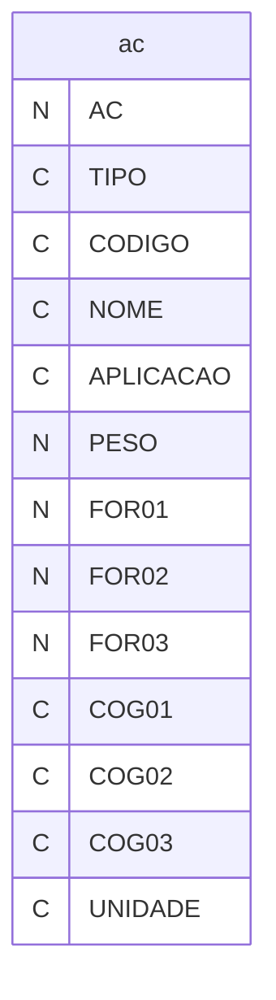

---
## Tabela DBF: `aci`
> **Origem:** `aci` (Driver: DBFCDX)

| Campo | Tipo | Tam | Dec |
| :--- | :--- | :--- | :--- |
| AC | N | 8 | 0 |
| ITEM | N | 3 | 0 |
| DATA | D | 8 | 0 |
| DETALHE | C | 20 | 0 |
| ENTPC | N | 8 | 0 |
| ENTKG | N | 12 | 4 |
| SAIPC | N | 8 | 0 |
| SAIKG | N | 12 | 4 |
| SALPC | N | 8 | 0 |
| SALKG | N | 12 | 4 |

**Indices vinculados:**
- Tag: `ACI` Expressao: `STR(AC,8)+STR(ITEM,3)`
- Tag: `ACI-2` Expressao: `STR(AC,8)+DTOS(DATA)+STR(ITEM,3)`
- Tag: `ACI-3` Expressao: `AC`

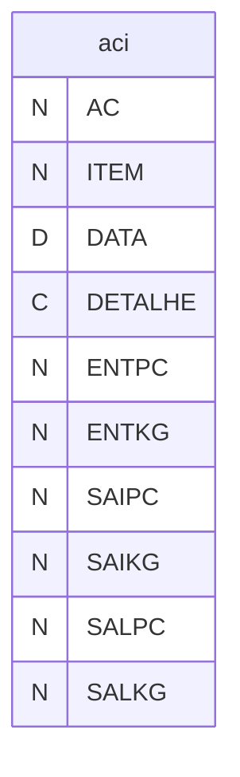

---
## Tabela DBF: `estqint`
> **Origem:** `estqint` (Driver: DBFCDX)

| Campo | Tipo | Tam | Dec |
| :--- | :--- | :--- | :--- |
| COD_EMPRES | C | 2 | 0 |
| COD_ITEM | C | 14 | 0 |
| QTD_LIBERA | N | 12 | 4 |
| QTD_IMPEDI | N | 12 | 4 |
| QTD_REJEIT | N | 12 | 4 |
| QTD_LIB_EX | N | 12 | 4 |
| QTD_DISP_V | N | 12 | 4 |
| QTD_RESERV | N | 12 | 4 |
| DAT_ULT_IN | D | 8 | 0 |
| DAT_ULT_EN | D | 8 | 0 |
| DAT_ULT_SA | D | 8 | 0 |

**Indices vinculados:**
- Tag: `ESTQINT` Expressao: `COD_ITEM`

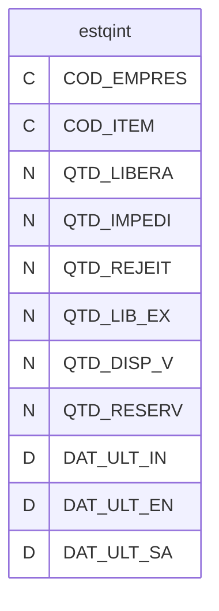

---
## Tabela DBF: `op01`
> **Origem:** `op01` (Driver: DBFCDX)

| Campo | Tipo | Tam | Dec |
| :--- | :--- | :--- | :--- |
| OP | N | 8 | 0 |
| CODIGO | C | 24 | 0 |
| NOME | C | 40 | 0 |
| CLIENTE | N | 8 | 0 |
| COGNOME | C | 12 | 0 |
| ATIVO | C | 1 | 0 |
| VMES | N | 6 | 0 |
| VQUI | N | 6 | 0 |
| VMED | N | 6 | 0 |
| VMEQ | N | 6 | 0 |
| VPRG | N | 6 | 0 |
| QATR | N | 6 | 0 |
| QSEM | N | 6 | 0 |
| QSE2 | N | 6 | 0 |
| QINI | N | 6 | 0 |
| QIN2 | N | 6 | 0 |
| QSAI | N | 6 | 0 |
| QSAL | N | 6 | 0 |
| QSAA | N | 6 | 0 |
| QSAS | N | 6 | 0 |
| QSA2 | N | 6 | 0 |
| DATAA | D | 8 | 0 |
| DATAS | D | 8 | 0 |
| DATA2 | D | 8 | 0 |
| IMAGEM | C | 40 | 0 |
| CODIGOINT | C | 24 | 0 |

**Indices vinculados:**
- Tag: `OP01-1` Expressao: `OP`
- Tag: `OP01-2` Expressao: `CODIGO`
- Tag: `OP01-3` Expressao: `STR(OP,8,2)`
- Tag: `OP01-4` Expressao: `CODIGOINT`

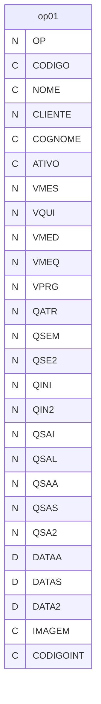

---
## Tabela DBF: `op01x`
> **Origem:** `op01x` (Driver: DBFCDX)

| Campo | Tipo | Tam | Dec |
| :--- | :--- | :--- | :--- |
| OP | N | 8 | 0 |
| CODIGO | C | 24 | 0 |
| NOME | C | 40 | 0 |
| CLIENTE | N | 8 | 0 |
| COGNOME | C | 12 | 0 |
| ATIVO | C | 1 | 0 |
| VMES | N | 6 | 0 |
| VQUI | N | 6 | 0 |
| VMED | N | 6 | 0 |
| VMEQ | N | 6 | 0 |
| VPRG | N | 6 | 0 |
| QATR | N | 6 | 0 |
| QSEM | N | 6 | 0 |
| QSE2 | N | 6 | 0 |
| QINI | N | 6 | 0 |
| QIN2 | N | 6 | 0 |
| QSAI | N | 6 | 0 |
| QSAL | N | 6 | 0 |
| QSAA | N | 6 | 0 |
| QSAS | N | 6 | 0 |
| QSA2 | N | 6 | 0 |
| DATAA | D | 8 | 0 |
| DATAS | D | 8 | 0 |
| DATA2 | D | 8 | 0 |
| IMAGEM | C | 40 | 0 |
| CODIGOINT | C | 24 | 0 |

**Indices vinculados:**
- Tag: `OP01X-1` Expressao: `OP`
- Tag: `OP01X-2` Expressao: `CODIGO`
- Tag: `OP01X-3` Expressao: `STR(OP,8,2)`


---
## Tabela DBF: `op02`
> **Origem:** `op02` (Driver: DBFCDX)

| Campo | Tipo | Tam | Dec |
| :--- | :--- | :--- | :--- |
| OP | N | 8 | 0 |
| CODIGO | C | 24 | 0 |
| SEQ | N | 3 | 0 |
| SSQ | N | 3 | 0 |
| QPINI | N | 6 | 0 |
| QPIN2 | N | 6 | 0 |
| QPINS | N | 6 | 0 |
| QPINA | N | 6 | 0 |
| QPSAI | N | 6 | 0 |
| QPSAL | N | 6 | 0 |
| QPREF | N | 6 | 0 |
| QPANT | N | 6 | 0 |
| QPAAA | N | 6 | 0 |
| QPAA2 | N | 6 | 0 |
| QPAAS | N | 6 | 0 |
| QPSA2 | N | 6 | 0 |
| QPAIN | N | 6 | 0 |
| QTTIME | N | 7 | 5 |
| QTTIM2 | N | 7 | 5 |
| QTTIMM | N | 7 | 5 |
| QTTIMD | N | 7 | 5 |
| CODMP01 | C | 12 | 0 |
| COGMP01 | C | 10 | 0 |
| CODMP02 | C | 12 | 0 |
| CODMP02B | C | 12 | 0 |
| CODMP02C | C | 12 | 0 |
| CODMP02D | C | 12 | 0 |
| CODMP03 | C | 24 | 0 |
| DESCRI | C | 70 | 0 |
| TIPFEC | C | 1 | 0 |
| PULREQ | C | 1 | 0 |
| NOMER | C | 15 | 0 |
| SETOROP | C | 1 | 0 |
| LIMTIME | N | 8 | 0 |
| FILIAL | N | 2 | 0 |
| LEADESP | N | 2 | 0 |
| FATOR | N | 2 | 0 |
| CODINT | C | 24 | 0 |

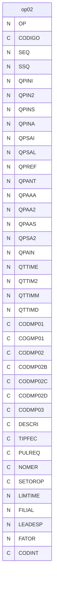

---
## Tabela DBF: `op02set`
> **Origem:** `op02set` (Driver: DBFCDX)

| Campo | Tipo | Tam | Dec |
| :--- | :--- | :--- | :--- |
| OP | N | 8 | 2 |
| CODIGO | C | 24 | 0 |
| SEQ | N | 3 | 0 |
| SSQ | N | 3 | 0 |
| CLIENTE | N | 8 | 0 |
| COGNOME | C | 12 | 0 |
| CODMP01 | C | 12 | 0 |
| COGMP01 | C | 10 | 0 |
| CODMP03 | C | 12 | 0 |
| DESCRI | C | 70 | 0 |
| NOMER | C | 15 | 0 |
| SETOROP | C | 1 | 0 |
| LIMTIME | N | 8 | 0 |
| DATA | D | 8 | 0 |
| DATAINI | D | 8 | 0 |
| QTDEINI | N | 12 | 2 |
| QTDEUSO | N | 12 | 2 |
| BLOQUEAR | C | 1 | 0 |
| URGENTE | C | 1 | 0 |
| OBS | C | 80 | 0 |
| PCHORMEQ | N | 10 | 4 |
| PCHORNEC | N | 12 | 2 |
| DATAPRZ | D | 8 | 0 |
| SEMANA | C | 1 | 0 |
| PRELEAD | N | 12 | 0 |
| FILIAL | N | 2 | 0 |
| LEADESP | N | 2 | 0 |
| NUMFERR | N | 8 | 0 |
| CODINT | C | 24 | 0 |

**Indices vinculados:**
- Tag: `OP02SET1` Expressao: `DTOS(DATA)+CODIGO+STR(SEQ,3)+STR(SSQ,3)`
- Tag: `OP02SET2` Expressao: `CODIGO+STR(SEQ,3)+STR(SSQ,3)+DTOS(DATA)`
- Tag: `OP02SET3` Expressao: `STR(CLIENTE,8)+DTOS(DATA)+CODIGO+STR(SEQ,3)+STR(SSQ,3)`
- Tag: `OP02SET4` Expressao: `CODMP01+DTOS(DATA)+CODIGO+STR(SEQ,3)+STR(SSQ,3)`
- Tag: `OP02SET5` Expressao: `SEMANA+CODIGO+STR(SEQ,3)+STR(SSQ,3)`

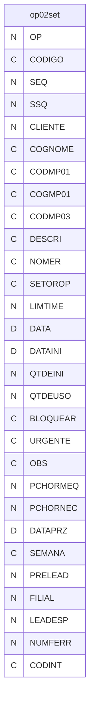

---
## Tabela DBF: `op02sex`
> **Origem:** `op02sex` (Driver: DBFCDX)

| Campo | Tipo | Tam | Dec |
| :--- | :--- | :--- | :--- |
| OP | N | 8 | 2 |
| CODIGO | C | 24 | 0 |
| SEQ | N | 3 | 0 |
| SSQ | N | 3 | 0 |
| CLIENTE | N | 8 | 0 |
| COGNOME | C | 12 | 0 |
| CODMP01 | C | 12 | 0 |
| COGMP01 | C | 10 | 0 |
| CODMP03 | C | 12 | 0 |
| DESCRI | C | 70 | 0 |
| NOMER | C | 15 | 0 |
| SETOROP | C | 1 | 0 |
| TEMPO01 | N | 3 | 0 |
| TEMPO02 | N | 3 | 0 |
| TEMPO03 | N | 3 | 0 |
| DATAI01 | D | 8 | 0 |
| DATAI02 | D | 8 | 0 |
| DATAI03 | D | 8 | 0 |
| PRAZO01 | D | 8 | 0 |
| PRAZO02 | D | 8 | 0 |
| PRAZO03 | D | 8 | 0 |
| QTDDE01 | N | 6 | 0 |
| QTDDE02 | N | 6 | 0 |
| QTDDE03 | N | 6 | 0 |
| BLOQUEAR | C | 1 | 0 |
| URGEN01 | C | 1 | 0 |
| URGEN02 | C | 1 | 0 |
| URGEN03 | C | 1 | 0 |
| INICI01 | D | 8 | 0 |
| INICI02 | D | 8 | 0 |
| INICI03 | D | 8 | 0 |
| DATAREF | D | 8 | 0 |
| LEADESP | N | 2 | 0 |
| FILIAL | N | 2 | 0 |
| HORA01 | N | 7 | 2 |
| HORA02 | N | 7 | 2 |
| HORA03 | N | 7 | 2 |
| DATABAS | D | 8 | 0 |
| TEM01 | C | 1 | 0 |
| DATABA2 | D | 8 | 0 |
| DATABA3 | D | 8 | 0 |
| DATABA4 | D | 8 | 0 |
| NUMFERR | N | 8 | 0 |
| CODINT | C | 24 | 0 |

**Indices vinculados:**
- Tag: `OP02SEX` Expressao: `CODIGO+STR(SEQ,3)+STR(SSQ,3)`
- Tag: `OP02SEX2` Expressao: `SETOROP+CODIGO`

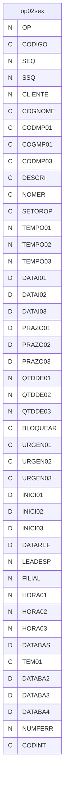

---
## Tabela DBF: `op02x`
> **Origem:** `op02x` (Driver: DBFCDX)

| Campo | Tipo | Tam | Dec |
| :--- | :--- | :--- | :--- |
| OP | N | 8 | 2 |
| CODIGO | C | 24 | 0 |
| SEQ | N | 3 | 0 |
| SSQ | N | 3 | 0 |
| QPINI | N | 6 | 0 |
| QPIN2 | N | 6 | 0 |
| QPINS | N | 6 | 0 |
| QPINA | N | 6 | 0 |
| QPSAI | N | 6 | 0 |
| QPSAL | N | 6 | 0 |
| QPREF | N | 6 | 0 |
| QPANT | N | 6 | 0 |
| QPAAA | N | 6 | 0 |
| QPAA2 | N | 6 | 0 |
| QPAAS | N | 6 | 0 |
| QPSA2 | N | 6 | 0 |
| QPAIN | N | 6 | 0 |
| QTTIME | N | 7 | 5 |
| QTTIM2 | N | 7 | 5 |
| QTTIMM | N | 7 | 5 |
| QTTIMD | N | 7 | 5 |
| CODMP01 | C | 12 | 0 |
| COGMP01 | C | 10 | 0 |
| CODMP02 | C | 12 | 0 |
| CODMP02B | C | 12 | 0 |
| CODMP02C | C | 12 | 0 |
| CODMP02D | C | 12 | 0 |
| CODMP03 | C | 24 | 0 |
| DESCRI | C | 70 | 0 |
| TIPFEC | C | 1 | 0 |
| PULREQ | C | 1 | 0 |
| NOMER | C | 15 | 0 |
| SETOROP | C | 1 | 0 |
| LIMTIME | N | 8 | 0 |
| FILIAL | N | 2 | 0 |
| LEADESP | N | 2 | 0 |
| FATOR | N | 2 | 0 |
| CODINT | C | 24 | 0 |

**Indices vinculados:**
- Tag: `OP02X-1` Expressao: `STR(OP,8,2)+STR(SEQ,3)+STR(SSQ,3)`
- Tag: `OP02X-2` Expressao: `OP`
- Tag: `OP02X-3` Expressao: `CODIGO`
- Tag: `OP02X-4` Expressao: `CODIGO+STR(SEQ,3)+STR(SSQ,3)`
- Tag: `OP02X-5` Expressao: `SETOROP+CODIGO`

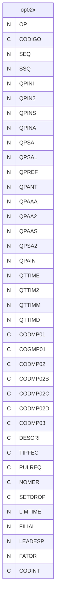

---
## Tabela DBF: `op03`
> **Origem:** `op03` (Driver: DBFCDX)

| Campo | Tipo | Tam | Dec |
| :--- | :--- | :--- | :--- |
| OP | N | 8 | 2 |
| CODIGO | C | 24 | 0 |
| SEQ | N | 3 | 0 |
| SSQ | N | 3 | 0 |
| CLIENTE | N | 8 | 0 |
| COGNOME | C | 12 | 0 |
| VMES | N | 6 | 0 |
| VQUI | N | 6 | 0 |
| VMED | N | 10 | 3 |
| VMEQ | N | 10 | 3 |
| VPRG | N | 6 | 0 |
| CODMP01 | C | 12 | 0 |
| COGMP01 | C | 10 | 0 |
| QTTIME | N | 8 | 5 |
| QTTIM2 | N | 8 | 5 |
| QTTIMM | N | 8 | 5 |
| QTTIMD | N | 8 | 5 |
| QINI | N | 6 | 0 |
| QSAI | N | 6 | 0 |
| QSAL | N | 6 | 0 |
| QPRO | N | 6 | 0 |
| FILIAL | N | 2 | 0 |
| CODINT | C | 24 | 0 |

**Indices vinculados:**
- Tag: `OP03-1` Expressao: `STR(OP,8,2)+CODMP01`

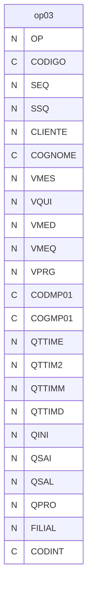

---
## Tabela DBF: `op03b`
> **Origem:** `op03b` (Driver: DBFCDX)

| Campo | Tipo | Tam | Dec |
| :--- | :--- | :--- | :--- |
| OP | N | 8 | 2 |
| CODIGO | C | 24 | 0 |
| SEQ | N | 3 | 0 |
| SSQ | N | 3 | 0 |
| CLIENTE | N | 8 | 0 |
| COGNOME | C | 12 | 0 |
| VMES | N | 6 | 0 |
| VQUI | N | 6 | 0 |
| VMED | N | 10 | 3 |
| VMEQ | N | 10 | 3 |
| VPRG | N | 6 | 0 |
| CODMP01 | C | 12 | 0 |
| COGMP01 | C | 10 | 0 |
| QTTIME | N | 8 | 5 |
| QTTIM2 | N | 8 | 5 |
| QTTIMM | N | 8 | 5 |
| QTTIMD | N | 8 | 5 |
| QINI | N | 6 | 0 |
| QSAI | N | 6 | 0 |
| QSAL | N | 6 | 0 |
| QPRO | N | 6 | 0 |
| FILIAL | N | 2 | 0 |
| CODINT | C | 24 | 0 |

**Indices vinculados:**
- Tag: `OP03B-1` Expressao: `STR(OP,8,2)+CODMP01`

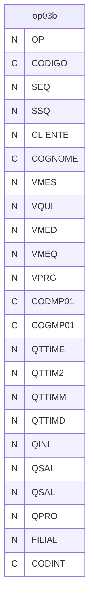

---
## Tabela DBF: `oscrt`
> **Origem:** `oscrt` (Driver: DBFCDX)

| Campo | Tipo | Tam | Dec |
| :--- | :--- | :--- | :--- |
| OS | N | 8 | 2 |
| DATA | D | 8 | 0 |
| CLIENTE | N | 8 | 0 |
| CLINOME | C | 50 | 0 |
| PEDIDOCLI | C | 20 | 0 |
| CODIGO | C | 24 | 0 |
| NOME | C | 40 | 0 |
| OBS | C | 30 | 0 |
| PF | N | 8 | 0 |
| EMUSO | C | 1 | 0 |
| ATIVO | C | 1 | 0 |
| OBSFIN01 | C | 80 | 0 |
| OBSFIN02 | C | 80 | 0 |
| OBSFIN03 | C | 80 | 0 |
| OBSFIN04 | C | 80 | 0 |
| OBSFIN05 | C | 80 | 0 |
| OBSFIN06 | C | 80 | 0 |
| DATAIMP | D | 8 | 0 |
| CODCLI | C | 15 | 0 |
| SAIOBS | L | 1 | 0 |
| PEDCLIITE | N | 3 | 0 |
| CODIGOINT | C | 24 | 0 |
| DELIVERY | C | 20 | 0 |
| STOCK | C | 20 | 0 |
| PEDCLIOBS | C | 10 | 0 |
| DOCA | C | 10 | 0 |

**Indices vinculados:**
- Tag: `OSCRT` Expressao: `OS`
- Tag: `OSCRT-2` Expressao: `STR(CLIENTE,8)+CODIGO`
- Tag: `OSCRT-3` Expressao: `PF`
- Tag: `OSCRT-4` Expressao: `CODIGO`
- Tag: `OSCRT-5` Expressao: `CODIGOINT`

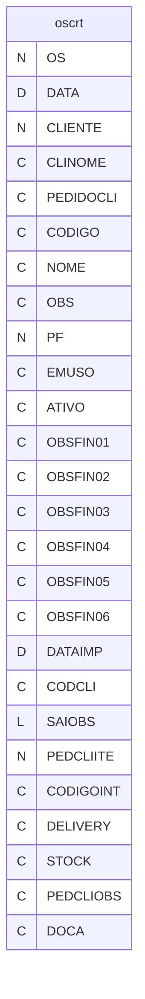

---
## Tabela DBF: `ospr2`
> **Origem:** `ospr2` (Driver: DBFCDX)

| Campo | Tipo | Tam | Dec |
| :--- | :--- | :--- | :--- |
| NUMERO | N | 8 | 0 |
| PRODUTO | C | 24 | 0 |
| PLANTA | C | 10 | 0 |
| PROGRAMA | D | 8 | 0 |
| QTDE | N | 8 | 0 |
| DATAIMP | D | 8 | 0 |
| HORAPRG | N | 5 | 2 |
| CODIGOINT | C | 24 | 0 |

**Indices vinculados:**
- Tag: `OSPR2-1` Expressao: `NUMERO`
- Tag: `OSPR2-2` Expressao: `PRODUTO`
- Tag: `OSPR2-3` Expressao: `PRODUTO+PLANTA+DTOS(PROGRAMA)+STR(QTDE,8)`
- Tag: `OSPR2-4` Expressao: `PRODUTO+DTOS(PROGRAMA)`
- Tag: `OSPR2-5` Expressao: `CODIGOINT`

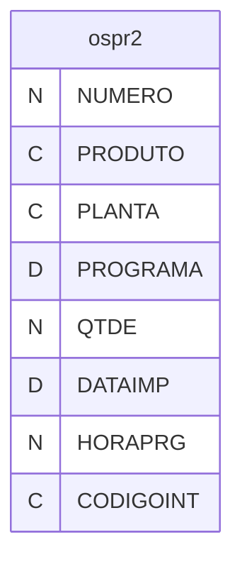

---
## Tabela DBF: `ospr3`
> **Origem:** `ospr3` (Driver: DBFCDX)

| Campo | Tipo | Tam | Dec |
| :--- | :--- | :--- | :--- |
| NUMERO | N | 8 | 0 |
| PRODUTO | C | 24 | 0 |
| PLANTA | C | 10 | 0 |
| PROGRAMA | D | 8 | 0 |
| QTDE | N | 8 | 0 |
| DATAIMP | D | 8 | 0 |
| HORAPRG | N | 5 | 2 |
| SEQCLIPRG | N | 3 | 0 |

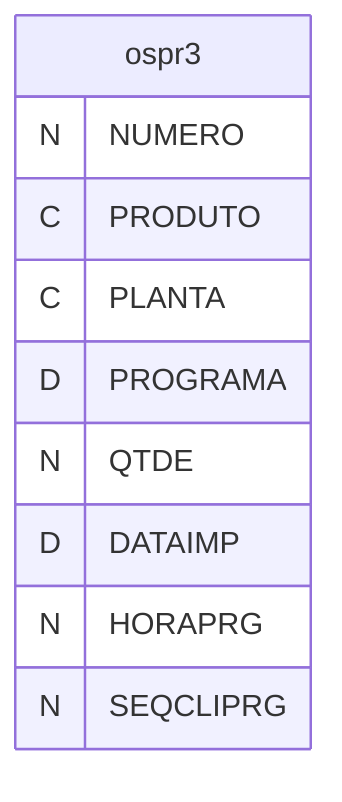

---
## Tabela DBF: `ospra`
> **Origem:** `ospra` (Driver: DBFCDX)

| Campo | Tipo | Tam | Dec |
| :--- | :--- | :--- | :--- |
| PRODUTO | C | 24 | 0 |
| DATAACM | D | 8 | 0 |
| DATAPRG | D | 8 | 0 |
| QTDE | N | 6 | 0 |
| LISTA | C | 1 | 0 |
| TIPO | C | 1 | 0 |

**Indices vinculados:**
- Tag: `OSPRA-1` Expressao: `PRODUTO+DTOS(DATAACM)+DTOS(DATAPRG)`

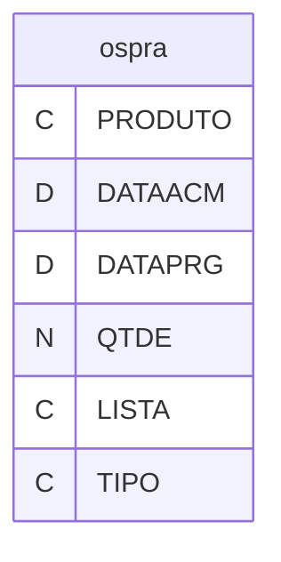

---
## Tabela DBF: `osprb`
> **Origem:** `osprb` (Driver: DBFCDX)

| Campo | Tipo | Tam | Dec |
| :--- | :--- | :--- | :--- |
| PRODUTO | C | 24 | 0 |
| DATAACM | D | 8 | 0 |
| DATAPRG | D | 8 | 0 |
| QTDE | N | 6 | 0 |
| PLANTA | C | 5 | 0 |

**Indices vinculados:**
- Tag: `OSPRB-1` Expressao: `PRODUTO+DTOS(DATAACM)+DTOS(DATAPRG)`

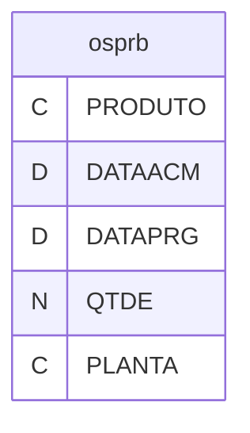

---
## Tabela DBF: `osprd`
> **Origem:** `osprd` (Driver: DBFCDX)

| Campo | Tipo | Tam | Dec |
| :--- | :--- | :--- | :--- |
| PRODUTO | C | 24 | 0 |
| DATAACM | D | 8 | 0 |
| DATAPRG | D | 8 | 0 |
| QTDE | N | 6 | 0 |
| PLANTA | C | 5 | 0 |

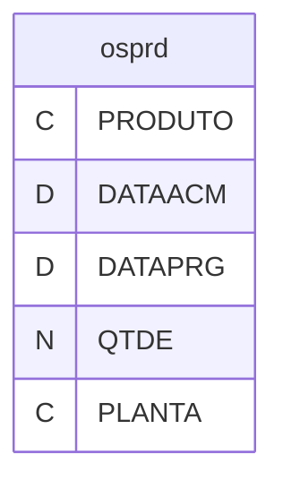

---
## Tabela DBF: `ospre`
> **Origem:** `ospre` (Driver: DBFCDX)

| Campo | Tipo | Tam | Dec |
| :--- | :--- | :--- | :--- |
| NUMERO | N | 8 | 0 |
| PRODUTO | C | 24 | 0 |
| PLANTA | C | 10 | 0 |
| PROGRAMA | D | 8 | 0 |
| QTDE | N | 8 | 0 |
| DATAIMP | D | 8 | 0 |
| HORAPRG | N | 5 | 2 |
| SEQCLIPRG | N | 5 | 0 |


---
## Tabela DBF: `osprf`
> **Origem:** `osprf` (Driver: DBFCDX)

| Campo | Tipo | Tam | Dec |
| :--- | :--- | :--- | :--- |
| PRODUTO | C | 24 | 0 |
| DATAACM | D | 8 | 0 |
| DATAPRG | D | 8 | 0 |
| QTDE | N | 6 | 0 |
| PLANTA | C | 5 | 0 |


---
## Tabela DBF: `osprg`
> **Origem:** `osprg` (Driver: DBFCDX)

| Campo | Tipo | Tam | Dec |
| :--- | :--- | :--- | :--- |
| NUMERO | N | 8 | 0 |
| PRODUTO | C | 24 | 0 |
| PLANTA | C | 10 | 0 |
| PROGRAMA | D | 8 | 0 |
| QTDE | N | 8 | 0 |
| DATAIMP | D | 8 | 0 |
| HORAPRG | N | 5 | 2 |
| CODIGOINT | C | 24 | 0 |

**Indices vinculados:**
- Tag: `OSPRG-1` Expressao: `NUMERO`
- Tag: `OSPRG-2` Expressao: `PRODUTO`
- Tag: `OSPRG-3` Expressao: `PRODUTO+PLANTA+DTOS(PROGRAMA)+STR(QTDE,8)`
- Tag: `OSPRG-4` Expressao: `PRODUTO+DTOS(PROGRAMA)`
- Tag: `OSPRG-5` Expressao: `CODIGOINT`

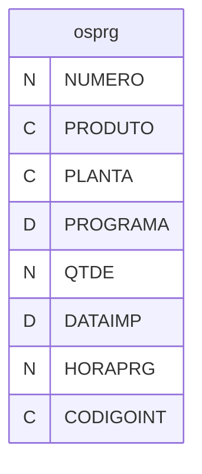

---
## Tabela DBF: `osprh`
> **Origem:** `osprh` (Driver: DBFCDX)

| Campo | Tipo | Tam | Dec |
| :--- | :--- | :--- | :--- |
| NUMERO | N | 8 | 0 |
| PRODUTO | C | 24 | 0 |
| PLANTA | C | 10 | 0 |
| PROGRAMA | D | 8 | 0 |
| QTDE | N | 8 | 0 |
| DATAIMP | D | 8 | 0 |
| HORAPRG | N | 5 | 2 |
| SEQCLIPRG | N | 3 | 0 |
| CODIGOINT | C | 24 | 0 |

**Indices vinculados:**
- Tag: `OSPRH-1` Expressao: `NUMERO`
- Tag: `OSPRH-2` Expressao: `PRODUTO`
- Tag: `OSPRH-3` Expressao: `PRODUTO+PLANTA+DTOS(PROGRAMA)+STR(QTDE,8)`
- Tag: `OSPRH-4` Expressao: `PRODUTO+DTOS(PROGRAMA)`
- Tag: `OSPRH-5` Expressao: `CODIGOINT`

```mermaid
erDiagram
    osprh {
        N NUMERO
        C PRODUTO
        C PLANTA
        D PROGRAMA
        N QTDE
        D DATAIMP
        N HORAPRG
        N SEQCLIPRG
        C CODIGOINT
    }
```

---
## Tabela DBF: `ospri`
> **Origem:** `ospri` (Driver: DBFCDX)

| Campo | Tipo | Tam | Dec |
| :--- | :--- | :--- | :--- |
| NUMERO | N | 8 | 0 |
| PRODUTO | C | 24 | 0 |
| PLANTA | C | 10 | 0 |
| PROGRAMA | D | 8 | 0 |
| QTDE | N | 8 | 0 |
| DATAIMP | D | 8 | 0 |
| HORAPRG | N | 5 | 2 |
| SEQCLIPRG | N | 3 | 0 |
| CODIGOINT | C | 24 | 0 |

**Indices vinculados:**
- Tag: `OSPRI-1` Expressao: `NUMERO`
- Tag: `OSPRI-2` Expressao: `PRODUTO`
- Tag: `OSPRI-3` Expressao: `PRODUTO+PLANTA+DTOS(PROGRAMA)+STR(QTDE,8)`
- Tag: `OSPRI-4` Expressao: `PRODUTO+DTOS(PROGRAMA)`
- Tag: `OSPRI-5` Expressao: `CODIGOINT`

```mermaid
erDiagram
    ospri {
        N NUMERO
        C PRODUTO
        C PLANTA
        D PROGRAMA
        N QTDE
        D DATAIMP
        N HORAPRG
        N SEQCLIPRG
        C CODIGOINT
    }
```

---
## Tabela DBF: `ospro`
> **Origem:** `ospro` (Driver: DBFCDX)

| Campo | Tipo | Tam | Dec |
| :--- | :--- | :--- | :--- |
| PRODUTO | C | 24 | 0 |
| DATAACM | D | 8 | 0 |
| DATAPRG | D | 8 | 0 |
| QTDE | N | 6 | 0 |

**Indices vinculados:**
- Tag: `OSPRO-1` Expressao: `PRODUTO+DTOS(DATAACM)+DTOS(DATAPRG)`

```mermaid
erDiagram
    ospro {
        C PRODUTO
        D DATAACM
        D DATAPRG
        N QTDE
    }
```

---
## Tabela DBF: `osprr`
> **Origem:** `osprr` (Driver: DBFCDX)

| Campo | Tipo | Tam | Dec |
| :--- | :--- | :--- | :--- |
| NUMERO | N | 8 | 0 |
| PRODUTO | C | 24 | 0 |
| PLANTA | C | 10 | 0 |
| PROGRAMA | D | 8 | 0 |
| QTDE | N | 8 | 0 |
| DATAIMP | D | 8 | 0 |
| HORAPRG | N | 5 | 2 |
| CODIGOINT | C | 24 | 0 |
| CLIENTE | N | 8 | 0 |

**Indices vinculados:**
- Tag: `OSPRR-1` Expressao: `NUMERO`
- Tag: `OSPRR-2` Expressao: `PRODUTO`
- Tag: `OSPRR-3` Expressao: `PRODUTO+PLANTA+DTOS(PROGRAMA)+STR(QTDE,8)`
- Tag: `OSPRR-4` Expressao: `PRODUTO+DTOS(PROGRAMA)`
- Tag: `OSPRR-5` Expressao: `CODIGOINT`

```mermaid
erDiagram
    osprr {
        N NUMERO
        C PRODUTO
        C PLANTA
        D PROGRAMA
        N QTDE
        D DATAIMP
        N HORAPRG
        C CODIGOINT
        N CLIENTE
    }
```

---
## Tabela DBF: `osprs`
> **Origem:** `osprs` (Driver: DBFCDX)

| Campo | Tipo | Tam | Dec |
| :--- | :--- | :--- | :--- |
| NUMERO | N | 8 | 0 |
| PRODUTO | C | 24 | 0 |
| PLANTA | C | 10 | 0 |
| PROGRAMA | D | 8 | 0 |
| QTDE | N | 8 | 0 |
| DATAIMP | D | 8 | 0 |
| HORAPRG | N | 5 | 2 |
| CODIGOINT | C | 24 | 0 |
| CLIENTE | N | 8 | 0 |

**Indices vinculados:**
- Tag: `OSPRS-1` Expressao: `NUMERO`
- Tag: `OSPRS-2` Expressao: `PRODUTO`
- Tag: `OSPRS-3` Expressao: `PRODUTO+PLANTA+DTOS(PROGRAMA)+STR(QTDE,8)`
- Tag: `OSPRS-4` Expressao: `PRODUTO+DTOS(PROGRAMA)`
- Tag: `OSPRS-5` Expressao: `CODIGOINT`

```mermaid
erDiagram
    osprs {
        N NUMERO
        C PRODUTO
        C PLANTA
        D PROGRAMA
        N QTDE
        D DATAIMP
        N HORAPRG
        C CODIGOINT
        N CLIENTE
    }
```

---
## Tabela DBF: `pcorte`
> **Origem:** `pcorte` (Driver: DBFCDX)

| Campo | Tipo | Tam | Dec |
| :--- | :--- | :--- | :--- |
| NUMERO | N | 8 | 0 |
| NFNOSSA | N | 8 | 0 |
| NFUSINA | N | 8 | 0 |
| RASTROU | C | 12 | 0 |
| RASTRO | C | 12 | 0 |
| ESP | N | 10 | 4 |
| LAR | N | 10 | 4 |
| PESO | N | 8 | 0 |
| LOCALUSO | C | 10 | 0 |
| AC | C | 15 | 0 |
| CRM | N | 8 | 0 |
| OBS01 | C | 80 | 0 |
| OBS02 | C | 80 | 0 |
| NFORN | N | 8 | 0 |
| MFORN | C | 40 | 0 |
| NFORNU | N | 8 | 0 |
| MFORNU | C | 40 | 0 |
| CODIGO | C | 24 | 0 |
| DESCRICAO | C | 100 | 0 |
| DATA | D | 8 | 0 |
| LANCADO | C | 1 | 0 |
| CRMITEM | N | 3 | 0 |
| CRMTIPO | C | 1 | 0 |
| CRMITEMU | N | 3 | 0 |
| REFNF | N | 8 | 0 |
| REFDATA | D | 8 | 0 |
| REFQTDE | N | 8 | 0 |
| LXFORNU | C | 15 | 0 |
| LXFORNC | C | 15 | 0 |

**Indices vinculados:**
- Tag: `PCORTE` Expressao: `NUMERO`
- Tag: `PCORTE-2` Expressao: `RASTROU`
- Tag: `PCORTE-3` Expressao: `DATA`

```mermaid
erDiagram
    pcorte {
        N NUMERO
        N NFNOSSA
        N NFUSINA
        C RASTROU
        C RASTRO
        N ESP
        N LAR
        N PESO
        C LOCALUSO
        C AC
        N CRM
        C OBS01
        C OBS02
        N NFORN
        C MFORN
        N NFORNU
        C MFORNU
        C CODIGO
        C DESCRICAO
        D DATA
        C LANCADO
        N CRMITEM
        C CRMTIPO
        N CRMITEMU
        N REFNF
        D REFDATA
        N REFQTDE
        C LXFORNU
        C LXFORNC
    }
```

---
## Tabela DBF: `pcortei`
> **Origem:** `pcortei` (Driver: DBFCDX)

| Campo | Tipo | Tam | Dec |
| :--- | :--- | :--- | :--- |
| NUMERO | N | 8 | 0 |
| CODIGO | C | 24 | 0 |
| DESCRICAO | C | 100 | 0 |
| ITELAR | N | 10 | 4 |
| ITECOM | N | 10 | 4 |
| ROLOS | N | 3 | 0 |
| PESO | N | 8 | 0 |
| PRAZO | D | 8 | 0 |
| COMPRAS | N | 8 | 0 |
| COMITEM | N | 3 | 0 |
| QTDE | N | 8 | 0 |
| PE | N | 8 | 0 |
| APLICACAO | C | 40 | 0 |
| RETNF | N | 8 | 0 |
| RETDATA | D | 8 | 0 |
| RETQTDE | N | 8 | 0 |

**Indices vinculados:**
- Tag: `PCORTEI` Expressao: `NUMERO`
- Tag: `PCORTEI-2` Expressao: `CODIGO`

```mermaid
erDiagram
    pcortei {
        N NUMERO
        C CODIGO
        C DESCRICAO
        N ITELAR
        N ITECOM
        N ROLOS
        N PESO
        D PRAZO
        N COMPRAS
        N COMITEM
        N QTDE
        N PE
        C APLICACAO
        N RETNF
        D RETDATA
        N RETQTDE
    }
```

---
## Tabela DBF: `pe`
> **Origem:** `pe` (Driver: DBFCDX)

| Campo | Tipo | Tam | Dec |
| :--- | :--- | :--- | :--- |
| PEDIDO | N | 5 | 0 |
| TIPPED | C | 1 | 0 |
| CODIGO | C | 24 | 0 |
| NOME | C | 50 | 0 |
| FORNECEDO | N | 8 | 0 |
| COGNOME | C | 15 | 0 |
| UNID | C | 2 | 0 |
| NOM2 | C | 50 | 0 |
| COMPRAS | N | 8 | 0 |
| COMITEM | N | 3 | 0 |
| APLICACAO | C | 50 | 0 |
| LOCENT | N | 1 | 0 |
| OBSOBS | C | 40 | 0 |
| ATIVO | C | 1 | 0 |
| DDDPCP | C | 2 | 0 |
| TELPCP | C | 12 | 0 |
| RAMPCP | C | 4 | 0 |
| CONPCP | C | 24 | 0 |
| DDDFAXPCP | C | 2 | 0 |
| TELFAXPCP | C | 12 | 0 |
| EMAILPCP | C | 50 | 0 |
| NOMEFOR | C | 40 | 0 |

**Indices vinculados:**
- Tag: `PE` Expressao: `PEDIDO`
- Tag: `PE-2` Expressao: `TIPPED+CODIGO+STR(FORNECEDO)`
- Tag: `PE-3` Expressao: `CODIGO`
- Tag: `PE-4` Expressao: `FORNECEDO`

```mermaid
erDiagram
    pe {
        N PEDIDO
        C TIPPED
        C CODIGO
        C NOME
        N FORNECEDO
        C COGNOME
        C UNID
        C NOM2
        N COMPRAS
        N COMITEM
        C APLICACAO
        N LOCENT
        C OBSOBS
        C ATIVO
        C DDDPCP
        C TELPCP
        C RAMPCP
        C CONPCP
        C DDDFAXPCP
        C TELFAXPCP
        C EMAILPCP
        C NOMEFOR
    }
```

---
## Tabela DBF: `pe01`
> **Origem:** `pe01` (Driver: DBFCDX)

| Campo | Tipo | Tam | Dec |
| :--- | :--- | :--- | :--- |
| TIPPED | C | 1 | 0 |
| CODIGO | C | 24 | 0 |
| UNIDADE | C | 2 | 0 |
| NOME | C | 50 | 0 |
| NOM2 | C | 50 | 0 |
| NRNOTAINI | N | 8 | 2 |
| DIGCTR | C | 1 | 0 |
| DATAFAT | D | 8 | 0 |
| VALORINI | N | 9 | 2 |
| TOTKGINI | N | 6 | 0 |
| NRNOTASAI | N | 8 | 0 |
| TOTKGANT | N | 6 | 0 |
| TOTKGSAI | N | 6 | 0 |
| TOTKGEST | N | 6 | 0 |
| TIPOCLI | C | 1 | 0 |
| CLIENTE | N | 5 | 0 |
| COGNOME | C | 12 | 0 |
| DATASAI | D | 8 | 0 |
| CRM | N | 8 | 0 |
| PEDIDO | N | 5 | 0 |
| ITEM | N | 2 | 0 |
| RECEBER | C | 1 | 0 |
| OBS | C | 20 | 0 |
| RASTROFOR | C | 20 | 0 |
| DCORTE | D | 8 | 0 |
| AR | N | 8 | 0 |
| RIRM | N | 8 | 0 |

**Indices vinculados:**
- Tag: `PE01` Expressao: `STR(PEDIDO,5)+STR(ITEM,2)+DIGCTR`
- Tag: `PE01-2` Expressao: `PEDIDO`

```mermaid
erDiagram
    pe01 {
        C TIPPED
        C CODIGO
        C UNIDADE
        C NOME
        C NOM2
        N NRNOTAINI
        C DIGCTR
        D DATAFAT
        N VALORINI
        N TOTKGINI
        N NRNOTASAI
        N TOTKGANT
        N TOTKGSAI
        N TOTKGEST
        C TIPOCLI
        N CLIENTE
        C COGNOME
        D DATASAI
        N CRM
        N PEDIDO
        N ITEM
        C RECEBER
        C OBS
        C RASTROFOR
        D DCORTE
        N AR
        N RIRM
    }
```

---
## Tabela DBF: `pe01ap`
> **Origem:** `pe01ap` (Driver: DBFCDX)

| Campo | Tipo | Tam | Dec |
| :--- | :--- | :--- | :--- |
| TIPPED | C | 1 | 0 |
| CODIGO | C | 24 | 0 |
| UNIDADE | C | 2 | 0 |
| NOME | C | 50 | 0 |
| NOM2 | C | 50 | 0 |
| NRNOTAINI | N | 8 | 2 |
| DIGCTR | C | 1 | 0 |
| DATAFAT | D | 8 | 0 |
| VALORINI | N | 9 | 2 |
| TOTKGINI | N | 6 | 0 |
| NRNOTASAI | N | 8 | 0 |
| TOTKGANT | N | 6 | 0 |
| TOTKGSAI | N | 6 | 0 |
| TOTKGEST | N | 6 | 0 |
| TIPOCLI | C | 1 | 0 |
| CLIENTE | N | 5 | 0 |
| COGNOME | C | 12 | 0 |
| DATASAI | D | 8 | 0 |
| CRM | N | 8 | 0 |
| PEDIDO | N | 5 | 0 |
| ITEM | N | 2 | 0 |
| RECEBER | C | 1 | 0 |

**Indices vinculados:**
- Tag: `PE01AP` Expressao: `STR(CLIENTE,8)+STR(PEDIDO,8)+STR(ITEM,3)+DTOS(DATASAI)`

```mermaid
erDiagram
    pe01ap {
        C TIPPED
        C CODIGO
        C UNIDADE
        C NOME
        C NOM2
        N NRNOTAINI
        C DIGCTR
        D DATAFAT
        N VALORINI
        N TOTKGINI
        N NRNOTASAI
        N TOTKGANT
        N TOTKGSAI
        N TOTKGEST
        C TIPOCLI
        N CLIENTE
        C COGNOME
        D DATASAI
        N CRM
        N PEDIDO
        N ITEM
        C RECEBER
    }
```

---
## Tabela DBF: `pe01bx`
> **Origem:** `pe01bx` (Driver: DBFCDX)

| Campo | Tipo | Tam | Dec |
| :--- | :--- | :--- | :--- |
| TIPPED | C | 1 | 0 |
| CODIGO | C | 24 | 0 |
| UNIDADE | C | 2 | 0 |
| NOME | C | 50 | 0 |
| NOM2 | C | 50 | 0 |
| NRNOTAINI | N | 8 | 2 |
| DIGCTR | C | 1 | 0 |
| DATAFAT | D | 8 | 0 |
| VALORINI | N | 9 | 2 |
| TOTKGINI | N | 6 | 0 |
| NRNOTASAI | N | 8 | 0 |
| TOTKGANT | N | 6 | 0 |
| TOTKGSAI | N | 6 | 0 |
| TOTKGEST | N | 6 | 0 |
| TIPOCLI | C | 1 | 0 |
| CLIENTE | N | 5 | 0 |
| COGNOME | C | 12 | 0 |
| DATASAI | D | 8 | 0 |
| CRM | N | 8 | 0 |
| PEDIDO | N | 5 | 0 |
| ITEM | N | 2 | 0 |
| RECEBER | C | 1 | 0 |
| OBS | C | 20 | 0 |
| RASTROFOR | C | 20 | 0 |
| DCORTE | D | 8 | 0 |
| AR | N | 8 | 0 |
| RIRM | N | 8 | 0 |

**Indices vinculados:**
- Tag: `PE01BX` Expressao: `STR(PEDIDO,5)+STR(ITEM,2)+DIGCTR`
- Tag: `PE01BX-2` Expressao: `STR(NRNOTASAI,8)+STR(CLIENTE,8)`
- Tag: `PE01BX-3` Expressao: `PEDIDO`
- Tag: `PE01BX-4` Expressao: `CLIENTE`

```mermaid
erDiagram
    pe01bx {
        C TIPPED
        C CODIGO
        C UNIDADE
        C NOME
        C NOM2
        N NRNOTAINI
        C DIGCTR
        D DATAFAT
        N VALORINI
        N TOTKGINI
        N NRNOTASAI
        N TOTKGANT
        N TOTKGSAI
        N TOTKGEST
        C TIPOCLI
        N CLIENTE
        C COGNOME
        D DATASAI
        N CRM
        N PEDIDO
        N ITEM
        C RECEBER
        C OBS
        C RASTROFOR
        D DCORTE
        N AR
        N RIRM
    }
```

---
## Tabela DBF: `pe99`
> **Origem:** `pe99` (Driver: DBFCDX)

| Campo | Tipo | Tam | Dec |
| :--- | :--- | :--- | :--- |
| TIPPED | C | 1 | 0 |
| CODIGO | C | 24 | 0 |
| UNIDADE | C | 2 | 0 |
| NOME | C | 50 | 0 |
| NOM2 | C | 50 | 0 |
| NRNOTAINI | N | 8 | 2 |
| DIGCTR | C | 1 | 0 |
| DATAFAT | D | 8 | 0 |
| VALORINI | N | 9 | 2 |
| TOTKGINI | N | 6 | 0 |
| NRNOTASAI | N | 8 | 0 |
| TOTKGANT | N | 6 | 0 |
| TOTKGSAI | N | 6 | 0 |
| TOTKGEST | N | 6 | 0 |
| TIPOCLI | C | 1 | 0 |
| CLIENTE | N | 5 | 0 |
| COGNOME | C | 12 | 0 |
| DATASAI | D | 8 | 0 |
| CRM | N | 8 | 0 |
| PEDIDO | N | 5 | 0 |
| ITEM | N | 2 | 0 |
| RECEBER | C | 1 | 0 |
| OBS | C | 20 | 0 |
| RASTROFOR | C | 20 | 0 |
| DCORTE | D | 8 | 0 |
| MES | N | 2 | 0 |
| ANO | N | 4 | 0 |

**Indices vinculados:**
- Tag: `PE99-1` Expressao: `STR(PEDIDO,5)+STR(ITEM,2)+DIGCTR`
- Tag: `PE99-2` Expressao: `STR(NRNOTASAI,8)+STR(CLIENTE,8)`
- Tag: `PE99-3` Expressao: `PEDIDO`
- Tag: `PE99-4` Expressao: `CLIENTE`

```mermaid
erDiagram
    pe99 {
        C TIPPED
        C CODIGO
        C UNIDADE
        C NOME
        C NOM2
        N NRNOTAINI
        C DIGCTR
        D DATAFAT
        N VALORINI
        N TOTKGINI
        N NRNOTASAI
        N TOTKGANT
        N TOTKGSAI
        N TOTKGEST
        C TIPOCLI
        N CLIENTE
        C COGNOME
        D DATASAI
        N CRM
        N PEDIDO
        N ITEM
        C RECEBER
        C OBS
        C RASTROFOR
        D DCORTE
        N MES
        N ANO
    }
```

---
## Tabela DBF: `pecrt`
> **Origem:** `pecrt` (Driver: DBFCDX)

| Campo | Tipo | Tam | Dec |
| :--- | :--- | :--- | :--- |
| TIPO | C | 1 | 0 |
| CODIGO | C | 24 | 0 |
| UNRNOTA | N | 8 | 0 |
| UFORNE | N | 8 | 0 |
| UQTDE | N | 12 | 2 |
| UDATA | D | 8 | 0 |

**Indices vinculados:**
- Tag: `PECRT` Expressao: `TIPO+CODIGO+STR(uFORNE,8)`
- Tag: `PECRT-2` Expressao: `STR(uFORNE,8)+CODIGO`
- Tag: `PECRT-3` Expressao: `uFORNE`
- Tag: `PECRT-4` Expressao: `CODIGO`

```mermaid
erDiagram
    pecrt {
        C TIPO
        C CODIGO
        N UNRNOTA
        N UFORNE
        N UQTDE
        D UDATA
    }
```

---
## Tabela DBF: `pemo`
> **Origem:** `pemo` (Driver: DBFCDX)

| Campo | Tipo | Tam | Dec |
| :--- | :--- | :--- | :--- |
| PEDIDO | N | 5 | 0 |
| TIPPED | C | 1 | 0 |
| CODIGO | C | 24 | 0 |
| NOME | C | 50 | 0 |
| FORNECEDO | N | 8 | 0 |
| COGNOME | C | 15 | 0 |
| UNID | C | 2 | 0 |
| NOM2 | C | 50 | 0 |
| COMPRAS | N | 8 | 0 |
| COMITEM | N | 3 | 0 |
| APLICACAO | C | 50 | 0 |

**Indices vinculados:**
- Tag: `PEMO` Expressao: `PEDIDO`
- Tag: `PEMO-2` Expressao: `TIPPED+CODIGO+STR(FORNECEDO)`

```mermaid
erDiagram
    pemo {
        N PEDIDO
        C TIPPED
        C CODIGO
        C NOME
        N FORNECEDO
        C COGNOME
        C UNID
        C NOM2
        N COMPRAS
        N COMITEM
        C APLICACAO
    }
```

---
## Tabela DBF: `petr`
> **Origem:** `petr` (Driver: DBFCDX)

| Campo | Tipo | Tam | Dec |
| :--- | :--- | :--- | :--- |
| PEDIDO | N | 5 | 0 |
| TIPPED | C | 1 | 0 |
| CODIGO | C | 24 | 0 |
| NOME | C | 50 | 0 |
| FORNECEDO | N | 8 | 0 |
| COGNOME | C | 15 | 0 |
| UNID | C | 2 | 0 |
| NOM2 | C | 50 | 0 |
| COMPRAS | N | 8 | 0 |
| COMITEM | N | 3 | 0 |
| APLICACAO | C | 50 | 0 |

**Indices vinculados:**
- Tag: `PETR` Expressao: `PEDIDO`
- Tag: `PETR-2` Expressao: `TIPPED+CODIGO+STR(FORNECEDO)`

```mermaid
erDiagram
    petr {
        N PEDIDO
        C TIPPED
        C CODIGO
        C NOME
        N FORNECEDO
        C COGNOME
        C UNID
        C NOM2
        N COMPRAS
        N COMITEM
        C APLICACAO
    }
```

---
## Tabela DBF: `prnec`
> **Origem:** `prnec` (Driver: DBFCDX)

| Campo | Tipo | Tam | Dec |
| :--- | :--- | :--- | :--- |
| CODIGO | C | 24 | 0 |
| NOME | C | 40 | 0 |
| QTDSAL | N | 6 | 0 |
| QTDE01 | N | 6 | 0 |
| QTDR01 | N | 6 | 0 |
| QTDI01 | N | 6 | 0 |
| DATA01 | D | 8 | 0 |
| QTDE02 | N | 6 | 0 |
| QTDR02 | N | 6 | 0 |
| QTDI02 | N | 6 | 0 |
| DATA02 | D | 8 | 0 |
| QTDE03 | N | 6 | 0 |
| QTDR03 | N | 6 | 0 |
| QTDI03 | N | 6 | 0 |
| DATA03 | D | 8 | 0 |
| QTDE04 | N | 6 | 0 |
| QTDR04 | N | 6 | 0 |
| QTDI04 | N | 6 | 0 |
| DATA04 | D | 8 | 0 |
| QTDE05 | N | 6 | 0 |
| QTDR05 | N | 6 | 0 |
| QTDI05 | N | 6 | 0 |
| DATA05 | D | 8 | 0 |
| QTDE06 | N | 6 | 0 |
| QTDR06 | N | 6 | 0 |
| QTDI06 | N | 6 | 0 |
| DATA06 | D | 8 | 0 |
| QTDE07 | N | 6 | 0 |
| QTDR07 | N | 6 | 0 |
| QTDI07 | N | 6 | 0 |
| DATA07 | D | 8 | 0 |
| QTDE08 | N | 6 | 0 |
| QTDR08 | N | 6 | 0 |
| QTDI08 | N | 6 | 0 |
| DATA08 | D | 8 | 0 |
| QTDE09 | N | 6 | 0 |
| QTDR09 | N | 6 | 0 |
| QTDI09 | N | 6 | 0 |
| DATA09 | D | 8 | 0 |
| QTDE10 | N | 6 | 0 |
| QTDR10 | N | 6 | 0 |
| QTDI10 | N | 6 | 0 |
| DATA10 | D | 8 | 0 |
| QTDE11 | N | 6 | 0 |
| QTDR11 | N | 6 | 0 |
| QTDI11 | N | 6 | 0 |
| DATA11 | D | 8 | 0 |
| QTDE12 | N | 6 | 0 |
| QTDR12 | N | 6 | 0 |
| QTDI12 | N | 6 | 0 |
| DATA12 | D | 8 | 0 |
| QTDE13 | N | 6 | 0 |
| QTDR13 | N | 6 | 0 |
| QTDI13 | N | 6 | 0 |
| DATA13 | D | 8 | 0 |
| QTDE14 | N | 6 | 0 |
| QTDR14 | N | 6 | 0 |
| QTDI14 | N | 6 | 0 |
| DATA14 | D | 8 | 0 |
| QTDE15 | N | 6 | 0 |
| QTDR15 | N | 6 | 0 |
| QTDI15 | N | 6 | 0 |
| DATA15 | D | 8 | 0 |
| QTDE16 | N | 6 | 0 |
| QTDR16 | N | 6 | 0 |
| QTDI16 | N | 6 | 0 |
| DATA16 | D | 8 | 0 |
| QTDE17 | N | 6 | 0 |
| QTDR17 | N | 6 | 0 |
| QTDI17 | N | 6 | 0 |
| DATA17 | D | 8 | 0 |
| QTDE18 | N | 6 | 0 |
| QTDR18 | N | 6 | 0 |
| QTDI18 | N | 6 | 0 |
| DATA18 | D | 8 | 0 |
| QTDE19 | N | 6 | 0 |
| QTDR19 | N | 6 | 0 |
| QTDI19 | N | 6 | 0 |
| DATA19 | D | 8 | 0 |
| QTDE20 | N | 6 | 0 |
| QTDR20 | N | 6 | 0 |
| QTDI20 | N | 6 | 0 |
| DATA20 | D | 8 | 0 |
| OP | N | 8 | 0 |
| OPQTDE1 | N | 6 | 0 |
| TIPOPRG | C | 1 | 0 |

**Indices vinculados:**
- Tag: `CODIGO` Expressao: `CODIGO`

```mermaid
erDiagram
    prnec {
        C CODIGO
        C NOME
        N QTDSAL
        N QTDE01
        N QTDR01
        N QTDI01
        D DATA01
        N QTDE02
        N QTDR02
        N QTDI02
        D DATA02
        N QTDE03
        N QTDR03
        N QTDI03
        D DATA03
        N QTDE04
        N QTDR04
        N QTDI04
        D DATA04
        N QTDE05
        N QTDR05
        N QTDI05
        D DATA05
        N QTDE06
        N QTDR06
        N QTDI06
        D DATA06
        N QTDE07
        N QTDR07
        N QTDI07
        D DATA07
        N QTDE08
        N QTDR08
        N QTDI08
        D DATA08
        N QTDE09
        N QTDR09
        N QTDI09
        D DATA09
        N QTDE10
        N QTDR10
        N QTDI10
        D DATA10
        N QTDE11
        N QTDR11
        N QTDI11
        D DATA11
        N QTDE12
        N QTDR12
        N QTDI12
        D DATA12
        N QTDE13
        N QTDR13
        N QTDI13
        D DATA13
        N QTDE14
        N QTDR14
        N QTDI14
        D DATA14
        N QTDE15
        N QTDR15
        N QTDI15
        D DATA15
        N QTDE16
        N QTDR16
        N QTDI16
        D DATA16
        N QTDE17
        N QTDR17
        N QTDI17
        D DATA17
        N QTDE18
        N QTDR18
        N QTDI18
        D DATA18
        N QTDE19
        N QTDR19
        N QTDI19
        D DATA19
        N QTDE20
        N QTDR20
        N QTDI20
        D DATA20
        N OP
        N OPQTDE1
        C TIPOPRG
    }
```

---
## Tabela DBF: `prneca`
> **Origem:** `prneca` (Driver: DBFCDX)

| Campo | Tipo | Tam | Dec |
| :--- | :--- | :--- | :--- |
| CODIGO | C | 24 | 0 |
| QTDE | N | 6 | 0 |
| QTDE01 | N | 6 | 0 |
| QTDE02 | N | 6 | 0 |
| QTDE03 | N | 6 | 0 |
| QTDE04 | N | 6 | 0 |
| QTDE05 | N | 6 | 0 |
| QTDE06 | N | 6 | 0 |
| QTDE07 | N | 6 | 0 |
| QTDE08 | N | 6 | 0 |
| QTDE09 | N | 6 | 0 |
| QTDE10 | N | 6 | 0 |
| QTDE11 | N | 6 | 0 |
| QTDE12 | N | 6 | 0 |
| QTDE13 | N | 6 | 0 |
| QTDE14 | N | 6 | 0 |
| QTDE15 | N | 6 | 0 |
| QTDE16 | N | 6 | 0 |
| QTDE17 | N | 6 | 0 |
| QTDE18 | N | 6 | 0 |
| QTDE19 | N | 6 | 0 |
| QTDE20 | N | 6 | 0 |

**Indices vinculados:**
- Tag: `CODIGO` Expressao: `CODIGO`

```mermaid
erDiagram
    prneca {
        C CODIGO
        N QTDE
        N QTDE01
        N QTDE02
        N QTDE03
        N QTDE04
        N QTDE05
        N QTDE06
        N QTDE07
        N QTDE08
        N QTDE09
        N QTDE10
        N QTDE11
        N QTDE12
        N QTDE13
        N QTDE14
        N QTDE15
        N QTDE16
        N QTDE17
        N QTDE18
        N QTDE19
        N QTDE20
    }
```

---
## Tabela DBF: `prneci`
> **Origem:** `prneci` (Driver: DBFCDX)

| Campo | Tipo | Tam | Dec |
| :--- | :--- | :--- | :--- |
| CODIGO | C | 24 | 0 |
| TIPOENT | C | 1 | 0 |
| CODCOMP | C | 24 | 0 |
| ESTQPRO | N | 12 | 0 |
| QTDECOMP | N | 10 | 5 |
| QTDI01 | N | 12 | 0 |
| QTDI02 | N | 12 | 0 |
| QTDI03 | N | 12 | 0 |
| QTDI04 | N | 12 | 0 |
| QTDI05 | N | 12 | 0 |
| QTDI06 | N | 12 | 0 |
| QTDI07 | N | 12 | 0 |
| QTDI08 | N | 12 | 0 |
| QTDI09 | N | 12 | 0 |
| QTDI10 | N | 12 | 0 |
| QTDI11 | N | 12 | 0 |
| QTDI12 | N | 12 | 0 |
| QTDI13 | N | 12 | 0 |
| QTDI14 | N | 12 | 0 |
| QTDI15 | N | 12 | 0 |
| QTDI16 | N | 12 | 0 |
| QTDI17 | N | 12 | 0 |
| QTDI18 | N | 12 | 0 |
| QTDI19 | N | 12 | 0 |
| QTDI20 | N | 12 | 0 |

**Indices vinculados:**
- Tag: `CODIGO` Expressao: `CODIGO`
- Tag: `CHAVE` Expressao: `CODIGO+TIPOENT+CODCOMP`
- Tag: `TIPCOD` Expressao: `TIPOENT+CODCOMP`

```mermaid
erDiagram
    prneci {
        C CODIGO
        C TIPOENT
        C CODCOMP
        N ESTQPRO
        N QTDECOMP
        N QTDI01
        N QTDI02
        N QTDI03
        N QTDI04
        N QTDI05
        N QTDI06
        N QTDI07
        N QTDI08
        N QTDI09
        N QTDI10
        N QTDI11
        N QTDI12
        N QTDI13
        N QTDI14
        N QTDI15
        N QTDI16
        N QTDI17
        N QTDI18
        N QTDI19
        N QTDI20
    }
```

---
## Tabela DBF: `prnect`
> **Origem:** `prnect` (Driver: DBFCDX)

| Campo | Tipo | Tam | Dec |
| :--- | :--- | :--- | :--- |
| TIPOENT | C | 1 | 0 |
| CODCOMP | C | 24 | 0 |
| DIASPR | N | 2 | 0 |
| QTDEST | N | 12 | 0 |
| QTDPRO | N | 12 | 0 |
| QTDSAL | N | 12 | 0 |
| QTDINI | N | 12 | 0 |
| QTDTOT | N | 12 | 0 |
| QTDT01 | N | 12 | 0 |
| DATR01 | D | 8 | 0 |
| QTDI01 | N | 12 | 0 |
| DATA01 | D | 8 | 0 |
| QTDT02 | N | 12 | 0 |
| DATR02 | D | 8 | 0 |
| QTDI02 | N | 12 | 0 |
| DATA02 | D | 8 | 0 |
| QTDT03 | N | 12 | 0 |
| DATR03 | D | 8 | 0 |
| QTDI03 | N | 12 | 0 |
| DATA03 | D | 8 | 0 |
| QTDT04 | N | 12 | 0 |
| DATR04 | D | 8 | 0 |
| QTDI04 | N | 12 | 0 |
| DATA04 | D | 8 | 0 |
| QTDT05 | N | 12 | 0 |
| DATR05 | D | 8 | 0 |
| QTDI05 | N | 12 | 0 |
| DATA05 | D | 8 | 0 |
| QTDT06 | N | 12 | 0 |
| DATR06 | D | 8 | 0 |
| QTDI06 | N | 12 | 0 |
| DATA06 | D | 8 | 0 |
| QTDT07 | N | 12 | 0 |
| DATR07 | D | 8 | 0 |
| QTDI07 | N | 12 | 0 |
| DATA07 | D | 8 | 0 |
| QTDT08 | N | 12 | 0 |
| DATR08 | D | 8 | 0 |
| QTDI08 | N | 12 | 0 |
| DATA08 | D | 8 | 0 |
| QTDT09 | N | 12 | 0 |
| DATR09 | D | 8 | 0 |
| QTDI09 | N | 12 | 0 |
| DATA09 | D | 8 | 0 |
| QTDT10 | N | 12 | 0 |
| DATR10 | D | 8 | 0 |
| QTDI10 | N | 12 | 0 |
| DATA10 | D | 8 | 0 |
| QTDT11 | N | 12 | 0 |
| DATR11 | D | 8 | 0 |
| QTDI11 | N | 12 | 0 |
| DATA11 | D | 8 | 0 |
| QTDT12 | N | 12 | 0 |
| DATR12 | D | 8 | 0 |
| QTDI12 | N | 12 | 0 |
| DATA12 | D | 8 | 0 |
| QTDT13 | N | 12 | 0 |
| DATR13 | D | 8 | 0 |
| QTDI13 | N | 12 | 0 |
| DATA13 | D | 8 | 0 |
| QTDT14 | N | 12 | 0 |
| DATR14 | D | 8 | 0 |
| QTDI14 | N | 12 | 0 |
| DATA14 | D | 8 | 0 |
| QTDT15 | N | 12 | 0 |
| DATR15 | D | 8 | 0 |
| QTDI15 | N | 12 | 0 |
| DATA15 | D | 8 | 0 |
| QTDT16 | N | 12 | 0 |
| DATR16 | D | 8 | 0 |
| QTDI16 | N | 12 | 0 |
| DATA16 | D | 8 | 0 |
| QTDT17 | N | 12 | 0 |
| DATR17 | D | 8 | 0 |
| QTDI17 | N | 12 | 0 |
| DATA17 | D | 8 | 0 |
| QTDT18 | N | 12 | 0 |
| DATR18 | D | 8 | 0 |
| QTDI18 | N | 12 | 0 |
| DATA18 | D | 8 | 0 |
| QTDT19 | N | 12 | 0 |
| DATR19 | D | 8 | 0 |
| QTDI19 | N | 12 | 0 |
| DATA19 | D | 8 | 0 |
| QTDT20 | N | 12 | 0 |
| DATR20 | D | 8 | 0 |
| QTDI20 | N | 12 | 0 |
| DATA20 | D | 8 | 0 |
| SEMANAS | N | 2 | 0 |
| NOME | C | 100 | 0 |

**Indices vinculados:**
- Tag: `TIPCOD` Expressao: `TIPOENT+CODCOMP`

```mermaid
erDiagram
    prnect {
        C TIPOENT
        C CODCOMP
        N DIASPR
        N QTDEST
        N QTDPRO
        N QTDSAL
        N QTDINI
        N QTDTOT
        N QTDT01
        D DATR01
        N QTDI01
        D DATA01
        N QTDT02
        D DATR02
        N QTDI02
        D DATA02
        N QTDT03
        D DATR03
        N QTDI03
        D DATA03
        N QTDT04
        D DATR04
        N QTDI04
        D DATA04
        N QTDT05
        D DATR05
        N QTDI05
        D DATA05
        N QTDT06
        D DATR06
        N QTDI06
        D DATA06
        N QTDT07
        D DATR07
        N QTDI07
        D DATA07
        N QTDT08
        D DATR08
        N QTDI08
        D DATA08
        N QTDT09
        D DATR09
        N QTDI09
        D DATA09
        N QTDT10
        D DATR10
        N QTDI10
        D DATA10
        N QTDT11
        D DATR11
        N QTDI11
        D DATA11
        N QTDT12
        D DATR12
        N QTDI12
        D DATA12
        N QTDT13
        D DATR13
        N QTDI13
        D DATA13
        N QTDT14
        D DATR14
        N QTDI14
        D DATA14
        N QTDT15
        D DATR15
        N QTDI15
        D DATA15
        N QTDT16
        D DATR16
        N QTDI16
        D DATA16
        N QTDT17
        D DATR17
        N QTDI17
        D DATA17
        N QTDT18
        D DATR18
        N QTDI18
        D DATA18
        N QTDT19
        D DATR19
        N QTDI19
        D DATA19
        N QTDT20
        D DATR20
        N QTDI20
        D DATA20
        N SEMANAS
        C NOME
    }
```

---
