# Dicionario de Estruturas de Dados do Projeto
> Varredura automatica realizada em: 09/09/2026

## Tabela DBF: `bs1`
> **Origem:** `bs1` (Driver: DBFCDX)

| Campo | Tipo | Tam | Dec |
| :--- | :--- | :--- | :--- |
| QTDDE | N | 12 | 0 |
| QTD01 | N | 12 | 0 |
| QTD02 | N | 12 | 0 |
| QTD03 | N | 12 | 0 |
| MES | N | 2 | 0 |
| ANO | N | 4 | 0 |
| PER01 | N | 7 | 2 |
| PER02 | N | 7 | 2 |
| PER03 | N | 7 | 2 |
| PEQ01 | N | 7 | 2 |
| PEQ02 | N | 7 | 2 |
| PEQ03 | N | 7 | 2 |
| F0 | N | 4 | 0 |
| F1 | N | 4 | 0 |
| F2 | N | 4 | 0 |
| ENT | N | 4 | 0 |
| EMPLOGIX | C | 2 | 0 |

**Indices vinculados:**
- Tag: `BS1-1` Expressao: `STR(ANO,4)+STR(MES,2)`

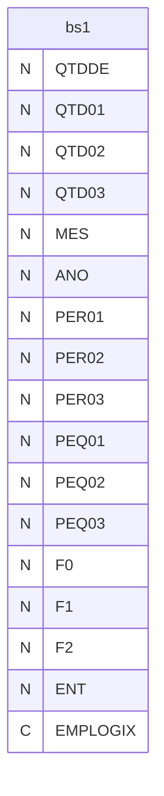

---
## Tabela DBF: `bs2`
> **Origem:** `bs2` (Driver: DBFCDX)

| Campo | Tipo | Tam | Dec |
| :--- | :--- | :--- | :--- |
| GRUPO | C | 12 | 0 |
| QTDDE | N | 12 | 0 |
| QTD01 | N | 12 | 0 |
| QTD02 | N | 12 | 0 |
| QTD03 | N | 12 | 0 |
| MES | N | 2 | 0 |
| ANO | N | 4 | 0 |
| PER01 | N | 7 | 2 |
| PER02 | N | 7 | 2 |
| PER03 | N | 7 | 2 |
| PEQ01 | N | 7 | 2 |
| PEQ02 | N | 7 | 2 |
| PEQ03 | N | 7 | 2 |
| F0 | N | 4 | 0 |
| F1 | N | 4 | 0 |
| F2 | N | 4 | 0 |
| ENT | N | 4 | 0 |
| EMPLOGIX | C | 2 | 0 |

**Indices vinculados:**
- Tag: `BS2-1` Expressao: `STR(ANO,4)+STR(MES,2)+GRUPO`

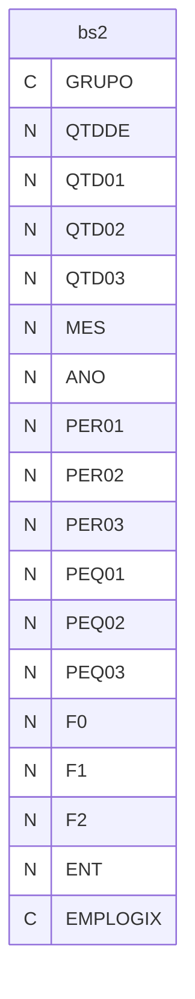

---
## Tabela DBF: `bs3`
> **Origem:** `bs3` (Driver: DBFCDX)

| Campo | Tipo | Tam | Dec |
| :--- | :--- | :--- | :--- |
| CODIGO | C | 12 | 0 |
| NOME | C | 30 | 0 |
| GRUPOUTL | C | 3 | 0 |
| ESTOQUE | N | 10 | 0 |
| ESTOQU3 | N | 10 | 0 |
| USO01 | N | 10 | 0 |
| USO02 | N | 10 | 0 |
| USO03 | N | 10 | 0 |
| USO04 | N | 10 | 0 |
| SAL01 | N | 10 | 0 |
| SAL02 | N | 10 | 0 |
| SAL03 | N | 10 | 0 |
| SAL04 | N | 10 | 0 |
| SA301 | N | 10 | 0 |
| SA302 | N | 10 | 0 |
| SA303 | N | 10 | 0 |
| SA304 | N | 10 | 0 |
| EMPLOGIX | C | 2 | 0 |

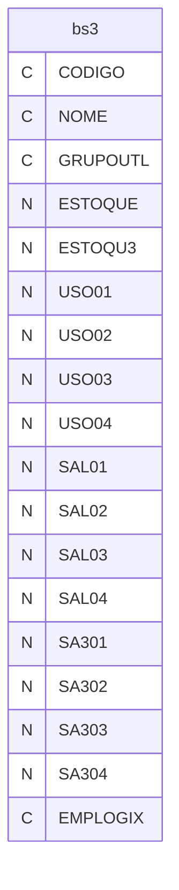

---
## Tabela DBF: `bs5`
> **Origem:** `bs5` (Driver: DBFCDX)

| Campo | Tipo | Tam | Dec |
| :--- | :--- | :--- | :--- |
| CLIENTE | N | 8 | 0 |
| COGCLI | C | 12 | 0 |
| GRUPO | C | 12 | 0 |
| CODIGO | C | 24 | 0 |
| NOME | C | 40 | 0 |
| QTDDE | N | 8 | 0 |
| QTD01 | N | 8 | 0 |
| QTD02 | N | 8 | 0 |
| QTD03 | N | 8 | 0 |
| MES | N | 2 | 0 |
| ANO | N | 4 | 0 |
| PER01 | N | 7 | 2 |
| PER02 | N | 7 | 2 |
| PER03 | N | 7 | 2 |
| PEQ01 | N | 7 | 2 |
| PEQ02 | N | 7 | 2 |
| PEQ03 | N | 7 | 2 |
| F0 | N | 4 | 0 |
| F1 | N | 4 | 0 |
| F2 | N | 4 | 0 |
| ENT | N | 4 | 0 |
| EMPLOGIX | C | 2 | 0 |

**Indices vinculados:**
- Tag: `BS5-1` Expressao: `STR(ANO,4)+STR(MES,2)+STR(CLIENTE,8)+CODIGO`
- Tag: `BS5-2` Expressao: `CODIGO+STR(ANO,4)+STR(MES,2)`

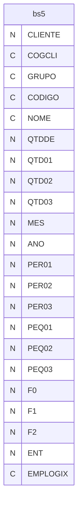

---
## Tabela DBF: `bs6`
> **Origem:** `bs6` (Driver: DBFCDX)

| Campo | Tipo | Tam | Dec |
| :--- | :--- | :--- | :--- |
| CLIENTE | N | 8 | 0 |
| COGCLI | C | 12 | 0 |
| GRUPO | C | 12 | 0 |
| NOME | C | 40 | 0 |
| QTDDE | N | 12 | 0 |
| QTD01 | N | 12 | 0 |
| QTD02 | N | 12 | 0 |
| QTD03 | N | 12 | 0 |
| MES | N | 2 | 0 |
| ANO | N | 4 | 0 |
| PER01 | N | 7 | 2 |
| PER02 | N | 7 | 2 |
| PER03 | N | 7 | 2 |
| PEQ01 | N | 7 | 2 |
| PEQ02 | N | 7 | 2 |
| PEQ03 | N | 7 | 2 |
| F0 | N | 4 | 0 |
| F1 | N | 4 | 0 |
| F2 | N | 4 | 0 |
| ENT | N | 4 | 0 |
| EMPLOGIX | C | 2 | 0 |

**Indices vinculados:**
- Tag: `BS6-1` Expressao: `STR(ANO,4)+STR(MES,2)+STR(CLIENTE,8)`

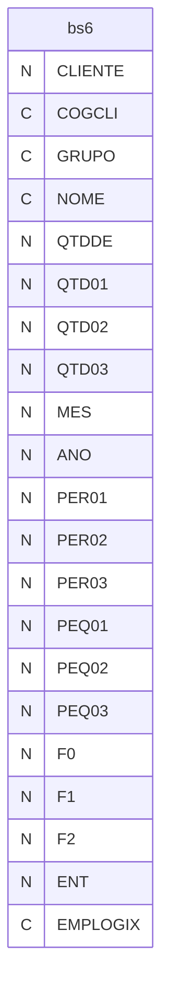

---
## Tabela DBF: `iacseq`
> **Origem:** `iacseq` (Driver: DBFCDX)

| Campo | Tipo | Tam | Dec |
| :--- | :--- | :--- | :--- |
| SEQ | N | 3 | 0 |
| DIAFIM | D | 8 | 0 |
| DIAINI | D | 8 | 0 |
| MES | N | 2 | 0 |
| ANO | N | 4 | 0 |
| DESCRI | C | 30 | 0 |
| ANUAL | C | 1 | 0 |
| SEMES | C | 1 | 0 |
| DESCR2 | C | 10 | 0 |

**Indices vinculados:**
- Tag: `SEQ` Expressao: `SEQ`

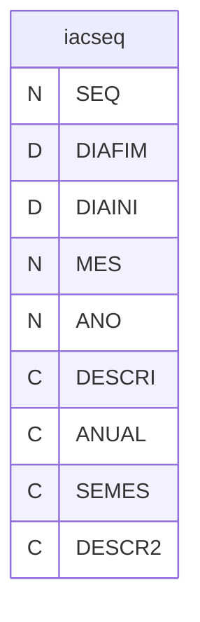

---
## Tabela DBF: `mm02iac`
> **Origem:** `mm02iac` (Driver: DBFCDX)

| Campo | Tipo | Tam | Dec |
| :--- | :--- | :--- | :--- |
| NUMERO | N | 8 | 0 |
| DATA | D | 8 | 0 |
| FORNECEDO | N | 5 | 0 |
| OS | N | 8 | 0 |
| QTDE | N | 10 | 3 |
| CODIGO | C | 24 | 0 |
| ENTREGA | D | 8 | 0 |
| QTDESAL | N | 10 | 3 |
| OSITEM | N | 8 | 0 |
| CODIGOINT | C | 24 | 0 |
| CODCLIENTE | C | 20 | 0 |
| PRECO | N | 12 | 5 |
| NOME | C | 25 | 0 |
| VALORMER | N | 12 | 2 |
| CLASSIPI | C | 10 | 0 |
| TIPOENT | C | 1 | 0 |
| CGC | C | 18 | 0 |
| COGNOME | C | 20 | 0 |
| EMPLOGIX | C | 2 | 0 |

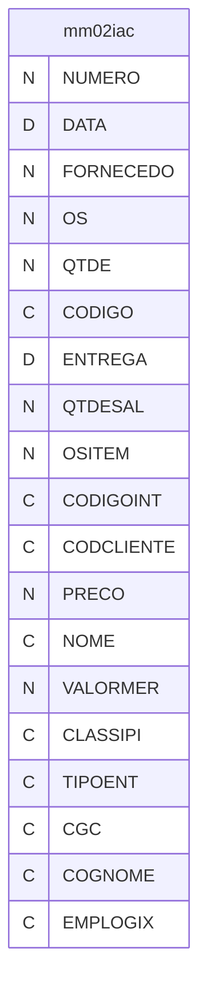

---
## Tabela DBF: `rd`
> **Origem:** `rd` (Driver: DBFCDX)

| Campo | Tipo | Tam | Dec |
| :--- | :--- | :--- | :--- |
| SEQ | N | 3 | 0 |
| DIAINI | D | 8 | 0 |
| DIAFIM | D | 8 | 0 |
| ANUAL | C | 1 | 0 |
| SEMES | C | 1 | 0 |
| DESCRI | C | 30 | 0 |
| DESCR2 | C | 10 | 0 |
| MES | N | 2 | 0 |
| ANO | N | 4 | 0 |
| EQPU | N | 10 | 2 |
| EQPE | N | 10 | 2 |
| EQPP | N | 10 | 2 |
| FUPU | N | 10 | 2 |
| FUPE | N | 10 | 2 |
| FUPP | N | 10 | 2 |
| EQHT | N | 10 | 2 |
| EQHP | N | 10 | 2 |
| EQH24 | N | 10 | 2 |
| EQHD | N | 10 | 2 |
| EQQP | N | 10 | 0 |
| FUHT | N | 10 | 2 |
| FUHP | N | 10 | 2 |
| FUHD | N | 10 | 2 |
| FUQP | N | 10 | 0 |
| PAHP | N | 10 | 2 |
| EQPERE | N | 10 | 2 |
| EQPPRE | N | 10 | 2 |
| EQPURE | N | 10 | 2 |
| EQPE24 | N | 10 | 2 |
| EQPP24 | N | 10 | 2 |
| EQPU24 | N | 10 | 2 |
| PRPE | N | 10 | 2 |

**Indices vinculados:**
- Tag: `RD` Expressao: `SEQ`
- Tag: `RD-2` Expressao: `STR(ANO,4)+STR(MES,2)`

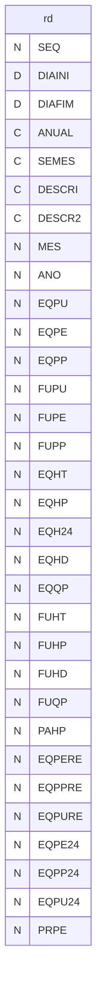

---
## Tabela DBF: `rde`
> **Origem:** `rde` (Driver: DBFCDX)

| Campo | Tipo | Tam | Dec |
| :--- | :--- | :--- | :--- |
| SEQ | N | 3 | 0 |
| NUMERO | C | 4 | 0 |
| NOME | C | 40 | 0 |
| HT | N | 10 | 2 |
| HP | N | 10 | 2 |
| HD | N | 10 | 2 |
| HDRE | N | 10 | 2 |
| HD24 | N | 10 | 2 |
| QP | N | 10 | 0 |
| MEDIA | N | 10 | 0 |
| PU | N | 10 | 2 |
| PE | N | 10 | 2 |
| PP | N | 10 | 2 |
| PE24 | N | 10 | 2 |
| PERE | N | 10 | 2 |
| PU24 | N | 10 | 2 |
| PURE | N | 10 | 2 |
| PP24 | N | 10 | 2 |
| PPRE | N | 10 | 2 |

**Indices vinculados:**
- Tag: `RDE` Expressao: `SEQ`

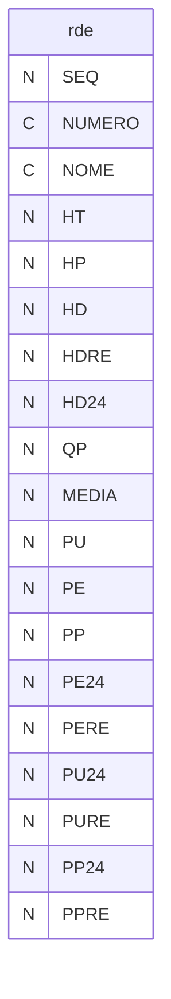

---
## Tabela DBF: `rdf`
> **Origem:** `rdf` (Driver: DBFCDX)

| Campo | Tipo | Tam | Dec |
| :--- | :--- | :--- | :--- |
| SEQ | N | 3 | 0 |
| NUMERO | N | 8 | 0 |
| NOME | C | 40 | 0 |
| HT | N | 10 | 2 |
| HP | N | 10 | 2 |
| HD | N | 10 | 2 |
| QP | N | 10 | 0 |
| MEDIA | N | 10 | 0 |
| PU | N | 10 | 2 |
| PE | N | 10 | 2 |
| PP | N | 10 | 2 |

**Indices vinculados:**
- Tag: `RDF` Expressao: `SEQ`

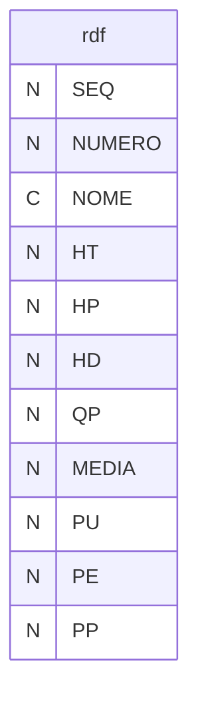

---
## Tabela DBF: `rdp`
> **Origem:** `rdp` (Driver: DBFCDX)

| Campo | Tipo | Tam | Dec |
| :--- | :--- | :--- | :--- |
| SEQ | N | 3 | 0 |
| NUMERO | C | 3 | 0 |
| NOME | C | 40 | 0 |
| HP | N | 10 | 2 |
| ANUAL | C | 1 | 0 |
| MES | N | 2 | 0 |

**Indices vinculados:**
- Tag: `RDP` Expressao: `SEQ`
- Tag: `RDP-2` Expressao: `NUMERO`

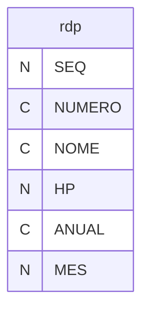

---
## Tabela DBF: `rdpd`
> **Origem:** `rdpd` (Driver: DBFCDX)

| Campo | Tipo | Tam | Dec |
| :--- | :--- | :--- | :--- |
| SEQ | N | 3 | 0 |
| NUMERO | C | 2 | 0 |
| NOME | C | 40 | 0 |
| HP | N | 10 | 2 |

**Indices vinculados:**
- Tag: `RDPD` Expressao: `SEQ`

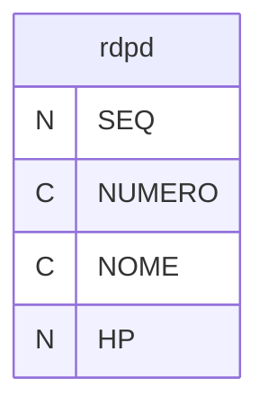

---
## Tabela DBF: `rdpt`
> **Origem:** `rdpt` (Driver: DBFCDX)

| Campo | Tipo | Tam | Dec |
| :--- | :--- | :--- | :--- |
| NUMERO | C | 3 | 0 |
| NOME | C | 40 | 0 |
| VAL01 | N | 10 | 2 |
| POS01 | N | 2 | 0 |
| POX01 | N | 2 | 0 |
| VAL02 | N | 10 | 2 |
| POS02 | N | 2 | 0 |
| POX02 | N | 2 | 0 |
| VAL03 | N | 10 | 2 |
| POS03 | N | 2 | 0 |
| POX03 | N | 2 | 0 |
| VAL04 | N | 10 | 2 |
| POS04 | N | 2 | 0 |
| POX04 | N | 2 | 0 |
| VAL05 | N | 10 | 2 |
| POS05 | N | 2 | 0 |
| POX05 | N | 2 | 0 |
| VAL06 | N | 10 | 2 |
| POS06 | N | 2 | 0 |
| POX06 | N | 2 | 0 |
| VAL07 | N | 10 | 2 |
| POS07 | N | 2 | 0 |
| POX07 | N | 2 | 0 |
| VAL08 | N | 10 | 2 |
| POS08 | N | 2 | 0 |
| POX08 | N | 2 | 0 |
| VAL09 | N | 10 | 2 |
| POS09 | N | 2 | 0 |
| POX09 | N | 2 | 0 |
| VAL10 | N | 10 | 2 |
| POS10 | N | 2 | 0 |
| POX10 | N | 2 | 0 |
| VAL11 | N | 10 | 2 |
| POS11 | N | 2 | 0 |
| POX11 | N | 2 | 0 |
| VAL12 | N | 10 | 2 |
| POS12 | N | 2 | 0 |
| POX12 | N | 2 | 0 |
| TOTAL | N | 12 | 2 |
| POS00 | N | 2 | 0 |
| POX00 | N | 2 | 0 |

**Indices vinculados:**
- Tag: `RDPT` Expressao: `NUMERO`
- Tag: `TOTAL` Expressao: `DESCEND(TOTAL)`
- Tag: `VAL01` Expressao: `DESCEND(VAL01)`
- Tag: `VAL02` Expressao: `DESCEND(VAL02)`
- Tag: `VAL03` Expressao: `DESCEND(VAL03)`
- Tag: `VAL04` Expressao: `DESCEND(VAL04)`
- Tag: `VAL05` Expressao: `DESCEND(VAL05)`
- Tag: `VAL06` Expressao: `DESCEND(VAL06)`
- Tag: `VAL07` Expressao: `DESCEND(VAL07)`
- Tag: `VAL08` Expressao: `DESCEND(VAL08)`
- Tag: `VAL09` Expressao: `DESCEND(VAL09)`
- Tag: `VAL10` Expressao: `DESCEND(VAL10)`
- Tag: `VAL11` Expressao: `DESCEND(VAL11)`
- Tag: `VAL12` Expressao: `DESCEND(VAL12)`

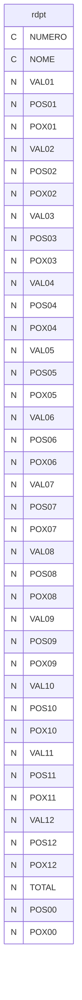

---
## Tabela DBF: `rdt`
> **Origem:** `rdt` (Driver: DBFCDX)

| Campo | Tipo | Tam | Dec |
| :--- | :--- | :--- | :--- |
| CODIGO | C | 24 | 0 |
| SEQ | N | 3 | 0 |
| SSQ | N | 3 | 0 |
| MES | N | 2 | 0 |
| ANO | N | 4 | 0 |
| PQTDDE | N | 7 | 0 |
| PHORAS | N | 7 | 2 |
| QTDDE | N | 9 | 2 |
| PADRAO | N | 5 | 0 |
| PADRA4 | N | 5 | 0 |
| MEDIA | N | 7 | 2 |
| MEDI4 | N | 7 | 2 |
| SIMETRICA | L | 1 | 0 |
| DATAAPU | D | 8 | 0 |

**Indices vinculados:**
- Tag: `RDT` Expressao: `CODIGO+STR(SEQ,3)+STR(SSQ,3)+STR(ANO,4)+STR(MES,2)`

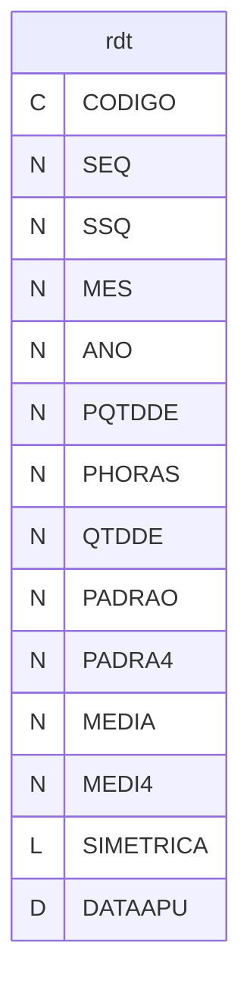

---
## Tabela DBF: `rdtbx`
> **Origem:** `rdtbx` (Driver: DBFCDX)

| Campo | Tipo | Tam | Dec |
| :--- | :--- | :--- | :--- |
| CODIGO | C | 24 | 0 |
| SEQ | N | 3 | 0 |
| SSQ | N | 3 | 0 |
| MES | N | 2 | 0 |
| ANO | N | 4 | 0 |
| PQTDDE | N | 7 | 0 |
| PHORAS | N | 6 | 2 |
| QTDDE | N | 9 | 2 |
| PADRAO | N | 5 | 0 |
| PADRA4 | N | 5 | 0 |
| MEDIA | N | 6 | 2 |
| MEDI4 | N | 6 | 2 |
| SIMETRICA | L | 1 | 0 |
| DATAAPU | D | 8 | 0 |
| DATABAI | D | 8 | 0 |

**Indices vinculados:**
- Tag: `RDTBX` Expressao: `CODIGO+STR(SEQ,3)+STR(SSQ,3)+STR(ANO,4)+STR(MES,2)`

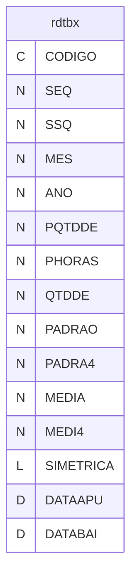

---
