# Dicionario de Estruturas de Dados do Projeto
> Varredura automatica realizada em: 09/09/2026

## Tabela DBF: `curemi`
> **Origem:** `curemi` (Driver: DBFCDX)

| Campo | Tipo | Tam | Dec |
| :--- | :--- | :--- | :--- |
| NUMERO | N | 5 | 0 |
| CURSO | C | 20 | 0 |
| DESCUR | C | 120 | 0 |

**Indices vinculados:**
- Tag: `CUREMI` Expressao: `STR(NUMERO,5)+CURSO`

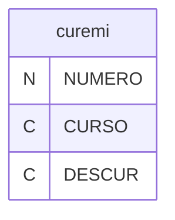

---
## Tabela DBF: `curemp`
> **Origem:** `curemp` (Driver: DBFCDX)

| Campo | Tipo | Tam | Dec |
| :--- | :--- | :--- | :--- |
| NUMERO | N | 5 | 0 |
| COGNOME | C | 15 | 0 |
| NOME | C | 40 | 0 |
| ENDERECO | C | 40 | 0 |
| BAIRRO | C | 30 | 0 |
| CIDADE | C | 30 | 0 |
| ESTADO | C | 2 | 0 |
| CEP | C | 9 | 0 |
| DDD | C | 2 | 0 |
| TELEFONE | C | 12 | 0 |
| RAMAL | C | 4 | 0 |
| CONTATO | C | 22 | 0 |
| DDDFAX | C | 2 | 0 |
| TELEFAX | C | 12 | 0 |
| CGC | C | 18 | 0 |
| IESTADUAL | C | 16 | 0 |
| DDD1 | C | 2 | 0 |
| TELEFONE1 | C | 12 | 0 |
| RAMAL1 | C | 4 | 0 |
| CONTATO1 | C | 22 | 0 |
| PESSOA | C | 1 | 0 |
| SITE | C | 30 | 0 |
| EMAIL | C | 30 | 0 |

**Indices vinculados:**
- Tag: `CUREMP` Expressao: `NUMERO`
- Tag: `CUREMP-2` Expressao: `COGNOME`

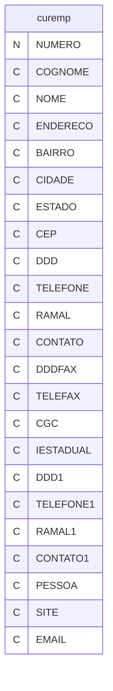

---
## Tabela DBF: `curgrp`
> **Origem:** `curgrp` (Driver: DBFCDX)

| Campo | Tipo | Tam | Dec |
| :--- | :--- | :--- | :--- |
| GRUPO | C | 5 | 0 |
| NOME | C | 40 | 0 |

**Indices vinculados:**
- Tag: `CURGRP` Expressao: `GRUPO`

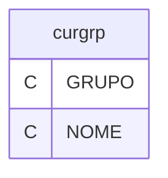

---
## Tabela DBF: `curso`
> **Origem:** `curso` (Driver: DBFCDX)

| Campo | Tipo | Tam | Dec |
| :--- | :--- | :--- | :--- |
| CURSO | C | 20 | 0 |
| GRUPO | C | 5 | 0 |
| DESCUR | C | 120 | 0 |
| CARGA | N | 8 | 2 |
| CERT | C | 1 | 0 |
| TIPCUR | C | 1 | 0 |

**Indices vinculados:**
- Tag: `CURSO` Expressao: `CURSO`
- Tag: `CURSO-2` Expressao: `DESCUR`
- Tag: `CURSO-3` Expressao: `GRUPO+CURSO`

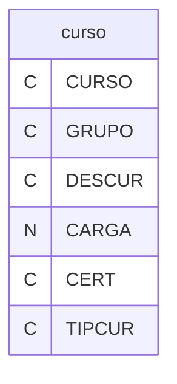

---
## Tabela DBF: `mp02c`
> **Origem:** `mp02c` (Driver: DBFCDX)

| Campo | Tipo | Tam | Dec |
| :--- | :--- | :--- | :--- |
| CODIGO | C | 12 | 0 |
| CURSO | C | 20 | 0 |
| TIPO | C | 1 | 0 |

**Indices vinculados:**
- Tag: `MP02C` Expressao: `CODIGO`

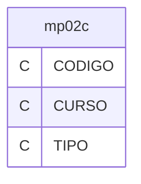

---
## Tabela DBF: `mp02p`
> **Origem:** `mp02p` (Driver: DBFCDX)

| Campo | Tipo | Tam | Dec |
| :--- | :--- | :--- | :--- |
| CODIGO | C | 12 | 0 |
| CURSO | C | 20 | 0 |
| TIPO | C | 1 | 0 |

**Indices vinculados:**
- Tag: `MPO2P` Expressao: `CODIGO`

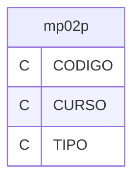

---
## Tabela DBF: `mp06`
> **Origem:** `mp06` (Driver: DBFCDX)

| Campo | Tipo | Tam | Dec |
| :--- | :--- | :--- | :--- |
| CODIGO | C | 12 | 0 |
| NOME | C | 30 | 0 |

**Indices vinculados:**
- Tag: `MP06-1` Expressao: `CODIGO`
- Tag: `MP06-2` Expressao: `NOME`

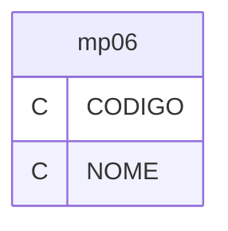

---
## Tabela DBF: `mp06c`
> **Origem:** `mp06c` (Driver: DBFCDX)

| Campo | Tipo | Tam | Dec |
| :--- | :--- | :--- | :--- |
| CODIGO | C | 12 | 0 |
| CURSO | C | 20 | 0 |

**Indices vinculados:**
- Tag: `MP06C` Expressao: `CODIGO`

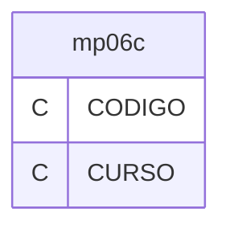

---
## Tabela DBF: `procedim`
> **Origem:** `procedim` (Driver: DBFCDX)

| Campo | Tipo | Tam | Dec |
| :--- | :--- | :--- | :--- |
| CURSO | C | 20 | 0 |
| DESCUR | C | 120 | 0 |
| TIPO | C | 1 | 0 |
| GRUPO | C | 5 | 0 |

**Indices vinculados:**
- Tag: `PROCEDIM` Expressao: `CURSO`
- Tag: `PROCEDI2` Expressao: `DESCUR`
- Tag: `PROCEDI3` Expressao: `GRUPO+CURSO`

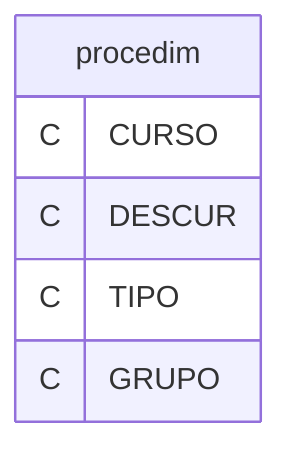

---
## Tabela DBF: `rhabcod`
> **Origem:** `rhabcod` (Driver: DBFCDX)

| Campo | Tipo | Tam | Dec |
| :--- | :--- | :--- | :--- |
| CODIGO | C | 2 | 0 |
| NOME | C | 40 | 0 |

**Indices vinculados:**
- Tag: `RHABCOD` Expressao: `CODIGO`

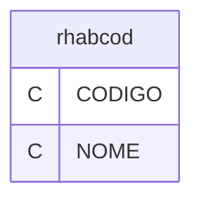

---
## Tabela DBF: `rhesc`
> **Origem:** `rhesc` (Driver: DBFCDX)

| Campo | Tipo | Tam | Dec |
| :--- | :--- | :--- | :--- |
| CODIGO | C | 2 | 0 |
| ESCOLA | C | 1 | 0 |
| CODIGOOLD | C | 2 | 0 |
| DESCRI | C | 70 | 0 |

**Indices vinculados:**
- Tag: `RHESC` Expressao: `CODIGO`

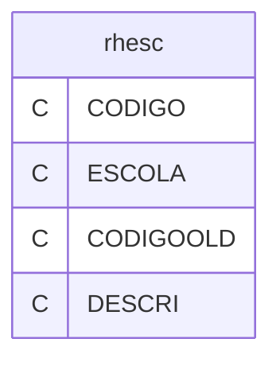

---
## Tabela DBF: `rhsel`
> **Origem:** `rhsel` (Driver: DBFCDX)

| Campo | Tipo | Tam | Dec |
| :--- | :--- | :--- | :--- |
| EMPRESA | N | 3 | 0 |
| NUMERO | N | 8 | 0 |
| NOME | C | 60 | 0 |
| PIS | C | 11 | 0 |
| CPF | C | 14 | 0 |
| NASC | D | 8 | 0 |
| NASCIBGE | C | 7 | 0 |
| NASCPAIS | C | 4 | 0 |
| RG | C | 12 | 0 |
| RGUF | C | 2 | 0 |
| RGEMIS | C | 6 | 0 |
| RGTIP | C | 3 | 0 |
| ENDER | C | 40 | 0 |
| ENDNUM | C | 10 | 0 |
| ENDCOMPL | C | 30 | 0 |
| ENDTIP | C | 3 | 0 |
| BAIRRO | C | 20 | 0 |
| IBGE | C | 7 | 0 |
| CIDADE | C | 30 | 0 |
| ESTADO | C | 2 | 0 |
| CEP | C | 9 | 0 |
| CODMP02 | C | 12 | 0 |
| INDICACAO | C | 30 | 0 |
| INDIPARAR | C | 10 | 0 |
| COMPARECE | L | 1 | 0 |
| APROVADO | L | 1 | 0 |
| PROCESSO | L | 1 | 0 |
| PROCOBS | C | 40 | 0 |
| OBS | C | 80 | 0 |
| SEXO | C | 1 | 0 |
| FONE | C | 14 | 0 |
| CELULAR | C | 14 | 0 |
| FONEREC | C | 14 | 0 |
| CONTATO | C | 30 | 0 |
| EMAIL | C | 50 | 0 |
| FOR01 | C | 100 | 0 |
| FOR02 | C | 100 | 0 |
| FOR03 | C | 100 | 0 |
| APF01 | C | 100 | 0 |
| APF02 | C | 100 | 0 |
| APF03 | C | 100 | 0 |
| PROFIS | C | 7 | 0 |
| SERIE | C | 5 | 0 |
| CTPSUF | C | 2 | 0 |
| EX01EMP | C | 40 | 0 |
| EX01RAM | C | 12 | 0 |
| EX01TEL | C | 12 | 0 |
| EX01DEM | D | 8 | 0 |
| EX01ADM | D | 8 | 0 |
| EX01FUN | C | 50 | 0 |
| EX01ULT | N | 12 | 2 |
| EX01AT1 | C | 100 | 0 |
| EX01AT2 | C | 100 | 0 |
| EX02EMP | C | 40 | 0 |
| EX02RAM | C | 12 | 0 |
| EX02TEL | C | 12 | 0 |
| EX02DEM | D | 8 | 0 |
| EX02ADM | D | 8 | 0 |
| EX02FUN | C | 50 | 0 |
| EX02ULT | N | 12 | 2 |
| EX02AT1 | C | 100 | 0 |
| EX02AT2 | C | 100 | 0 |
| EX03EMP | C | 40 | 0 |
| EX03RAM | C | 12 | 0 |
| EX03TEL | C | 12 | 0 |
| EX03DEM | D | 8 | 0 |
| EX03ADM | D | 8 | 0 |
| EX03FUN | C | 50 | 0 |
| EX03ULT | N | 12 | 2 |
| EX03AT1 | C | 100 | 0 |
| EX03AT2 | C | 100 | 0 |
| FUNC01 | C | 50 | 0 |
| FUNC02 | C | 50 | 0 |
| SALARIO | N | 12 | 2 |
| OBSEN01 | C | 100 | 0 |
| OBSEN02 | C | 100 | 0 |
| OBSEN03 | C | 100 | 0 |
| NUMREGANT | N | 8 | 0 |
| FUNCAO | N | 8 | 0 |
| NUMEMPANT | N | 3 | 0 |
| DATTRANSF | D | 8 | 0 |
| ESCRAIS | C | 2 | 0 |
| SITUACAO | C | 2 | 0 |
| CNH | C | 11 | 0 |
| CATCNH | C | 2 | 0 |
| VALCNH | D | 8 | 0 |
| EXPCNH | D | 8 | 0 |
| OC | C | 10 | 0 |
| OCVAL | D | 8 | 0 |
| OCEXP | D | 8 | 0 |
| OCEMI | C | 10 | 0 |
| BANCO | C | 3 | 0 |
| AGENCIA | C | 7 | 0 |
| CONTA | C | 12 | 0 |
| CONTAFGTS | C | 11 | 0 |
| TITULO | C | 14 | 0 |
| TITUZONA | C | 3 | 0 |
| TITUSECA | C | 3 | 0 |
| PAI | C | 40 | 0 |
| MAE | C | 40 | 0 |
| CNS | C | 15 | 0 |
| DEFICI | C | 1 | 0 |
| EVINC | C | 3 | 0 |
| TIPO | C | 1 | 0 |
| CCUSTO | N | 6 | 0 |
| UNIFUN | C | 10 | 0 |
| APOSENT | C | 1 | 0 |
| APOSEND | D | 8 | 0 |
| ESTCIVIL | C | 1 | 0 |
| RESERV | C | 12 | 0 |
| RESECAT | C | 1 | 0 |
| RGDATA | D | 8 | 0 |
| CTPSDATA | D | 8 | 0 |
| ANONASCI | N | 4 | 0 |
| RACS | C | 1 | 0 |
| DEMITIDO | D | 8 | 0 |
| FGTS | D | 8 | 0 |
| ADMITIDO | C | 10 | 0 |
| OCUF | C | 2 | 0 |
| RICUF | C | 2 | 0 |
| RICEXP | D | 8 | 0 |
| RIC | C | 32 | 0 |
| RICEMI | C | 3 | 0 |

**Indices vinculados:**
- Tag: `RHSEL-1` Expressao: `STR(EMPRESA,3)+STR(NUMERO,8)`
- Tag: `RHSEL-2` Expressao: `NOME`
- Tag: `RHSEL-3` Expressao: `STR(FUNCAO,8)+STR(EMPRESA,3)`

```mermaid
erDiagram
    rhsel {
        N EMPRESA
        N NUMERO
        C NOME
        C PIS
        C CPF
        D NASC
        C NASCIBGE
        C NASCPAIS
        C RG
        C RGUF
        C RGEMIS
        C RGTIP
        C ENDER
        C ENDNUM
        C ENDCOMPL
        C ENDTIP
        C BAIRRO
        C IBGE
        C CIDADE
        C ESTADO
        C CEP
        C CODMP02
        C INDICACAO
        C INDIPARAR
        L COMPARECE
        L APROVADO
        L PROCESSO
        C PROCOBS
        C OBS
        C SEXO
        C FONE
        C CELULAR
        C FONEREC
        C CONTATO
        C EMAIL
        C FOR01
        C FOR02
        C FOR03
        C APF01
        C APF02
        C APF03
        C PROFIS
        C SERIE
        C CTPSUF
        C EX01EMP
        C EX01RAM
        C EX01TEL
        D EX01DEM
        D EX01ADM
        C EX01FUN
        N EX01ULT
        C EX01AT1
        C EX01AT2
        C EX02EMP
        C EX02RAM
        C EX02TEL
        D EX02DEM
        D EX02ADM
        C EX02FUN
        N EX02ULT
        C EX02AT1
        C EX02AT2
        C EX03EMP
        C EX03RAM
        C EX03TEL
        D EX03DEM
        D EX03ADM
        C EX03FUN
        N EX03ULT
        C EX03AT1
        C EX03AT2
        C FUNC01
        C FUNC02
        N SALARIO
        C OBSEN01
        C OBSEN02
        C OBSEN03
        N NUMREGANT
        N FUNCAO
        N NUMEMPANT
        D DATTRANSF
        C ESCRAIS
        C SITUACAO
        C CNH
        C CATCNH
        D VALCNH
        D EXPCNH
        C OC
        D OCVAL
        D OCEXP
        C OCEMI
        C BANCO
        C AGENCIA
        C CONTA
        C CONTAFGTS
        C TITULO
        C TITUZONA
        C TITUSECA
        C PAI
        C MAE
        C CNS
        C DEFICI
        C EVINC
        C TIPO
        N CCUSTO
        C UNIFUN
        C APOSENT
        D APOSEND
        C ESTCIVIL
        C RESERV
        C RESECAT
        D RGDATA
        D CTPSDATA
        N ANONASCI
        C RACS
        D DEMITIDO
        D FGTS
        C ADMITIDO
        C OCUF
        C RICUF
        D RICEXP
        C RIC
        C RICEMI
    }
```

---
## Tabela DBF: `rhselhist`
> **Origem:** `rhselhist` (Driver: DBFCDX)

| Campo | Tipo | Tam | Dec |
| :--- | :--- | :--- | :--- |
| EMPRESA | N | 3 | 0 |
| NUMERO | N | 8 | 0 |
| NOME | C | 40 | 0 |
| ENDER | C | 40 | 0 |
| NASC | D | 8 | 0 |
| BAIRRO | C | 20 | 0 |
| CIDADE | C | 30 | 0 |
| ESTADO | C | 2 | 0 |
| CEP | C | 9 | 0 |
| CODMP02 | C | 12 | 0 |
| INDICACAO | C | 30 | 0 |
| INDIPARAR | C | 10 | 0 |
| COMPARECE | L | 1 | 0 |
| APROVADO | L | 1 | 0 |
| PROCESSO | L | 1 | 0 |
| PROCOBS | C | 40 | 0 |
| OBS | C | 80 | 0 |
| SEXO | C | 1 | 0 |
| CIVIL | N | 1 | 0 |
| FONE | C | 12 | 0 |
| CELULAR | C | 12 | 0 |
| FONEREC | C | 12 | 0 |
| CONTATO | C | 30 | 0 |
| EMAIL | C | 50 | 0 |
| FOR01 | C | 100 | 0 |
| FOR02 | C | 100 | 0 |
| FOR03 | C | 100 | 0 |
| APF01 | C | 100 | 0 |
| APF02 | C | 100 | 0 |
| APF03 | C | 100 | 0 |
| RG | C | 12 | 0 |
| CPF | C | 14 | 0 |
| PIS | C | 11 | 0 |
| PROFIS | C | 7 | 0 |
| SERIE | C | 5 | 0 |
| CTPSUF | C | 2 | 0 |
| CATEGORIA | C | 2 | 0 |
| EX01EMP | C | 40 | 0 |
| EX01RAM | C | 12 | 0 |
| EX01TEL | C | 12 | 0 |
| EX01DEM | D | 8 | 0 |
| EX01ADM | D | 8 | 0 |
| EX01FUN | C | 50 | 0 |
| EX01ULT | N | 12 | 2 |
| EX01AT1 | C | 100 | 0 |
| EX01AT2 | C | 100 | 0 |
| EX02EMP | C | 40 | 0 |
| EX02RAM | C | 12 | 0 |
| EX02TEL | C | 12 | 0 |
| EX02DEM | D | 8 | 0 |
| EX02ADM | D | 8 | 0 |
| EX02FUN | C | 50 | 0 |
| EX02ULT | N | 12 | 2 |
| EX02AT1 | C | 100 | 0 |
| EX02AT2 | C | 100 | 0 |
| EX03EMP | C | 40 | 0 |
| EX03RAM | C | 12 | 0 |
| EX03TEL | C | 12 | 0 |
| EX03DEM | D | 8 | 0 |
| EX03ADM | D | 8 | 0 |
| EX03FUN | C | 50 | 0 |
| EX03ULT | N | 12 | 2 |
| EX03AT1 | C | 100 | 0 |
| EX03AT2 | C | 100 | 0 |
| FUNC01 | C | 50 | 0 |
| FUNC02 | C | 50 | 0 |
| SALARIO | N | 12 | 2 |
| OBSEN01 | C | 100 | 0 |
| OBSEN02 | C | 100 | 0 |
| OBSEN03 | C | 100 | 0 |
| NUMREGANT | N | 8 | 0 |
| FUNCAO | N | 8 | 0 |
| NUMEMPANT | N | 3 | 0 |
| DATTRANSF | D | 8 | 0 |
| ESCRAIS | C | 2 | 0 |

**Indices vinculados:**
- Tag: `RHSEL-1` Expressao: `STR(EMPRESA,3)+STR(NUMERO,8)`
- Tag: `RHSEL-2` Expressao: `NOME`
- Tag: `RHSEL-3` Expressao: `STR(FUNCAO,8)+STR(EMPRESA,3)`

```mermaid
erDiagram
    rhselhist {
        N EMPRESA
        N NUMERO
        C NOME
        C ENDER
        D NASC
        C BAIRRO
        C CIDADE
        C ESTADO
        C CEP
        C CODMP02
        C INDICACAO
        C INDIPARAR
        L COMPARECE
        L APROVADO
        L PROCESSO
        C PROCOBS
        C OBS
        C SEXO
        N CIVIL
        C FONE
        C CELULAR
        C FONEREC
        C CONTATO
        C EMAIL
        C FOR01
        C FOR02
        C FOR03
        C APF01
        C APF02
        C APF03
        C RG
        C CPF
        C PIS
        C PROFIS
        C SERIE
        C CTPSUF
        C CATEGORIA
        C EX01EMP
        C EX01RAM
        C EX01TEL
        D EX01DEM
        D EX01ADM
        C EX01FUN
        N EX01ULT
        C EX01AT1
        C EX01AT2
        C EX02EMP
        C EX02RAM
        C EX02TEL
        D EX02DEM
        D EX02ADM
        C EX02FUN
        N EX02ULT
        C EX02AT1
        C EX02AT2
        C EX03EMP
        C EX03RAM
        C EX03TEL
        D EX03DEM
        D EX03ADM
        C EX03FUN
        N EX03ULT
        C EX03AT1
        C EX03AT2
        C FUNC01
        C FUNC02
        N SALARIO
        C OBSEN01
        C OBSEN02
        C OBSEN03
        N NUMREGANT
        N FUNCAO
        N NUMEMPANT
        D DATTRANSF
        C ESCRAIS
    }
```

---
