# Dicionario de Estruturas de Dados do Projeto
> Varredura automatica realizada em: 09/09/2026

## Tabela DBF: `sint`
> **Origem:** `sint` (Driver: DBFCDX)

| Campo | Tipo | Tam | Dec |
| :--- | :--- | :--- | :--- |
| REG | C | 2 | 0 |

**Indices vinculados:**
- Tag: `REGISTRO` Expressao: `REG`

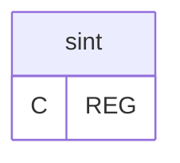

---
## Tabela DBF: `sint10`
> **Origem:** `sint10` (Driver: DBFCDX)

| Campo | Tipo | Tam | Dec |
| :--- | :--- | :--- | :--- |
| TIPO | C | 2 | 0 |
| CGC | C | 14 | 0 |
| IE | C | 14 | 0 |
| NOME | C | 35 | 0 |
| MUNICIPIO | C | 30 | 0 |
| UF | C | 2 | 0 |
| FAX | C | 10 | 0 |
| DATAINI | D | 8 | 0 |
| DATAFIM | D | 8 | 0 |
| CONVENIO | C | 1 | 0 |
| NATUREZA | N | 1 | 0 |
| FINALIDADE | C | 1 | 0 |

**Indices vinculados:**
- Tag: `CGC` Expressao: `CGC`

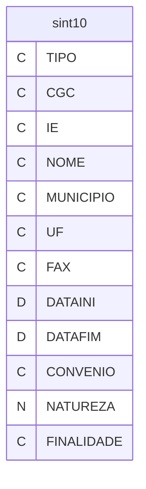

---
## Tabela DBF: `sint11`
> **Origem:** `sint11` (Driver: DBFCDX)

| Campo | Tipo | Tam | Dec |
| :--- | :--- | :--- | :--- |
| TIPO | C | 2 | 0 |
| LOGRADOURO | C | 34 | 0 |
| NUMERO | N | 5 | 0 |
| COMPL | C | 22 | 0 |
| BAIRRO | C | 15 | 0 |
| CEP | C | 8 | 0 |
| CONTATO | C | 28 | 0 |
| TELEFONE | C | 12 | 0 |

**Indices vinculados:**
- Tag: `CEP` Expressao: `CEP`

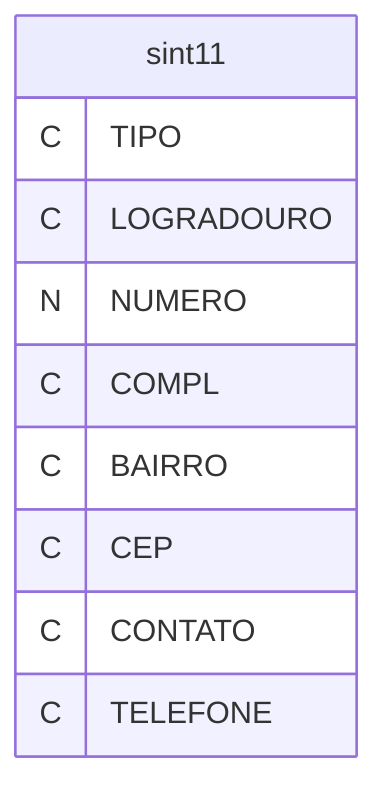

---
## Tabela DBF: `sint50`
> **Origem:** `sint50` (Driver: DBFCDX)

| Campo | Tipo | Tam | Dec |
| :--- | :--- | :--- | :--- |
| TIPO | C | 2 | 0 |
| CGC | C | 18 | 0 |
| IE | C | 20 | 0 |
| DATA | D | 8 | 0 |
| UF | C | 2 | 0 |
| MODELO | N | 2 | 0 |
| SERIE | C | 3 | 0 |
| SUB | C | 2 | 0 |
| NUMERO | N | 8 | 0 |
| CFOP | C | 4 | 0 |
| VALORTOT | N | 10 | 2 |
| BASE | N | 10 | 2 |
| VALOR | N | 10 | 2 |
| ISENTA | N | 10 | 2 |
| OUTRAS | N | 10 | 2 |
| ALIQUOTA | N | 5 | 2 |
| SITUACAO | C | 1 | 0 |
| TIPONF | C | 1 | 0 |
| OBS | N | 10 | 2 |
| EMITENTE | C | 1 | 0 |
| FORNECEDO | N | 8 | 0 |
| TIPOCLI | C | 1 | 0 |

**Indices vinculados:**
- Tag: `SINT50-1` Expressao: `DTOS(DATA)+STR(NUMERO,8)`
- Tag: `SINT50-2` Expressao: `STR(NUMERO,8)+TIPONF`

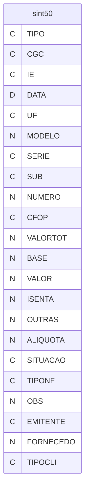

---
## Tabela DBF: `sint51`
> **Origem:** `sint51` (Driver: DBFCDX)

| Campo | Tipo | Tam | Dec |
| :--- | :--- | :--- | :--- |
| TIPO | C | 2 | 0 |
| CGC | C | 18 | 0 |
| IE | C | 20 | 0 |
| DATA | D | 8 | 0 |
| UF | C | 2 | 0 |
| MODELO | N | 2 | 0 |
| SERIE | C | 3 | 0 |
| SUB | C | 2 | 0 |
| NUMERO | N | 8 | 0 |
| CFOP | C | 4 | 0 |
| VALORTOT | N | 10 | 2 |
| BASE | N | 10 | 2 |
| VALOR | N | 10 | 2 |
| ISENTA | N | 10 | 2 |
| OUTRAS | N | 10 | 2 |
| ALIQUOTA | N | 5 | 2 |
| SITUACAO | C | 1 | 0 |
| TIPONF | C | 1 | 0 |
| OBS | N | 10 | 2 |
| FORNECEDO | N | 8 | 0 |
| TIPOCLI | C | 1 | 0 |
| BRANCOS | C | 1 | 0 |

**Indices vinculados:**
- Tag: `SINT51-1` Expressao: `DTOS(DATA)+STR(NUMERO,8)`
- Tag: `SINT51-2` Expressao: `STR(NUMERO,8)+TIPONF`

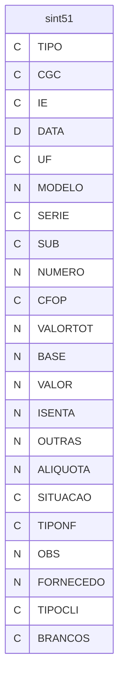

---
## Tabela DBF: `sint53`
> **Origem:** `sint53` (Driver: DBFCDX)

| Campo | Tipo | Tam | Dec |
| :--- | :--- | :--- | :--- |
| TIPO | C | 2 | 0 |
| CGC | C | 18 | 0 |
| IE | C | 20 | 0 |
| DATA | D | 8 | 0 |
| UF | C | 2 | 0 |
| MODELO | N | 2 | 0 |
| SERIE | C | 3 | 0 |
| SUB | C | 2 | 0 |
| NUMERO | N | 8 | 0 |
| CFOP | C | 4 | 0 |
| VALORTOT | N | 10 | 2 |
| BASE | N | 10 | 2 |
| VALOR | N | 10 | 2 |
| ISENTA | N | 10 | 2 |
| OUTRAS | N | 10 | 2 |
| ALIQUOTA | N | 5 | 2 |
| SITUACAO | C | 1 | 0 |
| TIPONF | C | 1 | 0 |
| OBS | N | 10 | 2 |
| ANTECIPA | C | 1 | 0 |
| DESPESAS | N | 10 | 2 |
| FORNECEDO | N | 8 | 0 |
| EMITENTE | C | 1 | 0 |
| TIPOCLI | C | 1 | 0 |

**Indices vinculados:**
- Tag: `SINT53-1` Expressao: `DTOS(DATA)+STR(NUMERO,8)`
- Tag: `SINT53-2` Expressao: `STR(NUMERO,8)+TIPONF`

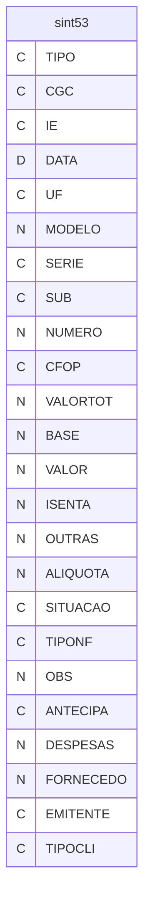

---
## Tabela DBF: `sint54`
> **Origem:** `sint54` (Driver: DBFCDX)

| Campo | Tipo | Tam | Dec |
| :--- | :--- | :--- | :--- |
| TIPO | C | 2 | 0 |
| CGC | C | 18 | 0 |
| MODELO | N | 2 | 0 |
| SERIE | C | 3 | 0 |
| NUMERO | N | 8 | 0 |
| CFOP | C | 4 | 0 |
| SITUACAO | N | 3 | 0 |
| ITEM | N | 3 | 0 |
| CODIGORED | C | 14 | 0 |
| QTDE | N | 11 | 3 |
| VALORMER | N | 10 | 2 |
| DESCONTO | N | 10 | 2 |
| BASEICM | N | 10 | 2 |
| BASESUB | N | 10 | 2 |
| VALORIPI | N | 10 | 2 |
| ICM | N | 5 | 2 |
| TIPOENT | C | 1 | 0 |
| CODIGO | C | 24 | 0 |
| TIPONF | C | 1 | 0 |
| TIPOCLI | C | 1 | 0 |
| FORNECEDO | N | 8 | 0 |
| UF | C | 2 | 0 |
| SUB | C | 2 | 0 |
| DATA | D | 8 | 0 |

**Indices vinculados:**
- Tag: `SINT54-1` Expressao: `CGC+SERIE+SUB+STR(NUMERO,8)+STR(ITEM,3)`
- Tag: `SINT54-2` Expressao: `STR(NUMERO,8)+TIPONF`
- Tag: `SINT54-3` Expressao: `CODIGORED`
- Tag: `SINT54-4` Expressao: `CODIGO`
- Tag: `SINT54-5` Expressao: `FORNECEDO`
- Tag: `SINT54-6` Expressao: `STR(NUMERO,8)+CGC`

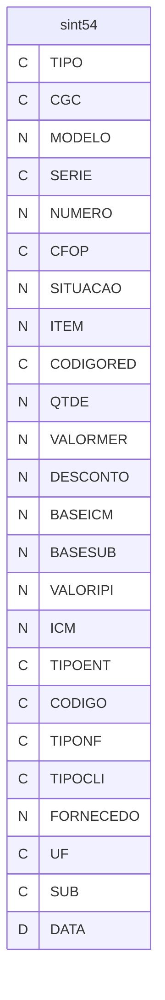

---
## Tabela DBF: `sint55`
> **Origem:** `sint55` (Driver: DBFCDX)

| Campo | Tipo | Tam | Dec |
| :--- | :--- | :--- | :--- |
| TIPO | C | 2 | 0 |
| CGC | C | 14 | 0 |
| IE | C | 14 | 0 |
| DTGNRE | D | 8 | 0 |
| UF | C | 2 | 0 |
| UFFAVOR | C | 2 | 0 |
| BANCO | C | 3 | 0 |
| AGENCIA | C | 4 | 0 |
| NUMGNRE | C | 20 | 0 |
| VALGNRE | N | 13 | 2 |
| DTVENC | D | 8 | 0 |
| MESANOREF | C | 6 | 0 |
| CONVENIO | C | 30 | 0 |

**Indices vinculados:**
- Tag: `NUMGNRE` Expressao: `NUMGNRE`

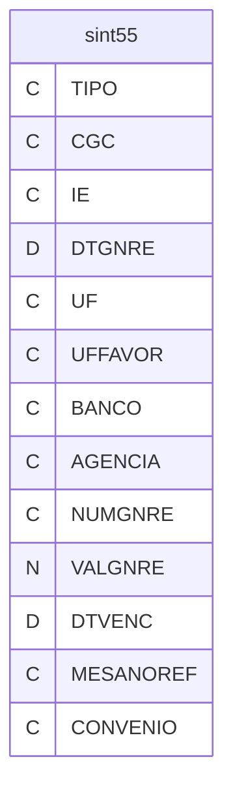

---
## Tabela DBF: `sint56`
> **Origem:** `sint56` (Driver: DBFCDX)

| Campo | Tipo | Tam | Dec |
| :--- | :--- | :--- | :--- |
| REG | C | 2 | 0 |
| CNPJCPF | C | 14 | 0 |
| MODELO | N | 2 | 0 |
| SERIE | C | 3 | 0 |
| NUMERO | C | 6 | 0 |
| CFOP | C | 4 | 0 |
| CST | N | 3 | 0 |
| NRITEM | N | 3 | 0 |
| CODPROD | C | 14 | 0 |
| TPOPERACAO | N | 1 | 0 |
| CNPJCONC | N | 14 | 0 |
| ALQIPI | C | 4 | 0 |
| CHASSI | C | 17 | 0 |
| BRANCOS | C | 39 | 0 |

**Indices vinculados:**
- Tag: `CNPJNUMERO` Expressao: `CNPJCPF+NUMERO`

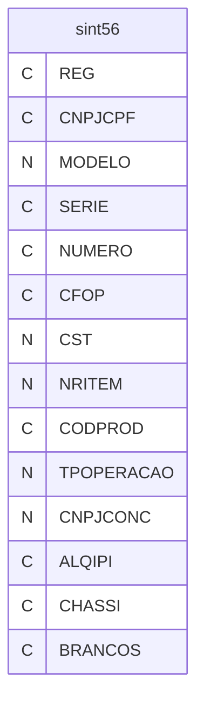

---
## Tabela DBF: `sint60a`
> **Origem:** `sint60a` (Driver: DBFCDX)

| Campo | Tipo | Tam | Dec |
| :--- | :--- | :--- | :--- |
| TIPO | C | 2 | 0 |
| SUB60A | C | 1 | 0 |
| EMIS60A | D | 8 | 0 |
| NUMFABA | C | 20 | 0 |
| SITTRI60A | C | 4 | 0 |
| VALOR60 | N | 12 | 2 |
| BRANCO60A | C | 79 | 0 |

**Indices vinculados:**
- Tag: `NUMFABA` Expressao: `NUMFABA`

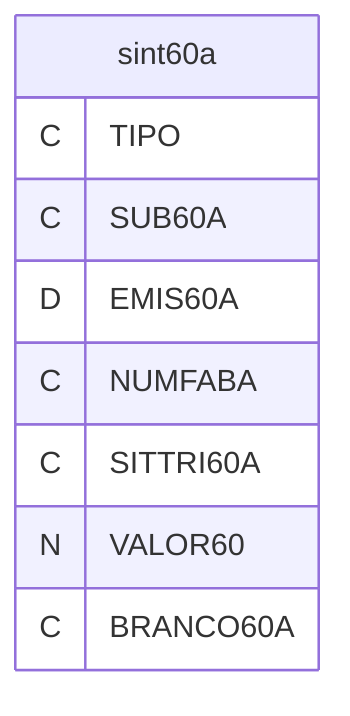

---
## Tabela DBF: `sint60d`
> **Origem:** `sint60d` (Driver: DBFCDX)

| Campo | Tipo | Tam | Dec |
| :--- | :--- | :--- | :--- |
| TIPO | C | 2 | 0 |
| SUB60D | C | 1 | 0 |
| EMIS60D | D | 8 | 0 |
| NUMFABD | C | 20 | 0 |
| PROD60D | C | 14 | 0 |
| QUANT60D | N | 13 | 3 |
| VALPRO60D | N | 16 | 2 |
| BASEIC60D | N | 16 | 2 |
| SITTRI60D | C | 4 | 0 |
| VALICM60D | N | 13 | 2 |
| BRANCO60D | C | 19 | 0 |

**Indices vinculados:**
- Tag: `FUMFABD` Expressao: `NUMFABD`

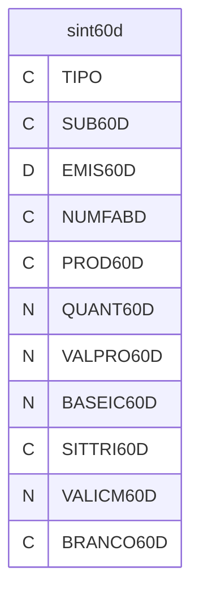

---
## Tabela DBF: `sint60i`
> **Origem:** `sint60i` (Driver: DBFCDX)

| Campo | Tipo | Tam | Dec |
| :--- | :--- | :--- | :--- |
| TIPO | C | 2 | 0 |
| SUB60I | C | 1 | 0 |
| EMIS60I | D | 8 | 0 |
| NUMFABI | C | 20 | 0 |
| MODEL60I | C | 2 | 0 |
| NUMCOO | C | 6 | 0 |
| NUMITE60I | C | 3 | 0 |
| PROD60I | C | 14 | 0 |
| QUANT60I | N | 13 | 3 |
| VALUNI60I | N | 13 | 3 |
| BASEIC60I | N | 12 | 2 |
| SITTRI60I | C | 4 | 0 |
| VALICM60I | N | 12 | 0 |
| BRANCO60I | C | 16 | 0 |

**Indices vinculados:**
- Tag: `NUMFABI` Expressao: `NUMFABI`

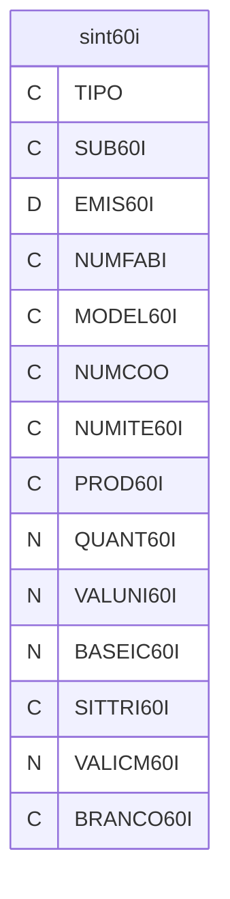

---
## Tabela DBF: `sint60m`
> **Origem:** `sint60m` (Driver: DBFCDX)

| Campo | Tipo | Tam | Dec |
| :--- | :--- | :--- | :--- |
| TIPO | C | 2 | 0 |
| SUB60M | C | 1 | 0 |
| EMIS60M | D | 8 | 0 |
| NUMFABM | C | 20 | 0 |
| NUMPDVM | C | 3 | 0 |
| MODEL60M | C | 2 | 0 |
| NUINI60M | C | 6 | 0 |
| NUFIM60M | C | 6 | 0 |
| REDUZ60M | C | 6 | 0 |
| CRO60M | N | 3 | 0 |
| VENDA60M | N | 16 | 2 |
| TOTGER60M | N | 16 | 2 |
| BRANCO60M | C | 37 | 0 |

**Indices vinculados:**
- Tag: `NUNFABM` Expressao: `NUMFABM`

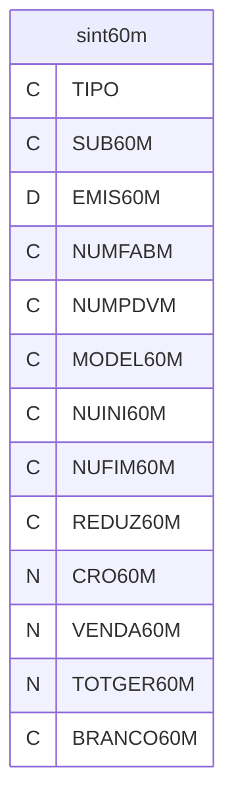

---
## Tabela DBF: `sint60r`
> **Origem:** `sint60r` (Driver: DBFCDX)

| Campo | Tipo | Tam | Dec |
| :--- | :--- | :--- | :--- |
| TIPO | C | 2 | 0 |
| SUB60R | C | 1 | 0 |
| MESANOEMR | C | 6 | 0 |
| PROD60R | C | 14 | 0 |
| QUANT60R | N | 13 | 3 |
| VALUNI60R | N | 16 | 2 |
| BASEIC60R | N | 16 | 2 |
| SITTRI60R | C | 4 | 0 |
| BRANCO60R | C | 54 | 0 |

**Indices vinculados:**
- Tag: `SUB60R` Expressao: `SUB60R`

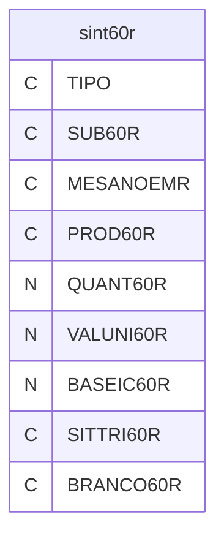

---
## Tabela DBF: `sint61`
> **Origem:** `sint61` (Driver: DBFCDX)

| Campo | Tipo | Tam | Dec |
| :--- | :--- | :--- | :--- |
| TIPO | C | 2 | 0 |
| BRANCO611 | C | 14 | 0 |
| BRANCO612 | C | 14 | 0 |
| EMIS61 | D | 8 | 0 |
| MODEL61M | C | 2 | 0 |
| SERIE61 | C | 3 | 0 |
| SUBSER61 | C | 2 | 0 |
| NUINI61M | C | 6 | 0 |
| NUFIM61M | C | 6 | 0 |
| VALTOT61 | N | 13 | 2 |
| BASEIC61 | N | 13 | 2 |
| VALICM61 | N | 12 | 2 |
| ISENTA61 | N | 13 | 2 |
| OUTRAS61 | N | 13 | 2 |
| ALIQIC61 | N | 4 | 2 |
| BRANCO61 | C | 1 | 0 |

**Indices vinculados:**
- Tag: `NUINI61M` Expressao: `NUINI61M`

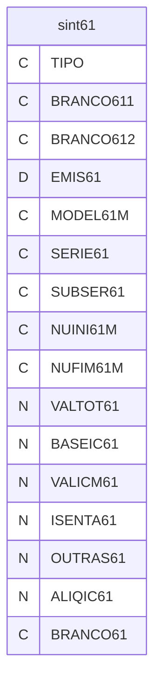

---
## Tabela DBF: `sint70`
> **Origem:** `sint70` (Driver: DBFCDX)

| Campo | Tipo | Tam | Dec |
| :--- | :--- | :--- | :--- |
| TIPO | C | 2 | 0 |
| CGC | C | 18 | 0 |
| IE | C | 20 | 0 |
| DATA | D | 8 | 0 |
| UF | C | 2 | 0 |
| MODELO | N | 2 | 0 |
| SERIE | C | 3 | 0 |
| SUB | C | 2 | 0 |
| NUMERO | N | 8 | 0 |
| CFOP | C | 4 | 0 |
| VALORTOT | N | 10 | 2 |
| BASE | N | 10 | 2 |
| VALOR | N | 10 | 2 |
| ISENTA | N | 10 | 2 |
| OUTRAS | N | 10 | 2 |
| ALIQUOTA | N | 5 | 2 |
| SITUACAO | C | 1 | 0 |
| TIPONF | C | 1 | 0 |
| OBS | N | 10 | 2 |
| EMITENTE | C | 1 | 0 |
| FRETE | C | 1 | 0 |
| FORNECEDO | N | 8 | 0 |
| TIPOCLI | C | 1 | 0 |

**Indices vinculados:**
- Tag: `SINT70-1` Expressao: `DTOS(DATA)+STR(NUMERO,8)`
- Tag: `SINT70-2` Expressao: `STR(NUMERO,8)+TIPONF`

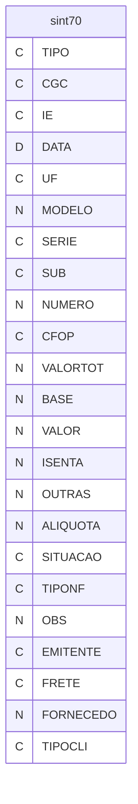

---
## Tabela DBF: `sint71`
> **Origem:** `sint71` (Driver: DBFCDX)

| Campo | Tipo | Tam | Dec |
| :--- | :--- | :--- | :--- |
| TIPO | C | 2 | 0 |
| CGC | C | 14 | 0 |
| IE | C | 14 | 0 |
| EMIS71 | D | 8 | 0 |
| UF | C | 2 | 0 |
| MODEL71 | C | 2 | 0 |
| SERIE71 | C | 1 | 0 |
| SUBSER71 | C | 2 | 0 |
| NFISC71 | C | 6 | 0 |
| UFREM | C | 2 | 0 |
| CNPJREM | C | 14 | 0 |
| INSCREM | C | 14 | 0 |
| EMISREM71 | D | 8 | 0 |
| MODREM71 | C | 2 | 0 |
| SERIREM71 | C | 3 | 0 |
| NFISREM71 | C | 6 | 0 |
| VALTOT71 | N | 14 | 2 |
| BRANCO71 | C | 12 | 0 |

**Indices vinculados:**
- Tag: `CGC` Expressao: `CGC`

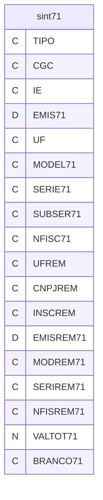

---
## Tabela DBF: `sint74`
> **Origem:** `sint74` (Driver: DBFCDX)

| Campo | Tipo | Tam | Dec |
| :--- | :--- | :--- | :--- |
| TIPO | C | 2 | 0 |
| DATA_INVEN | C | 8 | 0 |
| COD_MERCAD | C | 14 | 0 |
| QUANTIDADE | N | 13 | 0 |
| VALORTOTAL | N | 13 | 0 |
| SITU_ESTOQ | C | 1 | 0 |
| CGC | C | 14 | 0 |
| IE | C | 14 | 0 |
| UF | C | 2 | 0 |
| BRANCO74 | C | 45 | 0 |

**Indices vinculados:**
- Tag: `DATA_INVEN` Expressao: `DATA_INVEN`

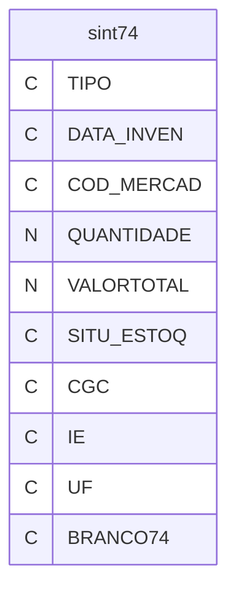

---
## Tabela DBF: `sint75`
> **Origem:** `sint75` (Driver: DBFCDX)

| Campo | Tipo | Tam | Dec |
| :--- | :--- | :--- | :--- |
| TIPO | C | 2 | 0 |
| DATAINI | D | 8 | 0 |
| DATAFIM | D | 8 | 0 |
| CODIGORED | C | 14 | 0 |
| CLASSIPI | C | 14 | 0 |
| DESCRICAO | C | 53 | 0 |
| UNID | C | 2 | 0 |
| SITUACAO | N | 3 | 0 |
| TIPOENT | C | 1 | 0 |
| IPI | N | 5 | 2 |
| ICM | N | 5 | 2 |
| REDICM | N | 5 | 2 |
| SUBICM | N | 5 | 2 |
| GERADO | L | 1 | 0 |
| CODIGO | C | 24 | 0 |

**Indices vinculados:**
- Tag: `SINT75-1` Expressao: `CODIGORED`
- Tag: `SINT75-2` Expressao: `CODIGO`

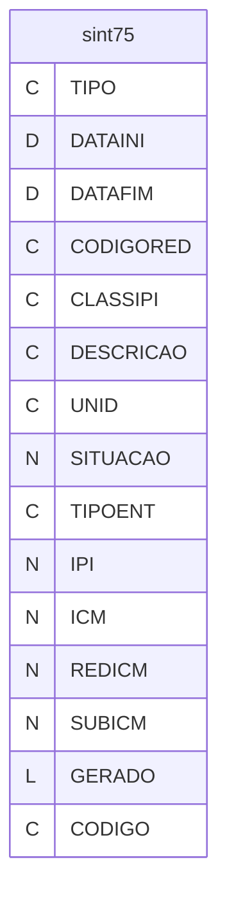

---
## Tabela DBF: `sint76`
> **Origem:** `sint76` (Driver: DBFCDX)

| Campo | Tipo | Tam | Dec |
| :--- | :--- | :--- | :--- |
| TIPO | C | 2 | 0 |
| CGC | C | 14 | 0 |
| IE | C | 14 | 0 |
| MODEL76 | C | 2 | 0 |
| SERIE76 | C | 2 | 0 |
| SUBSER76 | C | 2 | 0 |
| NFISC76 | C | 10 | 0 |
| CFOP76 | C | 4 | 0 |
| TIPREC76 | C | 1 | 0 |
| EMIS76 | D | 8 | 0 |
| UF | C | 2 | 0 |
| VALTOT76 | N | 13 | 2 |
| BASEIC76 | N | 13 | 2 |
| VALICM76 | N | 12 | 2 |
| ISENTO76 | N | 12 | 2 |
| OUTRAS76 | N | 12 | 2 |
| ALIQICM76 | N | 2 | 0 |
| SITUAC76 | C | 1 | 0 |

**Indices vinculados:**
- Tag: `CGC` Expressao: `CGC`

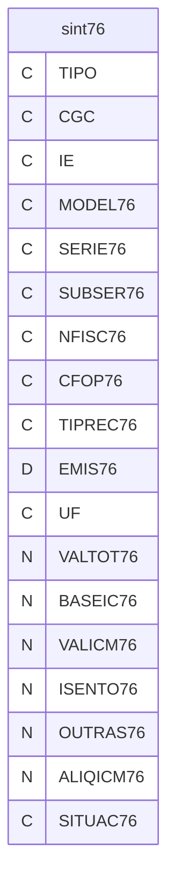

---
## Tabela DBF: `sint77`
> **Origem:** `sint77` (Driver: DBFCDX)

| Campo | Tipo | Tam | Dec |
| :--- | :--- | :--- | :--- |
| TIPO | C | 2 | 0 |
| CGC | C | 14 | 0 |
| MODEL77 | C | 2 | 0 |
| SERIE77 | C | 2 | 0 |
| SUBSER77 | C | 2 | 0 |
| NFISC77 | C | 10 | 0 |
| CFOP77 | C | 4 | 0 |
| TIPREC77 | C | 1 | 0 |
| ITEM77 | C | 3 | 0 |
| PRODUT77 | C | 11 | 0 |
| QUANT77 | N | 13 | 3 |
| VALPRO77 | N | 12 | 2 |
| VALDES77 | N | 12 | 2 |
| BASEIC77 | N | 12 | 2 |
| ALIQIC77 | N | 2 | 0 |
| CNPJMF | C | 14 | 0 |
| CODTERM | C | 10 | 0 |

**Indices vinculados:**
- Tag: `CGC` Expressao: `CGC`

```mermaid
erDiagram
    sint77 {
        C TIPO
        C CGC
        C MODEL77
        C SERIE77
        C SUBSER77
        C NFISC77
        C CFOP77
        C TIPREC77
        C ITEM77
        C PRODUT77
        N QUANT77
        N VALPRO77
        N VALDES77
        N BASEIC77
        N ALIQIC77
        C CNPJMF
        C CODTERM
    }
```

---
## Tabela DBF: `sint85`
> **Origem:** `sint85` (Driver: DBFCDX)

| Campo | Tipo | Tam | Dec |
| :--- | :--- | :--- | :--- |
| REG | C | 2 | 0 |
| DECLARACAO | N | 11 | 0 |
| DATADEC | D | 8 | 0 |
| AVERBACAO | C | 1 | 0 |
| REGEXP | N | 12 | 0 |
| DTREGEXP | D | 8 | 0 |
| CONHEC | C | 16 | 0 |
| DTCONHEC | D | 8 | 0 |
| TIPOCONHEC | N | 2 | 0 |
| PAIS | N | 4 | 0 |
| COMPROV | N | 8 | 0 |
| DTCOMPROV | D | 8 | 0 |
| NFEXPORT | C | 6 | 0 |
| EMISSAO | D | 8 | 0 |
| MODELO | N | 2 | 0 |
| SERIE | C | 3 | 0 |
| BRANCOS | C | 19 | 0 |

**Indices vinculados:**
- Tag: `CONHEC` Expressao: `CONHEC`

```mermaid
erDiagram
    sint85 {
        C REG
        N DECLARACAO
        D DATADEC
        C AVERBACAO
        N REGEXP
        D DTREGEXP
        C CONHEC
        D DTCONHEC
        N TIPOCONHEC
        N PAIS
        N COMPROV
        D DTCOMPROV
        C NFEXPORT
        D EMISSAO
        N MODELO
        C SERIE
        C BRANCOS
    }
```

---
## Tabela DBF: `sint86`
> **Origem:** `sint86` (Driver: DBFCDX)

| Campo | Tipo | Tam | Dec |
| :--- | :--- | :--- | :--- |
| REG | C | 2 | 0 |
| REGEXP | N | 12 | 0 |
| DTREGEXP | D | 8 | 0 |
| CNPJREMET | N | 14 | 0 |
| IEREMET | C | 14 | 0 |
| UFREMET | C | 2 | 0 |
| NF | C | 6 | 0 |
| EMISSAO | D | 8 | 0 |
| MODELO | N | 2 | 0 |
| SERIE | C | 3 | 0 |
| PRODUTO | C | 14 | 0 |
| QUANT | N | 11 | 3 |
| VALUNIT | N | 12 | 2 |
| VALPROD | N | 12 | 2 |
| RELAC | N | 1 | 0 |
| BRANCOS | C | 5 | 0 |

**Indices vinculados:**
- Tag: `REGEXP` Expressao: `REGEXP`

```mermaid
erDiagram
    sint86 {
        C REG
        N REGEXP
        D DTREGEXP
        N CNPJREMET
        C IEREMET
        C UFREMET
        C NF
        D EMISSAO
        N MODELO
        C SERIE
        C PRODUTO
        N QUANT
        N VALUNIT
        N VALPROD
        N RELAC
        C BRANCOS
    }
```

---
## Tabela DBF: `sint88c`
> **Origem:** `sint88c` (Driver: DBFCDX)

| Campo | Tipo | Tam | Dec |
| :--- | :--- | :--- | :--- |
| REG | C | 2 | 0 |
| SUB | C | 1 | 0 |
| CNPJ | C | 14 | 0 |
| MODELONF | C | 2 | 0 |
| SERIENF | C | 3 | 0 |
| NUMERONF | C | 6 | 0 |
| CFOP | C | 4 | 0 |
| NUMITEM | C | 3 | 0 |
| CODPRODUTO | C | 14 | 0 |
| QUANTIDADE | N | 11 | 3 |
| BCST | N | 12 | 2 |
| VLRST | N | 12 | 2 |
| VLRSTCOMPL | N | 12 | 2 |
| RETENCAO | N | 12 | 2 |
| PARCIMPRET | N | 12 | 2 |
| BRANCOS | C | 6 | 0 |

**Indices vinculados:**
- Tag: `CNPJNUM` Expressao: `CNPJ+NUMERONF`

```mermaid
erDiagram
    sint88c {
        C REG
        C SUB
        C CNPJ
        C MODELONF
        C SERIENF
        C NUMERONF
        C CFOP
        C NUMITEM
        C CODPRODUTO
        N QUANTIDADE
        N BCST
        N VLRST
        N VLRSTCOMPL
        N RETENCAO
        N PARCIMPRET
        C BRANCOS
    }
```

---
## Tabela DBF: `sint88d`
> **Origem:** `sint88d` (Driver: DBFCDX)

| Campo | Tipo | Tam | Dec |
| :--- | :--- | :--- | :--- |
| REG | C | 2 | 0 |
| SUB | C | 1 | 0 |
| CNPJ | C | 14 | 0 |
| IE | C | 14 | 0 |
| UF | C | 2 | 0 |
| MODELONF | C | 2 | 0 |
| SERIENF | C | 3 | 0 |
| NUMERONF | C | 6 | 0 |
| EMITENTE | C | 1 | 0 |
| DTEMISSAO | C | 8 | 0 |
| DTSAIDA | C | 8 | 0 |
| CNPJSAIDA | C | 14 | 0 |
| UFSAIDA | C | 2 | 0 |
| IESAIDA | C | 14 | 0 |
| CNPJENT | C | 14 | 0 |
| UFENTREGA | C | 2 | 0 |
| IEENTREGA | C | 14 | 0 |
| BRANCOS | C | 5 | 0 |

**Indices vinculados:**
- Tag: `CNPJNUM` Expressao: `CNPJ+NUMERONF`

```mermaid
erDiagram
    sint88d {
        C REG
        C SUB
        C CNPJ
        C IE
        C UF
        C MODELONF
        C SERIENF
        C NUMERONF
        C EMITENTE
        C DTEMISSAO
        C DTSAIDA
        C CNPJSAIDA
        C UFSAIDA
        C IESAIDA
        C CNPJENT
        C UFENTREGA
        C IEENTREGA
        C BRANCOS
    }
```

---
## Tabela DBF: `sint88e`
> **Origem:** `sint88e` (Driver: DBFCDX)

| Campo | Tipo | Tam | Dec |
| :--- | :--- | :--- | :--- |
| REG | C | 2 | 0 |
| SUB | C | 1 | 0 |
| CNPJ | C | 14 | 0 |
| IE | C | 14 | 0 |
| CODPROINF | C | 14 | 0 |
| CODPROSEF | C | 14 | 0 |
| BRANCOS | C | 67 | 0 |

**Indices vinculados:**
- Tag: `CNPJSUB` Expressao: `CNPJ+SUB`

```mermaid
erDiagram
    sint88e {
        C REG
        C SUB
        C CNPJ
        C IE
        C CODPROINF
        C CODPROSEF
        C BRANCOS
    }
```

---
## Tabela DBF: `sint88m`
> **Origem:** `sint88m` (Driver: DBFCDX)

| Campo | Tipo | Tam | Dec |
| :--- | :--- | :--- | :--- |
| REG | C | 2 | 0 |
| SUB | C | 1 | 0 |
| CNPJ | C | 14 | 0 |
| MENSAGEM | C | 34 | 0 |
| BRANCOS | C | 75 | 0 |

**Indices vinculados:**
- Tag: `CNPJSUB` Expressao: `CNPJ+SUB`

```mermaid
erDiagram
    sint88m {
        C REG
        C SUB
        C CNPJ
        C MENSAGEM
        C BRANCOS
    }
```

---
## Tabela DBF: `sint88t`
> **Origem:** `sint88t` (Driver: DBFCDX)

| Campo | Tipo | Tam | Dec |
| :--- | :--- | :--- | :--- |
| REG | C | 2 | 0 |
| SUB | C | 1 | 0 |
| CNPJ | C | 14 | 0 |
| DTEMISSAO | C | 8 | 0 |
| UF | C | 2 | 0 |
| MODELONF | C | 2 | 0 |
| SERIENF | C | 3 | 0 |
| NUMERONF | C | 6 | 0 |
| EMITENTE | C | 1 | 0 |
| CIFFOB | C | 1 | 0 |
| CNPJFRETE | C | 14 | 0 |
| UFFRETE | C | 2 | 0 |
| IEFRETE | C | 14 | 0 |
| MODAL | C | 1 | 0 |
| PLACA1 | C | 7 | 0 |
| UF1 | C | 2 | 0 |
| PLACA2 | C | 7 | 0 |
| UF2 | C | 2 | 0 |
| PLACA3 | C | 7 | 0 |
| UF3 | C | 2 | 0 |
| BRANCOS | C | 28 | 0 |

**Indices vinculados:**
- Tag: `CNPJSUB` Expressao: `CNPJ+SUB`

```mermaid
erDiagram
    sint88t {
        C REG
        C SUB
        C CNPJ
        C DTEMISSAO
        C UF
        C MODELONF
        C SERIENF
        C NUMERONF
        C EMITENTE
        C CIFFOB
        C CNPJFRETE
        C UFFRETE
        C IEFRETE
        C MODAL
        C PLACA1
        C UF1
        C PLACA2
        C UF2
        C PLACA3
        C UF3
        C BRANCOS
    }
```

---
## Tabela DBF: `sint90`
> **Origem:** `sint90` (Driver: DBFCDX)

| Campo | Tipo | Tam | Dec |
| :--- | :--- | :--- | :--- |
| REG90 | C | 126 | 0 |

**Indices vinculados:**
- Tag: `REG90` Expressao: `REG90`

```mermaid
erDiagram
    sint90 {
        C REG90
    }
```

---
