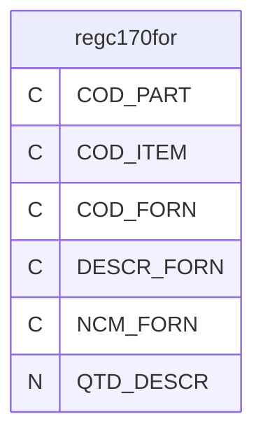
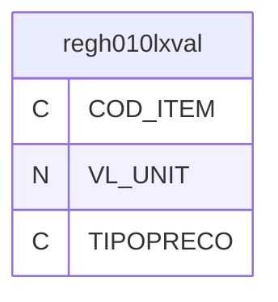

# Dicionario de Estruturas de Dados do Projeto
> Varredura automatica realizada em: 09/09/2026

## Tabela DBF: `regc170for`
> **Origem:** `regc170for` (Driver: DBFCDX)

| Campo | Tipo | Tam | Dec |
| :--- | :--- | :--- | :--- |
| COD_PART | C | 20 | 0 |
| COD_ITEM | C | 20 | 0 |
| COD_FORN | C | 30 | 0 |
| DESCR_FORN | C | 120 | 0 |
| NCM_FORN | C | 8 | 0 |
| QTD_DESCR | N | 10 | 0 |

**Indices vinculados:**
- Tag: `REGC170FOR` Expressao: `COD_PART+  COD_item+  COD_forn`

---
## Tabela DBF: `regh010lxval`
> **Origem:** `regh010lxval` (Driver: DBFCDX)

| Campo | Tipo | Tam | Dec |
| :--- | :--- | :--- | :--- |
| COD_ITEM | C | 60 | 0 |
| VL_UNIT | N | 14 | 6 |
| TIPOPRECO | C | 1 | 0 |

**Indices vinculados:**
- Tag: `REGH10LXV1` Expressao: `TIPOPRECO+  COD_ITEM`
- Tag: `REGH010XV2` Expressao: `cod_item`

---
