# Dicionario de Estruturas de Dados do Projeto
> Varredura automatica realizada em: 09/09/2026

## Tabela DBF: `aj_apur_ded`
> **Origem:** `aj_apur_ded` (Driver: DBFCDX)

| Campo | Tipo | Tam | Dec |
| :--- | :--- | :--- | :--- |
| CODIGO | C | 30 | 0 |
| DESCRICAO | C | 254 | 0 |
| DT_INI | D | 8 | 0 |
| DT_FIN | D | 8 | 0 |

**Indices vinculados:**
- Tag: `CODIGO` Expressao: `CODIGO`

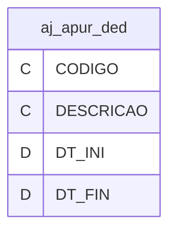

---
## Tabela DBF: `aj_apur_ipi`
> **Origem:** `aj_apur_ipi` (Driver: DBFCDX)

| Campo | Tipo | Tam | Dec |
| :--- | :--- | :--- | :--- |
| CODIGO | C | 30 | 0 |
| DESCRICAO | C | 254 | 0 |
| DT_INI | D | 8 | 0 |
| DT_FIN | D | 8 | 0 |

**Indices vinculados:**
- Tag: `CODIGO` Expressao: `CODIGO`

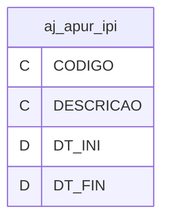

---
## Tabela DBF: `aj_contrib_cred`
> **Origem:** `aj_contrib_cred` (Driver: DBFCDX)

| Campo | Tipo | Tam | Dec |
| :--- | :--- | :--- | :--- |
| CODIGO | C | 30 | 0 |
| DESCRICAO | C | 254 | 0 |
| DT_INI | D | 8 | 0 |
| DT_FIN | D | 8 | 0 |

**Indices vinculados:**
- Tag: `CODIGO` Expressao: `CODIGO`

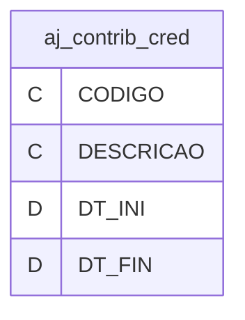

---
## Tabela DBF: `aj_preco_parametro_exp`
> **Origem:** `aj_preco_parametro_exp` (Driver: DBFCDX)

| Campo | Tipo | Tam | Dec |
| :--- | :--- | :--- | :--- |
| CODIGO | C | 30 | 0 |
| DESCRICAO | C | 254 | 0 |
| DT_INI | D | 8 | 0 |
| DT_FIN | D | 8 | 0 |

**Indices vinculados:**
- Tag: `CODIGO` Expressao: `CODIGO`


---
## Tabela DBF: `aj_preco_parametro_imp`
> **Origem:** `aj_preco_parametro_imp` (Driver: DBFCDX)

| Campo | Tipo | Tam | Dec |
| :--- | :--- | :--- | :--- |
| CODIGO | C | 30 | 0 |
| DESCRICAO | C | 254 | 0 |
| DT_INI | D | 8 | 0 |
| DT_FIN | D | 8 | 0 |

**Indices vinculados:**
- Tag: `CODIGO` Expressao: `CODIGO`

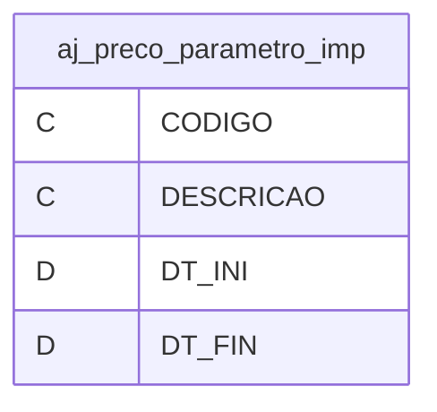

---
## Tabela DBF: `aliq_agro_frigo`
> **Origem:** `aliq_agro_frigo` (Driver: DBFCDX)

| Campo | Tipo | Tam | Dec |
| :--- | :--- | :--- | :--- |
| CODIGO | C | 3 | 0 |
| DESCRICAO | C | 254 | 0 |
| DT_INI | D | 8 | 0 |
| DT_FIN | D | 8 | 0 |
| LISTA_COD_ | C | 254 | 0 |
| LISTA_COD2 | C | 254 | 0 |
| EX_IPI | C | 3 | 0 |
| ALIQ_PIS | N | 15 | 4 |
| ALIQ_COFIN | N | 15 | 4 |

**Indices vinculados:**
- Tag: `CODIGO` Expressao: `CODIGO`

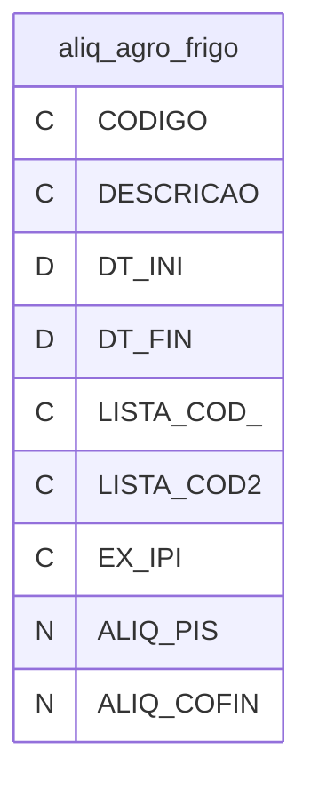

---
## Tabela DBF: `ativos_exterior`
> **Origem:** `ativos_exterior` (Driver: DBFCDX)

| Campo | Tipo | Tam | Dec |
| :--- | :--- | :--- | :--- |
| CODIGO | C | 8 | 0 |
| NOME | C | 86 | 0 |
| DATAINICIO | C | 8 | 0 |
| DATAFIM | D | 8 | 0 |
| GRUPO | C | 8 | 0 |

**Indices vinculados:**
- Tag: `CHAVE` Expressao: `CODIGO`

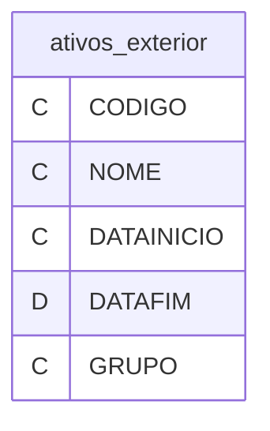

---
## Tabela DBF: `bc_cred`
> **Origem:** `bc_cred` (Driver: DBFCDX)

| Campo | Tipo | Tam | Dec |
| :--- | :--- | :--- | :--- |
| CODIGO | C | 30 | 0 |
| DESCRICAO | C | 254 | 0 |
| DT_INI | D | 8 | 0 |
| DT_FIN | D | 8 | 0 |

**Indices vinculados:**
- Tag: `CODIGO` Expressao: `CODIGO`

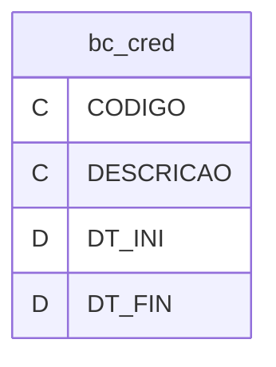

---
## Tabela DBF: `beneficio_fiscal`
> **Origem:** `beneficio_fiscal` (Driver: DBFCDX)

| Campo | Tipo | Tam | Dec |
| :--- | :--- | :--- | :--- |
| CODIGO | C | 30 | 0 |
| DESCRICAO | C | 254 | 0 |
| DT_INI | D | 8 | 0 |
| DT_FIN | D | 8 | 0 |

**Indices vinculados:**
- Tag: `CODIGO` Expressao: `CODIGO`

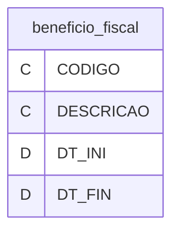

---
## Tabela DBF: `CBC_MOEDA_CONVERSAO`
> **Origem:** `CBC_MOEDA_CONVERSAO` (Driver: DBFCDX)

| Campo | Tipo | Tam | Dec |
| :--- | :--- | :--- | :--- |
| CODIGO | C | 8 | 0 |
| DESCRICAO | C | 8 | 0 |
| DT_INI | D | 8 | 0 |
| DT_FIM | D | 8 | 0 |
| TIPO | C | 8 | 0 |
| REAL_COMPR | C | 9 | 0 |
| REAL_VENDA | C | 9 | 0 |
| DOLAR_COMP | C | 11 | 0 |
| DOLAR_VEND | C | 11 | 0 |

**Indices vinculados:**
- Tag: `CHAVE` Expressao: `CODIGO`

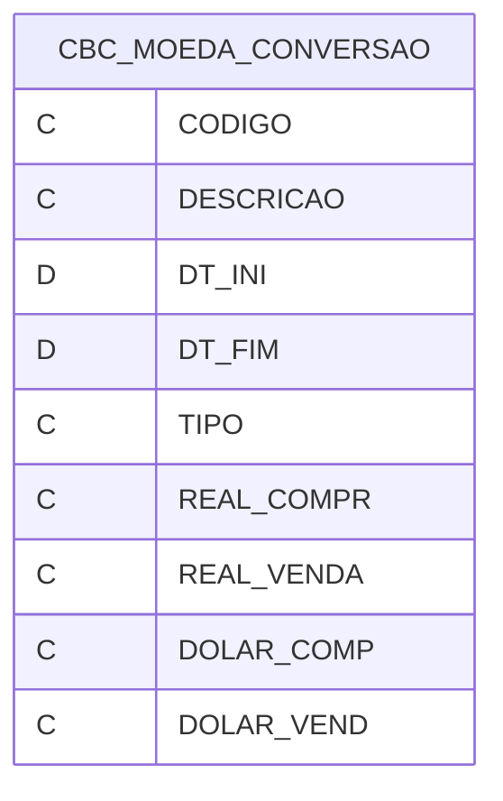

---
## Tabela DBF: `cbc_pais_acordo`
> **Origem:** `cbc_pais_acordo` (Driver: DBFCDX)

| Campo | Tipo | Tam | Dec |
| :--- | :--- | :--- | :--- |
| CODIGO | C | 30 | 0 |
| DESCRICAO | C | 254 | 0 |
| DT_INI | D | 8 | 0 |
| DT_FIN | D | 8 | 0 |

**Indices vinculados:**
- Tag: `CODIGO` Expressao: `CODIGO`

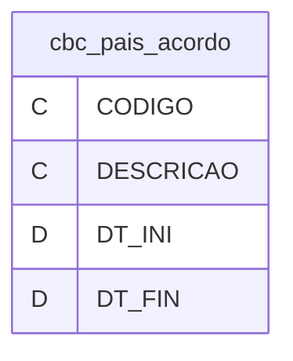

---
## Tabela DBF: `cbc_pais_falha`
> **Origem:** `cbc_pais_falha` (Driver: DBFCDX)

| Campo | Tipo | Tam | Dec |
| :--- | :--- | :--- | :--- |
| CODIGO | C | 30 | 0 |
| DESCRICAO | C | 254 | 0 |
| DT_INI | D | 8 | 0 |
| DT_FIN | D | 8 | 0 |

**Indices vinculados:**
- Tag: `CODIGO` Expressao: `CODIGO`

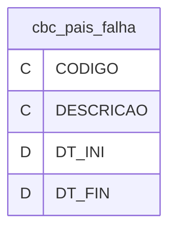

---
## Tabela DBF: `cfop_credito`
> **Origem:** `cfop_credito` (Driver: DBFCDX)

| Campo | Tipo | Tam | Dec |
| :--- | :--- | :--- | :--- |
| CODIGO | C | 30 | 0 |
| DESCRICAO | C | 254 | 0 |
| DT_INI | D | 8 | 0 |
| DT_FIN | D | 8 | 0 |
| NAT_BC_CRE | C | 2 | 0 |

**Indices vinculados:**
- Tag: `CODIGO` Expressao: `CODIGO`

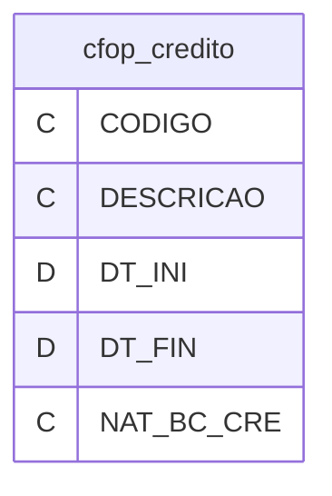

---
## Tabela DBF: `cfop_devolucao`
> **Origem:** `cfop_devolucao` (Driver: DBFCDX)

| Campo | Tipo | Tam | Dec |
| :--- | :--- | :--- | :--- |
| CODIGO | C | 30 | 0 |
| DESCRICAO | C | 254 | 0 |
| DT_INI | D | 8 | 0 |
| DT_FIN | D | 8 | 0 |

**Indices vinculados:**
- Tag: `CODIGO` Expressao: `CODIGO`

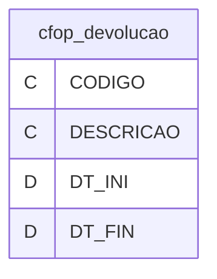

---
## Tabela DBF: `cfop_devolucao_venda`
> **Origem:** `cfop_devolucao_venda` (Driver: DBFCDX)

| Campo | Tipo | Tam | Dec |
| :--- | :--- | :--- | :--- |
| CODIGO | C | 30 | 0 |
| DESCRICAO | C | 254 | 0 |
| DT_INI | D | 8 | 0 |
| DT_FIN | D | 8 | 0 |

**Indices vinculados:**
- Tag: `CODIGO` Expressao: `CODIGO`

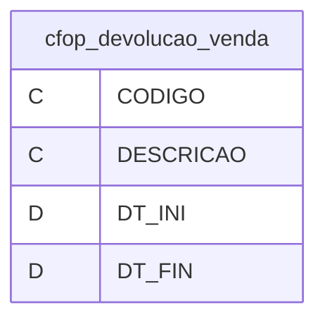

---
## Tabela DBF: `cfop_receita`
> **Origem:** `cfop_receita` (Driver: DBFCDX)

| Campo | Tipo | Tam | Dec |
| :--- | :--- | :--- | :--- |
| CODIGO | C | 30 | 0 |
| DESCRICAO | C | 254 | 0 |
| DT_INI | D | 8 | 0 |
| DT_FIN | D | 8 | 0 |
| DESC_REC | C | 254 | 0 |

**Indices vinculados:**
- Tag: `CODIGO` Expressao: `CODIGO`

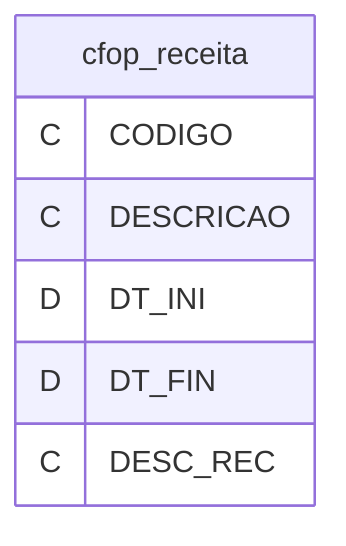

---
## Tabela DBF: `classificacao_item`
> **Origem:** `classificacao_item` (Driver: DBFCDX)

| Campo | Tipo | Tam | Dec |
| :--- | :--- | :--- | :--- |
| CODIGO | C | 30 | 0 |
| DESCRICAO | C | 254 | 0 |
| DT_INI | D | 8 | 0 |
| DT_FIN | D | 8 | 0 |

**Indices vinculados:**
- Tag: `CODIGO` Expressao: `CODIGO`

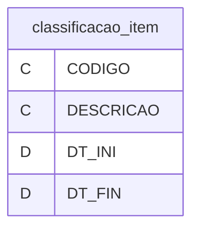

---
## Tabela DBF: `class_contrib_ipi`
> **Origem:** `class_contrib_ipi` (Driver: DBFCDX)

| Campo | Tipo | Tam | Dec |
| :--- | :--- | :--- | :--- |
| CODIGO | C | 30 | 0 |
| DESCRICAO | C | 254 | 0 |
| DT_INI | D | 8 | 0 |
| DT_FIN | D | 8 | 0 |

**Indices vinculados:**
- Tag: `CODIGO` Expressao: `CODIGO`

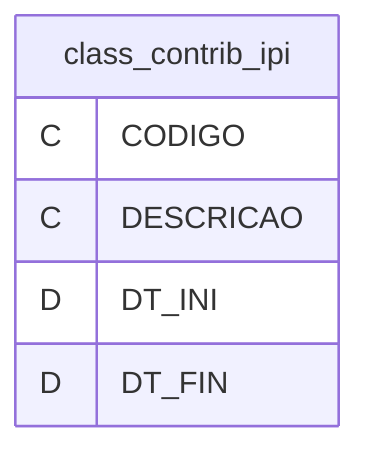

---
## Tabela DBF: `cl_itens_eng_com_telecom`
> **Origem:** `cl_itens_eng_com_telecom` (Driver: DBFCDX)

| Campo | Tipo | Tam | Dec |
| :--- | :--- | :--- | :--- |
| CODIGO | C | 30 | 0 |
| DESCRICAO | C | 254 | 0 |
| DT_INI | D | 8 | 0 |
| DT_FIN | D | 8 | 0 |

**Indices vinculados:**
- Tag: `CODIGO` Expressao: `CODIGO`

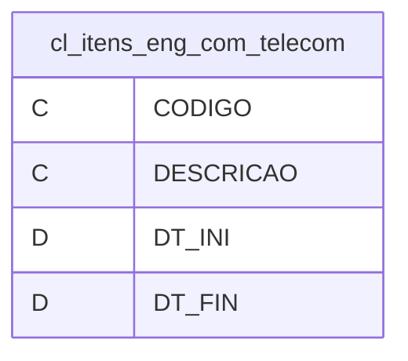

---
## Tabela DBF: `cnc`
> **Origem:** `cnc` (Driver: DBFCDX)

| Campo | Tipo | Tam | Dec |
| :--- | :--- | :--- | :--- |
| CODIGO | C | 30 | 0 |
| DESCRICAO | C | 254 | 0 |
| DT_INI | D | 8 | 0 |
| DT_FIN | D | 8 | 0 |

**Indices vinculados:**
- Tag: `CODIGO` Expressao: `CODIGO`

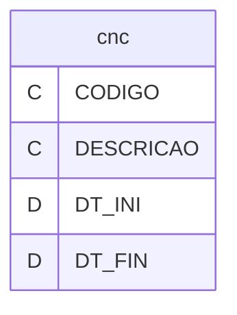

---
## Tabela DBF: `cod_ajus_base_calculo_contrib`
> **Origem:** `cod_ajus_base_calculo_contrib` (Driver: DBFCDX)

| Campo | Tipo | Tam | Dec |
| :--- | :--- | :--- | :--- |
| COD_AJUSTE | C | 8 | 0 |
| DESCRICAO | C | 89 | 0 |
| OBRIGA_DET | C | 8 | 0 |
| DT_INI | D | 8 | 0 |
| DT_FIM | D | 8 | 0 |

**Indices vinculados:**
- Tag: `CHAVE` Expressao: `COD_AJUSTE`

```mermaid
erDiagram
    cod_ajus_base_calculo_contrib {
        C COD_AJUSTE
        C DESCRICAO
        C OBRIGA_DET
        D DT_INI
        D DT_FIM
    }
```

---
## Tabela DBF: `cod_atividade`
> **Origem:** `cod_atividade` (Driver: DBFCDX)

| Campo | Tipo | Tam | Dec |
| :--- | :--- | :--- | :--- |
| CODIGO | C | 8 | 0 |
| DESCRICAO | C | 254 | 0 |
| DT_INI | D | 8 | 0 |
| DT_FIN | D | 8 | 0 |
| NCM_ATV | C | 8 | 0 |
| ALIQ_ATV | N | 6 | 2 |

**Indices vinculados:**
- Tag: `CODIGO` Expressao: `CODIGO`

```mermaid
erDiagram
    cod_atividade {
        C CODIGO
        C DESCRICAO
        D DT_INI
        D DT_FIN
        C NCM_ATV
        N ALIQ_ATV
    }
```

---
## Tabela DBF: `cod_detalham`
> **Origem:** `cod_detalham` (Driver: DBFCDX)

| Campo | Tipo | Tam | Dec |
| :--- | :--- | :--- | :--- |
| CODIGO | C | 30 | 0 |
| DESCRICAO | C | 254 | 0 |
| DT_INI | D | 8 | 0 |
| DT_FIN | D | 8 | 0 |

**Indices vinculados:**
- Tag: `CODIGO` Expressao: `CODIGO`

```mermaid
erDiagram
    cod_detalham {
        C CODIGO
        C DESCRICAO
        D DT_INI
        D DT_FIN
    }
```

---
## Tabela DBF: `cod_enq`
> **Origem:** `cod_enq` (Driver: DBFCDX)

| Campo | Tipo | Tam | Dec |
| :--- | :--- | :--- | :--- |
| CODIGO | C | 30 | 0 |
| DESCRICAO | C | 254 | 0 |
| DT_INI | D | 8 | 0 |
| DT_FIN | D | 8 | 0 |

**Indices vinculados:**
- Tag: `CODIGO` Expressao: `CODIGO`

```mermaid
erDiagram
    cod_enq {
        C CODIGO
        C DESCRICAO
        D DT_INI
        D DT_FIN
    }
```

---
## Tabela DBF: `cod_natureza_ajus_base_calculo`
> **Origem:** `cod_natureza_ajus_base_calculo` (Driver: DBFCDX)

| Campo | Tipo | Tam | Dec |
| :--- | :--- | :--- | :--- |
| CODIGO | C | 30 | 0 |
| DESCRICAO | C | 254 | 0 |
| DT_INI | D | 8 | 0 |
| DT_FIN | D | 8 | 0 |

**Indices vinculados:**
- Tag: `CODIGO` Expressao: `CODIGO`

```mermaid
erDiagram
    cod_natureza_ajus_base_calculo {
        C CODIGO
        C DESCRICAO
        D DT_INI
        D DT_FIN
    }
```

---
## Tabela DBF: `cod_prod_usinas`
> **Origem:** `cod_prod_usinas` (Driver: DBFCDX)

| Campo | Tipo | Tam | Dec |
| :--- | :--- | :--- | :--- |
| CODIGO | C | 30 | 0 |
| DESCRICAO | C | 254 | 0 |
| DT_INI | D | 8 | 0 |
| DT_FIN | D | 8 | 0 |

**Indices vinculados:**
- Tag: `CODIGO` Expressao: `CODIGO`

```mermaid
erDiagram
    cod_prod_usinas {
        C CODIGO
        C DESCRICAO
        D DT_INI
        D DT_FIN
    }
```

---
## Tabela DBF: `cod_rec_f600`
> **Origem:** `cod_rec_f600` (Driver: DBFCDX)

| Campo | Tipo | Tam | Dec |
| :--- | :--- | :--- | :--- |
| CODIGO | C | 30 | 0 |
| DESCRICAO | C | 254 | 0 |
| DT_INI | D | 8 | 0 |
| DT_FIN | D | 8 | 0 |
| PERIODICID | C | 10 | 0 |

**Indices vinculados:**
- Tag: `CODIGO` Expressao: `CODIGO`

```mermaid
erDiagram
    cod_rec_f600 {
        C CODIGO
        C DESCRICAO
        D DT_INI
        D DT_FIN
        C PERIODICID
    }
```

---
## Tabela DBF: `cod_rec_p200`
> **Origem:** `cod_rec_p200` (Driver: DBFCDX)

| Campo | Tipo | Tam | Dec |
| :--- | :--- | :--- | :--- |
| CODIGO | C | 30 | 0 |
| DESCRICAO | C | 254 | 0 |
| DT_INI | D | 8 | 0 |
| DT_FIN | D | 8 | 0 |
| PERIODICID | C | 10 | 0 |

**Indices vinculados:**
- Tag: `CODIGO` Expressao: `CODIGO`

```mermaid
erDiagram
    cod_rec_p200 {
        C CODIGO
        C DESCRICAO
        D DT_INI
        D DT_FIN
        C PERIODICID
    }
```

---
## Tabela DBF: `cod_sit`
> **Origem:** `cod_sit` (Driver: DBFCDX)

| Campo | Tipo | Tam | Dec |
| :--- | :--- | :--- | :--- |
| CODIGO | C | 30 | 0 |
| DESCRICAO | C | 254 | 0 |
| DT_INI | D | 8 | 0 |
| DT_FIN | D | 8 | 0 |

**Indices vinculados:**
- Tag: `CODIGO` Expressao: `CODIGO`

```mermaid
erDiagram
    cod_sit {
        C CODIGO
        C DESCRICAO
        D DT_INI
        D DT_FIN
    }
```

---
## Tabela DBF: `cond_pessoa_envolv_operacao`
> **Origem:** `cond_pessoa_envolv_operacao` (Driver: DBFCDX)

| Campo | Tipo | Tam | Dec |
| :--- | :--- | :--- | :--- |
| CODIGO | C | 30 | 0 |
| DESCRICAO | C | 254 | 0 |
| DT_INI | D | 8 | 0 |
| DT_FIN | D | 8 | 0 |

**Indices vinculados:**
- Tag: `CODIGO` Expressao: `CODIGO`

```mermaid
erDiagram
    cond_pessoa_envolv_operacao {
        C CODIGO
        C DESCRICAO
        D DT_INI
        D DT_FIN
    }
```

---
## Tabela DBF: `consumo_agua`
> **Origem:** `consumo_agua` (Driver: DBFCDX)

| Campo | Tipo | Tam | Dec |
| :--- | :--- | :--- | :--- |
| CODIGO | C | 30 | 0 |
| DESCRICAO | C | 254 | 0 |
| DT_INI | D | 8 | 0 |
| DT_FIN | D | 8 | 0 |

**Indices vinculados:**
- Tag: `CODIGO` Expressao: `CODIGO`

```mermaid
erDiagram
    consumo_agua {
        C CODIGO
        C DESCRICAO
        D DT_INI
        D DT_FIN
    }
```

---
## Tabela DBF: `consumo_energia`
> **Origem:** `consumo_energia` (Driver: DBFCDX)

| Campo | Tipo | Tam | Dec |
| :--- | :--- | :--- | :--- |
| CODIGO | C | 30 | 0 |
| DESCRICAO | C | 254 | 0 |
| DT_INI | D | 8 | 0 |
| DT_FIN | D | 8 | 0 |

**Indices vinculados:**
- Tag: `CODIGO` Expressao: `CODIGO`

```mermaid
erDiagram
    consumo_energia {
        C CODIGO
        C DESCRICAO
        D DT_INI
        D DT_FIN
    }
```

---
## Tabela DBF: `consumo_gas`
> **Origem:** `consumo_gas` (Driver: DBFCDX)

| Campo | Tipo | Tam | Dec |
| :--- | :--- | :--- | :--- |
| CODIGO | C | 30 | 0 |
| DESCRICAO | C | 254 | 0 |
| DT_INI | D | 8 | 0 |
| DT_FIN | D | 8 | 0 |

**Indices vinculados:**
- Tag: `CODIGO` Expressao: `CODIGO`

```mermaid
erDiagram
    consumo_gas {
        C CODIGO
        C DESCRICAO
        D DT_INI
        D DT_FIN
    }
```

---
## Tabela DBF: `consumo_telecom`
> **Origem:** `consumo_telecom` (Driver: DBFCDX)

| Campo | Tipo | Tam | Dec |
| :--- | :--- | :--- | :--- |
| CODIGO | C | 30 | 0 |
| DESCRICAO | C | 254 | 0 |
| DT_INI | D | 8 | 0 |
| DT_FIN | D | 8 | 0 |

**Indices vinculados:**
- Tag: `CODIGO` Expressao: `CODIGO`

```mermaid
erDiagram
    consumo_telecom {
        C CODIGO
        C DESCRICAO
        D DT_INI
        D DT_FIN
    }
```

---
## Tabela DBF: `contasref`
> **Origem:** `contasref` (Driver: DBFCDX)

| Campo | Tipo | Tam | Dec |
| :--- | :--- | :--- | :--- |
| CODIGO | C | 20 | 0 |
| NOME | C | 110 | 0 |
| DATAINICIO | D | 8 | 0 |
| DATAFIM | D | 8 | 0 |
| TIPO_CONTA | C | 1 | 0 |
| COD_CTA_SU | C | 9 | 0 |
| NIVEL_CONT | C | 1 | 0 |
| COD_NAT | C | 1 | 0 |
| UTILIZACAO | C | 1 | 0 |

**Indices vinculados:**
- Tag: `CODIGO` Expressao: `CODIGO`

```mermaid
erDiagram
    contasref {
        C CODIGO
        C NOME
        D DATAINICIO
        D DATAFIM
        C TIPO_CONTA
        C COD_CTA_SU
        C NIVEL_CONT
        C COD_NAT
        C UTILIZACAO
    }
```

---
## Tabela DBF: `contasref_bacen`
> **Origem:** `contasref_bacen` (Driver: DBFCDX)

| Campo | Tipo | Tam | Dec |
| :--- | :--- | :--- | :--- |
| CODIGO | C | 8 | 0 |
| NOME | C | 60 | 0 |
| DATAINICIO | D | 8 | 0 |
| DATAFIM | D | 8 | 0 |
| TIPO_CONTA | C | 1 | 0 |
| COD_CTA_SU | C | 8 | 0 |
| NIVEL_CONT | C | 1 | 0 |
| COD_NAT | C | 1 | 0 |
| UTILIZACAO | C | 1 | 0 |

**Indices vinculados:**
- Tag: `CODIGO` Expressao: `CODIGO`

```mermaid
erDiagram
    contasref_bacen {
        C CODIGO
        C NOME
        D DATAINICIO
        D DATAFIM
        C TIPO_CONTA
        C COD_CTA_SU
        C NIVEL_CONT
        C COD_NAT
        C UTILIZACAO
    }
```

---
## Tabela DBF: `contasref_susep`
> **Origem:** `contasref_susep` (Driver: DBFCDX)

| Campo | Tipo | Tam | Dec |
| :--- | :--- | :--- | :--- |
| CODIGO | C | 8 | 0 |
| NOME | C | 100 | 0 |
| DATAINICIO | D | 8 | 0 |
| DATAFIM | D | 8 | 0 |
| TIPO_CONTA | C | 1 | 0 |
| COD_CTA_SU | C | 8 | 0 |
| NIVEL_CONT | C | 1 | 0 |
| COD_NAT | C | 1 | 0 |
| UTILIZACAO | C | 1 | 0 |

**Indices vinculados:**
- Tag: `CODIGO` Expressao: `CODIGO`

```mermaid
erDiagram
    contasref_susep {
        C CODIGO
        C NOME
        D DATAINICIO
        D DATAFIM
        C TIPO_CONTA
        C COD_CTA_SU
        C NIVEL_CONT
        C COD_NAT
        C UTILIZACAO
    }
```

---
## Tabela DBF: `contasref_tse`
> **Origem:** `contasref_tse` (Driver: DBFCDX)

| Campo | Tipo | Tam | Dec |
| :--- | :--- | :--- | :--- |
| CODIGO | C | 20 | 0 |
| DESCRICAO | C | 110 | 0 |
| DATAINICIO | D | 8 | 0 |
| DATAFIM | D | 8 | 0 |
| TIPO_CONTA | C | 1 | 0 |
| COD_CTA_SU | C | 20 | 0 |
| NIVEL_CONT | C | 1 | 0 |
| COD_NAT | C | 1 | 0 |
| UTILIZACAO | C | 1 | 0 |

**Indices vinculados:**
- Tag: `CODIGO` Expressao: `CODIGO`

```mermaid
erDiagram
    contasref_tse {
        C CODIGO
        C DESCRICAO
        D DATAINICIO
        D DATAFIM
        C TIPO_CONTA
        C COD_CTA_SU
        C NIVEL_CONT
        C COD_NAT
        C UTILIZACAO
    }
```

---
## Tabela DBF: `contribuicoes_cofins`
> **Origem:** `contribuicoes_cofins` (Driver: DBFCDX)

| Campo | Tipo | Tam | Dec |
| :--- | :--- | :--- | :--- |
| CODIGO | C | 6 | 0 |
| DESCRICAO | C | 254 | 0 |
| DT_INI | D | 8 | 0 |
| DT_FIN | D | 8 | 0 |
| PERIODICID | C | 10 | 0 |

**Indices vinculados:**
- Tag: `REGISTRO` Expressao: `recno()`

```mermaid
erDiagram
    contribuicoes_cofins {
        C CODIGO
        C DESCRICAO
        D DT_INI
        D DT_FIN
        C PERIODICID
    }
```

---
## Tabela DBF: `contribuicoes_pispasep`
> **Origem:** `contribuicoes_pispasep` (Driver: DBFCDX)

| Campo | Tipo | Tam | Dec |
| :--- | :--- | :--- | :--- |
| CODIGO | C | 6 | 0 |
| DESCRICAO | C | 254 | 0 |
| DT_INI | D | 8 | 0 |
| DT_FIN | D | 8 | 0 |
| PERIODICID | C | 10 | 0 |

**Indices vinculados:**
- Tag: `REGISTRO` Expressao: `recno()`

```mermaid
erDiagram
    contribuicoes_pispasep {
        C CODIGO
        C DESCRICAO
        D DT_INI
        D DT_FIN
        C PERIODICID
    }
```

---
## Tabela DBF: `csll`
> **Origem:** `csll` (Driver: DBFCDX)

| Campo | Tipo | Tam | Dec |
| :--- | :--- | :--- | :--- |
| CODIGO | C | 8 | 0 |
| DESCRICAO | C | 15 | 0 |
| DT_INI | D | 8 | 0 |
| DT_FIM | D | 8 | 0 |
| ALIQUOTA | C | 8 | 0 |

**Indices vinculados:**
- Tag: `CHAVE` Expressao: `CODIGO`

```mermaid
erDiagram
    csll {
        C CODIGO
        C DESCRICAO
        D DT_INI
        D DT_FIM
        C ALIQUOTA
    }
```

---
## Tabela DBF: `cs_apur`
> **Origem:** `cs_apur` (Driver: DBFCDX)

| Campo | Tipo | Tam | Dec |
| :--- | :--- | :--- | :--- |
| CODIGO | C | 30 | 0 |
| DESCRICAO | C | 254 | 0 |
| DT_INI | D | 8 | 0 |
| DT_FIN | D | 8 | 0 |

**Indices vinculados:**
- Tag: `CODIGO` Expressao: `CODIGO`

```mermaid
erDiagram
    cs_apur {
        C CODIGO
        C DESCRICAO
        D DT_INI
        D DT_FIN
    }
```

---
## Tabela DBF: `data_limite_entrega`
> **Origem:** `data_limite_entrega` (Driver: DBFCDX)

| Campo | Tipo | Tam | Dec |
| :--- | :--- | :--- | :--- |
| MES_ANO | C | 8 | 0 |
| DATA_LIMIT | C | 8 | 0 |
| DT_INI | D | 8 | 0 |
| DT_FIM | D | 8 | 0 |

**Indices vinculados:**
- Tag: `CHAVE` Expressao: `MES_ANO`

```mermaid
erDiagram
    data_limite_entrega {
        C MES_ANO
        C DATA_LIMIT
        D DT_INI
        D DT_FIM
    }
```

---
## Tabela DBF: `deducoes`
> **Origem:** `deducoes` (Driver: DBFCDX)

| Campo | Tipo | Tam | Dec |
| :--- | :--- | :--- | :--- |
| CODIGO | C | 30 | 0 |
| DESCRICAO | C | 254 | 0 |
| DT_INI | D | 8 | 0 |
| DT_FIN | D | 8 | 0 |
| IND_ATIV | C | 15 | 0 |
| IND_AJUSTE | C | 1 | 0 |
| GRUPO | C | 3 | 0 |
| IND_OUTROS | C | 1 | 0 |
| TIPO_DEDUC | C | 1 | 0 |

**Indices vinculados:**
- Tag: `CODIGO` Expressao: `CODIGO`

```mermaid
erDiagram
    deducoes {
        C CODIGO
        C DESCRICAO
        D DT_INI
        D DT_FIN
        C IND_ATIV
        C IND_AJUSTE
        C GRUPO
        C IND_OUTROS
        C TIPO_DEDUC
    }
```

---
## Tabela DBF: `deducoes_grupo000`
> **Origem:** `deducoes_grupo000` (Driver: DBFCDX)

| Campo | Tipo | Tam | Dec |
| :--- | :--- | :--- | :--- |
| CODIGO | C | 30 | 0 |
| DESCRICAO | C | 254 | 0 |
| DT_INI | D | 8 | 0 |
| DT_FIN | D | 8 | 0 |
| IND_ATIV | C | 15 | 0 |
| IND_AJUSTE | C | 1 | 0 |
| GRUPO | C | 3 | 0 |
| SUBGRUPO | C | 5 | 0 |
| IND_OUTROS | C | 1 | 0 |

**Indices vinculados:**
- Tag: `REGISTRO` Expressao: `recno()`

```mermaid
erDiagram
    deducoes_grupo000 {
        C CODIGO
        C DESCRICAO
        D DT_INI
        D DT_FIN
        C IND_ATIV
        C IND_AJUSTE
        C GRUPO
        C SUBGRUPO
        C IND_OUTROS
    }
```

---
## Tabela DBF: `deducoes_grupo100`
> **Origem:** `deducoes_grupo100` (Driver: DBFCDX)

| Campo | Tipo | Tam | Dec |
| :--- | :--- | :--- | :--- |
| CODIGO | C | 30 | 0 |
| DESCRICAO | C | 254 | 0 |
| DT_INI | D | 8 | 0 |
| DT_FIN | D | 8 | 0 |
| IND_ATIV | C | 15 | 0 |
| IND_AJUSTE | C | 1 | 0 |
| GRUPO | C | 3 | 0 |
| SUBGRUPO | C | 5 | 0 |
| IND_OUTROS | C | 1 | 0 |

**Indices vinculados:**
- Tag: `REGISTRO` Expressao: `recno()`

```mermaid
erDiagram
    deducoes_grupo100 {
        C CODIGO
        C DESCRICAO
        D DT_INI
        D DT_FIN
        C IND_ATIV
        C IND_AJUSTE
        C GRUPO
        C SUBGRUPO
        C IND_OUTROS
    }
```

---
## Tabela DBF: `deducoes_grupo200`
> **Origem:** `deducoes_grupo200` (Driver: DBFCDX)

| Campo | Tipo | Tam | Dec |
| :--- | :--- | :--- | :--- |
| CODIGO | C | 30 | 0 |
| DESCRICAO | C | 254 | 0 |
| DT_INI | D | 8 | 0 |
| DT_FIN | D | 8 | 0 |
| IND_ATIV | C | 15 | 0 |
| IND_AJUSTE | C | 1 | 0 |
| GRUPO | C | 3 | 0 |
| SUBGRUPO | C | 5 | 0 |
| IND_OUTROS | C | 1 | 0 |

**Indices vinculados:**
- Tag: `REGISTRO` Expressao: `recno()`

```mermaid
erDiagram
    deducoes_grupo200 {
        C CODIGO
        C DESCRICAO
        D DT_INI
        D DT_FIN
        C IND_ATIV
        C IND_AJUSTE
        C GRUPO
        C SUBGRUPO
        C IND_OUTROS
    }
```

---
## Tabela DBF: `deducoes_grupo300`
> **Origem:** `deducoes_grupo300` (Driver: DBFCDX)

| Campo | Tipo | Tam | Dec |
| :--- | :--- | :--- | :--- |
| CODIGO | C | 30 | 0 |
| DESCRICAO | C | 254 | 0 |
| DT_INI | D | 8 | 0 |
| DT_FIN | D | 8 | 0 |
| IND_ATIV | C | 15 | 0 |
| IND_AJUSTE | C | 1 | 0 |
| GRUPO | C | 3 | 0 |
| SUBGRUPO | C | 5 | 0 |
| IND_OUTROS | C | 1 | 0 |

**Indices vinculados:**
- Tag: `REGISTRO` Expressao: `recno()`

```mermaid
erDiagram
    deducoes_grupo300 {
        C CODIGO
        C DESCRICAO
        D DT_INI
        D DT_FIN
        C IND_ATIV
        C IND_AJUSTE
        C GRUPO
        C SUBGRUPO
        C IND_OUTROS
    }
```

---
## Tabela DBF: `deducoes_grupo400`
> **Origem:** `deducoes_grupo400` (Driver: DBFCDX)

| Campo | Tipo | Tam | Dec |
| :--- | :--- | :--- | :--- |
| CODIGO | C | 30 | 0 |
| DESCRICAO | C | 254 | 0 |
| DT_INI | D | 8 | 0 |
| DT_FIN | D | 8 | 0 |
| IND_ATIV | C | 15 | 0 |
| IND_AJUSTE | C | 1 | 0 |
| GRUPO | C | 3 | 0 |
| SUBGRUPO | C | 5 | 0 |
| IND_OUTROS | C | 1 | 0 |

**Indices vinculados:**
- Tag: `REGISTRO` Expressao: `recno()`

```mermaid
erDiagram
    deducoes_grupo400 {
        C CODIGO
        C DESCRICAO
        D DT_INI
        D DT_FIN
        C IND_ATIV
        C IND_AJUSTE
        C GRUPO
        C SUBGRUPO
        C IND_OUTROS
    }
```

---
## Tabela DBF: `deducoes_grupo500`
> **Origem:** `deducoes_grupo500` (Driver: DBFCDX)

| Campo | Tipo | Tam | Dec |
| :--- | :--- | :--- | :--- |
| CODIGO | C | 30 | 0 |
| DESCRICAO | C | 254 | 0 |
| DT_INI | D | 8 | 0 |
| DT_FIN | D | 8 | 0 |
| IND_ATIV | C | 15 | 0 |
| IND_AJUSTE | C | 1 | 0 |
| GRUPO | C | 3 | 0 |
| SUBGRUPO | C | 5 | 0 |
| IND_OUTROS | C | 1 | 0 |

**Indices vinculados:**
- Tag: `REGISTRO` Expressao: `recno()`

```mermaid
erDiagram
    deducoes_grupo500 {
        C CODIGO
        C DESCRICAO
        D DT_INI
        D DT_FIN
        C IND_ATIV
        C IND_AJUSTE
        C GRUPO
        C SUBGRUPO
        C IND_OUTROS
    }
```

---
## Tabela DBF: `deducoes_grupo600`
> **Origem:** `deducoes_grupo600` (Driver: DBFCDX)

| Campo | Tipo | Tam | Dec |
| :--- | :--- | :--- | :--- |
| CODIGO | C | 30 | 0 |
| DESCRICAO | C | 254 | 0 |
| DT_INI | D | 8 | 0 |
| DT_FIN | D | 8 | 0 |
| IND_ATIV | C | 15 | 0 |
| IND_AJUSTE | C | 1 | 0 |
| GRUPO | C | 3 | 0 |
| SUBGRUPO | C | 5 | 0 |
| IND_OUTROS | C | 1 | 0 |

**Indices vinculados:**
- Tag: `REGISTRO` Expressao: `recno()`

```mermaid
erDiagram
    deducoes_grupo600 {
        C CODIGO
        C DESCRICAO
        D DT_INI
        D DT_FIN
        C IND_ATIV
        C IND_AJUSTE
        C GRUPO
        C SUBGRUPO
        C IND_OUTROS
    }
```

---
## Tabela DBF: `deducoes_grupo700`
> **Origem:** `deducoes_grupo700` (Driver: DBFCDX)

| Campo | Tipo | Tam | Dec |
| :--- | :--- | :--- | :--- |
| CODIGO | C | 30 | 0 |
| DESCRICAO | C | 254 | 0 |
| DT_INI | D | 8 | 0 |
| DT_FIN | D | 8 | 0 |
| IND_ATIV | C | 15 | 0 |
| IND_AJUSTE | C | 1 | 0 |
| GRUPO | C | 3 | 0 |
| SUBGRUPO | C | 5 | 0 |
| IND_OUTROS | C | 1 | 0 |

**Indices vinculados:**
- Tag: `REGISTRO` Expressao: `recno()`

```mermaid
erDiagram
    deducoes_grupo700 {
        C CODIGO
        C DESCRICAO
        D DT_INI
        D DT_FIN
        C IND_ATIV
        C IND_AJUSTE
        C GRUPO
        C SUBGRUPO
        C IND_OUTROS
    }
```

---
## Tabela DBF: `deducoes_grupo800`
> **Origem:** `deducoes_grupo800` (Driver: DBFCDX)

| Campo | Tipo | Tam | Dec |
| :--- | :--- | :--- | :--- |
| CODIGO | C | 30 | 0 |
| DESCRICAO | C | 254 | 0 |
| DT_INI | D | 8 | 0 |
| DT_FIN | D | 8 | 0 |
| IND_ATIV | C | 15 | 0 |
| IND_AJUSTE | C | 1 | 0 |
| GRUPO | C | 3 | 0 |
| SUBGRUPO | C | 5 | 0 |
| IND_OUTROS | C | 1 | 0 |

**Indices vinculados:**
- Tag: `REGISTRO` Expressao: `recno()`

```mermaid
erDiagram
    deducoes_grupo800 {
        C CODIGO
        C DESCRICAO
        D DT_INI
        D DT_FIN
        C IND_ATIV
        C IND_AJUSTE
        C GRUPO
        C SUBGRUPO
        C IND_OUTROS
    }
```

---
## Tabela DBF: `derex_documento`
> **Origem:** `derex_documento` (Driver: DBFCDX)

| Campo | Tipo | Tam | Dec |
| :--- | :--- | :--- | :--- |
| CODIGO | C | 30 | 0 |
| DESCRICAO | C | 254 | 0 |
| DT_INI | D | 8 | 0 |
| DT_FIN | D | 8 | 0 |

**Indices vinculados:**
- Tag: `CODIGO` Expressao: `CODIGO`

```mermaid
erDiagram
    derex_documento {
        C CODIGO
        C DESCRICAO
        D DT_INI
        D DT_FIN
    }
```

---
## Tabela DBF: `enq_legal_ipi`
> **Origem:** `enq_legal_ipi` (Driver: DBFCDX)

| Campo | Tipo | Tam | Dec |
| :--- | :--- | :--- | :--- |
| CODIGO | C | 30 | 0 |
| DESCRICAO | C | 254 | 0 |
| DT_INI | D | 8 | 0 |
| DT_FIN | D | 8 | 0 |

**Indices vinculados:**
- Tag: `CODIGO` Expressao: `CODIGO`

```mermaid
erDiagram
    enq_legal_ipi {
        C CODIGO
        C DESCRICAO
        D DT_INI
        D DT_FIN
    }
```

---
## Tabela DBF: `entidades`
> **Origem:** `entidades` (Driver: DBFCDX)

| Campo | Tipo | Tam | Dec |
| :--- | :--- | :--- | :--- |
| CODIGO | C | 2 | 0 |
| NOME | C | 82 | 0 |
| DATAINICIO | D | 8 | 0 |
| DATAFIM | D | 8 | 0 |

**Indices vinculados:**
- Tag: `CODIGO` Expressao: `CODIGO`

```mermaid
erDiagram
    entidades {
        C CODIGO
        C NOME
        D DATAINICIO
        D DATAFIM
    }
```

---
## Tabela DBF: `entrega`
> **Origem:** `entrega` (Driver: DBFCDX)

| Campo | Tipo | Tam | Dec |
| :--- | :--- | :--- | :--- |
| ANOCALENDA | C | 8 | 0 |
| DTLIMITE | C | 8 | 0 |
| DATAINICIO | C | 8 | 0 |
| DATAFIM | D | 8 | 0 |

**Indices vinculados:**
- Tag: `CHAVE` Expressao: `ANOCALENDA`

```mermaid
erDiagram
    entrega {
        C ANOCALENDA
        C DTLIMITE
        C DATAINICIO
        D DATAFIM
    }
```

---
## Tabela DBF: `faixa_cons_eng_elet`
> **Origem:** `faixa_cons_eng_elet` (Driver: DBFCDX)

| Campo | Tipo | Tam | Dec |
| :--- | :--- | :--- | :--- |
| CODIGO | C | 30 | 0 |
| DESCRICAO | C | 254 | 0 |
| DT_INI | D | 8 | 0 |
| DT_FIN | D | 8 | 0 |

**Indices vinculados:**
- Tag: `CODIGO` Expressao: `CODIGO`

```mermaid
erDiagram
    faixa_cons_eng_elet {
        C CODIGO
        C DESCRICAO
        D DT_INI
        D DT_FIN
    }
```

---
## Tabela DBF: `fontes_preco_parametro`
> **Origem:** `fontes_preco_parametro` (Driver: DBFCDX)

| Campo | Tipo | Tam | Dec |
| :--- | :--- | :--- | :--- |
| CODIGO | C | 8 | 0 |
| DESCRICAO | C | 92 | 0 |
| DATAINICIO | C | 8 | 0 |
| DATAFIM | D | 8 | 0 |
| EXP_IMP | C | 8 | 0 |

**Indices vinculados:**
- Tag: `CHAVE` Expressao: `CODIGO`

```mermaid
erDiagram
    fontes_preco_parametro {
        C CODIGO
        C DESCRICAO
        C DATAINICIO
        D DATAFIM
        C EXP_IMP
    }
```

---
## Tabela DBF: `forma_doacao`
> **Origem:** `forma_doacao` (Driver: DBFCDX)

| Campo | Tipo | Tam | Dec |
| :--- | :--- | :--- | :--- |
| CODIGO | C | 30 | 0 |
| DESCRICAO | C | 254 | 0 |
| DT_INI | D | 8 | 0 |
| DT_FIN | D | 8 | 0 |

**Indices vinculados:**
- Tag: `CODIGO` Expressao: `CODIGO`

```mermaid
erDiagram
    forma_doacao {
        C CODIGO
        C DESCRICAO
        D DT_INI
        D DT_FIN
    }
```

---
## Tabela DBF: `forma_recto_pagto`
> **Origem:** `forma_recto_pagto` (Driver: DBFCDX)

| Campo | Tipo | Tam | Dec |
| :--- | :--- | :--- | :--- |
| CODIGO | C | 30 | 0 |
| DESCRICAO | C | 254 | 0 |
| DT_INI | D | 8 | 0 |
| DT_FIN | D | 8 | 0 |

**Indices vinculados:**
- Tag: `CODIGO` Expressao: `CODIGO`

```mermaid
erDiagram
    forma_recto_pagto {
        C CODIGO
        C DESCRICAO
        D DT_INI
        D DT_FIN
    }
```

---
## Tabela DBF: `forma_tributacao`
> **Origem:** `forma_tributacao` (Driver: DBFCDX)

| Campo | Tipo | Tam | Dec |
| :--- | :--- | :--- | :--- |
| CODIGO | C | 30 | 0 |
| DESCRICAO | C | 254 | 0 |
| DT_INI | D | 8 | 0 |
| DT_FIN | D | 8 | 0 |

**Indices vinculados:**
- Tag: `CODIGO` Expressao: `CODIGO`

```mermaid
erDiagram
    forma_tributacao {
        C CODIGO
        C DESCRICAO
        D DT_INI
        D DT_FIN
    }
```

---
## Tabela DBF: `genero_item`
> **Origem:** `genero_item` (Driver: DBFCDX)

| Campo | Tipo | Tam | Dec |
| :--- | :--- | :--- | :--- |
| CODIGO | C | 30 | 0 |
| DESCRICAO | C | 254 | 0 |
| DT_INI | D | 8 | 0 |
| DT_FIN | D | 8 | 0 |

**Indices vinculados:**
- Tag: `CODIGO` Expressao: `CODIGO`

```mermaid
erDiagram
    genero_item {
        C CODIGO
        C DESCRICAO
        D DT_INI
        D DT_FIN
    }
```

---
## Tabela DBF: `gen_item_merc_serv`
> **Origem:** `gen_item_merc_serv` (Driver: DBFCDX)

| Campo | Tipo | Tam | Dec |
| :--- | :--- | :--- | :--- |
| CODIGO | C | 30 | 0 |
| DESCRICAO | C | 254 | 0 |
| DT_INI | D | 8 | 0 |
| DT_FIN | D | 8 | 0 |

**Indices vinculados:**
- Tag: `CODIGO` Expressao: `CODIGO`

```mermaid
erDiagram
    gen_item_merc_serv {
        C CODIGO
        C DESCRICAO
        D DT_INI
        D DT_FIN
    }
```

---
## Tabela DBF: `grupos_deducoes`
> **Origem:** `grupos_deducoes` (Driver: DBFCDX)

| Campo | Tipo | Tam | Dec |
| :--- | :--- | :--- | :--- |
| CODIGO | C | 30 | 0 |
| DESCRICAO | C | 254 | 0 |
| DT_INI | D | 8 | 0 |
| DT_FIN | D | 8 | 0 |

**Indices vinculados:**
- Tag: `ANP` Expressao: `CODIGO`

```mermaid
erDiagram
    grupos_deducoes {
        C CODIGO
        C DESCRICAO
        D DT_INI
        D DT_FIN
    }
```

---
## Tabela DBF: `grupos_receitas`
> **Origem:** `grupos_receitas` (Driver: DBFCDX)

| Campo | Tipo | Tam | Dec |
| :--- | :--- | :--- | :--- |
| CODIGO | C | 30 | 0 |
| DESCRICAO | C | 254 | 0 |
| DT_INI | D | 8 | 0 |
| DT_FIN | D | 8 | 0 |

**Indices vinculados:**
- Tag: `CODIGO` Expressao: `CODIGO`

```mermaid
erDiagram
    grupos_receitas {
        C CODIGO
        C DESCRICAO
        D DT_INI
        D DT_FIN
    }
```

---
## Tabela DBF: `in86manad_campos`
> **Origem:** `in86manad_campos` (Driver: DBFCDX)

| Campo | Tipo | Tam | Dec |
| :--- | :--- | :--- | :--- |
| SISTEMA | C | 5 | 0 |
| SUB | C | 3 | 0 |
| BLOCO | C | 4 | 0 |
| SEQ | C | 2 | 0 |
| CAMPO | C | 24 | 0 |
| DESCRICAO | C | 46 | 0 |
| TIPO | C | 1 | 0 |
| VALIDACAO | C | 37 | 0 |
| OBRIGATORI | C | 1 | 0 |
| INICIO | C | 3 | 0 |
| COMPRIMENT | C | 3 | 0 |
| DECIMAIS | C | 1 | 0 |
| TAMANHO | C | 3 | 0 |
| SEQSALVAR | C | 2 | 0 |

**Indices vinculados:**
- Tag: `BLOCOS` Expressao: `SISTEMA+SUB+BLOCO`

```mermaid
erDiagram
    in86manad_campos {
        C SISTEMA
        C SUB
        C BLOCO
        C SEQ
        C CAMPO
        C DESCRICAO
        C TIPO
        C VALIDACAO
        C OBRIGATORI
        C INICIO
        C COMPRIMENT
        C DECIMAIS
        C TAMANHO
        C SEQSALVAR
    }
```

---
## Tabela DBF: `incentivo_fiscal`
> **Origem:** `incentivo_fiscal` (Driver: DBFCDX)

| Campo | Tipo | Tam | Dec |
| :--- | :--- | :--- | :--- |
| CODIGO | C | 30 | 0 |
| DESCRICAO | C | 254 | 0 |
| DT_INI | D | 8 | 0 |
| DT_FIN | D | 8 | 0 |

**Indices vinculados:**
- Tag: `CODIGO` Expressao: `CODIGO`

```mermaid
erDiagram
    incentivo_fiscal {
        C CODIGO
        C DESCRICAO
        D DT_INI
        D DT_FIN
    }
```

---
## Tabela DBF: `indicador_inicio_periodo`
> **Origem:** `indicador_inicio_periodo` (Driver: DBFCDX)

| Campo | Tipo | Tam | Dec |
| :--- | :--- | :--- | :--- |
| CODIGO | C | 1 | 0 |
| NOME | C | 172 | 0 |
| DATAINICIO | D | 8 | 0 |
| DATAFIM | D | 8 | 0 |

**Indices vinculados:**
- Tag: `CODIGO` Expressao: `CODIGO`

```mermaid
erDiagram
    indicador_inicio_periodo {
        C CODIGO
        C NOME
        D DATAINICIO
        D DATAFIM
    }
```

---
## Tabela DBF: `ind_emit`
> **Origem:** `ind_emit` (Driver: DBFCDX)

| Campo | Tipo | Tam | Dec |
| :--- | :--- | :--- | :--- |
| CODIGO | C | 30 | 0 |
| DESCRICAO | C | 254 | 0 |
| DT_INI | D | 8 | 0 |
| DT_FIN | D | 8 | 0 |

**Indices vinculados:**
- Tag: `CODIGO` Expressao: `CODIGO`

```mermaid
erDiagram
    ind_emit {
        C CODIGO
        C DESCRICAO
        D DT_INI
        D DT_FIN
    }
```

---
## Tabela DBF: `instituicoes`
> **Origem:** `instituicoes` (Driver: DBFCDX)

| Campo | Tipo | Tam | Dec |
| :--- | :--- | :--- | :--- |
| CODIGO | C | 2 | 0 |
| NOME | C | 153 | 0 |
| DATAINICIO | D | 8 | 0 |
| DATAFIM | D | 8 | 0 |

**Indices vinculados:**
- Tag: `CODIGO` Expressao: `CODIGO`

```mermaid
erDiagram
    instituicoes {
        C CODIGO
        C NOME
        D DATAINICIO
        D DATAFIM
    }
```

---
## Tabela DBF: `l100_a`
> **Origem:** `l100_a` (Driver: DBFCDX)

| Campo | Tipo | Tam | Dec |
| :--- | :--- | :--- | :--- |
| CODIGO | C | 13 | 0 |
| DESCRICAO | C | 167 | 0 |
| DT_INI | D | 8 | 0 |
| DT_FIM | D | 8 | 0 |
| ORDEM | C | 8 | 0 |
| TIPO | C | 8 | 0 |
| COD_SUP | C | 10 | 0 |
| NIVEL | C | 8 | 0 |
| NATUREZA | C | 8 | 0 |

**Indices vinculados:**
- Tag: `CHAVE` Expressao: `CODIGO`

```mermaid
erDiagram
    l100_a {
        C CODIGO
        C DESCRICAO
        D DT_INI
        D DT_FIM
        C ORDEM
        C TIPO
        C COD_SUP
        C NIVEL
        C NATUREZA
    }
```

---
## Tabela DBF: `l100_a_regras`
> **Origem:** `l100_a_regras` (Driver: DBFCDX)

| Campo | Tipo | Tam | Dec |
| :--- | :--- | :--- | :--- |
| CODIGO | C | 8 | 0 |
| DESCRICAO | C | 8 | 0 |
| DT_INI | D | 8 | 0 |
| DT_FIM | D | 8 | 0 |
| CAMPO_REF | C | 8 | 0 |
| CHAVE | C | 8 | 0 |
| NIVEL | C | 8 | 0 |
| FORMULA | C | 58 | 0 |
| MENSAGEM | C | 8 | 0 |

**Indices vinculados:**
- Tag: `CHAVE` Expressao: `CODIGO`

```mermaid
erDiagram
    l100_a_regras {
        C CODIGO
        C DESCRICAO
        D DT_INI
        D DT_FIM
        C CAMPO_REF
        C CHAVE
        C NIVEL
        C FORMULA
        C MENSAGEM
    }
```

---
## Tabela DBF: `l100_b`
> **Origem:** `l100_b` (Driver: DBFCDX)

| Campo | Tipo | Tam | Dec |
| :--- | :--- | :--- | :--- |
| CODIGO | C | 15 | 0 |
| DESCRICAO | C | 118 | 0 |
| DT_INI | D | 8 | 0 |
| DT_FIM | D | 8 | 0 |
| ORDEM | C | 8 | 0 |
| TIPO | C | 8 | 0 |
| COD_SUP | C | 15 | 0 |
| NIVEL | C | 8 | 0 |
| NATUREZA | C | 8 | 0 |

**Indices vinculados:**
- Tag: `CHAVE` Expressao: `CODIGO`

```mermaid
erDiagram
    l100_b {
        C CODIGO
        C DESCRICAO
        D DT_INI
        D DT_FIM
        C ORDEM
        C TIPO
        C COD_SUP
        C NIVEL
        C NATUREZA
    }
```

---
## Tabela DBF: `l100_c`
> **Origem:** `l100_c` (Driver: DBFCDX)

| Campo | Tipo | Tam | Dec |
| :--- | :--- | :--- | :--- |
| CODIGO | C | 10 | 0 |
| DESCRICAO | C | 88 | 0 |
| DT_INI | D | 8 | 0 |
| DT_FIM | D | 8 | 0 |
| ORDEM | C | 8 | 0 |
| TIPO | C | 8 | 0 |
| COD_SUP | C | 8 | 0 |
| NIVEL | C | 8 | 0 |
| NATUREZA | C | 8 | 0 |

**Indices vinculados:**
- Tag: `CHAVE` Expressao: `CODIGO`

```mermaid
erDiagram
    l100_c {
        C CODIGO
        C DESCRICAO
        D DT_INI
        D DT_FIM
        C ORDEM
        C TIPO
        C COD_SUP
        C NIVEL
        C NATUREZA
    }
```

---
## Tabela DBF: `l210`
> **Origem:** `l210` (Driver: DBFCDX)

| Campo | Tipo | Tam | Dec |
| :--- | :--- | :--- | :--- |
| CODIGO | C | 8 | 0 |
| DESCRICAO | C | 93 | 0 |
| DT_INI | D | 8 | 0 |
| DT_FIM | D | 8 | 0 |
| ORDEM | C | 8 | 0 |
| TIPO | C | 8 | 0 |
| FORMATO | C | 8 | 0 |
| LINHA_ECF | C | 8 | 0 |
| FORMULA | C | 44 | 0 |

**Indices vinculados:**
- Tag: `CHAVE` Expressao: `CODIGO`

```mermaid
erDiagram
    l210 {
        C CODIGO
        C DESCRICAO
        D DT_INI
        D DT_FIM
        C ORDEM
        C TIPO
        C FORMATO
        C LINHA_ECF
        C FORMULA
    }
```

---
## Tabela DBF: `l210_regras`
> **Origem:** `l210_regras` (Driver: DBFCDX)

| Campo | Tipo | Tam | Dec |
| :--- | :--- | :--- | :--- |
| CODIGO | C | 8 | 0 |
| DESCRICAO | C | 8 | 0 |
| DT_INI | D | 8 | 0 |
| DT_FIM | D | 8 | 0 |
| CAMPO_REF | C | 8 | 0 |
| CHAVE | C | 8 | 0 |
| NIVEL | C | 8 | 0 |
| FORMULA | C | 90 | 0 |
| MENSAGEM | C | 164 | 0 |

**Indices vinculados:**
- Tag: `CHAVE` Expressao: `CODIGO`

```mermaid
erDiagram
    l210_regras {
        C CODIGO
        C DESCRICAO
        D DT_INI
        D DT_FIM
        C CAMPO_REF
        C CHAVE
        C NIVEL
        C FORMULA
        C MENSAGEM
    }
```

---
## Tabela DBF: `l300_a`
> **Origem:** `l300_a` (Driver: DBFCDX)

| Campo | Tipo | Tam | Dec |
| :--- | :--- | :--- | :--- |
| CODIGO | C | 16 | 0 |
| DESCRICAO | C | 138 | 0 |
| DT_INI | D | 8 | 0 |
| DT_FIM | D | 8 | 0 |
| ORDEM | C | 8 | 0 |
| TIPO | C | 8 | 0 |
| COD_SUP | C | 13 | 0 |
| NIVEL | C | 8 | 0 |
| NATUREZA | C | 8 | 0 |

**Indices vinculados:**
- Tag: `CHAVE` Expressao: `CODIGO`

```mermaid
erDiagram
    l300_a {
        C CODIGO
        C DESCRICAO
        D DT_INI
        D DT_FIM
        C ORDEM
        C TIPO
        C COD_SUP
        C NIVEL
        C NATUREZA
    }
```

---
## Tabela DBF: `l300_a_regras`
> **Origem:** `l300_a_regras` (Driver: DBFCDX)

| Campo | Tipo | Tam | Dec |
| :--- | :--- | :--- | :--- |
| CODIGO | C | 8 | 0 |
| DESCRICAO | C | 8 | 0 |
| DT_INI | D | 8 | 0 |
| DT_FIM | D | 8 | 0 |
| CAMPO_REF | C | 8 | 0 |
| CHAVE | C | 16 | 0 |
| NIVEL | C | 8 | 0 |
| FORMULA | C | 110 | 0 |
| MENSAGEM | C | 174 | 0 |

**Indices vinculados:**
- Tag: `CHAVE` Expressao: `CODIGO`

```mermaid
erDiagram
    l300_a_regras {
        C CODIGO
        C DESCRICAO
        D DT_INI
        D DT_FIM
        C CAMPO_REF
        C CHAVE
        C NIVEL
        C FORMULA
        C MENSAGEM
    }
```

---
## Tabela DBF: `l300_b`
> **Origem:** `l300_b` (Driver: DBFCDX)

| Campo | Tipo | Tam | Dec |
| :--- | :--- | :--- | :--- |
| CODIGO | C | 15 | 0 |
| DESCRICAO | C | 115 | 0 |
| DT_INI | D | 8 | 0 |
| DT_FIM | D | 8 | 0 |
| ORDEM | C | 8 | 0 |
| TIPO | C | 8 | 0 |
| COD_SUP | C | 15 | 0 |
| NIVEL | C | 8 | 0 |
| NATUREZA | C | 8 | 0 |

**Indices vinculados:**
- Tag: `CHAVE` Expressao: `CODIGO`

```mermaid
erDiagram
    l300_b {
        C CODIGO
        C DESCRICAO
        D DT_INI
        D DT_FIM
        C ORDEM
        C TIPO
        C COD_SUP
        C NIVEL
        C NATUREZA
    }
```

---
## Tabela DBF: `l300_b_regras`
> **Origem:** `l300_b_regras` (Driver: DBFCDX)

| Campo | Tipo | Tam | Dec |
| :--- | :--- | :--- | :--- |
| CODIGO | C | 8 | 0 |
| DESCRICAO | C | 8 | 0 |
| DT_INI | D | 8 | 0 |
| DT_FIM | D | 8 | 0 |
| CAMPO_REF | C | 8 | 0 |
| CHAVE | C | 15 | 0 |
| NIVEL | C | 8 | 0 |
| FORMULA | C | 99 | 0 |
| MENSAGEM | C | 218 | 0 |

**Indices vinculados:**
- Tag: `CHAVE` Expressao: `CODIGO`

```mermaid
erDiagram
    l300_b_regras {
        C CODIGO
        C DESCRICAO
        D DT_INI
        D DT_FIM
        C CAMPO_REF
        C CHAVE
        C NIVEL
        C FORMULA
        C MENSAGEM
    }
```

---
## Tabela DBF: `l300_c`
> **Origem:** `l300_c` (Driver: DBFCDX)

| Campo | Tipo | Tam | Dec |
| :--- | :--- | :--- | :--- |
| CODIGO | C | 19 | 0 |
| DESCRICAO | C | 158 | 0 |
| DT_INI | D | 8 | 0 |
| DT_FIM | D | 8 | 0 |
| ORDEM | C | 8 | 0 |
| TIPO | C | 8 | 0 |
| COD_SUP | C | 16 | 0 |
| NIVEL | C | 8 | 0 |
| NATUREZA | C | 8 | 0 |

**Indices vinculados:**
- Tag: `CHAVE` Expressao: `CODIGO`

```mermaid
erDiagram
    l300_c {
        C CODIGO
        C DESCRICAO
        D DT_INI
        D DT_FIM
        C ORDEM
        C TIPO
        C COD_SUP
        C NIVEL
        C NATUREZA
    }
```

---
## Tabela DBF: `l300_c_regras`
> **Origem:** `l300_c_regras` (Driver: DBFCDX)

| Campo | Tipo | Tam | Dec |
| :--- | :--- | :--- | :--- |
| CODIGO | C | 8 | 0 |
| DESCRICAO | C | 8 | 0 |
| DT_INI | D | 8 | 0 |
| DT_FIM | D | 8 | 0 |
| CAMPO_REF | C | 8 | 0 |
| CHAVE | C | 13 | 0 |
| NIVEL | C | 8 | 0 |
| FORMULA | C | 58 | 0 |
| MENSAGEM | C | 156 | 0 |

**Indices vinculados:**
- Tag: `CHAVE` Expressao: `CODIGO`

```mermaid
erDiagram
    l300_c_regras {
        C CODIGO
        C DESCRICAO
        D DT_INI
        D DT_FIM
        C CAMPO_REF
        C CHAVE
        C NIVEL
        C FORMULA
        C MENSAGEM
    }
```

---
## Tabela DBF: `l300_r`
> **Origem:** `l300_r` (Driver: DBFCDX)

| Campo | Tipo | Tam | Dec |
| :--- | :--- | :--- | :--- |
| CODIGO | C | 16 | 0 |
| DESCRICAO | C | 138 | 0 |
| DT_INI | D | 8 | 0 |
| DT_FIM | D | 8 | 0 |
| ORDEM | C | 8 | 0 |
| TIPO | C | 8 | 0 |
| COD_SUP | C | 13 | 0 |
| NIVEL | C | 8 | 0 |
| NATUREZA | C | 8 | 0 |

**Indices vinculados:**
- Tag: `CHAVE` Expressao: `CODIGO`

```mermaid
erDiagram
    l300_r {
        C CODIGO
        C DESCRICAO
        D DT_INI
        D DT_FIM
        C ORDEM
        C TIPO
        C COD_SUP
        C NIVEL
        C NATUREZA
    }
```

---
## Tabela DBF: `l300_r_regras`
> **Origem:** `l300_r_regras` (Driver: DBFCDX)

| Campo | Tipo | Tam | Dec |
| :--- | :--- | :--- | :--- |
| CODIGO | C | 8 | 0 |
| DESCRICAO | C | 8 | 0 |
| DT_INI | D | 8 | 0 |
| DT_FIM | D | 8 | 0 |
| CAMPO_REF | C | 8 | 0 |
| CHAVE | C | 13 | 0 |
| NIVEL | C | 8 | 0 |
| FORMULA | C | 94 | 0 |
| MENSAGEM | C | 126 | 0 |

**Indices vinculados:**
- Tag: `CHAVE` Expressao: `CODIGO`

```mermaid
erDiagram
    l300_r_regras {
        C CODIGO
        C DESCRICAO
        D DT_INI
        D DT_FIM
        C CAMPO_REF
        C CHAVE
        C NIVEL
        C FORMULA
        C MENSAGEM
    }
```

---
## Tabela DBF: `m300_a`
> **Origem:** `m300_a` (Driver: DBFCDX)

| Campo | Tipo | Tam | Dec |
| :--- | :--- | :--- | :--- |
| CODIGO | C | 6 | 0 |
| DESCRICAO | C | 215 | 0 |
| DT_INI | D | 8 | 0 |
| DT_FIM | D | 8 | 0 |
| ORDEM | C | 47 | 0 |
| TIPO | C | 62 | 0 |
| FORMATO | C | 41 | 0 |
| LINHA_ECF | C | 27 | 0 |
| FORMULA | C | 127 | 0 |
| TIPO_LANC | C | 30 | 0 |

**Indices vinculados:**
- Tag: `CHAVE` Expressao: `CODIGO`

```mermaid
erDiagram
    m300_a {
        C CODIGO
        C DESCRICAO
        D DT_INI
        D DT_FIM
        C ORDEM
        C TIPO
        C FORMATO
        C LINHA_ECF
        C FORMULA
        C TIPO_LANC
    }
```

---
## Tabela DBF: `m300_a_regras`
> **Origem:** `m300_a_regras` (Driver: DBFCDX)

| Campo | Tipo | Tam | Dec |
| :--- | :--- | :--- | :--- |
| CODIGO | C | 8 | 0 |
| DESCRICAO | C | 8 | 0 |
| DT_INI | D | 8 | 0 |
| DT_FIM | D | 8 | 0 |
| CAMPO_REF | C | 8 | 0 |
| CHAVE | C | 8 | 0 |
| NIVEL | C | 8 | 0 |
| FORMULA | C | 213 | 0 |
| MENSAGEM | C | 193 | 0 |

**Indices vinculados:**
- Tag: `CHAVE` Expressao: `CODIGO`

```mermaid
erDiagram
    m300_a_regras {
        C CODIGO
        C DESCRICAO
        D DT_INI
        D DT_FIM
        C CAMPO_REF
        C CHAVE
        C NIVEL
        C FORMULA
        C MENSAGEM
    }
```

---
## Tabela DBF: `m300_b`
> **Origem:** `m300_b` (Driver: DBFCDX)

| Campo | Tipo | Tam | Dec |
| :--- | :--- | :--- | :--- |
| CODIGO | C | 6 | 0 |
| DESCRICAO | C | 215 | 0 |
| DT_INI | D | 8 | 0 |
| DT_FIM | D | 8 | 0 |
| ORDEM | C | 47 | 0 |
| TIPO | C | 62 | 0 |
| FORMATO | C | 41 | 0 |
| LINHA_ECF | C | 27 | 0 |
| FORMULA | C | 127 | 0 |
| TIPO_LANC | C | 30 | 0 |

**Indices vinculados:**
- Tag: `CHAVE` Expressao: `CODIGO`

```mermaid
erDiagram
    m300_b {
        C CODIGO
        C DESCRICAO
        D DT_INI
        D DT_FIM
        C ORDEM
        C TIPO
        C FORMATO
        C LINHA_ECF
        C FORMULA
        C TIPO_LANC
    }
```

---
## Tabela DBF: `m300_b_regras`
> **Origem:** `m300_b_regras` (Driver: DBFCDX)

| Campo | Tipo | Tam | Dec |
| :--- | :--- | :--- | :--- |
| CODIGO | C | 8 | 0 |
| DESCRICAO | C | 8 | 0 |
| DT_INI | D | 8 | 0 |
| DT_FIM | D | 8 | 0 |
| CAMPO_REF | C | 8 | 0 |
| CHAVE | C | 8 | 0 |
| NIVEL | C | 8 | 0 |
| FORMULA | C | 152 | 0 |
| MENSAGEM | C | 193 | 0 |

**Indices vinculados:**
- Tag: `CHAVE` Expressao: `CODIGO`

```mermaid
erDiagram
    m300_b_regras {
        C CODIGO
        C DESCRICAO
        D DT_INI
        D DT_FIM
        C CAMPO_REF
        C CHAVE
        C NIVEL
        C FORMULA
        C MENSAGEM
    }
```

---
## Tabela DBF: `m300_c`
> **Origem:** `m300_c` (Driver: DBFCDX)

| Campo | Tipo | Tam | Dec |
| :--- | :--- | :--- | :--- |
| CODIGO | C | 6 | 0 |
| DESCRICAO | C | 215 | 0 |
| DT_INI | D | 8 | 0 |
| DT_FIM | D | 8 | 0 |
| ORDEM | C | 47 | 0 |
| TIPO | C | 62 | 0 |
| FORMATO | C | 41 | 0 |
| LINHA_ECF | C | 27 | 0 |
| FORMULA | C | 127 | 0 |
| TIPO_LANC | C | 30 | 0 |

**Indices vinculados:**
- Tag: `CHAVE` Expressao: `CODIGO`

```mermaid
erDiagram
    m300_c {
        C CODIGO
        C DESCRICAO
        D DT_INI
        D DT_FIM
        C ORDEM
        C TIPO
        C FORMATO
        C LINHA_ECF
        C FORMULA
        C TIPO_LANC
    }
```

---
## Tabela DBF: `m300_c_regras`
> **Origem:** `m300_c_regras` (Driver: DBFCDX)

| Campo | Tipo | Tam | Dec |
| :--- | :--- | :--- | :--- |
| CODIGO | C | 8 | 0 |
| DESCRICAO | C | 8 | 0 |
| DT_INI | D | 8 | 0 |
| DT_FIM | D | 8 | 0 |
| CAMPO_REF | C | 8 | 0 |
| CHAVE | C | 8 | 0 |
| NIVEL | C | 8 | 0 |
| FORMULA | C | 152 | 0 |
| MENSAGEM | C | 193 | 0 |

**Indices vinculados:**
- Tag: `CHAVE` Expressao: `CODIGO`

```mermaid
erDiagram
    m300_c_regras {
        C CODIGO
        C DESCRICAO
        D DT_INI
        D DT_FIM
        C CAMPO_REF
        C CHAVE
        C NIVEL
        C FORMULA
        C MENSAGEM
    }
```

---
## Tabela DBF: `m300_r`
> **Origem:** `m300_r` (Driver: DBFCDX)

| Campo | Tipo | Tam | Dec |
| :--- | :--- | :--- | :--- |
| CODIGO | C | 6 | 0 |
| DESCRICAO | C | 215 | 0 |
| DT_INI | D | 8 | 0 |
| DT_FIM | D | 8 | 0 |
| ORDEM | C | 47 | 0 |
| TIPO | C | 62 | 0 |
| FORMATO | C | 41 | 0 |
| LINHA_ECF | C | 27 | 0 |
| FORMULA | C | 127 | 0 |
| TIPO_LANC | C | 30 | 0 |

**Indices vinculados:**
- Tag: `CHAVE` Expressao: `CODIGO`

```mermaid
erDiagram
    m300_r {
        C CODIGO
        C DESCRICAO
        D DT_INI
        D DT_FIM
        C ORDEM
        C TIPO
        C FORMATO
        C LINHA_ECF
        C FORMULA
        C TIPO_LANC
    }
```

---
## Tabela DBF: `m300_r_regras`
> **Origem:** `m300_r_regras` (Driver: DBFCDX)

| Campo | Tipo | Tam | Dec |
| :--- | :--- | :--- | :--- |
| CODIGO | C | 8 | 0 |
| DESCRICAO | C | 8 | 0 |
| DT_INI | D | 8 | 0 |
| DT_FIM | D | 8 | 0 |
| CAMPO_REF | C | 8 | 0 |
| CHAVE | C | 8 | 0 |
| NIVEL | C | 8 | 0 |
| FORMULA | C | 213 | 0 |
| MENSAGEM | C | 193 | 0 |

**Indices vinculados:**
- Tag: `CHAVE` Expressao: `CODIGO`

```mermaid
erDiagram
    m300_r_regras {
        C CODIGO
        C DESCRICAO
        D DT_INI
        D DT_FIM
        C CAMPO_REF
        C CHAVE
        C NIVEL
        C FORMULA
        C MENSAGEM
    }
```

---
## Tabela DBF: `m350_a`
> **Origem:** `m350_a` (Driver: DBFCDX)

| Campo | Tipo | Tam | Dec |
| :--- | :--- | :--- | :--- |
| CODIGO | C | 6 | 0 |
| DESCRICAO | C | 215 | 0 |
| DT_INI | D | 8 | 0 |
| DT_FIM | D | 8 | 0 |
| ORDEM | C | 47 | 0 |
| TIPO | C | 62 | 0 |
| FORMATO | C | 41 | 0 |
| LINHA_ECF | C | 27 | 0 |
| FORMULA | C | 127 | 0 |
| TIPO_LANC | C | 30 | 0 |

**Indices vinculados:**
- Tag: `CHAVE` Expressao: `CODIGO`

```mermaid
erDiagram
    m350_a {
        C CODIGO
        C DESCRICAO
        D DT_INI
        D DT_FIM
        C ORDEM
        C TIPO
        C FORMATO
        C LINHA_ECF
        C FORMULA
        C TIPO_LANC
    }
```

---
## Tabela DBF: `m350_a_regras`
> **Origem:** `m350_a_regras` (Driver: DBFCDX)

| Campo | Tipo | Tam | Dec |
| :--- | :--- | :--- | :--- |
| CODIGO | C | 8 | 0 |
| DESCRICAO | C | 8 | 0 |
| DT_INI | D | 8 | 0 |
| DT_FIM | D | 8 | 0 |
| CAMPO_REF | C | 8 | 0 |
| CHAVE | C | 8 | 0 |
| NIVEL | C | 8 | 0 |
| FORMULA | C | 213 | 0 |
| MENSAGEM | C | 193 | 0 |

**Indices vinculados:**
- Tag: `CHAVE` Expressao: `CODIGO`

```mermaid
erDiagram
    m350_a_regras {
        C CODIGO
        C DESCRICAO
        D DT_INI
        D DT_FIM
        C CAMPO_REF
        C CHAVE
        C NIVEL
        C FORMULA
        C MENSAGEM
    }
```

---
## Tabela DBF: `m350_b`
> **Origem:** `m350_b` (Driver: DBFCDX)

| Campo | Tipo | Tam | Dec |
| :--- | :--- | :--- | :--- |
| CODIGO | C | 6 | 0 |
| DESCRICAO | C | 215 | 0 |
| DT_INI | D | 8 | 0 |
| DT_FIM | D | 8 | 0 |
| ORDEM | C | 47 | 0 |
| TIPO | C | 62 | 0 |
| FORMATO | C | 41 | 0 |
| LINHA_ECF | C | 27 | 0 |
| FORMULA | C | 127 | 0 |
| TIPO_LANC | C | 30 | 0 |

**Indices vinculados:**
- Tag: `CHAVE` Expressao: `CODIGO`

```mermaid
erDiagram
    m350_b {
        C CODIGO
        C DESCRICAO
        D DT_INI
        D DT_FIM
        C ORDEM
        C TIPO
        C FORMATO
        C LINHA_ECF
        C FORMULA
        C TIPO_LANC
    }
```

---
## Tabela DBF: `m350_b_regras`
> **Origem:** `m350_b_regras` (Driver: DBFCDX)

| Campo | Tipo | Tam | Dec |
| :--- | :--- | :--- | :--- |
| CODIGO | C | 8 | 0 |
| DESCRICAO | C | 8 | 0 |
| DT_INI | D | 8 | 0 |
| DT_FIM | D | 8 | 0 |
| CAMPO_REF | C | 8 | 0 |
| CHAVE | C | 8 | 0 |
| NIVEL | C | 8 | 0 |
| FORMULA | C | 152 | 0 |
| MENSAGEM | C | 193 | 0 |

**Indices vinculados:**
- Tag: `CHAVE` Expressao: `CODIGO`

```mermaid
erDiagram
    m350_b_regras {
        C CODIGO
        C DESCRICAO
        D DT_INI
        D DT_FIM
        C CAMPO_REF
        C CHAVE
        C NIVEL
        C FORMULA
        C MENSAGEM
    }
```

---
## Tabela DBF: `m350_c`
> **Origem:** `m350_c` (Driver: DBFCDX)

| Campo | Tipo | Tam | Dec |
| :--- | :--- | :--- | :--- |
| CODIGO | C | 6 | 0 |
| DESCRICAO | C | 215 | 0 |
| DT_INI | D | 8 | 0 |
| DT_FIM | D | 8 | 0 |
| ORDEM | C | 47 | 0 |
| TIPO | C | 62 | 0 |
| FORMATO | C | 41 | 0 |
| LINHA_ECF | C | 27 | 0 |
| FORMULA | C | 127 | 0 |
| TIPO_LANC | C | 30 | 0 |

**Indices vinculados:**
- Tag: `CHAVE` Expressao: `CODIGO`

```mermaid
erDiagram
    m350_c {
        C CODIGO
        C DESCRICAO
        D DT_INI
        D DT_FIM
        C ORDEM
        C TIPO
        C FORMATO
        C LINHA_ECF
        C FORMULA
        C TIPO_LANC
    }
```

---
## Tabela DBF: `m350_c_regras`
> **Origem:** `m350_c_regras` (Driver: DBFCDX)

| Campo | Tipo | Tam | Dec |
| :--- | :--- | :--- | :--- |
| CODIGO | C | 8 | 0 |
| DESCRICAO | C | 8 | 0 |
| DT_INI | D | 8 | 0 |
| DT_FIM | D | 8 | 0 |
| CAMPO_REF | C | 8 | 0 |
| CHAVE | C | 8 | 0 |
| NIVEL | C | 8 | 0 |
| FORMULA | C | 152 | 0 |
| MENSAGEM | C | 193 | 0 |

**Indices vinculados:**
- Tag: `CHAVE` Expressao: `CODIGO`

```mermaid
erDiagram
    m350_c_regras {
        C CODIGO
        C DESCRICAO
        D DT_INI
        D DT_FIM
        C CAMPO_REF
        C CHAVE
        C NIVEL
        C FORMULA
        C MENSAGEM
    }
```

---
## Tabela DBF: `m350_r`
> **Origem:** `m350_r` (Driver: DBFCDX)

| Campo | Tipo | Tam | Dec |
| :--- | :--- | :--- | :--- |
| CODIGO | C | 6 | 0 |
| DESCRICAO | C | 215 | 0 |
| DT_INI | D | 8 | 0 |
| DT_FIM | D | 8 | 0 |
| ORDEM | C | 47 | 0 |
| TIPO | C | 62 | 0 |
| FORMATO | C | 41 | 0 |
| LINHA_ECF | C | 27 | 0 |
| FORMULA | C | 127 | 0 |
| TIPO_LANC | C | 30 | 0 |

**Indices vinculados:**
- Tag: `CHAVE` Expressao: `CODIGO`

```mermaid
erDiagram
    m350_r {
        C CODIGO
        C DESCRICAO
        D DT_INI
        D DT_FIM
        C ORDEM
        C TIPO
        C FORMATO
        C LINHA_ECF
        C FORMULA
        C TIPO_LANC
    }
```

---
## Tabela DBF: `m350_r_regras`
> **Origem:** `m350_r_regras` (Driver: DBFCDX)

| Campo | Tipo | Tam | Dec |
| :--- | :--- | :--- | :--- |
| CODIGO | C | 8 | 0 |
| DESCRICAO | C | 8 | 0 |
| DT_INI | D | 8 | 0 |
| DT_FIM | D | 8 | 0 |
| CAMPO_REF | C | 8 | 0 |
| CHAVE | C | 8 | 0 |
| NIVEL | C | 8 | 0 |
| FORMULA | C | 213 | 0 |
| MENSAGEM | C | 193 | 0 |

**Indices vinculados:**
- Tag: `CHAVE` Expressao: `CODIGO`

```mermaid
erDiagram
    m350_r_regras {
        C CODIGO
        C DESCRICAO
        D DT_INI
        D DT_FIM
        C CAMPO_REF
        C CHAVE
        C NIVEL
        C FORMULA
        C MENSAGEM
    }
```

---
## Tabela DBF: `metodo_avaliacao_estoque`
> **Origem:** `metodo_avaliacao_estoque` (Driver: DBFCDX)

| Campo | Tipo | Tam | Dec |
| :--- | :--- | :--- | :--- |
| CODIGO | C | 30 | 0 |
| DESCRICAO | C | 254 | 0 |
| DT_INI | D | 8 | 0 |
| DT_FIN | D | 8 | 0 |

**Indices vinculados:**
- Tag: `CODIGO` Expressao: `CODIGO`

```mermaid
erDiagram
    metodo_avaliacao_estoque {
        C CODIGO
        C DESCRICAO
        D DT_INI
        D DT_FIN
    }
```

---
## Tabela DBF: `metodo_control`
> **Origem:** `metodo_control` (Driver: DBFCDX)

| Campo | Tipo | Tam | Dec |
| :--- | :--- | :--- | :--- |
| CODIGO | C | 30 | 0 |
| DESCRICAO | C | 254 | 0 |
| DT_INI | D | 8 | 0 |
| DT_FIN | D | 8 | 0 |

**Indices vinculados:**
- Tag: `CODIGO` Expressao: `CODIGO`

```mermaid
erDiagram
    metodo_control {
        C CODIGO
        C DESCRICAO
        D DT_INI
        D DT_FIN
    }
```

---
## Tabela DBF: `metodo_export`
> **Origem:** `metodo_export` (Driver: DBFCDX)

| Campo | Tipo | Tam | Dec |
| :--- | :--- | :--- | :--- |
| CODIGO | C | 30 | 0 |
| DESCRICAO | C | 254 | 0 |
| DT_INI | D | 8 | 0 |
| DT_FIN | D | 8 | 0 |

**Indices vinculados:**
- Tag: `CODIGO` Expressao: `CODIGO`

```mermaid
erDiagram
    metodo_export {
        C CODIGO
        C DESCRICAO
        D DT_INI
        D DT_FIN
    }
```

---
## Tabela DBF: `metodo_import`
> **Origem:** `metodo_import` (Driver: DBFCDX)

| Campo | Tipo | Tam | Dec |
| :--- | :--- | :--- | :--- |
| CODIGO | C | 30 | 0 |
| DESCRICAO | C | 254 | 0 |
| DT_INI | D | 8 | 0 |
| DT_FIN | D | 8 | 0 |

**Indices vinculados:**
- Tag: `CODIGO` Expressao: `CODIGO`

```mermaid
erDiagram
    metodo_import {
        C CODIGO
        C DESCRICAO
        D DT_INI
        D DT_FIN
    }
```

---
## Tabela DBF: `modelos`
> **Origem:** `modelos` (Driver: DBFCDX)

| Campo | Tipo | Tam | Dec |
| :--- | :--- | :--- | :--- |
| CODIGO | C | 30 | 0 |
| DESCRICAO | C | 254 | 0 |
| DT_INI | D | 8 | 0 |
| DT_FIN | D | 8 | 0 |

**Indices vinculados:**
- Tag: `CODIGO` Expressao: `CODIGO`

```mermaid
erDiagram
    modelos {
        C CODIGO
        C DESCRICAO
        D DT_INI
        D DT_FIN
    }
```

---
## Tabela DBF: `motivo_dispensa_entrega`
> **Origem:** `motivo_dispensa_entrega` (Driver: DBFCDX)

| Campo | Tipo | Tam | Dec |
| :--- | :--- | :--- | :--- |
| CODIGO | C | 30 | 0 |
| DESCRICAO | C | 254 | 0 |
| DT_INI | D | 8 | 0 |
| DT_FIN | D | 8 | 0 |

**Indices vinculados:**
- Tag: `CODIGO` Expressao: `CODIGO`

```mermaid
erDiagram
    motivo_dispensa_entrega {
        C CODIGO
        C DESCRICAO
        D DT_INI
        D DT_FIN
    }
```

---
## Tabela DBF: `motivo_situacao_cadastral`
> **Origem:** `motivo_situacao_cadastral` (Driver: DBFCDX)

| Campo | Tipo | Tam | Dec |
| :--- | :--- | :--- | :--- |
| CODIGO | C | 2 | 0 |
| DESCRICAO | C | 90 | 0 |

**Indices vinculados:**
- Tag: `CODIGO` Expressao: `CODIGO`

```mermaid
erDiagram
    motivo_situacao_cadastral {
        C CODIGO
        C DESCRICAO
    }
```

---
## Tabela DBF: `motivo_substituicao`
> **Origem:** `motivo_substituicao` (Driver: DBFCDX)

| Campo | Tipo | Tam | Dec |
| :--- | :--- | :--- | :--- |
| CODIGO | C | 30 | 0 |
| DESCRICAO | C | 254 | 0 |
| DT_INI | D | 8 | 0 |
| DT_FIN | D | 8 | 0 |

**Indices vinculados:**
- Tag: `CODIGO` Expressao: `CODIGO`

```mermaid
erDiagram
    motivo_substituicao {
        C CODIGO
        C DESCRICAO
        D DT_INI
        D DT_FIN
    }
```

---
## Tabela DBF: `n500`
> **Origem:** `n500` (Driver: DBFCDX)

| Campo | Tipo | Tam | Dec |
| :--- | :--- | :--- | :--- |
| CODIGO | C | 8 | 0 |
| DESCRICAO | C | 71 | 0 |
| DT_INI | D | 8 | 0 |
| DT_FIM | D | 8 | 0 |
| ORDEM | C | 8 | 0 |
| TIPO | C | 8 | 0 |
| FORMATO | C | 8 | 0 |
| LINHA_ECF | C | 8 | 0 |
| FORMULA | C | 8 | 0 |

**Indices vinculados:**
- Tag: `CHAVE` Expressao: `CODIGO`

```mermaid
erDiagram
    n500 {
        C CODIGO
        C DESCRICAO
        D DT_INI
        D DT_FIM
        C ORDEM
        C TIPO
        C FORMATO
        C LINHA_ECF
        C FORMULA
    }
```

---
## Tabela DBF: `n500_regras`
> **Origem:** `n500_regras` (Driver: DBFCDX)

| Campo | Tipo | Tam | Dec |
| :--- | :--- | :--- | :--- |
| CODIGO | C | 8 | 0 |
| DESCRICAO | C | 22 | 0 |
| DT_INI | D | 8 | 0 |
| DT_FIM | D | 8 | 0 |
| CAMPO_REF | C | 8 | 0 |
| CHAVE | C | 8 | 0 |
| NIVEL | C | 8 | 0 |
| FORMULA | C | 69 | 0 |
| MENSAGEM | C | 186 | 0 |

**Indices vinculados:**
- Tag: `CHAVE` Expressao: `CODIGO`

```mermaid
erDiagram
    n500_regras {
        C CODIGO
        C DESCRICAO
        D DT_INI
        D DT_FIM
        C CAMPO_REF
        C CHAVE
        C NIVEL
        C FORMULA
        C MENSAGEM
    }
```

---
## Tabela DBF: `n600`
> **Origem:** `n600` (Driver: DBFCDX)

| Campo | Tipo | Tam | Dec |
| :--- | :--- | :--- | :--- |
| CODIGO | C | 8 | 0 |
| DESCRICAO | C | 202 | 0 |
| DT_INI | D | 8 | 0 |
| DT_FIM | D | 8 | 0 |
| ORDEM | C | 8 | 0 |
| TIPO | C | 8 | 0 |
| FORMATO | C | 8 | 0 |
| LINHA_ECF | C | 8 | 0 |
| FORMULA | C | 159 | 0 |

**Indices vinculados:**
- Tag: `CHAVE` Expressao: `CODIGO`

```mermaid
erDiagram
    n600 {
        C CODIGO
        C DESCRICAO
        D DT_INI
        D DT_FIM
        C ORDEM
        C TIPO
        C FORMATO
        C LINHA_ECF
        C FORMULA
    }
```

---
## Tabela DBF: `n600_regras`
> **Origem:** `n600_regras` (Driver: DBFCDX)

| Campo | Tipo | Tam | Dec |
| :--- | :--- | :--- | :--- |
| CODIGO | C | 8 | 0 |
| DESCRICAO | C | 8 | 0 |
| DT_INI | D | 8 | 0 |
| DT_FIM | D | 8 | 0 |
| CAMPO_REF | C | 8 | 0 |
| CHAVE | C | 8 | 0 |
| NIVEL | C | 8 | 0 |
| FORMULA | C | 101 | 0 |
| MENSAGEM | C | 129 | 0 |

**Indices vinculados:**
- Tag: `CHAVE` Expressao: `CODIGO`

```mermaid
erDiagram
    n600_regras {
        C CODIGO
        C DESCRICAO
        D DT_INI
        D DT_FIM
        C CAMPO_REF
        C CHAVE
        C NIVEL
        C FORMULA
        C MENSAGEM
    }
```

---
## Tabela DBF: `n610`
> **Origem:** `n610` (Driver: DBFCDX)

| Campo | Tipo | Tam | Dec |
| :--- | :--- | :--- | :--- |
| CODIGO | C | 8 | 0 |
| DESCRICAO | C | 90 | 0 |
| DT_INI | D | 8 | 0 |
| DT_FIM | D | 8 | 0 |
| ORDEM | C | 8 | 0 |
| TIPO | C | 8 | 0 |
| FORMATO | C | 8 | 0 |
| LINHA_ECF | C | 8 | 0 |
| FORMULA | C | 161 | 0 |

**Indices vinculados:**
- Tag: `CHAVE` Expressao: `CODIGO`

```mermaid
erDiagram
    n610 {
        C CODIGO
        C DESCRICAO
        D DT_INI
        D DT_FIM
        C ORDEM
        C TIPO
        C FORMATO
        C LINHA_ECF
        C FORMULA
    }
```

---
## Tabela DBF: `n610_regras`
> **Origem:** `n610_regras` (Driver: DBFCDX)

| Campo | Tipo | Tam | Dec |
| :--- | :--- | :--- | :--- |
| CODIGO | C | 8 | 0 |
| DESCRICAO | C | 8 | 0 |
| DT_INI | D | 8 | 0 |
| DT_FIM | D | 8 | 0 |
| CAMPO_REF | C | 8 | 0 |
| CHAVE | C | 8 | 0 |
| NIVEL | C | 8 | 0 |
| FORMULA | C | 121 | 0 |
| MENSAGEM | C | 61 | 0 |

**Indices vinculados:**
- Tag: `CHAVE` Expressao: `CODIGO`

```mermaid
erDiagram
    n610_regras {
        C CODIGO
        C DESCRICAO
        D DT_INI
        D DT_FIM
        C CAMPO_REF
        C CHAVE
        C NIVEL
        C FORMULA
        C MENSAGEM
    }
```

---
## Tabela DBF: `n620`
> **Origem:** `n620` (Driver: DBFCDX)

| Campo | Tipo | Tam | Dec |
| :--- | :--- | :--- | :--- |
| CODIGO | C | 8 | 0 |
| DESCRICAO | C | 128 | 0 |
| DT_INI | D | 8 | 0 |
| DT_FIM | D | 8 | 0 |
| ORDEM | C | 8 | 0 |
| TIPO | C | 8 | 0 |
| FORMATO | C | 8 | 0 |
| LINHA_ECF | C | 8 | 0 |
| FORMULA | C | 178 | 0 |

**Indices vinculados:**
- Tag: `CHAVE` Expressao: `CODIGO`

```mermaid
erDiagram
    n620 {
        C CODIGO
        C DESCRICAO
        D DT_INI
        D DT_FIM
        C ORDEM
        C TIPO
        C FORMATO
        C LINHA_ECF
        C FORMULA
    }
```

---
## Tabela DBF: `n620_regras`
> **Origem:** `n620_regras` (Driver: DBFCDX)

| Campo | Tipo | Tam | Dec |
| :--- | :--- | :--- | :--- |
| CODIGO | C | 8 | 0 |
| DESCRICAO | C | 30 | 0 |
| DT_INI | D | 8 | 0 |
| DT_FIM | D | 8 | 0 |
| CAMPO_REF | C | 8 | 0 |
| CHAVE | C | 8 | 0 |
| NIVEL | C | 8 | 0 |
| FORMULA | C | 244 | 0 |
| MENSAGEM | C | 231 | 0 |

**Indices vinculados:**
- Tag: `CHAVE` Expressao: `CODIGO`

```mermaid
erDiagram
    n620_regras {
        C CODIGO
        C DESCRICAO
        D DT_INI
        D DT_FIM
        C CAMPO_REF
        C CHAVE
        C NIVEL
        C FORMULA
        C MENSAGEM
    }
```

---
## Tabela DBF: `n630_a`
> **Origem:** `n630_a` (Driver: DBFCDX)

| Campo | Tipo | Tam | Dec |
| :--- | :--- | :--- | :--- |
| CODIGO | C | 8 | 0 |
| DESCRICAO | C | 128 | 0 |
| DT_INI | D | 8 | 0 |
| DT_FIM | D | 8 | 0 |
| ORDEM | C | 8 | 0 |
| TIPO | C | 8 | 0 |
| FORMATO | C | 8 | 0 |
| LINHA_ECF | C | 8 | 0 |
| FORMULA | C | 178 | 0 |

**Indices vinculados:**
- Tag: `CHAVE` Expressao: `CODIGO`

```mermaid
erDiagram
    n630_a {
        C CODIGO
        C DESCRICAO
        D DT_INI
        D DT_FIM
        C ORDEM
        C TIPO
        C FORMATO
        C LINHA_ECF
        C FORMULA
    }
```

---
## Tabela DBF: `n630_a_regras`
> **Origem:** `n630_a_regras` (Driver: DBFCDX)

| Campo | Tipo | Tam | Dec |
| :--- | :--- | :--- | :--- |
| CODIGO | C | 8 | 0 |
| DESCRICAO | C | 8 | 0 |
| DT_INI | D | 8 | 0 |
| DT_FIM | D | 8 | 0 |
| CAMPO_REF | C | 8 | 0 |
| CHAVE | C | 8 | 0 |
| NIVEL | C | 8 | 0 |
| FORMULA | C | 156 | 0 |
| MENSAGEM | C | 220 | 0 |

**Indices vinculados:**
- Tag: `CHAVE` Expressao: `CODIGO`

```mermaid
erDiagram
    n630_a_regras {
        C CODIGO
        C DESCRICAO
        D DT_INI
        D DT_FIM
        C CAMPO_REF
        C CHAVE
        C NIVEL
        C FORMULA
        C MENSAGEM
    }
```

---
## Tabela DBF: `n630_b`
> **Origem:** `n630_b` (Driver: DBFCDX)

| Campo | Tipo | Tam | Dec |
| :--- | :--- | :--- | :--- |
| CODIGO | C | 8 | 0 |
| DESCRICAO | C | 123 | 0 |
| DT_INI | D | 8 | 0 |
| DT_FIM | D | 8 | 0 |
| ORDEM | C | 8 | 0 |
| TIPO | C | 8 | 0 |
| FORMATO | C | 8 | 0 |
| LINHA_ECF | C | 8 | 0 |
| FORMULA | C | 103 | 0 |

**Indices vinculados:**
- Tag: `CHAVE` Expressao: `CODIGO`

```mermaid
erDiagram
    n630_b {
        C CODIGO
        C DESCRICAO
        D DT_INI
        D DT_FIM
        C ORDEM
        C TIPO
        C FORMATO
        C LINHA_ECF
        C FORMULA
    }
```

---
## Tabela DBF: `n630_b_regras`
> **Origem:** `n630_b_regras` (Driver: DBFCDX)

| Campo | Tipo | Tam | Dec |
| :--- | :--- | :--- | :--- |
| CODIGO | C | 8 | 0 |
| DESCRICAO | C | 8 | 0 |
| DT_INI | D | 8 | 0 |
| DT_FIM | D | 8 | 0 |
| CAMPO_REF | C | 8 | 0 |
| CHAVE | C | 8 | 0 |
| NIVEL | C | 8 | 0 |
| FORMULA | C | 139 | 0 |
| MENSAGEM | C | 143 | 0 |

**Indices vinculados:**
- Tag: `CHAVE` Expressao: `CODIGO`

```mermaid
erDiagram
    n630_b_regras {
        C CODIGO
        C DESCRICAO
        D DT_INI
        D DT_FIM
        C CAMPO_REF
        C CHAVE
        C NIVEL
        C FORMULA
        C MENSAGEM
    }
```

---
## Tabela DBF: `n630_c`
> **Origem:** `n630_c` (Driver: DBFCDX)

| Campo | Tipo | Tam | Dec |
| :--- | :--- | :--- | :--- |
| CODIGO | C | 8 | 0 |
| DESCRICAO | C | 123 | 0 |
| DT_INI | D | 8 | 0 |
| DT_FIM | D | 8 | 0 |
| ORDEM | C | 8 | 0 |
| TIPO | C | 8 | 0 |
| FORMATO | C | 8 | 0 |
| LINHA_ECF | C | 8 | 0 |
| FORMULA | C | 103 | 0 |

**Indices vinculados:**
- Tag: `CHAVE` Expressao: `CODIGO`

```mermaid
erDiagram
    n630_c {
        C CODIGO
        C DESCRICAO
        D DT_INI
        D DT_FIM
        C ORDEM
        C TIPO
        C FORMATO
        C LINHA_ECF
        C FORMULA
    }
```

---
## Tabela DBF: `n630_c_regras`
> **Origem:** `n630_c_regras` (Driver: DBFCDX)

| Campo | Tipo | Tam | Dec |
| :--- | :--- | :--- | :--- |
| CODIGO | C | 8 | 0 |
| DESCRICAO | C | 8 | 0 |
| DT_INI | D | 8 | 0 |
| DT_FIM | D | 8 | 0 |
| CAMPO_REF | C | 8 | 0 |
| CHAVE | C | 8 | 0 |
| NIVEL | C | 8 | 0 |
| FORMULA | C | 139 | 0 |
| MENSAGEM | C | 143 | 0 |

**Indices vinculados:**
- Tag: `CHAVE` Expressao: `CODIGO`

```mermaid
erDiagram
    n630_c_regras {
        C CODIGO
        C DESCRICAO
        D DT_INI
        D DT_FIM
        C CAMPO_REF
        C CHAVE
        C NIVEL
        C FORMULA
        C MENSAGEM
    }
```

---
## Tabela DBF: `n650`
> **Origem:** `n650` (Driver: DBFCDX)

| Campo | Tipo | Tam | Dec |
| :--- | :--- | :--- | :--- |
| CODIGO | C | 8 | 0 |
| DESCRICAO | C | 71 | 0 |
| DT_INI | D | 8 | 0 |
| DT_FIM | D | 8 | 0 |
| ORDEM | C | 8 | 0 |
| TIPO | C | 8 | 0 |
| FORMATO | C | 8 | 0 |
| LINHA_ECF | C | 8 | 0 |
| FORMULA | C | 8 | 0 |

**Indices vinculados:**
- Tag: `CHAVE` Expressao: `CODIGO`

```mermaid
erDiagram
    n650 {
        C CODIGO
        C DESCRICAO
        D DT_INI
        D DT_FIM
        C ORDEM
        C TIPO
        C FORMATO
        C LINHA_ECF
        C FORMULA
    }
```

---
## Tabela DBF: `n650_regras`
> **Origem:** `n650_regras` (Driver: DBFCDX)

| Campo | Tipo | Tam | Dec |
| :--- | :--- | :--- | :--- |
| CODIGO | C | 8 | 0 |
| DESCRICAO | C | 21 | 0 |
| DT_INI | D | 8 | 0 |
| DT_FIM | D | 8 | 0 |
| CAMPO_REF | C | 8 | 0 |
| CHAVE | C | 8 | 0 |
| NIVEL | C | 8 | 0 |
| FORMULA | C | 69 | 0 |
| MENSAGEM | C | 191 | 0 |

**Indices vinculados:**
- Tag: `CHAVE` Expressao: `CODIGO`

```mermaid
erDiagram
    n650_regras {
        C CODIGO
        C DESCRICAO
        D DT_INI
        D DT_FIM
        C CAMPO_REF
        C CHAVE
        C NIVEL
        C FORMULA
        C MENSAGEM
    }
```

---
## Tabela DBF: `n660`
> **Origem:** `n660` (Driver: DBFCDX)

| Campo | Tipo | Tam | Dec |
| :--- | :--- | :--- | :--- |
| CODIGO | C | 8 | 0 |
| DESCRICAO | C | 131 | 0 |
| DT_INI | D | 8 | 0 |
| DT_FIM | D | 8 | 0 |
| ORDEM | C | 8 | 0 |
| TIPO | C | 8 | 0 |
| FORMATO | C | 8 | 0 |
| LINHA_ECF | C | 8 | 0 |
| FORMULA | C | 96 | 0 |

**Indices vinculados:**
- Tag: `CHAVE` Expressao: `CODIGO`

```mermaid
erDiagram
    n660 {
        C CODIGO
        C DESCRICAO
        D DT_INI
        D DT_FIM
        C ORDEM
        C TIPO
        C FORMATO
        C LINHA_ECF
        C FORMULA
    }
```

---
## Tabela DBF: `n660_regras`
> **Origem:** `n660_regras` (Driver: DBFCDX)

| Campo | Tipo | Tam | Dec |
| :--- | :--- | :--- | :--- |
| CODIGO | C | 8 | 0 |
| DESCRICAO | C | 30 | 0 |
| DT_INI | D | 8 | 0 |
| DT_FIM | D | 8 | 0 |
| CAMPO_REF | C | 8 | 0 |
| CHAVE | C | 8 | 0 |
| NIVEL | C | 8 | 0 |
| FORMULA | C | 244 | 0 |
| MENSAGEM | C | 199 | 0 |

**Indices vinculados:**
- Tag: `CHAVE` Expressao: `CODIGO`

```mermaid
erDiagram
    n660_regras {
        C CODIGO
        C DESCRICAO
        D DT_INI
        D DT_FIM
        C CAMPO_REF
        C CHAVE
        C NIVEL
        C FORMULA
        C MENSAGEM
    }
```

---
## Tabela DBF: `n670`
> **Origem:** `n670` (Driver: DBFCDX)

| Campo | Tipo | Tam | Dec |
| :--- | :--- | :--- | :--- |
| CODIGO | C | 8 | 0 |
| DESCRICAO | C | 131 | 0 |
| DT_INI | D | 8 | 0 |
| DT_FIM | D | 8 | 0 |
| ORDEM | C | 8 | 0 |
| TIPO | C | 8 | 0 |
| FORMATO | C | 8 | 0 |
| LINHA_ECF | C | 8 | 0 |
| FORMULA | C | 26 | 0 |

**Indices vinculados:**
- Tag: `CHAVE` Expressao: `CODIGO`

```mermaid
erDiagram
    n670 {
        C CODIGO
        C DESCRICAO
        D DT_INI
        D DT_FIM
        C ORDEM
        C TIPO
        C FORMATO
        C LINHA_ECF
        C FORMULA
    }
```

---
## Tabela DBF: `n670_regras`
> **Origem:** `n670_regras` (Driver: DBFCDX)

| Campo | Tipo | Tam | Dec |
| :--- | :--- | :--- | :--- |
| CODIGO | C | 8 | 0 |
| DESCRICAO | C | 8 | 0 |
| DT_INI | D | 8 | 0 |
| DT_FIM | D | 8 | 0 |
| CAMPO_REF | C | 8 | 0 |
| CHAVE | C | 8 | 0 |
| NIVEL | C | 8 | 0 |
| FORMULA | C | 134 | 0 |
| MENSAGEM | C | 115 | 0 |

**Indices vinculados:**
- Tag: `CHAVE` Expressao: `CODIGO`

```mermaid
erDiagram
    n670_regras {
        C CODIGO
        C DESCRICAO
        D DT_INI
        D DT_FIM
        C CAMPO_REF
        C CHAVE
        C NIVEL
        C FORMULA
        C MENSAGEM
    }
```

---
## Tabela DBF: `natureza`
> **Origem:** `natureza` (Driver: DBFCDX)

| Campo | Tipo | Tam | Dec |
| :--- | :--- | :--- | :--- |
| CODIGO | C | 2 | 0 |
| NOME | C | 65 | 0 |
| DATAINICIO | D | 8 | 0 |
| DATAFIM | D | 8 | 0 |

**Indices vinculados:**
- Tag: `CODIGO` Expressao: `CODIGO`

```mermaid
erDiagram
    natureza {
        C CODIGO
        C NOME
        D DATAINICIO
        D DATAFIM
    }
```

---
## Tabela DBF: `natureza_acao_judicial`
> **Origem:** `natureza_acao_judicial` (Driver: DBFCDX)

| Campo | Tipo | Tam | Dec |
| :--- | :--- | :--- | :--- |
| CODIGO | C | 30 | 0 |
| DESCRICAO | C | 254 | 0 |
| DT_INI | D | 8 | 0 |
| DT_FIN | D | 8 | 0 |

**Indices vinculados:**
- Tag: `CODIGO` Expressao: `CODIGO`

```mermaid
erDiagram
    natureza_acao_judicial {
        C CODIGO
        C DESCRICAO
        D DT_INI
        D DT_FIN
    }
```

---
## Tabela DBF: `natureza_juridica`
> **Origem:** `natureza_juridica` (Driver: DBFCDX)

| Campo | Tipo | Tam | Dec |
| :--- | :--- | :--- | :--- |
| CODIGO | C | 4 | 0 |
| DESCRICAO | C | 80 | 0 |
| DT_INI | D | 8 | 0 |
| DT_FIN | D | 8 | 0 |

**Indices vinculados:**
- Tag: `CODIGO` Expressao: `CODIGO`

```mermaid
erDiagram
    natureza_juridica {
        C CODIGO
        C DESCRICAO
        D DT_INI
        D DT_FIN
    }
```

---
## Tabela DBF: `natureza_operacao`
> **Origem:** `natureza_operacao` (Driver: DBFCDX)

| Campo | Tipo | Tam | Dec |
| :--- | :--- | :--- | :--- |
| CODIGO | C | 30 | 0 |
| DESCRICAO | C | 254 | 0 |
| DT_INI | D | 8 | 0 |
| DT_FIN | D | 8 | 0 |

**Indices vinculados:**
- Tag: `CODIGO` Expressao: `CODIGO`

```mermaid
erDiagram
    natureza_operacao {
        C CODIGO
        C DESCRICAO
        D DT_INI
        D DT_FIN
    }
```

---
## Tabela DBF: `natureza_processo_adm`
> **Origem:** `natureza_processo_adm` (Driver: DBFCDX)

| Campo | Tipo | Tam | Dec |
| :--- | :--- | :--- | :--- |
| CODIGO | C | 30 | 0 |
| DESCRICAO | C | 254 | 0 |
| DT_INI | D | 8 | 0 |
| DT_FIN | D | 8 | 0 |

**Indices vinculados:**
- Tag: `CODIGO` Expressao: `CODIGO`

```mermaid
erDiagram
    natureza_processo_adm {
        C CODIGO
        C DESCRICAO
        D DT_INI
        D DT_FIN
    }
```

---
## Tabela DBF: `natureza_subconta`
> **Origem:** `natureza_subconta` (Driver: DBFCDX)

| Campo | Tipo | Tam | Dec |
| :--- | :--- | :--- | :--- |
| CODIGO | C | 30 | 0 |
| DESCRICAO | C | 254 | 0 |
| DT_INI | D | 8 | 0 |
| DT_FIN | D | 8 | 0 |

**Indices vinculados:**
- Tag: `CODIGO` Expressao: `CODIGO`

```mermaid
erDiagram
    natureza_subconta {
        C CODIGO
        C DESCRICAO
        D DT_INI
        D DT_FIN
    }
```

---
## Tabela DBF: `obr_icms_recol`
> **Origem:** `obr_icms_recol` (Driver: DBFCDX)

| Campo | Tipo | Tam | Dec |
| :--- | :--- | :--- | :--- |
| CODIGO | C | 30 | 0 |
| DESCRICAO | C | 254 | 0 |
| DT_INI | D | 8 | 0 |
| DT_FIN | D | 8 | 0 |

**Indices vinculados:**
- Tag: `CODIGO` Expressao: `CODIGO`

```mermaid
erDiagram
    obr_icms_recol {
        C CODIGO
        C DESCRICAO
        D DT_INI
        D DT_FIN
    }
```

---
## Tabela DBF: `oper_com_isencao`
> **Origem:** `oper_com_isencao` (Driver: DBFCDX)

| Campo | Tipo | Tam | Dec |
| :--- | :--- | :--- | :--- |
| CODIGO | C | 3 | 0 |
| DESCRICAO | C | 254 | 0 |
| DT_INI | D | 8 | 0 |
| DT_FIN | D | 8 | 0 |
| LISTA_COD_ | C | 254 | 0 |
| LISTA_COD2 | C | 254 | 0 |
| EX_IPI | C | 3 | 0 |

**Indices vinculados:**
- Tag: `CODIGO` Expressao: `CODIGO`

```mermaid
erDiagram
    oper_com_isencao {
        C CODIGO
        C DESCRICAO
        D DT_INI
        D DT_FIN
        C LISTA_COD_
        C LISTA_COD2
        C EX_IPI
    }
```

---
## Tabela DBF: `oper_com_suspensao`
> **Origem:** `oper_com_suspensao` (Driver: DBFCDX)

| Campo | Tipo | Tam | Dec |
| :--- | :--- | :--- | :--- |
| CODIGO | C | 3 | 0 |
| DESCRICAO | C | 254 | 0 |
| DT_INI | D | 8 | 0 |
| DT_FIN | D | 8 | 0 |
| LISTA_COD_ | C | 254 | 0 |
| LISTA_COD2 | C | 254 | 0 |
| EX_IPI | C | 3 | 0 |

**Indices vinculados:**
- Tag: `CODIGO` Expressao: `CODIGO`

```mermaid
erDiagram
    oper_com_suspensao {
        C CODIGO
        C DESCRICAO
        D DT_INI
        D DT_FIN
        C LISTA_COD_
        C LISTA_COD2
        C EX_IPI
    }
```

---
## Tabela DBF: `oper_sem_incidencia`
> **Origem:** `oper_sem_incidencia` (Driver: DBFCDX)

| Campo | Tipo | Tam | Dec |
| :--- | :--- | :--- | :--- |
| CODIGO | C | 3 | 0 |
| DESCRICAO | C | 254 | 0 |
| DT_INI | D | 8 | 0 |
| DT_FIN | D | 8 | 0 |
| LISTA_COD_ | C | 254 | 0 |
| LISTA_COD2 | C | 254 | 0 |
| EX_IPI | C | 3 | 0 |

**Indices vinculados:**
- Tag: `CODIGO` Expressao: `CODIGO`

```mermaid
erDiagram
    oper_sem_incidencia {
        C CODIGO
        C DESCRICAO
        D DT_INI
        D DT_FIN
        C LISTA_COD_
        C LISTA_COD2
        C EX_IPI
    }
```

---
## Tabela DBF: `outros_aliq_difer`
> **Origem:** `outros_aliq_difer` (Driver: DBFCDX)

| Campo | Tipo | Tam | Dec |
| :--- | :--- | :--- | :--- |
| CODIGO | C | 3 | 0 |
| DESCRICAO | C | 254 | 0 |
| DT_INI | D | 8 | 0 |
| DT_FIN | D | 8 | 0 |
| LISTA_COD_ | C | 254 | 0 |
| LISTA_COD2 | C | 254 | 0 |
| EX_IPI | C | 3 | 0 |
| ALIQ_PIS_C | N | 15 | 4 |
| ALIQ_PIS2 | N | 15 | 4 |
| ALIQ_COFIN | N | 15 | 4 |
| ALIQ_COFI2 | N | 15 | 4 |

**Indices vinculados:**
- Tag: `CODIGO` Expressao: `CODIGO`

```mermaid
erDiagram
    outros_aliq_difer {
        C CODIGO
        C DESCRICAO
        D DT_INI
        D DT_FIN
        C LISTA_COD_
        C LISTA_COD2
        C EX_IPI
        N ALIQ_PIS_C
        N ALIQ_PIS2
        N ALIQ_COFIN
        N ALIQ_COFI2
    }
```

---
## Tabela DBF: `p100`
> **Origem:** `p100` (Driver: DBFCDX)

| Campo | Tipo | Tam | Dec |
| :--- | :--- | :--- | :--- |
| CODIGO | C | 13 | 0 |
| DESCRICAO | C | 167 | 0 |
| DT_INI | D | 8 | 0 |
| DT_FIM | D | 8 | 0 |
| ORDEM | C | 8 | 0 |
| TIPO | C | 8 | 0 |
| COD_SUP | C | 10 | 0 |
| NIVEL | C | 8 | 0 |
| NATUREZA | C | 8 | 0 |

**Indices vinculados:**
- Tag: `CHAVE` Expressao: `CODIGO`

```mermaid
erDiagram
    p100 {
        C CODIGO
        C DESCRICAO
        D DT_INI
        D DT_FIM
        C ORDEM
        C TIPO
        C COD_SUP
        C NIVEL
        C NATUREZA
    }
```

---
## Tabela DBF: `p100_b`
> **Origem:** `p100_b` (Driver: DBFCDX)

| Campo | Tipo | Tam | Dec |
| :--- | :--- | :--- | :--- |
| CODIGO | C | 15 | 0 |
| DESCRICAO | C | 118 | 0 |
| DT_INI | D | 8 | 0 |
| DT_FIM | D | 8 | 0 |
| ORDEM | C | 8 | 0 |
| TIPO | C | 8 | 0 |
| COD_SUP | C | 15 | 0 |
| NIVEL | C | 8 | 0 |
| NATUREZA | C | 8 | 0 |

**Indices vinculados:**
- Tag: `CHAVE` Expressao: `CODIGO`

```mermaid
erDiagram
    p100_b {
        C CODIGO
        C DESCRICAO
        D DT_INI
        D DT_FIM
        C ORDEM
        C TIPO
        C COD_SUP
        C NIVEL
        C NATUREZA
    }
```

---
## Tabela DBF: `p100_b_regras`
> **Origem:** `p100_b_regras` (Driver: DBFCDX)

| Campo | Tipo | Tam | Dec |
| :--- | :--- | :--- | :--- |
| CODIGO | C | 8 | 0 |
| DESCRICAO | C | 8 | 0 |
| DT_INI | D | 8 | 0 |
| DT_FIM | D | 8 | 0 |
| CAMPO_REF | C | 8 | 0 |
| CHAVE | C | 15 | 0 |
| NIVEL | C | 8 | 0 |
| FORMULA | C | 58 | 0 |
| MENSAGEM | C | 8 | 0 |

**Indices vinculados:**
- Tag: `CHAVE` Expressao: `CODIGO`

```mermaid
erDiagram
    p100_b_regras {
        C CODIGO
        C DESCRICAO
        D DT_INI
        D DT_FIM
        C CAMPO_REF
        C CHAVE
        C NIVEL
        C FORMULA
        C MENSAGEM
    }
```

---
## Tabela DBF: `p100_regras`
> **Origem:** `p100_regras` (Driver: DBFCDX)

| Campo | Tipo | Tam | Dec |
| :--- | :--- | :--- | :--- |
| CODIGO | C | 8 | 0 |
| DESCRICAO | C | 8 | 0 |
| DT_INI | D | 8 | 0 |
| DT_FIM | D | 8 | 0 |
| CAMPO_REF | C | 8 | 0 |
| CHAVE | C | 8 | 0 |
| NIVEL | C | 8 | 0 |
| FORMULA | C | 58 | 0 |
| MENSAGEM | C | 8 | 0 |

**Indices vinculados:**
- Tag: `CHAVE` Expressao: `CODIGO`

```mermaid
erDiagram
    p100_regras {
        C CODIGO
        C DESCRICAO
        D DT_INI
        D DT_FIM
        C CAMPO_REF
        C CHAVE
        C NIVEL
        C FORMULA
        C MENSAGEM
    }
```

---
## Tabela DBF: `p130`
> **Origem:** `p130` (Driver: DBFCDX)

| Campo | Tipo | Tam | Dec |
| :--- | :--- | :--- | :--- |
| CODIGO | C | 8 | 0 |
| DESCRICAO | C | 68 | 0 |
| DT_INI | D | 8 | 0 |
| DT_FIM | D | 8 | 0 |
| ORDEM | C | 8 | 0 |
| TIPO | C | 8 | 0 |
| FORMATO | C | 8 | 0 |
| LINHA_ECF | C | 8 | 0 |
| FORMULA | C | 95 | 0 |

**Indices vinculados:**
- Tag: `CHAVE` Expressao: `CODIGO`

```mermaid
erDiagram
    p130 {
        C CODIGO
        C DESCRICAO
        D DT_INI
        D DT_FIM
        C ORDEM
        C TIPO
        C FORMATO
        C LINHA_ECF
        C FORMULA
    }
```

---
## Tabela DBF: `p130_regras`
> **Origem:** `p130_regras` (Driver: DBFCDX)

| Campo | Tipo | Tam | Dec |
| :--- | :--- | :--- | :--- |
| CODIGO | C | 8 | 0 |
| DESCRICAO | C | 8 | 0 |
| DT_INI | D | 8 | 0 |
| DT_FIM | D | 8 | 0 |
| CAMPO_REF | C | 8 | 0 |
| CHAVE | C | 8 | 0 |
| NIVEL | C | 8 | 0 |
| FORMULA | C | 189 | 0 |
| MENSAGEM | C | 142 | 0 |

**Indices vinculados:**
- Tag: `CHAVE` Expressao: `CODIGO`

```mermaid
erDiagram
    p130_regras {
        C CODIGO
        C DESCRICAO
        D DT_INI
        D DT_FIM
        C CAMPO_REF
        C CHAVE
        C NIVEL
        C FORMULA
        C MENSAGEM
    }
```

---
## Tabela DBF: `p150`
> **Origem:** `p150` (Driver: DBFCDX)

| Campo | Tipo | Tam | Dec |
| :--- | :--- | :--- | :--- |
| CODIGO | C | 16 | 0 |
| DESCRICAO | C | 138 | 0 |
| DT_INI | D | 8 | 0 |
| DT_FIM | D | 8 | 0 |
| ORDEM | C | 8 | 0 |
| TIPO | C | 8 | 0 |
| COD_SUP | C | 13 | 0 |
| NIVEL | C | 8 | 0 |
| NATUREZA | C | 8 | 0 |

**Indices vinculados:**
- Tag: `CHAVE` Expressao: `CODIGO`

```mermaid
erDiagram
    p150 {
        C CODIGO
        C DESCRICAO
        D DT_INI
        D DT_FIM
        C ORDEM
        C TIPO
        C COD_SUP
        C NIVEL
        C NATUREZA
    }
```

---
## Tabela DBF: `p150_b`
> **Origem:** `p150_b` (Driver: DBFCDX)

| Campo | Tipo | Tam | Dec |
| :--- | :--- | :--- | :--- |
| CODIGO | C | 15 | 0 |
| DESCRICAO | C | 115 | 0 |
| DT_INI | D | 8 | 0 |
| DT_FIM | D | 8 | 0 |
| ORDEM | C | 8 | 0 |
| TIPO | C | 8 | 0 |
| COD_SUP | C | 15 | 0 |
| NIVEL | C | 8 | 0 |
| NATUREZA | C | 8 | 0 |

**Indices vinculados:**
- Tag: `CHAVE` Expressao: `CODIGO`

```mermaid
erDiagram
    p150_b {
        C CODIGO
        C DESCRICAO
        D DT_INI
        D DT_FIM
        C ORDEM
        C TIPO
        C COD_SUP
        C NIVEL
        C NATUREZA
    }
```

---
## Tabela DBF: `p150_b_regras`
> **Origem:** `p150_b_regras` (Driver: DBFCDX)

| Campo | Tipo | Tam | Dec |
| :--- | :--- | :--- | :--- |
| CODIGO | C | 8 | 0 |
| DESCRICAO | C | 8 | 0 |
| DT_INI | D | 8 | 0 |
| DT_FIM | D | 8 | 0 |
| CAMPO_REF | C | 8 | 0 |
| CHAVE | C | 15 | 0 |
| NIVEL | C | 8 | 0 |
| FORMULA | C | 99 | 0 |
| MENSAGEM | C | 218 | 0 |

**Indices vinculados:**
- Tag: `CHAVE` Expressao: `CODIGO`

```mermaid
erDiagram
    p150_b_regras {
        C CODIGO
        C DESCRICAO
        D DT_INI
        D DT_FIM
        C CAMPO_REF
        C CHAVE
        C NIVEL
        C FORMULA
        C MENSAGEM
    }
```

---
## Tabela DBF: `p150_r`
> **Origem:** `p150_r` (Driver: DBFCDX)

| Campo | Tipo | Tam | Dec |
| :--- | :--- | :--- | :--- |
| CODIGO | C | 16 | 0 |
| DESCRICAO | C | 138 | 0 |
| DT_INI | D | 8 | 0 |
| DT_FIM | D | 8 | 0 |
| ORDEM | C | 8 | 0 |
| TIPO | C | 8 | 0 |
| COD_SUP | C | 13 | 0 |
| NIVEL | C | 8 | 0 |
| NATUREZA | C | 8 | 0 |

**Indices vinculados:**
- Tag: `CHAVE` Expressao: `CODIGO`

```mermaid
erDiagram
    p150_r {
        C CODIGO
        C DESCRICAO
        D DT_INI
        D DT_FIM
        C ORDEM
        C TIPO
        C COD_SUP
        C NIVEL
        C NATUREZA
    }
```

---
## Tabela DBF: `p150_regras`
> **Origem:** `p150_regras` (Driver: DBFCDX)

| Campo | Tipo | Tam | Dec |
| :--- | :--- | :--- | :--- |
| CODIGO | C | 8 | 0 |
| DESCRICAO | C | 8 | 0 |
| DT_INI | D | 8 | 0 |
| DT_FIM | D | 8 | 0 |
| CAMPO_REF | C | 8 | 0 |
| CHAVE | C | 16 | 0 |
| NIVEL | C | 8 | 0 |
| FORMULA | C | 110 | 0 |
| MENSAGEM | C | 164 | 0 |

**Indices vinculados:**
- Tag: `CHAVE` Expressao: `CODIGO`

```mermaid
erDiagram
    p150_regras {
        C CODIGO
        C DESCRICAO
        D DT_INI
        D DT_FIM
        C CAMPO_REF
        C CHAVE
        C NIVEL
        C FORMULA
        C MENSAGEM
    }
```

---
## Tabela DBF: `p150_r_regras`
> **Origem:** `p150_r_regras` (Driver: DBFCDX)

| Campo | Tipo | Tam | Dec |
| :--- | :--- | :--- | :--- |
| CODIGO | C | 8 | 0 |
| DESCRICAO | C | 8 | 0 |
| DT_INI | D | 8 | 0 |
| DT_FIM | D | 8 | 0 |
| CAMPO_REF | C | 8 | 0 |
| CHAVE | C | 13 | 0 |
| NIVEL | C | 8 | 0 |
| FORMULA | C | 94 | 0 |
| MENSAGEM | C | 126 | 0 |

**Indices vinculados:**
- Tag: `CHAVE` Expressao: `CODIGO`

```mermaid
erDiagram
    p150_r_regras {
        C CODIGO
        C DESCRICAO
        D DT_INI
        D DT_FIM
        C CAMPO_REF
        C CHAVE
        C NIVEL
        C FORMULA
        C MENSAGEM
    }
```

---
## Tabela DBF: `p200`
> **Origem:** `p200` (Driver: DBFCDX)

| Campo | Tipo | Tam | Dec |
| :--- | :--- | :--- | :--- |
| CODIGO | C | 8 | 0 |
| DESCRICAO | C | 219 | 0 |
| DT_INI | D | 8 | 0 |
| DT_FIM | D | 8 | 0 |
| ORDEM | C | 8 | 0 |
| TIPO | C | 8 | 0 |
| FORMATO | C | 8 | 0 |
| LINHA_ECF | C | 8 | 0 |
| FORMULA | C | 203 | 0 |

**Indices vinculados:**
- Tag: `CHAVE` Expressao: `CODIGO`

```mermaid
erDiagram
    p200 {
        C CODIGO
        C DESCRICAO
        D DT_INI
        D DT_FIM
        C ORDEM
        C TIPO
        C FORMATO
        C LINHA_ECF
        C FORMULA
    }
```

---
## Tabela DBF: `p200_regras`
> **Origem:** `p200_regras` (Driver: DBFCDX)

| Campo | Tipo | Tam | Dec |
| :--- | :--- | :--- | :--- |
| CODIGO | C | 8 | 0 |
| DESCRICAO | C | 8 | 0 |
| DT_INI | D | 8 | 0 |
| DT_FIM | D | 8 | 0 |
| CAMPO_REF | C | 8 | 0 |
| CHAVE | C | 8 | 0 |
| NIVEL | C | 8 | 0 |
| FORMULA | C | 205 | 0 |
| MENSAGEM | C | 228 | 0 |

**Indices vinculados:**
- Tag: `CHAVE` Expressao: `CODIGO`

```mermaid
erDiagram
    p200_regras {
        C CODIGO
        C DESCRICAO
        D DT_INI
        D DT_FIM
        C CAMPO_REF
        C CHAVE
        C NIVEL
        C FORMULA
        C MENSAGEM
    }
```

---
## Tabela DBF: `p230`
> **Origem:** `p230` (Driver: DBFCDX)

| Campo | Tipo | Tam | Dec |
| :--- | :--- | :--- | :--- |
| CODIGO | C | 8 | 0 |
| DESCRICAO | C | 59 | 0 |
| DT_INI | D | 8 | 0 |
| DT_FIM | D | 8 | 0 |
| ORDEM | C | 8 | 0 |
| TIPO | C | 8 | 0 |
| FORMATO | C | 8 | 0 |
| LINHA_ECF | C | 8 | 0 |
| FORMULA | C | 147 | 0 |

**Indices vinculados:**
- Tag: `CHAVE` Expressao: `CODIGO`

```mermaid
erDiagram
    p230 {
        C CODIGO
        C DESCRICAO
        D DT_INI
        D DT_FIM
        C ORDEM
        C TIPO
        C FORMATO
        C LINHA_ECF
        C FORMULA
    }
```

---
## Tabela DBF: `p230_regras`
> **Origem:** `p230_regras` (Driver: DBFCDX)

| Campo | Tipo | Tam | Dec |
| :--- | :--- | :--- | :--- |
| CODIGO | C | 8 | 0 |
| DESCRICAO | C | 8 | 0 |
| DT_INI | D | 8 | 0 |
| DT_FIM | D | 8 | 0 |
| CAMPO_REF | C | 8 | 0 |
| CHAVE | C | 8 | 0 |
| NIVEL | C | 8 | 0 |
| FORMULA | C | 120 | 0 |
| MENSAGEM | C | 111 | 0 |

**Indices vinculados:**
- Tag: `CHAVE` Expressao: `CODIGO`

```mermaid
erDiagram
    p230_regras {
        C CODIGO
        C DESCRICAO
        D DT_INI
        D DT_FIM
        C CAMPO_REF
        C CHAVE
        C NIVEL
        C FORMULA
        C MENSAGEM
    }
```

---
## Tabela DBF: `p300`
> **Origem:** `p300` (Driver: DBFCDX)

| Campo | Tipo | Tam | Dec |
| :--- | :--- | :--- | :--- |
| CODIGO | C | 8 | 0 |
| DESCRICAO | C | 121 | 0 |
| DT_INI | D | 8 | 0 |
| DT_FIM | D | 8 | 0 |
| ORDEM | C | 8 | 0 |
| TIPO | C | 8 | 0 |
| FORMATO | C | 8 | 0 |
| LINHA_ECF | C | 8 | 0 |
| FORMULA | C | 122 | 0 |

**Indices vinculados:**
- Tag: `CHAVE` Expressao: `CODIGO`

```mermaid
erDiagram
    p300 {
        C CODIGO
        C DESCRICAO
        D DT_INI
        D DT_FIM
        C ORDEM
        C TIPO
        C FORMATO
        C LINHA_ECF
        C FORMULA
    }
```

---
## Tabela DBF: `p300_regras`
> **Origem:** `p300_regras` (Driver: DBFCDX)

| Campo | Tipo | Tam | Dec |
| :--- | :--- | :--- | :--- |
| CODIGO | C | 8 | 0 |
| DESCRICAO | C | 8 | 0 |
| DT_INI | D | 8 | 0 |
| DT_FIM | D | 8 | 0 |
| CAMPO_REF | C | 8 | 0 |
| CHAVE | C | 8 | 0 |
| NIVEL | C | 8 | 0 |
| FORMULA | C | 128 | 0 |
| MENSAGEM | C | 201 | 0 |

**Indices vinculados:**
- Tag: `CHAVE` Expressao: `CODIGO`

```mermaid
erDiagram
    p300_regras {
        C CODIGO
        C DESCRICAO
        D DT_INI
        D DT_FIM
        C CAMPO_REF
        C CHAVE
        C NIVEL
        C FORMULA
        C MENSAGEM
    }
```

---
## Tabela DBF: `p400`
> **Origem:** `p400` (Driver: DBFCDX)

| Campo | Tipo | Tam | Dec |
| :--- | :--- | :--- | :--- |
| CODIGO | C | 8 | 0 |
| DESCRICAO | C | 219 | 0 |
| DT_INI | D | 8 | 0 |
| DT_FIM | D | 8 | 0 |
| ORDEM | C | 8 | 0 |
| TIPO | C | 8 | 0 |
| FORMATO | C | 8 | 0 |
| LINHA_ECF | C | 8 | 0 |
| FORMULA | C | 141 | 0 |

**Indices vinculados:**
- Tag: `CHAVE` Expressao: `CODIGO`

```mermaid
erDiagram
    p400 {
        C CODIGO
        C DESCRICAO
        D DT_INI
        D DT_FIM
        C ORDEM
        C TIPO
        C FORMATO
        C LINHA_ECF
        C FORMULA
    }
```

---
## Tabela DBF: `p400_regras`
> **Origem:** `p400_regras` (Driver: DBFCDX)

| Campo | Tipo | Tam | Dec |
| :--- | :--- | :--- | :--- |
| CODIGO | C | 8 | 0 |
| DESCRICAO | C | 8 | 0 |
| DT_INI | D | 8 | 0 |
| DT_FIM | D | 8 | 0 |
| CAMPO_REF | C | 8 | 0 |
| CHAVE | C | 8 | 0 |
| NIVEL | C | 8 | 0 |
| FORMULA | C | 246 | 0 |
| MENSAGEM | C | 208 | 0 |

**Indices vinculados:**
- Tag: `CHAVE` Expressao: `CODIGO`

```mermaid
erDiagram
    p400_regras {
        C CODIGO
        C DESCRICAO
        D DT_INI
        D DT_FIM
        C CAMPO_REF
        C CHAVE
        C NIVEL
        C FORMULA
        C MENSAGEM
    }
```

---
## Tabela DBF: `p500`
> **Origem:** `p500` (Driver: DBFCDX)

| Campo | Tipo | Tam | Dec |
| :--- | :--- | :--- | :--- |
| CODIGO | C | 8 | 0 |
| DESCRICAO | C | 131 | 0 |
| DT_INI | D | 8 | 0 |
| DT_FIM | D | 8 | 0 |
| ORDEM | C | 8 | 0 |
| TIPO | C | 8 | 0 |
| FORMATO | C | 8 | 0 |
| LINHA_ECF | C | 8 | 0 |
| FORMULA | C | 26 | 0 |

**Indices vinculados:**
- Tag: `CHAVE` Expressao: `CODIGO`

```mermaid
erDiagram
    p500 {
        C CODIGO
        C DESCRICAO
        D DT_INI
        D DT_FIM
        C ORDEM
        C TIPO
        C FORMATO
        C LINHA_ECF
        C FORMULA
    }
```

---
## Tabela DBF: `p500_regras`
> **Origem:** `p500_regras` (Driver: DBFCDX)

| Campo | Tipo | Tam | Dec |
| :--- | :--- | :--- | :--- |
| CODIGO | C | 8 | 0 |
| DESCRICAO | C | 8 | 0 |
| DT_INI | D | 8 | 0 |
| DT_FIM | D | 8 | 0 |
| CAMPO_REF | C | 8 | 0 |
| CHAVE | C | 8 | 0 |
| NIVEL | C | 8 | 0 |
| FORMULA | C | 133 | 0 |
| MENSAGEM | C | 114 | 0 |

**Indices vinculados:**
- Tag: `CHAVE` Expressao: `CODIGO`

```mermaid
erDiagram
    p500_regras {
        C CODIGO
        C DESCRICAO
        D DT_INI
        D DT_FIM
        C CAMPO_REF
        C CHAVE
        C NIVEL
        C FORMULA
        C MENSAGEM
    }
```

---
## Tabela DBF: `parteb_padrao`
> **Origem:** `parteb_padrao` (Driver: DBFCDX)

| Campo | Tipo | Tam | Dec |
| :--- | :--- | :--- | :--- |
| CODIGO | C | 8 | 0 |
| DESCRICAO | C | 242 | 0 |
| DT_INI | D | 8 | 0 |
| DT_FIM | D | 8 | 0 |
| TRIBUTO | C | 8 | 0 |

**Indices vinculados:**
- Tag: `CHAVE` Expressao: `CODIGO`

```mermaid
erDiagram
    parteb_padrao {
        C CODIGO
        C DESCRICAO
        D DT_INI
        D DT_FIM
        C TRIBUTO
    }
```

---
## Tabela DBF: `parteb_partea`
> **Origem:** `parteb_partea` (Driver: DBFCDX)

| Campo | Tipo | Tam | Dec |
| :--- | :--- | :--- | :--- |
| COD_PB_RFB | C | 8 | 0 |
| COD_PART_A | C | 8 | 0 |
| DT_INI | D | 8 | 0 |
| DT_FIM | D | 8 | 0 |
| COD_QUALIF | C | 8 | 0 |

**Indices vinculados:**
- Tag: `CHAVE` Expressao: `COD_PB_RFB`

```mermaid
erDiagram
    parteb_partea {
        C COD_PB_RFB
        C COD_PART_A
        D DT_INI
        D DT_FIM
        C COD_QUALIF
    }
```

---
## Tabela DBF: `prod_aliq_zero`
> **Origem:** `prod_aliq_zero` (Driver: DBFCDX)

| Campo | Tipo | Tam | Dec |
| :--- | :--- | :--- | :--- |
| CODIGO | C | 3 | 0 |
| DESCRICAO | C | 254 | 0 |
| DT_INI | D | 8 | 0 |
| DT_FIN | D | 8 | 0 |
| LISTA_COD_ | C | 254 | 0 |
| LISTA_COD2 | C | 254 | 0 |
| EX_IPI | C | 3 | 0 |

**Indices vinculados:**
- Tag: `CODIGO` Expressao: `CODIGO`

```mermaid
erDiagram
    prod_aliq_zero {
        C CODIGO
        C DESCRICAO
        D DT_INI
        D DT_FIN
        C LISTA_COD_
        C LISTA_COD2
        C EX_IPI
    }
```

---
## Tabela DBF: `prod_mono_aliq_difer`
> **Origem:** `prod_mono_aliq_difer` (Driver: DBFCDX)

| Campo | Tipo | Tam | Dec |
| :--- | :--- | :--- | :--- |
| CODIGO | C | 3 | 0 |
| DESCRICAO | C | 254 | 0 |
| DT_INI | D | 8 | 0 |
| DT_FIN | D | 8 | 0 |
| LISTA_COD_ | C | 254 | 0 |
| LISTA_COD2 | C | 254 | 0 |
| EX_IPI | C | 3 | 0 |
| ALIQ_PIS | N | 15 | 4 |
| ALIQ_COFIN | N | 15 | 4 |

**Indices vinculados:**
- Tag: `CODIGO` Expressao: `CODIGO`

```mermaid
erDiagram
    prod_mono_aliq_difer {
        C CODIGO
        C DESCRICAO
        D DT_INI
        D DT_FIN
        C LISTA_COD_
        C LISTA_COD2
        C EX_IPI
        N ALIQ_PIS
        N ALIQ_COFIN
    }
```

---
## Tabela DBF: `prod_mono_aliq_unid`
> **Origem:** `prod_mono_aliq_unid` (Driver: DBFCDX)

| Campo | Tipo | Tam | Dec |
| :--- | :--- | :--- | :--- |
| CODIGO | C | 6 | 0 |
| DESCRICAO | C | 254 | 0 |
| DT_INI | D | 8 | 0 |
| DT_FIN | D | 8 | 0 |
| LISTA_COD_ | C | 254 | 0 |
| LISTA_CO2 | C | 254 | 0 |
| EX_IPI | C | 3 | 0 |
| ALIQ_PIS_Q | N | 15 | 4 |
| ALIQ_COFIN | N | 15 | 4 |
| UNID | C | 254 | 0 |

**Indices vinculados:**
- Tag: `CODIGO` Expressao: `CODIGO`

```mermaid
erDiagram
    prod_mono_aliq_unid {
        C CODIGO
        C DESCRICAO
        D DT_INI
        D DT_FIN
        C LISTA_COD_
        C LISTA_CO2
        C EX_IPI
        N ALIQ_PIS_Q
        N ALIQ_COFIN
        C UNID
    }
```

---
## Tabela DBF: `prod_st`
> **Origem:** `prod_st` (Driver: DBFCDX)

| Campo | Tipo | Tam | Dec |
| :--- | :--- | :--- | :--- |
| CODIGO | C | 3 | 0 |
| DESCRICAO | C | 254 | 0 |
| DT_INI | D | 8 | 0 |
| DT_FIN | D | 8 | 0 |
| LISTA_COD_ | C | 254 | 0 |
| LISTA_COD2 | C | 254 | 0 |
| EX_IPI | C | 3 | 0 |
| ALIQ_PIS | N | 15 | 4 |
| ALIQ_COFIN | N | 15 | 4 |

**Indices vinculados:**
- Tag: `CODIGO` Expressao: `CODIGO`

```mermaid
erDiagram
    prod_st {
        C CODIGO
        C DESCRICAO
        D DT_INI
        D DT_FIN
        C LISTA_COD_
        C LISTA_COD2
        C EX_IPI
        N ALIQ_PIS
        N ALIQ_COFIN
    }
```

---
## Tabela DBF: `projeto`
> **Origem:** `projeto` (Driver: DBFCDX)

| Campo | Tipo | Tam | Dec |
| :--- | :--- | :--- | :--- |
| CODIGO | C | 30 | 0 |
| DESCRICAO | C | 254 | 0 |
| DT_INI | D | 8 | 0 |
| DT_FIN | D | 8 | 0 |

**Indices vinculados:**
- Tag: `CODIGO` Expressao: `CODIGO`

```mermaid
erDiagram
    projeto {
        C CODIGO
        C DESCRICAO
        D DT_INI
        D DT_FIN
    }
```

---
## Tabela DBF: `qualificacao`
> **Origem:** `qualificacao` (Driver: DBFCDX)

| Campo | Tipo | Tam | Dec |
| :--- | :--- | :--- | :--- |
| CODIGO | C | 3 | 0 |
| NOME | C | 161 | 0 |
| DATAINICIO | D | 8 | 0 |
| DATAFIM | D | 8 | 0 |

**Indices vinculados:**
- Tag: `CODIGO` Expressao: `CODIGO`

```mermaid
erDiagram
    qualificacao {
        C CODIGO
        C NOME
        D DATAINICIO
        D DATAFIM
    }
```

---
## Tabela DBF: `qualif_assin_termo`
> **Origem:** `qualif_assin_termo` (Driver: DBFCDX)

| Campo | Tipo | Tam | Dec |
| :--- | :--- | :--- | :--- |
| CODIGO | C | 30 | 0 |
| DESCRICAO | C | 254 | 0 |
| DT_INI | D | 8 | 0 |
| DT_FIN | D | 8 | 0 |

**Indices vinculados:**
- Tag: `CODIGO` Expressao: `CODIGO`

```mermaid
erDiagram
    qualif_assin_termo {
        C CODIGO
        C DESCRICAO
        D DT_INI
        D DT_FIN
    }
```

---
## Tabela DBF: `qualif_pessoa_juridica`
> **Origem:** `qualif_pessoa_juridica` (Driver: DBFCDX)

| Campo | Tipo | Tam | Dec |
| :--- | :--- | :--- | :--- |
| CODIGO | C | 30 | 0 |
| DESCRICAO | C | 254 | 0 |
| DT_INI | D | 8 | 0 |
| DT_FIN | D | 8 | 0 |

**Indices vinculados:**
- Tag: `CODIGO` Expressao: `CODIGO`

```mermaid
erDiagram
    qualif_pessoa_juridica {
        C CODIGO
        C DESCRICAO
        D DT_INI
        D DT_FIN
    }
```

---
## Tabela DBF: `qualif_repres_legal`
> **Origem:** `qualif_repres_legal` (Driver: DBFCDX)

| Campo | Tipo | Tam | Dec |
| :--- | :--- | :--- | :--- |
| CODIGO | C | 30 | 0 |
| DESCRICAO | C | 254 | 0 |
| DT_INI | D | 8 | 0 |
| DT_FIN | D | 8 | 0 |

**Indices vinculados:**
- Tag: `CODIGO` Expressao: `CODIGO`

```mermaid
erDiagram
    qualif_repres_legal {
        C CODIGO
        C DESCRICAO
        D DT_INI
        D DT_FIN
    }
```

---
## Tabela DBF: `qualif_socio_cnpj`
> **Origem:** `qualif_socio_cnpj` (Driver: DBFCDX)

| Campo | Tipo | Tam | Dec |
| :--- | :--- | :--- | :--- |
| CODIGO | C | 2 | 0 |
| DESCRICAO | C | 80 | 0 |

**Indices vinculados:**
- Tag: `CODIGO` Expressao: `CODIGO`

```mermaid
erDiagram
    qualif_socio_cnpj {
        C CODIGO
        C DESCRICAO
    }
```

---
## Tabela DBF: `qualif_socio_titular`
> **Origem:** `qualif_socio_titular` (Driver: DBFCDX)

| Campo | Tipo | Tam | Dec |
| :--- | :--- | :--- | :--- |
| CODIGO | C | 30 | 0 |
| DESCRICAO | C | 254 | 0 |
| DT_INI | D | 8 | 0 |
| DT_FIN | D | 8 | 0 |

**Indices vinculados:**
- Tag: `CODIGO` Expressao: `CODIGO`

```mermaid
erDiagram
    qualif_socio_titular {
        C CODIGO
        C DESCRICAO
        D DT_INI
        D DT_FIN
    }
```

---
## Tabela DBF: `receitas`
> **Origem:** `receitas` (Driver: DBFCDX)

| Campo | Tipo | Tam | Dec |
| :--- | :--- | :--- | :--- |
| CODIGO | C | 30 | 0 |
| DESCRICAO | C | 254 | 0 |
| DT_INI | D | 8 | 0 |
| DT_FIN | D | 8 | 0 |
| IND_ATIV | C | 15 | 0 |
| IND_AJUSTE | C | 1 | 0 |
| GRUPO | C | 3 | 0 |
| IND_OUTROS | C | 1 | 0 |

**Indices vinculados:**
- Tag: `CODIGO` Expressao: `CODIGO`

```mermaid
erDiagram
    receitas {
        C CODIGO
        C DESCRICAO
        D DT_INI
        D DT_FIN
        C IND_ATIV
        C IND_AJUSTE
        C GRUPO
        C IND_OUTROS
    }
```

---
## Tabela DBF: `receitas_grupo000`
> **Origem:** `receitas_grupo000` (Driver: DBFCDX)

| Campo | Tipo | Tam | Dec |
| :--- | :--- | :--- | :--- |
| CODIGO | C | 30 | 0 |
| DESCRICAO | C | 254 | 0 |
| DT_INI | D | 8 | 0 |
| DT_FIN | D | 8 | 0 |
| IND_ATIV | C | 15 | 0 |
| IND_AJUSTE | C | 1 | 0 |
| GRUPO | C | 3 | 0 |
| SUBGRUPO | C | 5 | 0 |
| IND_OUTROS | C | 1 | 0 |

**Indices vinculados:**
- Tag: `REGISTRO` Expressao: `recno()`

```mermaid
erDiagram
    receitas_grupo000 {
        C CODIGO
        C DESCRICAO
        D DT_INI
        D DT_FIN
        C IND_ATIV
        C IND_AJUSTE
        C GRUPO
        C SUBGRUPO
        C IND_OUTROS
    }
```

---
## Tabela DBF: `receitas_grupo100`
> **Origem:** `receitas_grupo100` (Driver: DBFCDX)

| Campo | Tipo | Tam | Dec |
| :--- | :--- | :--- | :--- |
| CODIGO | C | 30 | 0 |
| DESCRICAO | C | 254 | 0 |
| DT_INI | D | 8 | 0 |
| DT_FIN | D | 8 | 0 |
| IND_ATIV | C | 15 | 0 |
| IND_AJUSTE | C | 1 | 0 |
| GRUPO | C | 3 | 0 |
| SUBGRUPO | C | 5 | 0 |
| IND_OUTROS | C | 1 | 0 |

**Indices vinculados:**
- Tag: `REGISTRO` Expressao: `recno()`

```mermaid
erDiagram
    receitas_grupo100 {
        C CODIGO
        C DESCRICAO
        D DT_INI
        D DT_FIN
        C IND_ATIV
        C IND_AJUSTE
        C GRUPO
        C SUBGRUPO
        C IND_OUTROS
    }
```

---
## Tabela DBF: `receitas_grupo200`
> **Origem:** `receitas_grupo200` (Driver: DBFCDX)

| Campo | Tipo | Tam | Dec |
| :--- | :--- | :--- | :--- |
| CODIGO | C | 30 | 0 |
| DESCRICAO | C | 254 | 0 |
| DT_INI | D | 8 | 0 |
| DT_FIN | D | 8 | 0 |
| IND_ATIV | C | 15 | 0 |
| IND_AJUSTE | C | 1 | 0 |
| GRUPO | C | 3 | 0 |
| SUBGRUPO | C | 5 | 0 |
| IND_OUTROS | C | 1 | 0 |

**Indices vinculados:**
- Tag: `REGISTRO` Expressao: `recno()`

```mermaid
erDiagram
    receitas_grupo200 {
        C CODIGO
        C DESCRICAO
        D DT_INI
        D DT_FIN
        C IND_ATIV
        C IND_AJUSTE
        C GRUPO
        C SUBGRUPO
        C IND_OUTROS
    }
```

---
## Tabela DBF: `receitas_grupo300`
> **Origem:** `receitas_grupo300` (Driver: DBFCDX)

| Campo | Tipo | Tam | Dec |
| :--- | :--- | :--- | :--- |
| CODIGO | C | 30 | 0 |
| DESCRICAO | C | 254 | 0 |
| DT_INI | D | 8 | 0 |
| DT_FIN | D | 8 | 0 |
| IND_ATIV | C | 15 | 0 |
| IND_AJUSTE | C | 1 | 0 |
| GRUPO | C | 3 | 0 |
| SUBGRUPO | C | 5 | 0 |
| IND_OUTROS | C | 1 | 0 |

**Indices vinculados:**
- Tag: `REGISTRO` Expressao: `recno()`

```mermaid
erDiagram
    receitas_grupo300 {
        C CODIGO
        C DESCRICAO
        D DT_INI
        D DT_FIN
        C IND_ATIV
        C IND_AJUSTE
        C GRUPO
        C SUBGRUPO
        C IND_OUTROS
    }
```

---
## Tabela DBF: `receitas_grupo400`
> **Origem:** `receitas_grupo400` (Driver: DBFCDX)

| Campo | Tipo | Tam | Dec |
| :--- | :--- | :--- | :--- |
| CODIGO | C | 30 | 0 |
| DESCRICAO | C | 254 | 0 |
| DT_INI | D | 8 | 0 |
| DT_FIN | D | 8 | 0 |
| IND_ATIV | C | 15 | 0 |
| IND_AJUSTE | C | 1 | 0 |
| GRUPO | C | 3 | 0 |
| SUBGRUPO | C | 5 | 0 |
| IND_OUTROS | C | 1 | 0 |

**Indices vinculados:**
- Tag: `REGISTRO` Expressao: `recno()`

```mermaid
erDiagram
    receitas_grupo400 {
        C CODIGO
        C DESCRICAO
        D DT_INI
        D DT_FIN
        C IND_ATIV
        C IND_AJUSTE
        C GRUPO
        C SUBGRUPO
        C IND_OUTROS
    }
```

---
## Tabela DBF: `receitas_grupo500`
> **Origem:** `receitas_grupo500` (Driver: DBFCDX)

| Campo | Tipo | Tam | Dec |
| :--- | :--- | :--- | :--- |
| CODIGO | C | 30 | 0 |
| DESCRICAO | C | 254 | 0 |
| DT_INI | D | 8 | 0 |
| DT_FIN | D | 8 | 0 |
| IND_ATIV | C | 15 | 0 |
| IND_AJUSTE | C | 1 | 0 |
| GRUPO | C | 3 | 0 |
| SUBGRUPO | C | 5 | 0 |
| IND_OUTROS | C | 1 | 0 |

**Indices vinculados:**
- Tag: `REGISTRO` Expressao: `recno()`

```mermaid
erDiagram
    receitas_grupo500 {
        C CODIGO
        C DESCRICAO
        D DT_INI
        D DT_FIN
        C IND_ATIV
        C IND_AJUSTE
        C GRUPO
        C SUBGRUPO
        C IND_OUTROS
    }
```

---
## Tabela DBF: `receitas_grupo600`
> **Origem:** `receitas_grupo600` (Driver: DBFCDX)

| Campo | Tipo | Tam | Dec |
| :--- | :--- | :--- | :--- |
| CODIGO | C | 30 | 0 |
| DESCRICAO | C | 254 | 0 |
| DT_INI | D | 8 | 0 |
| DT_FIN | D | 8 | 0 |
| IND_ATIV | C | 15 | 0 |
| IND_AJUSTE | C | 1 | 0 |
| GRUPO | C | 3 | 0 |
| SUBGRUPO | C | 5 | 0 |
| IND_OUTROS | C | 1 | 0 |

**Indices vinculados:**
- Tag: `REGISTRO` Expressao: `recno()`

```mermaid
erDiagram
    receitas_grupo600 {
        C CODIGO
        C DESCRICAO
        D DT_INI
        D DT_FIN
        C IND_ATIV
        C IND_AJUSTE
        C GRUPO
        C SUBGRUPO
        C IND_OUTROS
    }
```

---
## Tabela DBF: `receitas_grupo700`
> **Origem:** `receitas_grupo700` (Driver: DBFCDX)

| Campo | Tipo | Tam | Dec |
| :--- | :--- | :--- | :--- |
| CODIGO | C | 30 | 0 |
| DESCRICAO | C | 254 | 0 |
| DT_INI | D | 8 | 0 |
| DT_FIN | D | 8 | 0 |
| IND_ATIV | C | 15 | 0 |
| IND_AJUSTE | C | 1 | 0 |
| GRUPO | C | 3 | 0 |
| SUBGRUPO | C | 5 | 0 |
| IND_OUTROS | C | 1 | 0 |

**Indices vinculados:**
- Tag: `REGISTRO` Expressao: `recno()`

```mermaid
erDiagram
    receitas_grupo700 {
        C CODIGO
        C DESCRICAO
        D DT_INI
        D DT_FIN
        C IND_ATIV
        C IND_AJUSTE
        C GRUPO
        C SUBGRUPO
        C IND_OUTROS
    }
```

---
## Tabela DBF: `receitas_visao_analit_refer`
> **Origem:** `receitas_visao_analit_refer` (Driver: DBFCDX)

| Campo | Tipo | Tam | Dec |
| :--- | :--- | :--- | :--- |
| CODIGO | C | 30 | 0 |
| DESCRICAO | C | 254 | 0 |
| DT_INI | D | 8 | 0 |
| DT_FIN | D | 8 | 0 |
| IND_ATIV | C | 15 | 0 |
| IND_AJUSTE | C | 1 | 0 |
| GRUPO | C | 3 | 0 |
| IND_OUTROS | C | 1 | 0 |

**Indices vinculados:**
- Tag: `CODIGO` Expressao: `CODIGO`

```mermaid
erDiagram
    receitas_visao_analit_refer {
        C CODIGO
        C DESCRICAO
        D DT_INI
        D DT_FIN
        C IND_ATIV
        C IND_AJUSTE
        C GRUPO
        C IND_OUTROS
    }
```

---
## Tabela DBF: `rec_ref_obrigacao`
> **Origem:** `rec_ref_obrigacao` (Driver: DBFCDX)

| Campo | Tipo | Tam | Dec |
| :--- | :--- | :--- | :--- |
| CODIGO | C | 30 | 0 |
| DESCRICAO | C | 254 | 0 |
| DT_INI | D | 8 | 0 |
| DT_FIN | D | 8 | 0 |

**Indices vinculados:**
- Tag: `CODIGO` Expressao: `CODIGO`

```mermaid
erDiagram
    rec_ref_obrigacao {
        C CODIGO
        C DESCRICAO
        D DT_INI
        D DT_FIN
    }
```

---
## Tabela DBF: `REGRAS_GERAIS`
> **Origem:** `REGRAS_GERAIS` (Driver: DBFCDX)

| Campo | Tipo | Tam | Dec |
| :--- | :--- | :--- | :--- |
| CODIGO | C | 20 | 0 |
| DESCRICAO | C | 83 | 0 |
| DT_INI | D | 8 | 0 |
| DT_FIM | D | 8 | 0 |
| REGISTRO | C | 8 | 0 |
| CAMPO_REF | C | 8 | 0 |
| NIVEL | C | 8 | 0 |
| FORMULA | C | 63 | 0 |
| MENSAGEM | C | 8 | 0 |

**Indices vinculados:**
- Tag: `CHAVE` Expressao: `CODIGO`

```mermaid
erDiagram
    REGRAS_GERAIS {
        C CODIGO
        C DESCRICAO
        D DT_INI
        D DT_FIM
        C REGISTRO
        C CAMPO_REF
        C NIVEL
        C FORMULA
        C MENSAGEM
    }
```

---
## Tabela DBF: `relacionamentos`
> **Origem:** `relacionamentos` (Driver: DBFCDX)

| Campo | Tipo | Tam | Dec |
| :--- | :--- | :--- | :--- |
| CODIGO | C | 2 | 0 |
| NOME | C | 255 | 0 |
| DATAINICIO | D | 8 | 0 |
| DATAFIM | D | 8 | 0 |

**Indices vinculados:**
- Tag: `CODIGO` Expressao: `CODIGO`

```mermaid
erDiagram
    relacionamentos {
        C CODIGO
        C NOME
        D DATAINICIO
        D DATAFIM
    }
```

---
## Tabela DBF: `retencao_fonte`
> **Origem:** `retencao_fonte` (Driver: DBFCDX)

| Campo | Tipo | Tam | Dec |
| :--- | :--- | :--- | :--- |
| CODIGO | C | 8 | 0 |
| DESCRICAO | C | 111 | 0 |
| DATAINICIO | C | 8 | 0 |
| DATAFIM | D | 8 | 0 |
| BENEFIC | C | 8 | 0 |

**Indices vinculados:**
- Tag: `CHAVE` Expressao: `CODIGO`

```mermaid
erDiagram
    retencao_fonte {
        C CODIGO
        C DESCRICAO
        C DATAINICIO
        D DATAFIM
        C BENEFIC
    }
```

---
## Tabela DBF: `selo_cont_ipi`
> **Origem:** `selo_cont_ipi` (Driver: DBFCDX)

| Campo | Tipo | Tam | Dec |
| :--- | :--- | :--- | :--- |
| CODIGO | C | 30 | 0 |
| DESCRICAO | C | 254 | 0 |
| DT_INI | D | 8 | 0 |
| DT_FIN | D | 8 | 0 |

**Indices vinculados:**
- Tag: `CODIGO` Expressao: `CODIGO`

```mermaid
erDiagram
    selo_cont_ipi {
        C CODIGO
        C DESCRICAO
        D DT_INI
        D DT_FIN
    }
```

---
## Tabela DBF: `servico_lcp_116`
> **Origem:** `servico_lcp_116` (Driver: DBFCDX)

| Campo | Tipo | Tam | Dec |
| :--- | :--- | :--- | :--- |
| CODIGO | C | 30 | 0 |
| DESCRICAO | C | 254 | 0 |
| DT_INI | D | 8 | 0 |
| DT_FIN | D | 8 | 0 |

**Indices vinculados:**
- Tag: `CODIGO` Expressao: `CODIGO`

```mermaid
erDiagram
    servico_lcp_116 {
        C CODIGO
        C DESCRICAO
        D DT_INI
        D DT_FIN
    }
```

---
## Tabela DBF: `siscomex_paises`
> **Origem:** `siscomex_paises` (Driver: DBFCDX)

| Campo | Tipo | Tam | Dec |
| :--- | :--- | :--- | :--- |
| CODIGO | C | 3 | 0 |
| DESCRICAO | C | 40 | 0 |
| DT_INI | D | 8 | 0 |
| DT_FIN | D | 8 | 0 |

**Indices vinculados:**
- Tag: `CODIGO` Expressao: `CODIGO`

```mermaid
erDiagram
    siscomex_paises {
        C CODIGO
        C DESCRICAO
        D DT_INI
        D DT_FIN
    }
```

---
## Tabela DBF: `situacao`
> **Origem:** `situacao` (Driver: DBFCDX)

| Campo | Tipo | Tam | Dec |
| :--- | :--- | :--- | :--- |
| CODIGO | C | 1 | 0 |
| NOME | C | 37 | 0 |
| DATAINICIO | D | 8 | 0 |
| DATAFIM | D | 8 | 0 |

**Indices vinculados:**
- Tag: `CODIGO` Expressao: `CODIGO`

```mermaid
erDiagram
    situacao {
        C CODIGO
        C NOME
        D DATAINICIO
        D DATAFIM
    }
```

---
## Tabela DBF: `sit_trib_icms_a`
> **Origem:** `sit_trib_icms_a` (Driver: DBFCDX)

| Campo | Tipo | Tam | Dec |
| :--- | :--- | :--- | :--- |
| CODIGO | C | 30 | 0 |
| DESCRICAO | C | 254 | 0 |
| DT_INI | D | 8 | 0 |
| DT_FIN | D | 8 | 0 |

**Indices vinculados:**
- Tag: `CODIGO` Expressao: `CODIGO`

```mermaid
erDiagram
    sit_trib_icms_a {
        C CODIGO
        C DESCRICAO
        D DT_INI
        D DT_FIN
    }
```

---
## Tabela DBF: `sit_trib_icms_b`
> **Origem:** `sit_trib_icms_b` (Driver: DBFCDX)

| Campo | Tipo | Tam | Dec |
| :--- | :--- | :--- | :--- |
| CODIGO | C | 30 | 0 |
| DESCRICAO | C | 254 | 0 |
| DT_INI | D | 8 | 0 |
| DT_FIN | D | 8 | 0 |

**Indices vinculados:**
- Tag: `CODIGO` Expressao: `CODIGO`

```mermaid
erDiagram
    sit_trib_icms_b {
        C CODIGO
        C DESCRICAO
        D DT_INI
        D DT_FIN
    }
```

---
## Tabela DBF: `sped_contabil_campos`
> **Origem:** `sped_contabil_campos` (Driver: DBFCDX)

| Campo | Tipo | Tam | Dec |
| :--- | :--- | :--- | :--- |
| BLOCO | C | 4 | 0 |
| SEQUENCIA | C | 2 | 0 |
| CAMPO | C | 30 | 0 |
| DESCRICAO | C | 254 | 0 |
| TIPO | C | 1 | 0 |
| TAMANHO | C | 4 | 0 |

```mermaid
erDiagram
    sped_contabil_campos {
        C BLOCO
        C SEQUENCIA
        C CAMPO
        C DESCRICAO
        C TIPO
        C TAMANHO
    }
```

---
## Tabela DBF: `sped_contabil_registros`
> **Origem:** `sped_contabil_registros` (Driver: DBFCDX)

| Campo | Tipo | Tam | Dec |
| :--- | :--- | :--- | :--- |
| CODIGO | C | 4 | 0 |
| DESCRICAO | C | 254 | 0 |

```mermaid
erDiagram
    sped_contabil_registros {
        C CODIGO
        C DESCRICAO
    }
```

---
## Tabela DBF: `sped_contribuicoes_campos`
> **Origem:** `sped_contribuicoes_campos` (Driver: DBFCDX)

| Campo | Tipo | Tam | Dec |
| :--- | :--- | :--- | :--- |
| BLOCO | C | 4 | 0 |
| SEQUENCIA | C | 2 | 0 |
| CAMPO | C | 30 | 0 |
| DESCRICAO | C | 254 | 0 |
| TIPO | C | 1 | 0 |
| TAMANHO | C | 4 | 0 |

```mermaid
erDiagram
    sped_contribuicoes_campos {
        C BLOCO
        C SEQUENCIA
        C CAMPO
        C DESCRICAO
        C TIPO
        C TAMANHO
    }
```

---
## Tabela DBF: `sped_contribuicoes_registros`
> **Origem:** `sped_contribuicoes_registros` (Driver: DBFCDX)

| Campo | Tipo | Tam | Dec |
| :--- | :--- | :--- | :--- |
| CODIGO | C | 4 | 0 |
| DESCRICAO | C | 254 | 0 |

```mermaid
erDiagram
    sped_contribuicoes_registros {
        C CODIGO
        C DESCRICAO
    }
```

---
## Tabela DBF: `sped_fcont_campos`
> **Origem:** `sped_fcont_campos` (Driver: DBFCDX)

| Campo | Tipo | Tam | Dec |
| :--- | :--- | :--- | :--- |
| BLOCO | C | 4 | 0 |
| SEQUENCIA | C | 2 | 0 |
| CAMPO | C | 30 | 0 |
| DESCRICAO | C | 254 | 0 |
| TIPO | C | 1 | 0 |
| TAMANHO | C | 4 | 0 |

```mermaid
erDiagram
    sped_fcont_campos {
        C BLOCO
        C SEQUENCIA
        C CAMPO
        C DESCRICAO
        C TIPO
        C TAMANHO
    }
```

---
## Tabela DBF: `sped_fcont_registros`
> **Origem:** `sped_fcont_registros` (Driver: DBFCDX)

| Campo | Tipo | Tam | Dec |
| :--- | :--- | :--- | :--- |
| CODIGO | C | 4 | 0 |
| DESCRICAO | C | 254 | 0 |

```mermaid
erDiagram
    sped_fcont_registros {
        C CODIGO
        C DESCRICAO
    }
```

---
## Tabela DBF: `sped_fiscal_campos`
> **Origem:** `sped_fiscal_campos` (Driver: DBFCDX)

| Campo | Tipo | Tam | Dec |
| :--- | :--- | :--- | :--- |
| BLOCO | C | 4 | 0 |
| SEQUENCIA | C | 2 | 0 |
| CAMPO | C | 30 | 0 |
| DESCRICAO | C | 254 | 0 |
| TIPO | C | 1 | 0 |
| TAMANHO | C | 4 | 0 |

```mermaid
erDiagram
    sped_fiscal_campos {
        C BLOCO
        C SEQUENCIA
        C CAMPO
        C DESCRICAO
        C TIPO
        C TAMANHO
    }
```

---
## Tabela DBF: `sped_fiscal_registros`
> **Origem:** `sped_fiscal_registros` (Driver: DBFCDX)

| Campo | Tipo | Tam | Dec |
| :--- | :--- | :--- | :--- |
| CODIGO | C | 4 | 0 |
| DESCRICAO | C | 254 | 0 |

```mermaid
erDiagram
    sped_fiscal_registros {
        C CODIGO
        C DESCRICAO
    }
```

---
## Tabela DBF: `sped_paises`
> **Origem:** `sped_paises` (Driver: DBFCDX)

| Campo | Tipo | Tam | Dec |
| :--- | :--- | :--- | :--- |
| BACEN | N | 5 | 0 |
| NOME | C | 35 | 0 |
| DT_INI | D | 8 | 0 |
| DT_FIN | D | 8 | 0 |

**Indices vinculados:**
- Tag: `BACEN` Expressao: `BACEN`

```mermaid
erDiagram
    sped_paises {
        N BACEN
        C NOME
        D DT_INI
        D DT_FIN
    }
```

---
## Tabela DBF: `subgrupos_receitas`
> **Origem:** `subgrupos_receitas` (Driver: DBFCDX)

| Campo | Tipo | Tam | Dec |
| :--- | :--- | :--- | :--- |
| CODIGO | C | 30 | 0 |
| DESCRICAO | C | 254 | 0 |
| DT_INI | D | 8 | 0 |
| DT_FIN | D | 8 | 0 |
| GRUPO | C | 3 | 0 |

**Indices vinculados:**
- Tag: `CODIGO` Expressao: `CODIGO`

```mermaid
erDiagram
    subgrupos_receitas {
        C CODIGO
        C DESCRICAO
        D DT_INI
        D DT_FIN
        C GRUPO
    }
```

---
## Tabela DBF: `t120`
> **Origem:** `t120` (Driver: DBFCDX)

| Campo | Tipo | Tam | Dec |
| :--- | :--- | :--- | :--- |
| CODIGO | C | 8 | 0 |
| DESCRICAO | C | 219 | 0 |
| DT_INI | D | 8 | 0 |
| DT_FIM | D | 8 | 0 |
| ORDEM | C | 8 | 0 |
| TIPO | C | 8 | 0 |
| FORMATO | C | 8 | 0 |
| LINHA_ECF | C | 8 | 0 |
| FORMULA | C | 229 | 0 |

**Indices vinculados:**
- Tag: `CHAVE` Expressao: `CODIGO`

```mermaid
erDiagram
    t120 {
        C CODIGO
        C DESCRICAO
        D DT_INI
        D DT_FIM
        C ORDEM
        C TIPO
        C FORMATO
        C LINHA_ECF
        C FORMULA
    }
```

---
## Tabela DBF: `t120_regras`
> **Origem:** `t120_regras` (Driver: DBFCDX)

| Campo | Tipo | Tam | Dec |
| :--- | :--- | :--- | :--- |
| CODIGO | C | 8 | 0 |
| DESCRICAO | C | 8 | 0 |
| DT_INI | D | 8 | 0 |
| DT_FIM | D | 8 | 0 |
| CAMPO_REF | C | 8 | 0 |
| CHAVE | C | 8 | 0 |
| NIVEL | C | 8 | 0 |
| FORMULA | C | 94 | 0 |
| MENSAGEM | C | 126 | 0 |

**Indices vinculados:**
- Tag: `CHAVE` Expressao: `CODIGO`

```mermaid
erDiagram
    t120_regras {
        C CODIGO
        C DESCRICAO
        D DT_INI
        D DT_FIM
        C CAMPO_REF
        C CHAVE
        C NIVEL
        C FORMULA
        C MENSAGEM
    }
```

---
## Tabela DBF: `t150`
> **Origem:** `t150` (Driver: DBFCDX)

| Campo | Tipo | Tam | Dec |
| :--- | :--- | :--- | :--- |
| CODIGO | C | 8 | 0 |
| DESCRICAO | C | 121 | 0 |
| DT_INI | D | 8 | 0 |
| DT_FIM | D | 8 | 0 |
| ORDEM | C | 8 | 0 |
| TIPO | C | 8 | 0 |
| FORMATO | C | 8 | 0 |
| LINHA_ECF | C | 8 | 0 |
| FORMULA | C | 122 | 0 |

**Indices vinculados:**
- Tag: `CHAVE` Expressao: `CODIGO`

```mermaid
erDiagram
    t150 {
        C CODIGO
        C DESCRICAO
        D DT_INI
        D DT_FIM
        C ORDEM
        C TIPO
        C FORMATO
        C LINHA_ECF
        C FORMULA
    }
```

---
## Tabela DBF: `t150_regras`
> **Origem:** `t150_regras` (Driver: DBFCDX)

| Campo | Tipo | Tam | Dec |
| :--- | :--- | :--- | :--- |
| CODIGO | C | 8 | 0 |
| DESCRICAO | C | 8 | 0 |
| DT_INI | D | 8 | 0 |
| DT_FIM | D | 8 | 0 |
| CAMPO_REF | C | 8 | 0 |
| CHAVE | C | 8 | 0 |
| NIVEL | C | 8 | 0 |
| FORMULA | C | 133 | 0 |
| MENSAGEM | C | 168 | 0 |

**Indices vinculados:**
- Tag: `CHAVE` Expressao: `CODIGO`

```mermaid
erDiagram
    t150_regras {
        C CODIGO
        C DESCRICAO
        D DT_INI
        D DT_FIM
        C CAMPO_REF
        C CHAVE
        C NIVEL
        C FORMULA
        C MENSAGEM
    }
```

---
## Tabela DBF: `t170`
> **Origem:** `t170` (Driver: DBFCDX)

| Campo | Tipo | Tam | Dec |
| :--- | :--- | :--- | :--- |
| CODIGO | C | 8 | 0 |
| DESCRICAO | C | 219 | 0 |
| DT_INI | D | 8 | 0 |
| DT_FIM | D | 8 | 0 |
| ORDEM | C | 8 | 0 |
| TIPO | C | 8 | 0 |
| FORMATO | C | 8 | 0 |
| LINHA_ECF | C | 8 | 0 |
| FORMULA | C | 103 | 0 |

**Indices vinculados:**
- Tag: `CHAVE` Expressao: `CODIGO`

```mermaid
erDiagram
    t170 {
        C CODIGO
        C DESCRICAO
        D DT_INI
        D DT_FIM
        C ORDEM
        C TIPO
        C FORMATO
        C LINHA_ECF
        C FORMULA
    }
```

---
## Tabela DBF: `t170_regras`
> **Origem:** `t170_regras` (Driver: DBFCDX)

| Campo | Tipo | Tam | Dec |
| :--- | :--- | :--- | :--- |
| CODIGO | C | 8 | 0 |
| DESCRICAO | C | 8 | 0 |
| DT_INI | D | 8 | 0 |
| DT_FIM | D | 8 | 0 |
| CAMPO_REF | C | 8 | 0 |
| CHAVE | C | 8 | 0 |
| NIVEL | C | 8 | 0 |
| FORMULA | C | 133 | 0 |
| MENSAGEM | C | 168 | 0 |

**Indices vinculados:**
- Tag: `CHAVE` Expressao: `CODIGO`

```mermaid
erDiagram
    t170_regras {
        C CODIGO
        C DESCRICAO
        D DT_INI
        D DT_FIM
        C CAMPO_REF
        C CHAVE
        C NIVEL
        C FORMULA
        C MENSAGEM
    }
```

---
## Tabela DBF: `t181`
> **Origem:** `t181` (Driver: DBFCDX)

| Campo | Tipo | Tam | Dec |
| :--- | :--- | :--- | :--- |
| CODIGO | C | 8 | 0 |
| DESCRICAO | C | 131 | 0 |
| DT_INI | D | 8 | 0 |
| DT_FIM | D | 8 | 0 |
| ORDEM | C | 8 | 0 |
| TIPO | C | 8 | 0 |
| FORMATO | C | 8 | 0 |
| LINHA_ECF | C | 8 | 0 |
| FORMULA | C | 34 | 0 |

**Indices vinculados:**
- Tag: `CHAVE` Expressao: `CODIGO`

```mermaid
erDiagram
    t181 {
        C CODIGO
        C DESCRICAO
        D DT_INI
        D DT_FIM
        C ORDEM
        C TIPO
        C FORMATO
        C LINHA_ECF
        C FORMULA
    }
```

---
## Tabela DBF: `t181_regras`
> **Origem:** `t181_regras` (Driver: DBFCDX)

| Campo | Tipo | Tam | Dec |
| :--- | :--- | :--- | :--- |
| CODIGO | C | 8 | 0 |
| DESCRICAO | C | 42 | 0 |
| DT_INI | D | 8 | 0 |
| DT_FIM | D | 8 | 0 |
| CAMPO_REF | C | 8 | 0 |
| CHAVE | C | 8 | 0 |
| NIVEL | C | 8 | 0 |
| FORMULA | C | 53 | 0 |
| MENSAGEM | C | 46 | 0 |

**Indices vinculados:**
- Tag: `CHAVE` Expressao: `CODIGO`

```mermaid
erDiagram
    t181_regras {
        C CODIGO
        C DESCRICAO
        D DT_INI
        D DT_FIM
        C CAMPO_REF
        C CHAVE
        C NIVEL
        C FORMULA
        C MENSAGEM
    }
```

---
## Tabela DBF: `tipo_beneficiario`
> **Origem:** `tipo_beneficiario` (Driver: DBFCDX)

| Campo | Tipo | Tam | Dec |
| :--- | :--- | :--- | :--- |
| CODIGO | C | 30 | 0 |
| DESCRICAO | C | 254 | 0 |
| DT_INI | D | 8 | 0 |
| DT_FIN | D | 8 | 0 |

**Indices vinculados:**
- Tag: `CODIGO` Expressao: `CODIGO`

```mermaid
erDiagram
    tipo_beneficiario {
        C CODIGO
        C DESCRICAO
        D DT_INI
        D DT_FIN
    }
```

---
## Tabela DBF: `tipo_cred`
> **Origem:** `tipo_cred` (Driver: DBFCDX)

| Campo | Tipo | Tam | Dec |
| :--- | :--- | :--- | :--- |
| CODIGO | C | 30 | 0 |
| DESCRICAO | C | 254 | 0 |
| DT_INI | D | 8 | 0 |
| DT_FIN | D | 8 | 0 |

**Indices vinculados:**
- Tag: `CODIGO` Expressao: `CODIGO`

```mermaid
erDiagram
    tipo_cred {
        C CODIGO
        C DESCRICAO
        D DT_INI
        D DT_FIN
    }
```

---
## Tabela DBF: `tipo_ct_e`
> **Origem:** `tipo_ct_e` (Driver: DBFCDX)

| Campo | Tipo | Tam | Dec |
| :--- | :--- | :--- | :--- |
| CODIGO | C | 30 | 0 |
| DESCRICAO | C | 254 | 0 |
| DT_INI | D | 8 | 0 |
| DT_FIN | D | 8 | 0 |

**Indices vinculados:**
- Tag: `CODIGO` Expressao: `CODIGO`

```mermaid
erDiagram
    tipo_ct_e {
        C CODIGO
        C DESCRICAO
        D DT_INI
        D DT_FIN
    }
```

---
## Tabela DBF: `tipo_doc`
> **Origem:** `tipo_doc` (Driver: DBFCDX)

| Campo | Tipo | Tam | Dec |
| :--- | :--- | :--- | :--- |
| CODIGO | C | 30 | 0 |
| DESCRICAO | C | 254 | 0 |
| DT_INI | D | 8 | 0 |
| DT_FIN | D | 8 | 0 |

**Indices vinculados:**
- Tag: `CODIGO` Expressao: `CODIGO`

```mermaid
erDiagram
    tipo_doc {
        C CODIGO
        C DESCRICAO
        D DT_INI
        D DT_FIN
    }
```

---
## Tabela DBF: `tipo_empresa`
> **Origem:** `tipo_empresa` (Driver: DBFCDX)

| Campo | Tipo | Tam | Dec |
| :--- | :--- | :--- | :--- |
| CODIGO | C | 30 | 0 |
| DESCRICAO | C | 254 | 0 |
| DT_INI | D | 8 | 0 |
| DT_FIN | D | 8 | 0 |

**Indices vinculados:**
- Tag: `CODIGO` Expressao: `CODIGO`

```mermaid
erDiagram
    tipo_empresa {
        C CODIGO
        C DESCRICAO
        D DT_INI
        D DT_FIN
    }
```

---
## Tabela DBF: `tipo_entidade`
> **Origem:** `tipo_entidade` (Driver: DBFCDX)

| Campo | Tipo | Tam | Dec |
| :--- | :--- | :--- | :--- |
| CODIGO | C | 30 | 0 |
| DESCRICAO | C | 254 | 0 |
| DT_INI | D | 8 | 0 |
| DT_FIN | D | 8 | 0 |

**Indices vinculados:**
- Tag: `CODIGO` Expressao: `CODIGO`

```mermaid
erDiagram
    tipo_entidade {
        C CODIGO
        C DESCRICAO
        D DT_INI
        D DT_FIN
    }
```

---
## Tabela DBF: `tipo_export_import`
> **Origem:** `tipo_export_import` (Driver: DBFCDX)

| Campo | Tipo | Tam | Dec |
| :--- | :--- | :--- | :--- |
| CODIGO | C | 30 | 0 |
| DESCRICAO | C | 254 | 0 |
| DT_INI | D | 8 | 0 |
| DT_FIN | D | 8 | 0 |

**Indices vinculados:**
- Tag: `CODIGO` Expressao: `CODIGO`

```mermaid
erDiagram
    tipo_export_import {
        C CODIGO
        C DESCRICAO
        D DT_INI
        D DT_FIN
    }
```

---
## Tabela DBF: `tipo_plano_ref`
> **Origem:** `tipo_plano_ref` (Driver: DBFCDX)

| Campo | Tipo | Tam | Dec |
| :--- | :--- | :--- | :--- |
| CODIGO | C | 30 | 0 |
| DESCRICAO | C | 254 | 0 |
| DT_INI | D | 8 | 0 |
| DT_FIN | D | 8 | 0 |

**Indices vinculados:**
- Tag: `CODIGO` Expressao: `CODIGO`

```mermaid
erDiagram
    tipo_plano_ref {
        C CODIGO
        C DESCRICAO
        D DT_INI
        D DT_FIN
    }
```

---
## Tabela DBF: `tipo_termo`
> **Origem:** `tipo_termo` (Driver: DBFCDX)

| Campo | Tipo | Tam | Dec |
| :--- | :--- | :--- | :--- |
| CODIGO | C | 30 | 0 |
| DESCRICAO | C | 254 | 0 |
| DT_INI | D | 8 | 0 |
| DT_FIN | D | 8 | 0 |

**Indices vinculados:**
- Tag: `CODIGO` Expressao: `CODIGO`

```mermaid
erDiagram
    tipo_termo {
        C CODIGO
        C DESCRICAO
        D DT_INI
        D DT_FIN
    }
```

---
## Tabela DBF: `tot_parc_redz`
> **Origem:** `tot_parc_redz` (Driver: DBFCDX)

| Campo | Tipo | Tam | Dec |
| :--- | :--- | :--- | :--- |
| CODIGO | C | 30 | 0 |
| DESCRICAO | C | 254 | 0 |
| DT_INI | D | 8 | 0 |
| DT_FIN | D | 8 | 0 |

**Indices vinculados:**
- Tag: `CODIGO` Expressao: `CODIGO`

```mermaid
erDiagram
    tot_parc_redz {
        C CODIGO
        C DESCRICAO
        D DT_INI
        D DT_FIN
    }
```

---
## Tabela DBF: `tp_conhec_trans`
> **Origem:** `tp_conhec_trans` (Driver: DBFCDX)

| Campo | Tipo | Tam | Dec |
| :--- | :--- | :--- | :--- |
| CODIGO | C | 30 | 0 |
| DESCRICAO | C | 254 | 0 |
| DT_INI | D | 8 | 0 |
| DT_FIN | D | 8 | 0 |

**Indices vinculados:**
- Tag: `CODIGO` Expressao: `CODIGO`

```mermaid
erDiagram
    tp_conhec_trans {
        C CODIGO
        C DESCRICAO
        D DT_INI
        D DT_FIN
    }
```

---
## Tabela DBF: `tp_util_cred_fiscais`
> **Origem:** `tp_util_cred_fiscais` (Driver: DBFCDX)

| Campo | Tipo | Tam | Dec |
| :--- | :--- | :--- | :--- |
| CODIGO | C | 30 | 0 |
| DESCRICAO | C | 254 | 0 |
| DT_INI | D | 8 | 0 |
| DT_FIN | D | 8 | 0 |

**Indices vinculados:**
- Tag: `CODIGO` Expressao: `CODIGO`

```mermaid
erDiagram
    tp_util_cred_fiscais {
        C CODIGO
        C DESCRICAO
        D DT_INI
        D DT_FIN
    }
```

---
## Tabela DBF: `u100_a`
> **Origem:** `u100_a` (Driver: DBFCDX)

| Campo | Tipo | Tam | Dec |
| :--- | :--- | :--- | :--- |
| CODIGO | C | 13 | 0 |
| DESCRICAO | C | 88 | 0 |
| DT_INI | D | 8 | 0 |
| DT_FIM | D | 8 | 0 |
| ORDEM | C | 8 | 0 |
| TIPO | C | 8 | 0 |
| COD_SUP | C | 10 | 0 |
| NIVEL | C | 8 | 0 |
| NATUREZA | C | 8 | 0 |

**Indices vinculados:**
- Tag: `CHAVE` Expressao: `CODIGO`

```mermaid
erDiagram
    u100_a {
        C CODIGO
        C DESCRICAO
        D DT_INI
        D DT_FIM
        C ORDEM
        C TIPO
        C COD_SUP
        C NIVEL
        C NATUREZA
    }
```

---
## Tabela DBF: `u100_b`
> **Origem:** `u100_b` (Driver: DBFCDX)

| Campo | Tipo | Tam | Dec |
| :--- | :--- | :--- | :--- |
| CODIGO | C | 15 | 0 |
| DESCRICAO | C | 118 | 0 |
| DT_INI | D | 8 | 0 |
| DT_FIM | D | 8 | 0 |
| ORDEM | C | 8 | 0 |
| TIPO | C | 8 | 0 |
| COD_SUP | C | 15 | 0 |
| NIVEL | C | 8 | 0 |
| NATUREZA | C | 8 | 0 |

**Indices vinculados:**
- Tag: `CHAVE` Expressao: `CODIGO`

```mermaid
erDiagram
    u100_b {
        C CODIGO
        C DESCRICAO
        D DT_INI
        D DT_FIM
        C ORDEM
        C TIPO
        C COD_SUP
        C NIVEL
        C NATUREZA
    }
```

---
## Tabela DBF: `u100_c`
> **Origem:** `u100_c` (Driver: DBFCDX)

| Campo | Tipo | Tam | Dec |
| :--- | :--- | :--- | :--- |
| CODIGO | C | 10 | 0 |
| DESCRICAO | C | 88 | 0 |
| DT_INI | D | 8 | 0 |
| DT_FIM | D | 8 | 0 |
| ORDEM | C | 8 | 0 |
| TIPO | C | 8 | 0 |
| COD_SUP | C | 8 | 0 |
| NIVEL | C | 8 | 0 |
| NATUREZA | C | 8 | 0 |

**Indices vinculados:**
- Tag: `CHAVE` Expressao: `CODIGO`

```mermaid
erDiagram
    u100_c {
        C CODIGO
        C DESCRICAO
        D DT_INI
        D DT_FIM
        C ORDEM
        C TIPO
        C COD_SUP
        C NIVEL
        C NATUREZA
    }
```

---
## Tabela DBF: `u100_d`
> **Origem:** `u100_d` (Driver: DBFCDX)

| Campo | Tipo | Tam | Dec |
| :--- | :--- | :--- | :--- |
| CODIGO | C | 16 | 0 |
| DESCRICAO | C | 72 | 0 |
| DT_INI | D | 8 | 0 |
| DT_FIM | D | 8 | 0 |
| ORDEM | C | 8 | 0 |
| TIPO | C | 8 | 0 |
| COD_SUP | C | 13 | 0 |
| NIVEL | C | 8 | 0 |
| NATUREZA | C | 8 | 0 |

**Indices vinculados:**
- Tag: `CHAVE` Expressao: `CODIGO`

```mermaid
erDiagram
    u100_d {
        C CODIGO
        C DESCRICAO
        D DT_INI
        D DT_FIM
        C ORDEM
        C TIPO
        C COD_SUP
        C NIVEL
        C NATUREZA
    }
```

---
## Tabela DBF: `u100_e`
> **Origem:** `u100_e` (Driver: DBFCDX)

| Campo | Tipo | Tam | Dec |
| :--- | :--- | :--- | :--- |
| CODIGO | C | 14 | 0 |
| DESCRICAO | C | 108 | 0 |
| DT_INI | D | 8 | 0 |
| DT_FIM | D | 8 | 0 |
| ORDEM | C | 8 | 0 |
| TIPO | C | 8 | 0 |
| COD_SUP | C | 11 | 0 |
| NIVEL | C | 8 | 0 |
| NATUREZA | C | 8 | 0 |

**Indices vinculados:**
- Tag: `CHAVE` Expressao: `CODIGO`

```mermaid
erDiagram
    u100_e {
        C CODIGO
        C DESCRICAO
        D DT_INI
        D DT_FIM
        C ORDEM
        C TIPO
        C COD_SUP
        C NIVEL
        C NATUREZA
    }
```

---
## Tabela DBF: `u150_a`
> **Origem:** `u150_a` (Driver: DBFCDX)

| Campo | Tipo | Tam | Dec |
| :--- | :--- | :--- | :--- |
| CODIGO | C | 19 | 0 |
| DESCRICAO | C | 150 | 0 |
| DT_INI | D | 8 | 0 |
| DT_FIM | D | 8 | 0 |
| ORDEM | C | 8 | 0 |
| TIPO | C | 8 | 0 |
| COD_SUP | C | 16 | 0 |
| NIVEL | C | 8 | 0 |
| NATUREZA | C | 8 | 0 |

**Indices vinculados:**
- Tag: `CHAVE` Expressao: `CODIGO`

```mermaid
erDiagram
    u150_a {
        C CODIGO
        C DESCRICAO
        D DT_INI
        D DT_FIM
        C ORDEM
        C TIPO
        C COD_SUP
        C NIVEL
        C NATUREZA
    }
```

---
## Tabela DBF: `u150_a_regras`
> **Origem:** `u150_a_regras` (Driver: DBFCDX)

| Campo | Tipo | Tam | Dec |
| :--- | :--- | :--- | :--- |
| CODIGO | C | 8 | 0 |
| DESCRICAO | C | 8 | 0 |
| DT_INI | D | 8 | 0 |
| DT_FIM | D | 8 | 0 |
| CAMPO_REF | C | 8 | 0 |
| CHAVE | C | 10 | 0 |
| NIVEL | C | 8 | 0 |
| FORMULA | C | 67 | 0 |
| MENSAGEM | C | 140 | 0 |

**Indices vinculados:**
- Tag: `CHAVE` Expressao: `CODIGO`

```mermaid
erDiagram
    u150_a_regras {
        C CODIGO
        C DESCRICAO
        D DT_INI
        D DT_FIM
        C CAMPO_REF
        C CHAVE
        C NIVEL
        C FORMULA
        C MENSAGEM
    }
```

---
## Tabela DBF: `u150_b`
> **Origem:** `u150_b` (Driver: DBFCDX)

| Campo | Tipo | Tam | Dec |
| :--- | :--- | :--- | :--- |
| CODIGO | C | 15 | 0 |
| DESCRICAO | C | 115 | 0 |
| DT_INI | D | 8 | 0 |
| DT_FIM | D | 8 | 0 |
| ORDEM | C | 8 | 0 |
| TIPO | C | 8 | 0 |
| COD_SUP | C | 15 | 0 |
| NIVEL | C | 8 | 0 |
| NATUREZA | C | 8 | 0 |

**Indices vinculados:**
- Tag: `CHAVE` Expressao: `CODIGO`

```mermaid
erDiagram
    u150_b {
        C CODIGO
        C DESCRICAO
        D DT_INI
        D DT_FIM
        C ORDEM
        C TIPO
        C COD_SUP
        C NIVEL
        C NATUREZA
    }
```

---
## Tabela DBF: `u150_b_regras`
> **Origem:** `u150_b_regras` (Driver: DBFCDX)

| Campo | Tipo | Tam | Dec |
| :--- | :--- | :--- | :--- |
| CODIGO | C | 8 | 0 |
| DESCRICAO | C | 8 | 0 |
| DT_INI | D | 8 | 0 |
| DT_FIM | D | 8 | 0 |
| CAMPO_REF | C | 8 | 0 |
| CHAVE | C | 15 | 0 |
| NIVEL | C | 8 | 0 |
| FORMULA | C | 72 | 0 |
| MENSAGEM | C | 185 | 0 |

**Indices vinculados:**
- Tag: `CHAVE` Expressao: `CODIGO`

```mermaid
erDiagram
    u150_b_regras {
        C CODIGO
        C DESCRICAO
        D DT_INI
        D DT_FIM
        C CAMPO_REF
        C CHAVE
        C NIVEL
        C FORMULA
        C MENSAGEM
    }
```

---
## Tabela DBF: `u150_c`
> **Origem:** `u150_c` (Driver: DBFCDX)

| Campo | Tipo | Tam | Dec |
| :--- | :--- | :--- | :--- |
| CODIGO | C | 19 | 0 |
| DESCRICAO | C | 158 | 0 |
| DT_INI | D | 8 | 0 |
| DT_FIM | D | 8 | 0 |
| ORDEM | C | 8 | 0 |
| TIPO | C | 8 | 0 |
| COD_SUP | C | 16 | 0 |
| NIVEL | C | 8 | 0 |
| NATUREZA | C | 8 | 0 |

**Indices vinculados:**
- Tag: `CHAVE` Expressao: `CODIGO`

```mermaid
erDiagram
    u150_c {
        C CODIGO
        C DESCRICAO
        D DT_INI
        D DT_FIM
        C ORDEM
        C TIPO
        C COD_SUP
        C NIVEL
        C NATUREZA
    }
```

---
## Tabela DBF: `u150_c_regras`
> **Origem:** `u150_c_regras` (Driver: DBFCDX)

| Campo | Tipo | Tam | Dec |
| :--- | :--- | :--- | :--- |
| CODIGO | C | 8 | 0 |
| DESCRICAO | C | 8 | 0 |
| DT_INI | D | 8 | 0 |
| DT_FIM | D | 8 | 0 |
| CAMPO_REF | C | 8 | 0 |
| CHAVE | C | 16 | 0 |
| NIVEL | C | 8 | 0 |
| FORMULA | C | 73 | 0 |
| MENSAGEM | C | 128 | 0 |

**Indices vinculados:**
- Tag: `CHAVE` Expressao: `CODIGO`

```mermaid
erDiagram
    u150_c_regras {
        C CODIGO
        C DESCRICAO
        D DT_INI
        D DT_FIM
        C CAMPO_REF
        C CHAVE
        C NIVEL
        C FORMULA
        C MENSAGEM
    }
```

---
## Tabela DBF: `u150_d`
> **Origem:** `u150_d` (Driver: DBFCDX)

| Campo | Tipo | Tam | Dec |
| :--- | :--- | :--- | :--- |
| CODIGO | C | 16 | 0 |
| DESCRICAO | C | 64 | 0 |
| DT_INI | D | 8 | 0 |
| DT_FIM | D | 8 | 0 |
| ORDEM | C | 8 | 0 |
| TIPO | C | 8 | 0 |
| COD_SUP | C | 13 | 0 |
| NIVEL | C | 8 | 0 |
| NATUREZA | C | 8 | 0 |

**Indices vinculados:**
- Tag: `CHAVE` Expressao: `CODIGO`

```mermaid
erDiagram
    u150_d {
        C CODIGO
        C DESCRICAO
        D DT_INI
        D DT_FIM
        C ORDEM
        C TIPO
        C COD_SUP
        C NIVEL
        C NATUREZA
    }
```

---
## Tabela DBF: `u150_d_regras`
> **Origem:** `u150_d_regras` (Driver: DBFCDX)

| Campo | Tipo | Tam | Dec |
| :--- | :--- | :--- | :--- |
| CODIGO | C | 8 | 0 |
| DESCRICAO | C | 8 | 0 |
| DT_INI | D | 8 | 0 |
| DT_FIM | D | 8 | 0 |
| CAMPO_REF | C | 8 | 0 |
| CHAVE | C | 8 | 0 |
| NIVEL | C | 8 | 0 |
| FORMULA | C | 60 | 0 |
| MENSAGEM | C | 92 | 0 |

**Indices vinculados:**
- Tag: `CHAVE` Expressao: `CODIGO`

```mermaid
erDiagram
    u150_d_regras {
        C CODIGO
        C DESCRICAO
        D DT_INI
        D DT_FIM
        C CAMPO_REF
        C CHAVE
        C NIVEL
        C FORMULA
        C MENSAGEM
    }
```

---
## Tabela DBF: `u150_e`
> **Origem:** `u150_e` (Driver: DBFCDX)

| Campo | Tipo | Tam | Dec |
| :--- | :--- | :--- | :--- |
| CODIGO | C | 14 | 0 |
| DESCRICAO | C | 115 | 0 |
| DT_INI | D | 8 | 0 |
| DT_FIM | D | 8 | 0 |
| ORDEM | C | 8 | 0 |
| TIPO | C | 8 | 0 |
| COD_SUP | C | 11 | 0 |
| NIVEL | C | 8 | 0 |
| NATUREZA | C | 8 | 0 |

**Indices vinculados:**
- Tag: `CHAVE` Expressao: `CODIGO`

```mermaid
erDiagram
    u150_e {
        C CODIGO
        C DESCRICAO
        D DT_INI
        D DT_FIM
        C ORDEM
        C TIPO
        C COD_SUP
        C NIVEL
        C NATUREZA
    }
```

---
## Tabela DBF: `u150_e_regras`
> **Origem:** `u150_e_regras` (Driver: DBFCDX)

| Campo | Tipo | Tam | Dec |
| :--- | :--- | :--- | :--- |
| CODIGO | C | 8 | 0 |
| DESCRICAO | C | 8 | 0 |
| DT_INI | D | 8 | 0 |
| DT_FIM | D | 8 | 0 |
| CAMPO_REF | C | 8 | 0 |
| CHAVE | C | 8 | 0 |
| NIVEL | C | 8 | 0 |
| FORMULA | C | 62 | 0 |
| MENSAGEM | C | 112 | 0 |

**Indices vinculados:**
- Tag: `CHAVE` Expressao: `CODIGO`

```mermaid
erDiagram
    u150_e_regras {
        C CODIGO
        C DESCRICAO
        D DT_INI
        D DT_FIM
        C CAMPO_REF
        C CHAVE
        C NIVEL
        C FORMULA
        C MENSAGEM
    }
```

---
## Tabela DBF: `u180`
> **Origem:** `u180` (Driver: DBFCDX)

| Campo | Tipo | Tam | Dec |
| :--- | :--- | :--- | :--- |
| CODIGO | C | 8 | 0 |
| DESCRICAO | C | 121 | 0 |
| DT_INI | D | 8 | 0 |
| DT_FIM | D | 8 | 0 |
| ORDEM | C | 8 | 0 |
| TIPO | C | 8 | 0 |
| FORMATO | C | 8 | 0 |
| LINHA_ECF | C | 8 | 0 |
| FORMULA | C | 62 | 0 |

**Indices vinculados:**
- Tag: `CHAVE` Expressao: `CODIGO`

```mermaid
erDiagram
    u180 {
        C CODIGO
        C DESCRICAO
        D DT_INI
        D DT_FIM
        C ORDEM
        C TIPO
        C FORMATO
        C LINHA_ECF
        C FORMULA
    }
```

---
## Tabela DBF: `u180_regras`
> **Origem:** `u180_regras` (Driver: DBFCDX)

| Campo | Tipo | Tam | Dec |
| :--- | :--- | :--- | :--- |
| CODIGO | C | 8 | 0 |
| DESCRICAO | C | 18 | 0 |
| DT_INI | D | 8 | 0 |
| DT_FIM | D | 8 | 0 |
| CAMPO_REF | C | 8 | 0 |
| CHAVE | C | 8 | 0 |
| NIVEL | C | 8 | 0 |
| FORMULA | C | 95 | 0 |
| MENSAGEM | C | 8 | 0 |

**Indices vinculados:**
- Tag: `CHAVE` Expressao: `CODIGO`

```mermaid
erDiagram
    u180_regras {
        C CODIGO
        C DESCRICAO
        D DT_INI
        D DT_FIM
        C CAMPO_REF
        C CHAVE
        C NIVEL
        C FORMULA
        C MENSAGEM
    }
```

---
## Tabela DBF: `u182`
> **Origem:** `u182` (Driver: DBFCDX)

| Campo | Tipo | Tam | Dec |
| :--- | :--- | :--- | :--- |
| CODIGO | C | 8 | 0 |
| DESCRICAO | C | 131 | 0 |
| DT_INI | D | 8 | 0 |
| DT_FIM | D | 8 | 0 |
| ORDEM | C | 8 | 0 |
| TIPO | C | 8 | 0 |
| FORMATO | C | 8 | 0 |
| LINHA_ECF | C | 8 | 0 |
| FORMULA | C | 26 | 0 |

**Indices vinculados:**
- Tag: `CHAVE` Expressao: `CODIGO`

```mermaid
erDiagram
    u182 {
        C CODIGO
        C DESCRICAO
        D DT_INI
        D DT_FIM
        C ORDEM
        C TIPO
        C FORMATO
        C LINHA_ECF
        C FORMULA
    }
```

---
## Tabela DBF: `u182_regras`
> **Origem:** `u182_regras` (Driver: DBFCDX)

| Campo | Tipo | Tam | Dec |
| :--- | :--- | :--- | :--- |
| CODIGO | C | 8 | 0 |
| DESCRICAO | C | 37 | 0 |
| DT_INI | D | 8 | 0 |
| DT_FIM | D | 8 | 0 |
| CAMPO_REF | C | 8 | 0 |
| CHAVE | C | 8 | 0 |
| NIVEL | C | 8 | 0 |
| FORMULA | C | 95 | 0 |
| MENSAGEM | C | 62 | 0 |

**Indices vinculados:**
- Tag: `CHAVE` Expressao: `CODIGO`

```mermaid
erDiagram
    u182_regras {
        C CODIGO
        C DESCRICAO
        D DT_INI
        D DT_FIM
        C CAMPO_REF
        C CHAVE
        C NIVEL
        C FORMULA
        C MENSAGEM
    }
```

---
## Tabela DBF: `uf_codigo_sigla`
> **Origem:** `uf_codigo_sigla` (Driver: DBFCDX)

| Campo | Tipo | Tam | Dec |
| :--- | :--- | :--- | :--- |
| CODIGO | C | 2 | 0 |
| DESCRICAO | C | 2 | 0 |
| DT_INI | D | 8 | 0 |
| DT_FIN | D | 8 | 0 |

**Indices vinculados:**
- Tag: `CODIGO` Expressao: `CODIGO`

```mermaid
erDiagram
    uf_codigo_sigla {
        C CODIGO
        C DESCRICAO
        D DT_INI
        D DT_FIN
    }
```

---
## Tabela DBF: `uf_nire`
> **Origem:** `uf_nire` (Driver: DBFCDX)

| Campo | Tipo | Tam | Dec |
| :--- | :--- | :--- | :--- |
| UF | C | 2 | 0 |
| CODIGONIRE | C | 2 | 0 |
| DATAINICIO | D | 8 | 0 |
| DATAFIM | D | 8 | 0 |

**Indices vinculados:**
- Tag: `UF` Expressao: `UF`

```mermaid
erDiagram
    uf_nire {
        C UF
        C CODIGONIRE
        D DATAINICIO
        D DATAFIM
    }
```

---
## Tabela DBF: `uf_sigla_nome`
> **Origem:** `uf_sigla_nome` (Driver: DBFCDX)

| Campo | Tipo | Tam | Dec |
| :--- | :--- | :--- | :--- |
| CODIGO | C | 2 | 0 |
| DESCRICAO | C | 25 | 0 |
| DT_INI | D | 8 | 0 |
| DT_FIN | D | 8 | 0 |

**Indices vinculados:**
- Tag: `CODIGO` Expressao: `CODIGO`

```mermaid
erDiagram
    uf_sigla_nome {
        C CODIGO
        C DESCRICAO
        D DT_INI
        D DT_FIN
    }
```

---
## Tabela DBF: `unid_medida`
> **Origem:** `unid_medida` (Driver: DBFCDX)

| Campo | Tipo | Tam | Dec |
| :--- | :--- | :--- | :--- |
| CODIGO | C | 30 | 0 |
| DESCRICAO | C | 254 | 0 |
| DT_INI | D | 8 | 0 |
| DT_FIN | D | 8 | 0 |

**Indices vinculados:**
- Tag: `CODIGO` Expressao: `CODIGO`

```mermaid
erDiagram
    unid_medida {
        C CODIGO
        C DESCRICAO
        D DT_INI
        D DT_FIN
    }
```

---
## Tabela DBF: `v100`
> **Origem:** `v100` (Driver: DBFCDX)

| Campo | Tipo | Tam | Dec |
| :--- | :--- | :--- | :--- |
| CODIGO | C | 8 | 0 |
| DESCRICAO | C | 55 | 0 |
| DT_INI | D | 8 | 0 |
| DT_FIM | D | 8 | 0 |
| ORDEM | C | 8 | 0 |
| TIPO | C | 8 | 0 |
| FORMATO | C | 8 | 0 |
| LINHA_ECF | C | 8 | 0 |
| FORMULA | C | 95 | 0 |

**Indices vinculados:**
- Tag: `CHAVE` Expressao: `CODIGO`

```mermaid
erDiagram
    v100 {
        C CODIGO
        C DESCRICAO
        D DT_INI
        D DT_FIM
        C ORDEM
        C TIPO
        C FORMATO
        C LINHA_ECF
        C FORMULA
    }
```

---
## Tabela DBF: `v100_regras`
> **Origem:** `v100_regras` (Driver: DBFCDX)

| Campo | Tipo | Tam | Dec |
| :--- | :--- | :--- | :--- |
| CODIGO | C | 8 | 0 |
| DESCRICAO | C | 74 | 0 |
| DT_INI | D | 8 | 0 |
| DT_FIM | D | 8 | 0 |
| CAMPO_REF | C | 8 | 0 |
| CHAVE | C | 8 | 0 |
| NIVEL | C | 8 | 0 |
| FORMULA | C | 67 | 0 |
| MENSAGEM | C | 8 | 0 |

**Indices vinculados:**
- Tag: `CHAVE` Expressao: `CODIGO`

```mermaid
erDiagram
    v100_regras {
        C CODIGO
        C DESCRICAO
        D DT_INI
        D DT_FIM
        C CAMPO_REF
        C CHAVE
        C NIVEL
        C FORMULA
        C MENSAGEM
    }
```

---
## Tabela DBF: `versao`
> **Origem:** `versao` (Driver: DBFCDX)

| Campo | Tipo | Tam | Dec |
| :--- | :--- | :--- | :--- |
| CODIGO | C | 30 | 0 |
| DESCRICAO | C | 254 | 0 |
| DT_INI | D | 8 | 0 |
| DT_FIN | D | 8 | 0 |

**Indices vinculados:**
- Tag: `CODIGO` Expressao: `CODIGO`

```mermaid
erDiagram
    versao {
        C CODIGO
        C DESCRICAO
        D DT_INI
        D DT_FIN
    }
```

---
## Tabela DBF: `versoes_leiaute`
> **Origem:** `versoes_leiaute` (Driver: DBFCDX)

| Campo | Tipo | Tam | Dec |
| :--- | :--- | :--- | :--- |
| CODIGO | C | 30 | 0 |
| DESCRICAO | C | 254 | 0 |
| DT_INI | D | 8 | 0 |
| DT_FIN | D | 8 | 0 |

**Indices vinculados:**
- Tag: `CODIGO` Expressao: `CODIGO`

```mermaid
erDiagram
    versoes_leiaute {
        C CODIGO
        C DESCRICAO
        D DT_INI
        D DT_FIN
    }
```

---
## Tabela DBF: `x291`
> **Origem:** `x291` (Driver: DBFCDX)

| Campo | Tipo | Tam | Dec |
| :--- | :--- | :--- | :--- |
| CODIGO | C | 8 | 0 |
| DESCRICAO | C | 99 | 0 |
| DT_INI | D | 8 | 0 |
| DT_FIM | D | 8 | 0 |
| ORDEM | C | 8 | 0 |
| TIPO | C | 8 | 0 |
| FORMATO | C | 8 | 0 |
| LINHA_ECF | C | 8 | 0 |
| FORMULA | C | 8 | 0 |

**Indices vinculados:**
- Tag: `CHAVE` Expressao: `CODIGO`

```mermaid
erDiagram
    x291 {
        C CODIGO
        C DESCRICAO
        D DT_INI
        D DT_FIM
        C ORDEM
        C TIPO
        C FORMATO
        C LINHA_ECF
        C FORMULA
    }
```

---
## Tabela DBF: `x291_regras`
> **Origem:** `x291_regras` (Driver: DBFCDX)

| Campo | Tipo | Tam | Dec |
| :--- | :--- | :--- | :--- |
| CODIGO | C | 8 | 0 |
| DESCRICAO | C | 30 | 0 |
| DT_INI | D | 8 | 0 |
| DT_FIM | D | 8 | 0 |
| CAMPO_REF | C | 8 | 0 |
| CHAVE | C | 8 | 0 |
| NIVEL | C | 8 | 0 |
| FORMULA | C | 179 | 0 |
| MENSAGEM | C | 192 | 0 |

**Indices vinculados:**
- Tag: `CHAVE` Expressao: `CODIGO`

```mermaid
erDiagram
    x291_regras {
        C CODIGO
        C DESCRICAO
        D DT_INI
        D DT_FIM
        C CAMPO_REF
        C CHAVE
        C NIVEL
        C FORMULA
        C MENSAGEM
    }
```

---
## Tabela DBF: `x292`
> **Origem:** `x292` (Driver: DBFCDX)

| Campo | Tipo | Tam | Dec |
| :--- | :--- | :--- | :--- |
| CODIGO | C | 8 | 0 |
| DESCRICAO | C | 63 | 0 |
| DT_INI | D | 8 | 0 |
| DT_FIM | D | 8 | 0 |
| ORDEM | C | 8 | 0 |
| TIPO | C | 8 | 0 |
| FORMATO | C | 8 | 0 |
| LINHA_ECF | C | 8 | 0 |
| FORMULA | C | 8 | 0 |

**Indices vinculados:**
- Tag: `CHAVE` Expressao: `CODIGO`

```mermaid
erDiagram
    x292 {
        C CODIGO
        C DESCRICAO
        D DT_INI
        D DT_FIM
        C ORDEM
        C TIPO
        C FORMATO
        C LINHA_ECF
        C FORMULA
    }
```

---
## Tabela DBF: `x390`
> **Origem:** `x390` (Driver: DBFCDX)

| Campo | Tipo | Tam | Dec |
| :--- | :--- | :--- | :--- |
| CODIGO | C | 8 | 0 |
| DESCRICAO | C | 78 | 0 |
| DT_INI | D | 8 | 0 |
| DT_FIM | D | 8 | 0 |
| ORDEM | C | 8 | 0 |
| TIPO | C | 8 | 0 |
| FORMATO | C | 8 | 0 |
| LINHA_ECF | C | 8 | 0 |
| FORMULA | C | 18 | 0 |

**Indices vinculados:**
- Tag: `CHAVE` Expressao: `CODIGO`

```mermaid
erDiagram
    x390 {
        C CODIGO
        C DESCRICAO
        D DT_INI
        D DT_FIM
        C ORDEM
        C TIPO
        C FORMATO
        C LINHA_ECF
        C FORMULA
    }
```

---
## Tabela DBF: `x390_regras`
> **Origem:** `x390_regras` (Driver: DBFCDX)

| Campo | Tipo | Tam | Dec |
| :--- | :--- | :--- | :--- |
| CODIGO | C | 8 | 0 |
| DESCRICAO | C | 8 | 0 |
| DT_INI | D | 8 | 0 |
| DT_FIM | D | 8 | 0 |
| CAMPO_REF | C | 8 | 0 |
| CHAVE | C | 8 | 0 |
| NIVEL | C | 8 | 0 |
| FORMULA | C | 125 | 0 |
| MENSAGEM | C | 180 | 0 |

**Indices vinculados:**
- Tag: `CHAVE` Expressao: `CODIGO`

```mermaid
erDiagram
    x390_regras {
        C CODIGO
        C DESCRICAO
        D DT_INI
        D DT_FIM
        C CAMPO_REF
        C CHAVE
        C NIVEL
        C FORMULA
        C MENSAGEM
    }
```

---
## Tabela DBF: `x400`
> **Origem:** `x400` (Driver: DBFCDX)

| Campo | Tipo | Tam | Dec |
| :--- | :--- | :--- | :--- |
| CODIGO | C | 8 | 0 |
| DESCRICAO | C | 95 | 0 |
| DT_INI | D | 8 | 0 |
| DT_FIM | D | 8 | 0 |
| ORDEM | C | 8 | 0 |
| TIPO | C | 8 | 0 |
| FORMATO | C | 8 | 0 |
| LINHA_ECF | C | 8 | 0 |
| FORMULA | C | 20 | 0 |

**Indices vinculados:**
- Tag: `CHAVE` Expressao: `CODIGO`

```mermaid
erDiagram
    x400 {
        C CODIGO
        C DESCRICAO
        D DT_INI
        D DT_FIM
        C ORDEM
        C TIPO
        C FORMATO
        C LINHA_ECF
        C FORMULA
    }
```

---
## Tabela DBF: `x460`
> **Origem:** `x460` (Driver: DBFCDX)

| Campo | Tipo | Tam | Dec |
| :--- | :--- | :--- | :--- |
| CODIGO | C | 8 | 0 |
| DESCRICAO | C | 160 | 0 |
| DT_INI | D | 8 | 0 |
| DT_FIM | D | 8 | 0 |
| ORDEM | C | 8 | 0 |
| TIPO | C | 8 | 0 |
| FORMATO | C | 8 | 0 |
| LINHA_ECF | C | 8 | 0 |
| FORMULA | C | 8 | 0 |

**Indices vinculados:**
- Tag: `CHAVE` Expressao: `CODIGO`

```mermaid
erDiagram
    x460 {
        C CODIGO
        C DESCRICAO
        D DT_INI
        D DT_FIM
        C ORDEM
        C TIPO
        C FORMATO
        C LINHA_ECF
        C FORMULA
    }
```

---
## Tabela DBF: `x460_regras`
> **Origem:** `x460_regras` (Driver: DBFCDX)

| Campo | Tipo | Tam | Dec |
| :--- | :--- | :--- | :--- |
| CODIGO | C | 8 | 0 |
| DESCRICAO | C | 38 | 0 |
| DT_INI | D | 8 | 0 |
| DT_FIM | D | 8 | 0 |
| CAMPO_REF | C | 8 | 0 |
| CHAVE | C | 8 | 0 |
| NIVEL | C | 8 | 0 |
| FORMULA | C | 105 | 0 |
| MENSAGEM | C | 8 | 0 |

**Indices vinculados:**
- Tag: `CHAVE` Expressao: `CODIGO`

```mermaid
erDiagram
    x460_regras {
        C CODIGO
        C DESCRICAO
        D DT_INI
        D DT_FIM
        C CAMPO_REF
        C CHAVE
        C NIVEL
        C FORMULA
        C MENSAGEM
    }
```

---
## Tabela DBF: `x470`
> **Origem:** `x470` (Driver: DBFCDX)

| Campo | Tipo | Tam | Dec |
| :--- | :--- | :--- | :--- |
| CODIGO | C | 8 | 0 |
| DESCRICAO | C | 213 | 0 |
| DT_INI | D | 8 | 0 |
| DT_FIM | D | 8 | 0 |
| ORDEM | C | 8 | 0 |
| TIPO | C | 8 | 0 |
| FORMATO | C | 8 | 0 |
| LINHA_ECF | C | 8 | 0 |
| FORMULA | C | 8 | 0 |

**Indices vinculados:**
- Tag: `CHAVE` Expressao: `CODIGO`

```mermaid
erDiagram
    x470 {
        C CODIGO
        C DESCRICAO
        D DT_INI
        D DT_FIM
        C ORDEM
        C TIPO
        C FORMATO
        C LINHA_ECF
        C FORMULA
    }
```

---
## Tabela DBF: `x480`
> **Origem:** `x480` (Driver: DBFCDX)

| Campo | Tipo | Tam | Dec |
| :--- | :--- | :--- | :--- |
| CODIGO | C | 8 | 0 |
| DESCRICAO | C | 245 | 0 |
| DT_INI | D | 8 | 0 |
| DT_FIM | D | 8 | 0 |
| ORDEM | C | 8 | 0 |
| TIPO | C | 8 | 0 |
| FORMATO | C | 8 | 0 |
| LINHA_ECF | C | 8 | 0 |
| FORMULA | C | 8 | 0 |

**Indices vinculados:**
- Tag: `CHAVE` Expressao: `CODIGO`

```mermaid
erDiagram
    x480 {
        C CODIGO
        C DESCRICAO
        D DT_INI
        D DT_FIM
        C ORDEM
        C TIPO
        C FORMATO
        C LINHA_ECF
        C FORMULA
    }
```

---
## Tabela DBF: `x480_regras`
> **Origem:** `x480_regras` (Driver: DBFCDX)

| Campo | Tipo | Tam | Dec |
| :--- | :--- | :--- | :--- |
| CODIGO | C | 8 | 0 |
| DESCRICAO | C | 8 | 0 |
| DT_INI | D | 8 | 0 |
| DT_FIM | D | 8 | 0 |
| CAMPO_REF | C | 8 | 0 |
| CHAVE | C | 8 | 0 |
| NIVEL | C | 8 | 0 |
| FORMULA | C | 181 | 0 |
| MENSAGEM | C | 116 | 0 |

**Indices vinculados:**
- Tag: `CHAVE` Expressao: `CODIGO`

```mermaid
erDiagram
    x480_regras {
        C CODIGO
        C DESCRICAO
        D DT_INI
        D DT_FIM
        C CAMPO_REF
        C CHAVE
        C NIVEL
        C FORMULA
        C MENSAGEM
    }
```

---
## Tabela DBF: `x490`
> **Origem:** `x490` (Driver: DBFCDX)

| Campo | Tipo | Tam | Dec |
| :--- | :--- | :--- | :--- |
| CODIGO | C | 8 | 0 |
| DESCRICAO | C | 187 | 0 |
| DT_INI | D | 8 | 0 |
| DT_FIM | D | 8 | 0 |
| ORDEM | C | 8 | 0 |
| TIPO | C | 8 | 0 |
| FORMATO | C | 8 | 0 |
| LINHA_ECF | C | 8 | 0 |
| FORMULA | C | 8 | 0 |

**Indices vinculados:**
- Tag: `CHAVE` Expressao: `CODIGO`

```mermaid
erDiagram
    x490 {
        C CODIGO
        C DESCRICAO
        D DT_INI
        D DT_FIM
        C ORDEM
        C TIPO
        C FORMATO
        C LINHA_ECF
        C FORMULA
    }
```

---
## Tabela DBF: `x500`
> **Origem:** `x500` (Driver: DBFCDX)

| Campo | Tipo | Tam | Dec |
| :--- | :--- | :--- | :--- |
| CODIGO | C | 8 | 0 |
| DESCRICAO | C | 107 | 0 |
| DT_INI | D | 8 | 0 |
| DT_FIM | D | 8 | 0 |
| ORDEM | C | 8 | 0 |
| TIPO | C | 8 | 0 |
| FORMATO | C | 8 | 0 |
| LINHA_ECF | C | 8 | 0 |
| FORMULA | C | 8 | 0 |

**Indices vinculados:**
- Tag: `CHAVE` Expressao: `CODIGO`

```mermaid
erDiagram
    x500 {
        C CODIGO
        C DESCRICAO
        D DT_INI
        D DT_FIM
        C ORDEM
        C TIPO
        C FORMATO
        C LINHA_ECF
        C FORMULA
    }
```

---
## Tabela DBF: `x510`
> **Origem:** `x510` (Driver: DBFCDX)

| Campo | Tipo | Tam | Dec |
| :--- | :--- | :--- | :--- |
| CODIGO | C | 8 | 0 |
| DESCRICAO | C | 148 | 0 |
| DT_INI | D | 8 | 0 |
| DT_FIM | D | 8 | 0 |
| ORDEM | C | 8 | 0 |
| TIPO | C | 8 | 0 |
| FORMATO | C | 8 | 0 |
| LINHA_ECF | C | 8 | 0 |
| FORMULA | C | 8 | 0 |

**Indices vinculados:**
- Tag: `CHAVE` Expressao: `CODIGO`

```mermaid
erDiagram
    x510 {
        C CODIGO
        C DESCRICAO
        D DT_INI
        D DT_FIM
        C ORDEM
        C TIPO
        C FORMATO
        C LINHA_ECF
        C FORMULA
    }
```

---
## Tabela DBF: `y681`
> **Origem:** `y681` (Driver: DBFCDX)

| Campo | Tipo | Tam | Dec |
| :--- | :--- | :--- | :--- |
| CODIGO | C | 8 | 0 |
| DESCRICAO | C | 133 | 0 |
| DT_INI | D | 8 | 0 |
| DT_FIM | D | 8 | 0 |
| ORDEM | C | 8 | 0 |
| TIPO | C | 8 | 0 |
| FORMATO | C | 8 | 0 |
| LINHA_ECF | C | 8 | 0 |
| FORMULA | C | 27 | 0 |

**Indices vinculados:**
- Tag: `CHAVE` Expressao: `CODIGO`

```mermaid
erDiagram
    y681 {
        C CODIGO
        C DESCRICAO
        D DT_INI
        D DT_FIM
        C ORDEM
        C TIPO
        C FORMATO
        C LINHA_ECF
        C FORMULA
    }
```

---
## Tabela DBF: `y681_regras`
> **Origem:** `y681_regras` (Driver: DBFCDX)

| Campo | Tipo | Tam | Dec |
| :--- | :--- | :--- | :--- |
| CODIGO | C | 8 | 0 |
| DESCRICAO | C | 8 | 0 |
| DT_INI | D | 8 | 0 |
| DT_FIM | D | 8 | 0 |
| CAMPO_REF | C | 8 | 0 |
| CHAVE | C | 8 | 0 |
| NIVEL | C | 8 | 0 |
| FORMULA | C | 175 | 0 |
| MENSAGEM | C | 122 | 0 |

**Indices vinculados:**
- Tag: `CHAVE` Expressao: `CODIGO`

```mermaid
erDiagram
    y681_regras {
        C CODIGO
        C DESCRICAO
        D DT_INI
        D DT_FIM
        C CAMPO_REF
        C CHAVE
        C NIVEL
        C FORMULA
        C MENSAGEM
    }
```

---
## Tabela DBF: `Y682_REGRAS`
> **Origem:** `Y682_REGRAS` (Driver: DBFCDX)

| Campo | Tipo | Tam | Dec |
| :--- | :--- | :--- | :--- |
| CODIGO | C | 8 | 0 |
| DESCRICAO | C | 8 | 0 |
| DT_INI | D | 8 | 0 |
| DT_FIM | D | 8 | 0 |
| CAMPO_REF | C | 8 | 0 |
| CHAVE | C | 8 | 0 |
| NIVEL | C | 8 | 0 |
| FORMULA | C | 82 | 0 |
| MENSAGEM | C | 8 | 0 |

**Indices vinculados:**
- Tag: `CHAVE` Expressao: `CODIGO`

```mermaid
erDiagram
    Y682_REGRAS {
        C CODIGO
        C DESCRICAO
        D DT_INI
        D DT_FIM
        C CAMPO_REF
        C CHAVE
        C NIVEL
        C FORMULA
        C MENSAGEM
    }
```

---
