# Dicionario de Estruturas de Dados do Projeto
> Varredura automatica realizada em: 09/09/2026

## Tabela DBF: `bti`
> **Origem:** `bti` (Driver: DBFCDX)

| Campo | Tipo | Tam | Dec |
| :--- | :--- | :--- | :--- |
| BTI | N | 8 | 0 |
| CLIENTE | N | 8 | 0 |
| CLINOME | C | 50 | 0 |
| CODIGO | C | 24 | 0 |
| NOME | C | 50 | 0 |
| DUNS | C | 20 | 0 |
| RFQ | C | 20 | 0 |
| DATA | D | 8 | 0 |

**Indices vinculados:**
- Tag: `BTI` Expressao: `BTI`

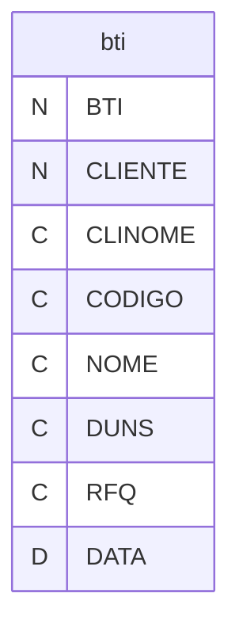

---
## Tabela DBF: `btii`
> **Origem:** `btii` (Driver: DBFCDX)

| Campo | Tipo | Tam | Dec |
| :--- | :--- | :--- | :--- |
| BTI | N | 8 | 0 |
| QTDE | N | 8 | 0 |
| DESCRICAO | C | 80 | 0 |
| CAVIDADE | N | 8 | 0 |
| PRECO | N | 12 | 2 |
| CICLO | C | 20 | 0 |
| CAPACIDA | C | 20 | 0 |

**Indices vinculados:**
- Tag: `BTI` Expressao: `BTI`

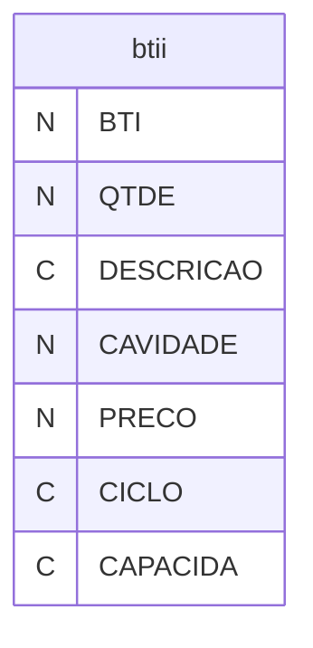

---
## Tabela DBF: `cd`
> **Origem:** `cd` (Driver: DBFCDX)

| Campo | Tipo | Tam | Dec |
| :--- | :--- | :--- | :--- |
| CD | N | 8 | 0 |
| DIGCTR | C | 1 | 0 |
| CHAVE | C | 9 | 0 |
| DATA | D | 8 | 0 |
| CLIENTE | N | 8 | 0 |
| CLINOME | C | 50 | 0 |
| CLICOGN | C | 15 | 0 |
| COMPRADOR | C | 5 | 0 |
| COMPNOME | C | 40 | 0 |
| PECA | C | 24 | 0 |
| PROJETO | C | 50 | 0 |
| NOME | C | 100 | 0 |
| ENGENHA | C | 50 | 0 |
| PLANTA | C | 50 | 0 |
| DATAAUT | D | 8 | 0 |
| PT | L | 1 | 0 |
| PTQT | N | 10 | 0 |
| FD | L | 1 | 0 |
| DC | L | 1 | 0 |
| PCMP | L | 1 | 0 |
| PCMO | L | 1 | 0 |
| MP | L | 1 | 0 |
| OUT | L | 1 | 0 |
| OUTOBS | C | 80 | 0 |
| OBS01 | C | 80 | 0 |
| OBS02 | C | 80 | 0 |
| OBS03 | C | 80 | 0 |
| OBS04 | C | 80 | 0 |
| OBS05 | C | 80 | 0 |
| DATADIM | C | 80 | 0 |
| DATAPRO | C | 80 | 0 |
| EP | L | 1 | 0 |
| MM | L | 1 | 0 |
| NT | L | 1 | 0 |
| FE | L | 1 | 0 |
| DE | L | 1 | 0 |
| AMO | L | 1 | 0 |
| OUTANX | L | 1 | 0 |
| OUTANXOBS | C | 80 | 0 |
| FUNNUM | N | 8 | 0 |
| FUNNOM | C | 40 | 0 |
| DATAEMI | D | 8 | 0 |
| DATAOBS | D | 8 | 0 |
| OBSG01 | C | 80 | 0 |
| OBSG02 | C | 80 | 0 |
| OBSG03 | C | 80 | 0 |
| ATUAL | L | 1 | 0 |
| LOTEANUAL | N | 8 | 0 |
| SETOR | C | 2 | 0 |
| CARGO | C | 40 | 0 |
| RESPO | C | 40 | 0 |
| CODIGOINT | C | 24 | 0 |
| LOTEENTR | N | 8 | 0 |
| RET | L | 1 | 0 |
| VALPEC | N | 10 | 5 |
| IMPOSTO | C | 1 | 0 |
| CPAGP | C | 50 | 0 |
| CEMB | C | 50 | 0 |
| FRETE | C | 1 | 0 |
| FERRA | N | 10 | 2 |
| IMPFER | C | 1 | 0 |
| CPAGF | C | 50 | 0 |
| OBSC01 | C | 80 | 0 |
| OBSC02 | C | 80 | 0 |
| OBSC03 | C | 80 | 0 |
| NUMPRE | N | 8 | 0 |
| NOMPRE | C | 50 | 0 |
| DATAPRE | D | 8 | 0 |
| VIABILI | N | 8 | 0 |
| CODCLI | C | 15 | 0 |

**Indices vinculados:**
- Tag: `CD-1` Expressao: `CHAVE`
- Tag: `CD-2` Expressao: `PECA`
- Tag: `CD-3` Expressao: `CODIGOINT`
- Tag: `CD-4` Expressao: `STR(CLIENTE,8)+PECA`
- Tag: `CD-5` Expressao: `VIABILI`

```mermaid
erDiagram
    cd {
        N CD
        C DIGCTR
        C CHAVE
        D DATA
        N CLIENTE
        C CLINOME
        C CLICOGN
        C COMPRADOR
        C COMPNOME
        C PECA
        C PROJETO
        C NOME
        C ENGENHA
        C PLANTA
        D DATAAUT
        L PT
        N PTQT
        L FD
        L DC
        L PCMP
        L PCMO
        L MP
        L OUT
        C OUTOBS
        C OBS01
        C OBS02
        C OBS03
        C OBS04
        C OBS05
        C DATADIM
        C DATAPRO
        L EP
        L MM
        L NT
        L FE
        L DE
        L AMO
        L OUTANX
        C OUTANXOBS
        N FUNNUM
        C FUNNOM
        D DATAEMI
        D DATAOBS
        C OBSG01
        C OBSG02
        C OBSG03
        L ATUAL
        N LOTEANUAL
        C SETOR
        C CARGO
        C RESPO
        C CODIGOINT
        N LOTEENTR
        L RET
        N VALPEC
        C IMPOSTO
        C CPAGP
        C CEMB
        C FRETE
        N FERRA
        C IMPFER
        C CPAGF
        C OBSC01
        C OBSC02
        C OBSC03
        N NUMPRE
        C NOMPRE
        D DATAPRE
        N VIABILI
        C CODCLI
    }
```

---
## Tabela DBF: `cdapuprd`
> **Origem:** `cdapuprd` (Driver: DBFCDX)

| Campo | Tipo | Tam | Dec |
| :--- | :--- | :--- | :--- |
| CD | N | 8 | 0 |
| ANO | N | 4 | 0 |
| CODIGO | C | 24 | 0 |
| CODIGOINT | C | 24 | 0 |
| DATAINI | D | 8 | 0 |
| DATAPRO | D | 8 | 0 |
| EAC | N | 6 | 0 |
| ATIVA | C | 1 | 0 |
| MES01 | N | 8 | 0 |
| MES02 | N | 8 | 0 |
| MES03 | N | 8 | 0 |
| MES04 | N | 8 | 0 |
| MES05 | N | 8 | 0 |
| MES06 | N | 8 | 0 |
| MES07 | N | 8 | 0 |
| MES08 | N | 8 | 0 |
| MES09 | N | 8 | 0 |
| MES10 | N | 8 | 0 |
| MES11 | N | 8 | 0 |
| MES12 | N | 8 | 0 |
| PRC01 | N | 8 | 4 |
| PRC02 | N | 8 | 4 |
| PRC03 | N | 8 | 4 |
| PRC04 | N | 8 | 4 |
| PRC05 | N | 8 | 4 |
| PRC06 | N | 8 | 4 |
| PRC07 | N | 8 | 4 |
| PRC08 | N | 8 | 4 |
| PRC09 | N | 8 | 4 |
| PRC10 | N | 8 | 4 |
| PRC11 | N | 8 | 4 |
| PRC12 | N | 8 | 4 |
| MESESF | N | 2 | 0 |
| MESESP | N | 2 | 0 |
| PRECO | N | 8 | 4 |
| CLIENTE | N | 8 | 0 |
| COGCLI | C | 15 | 0 |

**Indices vinculados:**
- Tag: `CD01` Expressao: `CD`
- Tag: `CD02` Expressao: `STR(ANO,4)+CODIGO`
- Tag: `CD03` Expressao: `CODIGO+STR(ANO,4)`
- Tag: `CD04` Expressao: `CODIGOINT+STR(ANO,4)`

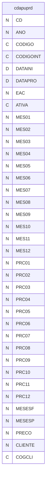

---
## Tabela DBF: `cdi`
> **Origem:** `cdi` (Driver: DBFCDX)

| Campo | Tipo | Tam | Dec |
| :--- | :--- | :--- | :--- |
| CD | N | 8 | 0 |
| DIGCTR | C | 1 | 0 |
| CHAVE | C | 9 | 0 |
| DESENHO | C | 24 | 0 |
| DESTEM | L | 1 | 0 |
| REV | C | 20 | 0 |
| DATAREV | D | 8 | 0 |

**Indices vinculados:**
- Tag: `CHAVE` Expressao: `CHAVE`

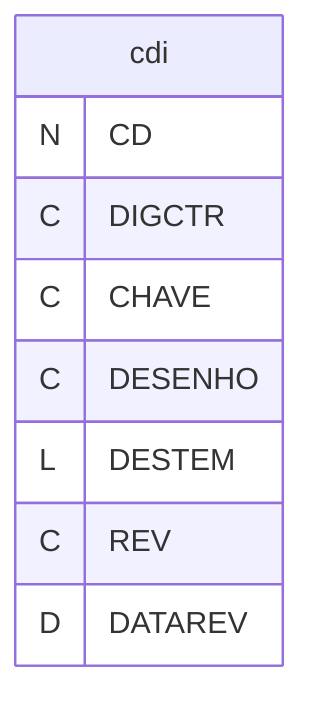

---
## Tabela DBF: `declmot`
> **Origem:** `declmot` (Driver: DBFCDX)

| Campo | Tipo | Tam | Dec |
| :--- | :--- | :--- | :--- |
| NUMERO | N | 3 | 0 |
| NOME | C | 40 | 0 |

**Indices vinculados:**
- Tag: `DECLMOT` Expressao: `NUMERO`

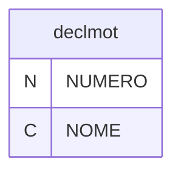

---
## Tabela DBF: `esc`
> **Origem:** `esc` (Driver: DBFCDX)

| Campo | Tipo | Tam | Dec |
| :--- | :--- | :--- | :--- |
| CLIENTE | N | 8 | 0 |
| COGCLI | C | 12 | 0 |
| CODIGO | C | 24 | 0 |
| NOME | C | 75 | 0 |
| VCOM | N | 7 | 4 |
| VCOMI | N | 7 | 4 |
| VCOML | N | 7 | 4 |
| VMAT | N | 9 | 4 |
| VMATI | N | 9 | 4 |
| VMATL | N | 9 | 4 |
| VTER | N | 7 | 4 |
| VMAOM | N | 7 | 4 |
| VMAOO | N | 7 | 4 |
| VREJ | N | 7 | 4 |
| VMAR | N | 9 | 4 |
| FMAR | N | 7 | 4 |
| PUF | C | 2 | 0 |
| PMAK | N | 5 | 2 |
| PICM | N | 5 | 2 |
| PMAR | N | 5 | 2 |
| LANU | N | 7 | 0 |
| LMES | N | 7 | 0 |
| LMIN | N | 7 | 0 |
| VFER | N | 10 | 2 |
| VFERHR | N | 6 | 0 |
| VFERID | N | 6 | 2 |
| PRAZO | D | 8 | 0 |
| PVEN | N | 9 | 4 |
| PVEN2 | N | 9 | 4 |
| PREF | N | 9 | 4 |
| DLUC | N | 7 | 2 |
| DPRE | N | 7 | 2 |
| OBS01 | C | 80 | 0 |
| OBS02 | C | 80 | 0 |
| OBS03 | C | 80 | 0 |
| OBS04 | C | 80 | 0 |
| OBS05 | C | 80 | 0 |
| OBS06 | C | 80 | 0 |
| OBS07 | C | 80 | 0 |
| OBS08 | C | 80 | 0 |
| OBC01 | C | 80 | 0 |
| OBC02 | C | 80 | 0 |
| OBC03 | C | 80 | 0 |
| OBC04 | C | 80 | 0 |
| OBC05 | C | 80 | 0 |
| OBE01 | C | 60 | 0 |
| OBE02 | C | 60 | 0 |
| OBE03 | C | 60 | 0 |
| SUBTOT01 | N | 9 | 4 |
| SUBTOT02 | N | 9 | 4 |
| REV | C | 1 | 0 |
| VIABILI | N | 8 | 0 |
| DUNS | C | 5 | 0 |
| PROJETO | C | 5 | 0 |
| NIVELDAT | D | 8 | 0 |
| VIGENDAT | D | 8 | 0 |
| DATA | D | 8 | 0 |
| USUMEDIO | N | 7 | 2 |
| ELANUM | N | 8 | 0 |
| ELANOM | C | 40 | 0 |
| ELADAT | D | 8 | 0 |
| ELAHOR | C | 8 | 0 |
| PCPRGMED | N | 8 | 0 |
| TIPOIMP | C | 1 | 0 |
| PPIS | N | 5 | 2 |
| PCON | N | 5 | 2 |
| TIPMEDIA | C | 1 | 0 |
| PLUC | N | 5 | 2 |
| PADM | N | 5 | 2 |
| PCOM | N | 5 | 2 |
| PCPM | N | 5 | 2 |
| LICM | L | 1 | 0 |
| PRRJ | N | 5 | 2 |
| CAPPRO | C | 5 | 0 |
| OV | N | 8 | 0 |
| DATACALC | D | 8 | 0 |
| OVORI | N | 8 | 0 |
| PISCON | C | 1 | 0 |
| VTERI | N | 7 | 4 |
| VTERL | N | 7 | 4 |
| OBSP01 | C | 60 | 0 |
| OBSP02 | C | 60 | 0 |
| OVREV | C | 1 | 0 |
| VSIMP | N | 7 | 4 |

**Indices vinculados:**
- Tag: `OV` Expressao: `OV`
- Tag: `CODIGO` Expressao: `CODIGO`
- Tag: `VIABILI` Expressao: `VIABILI`


---
## Tabela DBF: `escms03`
> **Origem:** `escms03` (Driver: DBFCDX)

| Campo | Tipo | Tam | Dec |
| :--- | :--- | :--- | :--- |
| OV | N | 8 | 0 |
| CODIGO | C | 24 | 0 |
| TIPOENT | C | 1 | 0 |
| CODCOMP | C | 24 | 0 |
| NOMECOMP | C | 120 | 0 |
| ORIGEM | C | 20 | 0 |
| QTDDE | N | 10 | 5 |
| PRECO | N | 12 | 4 |
| TOTAL | N | 12 | 4 |
| IICM | L | 1 | 0 |
| REDICM | N | 6 | 2 |
| CODFOLHA | N | 5 | 0 |
| OBS01 | C | 80 | 0 |
| ULTDATA | D | 8 | 0 |
| ULTUND | C | 2 | 0 |

**Indices vinculados:**
- Tag: `OV` Expressao: `OV`


---
## Tabela DBF: `escms06`
> **Origem:** `escms06` (Driver: DBFCDX)

| Campo | Tipo | Tam | Dec |
| :--- | :--- | :--- | :--- |
| OV | N | 8 | 0 |
| CODIGO | C | 24 | 0 |
| SEQ | N | 3 | 0 |
| SSQ | N | 3 | 0 |
| DESCRI | C | 70 | 0 |
| CODMP01 | C | 12 | 0 |
| NOMMP01 | C | 30 | 0 |
| CODMP02 | C | 12 | 0 |
| NOMMP02 | C | 30 | 0 |
| CODMP02B | C | 12 | 0 |
| NOMMP02B | C | 30 | 0 |
| CODMP02C | C | 12 | 0 |
| NOMMP02C | C | 30 | 0 |
| CODMP02D | C | 12 | 0 |
| NOMMP02D | C | 30 | 0 |
| CODMP03 | C | 24 | 0 |
| NOMMP03 | C | 30 | 0 |
| PCHORA | N | 5 | 0 |
| AREA | C | 2 | 0 |
| HRFER | N | 6 | 0 |
| CODFOLHA | N | 6 | 0 |
| PRECO | N | 12 | 4 |
| QTDDE | N | 10 | 5 |
| TOTAL | N | 12 | 4 |
| COGMP01 | C | 10 | 0 |
| PCMEDIA | N | 5 | 0 |
| FLUXO | N | 3 | 0 |
| FATOR | N | 5 | 2 |

**Indices vinculados:**
- Tag: `OV` Expressao: `OV`

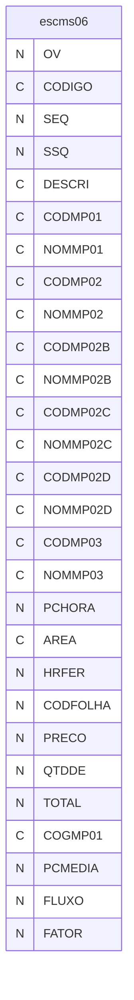

---
## Tabela DBF: `esf`
> **Origem:** `esf` (Driver: DBFCDX)

| Campo | Tipo | Tam | Dec |
| :--- | :--- | :--- | :--- |
| CLIENTE | N | 8 | 0 |
| COGCLI | C | 12 | 0 |
| CODIGO | C | 24 | 0 |
| NOME | C | 75 | 0 |
| VCOM | N | 7 | 4 |
| VCOMI | N | 7 | 4 |
| VCOML | N | 7 | 4 |
| VMAT | N | 9 | 4 |
| VMATI | N | 9 | 4 |
| VMATL | N | 9 | 4 |
| VTER | N | 7 | 4 |
| VMAOM | N | 7 | 4 |
| VMAOO | N | 7 | 4 |
| VREJ | N | 7 | 4 |
| VMAR | N | 9 | 4 |
| FMAR | N | 7 | 4 |
| PUF | C | 2 | 0 |
| PMAK | N | 5 | 2 |
| PICM | N | 5 | 2 |
| PMAR | N | 5 | 2 |
| LANU | N | 7 | 0 |
| LMES | N | 7 | 0 |
| LMIN | N | 7 | 0 |
| VFER | N | 10 | 2 |
| VFERHR | N | 6 | 0 |
| VFERID | N | 6 | 2 |
| PRAZO | D | 8 | 0 |
| PVEN | N | 9 | 4 |
| PVEN2 | N | 9 | 4 |
| PREF | N | 9 | 4 |
| DLUC | N | 7 | 2 |
| DPRE | N | 7 | 2 |
| OBS01 | C | 80 | 0 |
| OBS02 | C | 80 | 0 |
| OBS03 | C | 80 | 0 |
| OBS04 | C | 80 | 0 |
| OBS05 | C | 80 | 0 |
| OBS06 | C | 80 | 0 |
| OBS07 | C | 80 | 0 |
| OBS08 | C | 80 | 0 |
| OBC01 | C | 80 | 0 |
| OBC02 | C | 80 | 0 |
| OBC03 | C | 80 | 0 |
| OBC04 | C | 80 | 0 |
| OBC05 | C | 80 | 0 |
| OBE01 | C | 60 | 0 |
| OBE02 | C | 60 | 0 |
| OBE03 | C | 60 | 0 |
| SUBTOT01 | N | 9 | 4 |
| SUBTOT02 | N | 9 | 4 |
| REV | C | 1 | 0 |
| VIABILI | N | 8 | 0 |
| DUNS | C | 5 | 0 |
| PROJETO | C | 5 | 0 |
| NIVELDAT | D | 8 | 0 |
| VIGENDAT | D | 8 | 0 |
| DATA | D | 8 | 0 |
| USUMEDIO | N | 7 | 2 |
| ELANUM | N | 8 | 0 |
| ELANOM | C | 40 | 0 |
| ELADAT | D | 8 | 0 |
| ELAHOR | C | 8 | 0 |
| PCPRGMED | N | 8 | 0 |
| TIPOIMP | C | 1 | 0 |
| PPIS | N | 5 | 2 |
| PCON | N | 5 | 2 |
| TIPMEDIA | C | 1 | 0 |
| PLUC | N | 5 | 2 |
| PADM | N | 5 | 2 |
| PCOM | N | 5 | 2 |
| PCPM | N | 5 | 2 |
| LICM | L | 1 | 0 |
| PRRJ | N | 5 | 2 |
| CAPPRO | C | 5 | 0 |
| OV | N | 8 | 0 |
| DATACALC | D | 8 | 0 |
| OVORI | N | 8 | 0 |
| PISCON | C | 1 | 0 |
| VTERI | N | 7 | 4 |
| VTERL | N | 7 | 4 |
| OBSP01 | C | 60 | 0 |
| OBSP02 | C | 60 | 0 |
| OVREV | C | 1 | 0 |
| VSIMP | N | 7 | 4 |

**Indices vinculados:**
- Tag: `OV` Expressao: `OV`
- Tag: `CODIGO` Expressao: `CODIGO`
- Tag: `VIABILI` Expressao: `VIABILI`


---
## Tabela DBF: `esfms03`
> **Origem:** `esfms03` (Driver: DBFCDX)

| Campo | Tipo | Tam | Dec |
| :--- | :--- | :--- | :--- |
| OV | N | 8 | 0 |
| CODIGO | C | 24 | 0 |
| TIPOENT | C | 1 | 0 |
| CODCOMP | C | 24 | 0 |
| NOMECOMP | C | 120 | 0 |
| ORIGEM | C | 20 | 0 |
| QTDDE | N | 10 | 5 |
| PRECO | N | 12 | 4 |
| TOTAL | N | 12 | 4 |
| IICM | L | 1 | 0 |
| REDICM | N | 6 | 2 |
| CODFOLHA | N | 5 | 0 |
| OBS01 | C | 80 | 0 |
| ULTDATA | D | 8 | 0 |
| ULTUND | C | 2 | 0 |

**Indices vinculados:**
- Tag: `OV` Expressao: `OV`

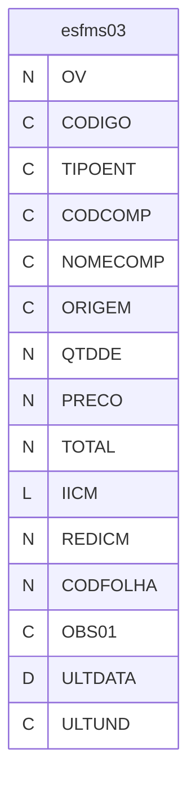

---
## Tabela DBF: `esfms06`
> **Origem:** `esfms06` (Driver: DBFCDX)

| Campo | Tipo | Tam | Dec |
| :--- | :--- | :--- | :--- |
| OV | N | 8 | 0 |
| CODIGO | C | 24 | 0 |
| SEQ | N | 3 | 0 |
| SSQ | N | 3 | 0 |
| DESCRI | C | 70 | 0 |
| CODMP01 | C | 12 | 0 |
| NOMMP01 | C | 30 | 0 |
| CODMP02 | C | 12 | 0 |
| NOMMP02 | C | 30 | 0 |
| CODMP02B | C | 12 | 0 |
| NOMMP02B | C | 30 | 0 |
| CODMP02C | C | 12 | 0 |
| NOMMP02C | C | 30 | 0 |
| CODMP02D | C | 12 | 0 |
| NOMMP02D | C | 30 | 0 |
| CODMP03 | C | 24 | 0 |
| NOMMP03 | C | 30 | 0 |
| PCHORA | N | 5 | 0 |
| AREA | C | 2 | 0 |
| HRFER | N | 6 | 0 |
| CODFOLHA | N | 6 | 0 |
| PRECO | N | 12 | 4 |
| QTDDE | N | 10 | 5 |
| TOTAL | N | 12 | 4 |
| COGMP01 | C | 10 | 0 |
| PCMEDIA | N | 5 | 0 |
| FLUXO | N | 3 | 0 |
| FATOR | N | 5 | 2 |

**Indices vinculados:**
- Tag: `OV` Expressao: `OV`

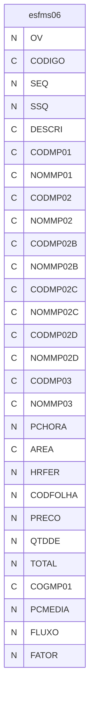

---
## Tabela DBF: `eso`
> **Origem:** `eso` (Driver: DBFCDX)

| Campo | Tipo | Tam | Dec |
| :--- | :--- | :--- | :--- |
| CLIENTE | N | 8 | 0 |
| COGCLI | C | 12 | 0 |
| CODIGO | C | 24 | 0 |
| NOME | C | 75 | 0 |
| VCOM | N | 7 | 4 |
| VCOMI | N | 7 | 4 |
| VCOML | N | 7 | 4 |
| VMAT | N | 9 | 4 |
| VMATI | N | 9 | 4 |
| VMATL | N | 9 | 4 |
| VTER | N | 7 | 4 |
| VMAOM | N | 7 | 4 |
| VMAOO | N | 7 | 4 |
| VREJ | N | 7 | 4 |
| VMAR | N | 9 | 4 |
| FMAR | N | 7 | 4 |
| PUF | C | 2 | 0 |
| PMAK | N | 5 | 2 |
| PICM | N | 5 | 2 |
| PMAR | N | 5 | 2 |
| LANU | N | 7 | 0 |
| LMES | N | 7 | 0 |
| LMIN | N | 7 | 0 |
| VFER | N | 10 | 2 |
| VFERHR | N | 6 | 0 |
| VFERID | N | 6 | 2 |
| PRAZO | D | 8 | 0 |
| PVEN | N | 9 | 4 |
| PVEN2 | N | 9 | 4 |
| PREF | N | 9 | 4 |
| DLUC | N | 7 | 2 |
| DPRE | N | 7 | 2 |
| OBS01 | C | 80 | 0 |
| OBS02 | C | 80 | 0 |
| OBS03 | C | 80 | 0 |
| OBS04 | C | 80 | 0 |
| OBS05 | C | 80 | 0 |
| OBS06 | C | 80 | 0 |
| OBS07 | C | 80 | 0 |
| OBS08 | C | 80 | 0 |
| OBC01 | C | 80 | 0 |
| OBC02 | C | 80 | 0 |
| OBC03 | C | 80 | 0 |
| OBC04 | C | 80 | 0 |
| OBC05 | C | 80 | 0 |
| OBE01 | C | 60 | 0 |
| OBE02 | C | 60 | 0 |
| OBE03 | C | 60 | 0 |
| SUBTOT01 | N | 9 | 4 |
| SUBTOT02 | N | 9 | 4 |
| REV | C | 1 | 0 |
| VIABILI | N | 8 | 0 |
| DUNS | C | 5 | 0 |
| PROJETO | C | 5 | 0 |
| NIVELDAT | D | 8 | 0 |
| VIGENDAT | D | 8 | 0 |
| DATA | D | 8 | 0 |
| USUMEDIO | N | 7 | 2 |
| ELANUM | N | 8 | 0 |
| ELANOM | C | 40 | 0 |
| ELADAT | D | 8 | 0 |
| ELAHOR | C | 8 | 0 |
| PCPRGMED | N | 8 | 0 |
| TIPOIMP | C | 1 | 0 |
| PPIS | N | 5 | 2 |
| PCON | N | 5 | 2 |
| TIPMEDIA | C | 1 | 0 |
| PLUC | N | 5 | 2 |
| PADM | N | 5 | 2 |
| PCOM | N | 5 | 2 |
| PCPM | N | 5 | 2 |
| LICM | L | 1 | 0 |
| PRRJ | N | 5 | 2 |
| CAPPRO | C | 5 | 0 |
| OV | N | 8 | 0 |
| DATACALC | D | 8 | 0 |
| OVORI | N | 8 | 0 |
| PISCON | C | 1 | 0 |
| VTERI | N | 7 | 4 |
| VTERL | N | 7 | 4 |
| OBSP01 | C | 60 | 0 |
| OBSP02 | C | 60 | 0 |
| OVREV | C | 1 | 0 |
| VSIMP | N | 7 | 4 |

**Indices vinculados:**
- Tag: `OV` Expressao: `OV`
- Tag: `CODIGO` Expressao: `CODIGO`
- Tag: `VIABILI` Expressao: `VIABILI`

```mermaid
erDiagram
    eso {
        N CLIENTE
        C COGCLI
        C CODIGO
        C NOME
        N VCOM
        N VCOMI
        N VCOML
        N VMAT
        N VMATI
        N VMATL
        N VTER
        N VMAOM
        N VMAOO
        N VREJ
        N VMAR
        N FMAR
        C PUF
        N PMAK
        N PICM
        N PMAR
        N LANU
        N LMES
        N LMIN
        N VFER
        N VFERHR
        N VFERID
        D PRAZO
        N PVEN
        N PVEN2
        N PREF
        N DLUC
        N DPRE
        C OBS01
        C OBS02
        C OBS03
        C OBS04
        C OBS05
        C OBS06
        C OBS07
        C OBS08
        C OBC01
        C OBC02
        C OBC03
        C OBC04
        C OBC05
        C OBE01
        C OBE02
        C OBE03
        N SUBTOT01
        N SUBTOT02
        C REV
        N VIABILI
        C DUNS
        C PROJETO
        D NIVELDAT
        D VIGENDAT
        D DATA
        N USUMEDIO
        N ELANUM
        C ELANOM
        D ELADAT
        C ELAHOR
        N PCPRGMED
        C TIPOIMP
        N PPIS
        N PCON
        C TIPMEDIA
        N PLUC
        N PADM
        N PCOM
        N PCPM
        L LICM
        N PRRJ
        C CAPPRO
        N OV
        D DATACALC
        N OVORI
        C PISCON
        N VTERI
        N VTERL
        C OBSP01
        C OBSP02
        C OVREV
        N VSIMP
    }
```

---
## Tabela DBF: `esoms03`
> **Origem:** `esoms03` (Driver: DBFCDX)

| Campo | Tipo | Tam | Dec |
| :--- | :--- | :--- | :--- |
| OV | N | 8 | 0 |
| CODIGO | C | 24 | 0 |
| TIPOENT | C | 1 | 0 |
| CODCOMP | C | 24 | 0 |
| NOMECOMP | C | 120 | 0 |
| ORIGEM | C | 20 | 0 |
| QTDDE | N | 10 | 5 |
| PRECO | N | 12 | 4 |
| TOTAL | N | 12 | 4 |
| IICM | L | 1 | 0 |
| REDICM | N | 6 | 2 |
| CODFOLHA | N | 5 | 0 |
| OBS01 | C | 80 | 0 |
| ULTDATA | D | 8 | 0 |
| ULTUND | C | 2 | 0 |

**Indices vinculados:**
- Tag: `OV` Expressao: `OV`

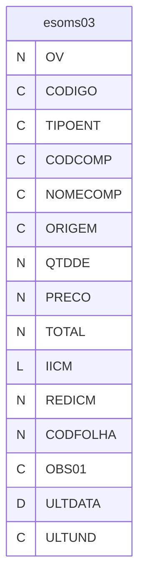

---
## Tabela DBF: `esoms06`
> **Origem:** `esoms06` (Driver: DBFCDX)

| Campo | Tipo | Tam | Dec |
| :--- | :--- | :--- | :--- |
| OV | N | 8 | 0 |
| CODIGO | C | 24 | 0 |
| SEQ | N | 3 | 0 |
| SSQ | N | 3 | 0 |
| DESCRI | C | 70 | 0 |
| CODMP01 | C | 12 | 0 |
| NOMMP01 | C | 30 | 0 |
| CODMP02 | C | 12 | 0 |
| NOMMP02 | C | 30 | 0 |
| CODMP02B | C | 12 | 0 |
| NOMMP02B | C | 30 | 0 |
| CODMP02C | C | 12 | 0 |
| NOMMP02C | C | 30 | 0 |
| CODMP02D | C | 12 | 0 |
| NOMMP02D | C | 30 | 0 |
| CODMP03 | C | 24 | 0 |
| NOMMP03 | C | 30 | 0 |
| PCHORA | N | 5 | 0 |
| AREA | C | 2 | 0 |
| HRFER | N | 6 | 0 |
| CODFOLHA | N | 6 | 0 |
| PRECO | N | 12 | 4 |
| QTDDE | N | 10 | 5 |
| TOTAL | N | 12 | 4 |
| COGMP01 | C | 10 | 0 |
| PCMEDIA | N | 5 | 0 |
| FLUXO | N | 3 | 0 |
| FATOR | N | 5 | 2 |


---
## Tabela DBF: `esp`
> **Origem:** `esp` (Driver: DBFCDX)

| Campo | Tipo | Tam | Dec |
| :--- | :--- | :--- | :--- |
| CLIENTE | N | 8 | 0 |
| COGCLI | C | 12 | 0 |
| CODIGO | C | 24 | 0 |
| NOME | C | 75 | 0 |
| VCOM | N | 7 | 4 |
| VCOMI | N | 7 | 4 |
| VCOML | N | 7 | 4 |
| VMAT | N | 9 | 4 |
| VMATI | N | 9 | 4 |
| VMATL | N | 9 | 4 |
| VTER | N | 7 | 4 |
| VMAOM | N | 7 | 4 |
| VMAOO | N | 7 | 4 |
| VREJ | N | 7 | 4 |
| VMAR | N | 9 | 4 |
| FMAR | N | 7 | 4 |
| PUF | C | 2 | 0 |
| PMAK | N | 5 | 2 |
| PICM | N | 5 | 2 |
| PMAR | N | 5 | 2 |
| LANU | N | 7 | 0 |
| LMES | N | 7 | 0 |
| LMIN | N | 7 | 0 |
| VFER | N | 10 | 2 |
| VFERHR | N | 6 | 0 |
| VFERID | N | 6 | 2 |
| PRAZO | D | 8 | 0 |
| PVEN | N | 9 | 4 |
| PVEN2 | N | 9 | 4 |
| PREF | N | 9 | 4 |
| DLUC | N | 7 | 2 |
| DPRE | N | 7 | 2 |
| OBS01 | C | 80 | 0 |
| OBS02 | C | 80 | 0 |
| OBS03 | C | 80 | 0 |
| OBS04 | C | 80 | 0 |
| OBS05 | C | 80 | 0 |
| OBS06 | C | 80 | 0 |
| OBS07 | C | 80 | 0 |
| OBS08 | C | 80 | 0 |
| OBC01 | C | 80 | 0 |
| OBC02 | C | 80 | 0 |
| OBC03 | C | 80 | 0 |
| OBC04 | C | 80 | 0 |
| OBC05 | C | 80 | 0 |
| OBE01 | C | 60 | 0 |
| OBE02 | C | 60 | 0 |
| OBE03 | C | 60 | 0 |
| SUBTOT01 | N | 9 | 4 |
| SUBTOT02 | N | 9 | 4 |
| REV | C | 1 | 0 |
| VIABILI | N | 8 | 0 |
| DUNS | C | 5 | 0 |
| PROJETO | C | 5 | 0 |
| NIVELDAT | D | 8 | 0 |
| VIGENDAT | D | 8 | 0 |
| DATA | D | 8 | 0 |
| USUMEDIO | N | 7 | 2 |
| ELANUM | N | 8 | 0 |
| ELANOM | C | 40 | 0 |
| ELADAT | D | 8 | 0 |
| ELAHOR | C | 8 | 0 |
| PCPRGMED | N | 8 | 0 |
| TIPOIMP | C | 1 | 0 |
| PPIS | N | 5 | 2 |
| PCON | N | 5 | 2 |
| TIPMEDIA | C | 1 | 0 |
| PLUC | N | 5 | 2 |
| PADM | N | 5 | 2 |
| PCOM | N | 5 | 2 |
| PCPM | N | 5 | 2 |
| LICM | L | 1 | 0 |
| PRRJ | N | 5 | 2 |
| CAPPRO | C | 5 | 0 |
| OV | N | 8 | 0 |
| DATACALC | D | 8 | 0 |
| OVORI | N | 8 | 0 |
| PISCON | C | 1 | 0 |
| VTERI | N | 7 | 4 |
| VTERL | N | 7 | 4 |
| OBSP01 | C | 60 | 0 |
| OBSP02 | C | 60 | 0 |
| OVREV | C | 1 | 0 |
| VSIMP | N | 7 | 4 |

**Indices vinculados:**
- Tag: `OV` Expressao: `OV`
- Tag: `CODIGO` Expressao: `CODIGO`
- Tag: `VIABILI` Expressao: `VIABILI`


---
## Tabela DBF: `espms03`
> **Origem:** `espms03` (Driver: DBFCDX)

| Campo | Tipo | Tam | Dec |
| :--- | :--- | :--- | :--- |
| OV | N | 8 | 0 |
| CODIGO | C | 24 | 0 |
| TIPOENT | C | 1 | 0 |
| CODCOMP | C | 24 | 0 |
| NOMECOMP | C | 120 | 0 |
| ORIGEM | C | 20 | 0 |
| QTDDE | N | 10 | 5 |
| PRECO | N | 12 | 4 |
| TOTAL | N | 12 | 4 |
| IICM | L | 1 | 0 |
| REDICM | N | 6 | 2 |
| CODFOLHA | N | 5 | 0 |
| OBS01 | C | 80 | 0 |
| ULTDATA | D | 8 | 0 |
| ULTUND | C | 2 | 0 |

**Indices vinculados:**
- Tag: `OV` Expressao: `OV`

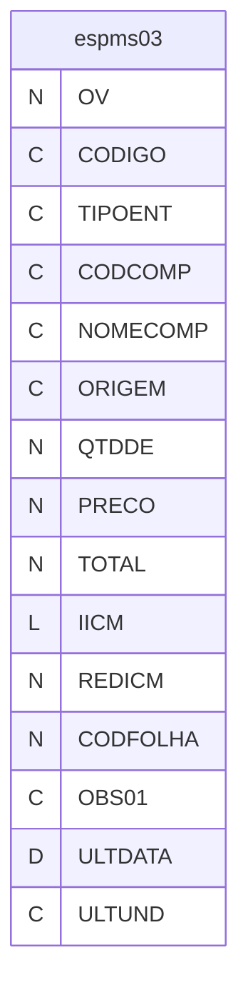

---
## Tabela DBF: `espms06`
> **Origem:** `espms06` (Driver: DBFCDX)

| Campo | Tipo | Tam | Dec |
| :--- | :--- | :--- | :--- |
| OV | N | 8 | 0 |
| CODIGO | C | 24 | 0 |
| SEQ | N | 3 | 0 |
| SSQ | N | 3 | 0 |
| DESCRI | C | 70 | 0 |
| CODMP01 | C | 12 | 0 |
| NOMMP01 | C | 30 | 0 |
| CODMP02 | C | 12 | 0 |
| NOMMP02 | C | 30 | 0 |
| CODMP02B | C | 12 | 0 |
| NOMMP02B | C | 30 | 0 |
| CODMP02C | C | 12 | 0 |
| NOMMP02C | C | 30 | 0 |
| CODMP02D | C | 12 | 0 |
| NOMMP02D | C | 30 | 0 |
| CODMP03 | C | 24 | 0 |
| NOMMP03 | C | 30 | 0 |
| PCHORA | N | 5 | 0 |
| AREA | C | 2 | 0 |
| HRFER | N | 6 | 0 |
| CODFOLHA | N | 6 | 0 |
| PRECO | N | 12 | 4 |
| QTDDE | N | 10 | 5 |
| TOTAL | N | 12 | 4 |
| COGMP01 | C | 10 | 0 |
| PCMEDIA | N | 5 | 0 |
| FLUXO | N | 3 | 0 |
| FATOR | N | 5 | 2 |

**Indices vinculados:**
- Tag: `OV` Expressao: `OV`

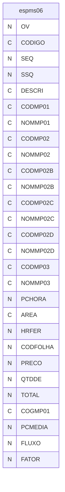

---
## Tabela DBF: `fluxo`
> **Origem:** `fluxo` (Driver: DBFCDX)

| Campo | Tipo | Tam | Dec |
| :--- | :--- | :--- | :--- |
| CODIGO | C | 1 | 0 |
| NOME | C | 50 | 0 |
| NUMERO | N | 3 | 0 |

**Indices vinculados:**
- Tag: `FLUXO-1` Expressao: `NUMERO`

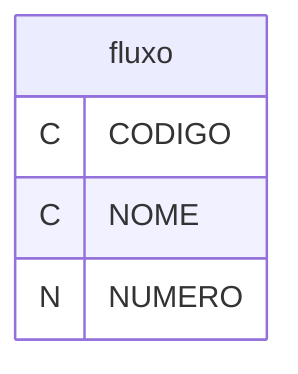

---
## Tabela DBF: `np`
> **Origem:** `np` (Driver: DBFCDX)

| Campo | Tipo | Tam | Dec |
| :--- | :--- | :--- | :--- |
| NP | N | 8 | 0 |
| CODIGO | C | 24 | 0 |
| NOME | C | 40 | 0 |
| CLIENTE | N | 8 | 0 |
| CLINOME | C | 40 | 0 |
| VEICULO | C | 20 | 0 |
| PRSICM | N | 10 | 4 |
| PRCICM | N | 10 | 4 |
| VLFER | N | 12 | 2 |
| PRAZO | D | 8 | 0 |
| QTDMES | N | 8 | 0 |
| COMPRADOR | C | 5 | 0 |
| COMPNOME | C | 40 | 0 |
| DESANUAL | N | 1 | 0 |
| OS | C | 20 | 0 |
| ANO | N | 4 | 0 |
| PENDENTE | L | 1 | 0 |

**Indices vinculados:**
- Tag: `NP` Expressao: `NP`
- Tag: `CLIENTE` Expressao: `CLIENTE`
- Tag: `CODIGO` Expressao: `CODIGO`

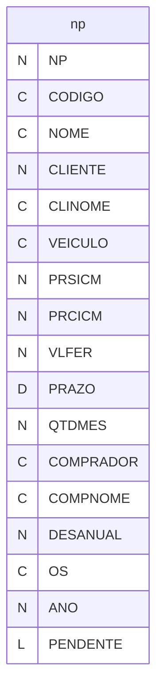

---
## Tabela DBF: `orca`
> **Origem:** `orca` (Driver: DBFCDX)

| Campo | Tipo | Tam | Dec |
| :--- | :--- | :--- | :--- |
| ORCA | N | 8 | 0 |
| CLIENTE | N | 8 | 0 |
| CLINOME | C | 50 | 0 |
| AC | C | 40 | 0 |
| REFER | C | 20 | 0 |
| DATA | D | 8 | 0 |
| ORC | C | 40 | 0 |
| ORC01 | C | 100 | 0 |
| ORC02 | C | 100 | 0 |
| PRAZO | C | 150 | 0 |
| PRAZ2 | C | 150 | 0 |
| PRAZ3 | C | 150 | 0 |
| PRAZ4 | C | 150 | 0 |
| CPAG | C | 50 | 0 |
| CFER | C | 100 | 0 |
| CVAL | C | 20 | 0 |
| OBS01 | C | 200 | 0 |
| OBS02 | C | 200 | 0 |
| OBS03 | C | 200 | 0 |
| OBS04 | C | 200 | 0 |
| OBS05 | C | 200 | 0 |
| OBS06 | C | 200 | 0 |
| OBS07 | C | 200 | 0 |
| OBS08 | C | 200 | 0 |
| SETOR | C | 2 | 0 |
| CARGO | C | 40 | 0 |
| RESPO | C | 40 | 0 |
| NIVEL | D | 8 | 0 |
| CAMBIO | C | 15 | 0 |
| REVI | C | 1 | 0 |

**Indices vinculados:**
- Tag: `ORCA` Expressao: `ORCA`

```mermaid
erDiagram
    orca {
        N ORCA
        N CLIENTE
        C CLINOME
        C AC
        C REFER
        D DATA
        C ORC
        C ORC01
        C ORC02
        C PRAZO
        C PRAZ2
        C PRAZ3
        C PRAZ4
        C CPAG
        C CFER
        C CVAL
        C OBS01
        C OBS02
        C OBS03
        C OBS04
        C OBS05
        C OBS06
        C OBS07
        C OBS08
        C SETOR
        C CARGO
        C RESPO
        D NIVEL
        C CAMBIO
        C REVI
    }
```

---
## Tabela DBF: `orcai`
> **Origem:** `orcai` (Driver: DBFCDX)

| Campo | Tipo | Tam | Dec |
| :--- | :--- | :--- | :--- |
| ORCA | N | 8 | 0 |
| ORD | N | 3 | 0 |
| QTDDE | N | 8 | 0 |
| UNID | C | 2 | 0 |
| DESCR | C | 100 | 0 |
| UNIPEC | C | 2 | 0 |
| VALPEC | N | 10 | 5 |
| FERRA | N | 10 | 2 |
| LOTEMIN | N | 8 | 0 |
| VIABILI | N | 8 | 0 |
| OBSITEM | C | 80 | 0 |
| OBSITE2 | C | 80 | 0 |
| OBSITE3 | C | 80 | 0 |
| OBSITE4 | C | 80 | 0 |
| OBSITE5 | C | 80 | 0 |
| DESENHO | C | 20 | 0 |
| REV | C | 20 | 0 |
| DATAREV | C | 10 | 0 |

**Indices vinculados:**
- Tag: `ORCA` Expressao: `ORCA`

```mermaid
erDiagram
    orcai {
        N ORCA
        N ORD
        N QTDDE
        C UNID
        C DESCR
        C UNIPEC
        N VALPEC
        N FERRA
        N LOTEMIN
        N VIABILI
        C OBSITEM
        C OBSITE2
        C OBSITE3
        C OBSITE4
        C OBSITE5
        C DESENHO
        C REV
        C DATAREV
    }
```

---
## Tabela DBF: `vfms03`
> **Origem:** `vfms03` (Driver: DBFCDX)

| Campo | Tipo | Tam | Dec |
| :--- | :--- | :--- | :--- |
| OV | N | 8 | 0 |
| CODIGO | C | 24 | 0 |
| TIPOENT | C | 1 | 0 |
| CODCOMP | C | 24 | 0 |
| NOMECOMP | C | 120 | 0 |
| ORIGEM | C | 20 | 0 |
| QTDDE | N | 10 | 5 |
| PRECO | N | 12 | 4 |
| TOTAL | N | 12 | 4 |
| IICM | L | 1 | 0 |
| REDICM | N | 6 | 2 |
| CODFOLHA | N | 5 | 0 |
| OBS01 | C | 80 | 0 |
| ULTDATA | D | 8 | 0 |
| ULTUND | C | 2 | 0 |

**Indices vinculados:**
- Tag: `OV` Expressao: `OV`

```mermaid
erDiagram
    vfms03 {
        N OV
        C CODIGO
        C TIPOENT
        C CODCOMP
        C NOMECOMP
        C ORIGEM
        N QTDDE
        N PRECO
        N TOTAL
        L IICM
        N REDICM
        N CODFOLHA
        C OBS01
        D ULTDATA
        C ULTUND
    }
```

---
## Tabela DBF: `vfms06`
> **Origem:** `vfms06` (Driver: DBFCDX)

| Campo | Tipo | Tam | Dec |
| :--- | :--- | :--- | :--- |
| OV | N | 8 | 0 |
| CODIGO | C | 24 | 0 |
| SEQ | N | 3 | 0 |
| SSQ | N | 3 | 0 |
| DESCRI | C | 70 | 0 |
| CODMP01 | C | 12 | 0 |
| NOMMP01 | C | 30 | 0 |
| CODMP02 | C | 12 | 0 |
| NOMMP02 | C | 30 | 0 |
| CODMP02B | C | 12 | 0 |
| NOMMP02B | C | 30 | 0 |
| CODMP02C | C | 12 | 0 |
| NOMMP02C | C | 30 | 0 |
| CODMP02D | C | 12 | 0 |
| NOMMP02D | C | 30 | 0 |
| CODMP03 | C | 24 | 0 |
| NOMMP03 | C | 30 | 0 |
| PCHORA | N | 5 | 0 |
| AREA | C | 2 | 0 |
| HRFER | N | 6 | 0 |
| CODFOLHA | N | 6 | 0 |
| PRECO | N | 12 | 4 |
| QTDDE | N | 10 | 5 |
| TOTAL | N | 12 | 4 |
| COGMP01 | C | 10 | 0 |
| PCMEDIA | N | 5 | 0 |
| FLUXO | N | 3 | 0 |
| FATOR | N | 5 | 2 |

**Indices vinculados:**
- Tag: `OV` Expressao: `OV`

```mermaid
erDiagram
    vfms06 {
        N OV
        C CODIGO
        N SEQ
        N SSQ
        C DESCRI
        C CODMP01
        C NOMMP01
        C CODMP02
        C NOMMP02
        C CODMP02B
        C NOMMP02B
        C CODMP02C
        C NOMMP02C
        C CODMP02D
        C NOMMP02D
        C CODMP03
        C NOMMP03
        N PCHORA
        C AREA
        N HRFER
        N CODFOLHA
        N PRECO
        N QTDDE
        N TOTAL
        C COGMP01
        N PCMEDIA
        N FLUXO
        N FATOR
    }
```

---
## Tabela DBF: `vforc`
> **Origem:** `vforc` (Driver: DBFCDX)

| Campo | Tipo | Tam | Dec |
| :--- | :--- | :--- | :--- |
| CLIENTE | N | 8 | 0 |
| COGCLI | C | 12 | 0 |
| CODIGO | C | 24 | 0 |
| NOME | C | 75 | 0 |
| VCOM | N | 7 | 4 |
| VCOMI | N | 7 | 4 |
| VCOML | N | 7 | 4 |
| VMAT | N | 9 | 4 |
| VMATI | N | 9 | 4 |
| VMATL | N | 9 | 4 |
| VTER | N | 7 | 4 |
| VMAOM | N | 7 | 4 |
| VMAOO | N | 7 | 4 |
| VREJ | N | 7 | 4 |
| VMAR | N | 9 | 4 |
| FMAR | N | 7 | 4 |
| PUF | C | 2 | 0 |
| PMAK | N | 5 | 2 |
| PICM | N | 5 | 2 |
| PMAR | N | 5 | 2 |
| LANU | N | 7 | 0 |
| LMES | N | 7 | 0 |
| LMIN | N | 7 | 0 |
| VFER | N | 10 | 2 |
| VFERHR | N | 6 | 0 |
| VFERID | N | 6 | 2 |
| PRAZO | D | 8 | 0 |
| PVEN | N | 9 | 4 |
| PVEN2 | N | 9 | 4 |
| PREF | N | 9 | 4 |
| DLUC | N | 7 | 2 |
| DPRE | N | 7 | 2 |
| OBS01 | C | 80 | 0 |
| OBS02 | C | 80 | 0 |
| OBS03 | C | 80 | 0 |
| OBS04 | C | 80 | 0 |
| OBS05 | C | 80 | 0 |
| OBS06 | C | 80 | 0 |
| OBS07 | C | 80 | 0 |
| OBS08 | C | 80 | 0 |
| OBC01 | C | 80 | 0 |
| OBC02 | C | 80 | 0 |
| OBC03 | C | 80 | 0 |
| OBC04 | C | 80 | 0 |
| OBC05 | C | 80 | 0 |
| OBE01 | C | 60 | 0 |
| OBE02 | C | 60 | 0 |
| OBE03 | C | 60 | 0 |
| SUBTOT01 | N | 9 | 4 |
| SUBTOT02 | N | 9 | 4 |
| REV | C | 1 | 0 |
| VIABILI | N | 8 | 0 |
| DUNS | C | 5 | 0 |
| PROJETO | C | 5 | 0 |
| NIVELDAT | D | 8 | 0 |
| VIGENDAT | D | 8 | 0 |
| DATA | D | 8 | 0 |
| USUMEDIO | N | 7 | 2 |
| ELANUM | N | 8 | 0 |
| ELANOM | C | 40 | 0 |
| ELADAT | D | 8 | 0 |
| ELAHOR | C | 8 | 0 |
| PCPRGMED | N | 8 | 0 |
| TIPOIMP | C | 1 | 0 |
| PPIS | N | 5 | 2 |
| PCON | N | 5 | 2 |
| TIPMEDIA | C | 1 | 0 |
| PLUC | N | 5 | 2 |
| PADM | N | 5 | 2 |
| PCOM | N | 5 | 2 |
| PCPM | N | 5 | 2 |
| LICM | L | 1 | 0 |
| PRRJ | N | 5 | 2 |
| CAPPRO | C | 5 | 0 |
| OV | N | 8 | 0 |
| DATACALC | D | 8 | 0 |
| OVORI | N | 8 | 0 |
| PISCON | C | 1 | 0 |
| VTERI | N | 7 | 4 |
| VTERL | N | 7 | 4 |
| OBSP01 | C | 60 | 0 |
| OBSP02 | C | 60 | 0 |
| OVREV | C | 1 | 0 |
| VSIMP | N | 7 | 4 |

**Indices vinculados:**
- Tag: `OV` Expressao: `OV`
- Tag: `CODIGO` Expressao: `CODIGO`
- Tag: `VIABILI` Expressao: `VIABILI`

```mermaid
erDiagram
    vforc {
        N CLIENTE
        C COGCLI
        C CODIGO
        C NOME
        N VCOM
        N VCOMI
        N VCOML
        N VMAT
        N VMATI
        N VMATL
        N VTER
        N VMAOM
        N VMAOO
        N VREJ
        N VMAR
        N FMAR
        C PUF
        N PMAK
        N PICM
        N PMAR
        N LANU
        N LMES
        N LMIN
        N VFER
        N VFERHR
        N VFERID
        D PRAZO
        N PVEN
        N PVEN2
        N PREF
        N DLUC
        N DPRE
        C OBS01
        C OBS02
        C OBS03
        C OBS04
        C OBS05
        C OBS06
        C OBS07
        C OBS08
        C OBC01
        C OBC02
        C OBC03
        C OBC04
        C OBC05
        C OBE01
        C OBE02
        C OBE03
        N SUBTOT01
        N SUBTOT02
        C REV
        N VIABILI
        C DUNS
        C PROJETO
        D NIVELDAT
        D VIGENDAT
        D DATA
        N USUMEDIO
        N ELANUM
        C ELANOM
        D ELADAT
        C ELAHOR
        N PCPRGMED
        C TIPOIMP
        N PPIS
        N PCON
        C TIPMEDIA
        N PLUC
        N PADM
        N PCOM
        N PCPM
        L LICM
        N PRRJ
        C CAPPRO
        N OV
        D DATACALC
        N OVORI
        C PISCON
        N VTERI
        N VTERL
        C OBSP01
        C OBSP02
        C OVREV
        N VSIMP
    }
```

---
## Tabela DBF: `viabiii`
> **Origem:** `viabiii` (Driver: DBFCDX)

| Campo | Tipo | Tam | Dec |
| :--- | :--- | :--- | :--- |
| OV | N | 8 | 0 |
| ITEM | N | 3 | 0 |
| TIPO | C | 1 | 0 |
| REV | C | 10 | 0 |
| SITUACAO | C | 1 | 0 |
| SITUSER | C | 10 | 0 |
| SITDATA | D | 8 | 0 |
| SITHORA | C | 10 | 0 |
| PRECO | N | 12 | 2 |
| PRECODT | D | 8 | 0 |
| PRECOUN | C | 2 | 0 |
| CLIFOR | N | 8 | 0 |
| CLICOG | C | 12 | 0 |
| APROVACAO | C | 1 | 0 |
| APRUSER | C | 10 | 0 |
| APRDATA | D | 8 | 0 |
| APRTIME | C | 10 | 0 |
| COTUSR | C | 10 | 0 |
| COTDATA | D | 8 | 0 |
| COTTIME | C | 10 | 0 |
| DATALC | D | 8 | 0 |
| PRAZOI | D | 8 | 0 |
| DADO | M | 10 | 0 |
| SITOBS | M | 10 | 0 |
| APROBS | M | 10 | 0 |

**Indices vinculados:**
- Tag: `OVITEM` Expressao: `STR(OV,8)+STR(ITEM,3)`
- Tag: `OV` Expressao: `OV`

```mermaid
erDiagram
    viabiii {
        N OV
        N ITEM
        C TIPO
        C REV
        C SITUACAO
        C SITUSER
        D SITDATA
        C SITHORA
        N PRECO
        D PRECODT
        C PRECOUN
        N CLIFOR
        C CLICOG
        C APROVACAO
        C APRUSER
        D APRDATA
        C APRTIME
        C COTUSR
        D COTDATA
        C COTTIME
        D DATALC
        D PRAZOI
        M DADO
        M SITOBS
        M APROBS
    }
```

---
## Tabela DBF: `viabili`
> **Origem:** `viabili` (Driver: DBFCDX)

| Campo | Tipo | Tam | Dec |
| :--- | :--- | :--- | :--- |
| OV | N | 8 | 0 |
| OVORI | N | 8 | 0 |
| CLIENTE | N | 8 | 0 |
| CLINOME | C | 50 | 0 |
| CLICOGN | C | 12 | 0 |
| COMCOMP | C | 40 | 0 |
| COMPRADOR | C | 5 | 0 |
| DESENHO | C | 20 | 0 |
| PECA | C | 20 | 0 |
| GPS | C | 20 | 0 |
| DENOMINA | C | 100 | 0 |
| NORMAT | C | 10 | 0 |
| AM | C | 1 | 0 |
| QTDEANO | N | 8 | 0 |
| LOTEMIN | N | 8 | 0 |
| PR | C | 1 | 0 |
| DATAS | D | 8 | 0 |
| COTAR | C | 1 | 0 |
| DATAV | D | 8 | 0 |
| DATAEC | D | 8 | 0 |
| SITUACAO | C | 1 | 0 |
| EAC | C | 35 | 0 |
| VIAVEL | C | 1 | 0 |
| VIA01 | C | 50 | 0 |
| VIA02 | C | 50 | 0 |
| FESP | C | 1 | 0 |
| OBSF01 | C | 50 | 0 |
| OBSF02 | C | 50 | 0 |
| MATM | C | 1 | 0 |
| MATS | C | 1 | 0 |
| OBSM01 | C | 50 | 0 |
| TRATM | C | 1 | 0 |
| TRATS | C | 1 | 0 |
| OBST01 | C | 50 | 0 |
| OBST02 | C | 50 | 0 |
| DISPE | C | 1 | 0 |
| OBSE01 | C | 50 | 0 |
| OBSE02 | C | 50 | 0 |
| DISPO | C | 1 | 0 |
| OBSO01 | C | 50 | 0 |
| OBSG01 | C | 80 | 0 |
| OBSG02 | C | 80 | 0 |
| OBSG03 | C | 80 | 0 |
| OBSG04 | C | 80 | 0 |
| OBSG05 | C | 80 | 0 |
| OBSG06 | C | 80 | 0 |
| OBSG07 | C | 80 | 0 |
| OBSG08 | C | 80 | 0 |
| COT01 | L | 1 | 0 |
| COT02 | L | 1 | 0 |
| COT03 | L | 1 | 0 |
| COT04 | L | 1 | 0 |
| COT05 | L | 1 | 0 |
| COT06 | L | 1 | 0 |
| COT07 | L | 1 | 0 |
| REQC | C | 1 | 0 |
| REQ01 | C | 50 | 0 |
| PEDCLI | C | 20 | 0 |
| PRZCLI | D | 8 | 0 |
| DATAPRE | D | 8 | 0 |
| OBSVEN | C | 100 | 0 |
| VALORFER | N | 12 | 2 |
| VALORUNI | N | 12 | 4 |
| QTDENEG | N | 8 | 0 |
| ORCAMENTO | N | 8 | 0 |
| ITEM | N | 3 | 0 |
| FVALORFER | N | 12 | 2 |
| FVALORUNI | N | 12 | 4 |
| FDATA | D | 8 | 0 |
| INCUSER | C | 10 | 0 |
| INCDATA | D | 8 | 0 |
| INCHORA | C | 10 | 0 |
| ESP | N | 10 | 0 |
| OBSCUS01 | C | 100 | 0 |
| OBSCUS02 | C | 100 | 0 |
| OBSCUS03 | C | 100 | 0 |
| RFQN | C | 15 | 0 |
| DUNS | C | 30 | 0 |
| PROJETO | C | 20 | 0 |
| RISCO | C | 1 | 0 |
| OBSR01 | C | 50 | 0 |
| TIPOVIA | C | 1 | 0 |
| CODIGOINT | C | 24 | 0 |
| REV | C | 1 | 0 |
| OBSCLI | C | 50 | 0 |
| DESORC | C | 24 | 0 |
| DESORCREV | C | 20 | 0 |
| DESORCDAT | D | 8 | 0 |
| CANCELADO | L | 1 | 0 |
| ENVELOPE | C | 5 | 0 |
| DECLINADO | L | 1 | 0 |
| FOLLOWUP | L | 1 | 0 |
| GI | C | 1 | 0 |
| SEGMENTO | C | 2 | 0 |
| DECLMOT | N | 3 | 0 |
| VENDEDOR | C | 5 | 0 |
| COMVEND | C | 40 | 0 |

**Indices vinculados:**
- Tag: `CODIGOIN` Expressao: `CODIGOINT`
- Tag: `OV` Expressao: `OV`
- Tag: `DESENHO` Expressao: `DESENHO`
- Tag: `PEDCLI` Expressao: `PEDCLI`
- Tag: `CODIGOINT` Expressao: `CODIGOINT`

```mermaid
erDiagram
    viabili {
        N OV
        N OVORI
        N CLIENTE
        C CLINOME
        C CLICOGN
        C COMCOMP
        C COMPRADOR
        C DESENHO
        C PECA
        C GPS
        C DENOMINA
        C NORMAT
        C AM
        N QTDEANO
        N LOTEMIN
        C PR
        D DATAS
        C COTAR
        D DATAV
        D DATAEC
        C SITUACAO
        C EAC
        C VIAVEL
        C VIA01
        C VIA02
        C FESP
        C OBSF01
        C OBSF02
        C MATM
        C MATS
        C OBSM01
        C TRATM
        C TRATS
        C OBST01
        C OBST02
        C DISPE
        C OBSE01
        C OBSE02
        C DISPO
        C OBSO01
        C OBSG01
        C OBSG02
        C OBSG03
        C OBSG04
        C OBSG05
        C OBSG06
        C OBSG07
        C OBSG08
        L COT01
        L COT02
        L COT03
        L COT04
        L COT05
        L COT06
        L COT07
        C REQC
        C REQ01
        C PEDCLI
        D PRZCLI
        D DATAPRE
        C OBSVEN
        N VALORFER
        N VALORUNI
        N QTDENEG
        N ORCAMENTO
        N ITEM
        N FVALORFER
        N FVALORUNI
        D FDATA
        C INCUSER
        D INCDATA
        C INCHORA
        N ESP
        C OBSCUS01
        C OBSCUS02
        C OBSCUS03
        C RFQN
        C DUNS
        C PROJETO
        C RISCO
        C OBSR01
        C TIPOVIA
        C CODIGOINT
        C REV
        C OBSCLI
        C DESORC
        C DESORCREV
        D DESORCDAT
        L CANCELADO
        C ENVELOPE
        L DECLINADO
        L FOLLOWUP
        C GI
        C SEGMENTO
        N DECLMOT
        C VENDEDOR
        C COMVEND
    }
```

---
## Tabela DBF: `viarev`
> **Origem:** `viarev` (Driver: DBFCDX)

| Campo | Tipo | Tam | Dec |
| :--- | :--- | :--- | :--- |
| OV | N | 8 | 0 |
| OPR | C | 1 | 0 |
| REV | C | 1 | 0 |
| DATA | D | 8 | 0 |
| HORA | C | 8 | 0 |
| USUARIO | C | 10 | 0 |
| MOTIVO | C | 255 | 0 |

**Indices vinculados:**
- Tag: `VIAREV` Expressao: `OV`

```mermaid
erDiagram
    viarev {
        N OV
        C OPR
        C REV
        D DATA
        C HORA
        C USUARIO
        C MOTIVO
    }
```

---
## Tabela DBF: `vmark`
> **Origem:** `vmark` (Driver: DBFCDX)

| Campo | Tipo | Tam | Dec |
| :--- | :--- | :--- | :--- |
| SEQ | N | 2 | 0 |
| DESCRI | C | 12 | 0 |
| PERCE | N | 6 | 2 |

**Indices vinculados:**
- Tag: `SEQ` Expressao: `SEQ`

```mermaid
erDiagram
    vmark {
        N SEQ
        C DESCRI
        N PERCE
    }
```

---
## Tabela DBF: `vms03`
> **Origem:** `vms03` (Driver: DBFCDX)

| Campo | Tipo | Tam | Dec |
| :--- | :--- | :--- | :--- |
| OV | N | 8 | 0 |
| CODIGO | C | 24 | 0 |
| TIPOENT | C | 1 | 0 |
| CODCOMP | C | 24 | 0 |
| NOMECOMP | C | 120 | 0 |
| ORIGEM | C | 20 | 0 |
| QTDDE | N | 10 | 5 |
| PRECO | N | 12 | 4 |
| TOTAL | N | 12 | 4 |
| IICM | L | 1 | 0 |
| REDICM | N | 6 | 2 |
| CODFOLHA | N | 5 | 0 |
| OBS01 | C | 80 | 0 |
| ULTDATA | D | 8 | 0 |
| ULTUND | C | 2 | 0 |

**Indices vinculados:**
- Tag: `OV` Expressao: `OV`

```mermaid
erDiagram
    vms03 {
        N OV
        C CODIGO
        C TIPOENT
        C CODCOMP
        C NOMECOMP
        C ORIGEM
        N QTDDE
        N PRECO
        N TOTAL
        L IICM
        N REDICM
        N CODFOLHA
        C OBS01
        D ULTDATA
        C ULTUND
    }
```

---
## Tabela DBF: `vms06`
> **Origem:** `vms06` (Driver: DBFCDX)

| Campo | Tipo | Tam | Dec |
| :--- | :--- | :--- | :--- |
| OV | N | 8 | 0 |
| CODIGO | C | 24 | 0 |
| SEQ | N | 3 | 0 |
| SSQ | N | 3 | 0 |
| DESCRI | C | 70 | 0 |
| CODMP01 | C | 12 | 0 |
| NOMMP01 | C | 30 | 0 |
| CODMP02 | C | 12 | 0 |
| NOMMP02 | C | 30 | 0 |
| CODMP02B | C | 12 | 0 |
| NOMMP02B | C | 30 | 0 |
| CODMP02C | C | 12 | 0 |
| NOMMP02C | C | 30 | 0 |
| CODMP02D | C | 12 | 0 |
| NOMMP02D | C | 30 | 0 |
| CODMP03 | C | 24 | 0 |
| NOMMP03 | C | 30 | 0 |
| PCHORA | N | 5 | 0 |
| AREA | C | 2 | 0 |
| HRFER | N | 6 | 0 |
| CODFOLHA | N | 6 | 0 |
| PRECO | N | 12 | 4 |
| QTDDE | N | 10 | 5 |
| TOTAL | N | 12 | 4 |
| COGMP01 | C | 10 | 0 |
| PCMEDIA | N | 5 | 0 |
| FLUXO | N | 3 | 0 |
| FATOR | N | 5 | 2 |

**Indices vinculados:**
- Tag: `OV` Expressao: `OV`

```mermaid
erDiagram
    vms06 {
        N OV
        C CODIGO
        N SEQ
        N SSQ
        C DESCRI
        C CODMP01
        C NOMMP01
        C CODMP02
        C NOMMP02
        C CODMP02B
        C NOMMP02B
        C CODMP02C
        C NOMMP02C
        C CODMP02D
        C NOMMP02D
        C CODMP03
        C NOMMP03
        N PCHORA
        C AREA
        N HRFER
        N CODFOLHA
        N PRECO
        N QTDDE
        N TOTAL
        C COGMP01
        N PCMEDIA
        N FLUXO
        N FATOR
    }
```

---
## Tabela DBF: `vporc`
> **Origem:** `vporc` (Driver: DBFCDX)

| Campo | Tipo | Tam | Dec |
| :--- | :--- | :--- | :--- |
| CLIENTE | N | 8 | 0 |
| COGCLI | C | 12 | 0 |
| CODIGO | C | 24 | 0 |
| NOME | C | 75 | 0 |
| VCOM | N | 7 | 4 |
| VCOMI | N | 7 | 4 |
| VCOML | N | 7 | 4 |
| VMAT | N | 9 | 4 |
| VMATI | N | 9 | 4 |
| VMATL | N | 9 | 4 |
| VTER | N | 7 | 4 |
| VMAOM | N | 7 | 4 |
| VMAOO | N | 7 | 4 |
| VREJ | N | 7 | 4 |
| VMAR | N | 9 | 4 |
| FMAR | N | 7 | 4 |
| PUF | C | 2 | 0 |
| PMAK | N | 5 | 2 |
| PICM | N | 5 | 2 |
| PMAR | N | 5 | 2 |
| LANU | N | 7 | 0 |
| LMES | N | 7 | 0 |
| LMIN | N | 7 | 0 |
| VFER | N | 10 | 2 |
| VFERHR | N | 6 | 0 |
| VFERID | N | 6 | 2 |
| PRAZO | D | 8 | 0 |
| PVEN | N | 9 | 4 |
| PVEN2 | N | 9 | 4 |
| PREF | N | 9 | 4 |
| DLUC | N | 7 | 2 |
| DPRE | N | 7 | 2 |
| OBS01 | C | 80 | 0 |
| OBS02 | C | 80 | 0 |
| OBS03 | C | 80 | 0 |
| OBS04 | C | 80 | 0 |
| OBS05 | C | 80 | 0 |
| OBS06 | C | 80 | 0 |
| OBS07 | C | 80 | 0 |
| OBS08 | C | 80 | 0 |
| OBC01 | C | 80 | 0 |
| OBC02 | C | 80 | 0 |
| OBC03 | C | 80 | 0 |
| OBC04 | C | 80 | 0 |
| OBC05 | C | 80 | 0 |
| OBE01 | C | 60 | 0 |
| OBE02 | C | 60 | 0 |
| OBE03 | C | 60 | 0 |
| SUBTOT01 | N | 9 | 4 |
| SUBTOT02 | N | 9 | 4 |
| REV | C | 1 | 0 |
| VIABILI | N | 8 | 0 |
| DUNS | C | 5 | 0 |
| PROJETO | C | 5 | 0 |
| NIVELDAT | D | 8 | 0 |
| VIGENDAT | D | 8 | 0 |
| DATA | D | 8 | 0 |
| USUMEDIO | N | 7 | 2 |
| ELANUM | N | 8 | 0 |
| ELANOM | C | 40 | 0 |
| ELADAT | D | 8 | 0 |
| ELAHOR | C | 8 | 0 |
| PCPRGMED | N | 8 | 0 |
| TIPOIMP | C | 1 | 0 |
| PPIS | N | 5 | 2 |
| PCON | N | 5 | 2 |
| TIPMEDIA | C | 1 | 0 |
| PLUC | N | 5 | 2 |
| PADM | N | 5 | 2 |
| PCOM | N | 5 | 2 |
| PCPM | N | 5 | 2 |
| LICM | L | 1 | 0 |
| PRRJ | N | 5 | 2 |
| CAPPRO | C | 5 | 0 |
| OV | N | 8 | 0 |
| DATACALC | D | 8 | 0 |
| OVORI | N | 8 | 0 |
| PISCON | C | 1 | 0 |
| VTERI | N | 7 | 4 |
| VTERL | N | 7 | 4 |
| OBSP01 | C | 60 | 0 |
| OBSP02 | C | 60 | 0 |
| OVREV | C | 1 | 0 |
| VSIMP | N | 7 | 4 |

**Indices vinculados:**
- Tag: `OV` Expressao: `OV`
- Tag: `CODIGO` Expressao: `CODIGO`
- Tag: `VIABILI` Expressao: `VIABILI`

```mermaid
erDiagram
    vporc {
        N CLIENTE
        C COGCLI
        C CODIGO
        C NOME
        N VCOM
        N VCOMI
        N VCOML
        N VMAT
        N VMATI
        N VMATL
        N VTER
        N VMAOM
        N VMAOO
        N VREJ
        N VMAR
        N FMAR
        C PUF
        N PMAK
        N PICM
        N PMAR
        N LANU
        N LMES
        N LMIN
        N VFER
        N VFERHR
        N VFERID
        D PRAZO
        N PVEN
        N PVEN2
        N PREF
        N DLUC
        N DPRE
        C OBS01
        C OBS02
        C OBS03
        C OBS04
        C OBS05
        C OBS06
        C OBS07
        C OBS08
        C OBC01
        C OBC02
        C OBC03
        C OBC04
        C OBC05
        C OBE01
        C OBE02
        C OBE03
        N SUBTOT01
        N SUBTOT02
        C REV
        N VIABILI
        C DUNS
        C PROJETO
        D NIVELDAT
        D VIGENDAT
        D DATA
        N USUMEDIO
        N ELANUM
        C ELANOM
        D ELADAT
        C ELAHOR
        N PCPRGMED
        C TIPOIMP
        N PPIS
        N PCON
        C TIPMEDIA
        N PLUC
        N PADM
        N PCOM
        N PCPM
        L LICM
        N PRRJ
        C CAPPRO
        N OV
        D DATACALC
        N OVORI
        C PISCON
        N VTERI
        N VTERL
        C OBSP01
        C OBSP02
        C OVREV
        N VSIMP
    }
```

---
